# UNIVERSIDAD PERUANA DE CIENCIAS APLICADAS


### Facultad de Ingeniería
### Carrera de Ingeniería de Software


**Ciclo Académico 2026-10**


**Código:** 1ASI0729   |   **Curso:** Desarrollo de Aplicaciones Open Source   |   **NRC:** 10177


**Docente:** Mori Paiva, Hugo Allan


# Informe de Trabajo Final


### **Nombre de la Startup:**
**ICEQ (Ice Quality Monitoring)**


### **Nombre del Producto:**
**ColdTrace**


### Relación de integrantes

| Código | Apellidos y Nombres |
| --- | --- |
| U202415820 | Cabrera Novoa, Leonardo Moisés |
| U200815121 | Espinoza Paredes, Frezzia |
| U20231B504 | Morales Venegas, David Joel |
| U202410093 | Pajés León, Mauricio Luis |
| U202220648 | Videla Ventura, Jorge Joseph |


**Lima, abril de 2026**

# Registro de versiones del informe
| Versión | Fecha | Autores | Descripción              |
| :--- | :--- | :--- |:-------------------------|
| 1.0.0 | 08/04/26 | Pajés León, Mauricio Luis | Estructuración inicial del repositorio del informe y organización base de archivos del proyecto. |
| 1.1.0 | 19/04/26 | Morales Venegas, David Joel | Incorporación del front matter: portada, tabla de contenido, registro de versiones, student outcomes y collaboration insights. |
| 1.2.0 | 20/04/26 | Videla Ventura, Jorge Joseph | Desarrollo del contexto del producto: startup profile, problemática, segmentos objetivo, análisis competitivo, entrevistas y needfinding. |
| 1.3.0 | 21/04/26 | Pajés León, Mauricio Luis | Definición de requisitos funcionales del sistema: épicas, user stories, impact mapping y product backlog, además de ajustes funcionales de la landing page. |
| 1.4.0 | 22/04/26 | Morales Venegas, David Joel / Cabrera Novoa, Leonardo Moisés | Documentación de lineamientos de estilo, arquitectura de información, wireframes, wireflows, mockups, user flows y prototipado de la solución. |
| 1.5.0 | 23/04/26 | Espinoza Paredes, Frezzia / Pajés León, Mauricio Luis / Videla Ventura, Jorge Joseph | Consolidación de arquitectura y diseño técnico: event storming, diagramas C4, diagramas de componentes, diagramas de clases, diseño de base de datos y cierre final del informe. |
| 1.6.0 | 13/05/26 | Pajés León, Mauricio Luis | Actualización del README del informe, incluyendo ajustes de user stories, documentación técnica y Student Outcome de TB1 según las responsabilidades reales asumidas por épica. |
| 1.7.0 | 17/06/26 | Pajés León, Mauricio Luis / Morales Venegas, David Joel | Adición del Sprint 3 con tickets de Linear (OPE), assignees y estimaciones, commits del backend y URLs de Cloud Run actualizadas. Actualización de Collaboration Insights y adición de secciones AV2. |
| 1.8.0 | 19/06/26 | Pajés León, Mauricio Luis | Actualización de diagramas de componentes, clases y base de datos según el backend real de ColdTrace Platform. |
| 1.8.1 | 19/06/26 | Pajés León, Mauricio Luis | Sincronización de la sección de diagramas de clases del README con los diagramas actualizados del informe. |
| 1.8.2 | 19/06/26 | Pajés León, Mauricio Luis | Incorporación de `AssetCreatedEvent` en los diagramas de clase de Asset Management según el backend real. |
| 1.9.0 | 04/07/26 | Videla Ventura, Jorge Joseph | Adición del Sprint 4 con documentación expandida, capturas de Swagger UI, frontend y evidencia colaborativa del sprint. |
| 1.10.0 | 08/07/26 | Pajés León, Mauricio Luis | Actualización del contrato REST final de Sprint 4, normalización de endpoints bajo `/api/v1`, documentación de operaciones DELETE y ajuste de conclusiones sobre autenticación e integración frontend-backend. |

# Project Report Collaboration Insights

**Project Report URL:** https://github.com/ICEQ2026/informe-del-proyecto

El presente apartado tiene como finalidad evidenciar el trabajo colaborativo realizado durante el desarrollo del informe. Para ello, se pone a disposición el repositorio oficial del proyecto, alojado en una organización pública de GitHub:

🔗 https://github.com/ICEQ2026

A partir de este repositorio, se analiza la participación de los integrantes del equipo mediante indicadores como número de commits, frecuencia de contribuciones y actividad general registrada en la plataforma.

## AV1

Durante el desarrollo de la entrega AV1, el equipo organizó la elaboración del informe mediante la asignación de responsabilidades por secciones, lo que permitió un trabajo colaborativo y paralelo entre los integrantes. Cada miembro contribuyó en función de su área asignada, abarcando aspectos de experiencia de usuario, análisis de negocio y arquitectura del sistema.

## TB1

Durante el desarrollo de la entrega TB1, el equipo organizó la elaboración del informe mediante la asignación de responsabilidades por secciones, lo que permitió un trabajo colaborativo y paralelo entre los integrantes. Cada miembro contribuyó en función de su área asignada, abarcando aspectos de experiencia de usuario, análisis de negocio y arquitectura del sistema.

El proceso de desarrollo del informe se realizó de manera incremental, integrando progresivamente los contenidos conforme se avanzaba en el proyecto. Esto se refleja en el Registro de Versiones del Informe, donde se evidencia la evolución del documento desde la estructura inicial hasta la incorporación de elementos como Lean UX, análisis competitivo, user stories, arquitectura de software, wireframes y flujos de interacción.

Asimismo, todos los integrantes participaron activamente en la elaboración del informe, realizando aportes continuos que permitieron consolidar una documentación coherente y alineada entre sus distintas secciones. Esta colaboración se evidencia en los analíticos de contribución y commits, los cuales reflejan la participación distribuida del equipo.


## AV2

Durante el desarrollo de la entrega AV2, el equipo continuó con el trabajo colaborativo en el informe, enfocándose en la implementación de la RESTful API backend de ColdTrace utilizando Spring Boot con una arquitectura hexagonal y Domain-Driven Design. Esta fase representó la consolidación técnica del proyecto, al implementar 15 Technical Stories más tareas transversales que cubren todos los bounded contexts de la plataforma. La colaboración se evidencia en los analíticos de GitHub del repositorio `ICEQ2026/coldtrace-platform`.

## TB2

[pending content]

# Contenido
## Tabla de contenidos
- [Carátula](#carátula)
- [Registro de Versiones del Informe](#registro-de-versiones-del-informe)
- [Project Report Collaboration Insights](#project-report-collaboration-insights)
- [Contenido](#contenido)
- [Student Outcome](#student-outcome)

## Capítulo I: Introducción
- [1.1. Startup Profile](#11-startup-profile)
    - [1.1.1. Descripción de la Startup](#111-descripción-de-la-startup)
    - [1.1.2. Perfiles de integrantes del equipo](#112-perfiles-de-integrantes-del-equipo)
- [1.2. Solution Profile](#12-solution-profile)
    - [1.2.1. Antecedentes y problemática](#121-antecedentes-y-problemática)
    - [1.2.2 Lean UX Process.](#122-lean-ux-process)
        - [1.2.2.1. Lean UX Problem Statements.](#1221-lean-ux-problem-statements)
        - [1.2.2.2. Lean UX Assumptions.](#1222-lean-ux-assumptions)
        - [1.2.2.3. Lean UX Hypothesis Statements.](#1223-lean-ux-hypothesis-statements)
        - [1.2.2.4. Lean UX Canvas.](#1224-lean-ux-canvas)
- [1.3. Segmentos objetivo.](#13-segmentos-objetivo)

## Capítulo II: Requirements Elicitation & Analysis
- [2.1. Competidores.](#21-competidores)
    - [2.1.1. Análisis competitivo.](#211-análisis-competitivo)
    - [2.1.2. Estrategias y tácticas frente a competidores.](#212-estrategias-y-tácticas-frente-a-competidores)
- [2.2. Entrevistas.](#22-entrevistas)
    - [2.2.1. Diseño de entrevistas.](#221-diseño-de-entrevistas)
    - [2.2.2. Registro de entrevistas.](#222-registro-de-entrevistas)
    - [2.2.3. Análisis de entrevistas.](#223-análisis-de-entrevistas)
- [2.3. Needfinding.](#23-needfinding)
    - [2.3.1. User Personas.](#231-user-personas)
    - [2.3.2. User Task Matrix.](#232-user-task-matrix)
    - [2.3.3. User Journey Mapping.](#233-user-journey-mapping)
    - [2.3.4. Empathy Mapping.](#234-empathy-mapping)
- [2.4. Big Picture EventStorming.](#24-big-picture-eventstorming)
- [2.5. Ubiquitous Language.](#25-ubiquitous-language)

## Capítulo III: Requirements Specification
- [3.1. User Stories.](#31-user-stories)
- [3.2. Impact Mapping.](#32-impact-mapping)
- [3.3. Product Backlog.](#33-product-backlog)

## Capítulo IV: Product Design
- [4.1. Style Guidelines.](#41-style-guidelines)
    - [4.1.1. General Style Guidelines.](#411-general-style-guidelines)
    - [4.1.2. Web Style Guidelines.](#412-web-style-guidelines)
- [4.2. Information Architecture.](#42-information-architecture)
    - [4.2.1. Organization Systems.](#421-organization-systems)
    - [4.2.2. Labeling Systems.](#422-labeling-systems)
    - [4.2.3. SEO Tags and Meta Tags](#423-seo-tags-and-meta-tags)
    - [4.2.4. Searching Systems.](#424-searching-systems)
    - [4.2.5. Navigation Systems.](#425-navigation-systems)
- [4.3. Landing Page UI Design.](#43-landing-page-ui-design)
    - [4.3.1. Landing Page Wireframe.](#431-landing-page-wireframe)
    - [4.3.2. Landing Page Mock-up.](#432-landing-page-mock-up)
- [4.4. Web Applications UX/UI Design.](#44-web-applications-uxui-design)
    - [4.4.1. Web Applications Wireframes.](#441-web-applications-wireframes)
    - [4.4.2. Web Applications Wireflow Diagrams.](#442-web-applications-wireflow-diagrams)
    - [4.4.2. Web Applications Mock-ups.](#442-web-applications-mock-ups)
    - [4.4.3. Web Applications User Flow Diagrams.](#443-web-applications-user-flow-diagrams)
- [4.5. Web Applications Prototyping.](#45-web-applications-prototyping)
- [4.6. Domain-Driven Software Architecture.](#46-domain-driven-software-architecture)
    - [4.6.1. Design-Level EventStorming.](#461-design-level-eventstorming)
    - [4.6.2. Software Architecture Context Diagram.](#462-software-architecture-context-diagram)
    - [4.6.3. Software Architecture Container Diagrams.](#463-software-architecture-container-diagrams)
    - [4.6.4. Software Architecture Components Diagrams.](#464-software-architecture-components-diagrams)
- [4.7. Software Object-Oriented Design.](#47-software-object-oriented-design)
    - [4.7.1. Class Diagrams.](#471-class-diagrams)
- [4.8. Database Design.](#48-database-design)
    - [4.8.1. Database Diagrams.](#481-database-diagrams)

## Capítulo V: Product Implementation, Validation & Deployment
- [5.1. Software Configuration Management.](#51-software-configuration-management)
    - [5.1.1. Software Development Environment Configuration.](#511-software-development-environment-configuration)
    - [5.1.2. Source Code Management.](#512-source-code-management)
    - [5.1.3. Source Code Style Guide & Conventions.](#513-source-code-style-guide--conventions)
    - [5.1.4. Software Deployment Configuration.](#514-software-deployment-configuration)
- [5.2. Landing Page, Services & Applications Implementation.](#52-landing-page-services--applications-implementation)
    - [5.2.1. Sprint 1](#521-sprint-1)
        - [5.2.1.1. Sprint Planning 1](#5211-sprint-planning-1)
        - [5.2.1.2. Aspect Leaders and Collaborators](#5212-aspect-leaders-and-collaborators)
        - [5.2.1.3. Sprint Backlog 1](#5213-sprint-backlog-1)
        - [5.2.1.4. Development Evidence for Sprint Review](#5214-development-evidence-for-sprint-review)
        - [5.2.1.5. Execution Evidence for Sprint Review](#5215-execution-evidence-for-sprint-review)
        - [5.2.1.6. Services Documentation Evidence for Sprint Review](#5216-services-documentation-evidence-for-sprint-review)
        - [5.2.1.7. Software Deployment Evidence for Sprint Review](#5217-software-deployment-evidence-for-sprint-review)
        - [5.2.1.8. Team Collaboration Insights during Sprint](#5218-team-collaboration-insights-during-sprint)
    - [5.2.2. Sprint 2](#522-sprint-2)
        - [5.2.2.1. Sprint Planning 2](#5221-sprint-planning-2)
        - [5.2.2.2. Aspect Leaders and Collaborators](#5222-aspect-leaders-and-collaborators)
        - [5.2.2.3. Sprint Backlog 2](#5223-sprint-backlog-2)
        - [5.2.2.4. Development Evidence for Sprint Review](#5224-development-evidence-for-sprint-review)
        - [5.2.2.5. Execution Evidence for Sprint Review](#5225-execution-evidence-for-sprint-review)
        - [5.2.2.6. Services Documentation Evidence for Sprint Review](#5226-services-documentation-evidence-for-sprint-review)
        - [5.2.2.7. Software Deployment Evidence for Sprint Review](#5227-software-deployment-evidence-for-sprint-review)
        - [5.2.2.8. Team Collaboration Insights during Sprint](#5228-team-collaboration-insights-during-sprint)
    - [5.2.3. Sprint 3](#523-sprint-3)
        - [5.2.3.1. Sprint Planning 3](#5231-sprint-planning-3)
        - [5.2.3.2. Aspect Leaders and Collaborators](#5232-aspect-leaders-and-collaborators)
        - [5.2.3.3. Sprint Backlog 3](#5233-sprint-backlog-3)
        - [5.2.3.4. Development Evidence for Sprint Review](#5234-development-evidence-for-sprint-review)
        - [5.2.3.5. Execution Evidence for Sprint Review](#5235-execution-evidence-for-sprint-review)
        - [5.2.3.6. Services Documentation Evidence for Sprint Review](#5236-services-documentation-evidence-for-sprint-review)
        - [5.2.3.7. Software Deployment Evidence for Sprint Review](#5237-software-deployment-evidence-for-sprint-review)
        - [5.2.3.8. Team Collaboration Insights during Sprint](#5238-team-collaboration-insights-during-sprint)
    - [5.2.4. Sprint 4](#524-sprint-4)
        - [5.2.4.1. Sprint Planning 4](#5241-sprint-planning-4)
        - [5.2.4.2. Aspect Leaders and Collaborators](#5242-aspect-leaders-and-collaborators)
        - [5.2.4.3. Sprint Backlog 4](#5243-sprint-backlog-4)
        - [5.2.4.4. Development Evidence for Sprint Review](#5244-development-evidence-for-sprint-review)
        - [5.2.4.5. Execution Evidence for Sprint Review](#5245-execution-evidence-for-sprint-review)
        - [5.2.4.6. Services Documentation Evidence for Sprint Review](#5246-services-documentation-evidence-for-sprint-review)
        - [5.2.4.7. Software Deployment Evidence for Sprint Review](#5247-software-deployment-evidence-for-sprint-review)
        - [5.2.4.8. Team Collaboration Insights during Sprint](#5248-team-collaboration-insights-during-sprint)
- [5.3. Validation Interviews](#53-validation-interviews)
    - [5.3.1. Diseño de Entrevistas](#531-diseño-de-entrevistas)
    - [5.3.2. Registro de Entrevistas](#532-registro-de-entrevistas)
    - [5.3.3. Evaluaciones según heurísticas](#533-evaluaciones-según-heurísticas)
- [5.4. Video About-the-Product](#54-video-about-the-product)

## Conclusiones
- [Conclusiones y recomendaciones.](#conclusiones-y-recomendaciones)
- [Video About-the-Team.](#video-about-the-team)

## Bibliografía
- [Bibliografía.](#bibliografía)

# Student Outcome

El curso contribuye al cumplimiento del Student Outcome ABET:

**ABET – EAC - Student Outcome 3**

**Criterio:** Capacidad de comunicarse efectivamente con un rango de audiencias.

En el siguiente cuadro se describen las acciones realizadas y las conclusiones del equipo, que permiten sustentar el logro del ABET – EAC - Student Outcome 3.

---

## Tabla de Student Outcome

<table border="1" style="width:100%; border-collapse: collapse;">
  <tr>
    <th style="width:25%;">Criterio específico</th>
    <th style="width:45%;">Acciones realizadas</th>
    <th style="width:30%;">Conclusiones</th>
  </tr>
  <tr>
    <td>
      Comunica oralmente con efectividad a diferentes rangos de audiencia
    </td>
    <td>
      <strong>Videla Ventura, Jorge Joseph</strong><br>
      <strong>AV1</strong><br>
      Explicó el contexto de la startup, la problemática, los segmentos objetivo, el análisis competitivo, las entrevistas, el needfinding y el Big Picture Event Storming del proyecto.<br><br>
      <strong>TB1</strong><br>
      Sustentó la épica de alertas e incidencias, explicando cómo ColdTrace identifica eventos críticos, permite reconocer alertas, registrar acciones correctivas y mantener trazabilidad sobre incidentes operativos.<br><br>
      <strong>AV2</strong><br>
      Sustentó la implementación de la IoT Devices API (TS05) en el backend Spring Boot, explicando el registro y administración de dispositivos IoT, los endpoints REST expuestos y la integración con el dominio de gestión de activos.<br><br>
      <strong>Pajés León, Mauricio Luis</strong><br>
      <strong>AV1</strong><br>
      Sustentó los requisitos funcionales del producto, incluyendo épicas, user stories, impact mapping y product backlog, además de la landing page del producto.<br><br>
      <strong>TB1</strong><br>
      Expuso las épicas de gestión de usuarios, acceso, equipos y sensores, detallando la autenticación, roles, permisos, registro de activos, sensores y gateways, además de la relación entre gateway, ubicación y activo dentro de la fake API.<br><br>
      <strong>AV2</strong><br>
      Sustentó la arquitectura general del backend Spring Boot, la fundación del proyecto, la implementación de los Technical Stories TS01 (Org Sign-Up), TS03 (Users), TS09 (Incident Lifecycle), TS13 (Gateways), TS16 (Org Base) y TS17 (Locations), así como el despliegue en Google Cloud Run, la documentación OpenAPI y la internacionalización de errores.<br><br>
      <strong>Espinoza Paredes, Frezzia</strong><br>
      <strong>AV1</strong><br>
      Explicó los diagramas de arquitectura de software, los diagramas de clases, el diseño de base de datos y participó también en la sustentación de la landing page.<br><br>
      <strong>TB1</strong><br>
      Presentó la épica de configuración operativa y mantenimiento, explicando la configuración de rangos seguros, parámetros operativos, mantenimiento preventivo y servicio técnico como soporte para adaptar ColdTrace a cada operación.<br><br>
      <strong>AV2</strong><br>
      Sustentó la revisión de endpoints REST y la documentación del Sprint Backlog 3.<br><br>
      <strong>Morales Venegas, David Joel</strong><br>
      <strong>AV1</strong><br>
      Sustentó los lineamientos de estilo, la arquitectura de información, los wireframes, los wireflows y el diseño inicial de interfaces del sistema.<br><br>
      <strong>TB1</strong><br>
      Expuso la épica de monitoreo de temperatura y humedad, detallando las vistas de monitoreo operacional y por activo, la lectura de temperatura, humedad, conectividad, estado de sensores y consistencia visual con el layout principal de la aplicación.<br><br>
      <strong>AV2</strong><br>
      Sustentó la implementación de los Technical Stories TS04 (Assets), TS06 (Asset Settings), TS08 (Incidents & Notifications), TS10 (Reports) y TS12 (Role Assignment), explicando los endpoints REST implementados, la arquitectura hexagonal y la integración entre bounded contexts en el backend Spring Boot.<br><br>
      <strong>Cabrera Novoa, Leonardo Moisés</strong><br>
      <strong>AV1</strong><br>
      Explicó los mockups finales de la aplicación, el prototipado, la configuración del entorno de desarrollo y los aspectos de implementación del sistema.<br><br>
      <strong>TB1</strong><br>
      Sustentó la épica de reportes, historial de eventos y cumplimiento, explicando la generación de bitácoras diarias, reportes históricos, reportes mensuales y evidencia descargable para auditoría y toma de decisiones.<br><br>
      <strong>AV2</strong><br>
      Sustentó la implementación de los Technical Stories TS07 (Sensor Readings), TS14 (Maintenance Schedules) y TS15 (Technical Service Requests), explicando los endpoints REST, el modelo de dominio y la persistencia JPA de cada bounded context en el backend Spring Boot.
    </td>
    <td>
      <strong>AV1:</strong><br>
       El equipo logró comunicar de manera clara y estructurada los componentes principales del proyecto, adaptando la explicación según el tipo de contenido presentado, ya sea de negocio, UX o técnico. Se evidenció coherencia en la exposición y dominio progresivo del alcance del producto.<br><br>
       <strong>TB1:</strong><br>
       El equipo demostró capacidad para comunicar oralmente el avance funcional de ColdTrace por responsabilidades de épica, explicando autenticación, gestión de activos, monitoreo, alertas, reportes y configuración operativa de forma comprensible para audiencias técnicas y no técnicas.<br><br>
       <strong>AV2:</strong><br>
       El equipo demostró capacidad para comunicar oralmente la implementación técnica del backend Spring Boot, explicando la arquitectura hexagonal, los bounded contexts, los endpoints REST, el despliegue en Cloud Run y la documentación OpenAPI. Cada integrante sustentó sus Technical Stories asignados, evidenciando comprensión del dominio y de las decisiones técnicas adoptadas.
    </td>
  </tr>
  <tr>
    <td>
      Comunica por escrito con efectividad a diferentes rangos de audiencia
    </td>
    <td>
      <strong>Videla Ventura, Jorge Joseph</strong><br>
      <strong>AV1</strong><br>
      Redactó el contexto de la startup, la problemática, los segmentos objetivo, el análisis competitivo, las entrevistas, el needfinding y la documentación asociada al Event Storming del proyecto.<br><br>
      <strong>TB1</strong><br>
      Documentó la épica de alertas e incidencias, incluyendo el flujo de detección de eventos críticos, reconocimiento de alertas, cierre con acciones correctivas y evidencia de seguimiento operativo.<br><br>
      <strong>AV2</strong><br>
      Documentó la implementación de la IoT Devices API (TS05), incluyendo el modelo de dominio, los endpoints REST y la integración con el bounded context de Asset Management en el backend Spring Boot.<br><br>
      <strong>Pajés León, Mauricio Luis</strong><br>
      <strong>AV1</strong><br>
      Elaboró la documentación de requisitos funcionales del producto, incluyendo épicas, user stories, impact mapping y product backlog, y participó en la documentación y desarrollo de la landing page.<br><br>
      <strong>TB1</strong><br>
      Documentó las épicas de gestión de usuarios, acceso, equipos y sensores, incluyendo autenticación, roles, permisos, activos, sensores, gateways, ubicación derivada y criterios de consistencia de datos desde la fake API.<br><br>
      <strong>AV2</strong><br>
      Documentó la arquitectura general del backend Spring Boot, la fundación del proyecto, los Technical Stories TS01, TS03, TS09, TS13, TS16 y TS17, el despliegue en Cloud Run, la documentación OpenAPI y la internacionalización de errores.<br><br>
      <strong>Espinoza Paredes, Frezzia</strong><br>
      <strong>AV1</strong><br>
      Redactó la documentación de arquitectura de software, diagramas de clases y diseño de base de datos, y participó también en la documentación de la landing page.<br><br>
      <strong>TB1</strong><br>
      Redactó la documentación de configuración operativa y mantenimiento, abarcando rangos seguros, frecuencia de lectura, criterios de evaluación, mantenimiento preventivo y solicitudes de servicio técnico.<br><br>
      <strong>AV2</strong><br>
      Colaboró en la revisión de endpoints REST y en la documentación del Sprint Backlog 3.<br><br>
      <strong>Morales Venegas, David Joel</strong><br>
      <strong>AV1</strong><br>
      Documentó los lineamientos de estilo, la arquitectura de información, los wireframes, los wireflows y el diseño inicial de interfaces del sistema.<br><br>
      <strong>TB1</strong><br>
      Registró la documentación de monitoreo de temperatura y humedad, incluyendo lecturas actuales, historial de mediciones, conectividad de sensores y gateways, y sincronización de datos simulados.<br><br>
      <strong>AV2</strong><br>
      Documentó la implementación de los Technical Stories TS04 (Assets), TS06 (Asset Settings), TS08 (Incidents & Notifications), TS10 (Reports) y TS12 (Role Assignment), describiendo los endpoints REST, la arquitectura hexagonal y la integración entre bounded contexts en el backend.<br><br>
      <strong>Cabrera Novoa, Leonardo Moisés</strong><br>
      <strong>AV1</strong><br>
      Redactó el contenido relacionado con mockups finales, prototipado, configuración del entorno de desarrollo e implementación del sistema.<br><br>
      <strong>TB1</strong><br>
      Elaboró la documentación de reportes, historial de eventos y cumplimiento, incluyendo bitácoras diarias, reportes históricos, reportes mensuales, exportación de evidencias y trazabilidad de datos para auditoría.<br><br>
      <strong>AV2</strong><br>
      Documentó la implementación de los Technical Stories TS07 (Sensor Readings), TS14 (Maintenance Schedules) y TS15 (Technical Service Requests), incluyendo el modelo de dominio, servicios de aplicación, persistencia JPA y controladores REST de cada bounded context.
    </td>
    <td>
      <strong>AV1:</strong><br>
       El equipo desarrolló documentación escrita clara, organizada y consistente, cubriendo aspectos de negocio, experiencia de usuario y arquitectura técnica. La redacción mantuvo coherencia entre secciones y permitió sustentar adecuadamente la propuesta del proyecto.<br><br>
       <strong>TB1:</strong><br>
       El equipo produjo documentación funcional y técnica organizada para TB1, evidenciando la distribución real de trabajo por épicas, la implementación de los bounded contexts principales y la relación entre responsabilidades individuales, evidencias funcionales y criterios técnicos verificables.<br><br>
       <strong>AV2:</strong><br>
        El equipo documentó la implementación completa del backend Spring Boot con arquitectura hexagonal y DDD, incluyendo el Sprint Backlog 3, el registro de commits del repositorio y la documentación de 15 Technical Stories más tareas transversales con sus endpoints REST, estimaciones y responsables asignados.
    </td>
  </tr>
</table>

# Capítulo I: Introducción

## 1.1 Startup Profile

### 1.1.1 Descripción de la Startup

ICEQ (Ice Quality Monitoring) es una startup tecnológica enfocada en mejorar el control de la cadena de frío dentro del sector alimentario mediante una propuesta SaaS accesible y escalable. Su producto principal es **ColdTrace**, una plataforma web de monitoreo inteligente que centraliza la supervisión de temperatura y humedad en cámaras frigoríficas, almacenes y unidades de transporte refrigerado.

La solución integra sensores IoT con una aplicación web accesible desde navegador, lo que permite a supermercados, restaurantes, operadores logísticos y centros de distribución visualizar el estado de sus activos en tiempo real, recibir alertas ante desviaciones críticas, consultar reportes históricos y recibir asistencia inteligente para resolver incidencias bajo aprobación humana. A diferencia de esquemas manuales o aislados, ColdTrace se plantea como una solución digital escalable, apoyada en tecnologías open source, con planes de suscripción por nivel de operación para reducir pérdidas, elevar la capacidad de respuesta operativa y reforzar el cumplimiento sanitario.

**Misión:** Brindar a las empresas del sector alimentario una plataforma confiable, accesible y escalable para vigilar la cadena de frío en tiempo real, anticiparse a fallas de refrigeración, tomar decisiones mejor informadas basadas en datos y adoptar progresivamente funcionalidades avanzadas según su plan.

**Visión:** Consolidarnos como una referencia regional en monitoreo digital de cadena de frío, impulsando operaciones alimentarias más seguras, eficientes y sostenibles mediante soluciones web modernas, abiertas a integración, con asistencia inteligente supervisada y un modelo SaaS viable para negocios de distintos tamaños.

### 1.1.2 Perfiles de integrantes del equipo

| Foto | Código | Nombre completo | Carrera | Perfil y habilidades |
|:-----|:-------|:----------------|:--------|:---------------------|
|  | U202415820 | **Cabrera Novoa, Leonardo Moisés** | Ingeniería de Software | Estudiante de 5to ciclo con experiencia en C++ y recientemente en C#. Se enfoca en el desarrollo colaborativo, aportando compromiso y adaptabilidad para lograr los objetivos de cada sprint. |
|  | U200815121 | **Espinoza Paredes, Frezzia** | Ingeniería de Software | Estudiante de Ingeniería de Software de la Universidad Peruana de Ciencias Aplicadas (UPC). Tiene habilidades en prototipado, user experience, HTML, CSS, JavaScript, Python y C++. |
| , con experiencia en C++ y Python. Responsable, comprometido y orientado al trabajo en equipo. |

## 1.2 Solution Profile

ICEQ aborda una problemática crítica del sector alimentario peruano: la pérdida de productos perecibles por fallas en la cadena de frío y la escasa trazabilidad de las condiciones de almacenamiento. Distintas fuentes señalan que en el Perú se pierden millones de toneladas de alimentos cada año y que una porción importante de estas mermas está vinculada a deficiencias en refrigeración, transporte y control operativo.

En ese contexto, **ColdTrace** se propone como una plataforma web de monitoreo inteligente que conecta sensores IoT instalados en puntos críticos de almacenamiento y traslado para entregar visibilidad continua, alertas oportunas, evidencia histórica de las condiciones de temperatura y humedad, planes de respuesta asistidos por IA y una administración comercial basada en suscripciones.

Con ColdTrace, los usuarios pueden:

- Registrar instalaciones, cámaras o unidades de transporte y configurar rangos seguros por tipo de producto.
- Supervisar en tiempo real la temperatura y humedad de sus activos refrigerados.
- Recibir alertas automáticas por correo electrónico o mensajería cuando exista una desviación relevante.
- Consultar históricos de medición para trazabilidad, control interno y auditorías.
- Generar reportes de incidencias que respalden la toma de decisiones y el cumplimiento normativo.
- Solicitar planes de resolución asistidos por IA para incidencias térmicas, siempre sujetos a revisión y aprobación del operador antes de cerrar el caso.
- Administrar planes de suscripción con límites de uso, funcionalidades disponibles y actualización a planes superiores cuando la operación lo requiera.

El modelo de negocio propuesto es de suscripción mensual escalonada. El plan **Base** permite adopción inicial sin costo para pequeños negocios; el plan **Operaciones** habilita mayor capacidad de monitoreo, reportes y mantenimiento; y el plan **Compliance AI** incorpora capacidades avanzadas como asistencia inteligente, resúmenes de cumplimiento y límites ampliados. Para los planes pagados se plantea integrar un proveedor externo de pagos, como Stripe en modo de prueba académico, evitando que ColdTrace almacene datos sensibles de tarjetas. Esta decisión se apoya en el uso de Checkout Sessions, Customer Portal y webhooks de Stripe, que permiten delegar pago, autoservicio de facturación y sincronización de eventos al proveedor externo (Stripe, s. f.-a; Stripe, s. f.-b; Stripe, s. f.-c).

### 1.2.1 Antecedentes y problemática

**Antecedentes**

De acuerdo con la FAO (2021), en el Perú se desperdician más de 12 millones de toneladas de alimentos a lo largo de la cadena productiva. A ello se suma que, según Agraria.pe (2019), más del 33% de los alimentos producidos en el país se pierde por deficiencias en la cadena de frío. Aunque el mercado vinculado a almacenamiento refrigerado continúa creciendo, muchas organizaciones todavía dependen de controles manuales, registros dispersos o procesos reactivos que no ofrecen monitoreo continuo ni alertas tempranas.

Frente a esta realidad, ICEQ plantea ColdTrace como una plataforma que permita supervisar en tiempo real cámaras frigoríficas, almacenes y transporte refrigerado, reduciendo mermas, reforzando la inocuidad alimentaria y mejorando la capacidad de respuesta ante incidentes.

**Técnica "The 5W's y 2H's" aplicada al problema:**

| The 5W's y 2H's | Pregunta | Descripción |
|:----------------|:---------|:------------|
| **What** | ¿Cuál es el problema? | La falta de monitoreo continuo de temperatura y humedad en almacenes, cámaras frigoríficas y unidades de transporte ocasiona que los incidentes de refrigeración se detecten demasiado tarde, generando merma de productos, riesgos sanitarios y poca trazabilidad operativa. |
| **When** | ¿Cuándo sucede? | Se presenta de manera constante durante la operación diaria, con mayor impacto en temporadas de alta demanda, días de calor intenso o traslados prolongados de productos perecibles. El cliente utilizará ColdTrace de forma continua durante toda la jornada operativa. |
| **Where** | ¿Dónde ocurre? | El cliente puede estar en la oficina, en un almacén, en un centro de distribución o en tránsito. El problema surge en cámaras frigoríficas, almacenes, centros de distribución, cocinas industriales y unidades de transporte refrigerado. |
| **Who** | ¿Quiénes involucrados? | Jefes de calidad, administradores, operadores logísticos, encargados de almacén, transportistas de productos perecibles y responsables de cumplimiento sanitario. Indirectamente también afecta a los consumidores. |
| **Why** | ¿Por qué sucede? | La causa principal es la dependencia de controles manuales o sistemas aislados, junto con la ausencia de alertas tempranas y de una plataforma centralizada que permita seguimiento en tiempo real e historial de incidentes. |
| **How** | ¿Cómo afecta? | Provoca pérdidas por merma de productos perecibles, reprocesos operativos, riesgo de sanciones por incumplimiento y deterioro de la confianza en la operación logística y de almacenamiento. |
| **How Much** | ¿Cuánto impacta? | Pérdida de más de 12 millones de toneladas de alimentos (FAO, 2021) y más del 33% de los alimentos producidos perdidos por deficiencias en la cadena de frío (Agraria.pe, 2019). |

---

### 1.2.2 Lean UX Process

#### 1.2.2.1 Lean UX Problem Statements

En el sector alimentario peruano, muchas empresas aún supervisan la cadena de frío mediante registros manuales o herramientas desconectadas entre sí. Esto ocasiona que incidentes de temperatura y humedad sean detectados demasiado tarde, cuando la pérdida del producto o el riesgo sanitario ya es significativo. Aunque existe necesidad de control y trazabilidad, no todas las organizaciones cuentan con una plataforma sencilla, accesible y centralizada que reúna monitoreo en tiempo real, alertas, evidencia histórica, guía operativa ante incidencias y un modelo de contratación ajustado a su tamaño.

A partir de ello, la pregunta de negocio es la siguiente:

> **¿Cómo podemos ofrecer a las empresas del sector alimentario una plataforma web de monitoreo en tiempo real que reduzca pérdidas por fallas de refrigeración, fortalezca el control sanitario, guíe la resolución de incidencias y se adapte comercialmente a empresas de distintos tamaños?**

#### 1.2.2.2 Lean UX Assumptions

**Business Assumptions**

1. Existe una demanda real por herramientas digitales que permitan reducir mermas y mejorar el control de la cadena de frío.
2. Las empresas están dispuestas a pagar una suscripción si la solución demuestra ahorro operativo, trazabilidad y capacidad de reacción.
3. Es viable integrar la plataforma con dispositivos IoT y con procesos ya existentes en almacenes, transporte y puntos de control.
4. Los responsables de operación valorarán recomendaciones asistidas por IA si estas se presentan como apoyo a la decisión y no como cierre automático de incidencias.
5. Un modelo de planes escalonados reducirá la barrera de adopción para pequeños negocios y permitirá monetizar funcionalidades avanzadas en operaciones de mayor escala.

**Business Outcomes**

1. Generar ingresos recurrentes mediante un modelo SaaS escalonado según instalaciones, sensores o usuarios.
2. Posicionar a ColdTrace como una solución confiable para el monitoreo de cadena de frío en el mercado peruano.
3. Validar la propuesta de valor a través de una disminución medible de incidentes y pérdidas en clientes piloto.
4. Incrementar la conversión desde la landing page mediante una sección de planes y precios clara.
5. Aumentar la adopción de funcionalidades avanzadas mediante upgrades a planes de mayor capacidad.

**User Benefits**

1. Acceso a información en tiempo real desde cualquier dispositivo con navegador.
2. Respuesta más rápida frente a desvíos de temperatura o humedad gracias a alertas automáticas.
3. Mayor trazabilidad para auditorías, control interno y cumplimiento normativo.
4. Guía estructurada para resolver incidencias críticas con revisión humana y evidencia auditada.
5. Transparencia sobre límites, precios y funcionalidades disponibles según el plan contratado.

#### 1.2.2.3 Lean UX Hypothesis Statements

**Hypothesis 1:** Creemos que, si ColdTrace ofrece monitoreo en tiempo real mediante sensores IoT, al menos el 70% de los clientes piloto reportará una reducción visible en pérdidas por fallas de refrigeración durante sus primeros meses de uso.

**Hypothesis 2:** Creemos que, si la plataforma incorpora alertas automáticas y configurables, el tiempo de respuesta ante incidencias disminuirá de manera significativa frente a los controles manuales tradicionales.

**Hypothesis 3:** Creemos que, si el sistema genera históricos y reportes descargables, las empresas podrán sustentar mejor su trazabilidad y sus procesos de auditoría sanitaria.

**Hypothesis 4:** Creemos que, si el modelo de suscripción es accesible y escalable, la retención de clientes durante la etapa inicial será suficientemente alta como para validar la viabilidad comercial del producto.

**Hypothesis 5:** Creemos que, si ColdTrace ofrece planes claramente diferenciados entre Base, Operaciones y Compliance AI, los visitantes podrán identificar con mayor facilidad qué alternativa corresponde a su operación y aumentará la intención de registro.

**Hypothesis 6:** Creemos que, si el sistema propone planes de resolución asistidos por IA pero exige aprobación del operador antes de cerrar una incidencia, los responsables de calidad percibirán mayor valor sin perder control sobre sus decisiones operativas.

#### 1.2.2.4 Lean UX Canvas

| **Business problem** Las empresas del sector alimentario todavía dependen de controles manuales o herramientas desconectadas para vigilar la temperatura de cámaras frigoríficas, almacenes y unidades de transporte. Esto ocasiona que los incidentes de refrigeración sean detectados tarde, provocando pérdidas de producto, riesgos sanitarios y poca capacidad para sustentar trazabilidad frente a auditorías. Además, cuando ocurre una incidencia, los equipos no siempre tienen una guía clara para decidir qué acción correctiva aplicar y muchas pymes necesitan una forma de adopción gradual que no exija inversión inicial elevada. En el Perú, esta situación se relaciona con el mal manejo de la cadena de frío y con los altos niveles de desperdicio de alimentos reportados por la FAO (2021) y Agraria.pe (2019). | **Solution ideas** - Dashboard web centralizado con sensores IoT de temperatura y humedad - Alertas automáticas por correo y mensajería ante desviaciones del rango seguro - Historial descargable de condiciones de almacenamiento para control y auditorías - Reportes de incidencias para apoyar decisiones operativas y seguimiento - Planes asistidos por IA para resolución de incidencias con aprobación humana - Modelo SaaS con planes Base, Operaciones y Compliance AI, sin inversión inicial elevada en infraestructura | **Business Outcomes** - Ingresos recurrentes por una suscripción escalonada según sensores, activos, usuarios y funcionalidades. - Tasa de retención mensual alta durante los primeros meses de uso. - Posicionar a ColdTrace como una plataforma confiable para monitoreo de cadena de frío en Perú. - Reducir mermas en clientes piloto y convertir ese resultado en evidencia de valor. - Validar conversión desde plan gratuito hacia planes pagados por mayor capacidad y funcionalidades avanzadas. |
| --- | --- | --- |
| **Users and customers** - Jefes de calidad - Operadores logísticos - Gerentes de supermercados - Administradores de restaurantes - Transportistas de productos perecibles - Empresas del sector alimentario de distintos tamaños - Administradores de organización responsables de elegir y gestionar el plan de suscripción | **User benefits** - Visibilidad en tiempo real desde cualquier dispositivo con navegador - Respuesta más rápida ante fallas antes de que ocurran pérdidas mayores - Trazabilidad completa para auditorías de DIGESA y MINSA - Menor exposición a sanciones y daño reputacional por incumplimiento operativo - Recomendaciones estructuradas para resolver incidencias sin perder aprobación humana - Planes y precios claros según tamaño de operación |  |
| **Hypotheses** - Si ofrecemos monitoreo IoT en tiempo real, una parte importante de los clientes piloto reducirá pérdidas dentro de los primeros meses. - Si implementamos alertas automáticas, el tiempo de respuesta frente a incidentes bajará frente al control manual. - Si brindamos historial descargable y trazabilidad completa, las empresas podrán sustentar mejor sus auditorías. - Si el modelo SaaS es accesible y escalable, lograremos una retención mensual sólida en la etapa inicial. - Si agregamos asistencia inteligente con aprobación humana, aumentará la confianza del responsable de calidad en el cierre de incidencias. - Si la landing explica planes y límites, mejorará la intención de registro y upgrade. | **What's the most important thing we need to learn first?** ¿Los operadores del sector alimentario están realmente dispuestos a pagar por una solución SaaS de monitoreo, y cuánto valor le asignan a funciones avanzadas como asistencia inteligente, reportes ampliados y mayor capacidad de sensores? | **What's the least amount of work we need to do to learn the next most important thing?** Realizar entrevistas con responsables de calidad y logística, mostrar un prototipo de dashboard con panel de asistencia de IA y presentar una sección de planes y precios para validar disposición de pago, utilidad de alertas, límites aceptables y preferencia de upgrade. |

---

## 1.3 Segmentos Objetivos

En función de la problemática identificada y del tipo de solución que propone ColdTrace, se reconocen dos segmentos objetivo principales. El primero está compuesto por pequeños negocios alimentarios que necesitan controlar mejor su refrigeración diaria y podrían iniciar con un plan Base. El segundo está conformado por responsables de operaciones, calidad o logística dentro de negocios y empresas que manejan productos perecibles, requieren trazabilidad, monitoreo continuo, reacción oportuna ante incidentes y pueden adoptar planes superiores con reportes avanzados o asistencia inteligente.

| Segmento objetivo | Características demográficas | Información estadística de sustento |
|:------------------|:-----------------------------|:------------------------------------|
| **Minimarkets o puestos de mercado** | **Edad:** adultos de 25 años a más.
**Cargo:** dueños, administradores o encargados de minimarkets, carnicerías, pescaderías, verdulerías y otros comercios minoristas con productos perecibles y sistemas de refrigeración.
**Ubicación:** zonas urbanas o comerciales con alta rotación de productos frescos.
**Interés:** reducir merma, asegurar la inocuidad de los alimentos, evitar observaciones de DIGESA o MINSA y contar con una solución simple para monitorear refrigeración. | Según Agraria.pe (2019), en el Perú se pierde más del 33% de los alimentos producidos por deficiencias en la cadena de frío. Para pequeños comercios alimentarios, una falla de refrigeración puede traducirse en pérdida inmediata de mercadería y en menor rentabilidad del negocio. |
| **Responsables de operaciones y control de calidad** | **Edad:** adultos de 21 años a más.
**Cargo:** jefes de operaciones, responsables de calidad, supervisores logísticos, encargados de almacén e ingenieros industriales en empresas que manipulan productos refrigerados.
**Ubicación:** centros de distribución, almacenes, supermercados, cámaras frigoríficas y operadores logísticos en zonas urbanas.
**Interés:** centralizar el monitoreo de la cadena de frío, responder con rapidez ante incidencias, mejorar trazabilidad, facilitar auditorías y tomar decisiones operativas con base en datos históricos. | Según la FAO (2021), en el Perú se desperdician más de 12 millones de toneladas de alimentos a lo largo de la cadena productiva. Esto refuerza la necesidad de que las áreas de operaciones, calidad y logística cuenten con herramientas de monitoreo continuo para prevenir pérdidas y elevar el control sobre la cadena de frío. |

# Capítulo II: Requirements Elicitation & Analysis

## 2.1 Competidores

Este análisis permite identificar cómo se posiciona ColdTrace frente a plataformas enterprise, soluciones modulares de sensores y propuestas especializadas en transporte refrigerado. A partir de ello, se define una ventaja competitiva basada en simplicidad, adaptación local, menor barrera de entrada, planes de suscripción transparentes y asistencia inteligente orientada a la resolución de incidencias.

### 2.1.1 Análisis Competitivo

**Competitive Analysis Landscape**

Este análisis permite identificar cómo se posiciona ColdTrace frente a plataformas enterprise, soluciones modulares de sensores y propuestas especializadas en transporte refrigerado. A partir de ello, se puede definir una ventaja competitiva basada en simplicidad, adaptación local, menor barrera de entrada, planes escalonados y soporte inteligente para la toma de decisiones operativas.

| Categoría | Criterio | ColdTrace (ICEQ) | SmartSense by Digi | Monnit | Cooltrax |
|:----------|:---------|:-----------------|:-------------------|:-------|:---------|
| Logotipos | Software | **ColdTrace (ICEQ)** |  |  |  |
| Perfil | Overview | Startup peruana orientada al monitoreo web de temperatura y humedad para la cadena de frío alimentaria en negocios pequeños y medianos, con evolución hacia planes SaaS y asistencia inteligente para incidencias. | Plataforma enterprise de food safety y temperature monitoring con sensores, workflows y compliance para restaurantes, grocery, schools y hospitality. | Plataforma de remote monitoring con 80+ sensores IoT, software iMonnit y soluciones de food service monitoring. | Plataforma industrial IoT para visibilidad y control de cadena de frío en transporte, warehouses, cold rooms y pallets. |
| Perfil | Ventaja competitiva | Adaptación al contexto peruano, menor complejidad de adopción, planes claros para pymes y apoyo de IA bajo aprobación humana para resolver incidencias. | Escala enterprise, automatización de cumplimiento, analytics avanzados y workflows guiados para operaciones multisede. | Costo accesible, despliegue rápido, catálogo amplio de sensores y flexibilidad cloud / on-premises. | Monitoreo a nivel de producto, ubicación y temperatura con fuerte foco en control de flotas y distribución refrigerada. |
| Perfil de Marketing | Mercado objetivo | Minimarkets, puestos de mercado, carnicerías, pescaderías, restaurantes, almacenes y operadores medianos en Perú. | Large restaurants, grocery chains, convenience stores, schools, hospitality y food manufacturing. | Food service, producción, restaurantes y negocios que necesitan monitoreo remoto sin gran infraestructura. | Enterprise fleets, grocery store fleets, food & beverage fleets, warehouses y cold storage operations. |
| Perfil de Marketing | Estrategias de marketing | Venta consultiva local, posicionamiento por reducción de merma, cumplimiento sanitario, facilidad de uso, plan gratuito de entrada y upgrades por capacidad o cumplimiento avanzado. | Demos personalizadas, customer stories, mensaje de ROI y compliance, acompañamiento por customer success. | Combinación de venta directa, demo, catálogo amplio, mensaje de bajo costo y facilidad de instalación. | Venta consultiva B2B, technology consultation, casos de éxito y foco en ahorro operativo, visibilidad y control. |
| Perfil de Producto | Productos y servicios | Dashboard web, integración con sensores IoT, alertas, historial, reportes, trazabilidad, monitoreo continuo, planes de suscripción, asistencia inteligente para incidencias y resúmenes de cumplimiento. | Sensores, gateways celulares, cloud dashboard, alertas automáticas, digital workflows, reporting y APIs. | Wireless sensors, gateways, iMonnit cloud/app, alertas, HACCP logging y opciones cloud u on-premises. | Fresh InTransit, Fresh InStorage, sensores inalámbricos, door sensors, reefer integration y dashboard de inteligencia operativa. |
| Perfil de Producto | Precios y costos | Plan Base gratuito, plan Operaciones para pymes y plan Compliance AI para organizaciones con reportes avanzados e IA. Suscripción mensual con pagos gestionados por proveedor externo como Stripe en modo de prueba académico. | Cotización personalizada bajo modelo per-asset pricing all-inclusive; no publica tarifa estándar. | iMonnit Basic gratis; iMonnit Premiere desde US$45/año hasta 6 sensores y US$325/año hasta 100 sensores. | Cotización personalizada y contacto comercial; no muestra precios públicos en el sitio oficial. |
| Perfil de Producto | Canales de distribución | Landing page responsive, Web Application, checkout externo para planes pagados, portal de facturación y alertas remotas con integración IoT. | Web y mobile apps, además de APIs e integraciones con plataformas empresariales. | Web, app móvil, ecommerce y venta directa de sensores y software. | Plataforma web con alertas remotas e implementación consultiva para operaciones de cadena de frío. |
| Análisis SWOT | Fortalezas | Enfoque local y contextual; simplicidad de adopción; personalización para pymes; menor barrera de entrada; planes transparentes; asistencia inteligente supervisada. | Marca consolidada; fuerte capacidad de compliance; despliegue multisede; analítica avanzada. | Bajo costo de entrada; instalación rápida; amplitud de sensores; flexibilidad tecnológica. | Alta especialización en transporte frío; monitoreo product-level; control de operaciones logísticas; visibilidad de flota. |
| Análisis SWOT | Debilidades | Startup en etapa temprana; menor reconocimiento de marca; menos integraciones maduras; depende de adopción del usuario. | Mayor complejidad de uso; costo elevado para pymes; difícil de adoptar en negocios pequeños; requiere más soporte técnico. | Menor especialización vertical; no tan enfocado en inocuidad alimentaria; interfaz más genérica; menor profundidad en trazabilidad. | Orientado a flotas, no a negocios fijos; poco accesible para operaciones pequeñas; sin precio público; complejidad de implementación. |
| Análisis SWOT | Oportunidades | Digitalización de negocios alimentarios en Perú; presión por inocuidad y reducción de merma; mercado con poca solución local; crecimiento del sector refrigerado; conversión de plan gratuito a planes pagados; demanda de guía operativa y cumplimiento asistido. | Expandirse en más verticales y geografías; mayor exigencia de trazabilidad; demanda de automatización; captar mid-market en LatAm. | Captar SMBs con monitoreo asequible; expandir en negocios sin infraestructura; mayor adopción IoT en sector alimentos; necesidad de flexibilidad cloud. | Crecimiento de logística refrigerada; trazabilidad en tránsito; control warehouse en expansión; demanda de visibilidad operativa. |
| Análisis SWOT | Amenazas | Competidores globales con más recursos; resistencia al cambio en negocios tradicionales; dependencia del hardware IoT; dificultad para demostrar valor temprano. | Soluciones más económicas o locales; competencia en el segmento mid-market; preferencia por herramientas ligeras; riesgo de pérdida de usuarios nuevos. | Plataformas verticales más especializadas; workflows más profundos en nichos; competencia por precio en SMBs; mayor presión por automatización. | Suites telemáticas con funciones similares; IoT industrial con visibilidad equivalente; competencia por escala; plataformas ya posicionadas en logística. |

### 2.1.2 Estrategias y tácticas frente a competidores

A partir de la identificación de fortalezas y debilidades competitivas, ICEQ aplicará el siguiente conjunto de estrategias y tácticas para posicionar ColdTrace como la solución de referencia para el segmento alimentario peruano.

#### Diferenciación operativa integral frente a SmartSense
A diferencia de SmartSense, orientado a operaciones enterprise de gran escala, ColdTrace se enfocará en integrar monitoreo en tiempo real, alertas, historial y trazabilidad en una propuesta más accesible para negocios alimentarios pequeños y medianos.

- **Onboarding simplificado:** Diseñar un proceso de activación rápido que no requiera soporte técnico especializado, reduciendo la barrera de entrada para minimarkets, carnicerías y restaurantes.
- **Precio accesible:** Ofrecer un modelo de suscripción mensual ajustado al contexto de las pymes peruanas, sin inversión inicial elevada en infraestructura o licencias.
- **Planes escalonados:** Presentar un plan Base gratuito, un plan Operaciones para negocios en crecimiento y un plan Compliance AI para organizaciones que requieran IA, reportes avanzados y mayor capacidad.

#### Competitividad en accesibilidad y despliegue frente a Monnit
Frente a Monnit, más modular y generalista, ColdTrace buscará ofrecer una experiencia más enfocada en la cadena de frío alimentaria y con menor complejidad de configuración para el usuario final.

- **Especialización vertical:** Posicionar ColdTrace como una solución diseñada específicamente para el sector alimentario peruano, no una herramienta IoT genérica.
- **Interfaz orientada al negocio:** Traducir los datos de sensores en información accionable para responsables de calidad y dueños de negocio, no solo para perfiles técnicos.
- **Asistencia inteligente supervisada:** Diferenciar la propuesta mediante planes de resolución sugeridos por IA, siempre revisados y aprobados por el operador antes de modificar una incidencia.

#### Enfoque territorial y contextual
Aprovechar la falta de soluciones específicamente adaptadas al mercado peruano, priorizando negocios y operaciones que todavía dependen de controles manuales.

- **Pilotos locales:** Lanzar pilotos con minimarkets, carnicerías, pescaderías, restaurantes y pequeños almacenes para validar el producto en operaciones reales.
- **Alianzas estratégicas:** Establecer alianzas con proveedores de sensores, servicios técnicos de refrigeración o actores logísticos para fortalecer la implementación local.

#### Cumplimiento simplificado frente a Cooltrax
Frente a soluciones más orientadas a flotas, ColdTrace destacará por traducir el monitoreo y las alertas en una experiencia más simple para responsables de negocio, calidad y operaciones.

- **Datos para auditorías:** Utilizar los históricos de temperatura, alertas e incidencias como insumo para auditorías de DIGESA y MINSA, generando un diferencial claro.
- **Campañas digitales:** Impulsar demostraciones prácticas dirigidas a responsables de operaciones, destacando reducción de merma, cumplimiento sanitario y facilidad de uso.
- **Monetización transparente:** Comunicar límites por plan y beneficios de upgrade desde la landing, evitando que el precio sea una barrera incierta para negocios pequeños.

---

## 2.2 Entrevistas

En esta sección se aborda la investigación tomando como base la recolección de información mediante entrevistas a representantes del segmento objetivo. Las entrevistas fueron registradas en video como evidencia del proceso de obtención de requisitos.

### 2.2.1 Diseño de entrevistas

Para el diseño de entrevistas se plantearon preguntas semiestructuradas orientadas a comprender cómo los potenciales usuarios monitorean actualmente sus equipos de refrigeración, qué problemas enfrentan ante fallas de temperatura y qué expectativas tendrían frente a una solución como ColdTrace.

**Segmento 1: Dueños o encargados de pequeños negocios con productos perecibles**

1. ¿Qué tipo de productos refrigerados o congelados maneja actualmente en su negocio?
2. ¿Cómo controlan hoy la temperatura de sus refrigeradoras, congeladoras o cámaras de frío?
3. ¿Con qué frecuencia ocurren problemas como variaciones de temperatura, fallas de equipos o pérdida de productos?
4. ¿Qué consecuencias genera para su negocio una falla en la cadena de frío?
5. Cuando ocurre un problema de refrigeración, ¿qué acciones suele tomar usted o su personal?
6. ¿Qué tan útil le resultaría recibir alertas en tiempo real desde su celular o computadora cuando la temperatura sale del rango seguro?
7. ¿Qué dificultades cree que tendría su negocio para implementar una solución digital de monitoreo como ColdTrace?
8. ¿Qué expectativas tendría de una plataforma que le ayude a monitorear temperatura, registrar incidencias y contar con historial para control o auditoría?
9. Para una versión con planes, ¿qué límite gratuito de activos o sensores consideraría suficiente para probar la solución?
10. ¿Le daría confianza recibir una recomendación asistida por IA para resolver una incidencia si usted mantiene la decisión final?

**Segmento 2: Responsables de operaciones, calidad o logística en negocios con cadena de frío**

1. ¿Cuáles son los principales problemas que enfrentan al supervisar equipos, ambientes o unidades que dependen de cadena de frío?
2. ¿Cómo registran y verifican actualmente la temperatura y las condiciones de almacenamiento o transporte?
3. ¿Qué tan confiable considera el proceso actual de monitoreo y control que manejan en su organización?
4. ¿En qué puntos del proceso suelen presentarse más riesgos de pérdida, incumplimiento o fallas operativas?
5. ¿Qué tan útil sería para su operación contar con una plataforma que centralice alertas, historial de temperatura e incidencias en un solo lugar?
6. ¿De qué manera una herramienta como ColdTrace podría ayudar a mejorar la toma de decisiones, las auditorías o la trazabilidad de su operación?
7. ¿Qué condiciones o características debería tener una solución de monitoreo para que su organización decida adoptarla o evaluarla seriamente?
8. ¿Qué beneficios esperaría obtener su organización al implementar un sistema digital de monitoreo de temperatura y control de cadena de frío?
9. ¿Qué funcionalidades justificarían pagar por un plan superior, como más sedes, más sensores, reportes avanzados o asistencia inteligente?
10. ¿Cómo debería presentarse una recomendación asistida por IA para que sea útil sin reemplazar el criterio del responsable de calidad?

### 2.2.2 Registro de entrevistas

**Segmento 1: Dueños o encargados de pequeños negocios con productos perecibles**

<table>
  <tbody>
    <tr>
      <td colspan="4" align="center"><strong>Entrevista N.° 1</strong></td>
    </tr>
    <tr>
      <td colspan="4" align="center">
        
      </td>
    </tr>
    <tr>
      <td colspan="2" align="center"><strong>Información del entrevistado</strong></td>
      <td colspan="2" align="center"><strong>Contexto tecnológico</strong></td>
    </tr>
    <tr>
      <td><strong>Nombre completo</strong></td>
      <td>Sara Lopez</td>
      <td><strong>Dispositivo de mayor frecuencia</strong></td>
      <td>Smartphone (Android)</td>
    </tr>
    <tr>
      <td><strong>Edad</strong></td>
      <td>53 años</td>
      <td><strong>Sistema operativo/browser</strong></td>
      <td>Android / Google Chrome</td>
    </tr>
    <tr>
      <td><strong>Definición profesional / cargo</strong></td>
      <td>Microempresaria / encargada de negocio con productos perecibles</td>
      <td><strong>Canales digitales de comunicación</strong></td>
      <td>WhatsApp y llamadas telefónicas</td>
    </tr>
    <tr>
      <td><strong>Residencia / ubicación</strong></td>
      <td>San Martín de Porres, Lima</td>
      <td><strong>Software especializado utilizado</strong></td>
      <td>Microsoft Excel y aplicaciones de mensajería</td>
    </tr>
    <tr>
      <td colspan="2"><strong>Duración:</strong> 05:30</td>
      <td colspan="2"><strong>URL de grabación:</strong> <a href="https://upcedupe-my.sharepoint.com/:v:/g/personal/u202410093_upc_edu_pe/IQBJYgNJwvtfRqy0uHqXB3isAZZnAZqgRG9g19PW-b6JXlk?nav=eyJyZWZlcnJhbEluZm8iOnsicmVmZXJyYWxBcHAiOiJTdHJlYW1XZWJBcHAiLCJyZWZlcnJhbFZpZXciOiJTaGFyZURpYWxvZy1MaW5rIiwicmVmZXJyYWxBcHBQbGF0Zm9ybSI6IldlYiIsInJlZmVycmFsTW9kZSI6InZpZXcifX0%3D&e=qZMIiB">Ver video</a></td>
    </tr>
    <tr>
      <td colspan="4">
        <strong>Resumen de la entrevista</strong>
        <p>La entrevistada es una microempresaria que gestiona un negocio de productos perecibles que dependen del correcto funcionamiento de equipos de refrigeración. Actualmente, el control de temperatura se realiza de forma manual y basada en la experiencia, sin registros ni monitoreo constante, lo que evidencia una falta de herramientas tecnológicas. Los problemas no son diarios, pero ocurren ante fallas técnicas o cortes de energía, y suelen detectarse tarde, cuando los productos ya han sido afectados.</p>
        <p>Estas situaciones generan pérdidas económicas y riesgos para la salud de los clientes, por lo que la entrevistada actúa de manera reactiva, descartando productos dañados y recurriendo a técnicos. Asimismo, valora soluciones simples e intuitivas que le permitan recibir alertas en tiempo real, tener información clara y organizada, identificar patrones de fallas y contar con respaldo para auditorías, lo que refleja la necesidad de un sistema de monitoreo eficiente.</p>
      </td>
    </tr>
  </tbody>
</table>

<table>
  <tbody>
    <tr>
      <td colspan="4" align="center"><strong>Entrevista N.° 2</strong></td>
    </tr>
    <tr>
      <td colspan="4" align="center">
        
      </td>
    </tr>
    <tr>
      <td colspan="2" align="center"><strong>Información del entrevistado</strong></td>
      <td colspan="2" align="center"><strong>Contexto tecnológico</strong></td>
    </tr>
    <tr>
      <td><strong>Nombre completo</strong></td>
      <td>Sebastián Vásquez</td>
      <td><strong>Dispositivo de mayor frecuencia</strong></td>
      <td>Smartphone (Android)</td>
    </tr>
    <tr>
      <td><strong>Edad</strong></td>
      <td>27 años</td>
      <td><strong>Sistema operativo/browser</strong></td>
      <td>Android / Google Chrome</td>
    </tr>
    <tr>
      <td><strong>Definición profesional / cargo</strong></td>
      <td>Administrador de local comercial / Emprendedor</td>
      <td><strong>Canales digitales de comunicación</strong></td>
      <td>WhatsApp Business y Facebook Messenger</td>
    </tr>
    <tr>
      <td><strong>Residencia / ubicación</strong></td>
      <td>Surquillo, Lima</td>
      <td><strong>Software especializado utilizado</strong></td>
      <td>Microsoft Excel y Apps de banca móvil</td>
    </tr>
    <tr>
      <td colspan="2"><strong>Duración:</strong> 6:45</td>
      <td colspan="2"><strong>URL de grabación:</strong> <a href="https://upcedupe-my.sharepoint.com/:v:/g/personal/u202410093_upc_edu_pe/IQBJYgNJwvtfRqy0uHqXB3isAZZnAZqgRG9g19PW-b6JXlk?nav=eyJyZWZlcnJhbEluZm8iOnsicmVmZXJyYWxBcHAiOiJTdHJlYW1XZWJBcHAiLCJyZWZlcnJhbFZpZXciOiJTaGFyZURpYWxvZy1MaW5rIiwicmVmZXJyYWxBcHBQbGF0Zm9ybSI6IldlYiIsInJlZmVycmFsTW9kZSI6InZpZXcifX0%3D&e=qZMIiB">Ver video</a></td>
    </tr>
    <tr>
      <td colspan="4">
        <strong>Resumen de la entrevista</strong>
        <p>Sebastian gestiona un negocio con productos críticos como embutidos, lácteos y helados, cuya rentabilidad depende de una cadena de frío ininterrumpida. Actualmente, el monitoreo se realiza de forma manual y empírica ("al tanteo"), verificando la firmeza de los productos o la escarcha en los equipos, lo que genera una detección tardía de fallas, especialmente durante el verano.</p>
        <p>El entrevistado describe una respuesta reactiva ante emergencias, trasladando mercadería a equipos no aptos. Valora la propuesta de ColdTrace principalmente por la tranquilidad que le brindaría recibir alertas en tiempo real en su celular, permitiéndole actuar antes de perder su inversión mensual. Identifica como principales barreras el costo de los sensores para un negocio pequeño y la complejidad de la configuración técnica, pero destaca que contar con un historial digital le facilitaría el cumplimiento de auditorías municipales.</p>
      </td>
    </tr>
  </tbody>
</table>

<table>
  <tbody>
    <tr>
      <td colspan="4" align="center"><strong>Entrevista N.° 3</strong></td>
    </tr>
    <tr>
      <td colspan="4" align="center">
        
      </td>
    </tr>
    <tr>
      <td colspan="2" align="center"><strong>Información del entrevistado</strong></td>
      <td colspan="2" align="center"><strong>Contexto tecnológico</strong></td>
    </tr>
    <tr>
      <td><strong>Nombre completo</strong></td>
      <td>Jean Pool Coaguila</td>
      <td><strong>Dispositivo de mayor frecuencia</strong></td>
      <td>Smartphone (Android)</td>
    </tr>
    <tr>
      <td><strong>Edad</strong></td>
      <td>29 años</td>
      <td><strong>Sistema operativo/browser</strong></td>
      <td>Android / Google Chrome</td>
    </tr>
    <tr>
      <td><strong>Definición profesional / cargo</strong></td>
      <td>Encargado de minimarket familiar</td>
      <td><strong>Canales digitales de comunicación</strong></td>
      <td>WhatsApp y llamadas telefónicas</td>
    </tr>
    <tr>
      <td><strong>Residencia / ubicación</strong></td>
      <td>Lima Norte</td>
      <td><strong>Software especializado utilizado</strong></td>
      <td>Microsoft Excel y aplicaciones de mensajería</td>
    </tr>
    <tr>
      <td colspan="2"><strong>Duración:</strong> 03:51</td>
      <td colspan="2"><strong>URL de grabación:</strong> <a href="https://upcedupe-my.sharepoint.com/:v:/g/personal/u202410093_upc_edu_pe/IQBJYgNJwvtfRqy0uHqXB3isAZZnAZqgRG9g19PW-b6JXlk?nav=eyJyZWZlcnJhbEluZm8iOnsicmVmZXJyYWxBcHAiOiJTdHJlYW1XZWJBcHAiLCJyZWZlcnJhbFZpZXciOiJTaGFyZURpYWxvZy1MaW5rIiwicmVmZXJyYWxBcHBQbGF0Zm9ybSI6IldlYiIsInJlZmVycmFsTW9kZSI6InZpZXcifX0%3D&e=qZMIiB">Ver video</a></td>
    </tr>
    <tr>
      <td colspan="4">
        <strong>Resumen de la entrevista</strong>
        <p>Jean Pool administra un minimarket familiar que comercializa lácteos, embutidos, bebidas frías y productos congelados. El control de la temperatura en sus equipos se realiza de forma manual, revisando los indicadores de las refrigeradoras o inspeccionando visualmente el estado de los productos, sin contar con alertas automáticas ni historial digital de mediciones. Las fallas suelen originarse por cortes de luz, puertas mal cerradas o problemas técnicos en los equipos, y normalmente se detectan cuando la mercadería ya está en riesgo.</p>
        <p>El entrevistado señala que estas incidencias generan pérdidas económicas y desorden operativo, ya que debe mover productos entre equipos o recurrir a soporte técnico de forma reactiva. Valora especialmente la posibilidad de recibir alertas en tiempo real y consultar un historial simple desde el celular, aunque advierte que el costo y la facilidad de uso serán factores decisivos para adoptar una solución como ColdTrace en un negocio pequeño.</p>
      </td>
    </tr>
  </tbody>
</table>

**Segmento 2: Responsables de operaciones, calidad o logística en negocios con cadena de frío**

<table>
  <tbody>
    <tr>
      <td colspan="4" align="center"><strong>Entrevista N.° 4</strong></td>
    </tr>
    <tr>
      <td colspan="4" align="center">
        
      </td>
    </tr>
    <tr>
      <td colspan="2" align="center"><strong>Información del entrevistado</strong></td>
      <td colspan="2" align="center"><strong>Contexto tecnológico</strong></td>
    </tr>
    <tr>
      <td><strong>Nombre completo</strong></td>
      <td>Rodrigo Vasquez</td>
      <td><strong>Dispositivo de mayor frecuencia</strong></td>
      <td>Laptop corporativa y smartphone</td>
    </tr>
    <tr>
      <td><strong>Edad</strong></td>
      <td>30 años</td>
      <td><strong>Sistema operativo/browser</strong></td>
      <td>Windows / Google Chrome</td>
    </tr>
    <tr>
      <td><strong>Definición profesional / cargo</strong></td>
      <td>Supervisor de operaciones</td>
      <td><strong>Canales digitales de comunicación</strong></td>
      <td>Correo corporativo y WhatsApp</td>
    </tr>
    <tr>
      <td><strong>Residencia / ubicación</strong></td>
      <td>Lima Metropolitana</td>
      <td><strong>Software especializado utilizado</strong></td>
      <td>Microsoft Excel y Google Sheets</td>
    </tr>
    <tr>
      <td colspan="2"><strong>Duración:</strong> 06:43</td>
      <td colspan="2"><strong>URL de grabación:</strong> <a href="https://upcedupe-my.sharepoint.com/:v:/g/personal/u202410093_upc_edu_pe/IQBJYgNJwvtfRqy0uHqXB3isAZZnAZqgRG9g19PW-b6JXlk?nav=eyJyZWZlcnJhbEluZm8iOnsicmVmZXJyYWxBcHAiOiJTdHJlYW1XZWJBcHAiLCJyZWZlcnJhbFZpZXciOiJTaGFyZURpYWxvZy1MaW5rIiwicmVmZXJyYWxBcHBQbGF0Zm9ybSI6IldlYiIsInJlZmVycmFsTW9kZSI6InZpZXcifX0%3D&e=qZMIiB">Ver video</a></td>
    </tr>
    <tr>
      <td colspan="4">
        <strong>Resumen de la entrevista</strong>
        <p>Rodrigo supervisa operaciones de almacenamiento y despacho de productos perecibles en un entorno donde la cadena de frío es crítica. Actualmente, la verificación de temperaturas se realiza mediante controles manuales y registros periódicos que luego se consolidan en archivos internos, lo que reduce la visibilidad inmediata del estado de cada equipo o ambiente monitoreado. Señala que una parte importante del riesgo operativo surge cuando la información llega tarde o no se concentra en un solo punto de consulta.</p>
        <p>Desde su perspectiva, una plataforma como ColdTrace sería útil si centraliza alertas, historial de temperatura e incidencias en un solo lugar, permitiendo reaccionar más rápido y revisar los eventos con mayor orden. También considera clave que la solución sea clara de usar y no agregue fricción a la operación diaria, ya que el valor principal está en reducir pérdidas y mejorar el control frente a auditorías o revisiones internas.</p>
      </td>
    </tr>
  </tbody>
</table>

<table>
  <tbody>
    <tr>
      <td colspan="4" align="center"><strong>Entrevista N.° 5</strong></td>
    </tr>
    <tr>
      <td colspan="4" align="center">
        
      </td>
    </tr>
    <tr>
      <td colspan="2" align="center"><strong>Información del entrevistado</strong></td>
      <td colspan="2" align="center"><strong>Contexto tecnológico</strong></td>
    </tr>
    <tr>
      <td><strong>Nombre completo</strong></td>
      <td>Kamil Diaz</td>
      <td><strong>Dispositivo de mayor frecuencia</strong></td>
      <td>Laptop corporativa</td>
    </tr>
    <tr>
      <td><strong>Edad</strong></td>
      <td>27 años</td>
      <td><strong>Sistema operativo/browser</strong></td>
      <td>Windows / Microsoft Edge</td>
    </tr>
    <tr>
      <td><strong>Definición profesional / cargo</strong></td>
      <td>Analista de control de calidad</td>
      <td><strong>Canales digitales de comunicación</strong></td>
      <td>Correo corporativo y Microsoft Teams</td>
    </tr>
    <tr>
      <td><strong>Residencia / ubicación</strong></td>
      <td>Lima Metropolitana</td>
      <td><strong>Software especializado utilizado</strong></td>
      <td>Microsoft Excel y Power BI</td>
    </tr>
    <tr>
      <td colspan="2"><strong>Duración:</strong> 03:59</td>
      <td colspan="2"><strong>URL de grabación:</strong> <a href="https://upcedupe-my.sharepoint.com/:v:/g/personal/u202410093_upc_edu_pe/IQBJYgNJwvtfRqy0uHqXB3isAZZnAZqgRG9g19PW-b6JXlk?nav=eyJyZWZlcnJhbEluZm8iOnsicmVmZXJyYWxBcHAiOiJTdHJlYW1XZWJBcHAiLCJyZWZlcnJhbFZpZXciOiJTaGFyZURpYWxvZy1MaW5rIiwicmVmZXJyYWxBcHBQbGF0Zm9ybSI6IldlYiIsInJlZmVycmFsTW9kZSI6InZpZXcifX0%3D&e=qZMIiB">Ver video</a></td>
    </tr>
    <tr>
      <td colspan="4">
        <strong>Resumen de la entrevista</strong>
        <p>Kamil participa en el control de calidad de una operación con productos perecibles y trabaja de forma constante con registros térmicos, incidencias y revisiones internas. Explica que la principal dificultad del proceso actual es la dispersión de la información, ya que los registros se mantienen en distintos formatos y eso complica detectar de forma rápida desviaciones o consolidar evidencia cuando se requiere una revisión formal.</p>
        <p>Considera que ColdTrace aportaría valor si centraliza alertas, historial de temperatura e incidencias en una sola plataforma, con información clara y exportable para auditorías y seguimiento interno. Destaca que la solución debe ser confiable, fácil de revisar y útil para generar evidencia estructurada sin incrementar la carga administrativa del equipo.</p>
      </td>
    </tr>
  </tbody>
</table>

<table>
  <tbody>
    <tr>
      <td colspan="4" align="center"><strong>Entrevista N.° 6</strong></td>
    </tr>
    <tr>
      <td colspan="4" align="center">
        
      </td>
    </tr>
    <tr>
      <td colspan="2" align="center"><strong>Información del entrevistado</strong></td>
      <td colspan="2" align="center"><strong>Contexto tecnológico</strong></td>
    </tr>
    <tr>
      <td><strong>Nombre completo</strong></td>
      <td>Zayd Ayasata</td>
      <td><strong>Dispositivo de mayor frecuencia</strong></td>
      <td>Laptop corporativa y smartphone</td>
    </tr>
    <tr>
      <td><strong>Edad</strong></td>
      <td>31 años</td>
      <td><strong>Sistema operativo/browser</strong></td>
      <td>Windows / Google Chrome</td>
    </tr>
    <tr>
      <td><strong>Definición profesional / cargo</strong></td>
      <td>Coordinador logístico</td>
      <td><strong>Canales digitales de comunicación</strong></td>
      <td>WhatsApp, correo corporativo y llamadas</td>
    </tr>
    <tr>
      <td><strong>Residencia / ubicación</strong></td>
      <td>Callao</td>
      <td><strong>Software especializado utilizado</strong></td>
      <td>Microsoft Excel y sistema interno de inventario</td>
    </tr>
    <tr>
      <td colspan="2"><strong>Duración:</strong> 03:25</td>
      <td colspan="2"><strong>URL de grabación:</strong> <a href="https://upcedupe-my.sharepoint.com/:v:/g/personal/u202410093_upc_edu_pe/IQBJYgNJwvtfRqy0uHqXB3isAZZnAZqgRG9g19PW-b6JXlk?nav=eyJyZWZlcnJhbEluZm8iOnsicmVmZXJyYWxBcHAiOiJTdHJlYW1XZWJBcHAiLCJyZWZlcnJhbFZpZXciOiJTaGFyZURpYWxvZy1MaW5rIiwicmVmZXJyYWxBcHBQbGF0Zm9ybSI6IldlYiIsInJlZmVycmFsTW9kZSI6InZpZXcifX0%3D&e=qZMIiB">Ver video</a></td>
    </tr>
    <tr>
      <td colspan="4">
        <strong>Resumen de la entrevista</strong>
        <p>Zayd coordina actividades logísticas vinculadas a productos perecibles y debe supervisar distintos puntos donde la cadena de frío puede verse afectada. Señala que actualmente la información se registra en formatos dispersos y que el control depende de verificaciones periódicas, lo cual dificulta detectar problemas de forma oportuna y revisar con claridad qué ocurrió en cada momento de la operación.</p>
        <p>Para él, una solución como ColdTrace sería valiosa si permite centralizar alertas, historial de eventos y registros de temperatura, facilitando el seguimiento operativo y la documentación frente a incidencias. También considera importante que la herramienta se integre con rapidez al flujo de trabajo actual y reduzca la dependencia de controles manuales para mejorar la visibilidad del proceso.</p>
      </td>
    </tr>
  </tbody>
</table>
### 2.2.3 Análisis de entrevistas

#### Análisis por segmento objetivo

**Segmento 1: Dueños o encargados de pequeños negocios con productos perecibles**

##### 1. Descripción general del segmento

Este segmento agrupa a dueños, administradores y encargados de pequeños negocios con productos perecibles que dependen de equipos de refrigeración y no cuentan con herramientas digitales de monitoreo. A partir de las entrevistas registradas, se identificaron patrones comunes en sus características objetivas y subjetivas, los cuales sirven como base para la construcción del arquetipo correspondiente.

**Segmento 2: Responsables de operaciones, calidad o logística en negocios con cadena de frío**

Este segmento agrupa a jefes de calidad, supervisores logísticos, responsables de operaciones e ingenieros que gestionan cadenas de frío en entornos de mayor escala, como almacenes, centros de distribución, supermercados o empresas de transporte refrigerado. A partir de las entrevistas registradas, se identificaron patrones comunes vinculados a la necesidad de trazabilidad, control centralizado y evidencia para auditorías, los cuales sirven como base para la construcción del arquetipo correspondiente.

##### 2. Características objetivas del segmento

**Segmento 1: Dueños o encargados de pequeños negocios con productos perecibles**

| Característica | Sustento estadístico | Evidencia en entrevistas | Relación con el arquetipo |
|:---|:---|:---|:---|
| **Control manual de temperatura sin registros** | Agraria.pe (2019) evidencia que en el canal minorista aún persisten prácticas manuales de control de calidad y conservación, especialmente en negocios pequeños con baja digitalización. | **Entrevistas 1, 2 y 3:** Sara Lopez, Sebastián Vásquez y Jean Pool Coaguila describen controles manuales basados en revisión visual, experiencia o verificación puntual del equipo, sin registro continuo automatizado. | Define el comportamiento actual del usuario y justifica la necesidad de una plataforma que automatice el monitoreo y genere historial sin intervención manual. |
| **Detección tardía de fallas de refrigeración** | FAO (2021) advierte que la interrupción de la cadena de frío y la detección tardía de desviaciones térmicas incrementan significativamente el riesgo de pérdida de alimentos perecibles. | **Entrevistas 1, 2 y 3:** Los entrevistados coinciden en que los problemas suelen detectarse cuando los productos ya fueron afectados o cuando el daño es visible, no de forma preventiva. | Establece el principal gap operativo del segmento y valida la necesidad de alertas en tiempo real como funcionalidad central de ColdTrace. |
| **Impacto económico directo ante fallas** | FAO (2021) asocia las deficiencias en conservación y monitoreo con pérdidas relevantes de alimentos y afectación económica en la cadena de valor. | **Entrevistas 1, 2 y 3:** Los entrevistados mencionan descarte de mercadería, traslado reactivo de productos y gastos no planificados por soporte técnico ante fallas de refrigeración. | Aporta la motivación de compra del arquetipo: adoptarán la solución si demuestra prevenir pérdidas económicas y reducir urgencias. |

**Segmento 2: Responsables de operaciones, calidad o logística en negocios con cadena de frío**

| Característica | Sustento estadístico | Evidencia en entrevistas | Relación con el arquetipo |
|:---|:---|:---|:---|
| **Supervisión de múltiples activos sin centralización** | FAO (2021) resalta que las operaciones con cadena de frío involucran múltiples puntos de control, por lo que la falta de monitoreo unificado reduce la capacidad de respuesta ante desvíos. | **Entrevistas 4, 5 y 6:** Los entrevistados gestionan varios equipos, áreas o sedes sin una plataforma unificada, lo que genera revisiones dispersas y tiempo operativo perdido. | Define la necesidad central del arquetipo: un dashboard centralizado que permita visualizar el estado de todos los activos en un solo lugar. |
| **Registro manual o en hojas de cálculo** | Agraria.pe (2019) y la realidad operativa del sector muestran que muchas organizaciones aún dependen de registros manuales o planillas para control térmico y evidencias de calidad. | **Entrevistas 4, 5 y 6:** El registro de temperaturas se realiza en formatos físicos o archivos Excel sin actualización automática ni alertas integradas. | Establece la línea base tecnológica del segmento y justifica la necesidad de un sistema con registro automático y trazabilidad continua. |
| **Dependencia de revisiones periódicas, no continuas** | FAO (2021) recomienda monitoreo continuo en operaciones con productos perecibles debido a que los controles por rondas dejan ventanas de riesgo sin supervisión efectiva. | **Entrevistas 4, 5 y 6:** El monitoreo se realiza en rondas de inspección programadas, no en tiempo real, lo que deja ventanas de riesgo sin cobertura. | Valida la necesidad de monitoreo continuo con alertas automáticas como diferencial clave frente al proceso actual del segmento. |

##### 3. Características subjetivas del segmento

**Segmento 1: Dueños o encargados de pequeños negocios con productos perecibles**

| Característica | Sustento estadístico | Evidencia en entrevistas | Relación con el arquetipo |
|:---|:---|:---|:---|
| **Valoración de simplicidad e intuitividad** | La baja madurez digital observada en pequeños negocios alimentarios hace que la facilidad de uso sea un criterio decisivo de adopción para nuevas herramientas de monitoreo. | **Entrevistas 1, 2 y 3:** Los entrevistados valoran soluciones simples, intuitivas y con información clara, priorizando rapidez de uso sobre complejidad técnica. | Define el requisito de usabilidad del arquetipo: la plataforma debe poder adoptarse sin capacitación técnica y sin procesos complejos. |
| **Necesidad de respaldo para auditorías** | DIGESA y MINSA exigen evidencia verificable de conservación adecuada y control sanitario, lo que vuelve valioso contar con registros históricos ordenados. | **Entrevistas 1, 2 y 3:** Los entrevistados mencionan la utilidad de contar con historial para control, inspecciones o auditorías sanitarias. | Establece un caso de uso clave del arquetipo más allá del monitoreo operativo: la trazabilidad como evidencia ante inspecciones de DIGESA o MINSA. |

**Segmento 2: Responsables de operaciones, calidad o logística en negocios con cadena de frío**

| Característica | Sustento estadístico | Evidencia en entrevistas | Relación con el arquetipo |
|:---|:---|:---|:---|
| **Alta preocupación por el cumplimiento normativo** | DIGESA, MINSA y las prácticas de auditoría del sector requieren evidencia estructurada sobre conservación y control térmico, lo que convierte el cumplimiento en un driver operativo real. | **Entrevistas 4, 5 y 6:** Los entrevistados mencionan la presión por cumplir con estándares sanitarios y demostrar trazabilidad ante auditorías de DIGESA, MINSA u otros organismos. | Define una motivación clave del arquetipo: adoptarán ColdTrace si la plataforma les permite generar reportes y evidencia de cumplimiento de forma rápida y estructurada. |
| **Frustración por la falta de visibilidad en tiempo real** | FAO (2021) sostiene que la ausencia de monitoreo continuo dificulta la intervención temprana y eleva el riesgo operativo en la cadena de frío. | **Entrevistas 4, 5 y 6:** Los responsables expresan incomodidad por no saber el estado de sus activos refrigerados fuera de los momentos de inspección manual. | Establece el principal dolor del arquetipo: la ansiedad operativa ante la incertidumbre y la incapacidad de reaccionar a tiempo ante desviaciones. |
| **Necesidad de tomar decisiones basadas en datos históricos** | La disponibilidad de registros históricos es clave para auditoría, análisis de incidentes y seguimiento de desempeño operativo en sistemas de cadena de frío. | **Entrevistas 4, 5 y 6:** Los entrevistados valoran poder revisar el historial de condiciones para identificar patrones, justificar decisiones operativas y sustentar incidencias ante proveedores o clientes. | Aporta al caso de uso de reportes e historial de ColdTrace, validando que la trazabilidad no es solo un requisito normativo sino también una herramienta de gestión activa. |

##### 4. Hallazgos principales

**Segmento 1: Dueños o encargados de pequeños negocios con productos perecibles**

- **Monitoreo reactivo como norma (100% de coincidencia preliminar):** El segmento opera sin sistemas de detección preventiva, respondiendo ante fallas solo cuando el daño al producto ya es visible o cuando el personal lo nota de forma casual.
- **Necesidad de alertas tempranas:** La principal expectativa de este segmento frente a ColdTrace es recibir notificaciones en tiempo real que les permitan actuar antes de perder mercadería.
- **Baja tolerancia a la complejidad:** La adopción de la solución dependerá directamente de que la interfaz sea tan simple o más rápida de usar que sus procesos actuales.

**Segmento 2: Responsables de operaciones, calidad o logística en negocios con cadena de frío**

- **Fragmentación del monitoreo como principal punto de fricción (100% de coincidencia preliminar):** El segmento no cuenta con una vista centralizada de sus activos refrigerados, lo que genera ineficiencia operativa, riesgo de incumplimiento y mayor carga de trabajo manual.
- **Cumplimiento normativo como driver de adopción:** La capacidad de generar reportes descargables y evidencia histórica para auditorías es percibida como el beneficio de mayor valor por este segmento, por encima incluso del ahorro de tiempo.
- **Condicionamiento de adopción por facilidad de integración:** Los responsables evaluarán ColdTrace en función de qué tan rápido y sin fricción puede integrarse a sus procesos actuales sin requerir cambios estructurales en su operación.

##### 5. Conclusión del segmento

**Segmento 1: Dueños o encargados de pequeños negocios con productos perecibles**

Con base en las entrevistas registradas, este segmento se caracteriza por operar con controles manuales y procesos reactivos que generan pérdidas económicas evitables. Las evidencias obtenidas permiten establecer que el éxito de ColdTrace en este perfil depende de ofrecer alertas automáticas, una interfaz intuitiva y un historial claro de condiciones, sin requerir conocimientos técnicos ni procesos de configuración complejos.

**Segmento 2: Responsables de operaciones, calidad o logística en negocios con cadena de frío**

Con base en las entrevistas registradas, este segmento se caracteriza por gestionar operaciones de mayor escala con herramientas insuficientes para la visibilidad continua y la trazabilidad estructurada. Las evidencias obtenidas permiten establecer que el éxito de ColdTrace en este perfil depende de ofrecer un dashboard centralizado, alertas automáticas configurables y reportes descargables que reduzcan la carga operativa y respalden el cumplimiento normativo ante auditorías.

---

## 2.3 Needfinding

A partir del análisis de las entrevistas y la recolección de información sobre las dinámicas del sector alimentario, se identificaron dos perfiles principales dentro del segmento objetivo que interactuarán con la solución ColdTrace. Aunque ambos dependen del correcto funcionamiento de la cadena de frío, representan dos polos operativos distintos: el dueño de negocio que busca rentabilidad y la profesional de calidad que persigue el cumplimiento normativo.

### 2.3.1 User Personas

La creación de User Personas permite humanizar los datos recopilados durante la investigación de campo, transformando estadísticas y notas de entrevistas en perfiles representativos con objetivos, habilidades y frustraciones específicas.

**Segmento 1: Dueños o encargados de pequeños negocios con productos perecibles**


**Segmento 2: Responsables de operaciones, calidad o logística en negocios con cadena de frío**


### 2.3.2 User Task Matrix

El User Task Matrix presenta las tareas clave que realizan los User Persona para cumplir sus objetivos en el día a día, independientemente de si usan ColdTrace o no. Se evalúa la frecuencia y la importancia de cada tarea para identificar dónde la plataforma debe aportar el mayor valor.

**Persona 1: Gustavo Fernández — Segmento 1**

| Tarea | Frecuencia | Importancia |
|:------|:----------:|:-----------:|
| Verificar que la temperatura esté dentro del rango seguro | Alta | Alta |
| Recibir alertas ante una falla de refrigeración | Media | Alta |
| Revisar el historial de temperatura del día o turno anterior | Media | Media |
| Configurar el rango seguro según el tipo de producto almacenado | Baja | Alta |
| Generar un reporte básico para una inspección sanitaria | Baja | Alta |
| Consultar desde el celular el estado de la refrigeradora cuando no está en el local | Media | Media |
| Comparar planes y elegir una opción accesible para iniciar el monitoreo | Baja | Alta |

**Persona 2: Sofía Ramírez — Segmento 2**

| Tarea | Frecuencia | Importancia |
|:------|:----------:|:-----------:|
| Monitorear en tiempo real múltiples equipos, ambientes o unidades con cadena de frío | Alta | Alta |
| Recibir y revisar alertas automáticas ante desviaciones de temperatura | Media | Alta |
| Generar reportes de trazabilidad para auditorías, control interno o seguimiento operativo | Media | Alta |
| Revisar el historial de incidencias por equipo, área o sede | Alta | Alta |
| Configurar rangos de temperatura y humedad según el tipo de producto o ambiente | Baja | Alta |
| Consultar un dashboard consolidado para tomar decisiones operativas | Media | Alta |
| Revisar recomendaciones asistidas para cerrar incidencias críticas con evidencia | Media | Alta |
| Administrar plan, límites y facturación de la organización | Baja | Media |

**Análisis del Task Matrix:** Se observa una complementariedad entre ambos perfiles. Para Gustavo, las tareas de mayor peso son el monitoreo básico y las alertas en tiempo real desde dispositivo móvil. Para Sofía, las prioridades son la visibilidad centralizada, los reportes de trazabilidad y el historial de incidencias. Esto confirma que ColdTrace debe priorizar una interfaz móvil simple para el primer segmento y un dashboard de control más completo para el segundo, conectando ambas experiencias en una misma plataforma.

### 2.3.3 User Journey Mapping

El User Journey Mapping representa el flujo de pasos, necesidades y emociones que experimenta un usuario para alcanzar un objetivo específico. Se presentan versiones As-Is que ilustran la situación actual de los usuarios antes de la implementación de ColdTrace, identificando los puntos de fricción y las ineficiencias de los procesos manuales predominantes.

**User Journey Map: Gustavo Fernández (As-Is)**


**User Journey Map: Sofía Ramírez (As-Is)**


### 2.3.4 Empathy Mapping

El Empathy Map permite profundizar en el mundo interno y sensorial del usuario, capturando lo que ven, oyen, dicen, hacen, piensan y sienten durante su jornada laboral. Esta herramienta es fundamental para identificar las motivaciones profundas que impulsan el comportamiento humano y validar los puntos de dolor y las ganancias esperadas.

**Empathy Map: Gustavo Fernández**


**Empathy Map: Sofía Ramírez**


---

## 2.4 Big Picture Event Storming

Para diseñar un sistema robusto, primero es necesario entender el negocio como un todo, dejando de lado los tecnicismos para enfocarnos en la lógica pura del dominio. El Big Picture EventStorming es una técnica colaborativa que permite visualizar todos los eventos significativos que ocurren en la cadena de frío alimentaria. Al organizar estos eventos de manera cronológica, se logra identificar los flujos críticos del negocio y los puntos exactos donde la información suele perderse o donde la falta de monitoreo genera pérdidas.


---

## 2.5 Ubiquitous Language

| Término | Definición |
|:--------|:-----------|
| **Activo** | Cámara frigorífica, almacén refrigerado o unidad de transporte registrada y monitoreada en la plataforma. |
| **Sensor** | Dispositivo IoT instalado en un activo que mide temperatura y/o humedad de manera continua y envía los datos a ColdTrace. |
| **Medición** | Dato registrado por el sensor en un momento específico, incluyendo valor, unidad, fecha y hora. |
| **Rango seguro** | Límites de temperatura y humedad definidos por el usuario según el tipo de producto almacenado en cada activo. |
| **Desviación** | Lectura registrada fuera del rango seguro configurado, que puede indicar una falla o riesgo en la cadena de frío. |
| **Alerta** | Notificación automática generada por el sistema cuando se detecta una desviación, enviada por correo o mensajería al responsable. |
| **Incidencia** | Evento documentado que agrupa una o más desviaciones con su contexto, causa, acción tomada y resolución. |
| **Historial** | Registro cronológico de mediciones, alertas e incidencias asociadas a un activo o instalación, consultable desde la plataforma. |
| **Reporte** | Documento generado por el sistema con datos históricos de temperatura, humedad e incidencias para trazabilidad o auditoría. |
| **Auditoría** | Proceso de verificación de condiciones de almacenamiento o transporte, respaldado por el historial y los reportes de ColdTrace. |
| **Dashboard** | Panel centralizado que muestra en tiempo real el estado de todos los activos monitoreados, alertas activas e indicadores clave. |
| **Trazabilidad** | Capacidad de reconstruir y documentar las condiciones de temperatura y humedad a lo largo del tiempo para un activo o lote de productos. |
| **Plan de suscripción** | Nivel comercial contratado por una organización, como Base, Operaciones o Compliance AI, que define límites y funcionalidades disponibles. |
| **Suscripción** | Relación vigente entre una organización y un plan, incluyendo estado de pago, periodo de renovación y capacidad habilitada. |
| **Entitlement** | Permiso o capacidad derivada del plan que determina si una organización puede usar una función o crear más recursos. |
| **Checkout** | Flujo externo de pago utilizado para iniciar o actualizar una suscripción sin que ColdTrace almacene datos de tarjeta. |
| **Portal de facturación** | Sitio externo del proveedor de pagos donde el administrador puede gestionar método de pago, facturas o cancelación. |
| **Plan asistido por IA** | Recomendación estructurada generada por inteligencia artificial para atender una incidencia, siempre pendiente de revisión y aprobación humana. |

**Expected benefits of the ubiquitous language:**

- Facilitates communication: Bridges the gap between operators, quality leads, administrators, developers, and billing stakeholders.
- Improves technical alignment: Ensures that database tables, REST resources, UI labels, and pricing content match the business reality.
- Avoids ambiguities: Clearly distinguishes incidents, AI-assisted plans, subscriptions, entitlements, and payment-provider responsibilities.
- Ensures consistency: Guarantees that documentation, web interfaces, project reports, and future prototypes use the same professional terminology.

# Chapter III: Requirements Specification

La especificación de requerimientos se actualizó tomando como referencia las prácticas del kit de revisión del curso: las funcionalidades se organizan desde épicas hacia historias de usuario, cada historia se redacta con estructura de usuario, necesidad y beneficio, y los criterios de aceptación se expresan con escenarios en formato Given/When/Then. El alcance documentado cubre la landing page, la Frontend Web Application de ColdTrace, la RESTful API y las historias técnicas necesarias para soportar la evolución del producto hacia asistencia inteligente, planes SaaS y suscripciones.

## 3.1 User Stories

### 3.1.1 Epics

| **Código** | **Epic** | **Objetivo funcional** | **Alcance** |
| --- | --- | --- | --- |
| EP001 | Landing page y captación de visitantes | Presentar la propuesta de valor de ColdTrace y conducir al visitante hacia registro o contacto. | Hero, navegación, features, showcase del producto, proceso, contacto, footer, responsive e i18n. |
| EP002 | Gestión de usuarios y acceso | Permitir registro, autenticación, autenticación social, recuperación de contraseña y administración básica de usuarios, roles y permisos. | Sign-up, sign-in, social login con Google/Apple, password recovery, reset password, lista de usuarios, formulario de usuario y matriz de roles/permisos. |
| EP003 | Gestión de activos e infraestructura IoT | Registrar y mantener activos refrigerados, sensores, gateways, calibración, conectividad y parámetros asociados. | Listado y gestión de cámaras/unidades, vinculación de sensores, emparejamiento de gateways y configuración operativa de activos. |
| EP004 | Monitoreo operacional | Mostrar telemetría, KPIs, estado de activos, tendencias y condiciones fuera de rango. | Dashboard operacional, dashboard por activos, tarjetas de estado, gráficos, alertas recientes y sincronización simulada. |
| EP005 | Alertas e incidencias | Gestionar notificaciones, incidentes térmicos, reconocimiento y cierre con trazabilidad. | Vistas de incidentes y notificaciones, reconocimiento de alertas críticas, cierre con acción correctiva y seguimiento de escalamiento. |
| EP006 | Reportes, historial y cumplimiento | Consultar bitácoras, historiales, reportes y evidencias para control operativo y auditoría. | Daily log, historial operacional, cumplimiento sanitario, reporte mensual, hallazgos y evidencia de auditoría. |
| EP007 | Configuración operativa y mantenimiento | Ajustar rangos, parámetros y actividades de mantenimiento vinculadas a la operación. | Rangos de seguridad, parámetros operativos, mantenimiento preventivo y seguimiento de servicio técnico. |
| EP008 | RESTful API - Autenticación y acceso | Proveer endpoints reales para registro, inicio de sesión, recuperación, proveedores externos de identidad y autorización por roles. | Registro, autenticación, sesión/token, OAuth/OIDC con Google y Apple, usuarios, roles y permisos. |
| EP009 | RESTful API - Activos e infraestructura IoT | Persistir activos, sensores, gateways, calibración y parámetros operativos en backend propio. | Activos, sensores, gateways, calibración, rangos y parámetros operativos. |
| EP010 | RESTful API - Lecturas y monitoreo | Recibir, consultar y sincronizar lecturas de temperatura, humedad y conectividad. | Lecturas de sensores, telemetría, historial y sincronización. |
| EP011 | RESTful API - Alertas e incidencias | Gestionar incidentes, notificaciones, reconocimiento, cierre y escalamiento desde backend. | Incidentes, notificaciones, reconocimiento, cierre y escalamiento. |
| EP012 | RESTful API - Reportes, cumplimiento y mantenimiento | Generar reportes, evidencias, mantenimientos y servicios técnicos desde datos persistentes. | Reportes, auditoría, mantenimiento preventivo y servicio técnico. |
| EP013 | Asistencia inteligente para resolución de incidencias | Guiar al operador desde una incidencia térmica hasta un plan de respuesta aprobado, manteniendo control humano, trazabilidad y evidencia para auditoría. | Generación de plan con IA, revisión y aprobación del operador, registro de acción correctiva, resolución asistida, historial de planes, resumen inteligente de cumplimiento e interpretación conversacional del dashboard operacional. |
| EP014 | Planes, precios y suscripciones SaaS | Permitir que ColdTrace opere con planes escalonados, límites de uso y pagos de suscripción gestionados mediante un proveedor externo. | Catálogo de planes, pricing en landing, selección de plan, suscripción por organización, límites por plan, checkout, portal de facturación y sincronización de estado de pago. |

### 3.1.2 User Stories and Acceptance Criteria

| **ID** | **Epic** | **User Story** | **Acceptance Criteria** | **Estado actual** |
| --- | --- | --- | --- | --- |
| US001 | EP001 | **Como** visitante, **quiero** ver la propuesta de valor de ColdTrace, **para** evaluar si la solución resuelve el control de cadena de frío de mi negocio. | **Scenario: Landing carga la propuesta principal**<br>**Given** el visitante abre la landing page.<br>**When** la página termina de cargar.<br>**Then** se muestra el hero con el problema, el beneficio principal y llamadas a la acción. | Done |
| US002 | EP001 | **Como** visitante, **quiero** revisar las funcionalidades principales, **para** entender qué incluye ColdTrace antes de registrarme. | **Scenario: Features visibles al navegar**<br>**Given** el visitante está en la landing.<br>**When** navega a la sección de funcionalidades.<br>**Then** se muestran monitoreo, historial, alertas y cumplimiento. | Done |
| US003 | EP001 | **Como** visitante, **quiero** ver capturas y explicación de la plataforma, **para** comprender cómo opera ColdTrace en una situación real. | **Scenario: Showcase del producto visible**<br>**Given** el visitante llega a la sección de plataforma.<br>**When** revisa los paneles de producto.<br>**Then** observa ejemplos de dashboard, alertas, historial y vista multi-sede. | Done |
| US004 | EP001 | **Como** visitante, **quiero** acceder al registro o contacto, **para** continuar con el interés comercial en la solución. | **Scenario: CTA dirige al registro**<br>**Given** el visitante selecciona una llamada a la acción.<br>**When** activa el formulario o enlace de registro.<br>**Then** la landing lo conduce al flujo de sign-up del frontend. | Done |
| US005 | EP001 | **Como** visitante, **quiero** navegar por secciones desde un menú claro, **para** encontrar información sin regresar al inicio manualmente. | **Scenario: Navegación por anclas**<br>**Given** el visitante usa el navbar.<br>**When** selecciona Home, Features, Platform, Reviews, Workflow o Contact.<br>**Then** la página se desplaza a la sección correspondiente. | Done |
| US006 | EP001 | **Como** visitante móvil, **quiero** que la landing se adapte a mi pantalla, **para** leer y navegar sin elementos cortados. | **Scenario: Vista responsive**<br>**Given** el visitante accede desde un celular.<br>**When** abre el menú móvil y recorre la página.<br>**Then** los contenidos, botones e idioma se mantienen usables. | Done |
| US007 | EP002 | **Como** visitante autorizado, **quiero** crear una cuenta vinculada a una organización, **para** iniciar ColdTrace como administrador fundador. | **Scenario: Registro válido**<br>**Given** el visitante completa datos de organización y cuenta.<br>**When** envía el formulario de sign-up.<br>**Then** se crea la organización y el usuario fundador.<br><br>**Scenario: Email duplicado**<br>**Given** ya existe una cuenta con el correo ingresado.<br>**When** el visitante intenta registrarse.<br>**Then** el sistema muestra el error correspondiente. | Done |
| US008 | EP002 | **Como** usuario registrado, **quiero** iniciar sesión, **para** acceder al dashboard con mi organización, rol y permisos. | **Scenario: Credenciales válidas**<br>**Given** el usuario existe en la fuente local de datos.<br>**When** ingresa correo y contraseña válidos.<br>**Then** accede al dashboard operacional.<br><br>**Scenario: Credenciales inválidas**<br>**Given** el correo o contraseña no coincide.<br>**When** intenta iniciar sesión.<br>**Then** el acceso es bloqueado y se muestra un mensaje de error. | Done |
| US009 | EP002 | **Como** usuario registrado, **quiero** solicitar recuperación de contraseña, **para** validar el flujo de restablecimiento sin depender de email real. | **Scenario: Solicitud de recuperación**<br>**Given** el usuario ingresa un correo registrado.<br>**When** solicita recuperar contraseña.<br>**Then** se muestra la confirmación simulada del proceso. | Done |
| US010 | EP002 | **Como** administrador, **quiero** gestionar roles y permisos, **para** controlar qué puede hacer cada usuario en la plataforma. | **Scenario: Actualización de permisos**<br>**Given** el administrador abre la matriz de permisos.<br>**When** modifica permisos de un rol.<br>**Then** la interfaz refleja los permisos actualizados para ese rol. | Done |
| US011 | EP002 | **Como** administrador, **quiero** crear y mantener usuarios internos, **para** asignar responsabilidades operativas dentro de la organización. | **Scenario: Crear usuario interno**<br>**Given** el administrador completa datos de usuario y rol.<br>**When** guarda el formulario.<br>**Then** el usuario aparece en la lista de accesos de la organización. | Done |
| US012 | EP003 | **Como** responsable de operación, **quiero** registrar cámaras frigoríficas, **para** monitorear activos críticos de almacenamiento. | **Scenario: Registro de cámara**<br>**Given** el usuario tiene permisos de activos.<br>**When** registra una cámara con datos válidos.<br>**Then** el activo aparece en el listado de cámaras frigoríficas. | Done |
| US013 | EP003 | **Como** responsable logístico, **quiero** registrar unidades de transporte refrigerado, **para** controlar condiciones térmicas en traslado. | **Scenario: Registro de unidad**<br>**Given** el usuario ingresa datos válidos de la unidad.<br>**When** guarda el registro.<br>**Then** la unidad queda disponible para monitoreo y configuración. | Done |
| US014 | EP003 | **Como** responsable de configuración, **quiero** vincular sensores IoT a activos, **para** capturar lecturas del equipo correcto. | **Scenario: Vinculación exitosa**<br>**Given** existe un activo y un sensor disponible.<br>**When** el usuario confirma la vinculación.<br>**Then** el sensor queda asociado al activo seleccionado. | Done |
| US015 | EP003 | **Como** administrador operativo, **quiero** emparejar gateways, **para** asegurar transmisión de datos desde sensores hacia ColdTrace. | **Scenario: Gateway conectado**<br>**Given** el gateway está disponible.<br>**When** el usuario lo empareja con la infraestructura IoT.<br>**Then** el sistema muestra estado de conectividad asociado. | Done |
| US016 | EP003 | **Como** responsable de calidad, **quiero** revisar calibración de sensores, **para** confiar en las lecturas usadas en monitoreo y reportes. | **Scenario: Calibración visible**<br>**Given** los sensores tienen datos de calibración.<br>**When** el usuario consulta el activo.<br>**Then** se muestra vigencia o alerta de calibración. | Done |
| US017 | EP003 | **Como** responsable de operación, **quiero** actualizar estado y parámetros de un activo, **para** mantener su configuración alineada a la operación real. | **Scenario: Configuración de activo actualizada**<br>**Given** el activo existe.<br>**When** el usuario modifica datos, estado o parámetros IoT.<br>**Then** la información queda visible en la gestión de activos. | Done |
| US018 | EP004 | **Como** usuario operativo, **quiero** visualizar temperatura actual, **para** detectar desviaciones que puedan comprometer productos. | **Scenario: Temperatura disponible**<br>**Given** existen lecturas para el activo.<br>**When** el usuario abre monitoreo.<br>**Then** se muestra temperatura actual y tendencia. | Done |
| US019 | EP004 | **Como** usuario operativo, **quiero** visualizar humedad actual, **para** complementar el control de conservación. | **Scenario: Humedad disponible**<br>**Given** existen lecturas de humedad.<br>**When** el usuario revisa el dashboard de activo.<br>**Then** se muestra el valor de humedad y su condición. | Done |
| US020 | EP004 | **Como** responsable de operación, **quiero** consultar historial de lecturas, **para** analizar comportamiento térmico en el tiempo. | **Scenario: Historial filtrado**<br>**Given** hay lecturas registradas.<br>**When** el usuario revisa gráficos o historial.<br>**Then** el sistema muestra datos por activo y periodo. | Done |
| US021 | EP004 | **Como** usuario operativo, **quiero** identificar valores fuera de rango, **para** actuar antes de que ocurra una pérdida. | **Scenario: Lectura fuera de rango**<br>**Given** una lectura excede el rango configurado.<br>**When** el dashboard evalúa la condición.<br>**Then** se marca como alerta o riesgo operativo. | Done |
| US022 | EP004 | **Como** responsable de monitoreo, **quiero** ver conectividad de sensores y gateways, **para** saber si los datos llegan de forma continua. | **Scenario: Estado de conectividad**<br>**Given** existen dispositivos vinculados.<br>**When** el usuario abre monitoreo por activo.<br>**Then** se muestra estado conectado, degradado o sin conexión. | Done |
| US023 | EP004 | **Como** usuario operativo, **quiero** sincronizar datos pendientes, **para** conservar lecturas generadas durante interrupciones de conexión. | **Scenario: Sincronización simulada**<br>**Given** existen lecturas pendientes.<br>**When** el usuario ejecuta la sincronización.<br>**Then** el sistema actualiza el estado de las lecturas. | Done |
| US024 | EP005 | **Como** responsable de operación, **quiero** visualizar incidencias térmicas, **para** dar seguimiento formal a eventos críticos. | **Scenario: Incidencias listadas**<br>**Given** existen incidentes en la organización.<br>**When** el usuario abre Alertas e Incidencias.<br>**Then** se muestra la lista con estado, activo y severidad. | Done |
| US025 | EP005 | **Como** responsable de operación, **quiero** revisar notificaciones de alerta, **para** conocer mensajes enviados o pendientes por incidente. | **Scenario: Notificaciones visibles**<br>**Given** existen notificaciones registradas.<br>**When** el usuario abre la vista de notificaciones.<br>**Then** se muestra mensaje, canal, estado e incidente relacionado. | Done |
| US026 | EP005 | **Como** responsable de operación, **quiero** revisar escalamiento de alertas no atendidas, **para** asegurar que ningún incidente quede sin respuesta. | **Scenario: Incidente escalado**<br>**Given** un incidente cumple criterios de escalamiento.<br>**When** el usuario revisa la incidencia.<br>**Then** el sistema muestra su estado de escalamiento. | Backlog |
| US027 | EP005 | **Como** usuario responsable, **quiero** reconocer una alerta crítica, **para** dejar constancia de que está siendo atendida. | **Scenario: Reconocimiento registrado**<br>**Given** existe una alerta crítica abierta.<br>**When** el usuario la reconoce.<br>**Then** se registra responsable y momento de reconocimiento. | Done |
| US028 | EP005 | **Como** usuario responsable, **quiero** cerrar una incidencia con acción correctiva, **para** conservar evidencia de la respuesta aplicada. | **Scenario: Cierre con evidencia**<br>**Given** el incidente fue revisado.<br>**When** el usuario registra acción correctiva y cierra el caso.<br>**Then** la incidencia cambia de estado y conserva la trazabilidad. | Done |
| US029 | EP006 | **Como** responsable de calidad, **quiero** generar una bitácora diaria, **para** revisar lecturas esperadas, registradas y faltantes. | **Scenario: Bitácora diaria generada**<br>**Given** existen lecturas para una fecha.<br>**When** el usuario abre Daily Log.<br>**Then** se agrupan lecturas por activo con estado de completitud. | Done |
| US030 | EP006 | **Como** responsable de operación, **quiero** consultar historial de eventos, **para** reconstruir lecturas, alertas e incidencias pasadas. | **Scenario: Historial operacional**<br>**Given** existen eventos registrados.<br>**When** el usuario filtra por periodo o activo.<br>**Then** se muestra una línea de tiempo y métricas de resumen. | Done |
| US031 | EP006 | **Como** responsable de calidad, **quiero** exportar reporte de cumplimiento sanitario, **para** sustentar revisiones internas o auditorías. | **Scenario: Reporte de cumplimiento**<br>**Given** hay datos para el periodo seleccionado.<br>**When** el usuario genera el reporte.<br>**Then** se presenta información de cumplimiento y opción de descarga. | Done |
| US032 | EP006 | **Como** usuario administrativo, **quiero** descargar un reporte mensual, **para** evaluar el desempeño consolidado de la operación. | **Scenario: Reporte mensual**<br>**Given** hay información del mes.<br>**When** el usuario abre Monthly Report.<br>**Then** se muestra el resumen mensual descargable. | Done |
| US033 | EP006 | **Como** responsable de cumplimiento, **quiero** detectar faltantes o incumplimientos, **para** corregirlos antes de una auditoría. | **Scenario: Hallazgos visibles**<br>**Given** existen brechas o registros incompletos.<br>**When** el usuario abre Compliance Findings.<br>**Then** se listan hallazgos con prioridad y estado. | Done |
| US034 | EP006 | **Como** responsable de auditoría, **quiero** preparar evidencia documental, **para** sustentar el cumplimiento operativo de ColdTrace. | **Scenario: Evidencia preparada**<br>**Given** existen reportes, hallazgos e incidencias.<br>**When** el usuario abre Audit Evidence.<br>**Then** se muestra checklist y registros descargables. | Done |
| US035 | EP007 | **Como** administrador operativo, **quiero** configurar rangos de seguridad, **para** adaptar alertas a cada activo o tipo de producto. | **Scenario: Rango configurado**<br>**Given** existe un activo monitoreado.<br>**When** el usuario define límites de temperatura y humedad.<br>**Then** los dashboards evalúan lecturas contra esos límites. | Done |
| US036 | EP007 | **Como** responsable de operación, **quiero** actualizar parámetros operativos, **para** ajustar frecuencia y criterios de monitoreo. | **Scenario: Parámetro actualizado**<br>**Given** el usuario abre Operational Parameters.<br>**When** modifica frecuencia o tolerancia.<br>**Then** el sistema muestra la configuración actualizada. | Done |
| US037 | EP007 | **Como** responsable de mantenimiento, **quiero** programar mantenimiento preventivo, **para** reducir fallas de activos y sensores. | **Scenario: Mantenimiento programado**<br>**Given** existe un activo registrado.<br>**When** el usuario agenda una actividad preventiva.<br>**Then** la actividad queda listada con fecha, activo y estado. | Done |
| US038 | EP007 | **Como** responsable técnico, **quiero** registrar y cerrar solicitudes de servicio, **para** conservar historial de intervención del activo. | **Scenario: Servicio técnico cerrado**<br>**Given** existe una solicitud abierta.<br>**When** el usuario registra resultado y cierre.<br>**Then** la solicitud conserva evidencia y estado final. | Done |
| US039 | EP004 | **Como** gerente de operaciones, **quiero** visualizar un dashboard operacional consolidado, **para** conocer KPIs, alertas, distribución de activos y mantenimiento en una sola vista. | **Scenario: Dashboard operativo cargado**<br>**Given** existen activos, lecturas, alertas y mantenimiento.<br>**When** el usuario abre `/monitoring/operational` o el dashboard inicial.<br>**Then** se muestran KPIs, gráficos, alertas recientes y estado operativo. | Done |
| US040 | EP013 | **Como** responsable de operación, **quiero** generar un plan asistido por IA para una incidencia térmica abierta, **para** entender rápidamente la causa probable y las acciones recomendadas. | **Scenario: Plan de respuesta generado**<br>**Given** existe una incidencia abierta con activo, lectura, rango seguro e historial operativo disponible.<br>**When** el usuario solicita asistencia inteligente.<br>**Then** el sistema muestra un plan estructurado con resumen, causa probable, pasos recomendados, evidencia requerida y borrador de acción correctiva. | Sprint 4 / Planned |
| US041 | EP013 | **Como** operador responsable, **quiero** aprobar o editar el plan sugerido por IA, **para** registrar una acción correctiva validada antes de cerrar la incidencia. | **Scenario: Plan aprobado por operador**<br>**Given** existe un plan generado para una incidencia abierta o reconocida.<br>**When** el operador revisa, edita si corresponde y aprueba el plan.<br>**Then** el backend registra la acción correctiva, guarda la aprobación y resuelve la incidencia con trazabilidad. | Sprint 4 / Planned |
| US042 | EP013 | **Como** operador responsable, **quiero** rechazar un plan de IA con un motivo, **para** evitar que una recomendación inadecuada quede como decisión operativa. | **Scenario: Plan rechazado**<br>**Given** existe un plan generado que no corresponde a la operación real.<br>**When** el operador rechaza el plan e ingresa el motivo.<br>**Then** el sistema conserva el rechazo y mantiene la incidencia sin resolver. | Sprint 4 / Planned |
| US043 | EP013 | **Como** responsable de calidad, **quiero** revisar el historial de planes generados, aprobados o rechazados para una incidencia, **para** sustentar la toma de decisiones ante auditorías. | **Scenario: Historial de asistencia visible**<br>**Given** una incidencia tiene planes de IA asociados.<br>**When** el responsable de calidad abre el detalle de la incidencia.<br>**Then** se muestran estado del plan, usuario aprobador o rechazador, fecha, acción final y evidencia solicitada. | Sprint 4 / Planned |
| US044 | EP013 | **Como** responsable de cumplimiento, **quiero** generar un resumen inteligente de cumplimiento desde reportes e incidencias, **para** explicar brechas, riesgos y acciones correctivas en lenguaje claro. | **Scenario: Resumen de cumplimiento generado**<br>**Given** existe un reporte de cumplimiento con lecturas, incidentes y hallazgos del periodo.<br>**When** el usuario solicita el resumen inteligente.<br>**Then** el sistema presenta una síntesis con riesgos, activos críticos, cumplimiento del periodo y recomendaciones de seguimiento. | Sprint 4 / Planned |
| US045 | EP014 | **Como** visitante, **quiero** comparar los planes Base, Operaciones y Compliance AI en la landing, **para** entender qué funcionalidades y límites incluye cada alternativa antes de registrarme. | **Scenario: Planes visibles en landing**<br>**Given** el visitante llega a la sección de precios.<br>**When** revisa los planes disponibles.<br>**Then** se muestran precio referencial, límites de sedes, activos, sensores, reportes, IA y llamadas a la acción diferenciadas. | Sprint 4 / Planned |
| US046 | EP014 | **Como** administrador fundador, **quiero** seleccionar un plan al crear o configurar mi organización, **para** iniciar ColdTrace con un alcance acorde al tamaño de mi operación. | **Scenario: Plan asociado a organización**<br>**Given** el administrador completa el registro de organización.<br>**When** selecciona un plan gratuito o pagado.<br>**Then** el backend registra la suscripción inicial de la organización con estado y límites correspondientes. | Sprint 4 / Planned |
| US047 | EP014 | **Como** administrador de organización, **quiero** ver mi plan actual, estado de pago y consumo de límites, **para** saber cuándo necesito ampliar mi suscripción. | **Scenario: Uso del plan visible**<br>**Given** la organización tiene una suscripción activa o gratuita.<br>**When** el administrador abre la vista de billing.<br>**Then** se muestran plan, estado, próxima renovación, uso de sedes, activos, sensores, usuarios y funcionalidades disponibles. | Sprint 4 / Planned |
| US048 | EP014 | **Como** administrador de organización, **quiero** actualizar a un plan pagado mediante Stripe Checkout, **para** habilitar más capacidad sin que ColdTrace almacene datos de tarjeta. | **Scenario: Checkout iniciado**<br>**Given** el administrador elige un plan pagado.<br>**When** solicita actualizar la suscripción.<br>**Then** el backend crea una sesión de checkout y redirige al usuario a Stripe para completar el pago. | Sprint 4 / Planned |
| US049 | EP014 | **Como** administrador de organización, **quiero** gestionar mi facturación desde un portal seguro, **para** actualizar método de pago, revisar facturas o cancelar la suscripción. | **Scenario: Portal de facturación abierto**<br>**Given** la organización tiene un cliente de Stripe asociado.<br>**When** el administrador solicita gestionar facturación.<br>**Then** el backend crea una sesión de Customer Portal y redirige al usuario al portal del proveedor. | Sprint 4 / Planned |
| US050 | EP014 | **Como** usuario operativo, **quiero** que las funciones no incluidas en mi plan aparezcan bloqueadas con una explicación clara, **para** entender qué debo actualizar sin perder el contexto de trabajo. | **Scenario: Límite de plan aplicado**<br>**Given** la organización alcanzó el límite de activos o intenta usar una función no incluida.<br>**When** el usuario ejecuta la acción.<br>**Then** el sistema bloquea la operación, explica el límite y ofrece actualizar el plan si corresponde. | Sprint 4 / Planned |
| US051 | EP013 | **Como** gerente de operaciones, **quiero** abrir un asistente de IA desde el dashboard principal, **para** interpretar los KPIs y gráficos generales sin ocupar espacio permanente en la vista. | **Scenario: Panel de insights abierto bajo demanda**<br>**Given** el dashboard operacional muestra KPIs, gráficos, incidencias y mantenimiento.<br>**When** el usuario activa el botón flotante de AI insights.<br>**Then** se abre un panel superpuesto con lectura general, señales prioritarias y respuestas a preguntas sobre los datos visibles, sin desplazar el layout principal. | Sprint 4 / Planned |
| US052 | EP002 | **Como** usuario de ColdTrace, **quiero** crear o iniciar sesión con Google o Apple, **para** acceder más rápido sin gestionar una contraseña específica de ColdTrace y manteniendo mi organización, rol y permisos. | **Scenario: Google/Apple conectado a ColdTrace**<br>**Given** el usuario tiene una identidad de Google o Apple vinculada a una cuenta de ColdTrace.<br>**When** inicia sesión con el proveedor externo.<br>**Then** el backend valida la identidad externa y emite una sesión JWT propia de ColdTrace con organización, rol y permisos.<br><br>**Scenario: Identidad social sin organización**<br>**Given** la identidad externa es válida pero no pertenece a una organización de ColdTrace.<br>**When** termina el flujo OAuth/OIDC.<br>**Then** el sistema guía al usuario a completar el registro de organización o invitación antes de permitir acceso operativo. | Sprint 4 / Planned |
| US053 | EP013 | **Como** operador responsable, **quiero** usar un panel de AI Guidance dentro del detalle de una incidencia, **para** generar, revisar, editar, aprobar o rechazar un plan asistido sin salir del flujo de alertas. | **Scenario: Panel usado desde incidencia**<br>**Given** el operador visualiza una incidencia abierta.<br>**When** abre AI Guidance y solicita un plan.<br>**Then** la vista muestra el plan pendiente, permite aprobar o rechazar y conserva la incidencia sin resolver hasta la aprobación explícita. | Sprint 4 / Planned |
| US054 | EP014 | **Como** administrador de organización, **quiero** gestionar mi plan, consumo, upgrade y acceso al portal de facturación desde ColdTrace, **para** controlar la capacidad de mi suscripción sin salir del contexto operativo. | **Scenario: Billing gestionado en aplicación**<br>**Given** el administrador abre la vista de billing.<br>**When** existen datos de suscripción.<br>**Then** visualiza plan, estado, consumo, acciones de upgrade, portal de facturación y funciones bloqueadas según corresponda. | Sprint 4 / Planned |
| US055 | EP014 | **Como** visitante, **quiero** comparar los planes de ColdTrace desde la landing page, **para** entender precios, límites y llamadas a la acción antes de crear una cuenta. | **Scenario: Planes comparados en landing**<br>**Given** el visitante revisa la sección de precios.<br>**When** se muestran los planes Base, Operaciones y Compliance AI.<br>**Then** cada plan presenta límites comparables, precio referencial y CTA sin desbordes en mobile o desktop. | Sprint 4 / Planned |
| US056 | EP013 | **Como** gerente de operaciones, **quiero** consultar una interpretación de IA del dashboard bajo demanda, **para** entender KPIs, gráficos, incidencias, cumplimiento y mantenimiento sin ampliar permanentemente la vista. | **Scenario: Interpretación abierta bajo demanda**<br>**Given** el dashboard está visible y el panel de IA está cerrado.<br>**When** el gerente activa el launcher de IA.<br>**Then** se abre un panel superpuesto con lectura operacional, señales prioritarias y preguntas sugeridas, sin desplazar el layout. | Sprint 4 / Planned |
| US057 | EP002 | **Como** usuario de ColdTrace, **quiero** iniciar el acceso con Google o Apple desde las pantallas de autenticación existentes, **para** ingresar más rápido manteniendo las reglas de organización, rol y permisos. | **Scenario: Botón social inicia autenticación**<br>**Given** el usuario está en sign-in o sign-up.<br>**When** selecciona Google o Apple.<br>**Then** el frontend inicia el flujo soportado por backend y maneja éxito, cancelación, error u onboarding requerido sin exponer secretos del proveedor. | Sprint 4 / Planned |

### 3.1.3 Technical Stories

Las historias técnicas se actualizan para AV2 con un enfoque de contrato de API consumible por la Frontend Web Application. Cada historia identifica el endpoint principal, el propósito de integración y criterios observables mediante respuestas HTTP, validaciones y persistencia de datos.

Para el Sprint 4 se agregan historias técnicas asociadas a las épicas EP013, EP014 y EP008. Los identificadores continúan desde TS18 porque TS16 y TS17 quedaron documentadas en el Sprint 3 como Organizations API Base y Locations API.

Para mantener la integración alineada con el material de Spring AI del curso, ColdTrace no acopla la lógica de negocio a un proveedor específico. La estrategia definida es usar Spring AI como capa de abstracción: en desarrollo local se propone Ollama con el modelo `gemma3:4b`, mientras que en el entorno desplegado académico se propone OpenAI con el modelo `gpt-5.4-mini`. Esta decisión permite probar sin costo localmente y mantener una versión desplegada liviana en Cloud Run, ya que el backend solo invoca un proveedor externo mediante HTTPS y conserva `modelProvider` y `modelName` como configuración por entorno. La propuesta se fundamenta en la API portable de `ChatModel`/`ChatClient` de Spring AI, el soporte oficial de Spring AI para Ollama y OpenAI, la disponibilidad del modelo `gemma3` en Ollama y la documentación de modelos/precios de OpenAI (Spring AI, s. f.-a; Spring AI, s. f.-b; Spring AI, s. f.-c; Ollama, s. f.; OpenAI, s. f.-a; OpenAI, s. f.-b).

Las historias de autenticación social se fundamentan en los flujos oficiales de Google OpenID Connect/OAuth 2.0 para aplicaciones web de servidor y en Sign in with Apple, donde el backend debe validar la identidad externa antes de emitir una sesión propia de ColdTrace. Por ello, Google y Apple se tratan como proveedores de identidad, no como fuentes de autorización interna, roles o pertenencia a organización (Google Developers, s. f.-a; Google Developers, s. f.-b; Apple Developer, s. f.-a; Apple Developer, s. f.-b).

Las historias de billing se sustentan en Stripe Checkout, Customer Portal y webhooks. Checkout permite crear sesiones de pago o suscripción desde backend, Customer Portal delega la gestión de facturación al proveedor, y los webhooks permiten sincronizar cambios de suscripción sin que ColdTrace almacene datos sensibles de tarjeta (Stripe, s. f.-a; Stripe, s. f.-b; Stripe, s. f.-c).

| **ID** | **Epic** | **Endpoint principal** | **Technical Story** | **Acceptance Criteria** | **Estado actual** |
| --- | --- | --- | --- | --- | --- |
| TS01 | EP008 | `POST /api/v1/organizations`, `POST /api/v1/users`, `GET /api/v1/roles` | **Como** frontend developer, **quiero** registrar una organización y su usuario fundador desde la API, **para** reemplazar el registro simulado del frontend por persistencia real. | **Scenario: Registro exitoso**<br>**Given** el request incluye datos válidos de organización y usuario fundador.<br>**When** la API persiste la organización y el usuario fundador.<br>**Then** responde con los recursos creados y el rol fundador correspondiente.<br><br>**Scenario: Datos inválidos**<br>**Given** el request omite campos requeridos o envía valores inválidos.<br>**When** la API valida el recurso.<br>**Then** responde `400 Bad Request` con detalle de campos inválidos.<br><br>**Scenario: Correo duplicado**<br>**Given** ya existe un usuario con el mismo correo.<br>**When** se intenta registrar nuevamente.<br>**Then** responde `409 Conflict` sin crear registros duplicados. | Sprint 3 / Planned |
| TS02 | EP008 | `POST /api/v1/authentication/sign-in` | **Como** frontend developer, **quiero** autenticar usuarios contra la API, **para** iniciar sesión con una respuesta usable por la aplicación web. | **Scenario: Login válido**<br>**Given** el usuario existe y las credenciales son correctas.<br>**When** el frontend envía la solicitud de inicio de sesión.<br>**Then** la API responde `200 OK` con datos del usuario, organización, rol, permisos y credencial de acceso.<br><br>**Scenario: Credenciales incorrectas**<br>**Given** el correo o contraseña no coincide.<br>**When** la API evalúa el acceso.<br>**Then** responde `401 Unauthorized` con mensaje controlado.<br><br>**Scenario: Request inválido**<br>**Given** faltan credenciales requeridas.<br>**When** la API valida el recurso.<br>**Then** responde `400 Bad Request`. | Backlog / Deferred |
| TS03 | EP008 | `GET /api/v1/users`, `POST /api/v1/users`, `PUT /api/v1/users/{userId}`, `DELETE /api/v1/users/{userId}`, `GET /api/v1/organizations`, `GET /api/v1/roles` | **Como** frontend developer, **quiero** administrar usuarios internos desde la API, **para** soportar la vista de accesos de ColdTrace. | **Scenario: Usuarios consultados**<br>**Given** existen usuarios en una organización.<br>**When** el frontend consulta la lista de accesos.<br>**Then** la API responde `200 OK` con usuarios, organización y rol asociado.<br><br>**Scenario: Usuario interno creado o actualizado**<br>**Given** el request incluye datos válidos y un rol existente.<br>**When** la API registra o actualiza al usuario.<br>**Then** responde con el usuario persistido.<br><br>**Scenario: Usuario inexistente**<br>**Given** el request usa un usuario no registrado.<br>**When** la API valida la solicitud.<br>**Then** responde `404 Not Found`. | Sprint 3 / Planned |
| TS04 | EP009 | `GET /api/v1/assets`, `POST /api/v1/assets`, `PUT /api/v1/assets/{assetId}`, `DELETE /api/v1/assets/{assetId}` | **Como** frontend developer, **quiero** administrar activos refrigerados mediante la API, **para** persistir cámaras frigoríficas y unidades de transporte usadas por monitoreo. | **Scenario: Activo creado**<br>**Given** el request incluye nombre, tipo, ubicación y estado operativo.<br>**When** la API registra el activo.<br>**Then** responde `201 Created` con el recurso persistido.<br><br>**Scenario: Listado filtrado**<br>**Given** existen activos por tipo, ubicación o estado.<br>**When** el frontend consulta con filtros.<br>**Then** la API responde `200 OK` con la colección correspondiente.<br><br>**Scenario: Activo no encontrado**<br>**Given** se actualiza o elimina un `assetId` inexistente.<br>**When** la API procesa la solicitud.<br>**Then** responde `404 Not Found`. | Sprint 3 / Planned |
| TS05 | EP009 | `GET /api/v1/iot-devices`, `POST /api/v1/iot-devices`, `PUT /api/v1/iot-devices/{iotDeviceId}`, `DELETE /api/v1/iot-devices/{iotDeviceId}` | **Como** frontend developer, **quiero** registrar sensores y vinculaciones a activos, **para** configurar dispositivos IoT desde el backend. | **Scenario: Dispositivo vinculado**<br>**Given** existe un activo y un sensor disponible.<br>**When** el frontend actualiza el dispositivo con el `assetId` correspondiente.<br>**Then** la API persiste la asociación.<br><br>**Scenario: Parámetros actualizados**<br>**Given** el sensor existe.<br>**When** el frontend modifica frecuencia, calibración o conectividad.<br>**Then** la API persiste los cambios.<br><br>**Scenario: Dispositivo ya asignado**<br>**Given** el sensor ya está vinculado a otro activo activo.<br>**When** se intenta vincular nuevamente.<br>**Then** responde `409 Conflict`. | Sprint 3 / Planned |
| TS06 | EP009 | `GET /api/v1/asset-settings`, `POST /api/v1/asset-settings`, `PUT /api/v1/asset-settings/{assetSettingsId}`, `DELETE /api/v1/asset-settings/{assetSettingsId}` | **Como** frontend developer, **quiero** consultar y actualizar rangos seguros, **para** que monitoreo y alertas usen configuración persistente. | **Scenario: Configuración consultada**<br>**Given** un activo tiene rangos configurados.<br>**When** el frontend consulta sus parámetros.<br>**Then** la API responde `200 OK` con límites de temperatura y humedad.<br><br>**Scenario: Configuración actualizada**<br>**Given** el request contiene límites coherentes de temperatura y humedad.<br>**When** la API guarda los cambios.<br>**Then** responde `200 OK` con la nueva configuración.<br><br>**Scenario: Rango inválido**<br>**Given** el mínimo es mayor al máximo o faltan valores requeridos.<br>**When** la API valida el recurso.<br>**Then** responde `400 Bad Request`. | Sprint 3 / Planned |
| TS07 | EP010 | `POST /api/v1/sensor-readings`, `GET /api/v1/sensor-readings` | **Como** frontend developer, **quiero** registrar y consultar lecturas de sensores, **para** alimentar dashboards, historial y reportes desde datos persistentes. | **Scenario: Lectura registrada**<br>**Given** el request contiene activo, sensor, temperatura, humedad, conectividad y timestamp.<br>**When** la API persiste la lectura.<br>**Then** responde `201 Created` con la lectura registrada.<br><br>**Scenario: Historial filtrado**<br>**Given** existen lecturas para un activo y periodo.<br>**When** el frontend consulta por `assetId`, rango de fechas y ordenamiento.<br>**Then** la API responde `200 OK` con lecturas ordenadas.<br><br>**Scenario: Sensor inexistente**<br>**Given** la lectura referencia un sensor no registrado.<br>**When** la API valida la relación.<br>**Then** responde `404 Not Found`. | Sprint 3 / Planned |
| TS08 | EP011 | `GET /api/v1/incidents`, `POST /api/v1/incidents`, `PUT /api/v1/incidents/{incidentId}`, `GET /api/v1/notifications`, `POST /api/v1/notifications` | **Como** frontend developer, **quiero** gestionar incidentes y notificaciones desde la API, **para** reemplazar alertas simuladas por eventos operativos trazables. | **Scenario: Incidente creado**<br>**Given** una lectura o solicitud indica desviación de rango.<br>**When** la API registra el incidente.<br>**Then** responde `201 Created` con severidad, estado y activo relacionado.<br><br>**Scenario: Incidentes activos consultados o actualizados**<br>**Given** existen incidentes abiertos o en seguimiento.<br>**When** el frontend consulta o actualiza el incidente.<br>**Then** la API responde con la colección o recurso persistido.<br><br>**Scenario: Notificaciones creadas o consultadas**<br>**Given** un incidente tiene notificaciones asociadas.<br>**When** el frontend crea o consulta sus mensajes.<br>**Then** la API responde con canal, estado y fecha de entrega. | Sprint 3 / Planned |
| TS09 | EP011 | `PUT /api/v1/incidents/{incidentId}` | **Como** frontend developer, **quiero** actualizar el ciclo de vida de una incidencia, **para** registrar reconocimiento, acción correctiva, cierre y escalamiento. | **Scenario: Reconocimiento registrado**<br>**Given** existe una incidencia abierta.<br>**When** el usuario responsable la reconoce.<br>**Then** la API persiste responsable y fecha de reconocimiento.<br><br>**Scenario: Cierre con acción correctiva**<br>**Given** la incidencia está reconocida y el request incluye acción correctiva.<br>**When** la API actualiza la incidencia.<br>**Then** persiste estado final, evidencia y fecha de cierre.<br><br>**Scenario: Escalamiento aplicado**<br>**Given** una incidencia no fue atendida dentro del tiempo configurado.<br>**When** se actualizan los campos de escalamiento.<br>**Then** la API responde con nuevo nivel de prioridad y trazabilidad. | Sprint 3 / Planned |
| TS10 | EP012 | `GET /api/v1/reports`, `POST /api/v1/reports` | **Como** frontend developer, **quiero** consultar reportes y evidencia desde la API, **para** generar vistas de cumplimiento con datos consolidados. | **Scenario: Reporte creado o consultado**<br>**Given** existen datos de lecturas, incidentes y cumplimiento.<br>**When** el frontend consulta o crea reportes.<br>**Then** la API responde con recursos persistidos para las vistas de reportes.<br><br>**Scenario: Tipo de reporte preservado**<br>**Given** el frontend crea bitácora, reporte mensual, cumplimiento o evidencia.<br>**When** la API persiste el recurso.<br>**Then** conserva el tipo y la relación con la organización. | Sprint 3 / Planned |
| TS11 | EP008 | `GET /api/v1/password-reset-requests`, `POST /api/v1/password-reset-requests`, `PUT /api/v1/password-reset-requests/{passwordResetRequestId}` | **Como** frontend developer, **quiero** gestionar solicitudes de recuperación de contraseña desde la API, **para** soportar el flujo existente del frontend cuando el curso cubra autenticación. | **Scenario: Solicitud creada**<br>**Given** existe un usuario registrado.<br>**When** el frontend solicita recuperación.<br>**Then** la API responde `201 Created` con estado y expiración.<br><br>**Scenario: Correo inexistente**<br>**Given** el correo no pertenece a un usuario registrado.<br>**When** se solicita recuperación.<br>**Then** la API responde con error controlado.<br><br>**Scenario: Solicitud completada o expirada**<br>**Given** existe una solicitud pendiente.<br>**When** se actualiza su estado.<br>**Then** la API persiste el cambio. | Backlog / Deferred |
| TS12 | EP008 | `GET /api/v1/roles`, `PUT /api/v1/roles/{roleId}` | **Como** frontend developer, **quiero** actualizar roles y permisos desde la API, **para** soportar la matriz de permisos de ColdTrace. | **Scenario: Roles consultados**<br>**Given** existen roles configurados.<br>**When** el frontend abre permisos.<br>**Then** la API devuelve roles y permisos disponibles.<br><br>**Scenario: Permisos actualizados**<br>**Given** un rol existe.<br>**When** el frontend guarda permisos.<br>**Then** la API persiste la matriz actualizada. | Sprint 3 / Planned |
| TS13 | EP009 | `GET /api/v1/gateways`, `POST /api/v1/gateways`, `PUT /api/v1/gateways/{gatewayId}`, `DELETE /api/v1/gateways/{gatewayId}` | **Como** frontend developer, **quiero** administrar gateways desde la API, **para** mantener conectividad y ubicación de la infraestructura IoT. | **Scenario: Gateway creado o consultado**<br>**Given** el request contiene datos válidos.<br>**When** la API crea o lista gateways.<br>**Then** responde con estado, ubicación y organización.<br><br>**Scenario: Gateway actualizado o eliminado**<br>**Given** el gateway existe.<br>**When** el frontend modifica o elimina el recurso.<br>**Then** la API persiste el cambio o retorna conflicto controlado. | Sprint 3 / Planned |
| TS14 | EP012 | `GET /api/v1/maintenance-schedules`, `POST /api/v1/maintenance-schedules`, `PUT /api/v1/maintenance-schedules/{maintenanceScheduleId}` | **Como** frontend developer, **quiero** gestionar mantenimientos preventivos desde la API, **para** soportar la vista de mantenimiento y los dashboards. | **Scenario: Mantenimiento programado**<br>**Given** existe un activo.<br>**When** el frontend crea una programación.<br>**Then** la API persiste fecha, estado y responsable.<br><br>**Scenario: Estado actualizado**<br>**Given** una programación existe.<br>**When** el frontend cambia su estado.<br>**Then** la API retorna el mantenimiento actualizado. | Sprint 3 / Planned |
| TS15 | EP012 | `GET /api/v1/technical-service-requests`, `POST /api/v1/technical-service-requests`, `PUT /api/v1/technical-service-requests/{technicalServiceRequestId}` | **Como** frontend developer, **quiero** gestionar solicitudes de servicio técnico desde la API, **para** registrar atención y cierre de intervenciones. | **Scenario: Solicitud técnica creada**<br>**Given** existe un activo.<br>**When** el frontend registra una solicitud.<br>**Then** la API persiste prioridad, estado y responsable.<br><br>**Scenario: Solicitud cerrada**<br>**Given** la solicitud existe.<br>**When** el frontend guarda cierre y evidencia textual.<br>**Then** la API persiste estado final y metadatos de cierre. | Sprint 3 / Planned |
| TS18 | EP013 | Configuración Spring AI | **Como** backend developer, **quiero** configurar Spring AI y un proveedor de modelo con salida estructurada, **para** generar planes de resolución sin acoplar el dominio a un proveedor específico. | **Scenario: Cliente de IA disponible**<br>**Given** el backend cuenta con configuración de modelo y credenciales por entorno.<br>**When** un servicio de aplicación solicita asistencia.<br>**Then** utiliza `ChatClient`, plantillas de prompt y conversión a un recurso Java tipado sin exponer secretos.<br><br>**Scenario: Proveedor intercambiable por entorno**<br>**Given** el entorno local define `AI_MODEL_PROVIDER=ollama` y `AI_MODEL_NAME=gemma3:4b`, o el entorno desplegado define `AI_MODEL_PROVIDER=openai` y `AI_MODEL_NAME=gpt-5.4-mini`.<br>**When** el backend inicia la capa de asistencia inteligente.<br>**Then** selecciona el adaptador configurado sin modificar la lógica de dominio ni exponer claves en el repositorio. | Sprint 4 / Planned |
| TS19 | EP013 | `POST /api/v1/organizations/{organizationId}/incidents/{incidentId}/ai-resolution-plans` | **Como** backend developer, **quiero** generar un plan de resolución de incidencia con contexto real de ColdTrace, **para** entregar recomendaciones basadas en datos persistidos. | **Scenario: Plan generado desde contexto real**<br>**Given** existe una incidencia abierta o reconocida.<br>**When** se solicita un plan asistido por IA.<br>**Then** el backend recopila incidente, activo, dispositivo, lectura, rango seguro, historial reciente y mantenimiento antes de llamar al modelo.<br><br>**Scenario: Incidencia no válida**<br>**Given** la incidencia no pertenece a la organización o ya está resuelta.<br>**When** se solicita el plan.<br>**Then** la API responde con error controlado sin llamar al modelo. | Sprint 4 / Planned |
| TS20 | EP013 | `POST /api/v1/organizations/{organizationId}/incidents/{incidentId}/ai-resolution-plans/{planId}/approvals` | **Como** backend developer, **quiero** aprobar un plan generado por IA y ejecutar la resolución real de la incidencia, **para** mantener el control humano y actualizar la base de datos mediante reglas de dominio. | **Scenario: Aprobación ejecuta resolución**<br>**Given** existe un plan pendiente y el operador confirma la acción correctiva final.<br>**When** la API recibe la aprobación.<br>**Then** registra la acción correctiva, resuelve la incidencia y conserva quién aprobó el plan y cuándo.<br><br>**Scenario: Plan no pendiente**<br>**Given** el plan ya fue aprobado o rechazado.<br>**When** se intenta aprobar nuevamente.<br>**Then** la API rechaza la transición. | Sprint 4 / Planned |
| TS21 | EP013 | `POST /api/v1/organizations/{organizationId}/incidents/{incidentId}/ai-resolution-plans/{planId}/rejections` | **Como** backend developer, **quiero** registrar el rechazo de un plan de IA, **para** conservar trazabilidad sin alterar el estado operativo de la incidencia. | **Scenario: Rechazo registrado**<br>**Given** existe un plan pendiente.<br>**When** el operador rechaza el plan con motivo.<br>**Then** el plan queda rechazado, la incidencia permanece abierta o reconocida y el motivo queda disponible para auditoría. | Sprint 4 / Planned |
| TS22 | EP013 | `GET /api/v1/organizations/{organizationId}/incidents/{incidentId}/ai-resolution-plans` | **Como** backend developer, **quiero** persistir y consultar los planes de IA asociados a una incidencia, **para** soportar auditoría y aprendizaje operativo posterior. | **Scenario: Historial consultado**<br>**Given** una incidencia tiene uno o más planes generados.<br>**When** el frontend consulta el historial.<br>**Then** la API responde con estado, resumen, acciones sugeridas, acción final aprobada o motivo de rechazo. | Sprint 4 / Planned |
| TS23 | EP013 | `POST /api/v1/organizations/{organizationId}/reports/{reportId}/ai-summaries` | **Como** backend developer, **quiero** generar un resumen inteligente de cumplimiento desde un reporte existente, **para** explicar los riesgos y acciones correctivas del periodo. | **Scenario: Resumen generado**<br>**Given** existe un reporte con métricas de lecturas e incidencias.<br>**When** el usuario solicita un resumen inteligente.<br>**Then** el backend genera una síntesis estructurada con cumplimiento, activos críticos, riesgos y próximos pasos. | Sprint 4 / Planned |
| TS24 | EP014 | `GET /api/v1/subscription-plans` | **Como** backend developer, **quiero** exponer un catálogo de planes y precios, **para** que la landing y la aplicación muestren una oferta consistente. | **Scenario: Catálogo consultado**<br>**Given** existen planes configurados para ColdTrace.<br>**When** el frontend consulta el catálogo.<br>**Then** la API responde Base, Operaciones y Compliance AI con precios, límites, funcionalidades y estado de visibilidad. | Sprint 4 / Planned |
| TS25 | EP014 | `GET /api/v1/organizations/{organizationId}/subscription` | **Como** backend developer, **quiero** persistir la suscripción de cada organización y calcular sus permisos, **para** habilitar o bloquear funcionalidades según el plan activo. | **Scenario: Suscripción consultada**<br>**Given** una organización existe.<br>**When** el frontend consulta su suscripción.<br>**Then** la API responde plan actual, estado, límites, consumo y funcionalidades disponibles. | Sprint 4 / Planned |
| TS26 | EP014 | `POST /api/v1/organizations/{organizationId}/billing/checkout-sessions` | **Como** backend developer, **quiero** crear sesiones de Stripe Checkout desde el backend, **para** iniciar upgrades sin exponer claves secretas ni datos de tarjeta en el frontend. | **Scenario: Sesión creada**<br>**Given** el request referencia un plan pagado vigente.<br>**When** el backend crea la sesión con Stripe.<br>**Then** responde una URL de checkout asociada a la organización y al cliente de facturación. | Sprint 4 / Planned |
| TS27 | EP014 | `POST /api/v1/billing/stripe/webhooks` | **Como** backend developer, **quiero** procesar webhooks firmados de Stripe, **para** sincronizar altas, renovaciones, cancelaciones y pagos fallidos con la suscripción local. | **Scenario: Evento de suscripción procesado**<br>**Given** Stripe envía un evento firmado de cambio de suscripción.<br>**When** el backend valida la firma y mapea el cliente a una organización.<br>**Then** actualiza estado, plan, periodo y fecha de renovación sin duplicar eventos. | Sprint 4 / Planned |
| TS28 | EP014 | `POST /api/v1/organizations/{organizationId}/billing/customer-portal-sessions` | **Como** backend developer, **quiero** crear sesiones de Stripe Customer Portal, **para** delegar la gestión de método de pago, facturas y cancelaciones al proveedor. | **Scenario: Portal creado**<br>**Given** la organización tiene un cliente de Stripe asociado.<br>**When** el administrador solicita gestionar facturación.<br>**Then** el backend responde una URL temporal del portal de cliente. | Sprint 4 / Planned |
| TS29 | EP014 | Servicio de entitlements por plan | **Como** backend developer, **quiero** validar límites de plan antes de crear sedes, activos, sensores, usuarios, reportes o uso de IA, **para** evitar que el frontend pueda saltarse las restricciones comerciales. | **Scenario: Límite bloqueado en backend**<br>**Given** la organización alcanzó su límite de activos.<br>**When** solicita crear otro activo.<br>**Then** la API responde conflicto controlado con el límite excedido y el plan requerido. | Sprint 4 / Planned |
| TS30 | EP008 | `POST /api/v1/auth/social/{provider}` y callbacks OAuth/OIDC | **Como** backend developer, **quiero** autenticar o vincular cuentas con Google y Apple desde el backend, **para** validar la identidad externa sin ceder a los proveedores la autorización de ColdTrace. | **Scenario: Identidad externa validada**<br>**Given** Google o Apple retorna una identidad válida.<br>**When** el backend valida tokens, subject y estado del flujo.<br>**Then** vincula la identidad externa con el usuario ColdTrace y emite el JWT propio de la plataforma.<br><br>**Scenario: Identidad nueva requiere onboarding**<br>**Given** la identidad externa no está vinculada a una organización.<br>**When** termina la autenticación externa.<br>**Then** la API responde que el usuario debe completar registro o invitación antes de acceder al dashboard. | Sprint 4 / Planned |

Las funcionalidades visibles de Sprint 4 que entregan valor directo al usuario se modelan como User Stories. Por ello, los entregables de interfaz relacionados con AI Guidance, billing, pricing, dashboard insights y social login se registran como `US053`-`US057`, vinculadas a sus historias de negocio y a las TS backend correspondientes.

## 3.2 Impact Mapping

El Impact Mapping se mantiene como técnica de alineamiento entre objetivos de negocio, actores y entregables. Para esta versión, los entregables del mapa se conectan con las épicas implementadas y con la evolución planificada del Sprint 4: captación por landing page, gestión de acceso con autenticación social, activos IoT, monitoreo operacional, alertas, reportes, mantenimiento, asistencia inteligente para incidencias, interpretación inteligente del dashboard y monetización SaaS mediante planes y suscripciones.

**Segmento 1: Dueños o encargados de pequeños negocios con productos perecibles**


**Segmento 2: Responsables de operaciones, calidad o logística en negocios con cadena de frío**


## 3.3 Product Backlog

El Product Backlog prioriza historias visibles para usuarios finales y mantiene al final las historias técnicas para backend. La estimación utiliza Story Points relativos, siguiendo la práctica del curso de estimar historias por complejidad, incertidumbre y esfuerzo comparativo.

| **#Order** | **User Story Id** | **Título** | **Epic** | **Story Points** | **Sprint / Estado** |
| --- | --- | --- | --- | --- | --- |
| 1 | US001 | Ver propuesta de valor en la landing page | EP001 | 2 | Sprint 1 / Done |
| 2 | US002 | Ver sección de funcionalidades | EP001 | 2 | Sprint 1 / Done |
| 3 | US003 | Ver sección de plataforma y funcionamiento | EP001 | 2 | Sprint 1 / Done |
| 4 | US004 | Acceder a contacto o registro | EP001 | 2 | Sprint 1 / Done |
| 5 | US005 | Navegar con menú por secciones | EP001 | 1 | Sprint 1 / Done |
| 6 | US006 | Ver landing responsive | EP001 | 3 | Sprint 1 / Done |
| 7 | US007 | Crear cuenta de usuario | EP002 | 3 | Sprint 2 / Done |
| 8 | US008 | Iniciar sesión | EP002 | 2 | Sprint 2 / Done |
| 9 | US009 | Recuperar contraseña | EP002 | 3 | Sprint 2 / Done |
| 10 | US010 | Gestionar roles y permisos | EP002 | 5 | Sprint 2 / Done |
| 11 | US011 | Gestionar usuarios internos | EP002 | 3 | Sprint 2 / Done |
| 12 | US012 | Registrar cámara frigorífica | EP003 | 3 | Sprint 2 / Done |
| 13 | US013 | Registrar unidad de transporte | EP003 | 3 | Sprint 2 / Done |
| 14 | US014 | Vincular sensor IoT a activo | EP003 | 5 | Sprint 2 / Done |
| 15 | US015 | Emparejar gateway de red | EP003 | 5 | Sprint 2 / Done |
| 16 | US016 | Verificar calibración del sensor | EP003 | 2 | Sprint 2 / Done |
| 17 | US017 | Actualizar estado y parámetros de activo | EP003 | 3 | Sprint 2 / Done |
| 18 | US018 | Visualizar temperatura en tiempo real | EP004 | 3 | Sprint 2 / Done |
| 19 | US019 | Visualizar humedad en tiempo real | EP004 | 3 | Sprint 2 / Done |
| 20 | US020 | Consultar historial de lecturas | EP004 | 3 | Sprint 2 / Done |
| 21 | US021 | Detectar temperatura fuera de rango | EP004 | 5 | Sprint 2 / Done |
| 22 | US022 | Visualizar estado de conectividad | EP004 | 2 | Sprint 2 / Done |
| 23 | US023 | Sincronizar datos offline | EP004 | 8 | Sprint 2 / Done |
| 24 | US039 | Visualizar dashboard operacional | EP004 | 8 | Sprint 2 / Done |
| 25 | US024 | Visualizar incidencia térmica | EP005 | 3 | Sprint 2 / Done |
| 26 | US025 | Revisar notificaciones de alerta | EP005 | 3 | Sprint 2 / Done |
| 27 | US027 | Reconocer alerta crítica | EP005 | 2 | Sprint 2 / Done |
| 28 | US028 | Registrar acción correctiva y cerrar incidencia | EP005 | 3 | Sprint 2 / Done |
| 29 | US029 | Generar bitácora diaria | EP006 | 3 | Sprint 2 / Done |
| 30 | US030 | Consultar historial de eventos | EP006 | 3 | Sprint 2 / Done |
| 31 | US031 | Exportar reporte sanitario | EP006 | 5 | Sprint 2 / Done |
| 32 | US032 | Descargar reporte mensual | EP006 | 3 | Sprint 2 / Done |
| 33 | US033 | Detectar faltantes o incumplimientos | EP006 | 5 | Sprint 2 / Done |
| 34 | US034 | Preparar evidencia para auditoría | EP006 | 5 | Sprint 2 / Done |
| 35 | US035 | Configurar rangos de seguridad | EP007 | 3 | Sprint 2 / Done |
| 36 | US036 | Actualizar parámetros operativos | EP007 | 3 | Sprint 2 / Done |
| 37 | US037 | Programar mantenimiento preventivo | EP007 | 3 | Sprint 2 / Done |
| 38 | US038 | Solicitar y cerrar servicio técnico | EP007 | 5 | Sprint 2 / Done |
| 39 | US026 | Escalar alerta no atendida | EP005 | 5 | Sprint 3 / Planned |
| 40 | TS01 | Registro de organizaciones y usuario fundador | EP008 | 3 | Sprint 3 / Planned |
| 41 | TS02 | Autenticación e inicio de sesión desde API | EP008 | 3 | Backlog / Deferred |
| 42 | TS03 | Usuarios internos | EP008 | 5 | Sprint 3 / Planned |
| 43 | TS04 | Administración de activos refrigerados | EP009 | 5 | Sprint 3 / Planned |
| 44 | TS05 | Sensores IoT y parámetros de dispositivos | EP009 | 5 | Sprint 3 / Planned |
| 45 | TS06 | Rangos seguros por activo | EP009 | 3 | Sprint 3 / Planned |
| 46 | TS07 | Lecturas de sensores e historial operativo | EP010 | 5 | Sprint 3 / Planned |
| 47 | TS08 | Incidentes y notificaciones operativas | EP011 | 5 | Sprint 3 / Planned |
| 48 | TS09 | Reconocimiento, cierre y escalamiento de incidencias | EP011 | 5 | Sprint 3 / Planned |
| 49 | TS10 | Reportes y evidencia | EP012 | 5 | Sprint 3 / Planned |
| 50 | TS11 | Solicitudes de recuperación de contraseña | EP008 | 3 | Backlog / Deferred |
| 51 | TS12 | Roles y permisos | EP008 | 3 | Sprint 3 / Planned |
| 52 | TS13 | Gateways | EP009 | 3 | Sprint 3 / Planned |
| 53 | TS14 | Mantenimientos preventivos | EP012 | 3 | Sprint 3 / Planned |
| 54 | TS15 | Solicitudes de servicio técnico | EP012 | 3 | Sprint 3 / Planned |
| 55 | US040 | Generar plan asistido por IA para incidencia | EP013 | 5 | Sprint 4 / Planned |
| 56 | US041 | Aprobar plan de IA y cerrar incidencia | EP013 | 8 | Sprint 4 / Planned |
| 57 | US042 | Rechazar plan de IA con motivo | EP013 | 3 | Sprint 4 / Planned |
| 58 | US043 | Revisar historial de planes de IA | EP013 | 3 | Sprint 4 / Planned |
| 59 | US044 | Generar resumen inteligente de cumplimiento | EP013 | 5 | Sprint 4 / Planned |
| 60 | TS18 | Fundación Spring AI y salida estructurada | EP013 | 3 | Sprint 4 / Planned |
| 61 | TS19 | Generación de plan de resolución con contexto real | EP013 | 5 | Sprint 4 / Planned |
| 62 | TS20 | Aprobación humana y resolución backend | EP013 | 5 | Sprint 4 / Planned |
| 63 | TS21 | Rechazo de plan y trazabilidad | EP013 | 3 | Sprint 4 / Planned |
| 64 | TS22 | Persistencia e historial de planes de IA | EP013 | 5 | Sprint 4 / Planned |
| 65 | TS23 | Resumen inteligente de reportes | EP013 | 3 | Sprint 4 / Planned |
| 66 | US053 | Usar panel de AI Guidance en incidencias | EP013 | 5 | Sprint 4 / Planned |
| 67 | US045 | Comparar planes en landing page | EP014 | 3 | Sprint 4 / Planned |
| 68 | US046 | Seleccionar plan para una organización | EP014 | 5 | Sprint 4 / Planned |
| 69 | US047 | Ver plan actual y consumo de límites | EP014 | 3 | Sprint 4 / Planned |
| 70 | US048 | Actualizar a plan pagado mediante Stripe Checkout | EP014 | 5 | Sprint 4 / Planned |
| 71 | US049 | Gestionar facturación desde Customer Portal | EP014 | 3 | Sprint 4 / Planned |
| 72 | US050 | Bloquear funciones no incluidas en el plan | EP014 | 5 | Sprint 4 / Planned |
| 73 | TS24 | Catálogo backend de planes y precios | EP014 | 3 | Sprint 4 / Planned |
| 74 | TS25 | Suscripción por organización y entitlements | EP014 | 5 | Sprint 4 / Planned |
| 75 | TS26 | Creación de sesiones Stripe Checkout | EP014 | 5 | Sprint 4 / Planned |
| 76 | TS27 | Webhooks Stripe y sincronización de suscripciones | EP014 | 5 | Sprint 4 / Planned |
| 77 | TS28 | Sesiones Stripe Customer Portal | EP014 | 3 | Sprint 4 / Planned |
| 78 | TS29 | Validación backend de límites por plan | EP014 | 5 | Sprint 4 / Planned |
| 79 | US054 | Gestionar billing y upgrade desde la aplicación | EP014 | 5 | Sprint 4 / Planned |
| 80 | US055 | Comparar planes desde la landing page | EP014 | 3 | Sprint 4 / Planned |
| 81 | US051 | Abrir asistente IA para interpretar dashboard | EP013 | 5 | Sprint 4 / Planned |
| 82 | US056 | Consultar interpretación IA del dashboard | EP013 | 3 | Sprint 4 / Planned |
| 83 | US052 | Crear o iniciar sesión con Google/Apple | EP002 | 5 | Sprint 4 / Planned |
| 84 | TS30 | Google and Apple OAuth/OIDC Authentication API | EP008 | 5 | Sprint 4 / Planned |
| 85 | US057 | Iniciar sesión con Google/Apple desde la interfaz | EP002 | 3 | Sprint 4 / Planned |

# CAPÍTULO IV. PRODUCT UX/UI DESIGN

## 4.1. Style Guidelines.

Un Style Guideline constituye un conjunto de normas y directrices destinadas a estandarizar la redacción, el diseño y la presentación de documentos, contenidos digitales, desarrollos de software u otros productos creativos. A continuación, se detallan las especificaciones correspondientes a los parámetros adoptados en la estructura del proyecto.

### 4.1.1. General Style Guidelines.

**Brand Overview**
ColdTrace es una plataforma digital orientada al monitoreo de temperatura y humedad en la cadena de frío alimentaria. La propuesta visual busca transmitir control, claridad y confianza, utilizando una interfaz limpia, moderna y cercana a dashboards operativos.

**Brand Name**
El nombre "ColdTrace" combina el concepto de frío ("Cold") con seguimiento y control ("Trace"), reforzando la idea de monitoreo continuo de condiciones térmicas en activos refrigerados.

**Typography**
La landing page utiliza dos tipografías principales para mantener una identidad visual clara y consistente:

- `Varela Round` para títulos, encabezados y elementos de alto impacto visual.
- `Inter` para texto general, botones, navegación y contenido operativo.

**Colors**

La paleta parte de una base neutra de blancos y grises suaves, combinada con un azul primario que representa tecnología, monitoreo y confianza.

| **Color**            | **Código HEX** | **Significado**                              |
|---------------------|----------------|----------------------------------------------|
| Azul primario       | `#1B59F8`      | Tecnología, confianza y acción principal      |
| Azul oscuro         | `#0F3FC4`      | Hover y refuerzo visual de acciones           |
| Verde               | `#71DD8C`      | Monitoreo estable y estados positivos         |
| Azul claro          | `#7DBBFF`      | Datos, monitoreo y visuales informativos      |
| Morado              | `#B899EB`      | Apoyo visual en badges y acentos secundarios  |
| Amarillo            | `#FFCC00`      | Advertencia o énfasis                         |
| Blanco              | `#FFFFFF`      | Limpieza y claridad visual                    |
| Gris claro          | `#F4F5F8`      | Fondo general de secciones                    |
| Texto principal     | `#191919`      | Lectura principal                             |
| Texto secundario    | `#525256`      | Texto descriptivo y apoyo visual              |

**Visual Style**
La landing mantiene un estilo visual basado en:

- superficies claras y fondos neutros
- cards con bordes redondeados y sombras suaves
- secciones amplias con buena separación vertical
- mockups y composiciones tipo dashboard en el hero
- acentos cromáticos por bloque funcional, como verde para monitoreo, rojo para alertas, naranja para historial y azul para vista multisede

---

### 4.1.2. Web Style Guidelines.

La landing page fue construida bajo una lógica responsive, adaptándose a escritorio, tablet y móvil. La estructura visual prioriza una lectura clara del contenido, iniciando por la propuesta de valor, continuando con funcionalidades, muestra del producto, testimonios, overview y formulario final de contacto.

La implementación visual considera los siguientes lineamientos:

- barra de navegación fija con fondo translúcido y efecto blur
- botones primarios y secundarios con esquinas redondeadas
- uso de colores semánticos para reforzar monitoreo, alertas, historial y cumplimiento
- animaciones ligeras de aparición, desplazamiento y hover
- componentes visuales consistentes entre desktop y mobile
- interfaz clara para usuarios no técnicos, manteniendo una imagen tecnológica y profesional

---

## 4.2. Information Architecture.

En esta sección se describe cómo se estructura la información dentro de la plataforma ColdTrace, considerando la experiencia tanto en la Landing Page como en la Aplicación Web operativa.

El objetivo es asegurar una navegación fluida, comprensible y eficiente, maximizando la usabilidad y minimizando el esfuerzo cognitivo del usuario.

La arquitectura se apoya en principios de organización jerárquica, sistemas de etiquetado claros, mecanismos de búsqueda efectivos y patrones de navegación intuitivos, diseñados para atender a dos perfiles principales:

- Dueño o encargado de negocio
- Responsable de operaciones o calidad

---

### 4.2.1. Organization Systems.

**Tipo de organización usada:**

Se ha optado por una estructura jerárquica combinada con organización por tareas y roles, lo cual facilita que cada tipo de usuario pueda encontrar rápidamente la funcionalidad que necesita según su objetivo (monitorear, reaccionar, reportar).

---

**Organización de la Landing Page:**

*Encabezado (Header):*
Logo, menú principal (Inicio, Solución, Cómo Funciona, Beneficios, Contacto) y botones (Iniciar Sesión / Registrarse)

*Sección Introductoria (Hero):*
Mensaje: "Monitorea tu cadena de frío en tiempo real y evita pérdidas"
Botón CTA: “Solicitar demo”

*Beneficios:*
- Reducción de merma
- Alertas en tiempo real
- Cumplimiento sanitario

*Cómo Funciona:*
Sensores → Plataforma → Alertas → Decisión

*Casos de uso:*
Minimarkets, restaurantes, almacenes, transporte refrigerado

*Pie de Página (Footer):*
Enlaces legales, contacto, redes sociales

---

**Organización de la Aplicación Web (por rol)**

-Usuario Operativo / Dueño

*Inicio:* Vista general con estado de activos y alertas
*Monitoreo:* Visualización en tiempo real
*Alertas:* Incidencias activas
*Historial:* Lecturas pasadas
*Reportes:* Exportación de datos
*Perfil:* Configuración básica

-Responsable de Operaciones / Calidad

*Dashboard:* Vista consolidada de múltiples activos
*Activos:* Gestión de equipos y sensores
*Incidents:* Seguimiento y control
*Reportes:* Trazabilidad y auditoría
*Configuración:* Parámetros y rangos

---

### 4.2.2. Labeling Systems.

Los sistemas de etiquetado usados en ColdTrace tienen como objetivo lograr una interfaz clara, rápida y comprensible en contextos operativos.

**1. Etiquetas Textuales (Text Labels):**

Acción directa y clara:

- “Ver estado”
- “Configurar rango”
- “Revisar alertas”
- “Generar reporte”

**2. Etiquetas de Encabezado (Headings):**

H1: Dashboard
H2: Alertas activas
H3: Detalle del activo

**3. Etiquetas Icónicas (Iconic Labels):**

- Dashboard
- Temperatura
- Alertas
- Reportes
- Configuración

**4. Tooltips:**

- “Temperatura fuera de rango”
- “Sin conexión”
- “Última lectura registrada”

---

### 4.2.3. SEO Tags and Meta Tags

| Etiqueta | Contenido |
| --- | --- |
| title | ColdTrace - Monitoreo de cadena de frío en tiempo real |
| description | Plataforma para monitorear temperatura y humedad en negocios alimentarios. Reduce pérdidas y mejora el control sanitario. |
| keywords | cadena de frío, monitoreo temperatura, sensores IoT, alimentos, trazabilidad, Perú |
| viewport | width=device-width, initial-scale=1.0 |
| author | ColdTrace |
| copyright | © 2026 ColdTrace |

### 4.2.4. Searching Systems.

El sistema de búsqueda de ColdTrace permite localizar de manera rápida y eficiente la información operativa relevante dentro de la plataforma.

- **Búsqueda por activo:**
  Permite localizar equipos mediante el nombre de la cámara frigorífica, sensor o unidad de transporte.

- **Filtros por estado:**
  Clasificación de activos según su condición operativa: normal, alerta o desconectado.

- **Filtros por ubicación:**
  Segmentación por sucursal, almacén o zona geográfica.

- **Filtros por tipo:**
  Clasificación según el tipo de activo: cámara, sensor o unidad de transporte.

---

### 4.2.5. Navigation Systems.

La plataforma cuenta con un menú lateral (sidebar) adaptable según el dispositivo, garantizando accesibilidad tanto en escritorio como en móviles.

La navegación está orientada a acciones críticas y al flujo operativo del usuario.

**Flujo principal:**
Registro → Configuración → Monitoreo → Alertas → Reportes

La experiencia de navegación es intuitiva, priorizando la rapidez de respuesta y la toma de decisiones ante incidencias.

---

## 4.3. Landing Page UX/UI Design

### 4.3.1. Landing Page Wireframe.

Los wireframes de la Landing Page fueron diseñados con el objetivo de definir la estructura inicial del sitio, priorizando la organización del contenido y la experiencia del usuario.
En esta etapa se establecieron las principales secciones del sitio, como el encabezado de navegación, la sección principal (hero), características del producto, beneficios, testimonios y formulario de contacto.
Asimismo, se consideró una versión responsive, adaptando la distribución de los elementos para dispositivos móviles, garantizando una navegación clara y accesible en diferentes tamaños de pantalla.


---

### 4.3.2. Landing Page Mock-up.

Los mockups de la Landing Page representan la versión visual final del diseño, incorporando colores, tipografías y estilos definidos en el sistema de diseño.
En esta etapa se aplicaron los lineamientos de branding del proyecto, incluyendo el uso de colores principales, jerarquía tipográfica y elementos visuales que refuerzan la identidad del producto.
Además, se mantuvo consistencia entre la versión desktop y mobile, asegurando una experiencia uniforme para el usuario en cualquier dispositivo.


---

## 4.4. Web Applications UX/UI Design.

### 4.4.1. Web Applications Wireframes.

Los wireframes de la aplicación web fueron diseñados para definir la estructura funcional de las principales pantallas del sistema.
En esta etapa se identificaron los elementos clave de interacción, como paneles de control, visualización de datos, navegación entre secciones y componentes necesarios para la gestión del sistema.
Estos wireframes permiten validar la distribución de información antes de la implementación visual, asegurando que las funcionalidades respondan a las necesidades del usuario.


---

### 4.4.2. Web Applications Wireflow Diagrams.

Los wireflow diagrams representan el flujo de interacción del usuario dentro de la aplicación, mostrando la navegación entre pantallas y las acciones que el usuario puede realizar en cada etapa.
Estos diagramas permiten entender el recorrido del usuario (user flow), facilitando la identificación de puntos clave de interacción y mejorando la experiencia general del sistema.


---

### 4.4.3. Web Applications Mock-ups.

Los mockups de la aplicación web muestran la representación visual final de las interfaces del sistema, incorporando estilos, colores y componentes definidos en el diseño.
En esta etapa se buscó mantener consistencia visual con la Landing Page, asegurando una identidad unificada del producto.
Asimismo, se priorizó la claridad en la presentación de información y la facilidad de uso, permitiendo que el usuario interactúe de manera intuitiva con las funcionalidades del sistema.


---

### 4.4.4. Web Applications User Flow Diagrams.

Los User Flow Diagrams representan el recorrido que sigue el usuario dentro de la aplicación para cumplir objetivos específicos, considerando las distintas interacciones y decisiones que se presentan en cada etapa.
Estos diagramas integran las vistas principales del sistema con los flujos de navegación, permitiendo visualizar tanto la ruta esperada (happy path) como posibles escenarios alternativos (unhappy paths). De esta manera, se facilita la comprensión del comportamiento del usuario y se asegura coherencia con los wireflows y mockups previamente definidos.

### User Flow 1 : Detectar alertas de temperatura a tiempo para evitar pérdidas.


### User Flow 2 : Obtener reportes para supervisión y control.


### User Flow 3 : Monitorear el estado general de los equipos en tiempo real.


---

## 4.5. Web Applications Prototyping.

En esta sección se presenta el prototipo navegable de la aplicación web de ColdTrace, el cual permite simular la interacción del usuario con las principales vistas del sistema y validar la navegación definida previamente en los wireflows y user flows.

El prototipo integra las pantallas clave del producto, como monitoreo, alertas, reportes y gestión general de la operación, manteniendo coherencia con los lineamientos visuales y funcionales definidos en las etapas anteriores del diseño.


### Sprint 4 Prototype: AI Assistance and SaaS Billing

Para el Sprint 4 se amplió el prototipo de la Web Application con funcionalidades orientadas a asistencia inteligente, monetización SaaS y análisis operacional bajo demanda. Estas pantallas permiten validar el valor de IA dentro del producto sin convertirla en un agente autónomo: la IA propone interpretaciones, resúmenes o planes, mientras que el usuario mantiene la decisión final y el backend objetivo conserva la responsabilidad de actualizar el estado real de la operación.

El prototipo considera cinco puntos de interacción principales:

- **AI Guidance para incidencias:** muestra la generación de un plan de resolución con causa probable, pasos sugeridos, evidencia requerida y aprobación o rechazo por parte del operador.
- **AI Compliance Summary:** resume reportes de cumplimiento y explica riesgos, métricas relevantes y próximos pasos en lenguaje operativo.
- **Billing y suscripciones:** presenta plan actual, consumo de límites, acciones de upgrade, simulación de checkout y funciones bloqueadas por plan.
- **Pricing en landing page:** comunica los planes Base, Operations y Compliance AI con límites, beneficios y llamadas a la acción.
- **AI Insights en dashboard:** se mantiene cerrado por defecto como botón flotante y se abre bajo demanda como panel superpuesto para interpretar KPIs y responder preguntas sobre los gráficos sin agrandar permanentemente el dashboard.

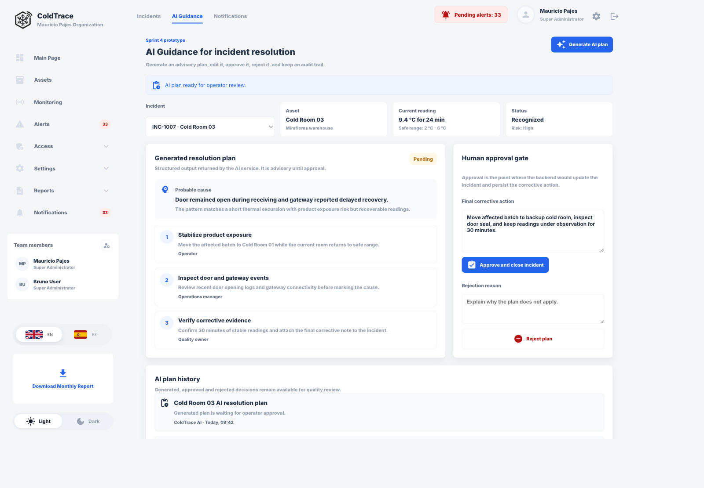

*Figure 4.5.1. AI Guidance prototype for incident resolution planning.*

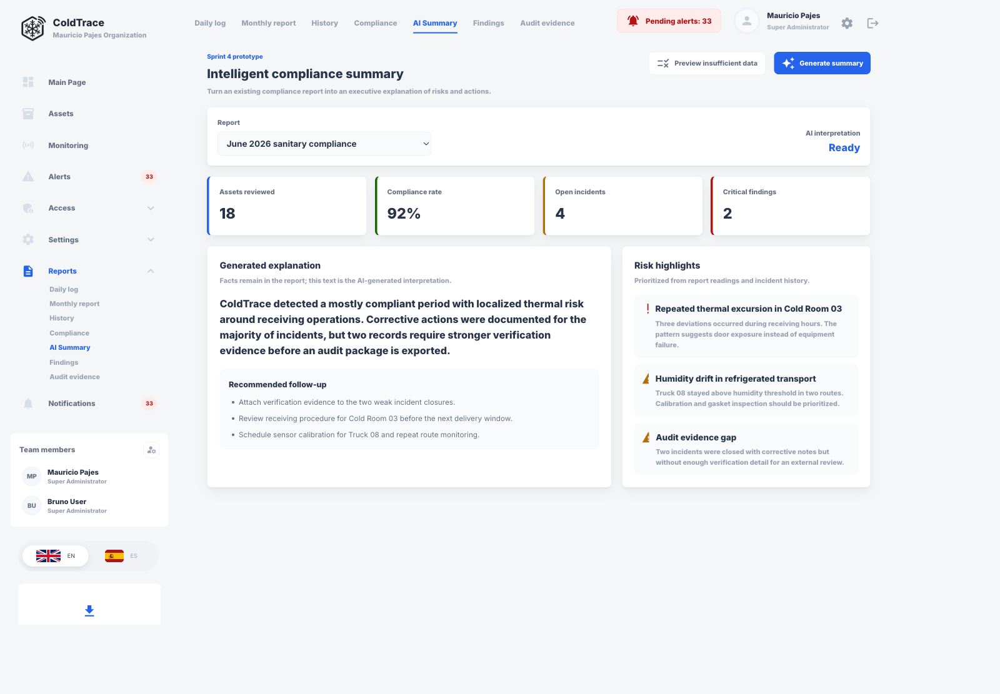

*Figure 4.5.2. AI Compliance Summary prototype for report interpretation.*

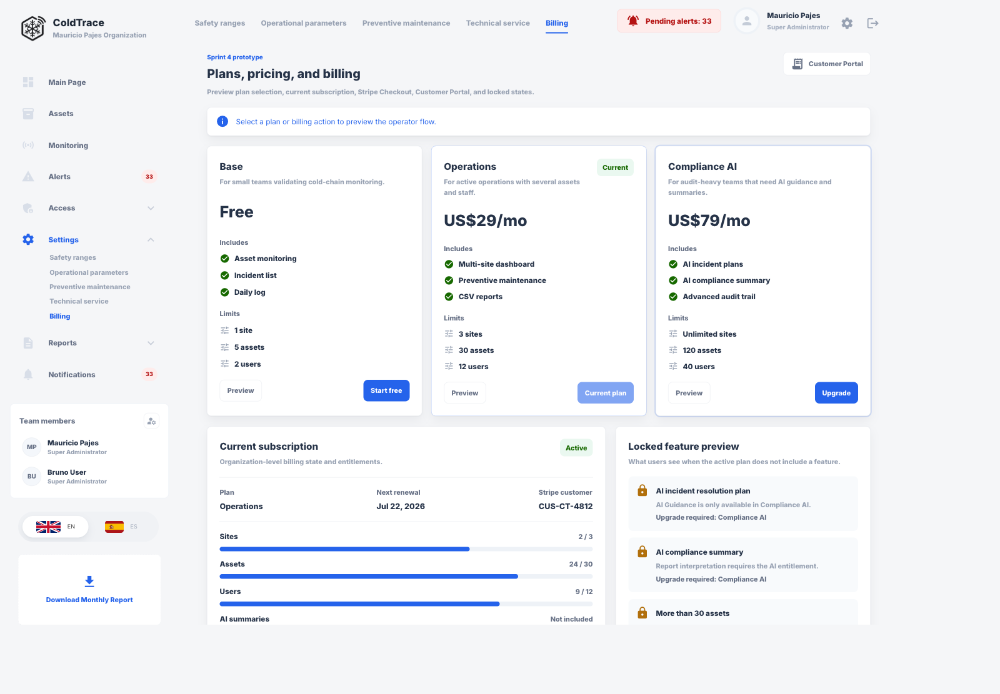

*Figure 4.5.3. In-app Billing prototype for SaaS subscription management.*

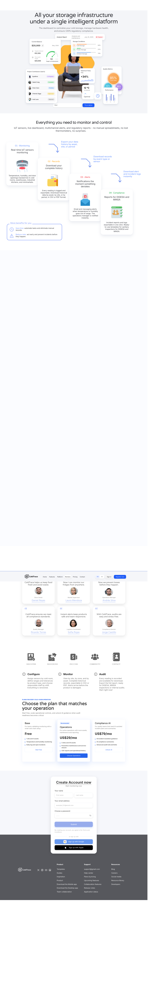

*Figure 4.5.4. Landing page pricing prototype with plan comparison.*

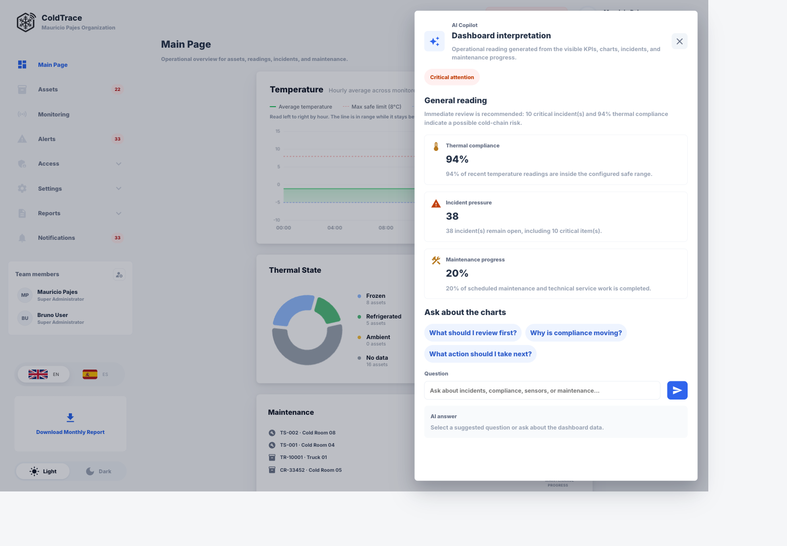

*Figure 4.5.5. Dashboard AI Insights prototype opened as an overlay panel.*

[Ver video demostrativo del prototipo de navegación – ColdTrace](https://upcedupe-my.sharepoint.com/:v:/g/personal/u202410093_upc_edu_pe/IQDF6wu_w86bRIH68kr6ehziAe9K_FC1ARRsa-i6G07RpXk?nav=eyJyZWZlcnJhbEluZm8iOnsicmVmZXJyYWxBcHAiOiJTdHJlYW1XZWJBcHAiLCJyZWZlcnJhbFZpZXciOiJTaGFyZURpYWxvZy1MaW5rIiwicmVmZXJyYWxBcHBQbGF0Zm9ybSI6IldlYiIsInJlZmVycmFsTW9kZSI6InZpZXcifX0%3D&e=FXKoP5)

---

## 4.6. Domain-Driven Software Architecture.

### 4.6.1. Design-Level Event Storming.


## 1. Bounded Context: Identity & Access
### Explicación
Este contexto gestiona el acceso de los usuarios al sistema mediante creación de cuenta, inicio de sesión, recuperación de contraseña, usuarios internos, roles y permisos. En la implementación frontend actual corresponde al módulo `identity-access`; en la arquitectura backend objetivo se proyecta como un servicio Spring Boot encargado de autenticación, autorización y administración de identidad.

### Justificación
Se separa este contexto porque la seguridad y la administración de acceso son aspectos críticos y transversales. Al aislar Identity & Access:
- Se reduce el riesgo de accesos no autorizados.
- Se facilita la implementación de mecanismos avanzados como OAuth, JWT o autenticación multifactor.
- Se evita mezclar usuarios, roles y permisos con la lógica operativa de activos, monitoreo o reportes.
- Permite escalar y mantener este módulo de forma independiente.


## 2. Bounded Context: Asset Management

### Explicación
Este contexto administra el ciclo de vida de los activos refrigerados y su infraestructura IoT: cámaras frigoríficas, unidades de transporte, sensores, gateways, estado de calibración, conectividad, rangos de seguridad y parámetros operativos. En la implementación frontend actual corresponde al módulo `asset-management`; en la arquitectura backend objetivo se proyecta como un servicio Spring Boot responsable de persistir y exponer la configuración operativa que consumen monitoreo, alertas y reportes.

### Justificación
Se separa porque la configuración de activos y dispositivos define el comportamiento del monitoreo. Al aislarlo:
- Se centraliza la lógica de activos, sensores, gateways, calibración y rangos.
- Se reducen errores por parámetros mal definidos.
- Se permite modificar reglas operativas sin afectar la captura de lecturas ni los reportes.
- Facilita la reutilización del modelo de activos en otras operaciones IoT.


## 3. Bounded Context: Monitoring

### Explicación
Es el núcleo operacional del sistema. Aquí se reciben, registran y consultan las lecturas de temperatura, humedad y conectividad. También se evalúa si las mediciones están dentro o fuera de los rangos definidos por Asset Management y se alimentan las vistas de dashboard. En la implementación frontend actual corresponde al módulo `monitoring`; en backend se proyecta como un servicio Spring Boot optimizado para telemetría e historial de lecturas.

### Justificación
Se separa porque es el proceso principal del negocio. Este contexto:
- Maneja alta carga de datos en tiempo real.
- Requiere eficiencia y baja latencia.
- Permite escalar de forma independiente (por ejemplo, usando streaming).
- Evita mezclar procesamiento de datos con visualización o alertas.


## 4. Bounded Context: Alerts

### Explicación
Se encarga de generar notificaciones cuando una medición está fuera de los rangos establecidos. También gestiona la visualización de alertas en el sistema.

### Justificación
Se desacopla para permitir una respuesta rápida ante eventos críticos:
- Permite implementar distintos canales de notificación (email, SMS, etc.).
- Evita sobrecargar el contexto de monitoreo.
- Facilita la extensión del sistema sin afectar la lógica principal.


## 5. Bounded Context: Reports & Compliance

### Explicación
Gestiona la generación, visualización y exportación de reportes operativos y evidencia de cumplimiento. Incluye bitácora diaria, historial de eventos, reportes sanitarios, reportes mensuales, hallazgos de cumplimiento y evidencia de auditoría. En la implementación frontend actual corresponde al módulo `reports`, incluyendo la vista `audit-evidence`; en backend se proyecta como un servicio Spring Boot encargado de consolidar información histórica y preparar evidencia exportable.

### Justificación
Se separa porque el análisis, cumplimiento y auditoría tienen necesidades distintas al procesamiento operativo:
- Requiere consultas complejas y agregaciones.
- Puede optimizarse con técnicas como caching o data warehousing.
- Evita afectar el rendimiento del monitoreo en tiempo real.
- Permite centralizar evidencia documental sin crear un bounded context de auditoría separado.


## 6. Bounded Context: Maintenance Management

### Explicación
Este contexto gestiona actividades de mantenimiento preventivo y solicitudes de servicio técnico asociadas a activos y dispositivos. En la implementación frontend actual corresponde al módulo `maintenance-management`; en backend se proyecta como un servicio Spring Boot que registra programación, atención, cierre y evidencia técnica de cada intervención.

### Justificación
Se separa porque el mantenimiento tiene un ciclo operativo propio:
- Permite planificar actividades preventivas sin mezclar esa lógica con el monitoreo.
- Conserva historial técnico por activo.
- Ayuda a relacionar fallas, alertas y acciones de soporte.
- Puede evolucionar hacia automatización de órdenes de trabajo sin afectar otros contextos.

## 7. Bounded Context: AI Assistance

### Explicación
Este contexto incorpora la guía de inteligencia artificial dentro del flujo operativo de ColdTrace. Su función es analizar una incidencia abierta, construir un contexto acotado con datos de activo, lectura, rangos, historial reciente y mantenimiento relacionado, y generar un plan de resolución pendiente de aprobación. También puede sintetizar reportes en lenguaje natural para facilitar la lectura de riesgos y acciones recomendadas.

### Justificación
Se separa porque la IA no debe modificar directamente el estado del negocio ni mezclarse con las reglas de Alertas, Monitoreo o Reportes. Al aislar AI Assistance:
- Se mantiene la IA como apoyo operativo y no como autoridad automática.
- Se exige aprobación humana antes de registrar acciones correctivas o cerrar incidencias.
- Se controla el contexto enviado al proveedor de modelo, evitando exponer datos innecesarios.
- Se facilita cambiar el proveedor LLM mediante Spring AI sin afectar los bounded contexts principales.

### Estrategia de proveedor de IA
La integración sigue el enfoque del material de Spring AI: el dominio de ColdTrace depende de un cliente de asistencia (`ChatClient`/`ChatModel` a través de un adapter) y no de un proveedor concreto. Para desarrollo local se propone `AI_MODEL_PROVIDER=ollama` con `AI_MODEL_NAME=gemma3:4b`, ejecutado mediante Ollama en la máquina del equipo. Para el despliegue académico en Cloud Run se propone `AI_MODEL_PROVIDER=openai` con `AI_MODEL_NAME=gpt-5.4-mini`, evitando cargar un modelo local dentro del contenedor. En ambos casos, las credenciales y URLs se configuran por entorno y nunca se registran en el repositorio. Esta arquitectura se apoya en la abstracción portable de Spring AI, su soporte para Ollama y OpenAI, la disponibilidad del modelo `gemma3` en Ollama y la documentación oficial de modelos/precios de OpenAI para controlar proveedor y costo por entorno (Spring AI, s. f.-a; Spring AI, s. f.-b; Spring AI, s. f.-c; Ollama, s. f.; OpenAI, s. f.-a; OpenAI, s. f.-b).

## 8. Bounded Context: Subscription & Billing

### Explicación
Este contexto administra planes SaaS, límites por plan, suscripciones de organizaciones, integración con Stripe, portal de cliente, sesiones de checkout y webhooks de ciclo de vida de pagos. También expone la política de entitlements que otros bounded contexts consultan para habilitar funcionalidades como reportes exportables, mantenimiento avanzado o asistencia de IA. La integración se fundamenta en Checkout Sessions para pagos/suscripciones alojadas, Customer Portal para autoservicio de facturación y webhooks para recibir eventos asincrónicos de Stripe (Stripe, s. f.-a; Stripe, s. f.-b; Stripe, s. f.-c).

### Justificación
Se separa porque monetización y pagos tienen reglas, riesgos e integración externa propios. Al aislar Subscription & Billing:
- Se evita mezclar lógica financiera con monitoreo o alertas operativas.
- Stripe queda encapsulado en un adapter y ColdTrace solo conserva estado de suscripción, identificadores de proveedor y permisos funcionales.
- Se facilita ofrecer un plan gratuito, un plan operativo y un plan profesional sin duplicar validaciones en todo el backend.
- Se habilita control de límites de uso por organización de forma consistente.


## Problemas Identificados y Relación con Contextos

- Datos inconsistentes del sensor → Monitoring
- Validación insuficiente → Monitoring
- Configuración manual del sensor → Asset Management
- Parámetros mal definidos → Asset Management
- Generación de reportes lenta → Reports & Compliance
- Proceso de auditoría manual → Reports & Compliance
- Seguimiento técnico reactivo → Maintenance Management
- Resolución manual e inconsistente de incidencias → AI Assistance + Alerts
- Necesidad de planes, límites y monetización SaaS → Subscription & Billing

### Justificación General
Estos problemas evidencian la necesidad de separar responsabilidades. La aplicación de Bounded Contexts permite:
- Reducir el acoplamiento entre módulos.
- Mejorar la mantenibilidad del sistema.
- Escalar componentes de forma independiente.
- Aplicar principios de Domain-Driven Design de manera efectiva.
- Incorporar IA y monetización como capacidades controladas, auditables y desacopladas.


### 4.6.2. Software Architecture Context Diagram.

El diagrama de contexto de ColdTrace muestra, de forma general, a los actores que interactúan con la plataforma y a los sistemas externos de los que depende. En esta vista se ubica a ColdTrace como sistema central y se identifican sus principales entradas y salidas, incluyendo sensores IoT, servicios de notificación, proveedores de identidad Google/Apple, proveedor de modelo de IA consumido mediante Spring AI y Stripe para el ciclo de vida de suscripciones. El proveedor de IA se mantiene intercambiable: Ollama local para desarrollo y OpenAI en el despliegue académico. La separación de Google/Apple como sistemas externos responde a que los flujos OpenID Connect/OAuth y Sign in with Apple validan identidad, mientras que ColdTrace conserva la autorización interna mediante organización, rol, permisos y JWT propio (Google Developers, s. f.-a; Google Developers, s. f.-b; Apple Developer, s. f.-a; Apple Developer, s. f.-b).


*Figure 4.6.2. ColdTrace System Context Diagram following the C4 model.*

> PlantUML source: [`assets/chapter-04/contextdiagram/contextdiagram.puml`](report/assets/chapter-04/contextdiagram/contextdiagram.puml).

### 4.6.3. Software Architecture Container Diagrams.

El diagrama de contenedores muestra cómo se divide ColdTrace en sus principales aplicaciones, servicios y bases de datos. En esta vista se identifican la landing page, la web application, el API Gateway, el IoT Gateway y los servicios Spring Boot proyectados por bounded context. Para el Sprint 4 se incorporan AI Assistance BC, Subscription & Billing BC y la integración de Identity & Access con proveedores externos de identidad Google/Apple, manteniendo a ColdTrace como responsable de organización, rol, permisos y JWT. AI Assistance consume Spring AI con selección por entorno (`ollama/gemma3:4b` local y `openai/gpt-5.4-mini` desplegado). Aunque la entrega actual funciona con Angular y `json-server`, este diagrama representa la arquitectura backend objetivo que dará soporte real a los módulos ya validados en frontend. Las dependencias externas de identidad, IA y pagos se documentan con referencias oficiales de Google, Apple, Spring AI, Ollama, OpenAI y Stripe para sustentar el diseño objetivo y sus restricciones de seguridad (Google Developers, s. f.-a; Apple Developer, s. f.-b; Spring AI, s. f.-a; Ollama, s. f.; OpenAI, s. f.-a; Stripe, s. f.-a).


*Figure 4.6.3. ColdTrace System Container Diagram.*

> PlantUML source: [`assets/chapter-04/containerdiagram/containerdiagram.puml`](report/assets/chapter-04/containerdiagram/containerdiagram.puml).

### 4.6.4. Software Architecture Components Diagrams.

En esta sección se presenta la vista de componentes de ColdTrace por bounded context, alineada con el backend Spring Boot actual ubicado en `coldtrace-platform` y con la ampliación objetivo del Sprint 4. Cada diagrama muestra REST controllers, command/query services, facades ACL, repositorios de dominio, adapters JPA, event handlers, adapters externos y tablas MySQL. Los componentes de AI Assistance y Subscription & Billing se documentan como diseño objetivo para implementar la guía inteligente de incidencias, los resúmenes de reportes y la monetización SaaS.

- **Component diagram - Identity & Access:** Shows organization sign-up, organization management, user management, social authentication with Google/Apple, role queries, permission metadata and the ACL facade consumed by other bounded contexts.


*Figure 4.6.4.1. Identity & Access BC Component Diagram.*

> PlantUML source: [`assets/chapter-04/diagramcomponents/component-autenticacion.puml`](report/assets/chapter-04/diagramcomponents/component-autenticacion.puml).

- **Component diagram - Asset Management:** Shows locations, assets, gateways, IoT devices, asset settings, organization validation and the facade used by Monitoring, Alerts, Reports and Maintenance.


*Figure 4.6.4.2. Asset Management BC Component Diagram.*

> PlantUML source: [`assets/chapter-04/diagramcomponents/component-sensores.puml`](report/assets/chapter-04/diagramcomponents/component-sensores.puml).

- **Component diagram - Monitoring:** Shows sensor reading registration, demo reading generation, query services, validation through Identity & Access and Asset Management facades, and the published reading snapshots.


*Figure 4.6.4.3. Monitoring BC Component Diagram.*

> PlantUML source: [`assets/chapter-04/diagramcomponents/component-monitoreo.puml`](report/assets/chapter-04/diagramcomponents/component-monitoreo.puml).

- **Component diagram - Alerts:** Shows incident creation, acknowledgement, escalation, corrective actions, resolution, notification read models and incident snapshots.


*Figure 4.6.4.4. Alerts BC Component Diagram.*

> PlantUML source: [`assets/chapter-04/diagramcomponents/component-alertas.puml`](report/assets/chapter-04/diagramcomponents/component-alertas.puml).

- **Component diagram - Reports:** Shows report generation from asset, reading and incident snapshots, persisted summary metrics and report query endpoints.


*Figure 4.6.4.5. Reports BC Component Diagram.*

> PlantUML source: [`assets/chapter-04/diagramcomponents/component-reportes.puml`](report/assets/chapter-04/diagramcomponents/component-reportes.puml).

- **Component diagram - Maintenance Management:** Shows the components responsible for scheduling preventive maintenance, registering technical service requests, and closing work with evidence.


*Figure 4.6.4.6. Maintenance Management BC Component Diagram.*

> PlantUML source: [`assets/chapter-04/diagramcomponents/component-auditoria.puml`](report/assets/chapter-04/diagramcomponents/component-auditoria.puml).

- **Component diagram - AI Assistance:** Shows AI resolution-plan generation, report summaries, bounded context assembly, Spring AI integration, environment-based provider selection, entitlement validation and the approval flow that applies incident changes only after operator confirmation.

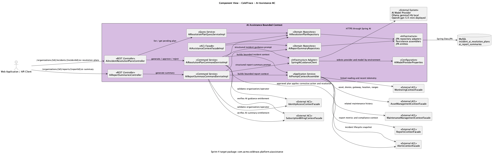

*Figure 4.6.4.7. AI Assistance BC Component Diagram.*

> PlantUML source: [`assets/chapter-04/diagramcomponents/component-ai-assistance.puml`](report/assets/chapter-04/diagramcomponents/component-ai-assistance.puml).

- **Component diagram - Subscription & Billing:** Shows plan queries, organization subscriptions, Stripe checkout, customer portal sessions, webhook reconciliation and the entitlement facade consumed by gated features.

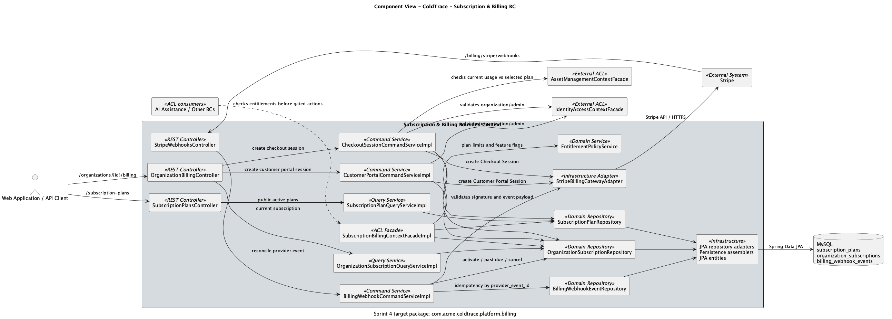

*Figure 4.6.4.8. Subscription & Billing BC Component Diagram.*

> PlantUML source: [`assets/chapter-04/diagramcomponents/component-billing.puml`](report/assets/chapter-04/diagramcomponents/component-billing.puml).

---

## 4.7. Software Object-Oriented Design.

### 4.7.1. Class Diagrams.

La documentación del diagrama de clases de ColdTrace se presenta en **tres etapas**. Las tres fueron actualizadas según las clases de dominio Java existentes en el backend actual y las clases objetivo definidas para la ampliación del Sprint 4.

El alcance de estos diagramas es el modelo DDD: aggregates, value objects, enums, domain events y repositories. Las clases de soporte de la capa de aplicación e interfaces, como commands, queries, resources, assemblers, failure records, controllers y service interfaces, se representan a nivel de componentes y endpoints en la sección 4.6, no como clases individuales dentro del diagrama de dominio.

#### Stage 1: DDD-oriented Class Diagram

En esta primera etapa se modela el dominio de ColdTrace con enfoque **DDD** y tipos Java. Aquí se identifican aggregates, value objects, domain events, enumeraciones y relaciones por identificador del backend actual, además de los aggregates objetivo necesarios para AI Assistance y Subscription & Billing.

Principales clases por bounded context:

- **BC Identity & Access:** `Organization`, `User`, `ExternalIdentity`, `Role`, `EmailAddress`, `RoleName`, `ExternalIdentityProvider` y `Permission`.
- **BC Asset Management:** `Location`, `Asset`, `Gateway`, `IoTDevice`, `AssetSettings`, `LocationName`, `AssetUuid`, `GatewayUuid`, `IoTDeviceUuid` y `AssetCreatedEvent`.
- **BC Monitoring:** `SensorReading` como aggregate de telemetría persistida.
- **BC Alerts:** `Incident`, `Notification`, `IncidentSeverity`, `IncidentStatus`, `NotificationChannel` y `NotificationStatus`.
- **BC Reports:** `Report`, que persiste métricas resumidas de activos, lecturas e incidentes.
- **BC Maintenance Management:** `MaintenanceSchedule` y `TechnicalServiceRequest`.
- **BC AI Assistance:** `IncidentAiResolutionPlan`, `AiReportSummary` y `AiPlanStatus`.
- **BC Subscription & Billing:** `SubscriptionPlan`, `OrganizationSubscription`, `BillingWebhookEvent`, `PlanCode` y `SubscriptionStatus`.

Las referencias entre bounded contexts se implementan con identificadores `Long` y facades ACL. Por ejemplo, `SensorReading` guarda `assetId`, `iotDeviceId`, `gatewayId` y `locationId`; `Incident` guarda `assetId`, `deviceId` y `readingId`; `TechnicalServiceRequest` puede guardar `incidentId`; `Report` almacena métricas agregadas en lugar de colecciones embebidas; `IncidentAiResolutionPlan` referencia la incidencia sin poseerla; y `OrganizationSubscription` referencia el plan por `PlanCode`.


*Figure 4.7.1.1. Stage 1 - DDD-oriented Class Diagram.*

> PlantUML source: [`assets/chapter-04/classdiagram/classdiagram-etapa1-ddd.puml`](report/assets/chapter-04/classdiagram/classdiagram-etapa1-ddd.puml).

#### Stage 2: Group Classes by Bounded Context

En esta segunda etapa las clases se agrupan según el bounded context al que pertenecen. Esto permite visualizar mejor las fronteras del dominio.

Agrupamiento aplicado en el diagrama:

- **BC Identity & Access** (azul claro): `Organization`, `User`, `ExternalIdentity`, `Role` y sus value objects/enums.
- **BC Asset Management** (rosado): `Location`, `Asset`, `Gateway`, `IoTDevice`, `AssetSettings`, sus value objects y `AssetCreatedEvent`.
- **BC Monitoring** (verde): `SensorReading`.
- **BC Alerts** (amarillo): `Incident`, `Notification` y sus enums de severidad, estado y canal.
- **BC Reports** (morado): `Report`.
- **BC Maintenance Management** (naranja): `MaintenanceSchedule` y `TechnicalServiceRequest`.
- **BC AI Assistance** (morado claro): `IncidentAiResolutionPlan`, `AiReportSummary` y `AiPlanStatus`.
- **BC Subscription & Billing** (gris): `SubscriptionPlan`, `OrganizationSubscription`, `BillingWebhookEvent`, `PlanCode` y `SubscriptionStatus`.

Las relaciones **internas a cada BC** quedan contenidas dentro del paquete correspondiente. Las relaciones entre bounded contexts aparecen como asociaciones por identificador o dependencias de facade ACL, ya que el backend evita navegar objetos de otros contextos directamente.


*Figure 4.7.1.2. Stage 2 - Group classes by Bounded Context.*

> PlantUML source: [`assets/chapter-04/classdiagram/classdiagram-etapa2-bc.puml`](report/assets/chapter-04/classdiagram/classdiagram-etapa2-bc.puml).

#### Stage 3: Value Object, Entity and Aggregate Identification

En esta tercera etapa las clases se clasifican como **Aggregate**, **Value Object**, **enum** y **DomainEvent** según el código actual y la extensión objetivo del Sprint 4. Las entidades JPA de persistencia no se mezclan con el modelo de dominio y se documentan en la sección de base de datos.

Con esta clasificación se cumple una regla fundamental de DDD: fuera del aggregate se referencia a otros contextos por identificadores o por snapshots obtenidos desde facades ACL. En el backend actual esos identificadores son `Long` y algunos identificadores de negocio se modelan como value objects (`AssetUuid`, `GatewayUuid`, `IoTDeviceUuid`, `LocationName`, `EmailAddress`, `RoleName`).

**BC Identity & Access.** Aggregates → `Organization`, `User`, `ExternalIdentity` y `Role`. Value Objects / enums → `EmailAddress`, `RoleName`, `ExternalIdentityProvider` y `Permission`. `ExternalIdentity` es la extensión objetivo de Sprint 4 para vincular Google/Apple mediante `provider + providerSubject`; no reemplaza la pertenencia a organización ni la asignación de roles de ColdTrace.


*Figure 4.7.1.3.1. Stage 3 - BC Identity & Access.*

> PlantUML source: [`assets/chapter-04/classdiagram/classdiagram-etapa3-bc-autenticacion.puml`](report/assets/chapter-04/classdiagram/classdiagram-etapa3-bc-autenticacion.puml).

**BC Asset Management.** Aggregates → `Location`, `Asset`, `Gateway`, `IoTDevice` y `AssetSettings`. Value Objects → `LocationName`, `AssetUuid`, `GatewayUuid` e `IoTDeviceUuid`. DomainEvent → `AssetCreatedEvent`, publicado por `Asset` cuando se registra un activo nuevo. El backend actual no contiene `Sensor`, `AssetBuilder`, `AssetDirector`, `TemperatureRange` ni `HumidityRange` como clases de dominio.


*Figure 4.7.1.3.2. Stage 3 - BC Asset Management.*

> PlantUML source: [`assets/chapter-04/classdiagram/classdiagram-etapa3-bc-gestion-sensores.puml`](report/assets/chapter-04/classdiagram/classdiagram-etapa3-bc-gestion-sensores.puml).

**BC Monitoring.** Aggregate → `SensorReading`, que persiste una lectura de telemetría con temperatura, humedad, indicador `outOfRange`, batería, señal y referencias al activo, dispositivo IoT, gateway y ubicación. También publica `SensorReadingRecordedEvent`.


*Figure 4.7.1.3.3. Stage 3 - BC Monitoring.*

> PlantUML source: [`assets/chapter-04/classdiagram/classdiagram-etapa3-bc-monitoreo.puml`](report/assets/chapter-04/classdiagram/classdiagram-etapa3-bc-monitoreo.puml).

**BC Alerts.** Aggregates → `Incident` y `Notification`. Enums → `IncidentSeverity`, `IncidentStatus`, `NotificationChannel` y `NotificationStatus`. También publica `IncidentOpenedEvent`. No existen aggregates `Alert` ni `AlertRule` en el backend actual.


*Figure 4.7.1.3.4. Stage 3 - BC Alerts.*

> PlantUML source: [`assets/chapter-04/classdiagram/classdiagram-etapa3-bc-alertas.puml`](report/assets/chapter-04/classdiagram/classdiagram-etapa3-bc-alertas.puml).

**BC Reports.** Aggregate → `Report`, que persiste métricas resumidas del periodo consultado: cantidad de activos, lecturas, lecturas fuera de rango, incidentes, incidentes abiertos, promedios y porcentaje de cumplimiento. También publica `ReportGeneratedEvent`.


*Figure 4.7.1.3.5. Stage 3 - BC Reports.*

> PlantUML source: [`assets/chapter-04/classdiagram/classdiagram-etapa3-bc-reportes.puml`](report/assets/chapter-04/classdiagram/classdiagram-etapa3-bc-reportes.puml).

**BC Maintenance Management.** Aggregates → `MaintenanceSchedule` y `TechnicalServiceRequest`. La evidencia de cierre está modelada como campo `evidence` dentro de `TechnicalServiceRequest`; no existe una clase `ServiceEvidence` independiente.


*Figure 4.7.1.3.6. Stage 3 - BC Maintenance Management.*

> PlantUML source: [`assets/chapter-04/classdiagram/classdiagram-etapa3-bc-auditoria.puml`](report/assets/chapter-04/classdiagram/classdiagram-etapa3-bc-auditoria.puml).

**BC AI Assistance.** Aggregates objetivo → `IncidentAiResolutionPlan` y `AiReportSummary`. `IncidentAiResolutionPlan` conserva el plan generado por IA, el estado pendiente/aprobado/rechazado, el borrador de acción correctiva, notas de resolución, evidencia requerida y auditoría de aprobación. La regla principal es que la IA no cierra una incidencia de forma autónoma: solo genera un plan pendiente y la aprobación del operador ejecuta el comando real del BC Alerts.

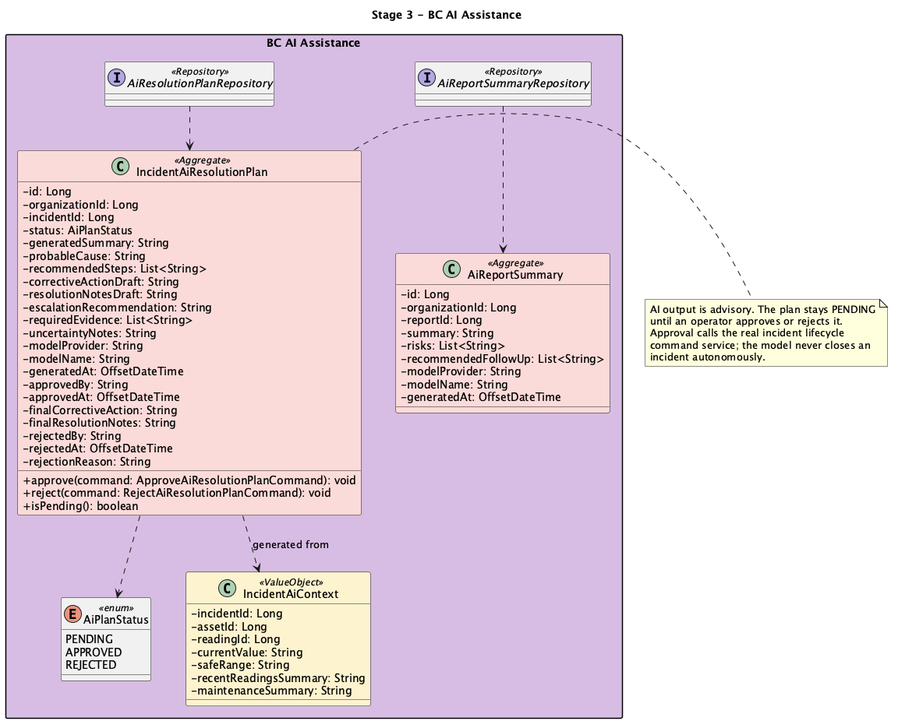

*Figure 4.7.1.3.7. Stage 3 - BC AI Assistance.*

> PlantUML source: [`assets/chapter-04/classdiagram/classdiagram-etapa3-bc-ai-assistance.puml`](report/assets/chapter-04/classdiagram/classdiagram-etapa3-bc-ai-assistance.puml).

**BC Subscription & Billing.** Aggregates objetivo → `SubscriptionPlan`, `OrganizationSubscription` y `BillingWebhookEvent`. `SubscriptionPlan` define límites y funcionalidades habilitadas; `OrganizationSubscription` conserva el estado vigente de la organización frente al proveedor; y `BillingWebhookEvent` permite procesar eventos de Stripe con idempotencia. El value object `PlanCode` evita depender de identificadores internos para enlazar el plan contratado.

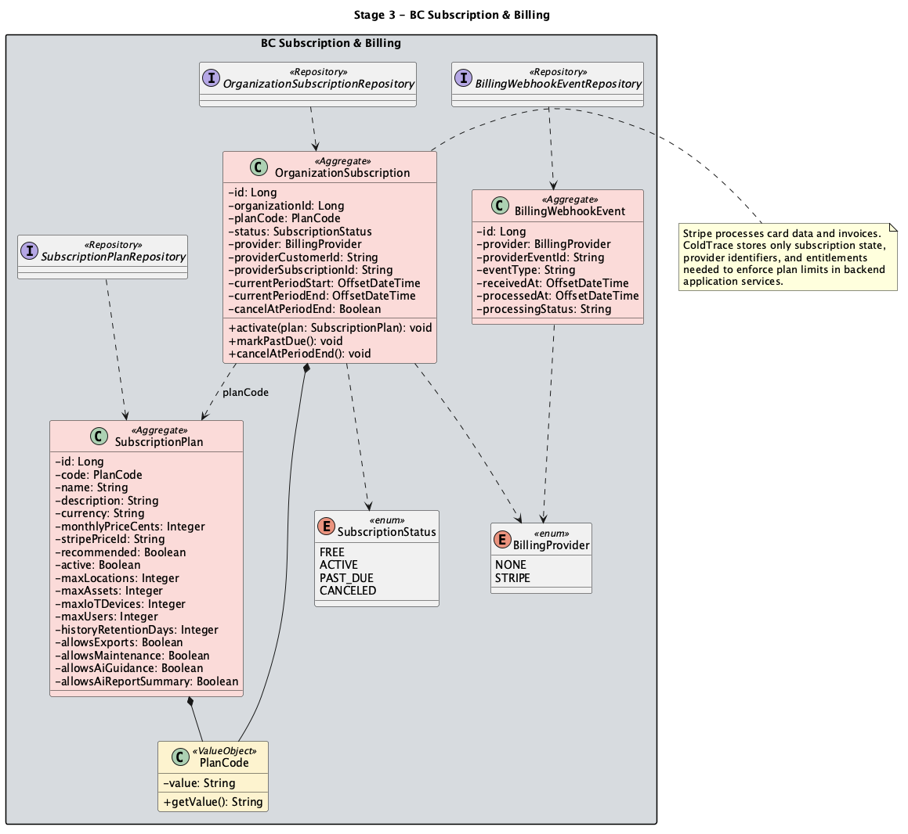

*Figure 4.7.1.3.8. Stage 3 - BC Subscription & Billing.*

> PlantUML source: [`assets/chapter-04/classdiagram/classdiagram-etapa3-bc-billing.puml`](report/assets/chapter-04/classdiagram/classdiagram-etapa3-bc-billing.puml).

---

## 4.8. Database Design.

### 4.8.1. Database Diagrams.

El diagrama de base de datos se actualizó desde las entidades JPA reales del backend y el diseño objetivo del Sprint 4. La configuración actual usa MySQL, Hibernate `ddl-auto=update` y `SnakeCasePhysicalNamingStrategy`, por lo que los nombres de columna se derivan de los atributos Java en `snake_case`. Las relaciones se muestran como **logical FK** cuando el código usa campos `Long` en lugar de anotaciones `@ManyToOne`.

La ampliación agrega `external_identities` para vincular identidades Google/Apple a usuarios internos sin usar el email como única llave permanente. También agrega `incident_ai_resolution_plans` y `ai_report_summaries` para conservar salidas de IA con auditoría de aprobación, además de `subscription_plans`, `organization_subscriptions` y `billing_webhook_events` para soportar planes SaaS, entitlements y sincronización con Stripe sin almacenar datos sensibles de pago en ColdTrace.


*Figure 4.8.1.1. ColdTrace Entity-Relationship Diagram normalized to 3NF.*

> PlantUML source: [`assets/chapter-04/databasediagram/databasediagram.puml`](report/assets/chapter-04/databasediagram/databasediagram.puml).

# Capítulo V: Product Implementation, Validation & Deployment

## 5.1. Software Configuration Management

### 5.1.1. Software Development Environment Configuration

En esta sección se describen las herramientas de software utilizadas por el equipo para el desarrollo colaborativo del proyecto. Estas plataformas permiten organizar el trabajo, diseñar la experiencia de usuario, modelar procesos, gestionar el código fuente y documentar el avance del producto durante su ciclo de vida. La selección de estas herramientas responde a la necesidad de mantener un entorno de trabajo colaborativo, accesible y alineado con las prácticas del curso.

### GitHub

Plataforma utilizada para guardar las versiones del proyecto y gestionar la colaboración mediante ramas, commits y pull requests.

[GitHub](https://github.com/)


### Uxpressia

Herramienta utilizada para la elaboración de user personas e impact mapping.

[UXPressia](https://uxpressia.com/)


### Miro

Plataforma utilizada para el event storming y la organización visual de ideas del proyecto.

[Miro](https://miro.com/)


### Figma

La herramienta usada para desarrollo conjunto de wireframes y mockups.

[Figma](https://www.figma.com/)


### 5.1.2. Source Code Management

La gestión del código fuente del proyecto se realizó mediante la plataforma GitHub, la cual permitió organizar, controlar y dar seguimiento a los cambios realizados durante el desarrollo de los productos de software y del informe.

Los repositorios usados fueron:

- Repositorio del informe del proyecto: https://github.com/ICEQ2026/informe-del-proyecto
- Repositorio de la landing page: https://github.com/ICEQ2026/landingpage-coldtrace
- Repositorio de la Frontend Web Application: https://github.com/ICEQ2026/coldtrace-frontend
- Repositorio del Server Side Software / RESTful API: https://github.com/ICEQ2026/coldtrace-platform

Estos repositorios cubren los productos de software definidos en el alcance del proyecto: Landing Page, Frontend Web Application y Server Side Software. El repositorio del informe contiene la estructura completa de la documentación, organizada por capítulos, lo que permite una gestión modular y colaborativa del contenido.

### Workflow de Control de Versiones

Para la gestión del desarrollo se utilizó un flujo de trabajo basado en ramas, donde cada integrante del equipo trabajó de manera independiente sobre una rama específica antes de integrar sus cambios a la rama principal.

Las ramas identificadas en el repositorio son:

- **main**: rama principal que contiene la versión estable del proyecto.
- **feature/**: ramas utilizadas para el desarrollo de secciones específicas del informe.

<p align="center">
  
</p>

<p align="center">
  Ramas del repositorio del proyecto, evidenciando el uso de ramas feature para el desarrollo independiente de cada sección.
</p>

### Convenciones de Ramas

Se utilizó una convención de nombres basada en el contenido desarrollado, lo cual se evidencia en las siguientes ramas:

- feature/14-chapter-05
- feature/13-chapter-04
- feature/12-chapter-03
- feature/15-chapter-06
- feature/99-bibliography

Cada rama representa un capítulo o sección del informe, permitiendo que los integrantes trabajen de forma paralela sin interferir en el trabajo de otros.

Este enfoque facilita la organización del proyecto y permite una integración más controlada de los cambios.

### Conventional Commits

Para estandarizar los mensajes de commits, se utilizó la convención de Conventional Commits, permitiendo clasificar los cambios realizados y mejorar la trazabilidad del repositorio.

<p align="center">
  
</p>

<p align="center">
  Commits realizados evidenciando el uso de Conventional Commits para clasificar los tipos de cambios.
</p>

Los tipos de commits utilizados incluyen:

- **feat**: incorporación de nuevo contenido
- **docs**: modificaciones en la documentación
- **fix**: corrección de errores
- **chore**: tareas de mantenimiento

El uso de estas convenciones facilita la comprensión del historial de cambios y mejora la colaboración entre los integrantes del equipo.

La evidencia mostrada refleja el uso de un flujo de trabajo basado en ramas feature, permitiendo una correcta organización del desarrollo y facilitando la integración de los aportes de cada integrante.

### 5.1.3. Source Code Style Guide & Conventions

Con el objetivo de garantizar la consistencia, legibilidad y mantenibilidad del proyecto, el equipo definió una guía de estilo basada en la estructura real de la Landing Page y en buenas prácticas de desarrollo web. Estas convenciones permiten que todos los integrantes trabajen de manera ordenada, facilitan la colaboración en el repositorio y mejoran la escalabilidad del producto.

Siguiendo lo solicitado por el curso, se adoptó el uso de nomenclatura en inglés para los elementos del código fuente. Además, se establecieron criterios comunes para la organización de archivos, definición de estilos, escritura de scripts y manejo de contenidos multilenguaje.

#### Naming conventions

Se utilizó nomenclatura en inglés para todos los elementos del código. Los archivos fueron nombrados según su funcionalidad, lo que facilita su comprensión y mantenimiento.

Ejemplos del proyecto:

- `navigation.js` → manejo de navegación
- `scroll-reveal.js` → animaciones
- `variables.css` → variables de diseño
- `en-US.json` → traducciones en inglés

Estas convenciones permiten identificar rápidamente el propósito de cada archivo.

#### CSS Style Guide

Para mantener la consistencia visual, se definieron variables globales en CSS que permiten reutilizar colores, tipografías y espaciados en toda la aplicación:

```css
:root {
  --color-primary: #1b59f8;
  --color-secondary-purple: #b899eb;

  --font-family-base: "Inter", "Helvetica Neue", Arial, sans-serif;

  --spacing-md: 16px;
  --spacing-xl: 48px;

  --radius-md: 8px;
}
```

El uso de variables CSS permite centralizar el diseño visual, evitando duplicidad de valores y facilitando futuras modificaciones.

#### JavaScript Conventions

Los archivos JavaScript fueron organizados por funcionalidad, promoviendo la modularidad del código. Se utilizaron funciones con nombres descriptivos en inglés y estructuras claras.

Ejemplo del proyecto:

```js
const toggleMobileMenu = () => {
  if (!moreButton || !mobileMenu) return;

  if (mobileMenu.classList.contains('is-open')) {
    closeMobileMenu();
    return;
  }

  openMobileMenu();
};
```

Este enfoque mejora la legibilidad del código y facilita su mantenimiento.

#### Internacionalización (i18n)

El proyecto incluye soporte para múltiples idiomas mediante archivos JSON ubicados en `assets/locales/`. Cada archivo contiene las traducciones utilizadas en la interfaz.

Ejemplo:

```json
{
  "hero": {
    "title": "All your storage infrastructure under a single intelligent platform",
    "ctaDemo": "Try a demo"
  }
}
```

La implementación de internacionalización permite que la aplicación sea escalable a diferentes mercados y mejora la experiencia del usuario.

### 5.1.4. Software Deployment Configuration

En esta sección se describe la configuración del despliegue de la solución, incluyendo los pasos necesarios para que, a partir del repositorio de código fuente, se logre la publicación satisfactoria de la Landing Page del proyecto.

El despliegue de la solución se realizó utilizando GitHub, aprovechando sus funcionalidades para la publicación de sitios web estáticos.

### Configuración del despliegue de la Landing Page

1. Para el despliegue de la Landing Page se creó un repositorio en la organización alojada en GitHub, el cual contiene todos los archivos del proyecto desarrollados en HTML, CSS y JavaScript.

<p align="center">
  
</p>

<p align="center">
  Repositorio de la Landing Page utilizado para el despliegue del proyecto.
</p>

2. Se realizó un push al repositorio con todos los archivos que contenían la Landing Page.

<p align="center">
  
</p>

<p align="center">
  Uso de ramas para el desarrollo e integración de cambios antes del despliegue.
</p>

3. Se crearon branches para la actualización continua del repositorio, donde cada cambio realizado por el equipo eventualmente será agregado a la rama principal.

<p align="center">
  
</p>

<p align="center">
  Uso de ramas para el desarrollo e integración de cambios antes del despliegue.
</p>

Una vez integrados los cambios en la rama principal (`main`), se configuró GitHub Pages para publicar automáticamente el contenido del repositorio, permitiendo que la Landing Page sea accesible mediante una URL pública.

Este proceso permite que cada actualización realizada mediante commits y pushes al repositorio se refleje automáticamente en la versión desplegada del sitio web.

### Validación del despliegue

Después del despliegue, se realizaron pruebas para asegurar el correcto funcionamiento de la Landing Page, verificando:

- la carga adecuada del sitio web;
- la navegación entre secciones;
- la correcta ejecución de scripts en JavaScript;
- la adaptación a distintos dispositivos (responsive design);
- la consistencia del contenido multilenguaje.

El uso de GitHub como plataforma de control de versiones y despliegue permite mantener una trazabilidad completa de los cambios, facilitando la colaboración del equipo y asegurando una publicación continua del proyecto.

## 5.2. Landing Page, Services & Applications Implementation

### 5.2.1. Sprint 1

#### 5.2.1.1. Sprint Planning 1

<table border="1" cellpadding="6" cellspacing="0">
  <tr>
    <th>Sprint #</th>
    <td>Sprint 1</td>
  </tr>

  <tr>
    <th colspan="2">Sprint Planning Background</th>
  </tr>

  <tr>
    <th>Date</th>
    <td>2026-04-20</td>
  </tr>

  <tr>
    <th>Time</th>
    <td>08:00 PM</td>
  </tr>

  <tr>
    <th>Location</th>
    <td>Reunión virtual vía Google Meet</td>
  </tr>

  <tr>
    <th>Prepared By</th>
    <td>Pajés León, Mauricio Luis</td>
  </tr>

  <tr>
    <th>Attendees (to planning meeting)</th>
    <td>Morales Venegas, David Joel / Espinoza Paredes, Frezzia / Cabrera Novoa, Leonardo Moisés / Videla Ventura, Jorge Joseph</td>
  </tr>

  <tr>
    <th>Sprint 1 Review Summary</th>
    <td>Como punto de partida, el equipo logró definir el alcance del producto ColdTrace, estructurar los capítulos iniciales del informe y desarrollar una primera versión funcional de la landing page con secciones clave y vistas básicas como dashboard, monitoreo y alertas. Esto permitió validar la dirección del proyecto y asegurar coherencia entre la propuesta de valor y la implementación inicial.
</td>
  </tr>

  <tr>
    <th>Sprint 1 Retrospective Summary</th>
    <td>Durante este primer sprint, el equipo identificó oportunidades de mejora relacionadas con la organización del tiempo y la coordinación entre integrantes. Si bien se lograron avances importantes en el desarrollo de la landing page, la distribución de tareas pudo ser más equilibrada. Como mejora, se propone fortalecer la comunicación, definir entregables más claros por integrante y establecer reuniones más frecuentes para hacer seguimiento al avance del proyecto.
</td>
  </tr>

  <tr>
    <th colspan="2">Sprint Goal & User Stories</th>
  </tr>

  <tr>
    <th>Sprint 1 Goal</th>
    <td>Desarrollar una primera versión funcional de la landing page de ColdTrace e implementar vistas básicas del sistema (dashboard, monitoreo y alertas) que permitan simular el flujo de monitoreo de la cadena de frío. El cumplimiento se medirá mediante la correcta visualización de la landing page y la navegación entre secciones funcionales.</td>
  </tr>

  <tr>
    <th>Sprint 1 Velocity</th>
    <td>20 Story Points</td>
  </tr>

  <tr>
    <th>Sum of Story Points</th>
    <td>20 Story Points</td>
  </tr>
</table>

#### 5.2.1.2. Aspect Leaders and Collaborators.

<table border="1" cellpadding="6" cellspacing="0">
  <tr>
    <th>Team Member (Last Name, First Name)</th>
    <th>GitHub Username</th>
    <th>Landing Page Development</th>
    <th>Dashboard & Monitoring Views</th>
    <th>Alerts Simulation</th>
    <th>Frontend Styling (CSS & UI)</th>
    <th>Repository & Version Control</th>
  </tr>

  <tr>
    <td>Cabrera Novoa, Leonardo Moisés</td>
    <td>[u202415820]</td>
    <td>C</td>
    <td>C</td>
    <td>C</td>
    <td>L</td>
    <td>L</td>
  </tr>

  <tr>
    <td>Espinoza Paredes, Frezzia</td>
    <td>[fflushh]</td>
    <td>C</td>
    <td>L</td>
    <td>L</td>
    <td>C</td>
    <td>C</td>
  </tr>

  <tr>
    <td>Morales Venegas, David Joel</td>
    <td>[David-std2]</td>
    <td>L</td>
    <td>C</td>
    <td>C</td>
    <td>C</td>
    <td>L</td>
  </tr>

  <tr>
    <td>Pajés León, Mauricio Luis</td>
    <td>[mauricio-pajes]</td>
    <td>L</td>
    <td>C</td>
    <td>L</td>
    <td>L</td>
    <td>C</td>
  </tr>

  <tr>
    <td>Videla Ventura, Jorge Joseph</td>
    <td>[JorgeVidVen]</td>
    <td>C</td>
    <td>L</td>
    <td>C</td>
    <td>C</td>
    <td>C</td>
  </tr>
</table>

### 5.2.1.3. Sprint Backlog 1.

Para cumplir con la descomposición de User Stories en Engineering Tasks, los work items del Sprint 1 fueron documentados con estimaciones entre 4 y 8 horas. Esta granularidad permite evidenciar tareas suficientemente pequeñas para seguimiento diario, pero con alcance claro para desarrollo, revisión y cierre dentro del sprint.

<table border="1" cellpadding="6" cellspacing="0" style="border-collapse: collapse; text-align: center;">

  <tr>
    <th>Sprint #</th>
    <td colspan="7">Sprint 1</td>
  </tr>

  <tr>
    <th colspan="2">User Story</th>
    <th colspan="6">Work-Item / Task</th>
  </tr>

  <tr>
    <th>Id</th>
    <th>Title</th>
    <th>Id</th>
    <th>Title</th>
    <th>Description</th>
    <th>Estimation (Hours)</th>
    <th>Assigned To</th>
    <th>Status</th>
  </tr>

  <!-- LANDING -->
  <tr>
    <td>US001</td>
    <td>Propuesta de valor</td>
    <td>T-01</td>
    <td>Hero Section</td>
    <td>Implementar header, navbar y hero section</td>
    <td>4</td>
    <td>Mauricio Pajés</td>
    <td>Done</td>
  </tr>

  <tr>
    <td>US002</td>
    <td>Funcionalidades</td>
    <td>T-02</td>
    <td>Features Section</td>
    <td>Desarrollar sección de funcionalidades del sistema</td>
    <td>4</td>
    <td>Frezzia Espinoza</td>
    <td>Done</td>
  </tr>

  <tr>
    <td>US003</td>
    <td>Cómo funciona</td>
    <td>T-03</td>
    <td>Showcase Section</td>
    <td>Implementar secciones de producto y testimonios</td>
    <td>4</td>
    <td>Mauricio Pajés</td>
    <td>Done</td>
  </tr>

  <tr>
    <td>US004</td>
    <td>Contacto</td>
    <td>T-04</td>
    <td>Signup Section</td>
    <td>Agregar formulario de registro y pricing overview</td>
    <td>4</td>
    <td>Mauricio Pajés</td>
    <td>Done</td>
  </tr>

  <tr>
    <td>US005</td>
    <td>Navegación</td>
    <td>T-05</td>
    <td>Navbar Behavior</td>
    <td>Implementar navegación y estructura del header</td>
    <td>4</td>
    <td>Mauricio Pajés</td>
    <td>Done</td>
  </tr>

  <tr>
    <td>US006</td>
    <td>Responsive</td>
    <td>T-06</td>
    <td>Responsive UI</td>
    <td>Adaptar landing page a dispositivos móviles</td>
    <td>4</td>
    <td>Leonardo Cabrera</td>
    <td>Done</td>
  </tr>

  <!-- DASHBOARD -->
  <tr>
    <td>US018</td>
    <td>Monitoreo</td>
    <td>T-07</td>
    <td>Dashboard UI</td>
    <td>Simular dashboard con datos de temperatura</td>
    <td>5</td>
    <td>Jorge Videla</td>
    <td>Done</td>
  </tr>

  <tr>
    <td>US021</td>
    <td>Alertas</td>
    <td>T-08</td>
    <td>Alerts UI</td>
    <td>Implementar alertas visuales en la interfaz</td>
    <td>4</td>
    <td>Frezzia Espinoza</td>
    <td>Done</td>
  </tr>

  <!-- REPO -->
  <tr>
    <td>-</td>
    <td>Repositorio</td>
    <td>T-09</td>
    <td>GitHub Setup</td>
    <td>Configurar repositorio, ramas y estructura del proyecto</td>
    <td>4</td>
    <td>Leonardo Cabrera</td>
    <td>Done</td>
  </tr>

</table>

### 5.2.1.4. Development Evidence for Sprint Review.

<table border="1" cellpadding="6" cellspacing="0" style="border-collapse: collapse;">

  <tr>
    <th>Repository</th>
    <th>Branch</th>
    <th>Commit Id</th>
    <th>Commit Message</th>
    <th>Commit Message Body</th>
    <th>Committed on (Date)</th>
  </tr>

  <tr>
    <td>ICEQ2026/landingpage-coldtrace</td>
    <td>main</td>
    <td>084f1ec</td>
    <td>Initial commit</td>
    <td>Creación inicial del repositorio del proyecto</td>
    <td>21/04/2026</td>
  </tr>

  <tr>
    <td>ICEQ2026/landingpage-coldtrace</td>
    <td>feature/header-hero</td>
    <td>a388ed9</td>
    <td>feat(header-hero): add header navbar and hero section</td>
    <td>Implementación del header, navbar y sección principal de la landing</td>
    <td>22/04/2026</td>
  </tr>

  <tr>
    <td>ICEQ2026/landingpage-coldtrace</td>
    <td>feature/app-features</td>
    <td>b3ab8b8</td>
    <td>feat(landing-page): adding app features section</td>
    <td>Desarrollo de la sección de funcionalidades del producto</td>
    <td>22/04/2026</td>
  </tr>

  <tr>
    <td>ICEQ2026/landingpage-coldtrace</td>
    <td>feature/showcase-why</td>
    <td>e440ecd</td>
    <td>feat(landing-page): add product showcase and testimonials sections</td>
    <td>Implementación de secciones de presentación del producto y testimonios</td>
    <td>23/04/2026</td>
  </tr>

  <tr>
    <td>ICEQ2026/landingpage-coldtrace</td>
    <td>feature/overview-signup</td>
    <td>889c23a</td>
    <td>feat(overview-signup): add pricing overview and signup form sections</td>
    <td>Implementación de sección de precios y formulario de registro</td>
    <td>23/04/2026</td>
  </tr>

  <tr>
    <td>ICEQ2026/landingpage-coldtrace</td>
    <td>feature/footer</td>
    <td>fa060dc</td>
    <td>feat(landing-page): add site footer with brand, social links and nav columns</td>
    <td>Desarrollo del footer con enlaces y estructura de navegación</td>
    <td>23/04/2026</td>
  </tr>

  <tr>
    <td>ICEQ2026/landingpage-coldtrace</td>
    <td>docs/update-readme</td>
    <td>e18ba06</td>
    <td>docs(readme): add project overview, structure and team info</td>
    <td>Documentación del proyecto incluyendo estructura y equipo</td>
    <td>23/04/2026</td>
  </tr>

</table>


#### 5.2.1.5. Execution Evidence for Sprint Review

Durante el Sprint 1 se desarrolló una versión funcional de la landing page de ColdTrace, permitiendo visualizar la propuesta de valor del producto, así como una simulación de las principales funcionalidades del sistema, como monitoreo y alertas.

A continuación, se presentan evidencias visuales de la implementación:

**Landing Page – Sección principal**


La navegación entre secciones se realiza mediante un menú fijo (navbar), facilitando la experiencia del usuario. Asimismo, la interfaz es responsive, adaptándose a distintos dispositivos.

#### 5.2.1.6. Services Documentation Evidence for Sprint Review

Durante el Sprint 1, no se implementaron Web Services ni endpoints documentados, debido a que el alcance del sprint estuvo enfocado en el desarrollo de la landing page y la simulación de funcionalidades del sistema ColdTrace a nivel frontend.

Sin embargo, como parte del diseño del sistema, se definieron de manera conceptual los principales endpoints que serán implementados en futuros sprints para soportar funcionalidades clave como monitoreo en tiempo real, gestión de alertas y registro de usuarios.

A continuación, se presentan los endpoints identificados:

<table border="1" cellpadding="6" cellspacing="0">
  <tr>
    <th>Endpoint</th>
    <th>Method</th>
    <th>Descripción</th>
    <th>Ejemplo de respuesta</th>
  </tr>

  <tr>
    <td>/api/temperature</td>
    <td>GET</td>
    <td>Obtiene los datos de temperatura registrados por los sensores</td>
    <td>{ "sensorId": "001", "temperature": 5.6, "timestamp": "2026-04-23" }</td>
  </tr>

  <tr>
    <td>/api/alerts</td>
    <td>GET</td>
    <td>Lista las alertas generadas por el sistema</td>
    <td>{ "alert": "Temperatura fuera de rango", "value": -5.3 }</td>
  </tr>

  <tr>
    <td>/api/users</td>
    <td>POST</td>
    <td>Permite registrar nuevos usuarios en la plataforma</td>
    <td>{ "status": "User created successfully" }</td>
  </tr>

</table>

La documentación formal de estos endpoints mediante OpenAPI, así como su implementación en Web Services, será desarrollada en los siguientes sprints del proyecto.

Asimismo, se prevé la integración con una arquitectura backend que permita la gestión de datos en tiempo real y la persistencia de información generada por los sensores IoT.

#### 5.2.1.7. Software Deployment Evidence for Sprint Review

Durante el Sprint 1 se realizó el despliegue de la landing page utilizando GitHub Pages, permitiendo publicar el proyecto en un entorno accesible desde la web.

El proceso incluyó la configuración del repositorio, la integración de cambios mediante Pull Requests y la automatización del despliegue.

** Deployment en GitHub Pages**


Se evidencia el despliegue exitoso del proyecto en GitHub Pages, mostrando el estado activo del entorno y la publicación reciente de la landing page.

**URL de despliegue:**
https://iceq2026.github.io/landingpage-coldtrace/

#### 5.2.1.8. Team Collaboration Insights during Sprint

Durante el Sprint 1, el equipo trabajó de manera colaborativa utilizando GitHub como herramienta principal de control de versiones.

Se utilizaron ramas feature para desarrollar funcionalidades de forma independiente, integrando cambios mediante Pull Requests hacia la rama principal.

---

**Analíticos de colaboración en GitHub**


Se observa la actividad del repositorio, incluyendo commits realizados, pull requests y participación de los integrantes del equipo. Esto evidencia un trabajo colaborativo activo durante el Sprint.

---

El uso de Conventional Commits permitió mantener un historial organizado, diferenciando claramente entre funcionalidades (feat), documentación (docs) y configuración (chore).

Estas prácticas facilitaron la coordinación del equipo y la integración eficiente del desarrollo.

### 5.2.2. Sprint 2

#### 5.2.2.1. Sprint Planning 2

El Sprint 2 tuvo como objetivo principal desplegar la primera versión funcional de la Frontend Web Application de ColdTrace, cubriendo los bounded contexts de Identity & Access Management, Asset Management, Monitoring y Reports. A continuación se presenta el resumen del Sprint Planning Meeting realizado al inicio de este sprint.

<table border="1" cellpadding="6" cellspacing="0">
  <tr>
    <th>Sprint #</th>
    <td>Sprint 2</td>
  </tr>
  <tr>
    <th colspan="2">Sprint Planning Background</th>
  </tr>
  <tr>
    <th>Date</th>
    <td>2026-05-07</td>
  </tr>
  <tr>
    <th>Time</th>
    <td>08:00 PM</td>
  </tr>
  <tr>
    <th>Location</th>
    <td>Reunión virtual vía Google Meet</td>
  </tr>
  <tr>
    <th>Prepared By</th>
    <td>Pajés León, Mauricio Luis</td>
  </tr>
  <tr>
    <th>Attendees (to planning meeting)</th>
    <td>Morales Venegas, David Joel / Espinoza Paredes, Frezzia / Cabrera Novoa, Leonardo Moisés / Videla Ventura, Jorge Joseph / Pajés León, Mauricio Luis</td>
  </tr>
  <tr>
    <th>Sprint 1 Review Summary</th>
    <td>En el Sprint 1 se completó una primera versión funcional de la landing page de ColdTrace desplegada en GitHub Pages, con secciones de hero, features, showcase, pricing y footer. Se implementaron además las vistas básicas de dashboard, monitoreo y alertas como prueba de concepto del sistema. El equipo logró cumplir con el Sprint Goal y asegurar la coherencia visual entre la landing y la aplicación web. El despliegue fue exitoso y la landing page quedó accesible públicamente.</td>
  </tr>
  <tr>
    <th>Sprint 1 Retrospective Summary</th>
    <td>El equipo identificó que la distribución de tareas en el Sprint 1 fue desigual y que la comunicación entre integrantes podría mejorar. Como acción de mejora para el Sprint 2 se acordó dividir el trabajo por épicas y bounded contexts, asignar un responsable por aspecto funcional, e incorporar a todos los integrantes en la implementación del frontend distribuida según las épicas del product backlog.</td>
  </tr>
  <tr>
    <th colspan="2">Sprint Goal & User Stories</th>
  </tr>
  <tr>
    <th>Sprint 2 Goal</th>
    <td>Our focus is on delivering a fully navigable and deployed Frontend Web Application for ColdTrace operators and administrators. We believe it delivers a usable digital experience to cold chain operations managers and quality control staff, enabling them to manage assets, monitor temperature conditions, and consult operational reports. This will be confirmed when the application is accessible via its public Vercel URL and users can navigate across Identity & Access, Asset Management, Monitoring, and Reports modules without errors.</td>
  </tr>
  <tr>
    <th>Sprint 2 Velocity</th>
    <td>40 Story Points</td>
  </tr>
  <tr>
    <th>Sum of Story Points</th>
    <td>40 Story Points</td>
  </tr>
</table>

#### 5.2.2.2. Aspect Leaders and Collaborators

Durante el Sprint 2, el equipo organizó el trabajo en torno a los principales aspectos funcionales de la Frontend Web Application de ColdTrace. Cada aspecto corresponde a una épica del product backlog o a un conjunto de features dentro de un bounded context. Se designó un líder (L) por aspecto para asegurar la coherencia técnica y la toma de decisiones dentro de cada módulo, y se asignaron colaboradores (C) entre los demás integrantes del equipo.

Los aspectos principales del Sprint 2 fueron los siguientes:

- **Authentication & User Access (EP002):** Vistas de creación de cuenta, inicio de sesión, recuperación de contraseña y gestión de roles y permisos.
- **Asset Registration & Configuration (EP003):** Registro de cámaras frigoríficas, unidades de transporte, vinculación de sensores, emparejamiento de gateways, calibración y configuración avanzada de activos.
- **Operational Monitoring Dashboard (EP004):** Dashboard operacional con telemetría en tiempo real, KPIs y estado de activos monitoreados (US039).
- **Alerts & Incidents UI (EP005):** Estructura de navegación y vistas base para el módulo de alertas e incidencias.
- **Reports & Compliance (EP006):** Vistas de bitácora diaria, historial de eventos operacionales, exportación de reportes sanitarios, descarga mensual, hallazgos de cumplimiento y evidencia de auditoría (US029–US034).
- **Operative Configuration & Maintenance (EP007):** Configuración de rangos de seguridad, parámetros operativos del monitoreo y flujos de mantenimiento preventivo (US035–US038).
- **Deployment & Infrastructure:** Configuración del pipeline CI/CD en Vercel, servidor JSON hospedado y configuración del entorno de producción.

<table border="1" cellpadding="6" cellspacing="0">
  <tr>
    <th>Team Member (Last Name, First Name)</th>
    <th>GitHub Username</th>
    <th>Authentication &amp; User Access (EP002)</th>
    <th>Asset Registration &amp; Configuration (EP003)</th>
    <th>Operational Monitoring Dashboard (EP004)</th>
    <th>Alerts &amp; Incidents UI (EP005)</th>
    <th>Reports &amp; Compliance (EP006)</th>
    <th>Operative Configuration (EP007)</th>
    <th>Deployment &amp; Infrastructure</th>
  </tr>
  <tr>
    <td>Cabrera Novoa, Leonardo Moisés</td>
    <td>u202415820</td>
    <td>C</td>
    <td>C</td>
    <td>C</td>
    <td>C</td>
    <td>L</td>
    <td>C</td>
    <td>C</td>
  </tr>
  <tr>
    <td>Espinoza Paredes, Frezzia</td>
    <td>fflushh</td>
    <td>C</td>
    <td>C</td>
    <td>C</td>
    <td>C</td>
    <td>C</td>
    <td>L</td>
    <td>C</td>
  </tr>
  <tr>
    <td>Morales Venegas, David Joel</td>
    <td>David-std2</td>
    <td>C</td>
    <td>C</td>
    <td>L</td>
    <td>C</td>
    <td>C</td>
    <td>C</td>
    <td>C</td>
  </tr>
  <tr>
    <td>Pajés León, Mauricio Luis</td>
    <td>mauricio-pajes</td>
    <td>L</td>
    <td>L</td>
    <td>C</td>
    <td>C</td>
    <td>C</td>
    <td>C</td>
    <td>L</td>
  </tr>
  <tr>
    <td>Videla Ventura, Jorge Joseph</td>
    <td>JorgeVidVen</td>
    <td>C</td>
    <td>C</td>
    <td>C</td>
    <td>L</td>
    <td>C</td>
    <td>C</td>
    <td>C</td>
  </tr>
</table>

#### 5.2.2.3. Sprint Backlog 2

El objetivo principal del Sprint 2 fue implementar y desplegar la primera versión completa de la Frontend Web Application de ColdTrace, habilitando los flujos de autenticación, gestión de activos, monitoreo operacional y consulta de reportes de cumplimiento. El equipo gestionó el Sprint Backlog mediante Linear App, organizando las tareas por épica y bounded context. Las Engineering Tasks se documentaron con estimaciones entre 4 y 8 horas para asegurar seguimiento claro y una descomposición consistente del trabajo.

A continuación se presenta una captura del backlog gestionado en Linear App:


*Figura 5.2.2.3.1: Sprint Backlog del Sprint 2 en Linear App (46 issues Done, 1 In Progress, 7 Backlog).*

A continuación se presenta la tabla de control de estado del sprint.

<table border="1" cellpadding="6" cellspacing="0" style="border-collapse: collapse; text-align: center;">
  <tr>
    <th>Sprint #</th>
    <td colspan="7">Sprint 2</td>
  </tr>
  <tr>
    <th colspan="2">User Story</th>
    <th colspan="6">Work-Item / Task</th>
  </tr>
  <tr>
    <th>Id</th>
    <th>Title</th>
    <th>Id</th>
    <th>Title</th>
    <th>Description</th>
    <th>Estimation (Hours)</th>
    <th>Assigned To</th>
    <th>Status</th>
  </tr>

  <!-- EP002 - IDENTITY & ACCESS -->
  <tr>
    <td>US007</td>
    <td>Crear cuenta</td>
    <td>T-10</td>
    <td>Create Account UI</td>
    <td>Implementar formulario de creación de cuenta de usuario</td>
    <td>4</td>
    <td>Pajés León, Mauricio</td>
    <td>Done</td>
  </tr>
  <tr>
    <td>US008</td>
    <td>Iniciar sesión</td>
    <td>T-11</td>
    <td>Sign-In UI</td>
    <td>Implementar vista de inicio de sesión con validación de credenciales</td>
    <td>4</td>
    <td>Pajés León, Mauricio</td>
    <td>Done</td>
  </tr>
  <tr>
    <td>US009</td>
    <td>Recuperar contraseña</td>
    <td>T-12</td>
    <td>Password Recovery UI</td>
    <td>Implementar flujo de recuperación de contraseña por email</td>
    <td>4</td>
    <td>Pajés León, Mauricio</td>
    <td>Done</td>
  </tr>
  <tr>
    <td>US010</td>
    <td>Gestionar roles y permisos</td>
    <td>T-13</td>
    <td>Roles &amp; Permissions UI</td>
    <td>Implementar vista de administración de roles y permisos de usuario</td>
    <td>5</td>
    <td>Pajés León, Mauricio</td>
    <td>Done</td>
  </tr>

  <!-- EP003 - ASSET MANAGEMENT -->
  <tr>
    <td>US012</td>
    <td>Registrar cámara frigorífica</td>
    <td>T-14</td>
    <td>Cold Room Registration UI</td>
    <td>Implementar formulario de registro y listado de cámaras frigoríficas</td>
    <td>5</td>
    <td>Pajés León, Mauricio</td>
    <td>Done</td>
  </tr>
  <tr>
    <td>US013</td>
    <td>Registrar unidad de transporte</td>
    <td>T-15</td>
    <td>Transport Unit UI</td>
    <td>Implementar registro de unidades de transporte refrigerado</td>
    <td>4</td>
    <td>Pajés León, Mauricio</td>
    <td>Done</td>
  </tr>
  <tr>
    <td>US014</td>
    <td>Vincular sensor a activo</td>
    <td>T-16</td>
    <td>Sensor Linking UI</td>
    <td>Implementar flujo de vinculación de sensores IoT a activos registrados</td>
    <td>4</td>
    <td>Pajés León, Mauricio</td>
    <td>Done</td>
  </tr>
  <tr>
    <td>US015</td>
    <td>Emparejar gateway</td>
    <td>T-17</td>
    <td>Gateway Pairing UI</td>
    <td>Implementar emparejamiento de gateway con la plataforma</td>
    <td>4</td>
    <td>Pajés León, Mauricio</td>
    <td>Done</td>
  </tr>
  <tr>
    <td>US016</td>
    <td>Calibrar sensor</td>
    <td>T-18</td>
    <td>Sensor Calibration UI</td>
    <td>Implementar revisión y registro de calibración de sensores</td>
    <td>4</td>
    <td>Pajés León, Mauricio</td>
    <td>Done</td>
  </tr>
  <tr>
    <td>US017</td>
    <td>Actualizar activo</td>
    <td>T-19</td>
    <td>Asset Update UI</td>
    <td>Implementar flujo de actualización de datos y estado de activos</td>
    <td>4</td>
    <td>Pajés León, Mauricio</td>
    <td>Done</td>
  </tr>
  <tr>
    <td>US035</td>
    <td>Configurar parámetros de activo</td>
    <td>T-20</td>
    <td>Asset Settings &amp; IoT Params UI</td>
    <td>Implementar pantalla de configuración avanzada de activos y parámetros IoT</td>
    <td>5</td>
    <td>Pajés León, Mauricio</td>
    <td>Done</td>
  </tr>

  <!-- EP004 - MONITORING (David) -->
  <tr>
    <td>US018</td>
    <td>Visualizar temperatura en tiempo real</td>
    <td>T-21</td>
    <td>Real-Time Temperature View</td>
    <td>Implementar vista de monitoreo de temperatura en tiempo real por activo</td>
    <td>5</td>
    <td>Morales Venegas, David</td>
    <td>Done</td>
  </tr>
  <tr>
    <td>US019</td>
    <td>Visualizar humedad en tiempo real</td>
    <td>T-22</td>
    <td>Real-Time Humidity View</td>
    <td>Implementar vista de monitoreo de humedad en tiempo real por activo</td>
    <td>5</td>
    <td>Morales Venegas, David</td>
    <td>Done</td>
  </tr>
  <tr>
    <td>US020</td>
    <td>Consultar historial de lecturas</td>
    <td>T-23</td>
    <td>Readings History View</td>
    <td>Implementar vista de historial de lecturas de temperatura y humedad</td>
    <td>5</td>
    <td>Morales Venegas, David</td>
    <td>Done</td>
  </tr>
  <tr>
    <td>US021</td>
    <td>Detectar temperatura fuera de rango</td>
    <td>T-24</td>
    <td>Out-of-Range Detection View</td>
    <td>Implementar indicadores visuales de detección de temperatura fuera de rango seguro</td>
    <td>5</td>
    <td>Morales Venegas, David</td>
    <td>Done</td>
  </tr>
  <tr>
    <td>US022</td>
    <td>Visualizar estado de conectividad</td>
    <td>T-25</td>
    <td>Connectivity Status View</td>
    <td>Implementar vista del estado de conectividad de sensores y gateways</td>
    <td>4</td>
    <td>Morales Venegas, David</td>
    <td>Done</td>
  </tr>
  <tr>
    <td>US023</td>
    <td>Sincronizar datos almacenados offline</td>
    <td>T-26</td>
    <td>Offline Sync View</td>
    <td>Implementar vista de sincronización de datos almacenados sin conexión</td>
    <td>5</td>
    <td>Morales Venegas, David</td>
    <td>Done</td>
  </tr>
  <tr>
    <td>US039</td>
    <td>Visualizar dashboard operativo inicial</td>
    <td>T-27</td>
    <td>Operational Dashboard UI</td>
    <td>Implementar dashboard operacional con telemetría en vivo, KPIs y estado de activos monitoreados</td>
    <td>8</td>
    <td>Morales Venegas, David / Pajés León, Mauricio</td>
    <td>Done</td>
  </tr>

  <!-- EP005 - ALERTS (Jorge) -->
  <tr>
    <td>US024</td>
    <td>Crear incidencia térmica</td>
    <td>T-28</td>
    <td>Thermal Incident Creation UI</td>
    <td>Implementar vista de creación de incidencia térmica al detectar desviación</td>
    <td>4</td>
    <td>Videla Ventura, Jorge</td>
    <td>Done</td>
  </tr>
  <tr>
    <td>US025</td>
    <td>Disparar notificaciones de alerta</td>
    <td>T-29</td>
    <td>Alert Notification UI</td>
    <td>Implementar vista de notificaciones de alerta automáticas</td>
    <td>4</td>
    <td>Videla Ventura, Jorge</td>
    <td>In-Process</td>
  </tr>
  <tr>
    <td>US026</td>
    <td>Escalar alerta no atendida</td>
    <td>T-30</td>
    <td>Alert Escalation UI</td>
    <td>Implementar vista de escalamiento de alertas no atendidas</td>
    <td>4</td>
    <td>Videla Ventura, Jorge</td>
    <td>To-do</td>
  </tr>
  <tr>
    <td>US027</td>
    <td>Reconocer alerta crítica</td>
    <td>T-31</td>
    <td>Critical Alert Acknowledgement UI</td>
    <td>Implementar vista de reconocimiento de alertas críticas</td>
    <td>4</td>
    <td>Videla Ventura, Jorge</td>
    <td>Done</td>
  </tr>
  <tr>
    <td>US028</td>
    <td>Registrar acción correctiva y cerrar incidencia</td>
    <td>T-32</td>
    <td>Corrective Action UI</td>
    <td>Implementar vista de registro de acción correctiva y cierre de incidencia</td>
    <td>4</td>
    <td>Videla Ventura, Jorge</td>
    <td>Done</td>
  </tr>

  <!-- EP006 - REPORTS (Leonardo) -->
  <tr>
    <td>US029</td>
    <td>Generar bitácora diaria</td>
    <td>T-33</td>
    <td>Daily Log View</td>
    <td>Implementar vista de bitácora diaria de lecturas y eventos del sistema</td>
    <td>4</td>
    <td>Cabrera Novoa, Leonardo</td>
    <td>Done</td>
  </tr>
  <tr>
    <td>US030</td>
    <td>Consultar historial de eventos</td>
    <td>T-34</td>
    <td>Operational History View</td>
    <td>Implementar vista de historial de eventos operacionales</td>
    <td>4</td>
    <td>Cabrera Novoa, Leonardo</td>
    <td>Done</td>
  </tr>
  <tr>
    <td>US031</td>
    <td>Exportar reporte sanitario</td>
    <td>T-35</td>
    <td>Sanitary Compliance Export</td>
    <td>Implementar vista de exportación de reporte de cumplimiento sanitario</td>
    <td>4</td>
    <td>Cabrera Novoa, Leonardo</td>
    <td>Done</td>
  </tr>
  <tr>
    <td>US032</td>
    <td>Descargar reporte mensual</td>
    <td>T-36</td>
    <td>Monthly Report Download</td>
    <td>Implementar descarga de reporte mensual consolidado</td>
    <td>4</td>
    <td>Cabrera Novoa, Leonardo</td>
    <td>Done</td>
  </tr>
  <tr>
    <td>US033</td>
    <td>Detectar faltantes o incumplimientos</td>
    <td>T-37</td>
    <td>Compliance Findings View</td>
    <td>Implementar vista de hallazgos y faltantes de cumplimiento normativo</td>
    <td>4</td>
    <td>Cabrera Novoa, Leonardo</td>
    <td>Done</td>
  </tr>
  <tr>
    <td>US034</td>
    <td>Preparar evidencia para auditoría</td>
    <td>T-38</td>
    <td>Audit Evidence View</td>
    <td>Implementar vista de evidencia de auditoría con registros descargables</td>
    <td>4</td>
    <td>Cabrera Novoa, Leonardo</td>
    <td>Done</td>
  </tr>

  <!-- EP007 - OPERATIVE CONFIG -->
  <tr>
    <td>US035</td>
    <td>Configurar rangos de seguridad</td>
    <td>T-39</td>
    <td>Safety Range Settings UI</td>
    <td>Implementar vista de configuración de rangos seguros de temperatura y humedad por activo</td>
    <td>4</td>
    <td>Espinoza Paredes, Frezzia</td>
    <td>Done</td>
  </tr>
  <tr>
    <td>US036</td>
    <td>Actualizar parámetros operativos</td>
    <td>T-40</td>
    <td>Operational Parameters UI</td>
    <td>Implementar vista de actualización de parámetros operativos del monitoreo</td>
    <td>4</td>
    <td>Espinoza Paredes, Frezzia</td>
    <td>Done</td>
  </tr>
  <tr>
    <td>US037</td>
    <td>Programar mantenimiento preventivo</td>
    <td>T-41</td>
    <td>Preventive Maintenance UI</td>
    <td>Implementar vista de programación y seguimiento de mantenimiento preventivo</td>
    <td>4</td>
    <td>Espinoza Paredes, Frezzia</td>
    <td>Done</td>
  </tr>
  <tr>
    <td>US038</td>
    <td>Solicitar y cerrar servicio técnico</td>
    <td>T-42</td>
    <td>Technical Service UI</td>
    <td>Implementar vista de solicitud y cierre de servicio técnico</td>
    <td>4</td>
    <td>Espinoza Paredes, Frezzia</td>
    <td>Done</td>
  </tr>

  <!-- DEPLOYMENT -->
  <tr>
    <td>-</td>
    <td>Despliegue continuo</td>
    <td>T-43</td>
    <td>Vercel CI/CD &amp; JSON Server Setup</td>
    <td>Configurar despliegue automático en Vercel con preview por branch y servidor JSON hospedado</td>
    <td>4</td>
    <td>Pajés León, Mauricio</td>
    <td>Done</td>
  </tr>
</table>

#### 5.2.2.4. Development Evidence for Sprint Review

Durante el Sprint 2 se realizó la implementación completa de la Frontend Web Application de ColdTrace utilizando Angular Framework, aplicando la arquitectura de bounded contexts definida en el diseño de la solución. Todos los commits se realizaron en el repositorio `ICEQ2026/coldtrace-frontend` aplicando Conventional Commits y GitFlow con ramas `feature/` por cada User Story.

<table border="1" cellpadding="6" cellspacing="0" style="border-collapse: collapse;">
  <tr>
    <th>Repository</th>
    <th>Branch</th>
    <th>Commit Id</th>
    <th>Commit Message</th>
    <th>Commit Message Body</th>
    <th>Committed on (Date)</th>
  </tr>
  <tr>
    <td>ICEQ2026/coldtrace-frontend</td>
    <td>feature/create-account-ui</td>
    <td>0e1dc25</td>
    <td>feat(identity-access): add create account UI</td>
    <td>Implementación del formulario de creación de cuenta de usuario</td>
    <td>07/05/2026</td>
  </tr>
  <tr>
    <td>ICEQ2026/coldtrace-frontend</td>
    <td>feature/sign-in-up</td>
    <td>7805078</td>
    <td>feat(identity-access): add sign-in UI</td>
    <td>Implementación de la vista de inicio de sesión</td>
    <td>08/05/2026</td>
  </tr>
  <tr>
    <td>ICEQ2026/coldtrace-frontend</td>
    <td>feature/password-recovery-ui</td>
    <td>600c8bb</td>
    <td>feat(identity-access): add password recovery UI</td>
    <td>Implementación del flujo de recuperación de contraseña</td>
    <td>08/05/2026</td>
  </tr>
  <tr>
    <td>ICEQ2026/coldtrace-frontend</td>
    <td>feature/roles-permissions-ui</td>
    <td>ac9cf25</td>
    <td>feat(identity-access): add roles permissions ui</td>
    <td>Implementación de vista de administración de roles y permisos</td>
    <td>09/05/2026</td>
  </tr>
  <tr>
    <td>ICEQ2026/coldtrace-frontend</td>
    <td>feature/cold-room-ui</td>
    <td>6b973b6</td>
    <td>feat(asset-management): add cold room registration</td>
    <td>Implementación del registro de cámaras frigoríficas</td>
    <td>09/05/2026</td>
  </tr>
  <tr>
    <td>ICEQ2026/coldtrace-frontend</td>
    <td>feature/transport-unit-ui</td>
    <td>8271aac</td>
    <td>feat(asset-management): add transport unit registration</td>
    <td>Implementación del registro de unidades de transporte refrigerado</td>
    <td>09/05/2026</td>
  </tr>
  <tr>
    <td>ICEQ2026/coldtrace-frontend</td>
    <td>feature/sensor-linking-ui</td>
    <td>7e3c90b</td>
    <td>feat(asset-management): add sensor asset linking</td>
    <td>Implementación del flujo de vinculación de sensores a activos</td>
    <td>09/05/2026</td>
  </tr>
  <tr>
    <td>ICEQ2026/coldtrace-frontend</td>
    <td>feature/gateway-pairing-ui</td>
    <td>56b97d3</td>
    <td>feat(asset-management): add gateway pairing</td>
    <td>Implementación del emparejamiento de gateway</td>
    <td>09/05/2026</td>
  </tr>
  <tr>
    <td>ICEQ2026/coldtrace-frontend</td>
    <td>feature/sensor-calibration-ui</td>
    <td>7fa8b62</td>
    <td>feat(asset-management): add sensor calibration review</td>
    <td>Implementación de la revisión y registro de calibración de sensores</td>
    <td>09/05/2026</td>
  </tr>
  <tr>
    <td>ICEQ2026/coldtrace-frontend</td>
    <td>feature/asset-update-ui</td>
    <td>7c3afb8</td>
    <td>feat(asset-management): add asset update flow</td>
    <td>Implementación del flujo de actualización de activos</td>
    <td>09/05/2026</td>
  </tr>
  <tr>
    <td>ICEQ2026/coldtrace-frontend</td>
    <td>feature/asset-settings-ui</td>
    <td>789ea56</td>
    <td>feat(asset-management): add asset settings UI</td>
    <td>Implementación de pantalla de configuración avanzada de activos</td>
    <td>09/05/2026</td>
  </tr>
  <tr>
    <td>ICEQ2026/coldtrace-frontend</td>
    <td>feature/iot-device-parameters</td>
    <td>c33ad7e</td>
    <td>feat(asset-management): support iot device parameters</td>
    <td>Adición de soporte para parámetros de dispositivos IoT</td>
    <td>11/05/2026</td>
  </tr>
  <tr>
    <td>ICEQ2026/coldtrace-frontend</td>
    <td>feature/US039-operational-dashboard</td>
    <td>e51c9da</td>
    <td>feat(monitoring): add data-driven operational dashboard and refactor visual components</td>
    <td>Implementación del dashboard con datos reales y refactorización de componentes visuales</td>
    <td>11/05/2026</td>
  </tr>
  <tr>
    <td>ICEQ2026/coldtrace-frontend</td>
    <td>feature/US039-operational-dashboard</td>
    <td>b5198ae</td>
    <td>feat(monitoring): operational dashboard with live telemetry (US039)</td>
    <td>Implementación del dashboard operacional con telemetría en vivo</td>
    <td>11/05/2026</td>
  </tr>
  <tr>
    <td>ICEQ2026/coldtrace-frontend</td>
    <td>develop</td>
    <td>57c2200</td>
    <td>feat: implement asset monitoring dashboard</td>
    <td>Implementación del dashboard de monitoreo de activos</td>
    <td>12/05/2026</td>
  </tr>
  <tr>
    <td>ICEQ2026/coldtrace-frontend</td>
    <td>develop</td>
    <td>5d84982</td>
    <td>chore: sync db.json</td>
    <td>Sincronización de base de datos JSON del servidor provisional</td>
    <td>12/05/2026</td>
  </tr>
  <tr>
    <td>ICEQ2026/coldtrace-frontend</td>
    <td>develop</td>
    <td>dd74863</td>
    <td>feat(shared): implement accordion toggle for access menu in sidebar</td>
    <td>Implementación del toggle tipo accordion para el menú de acceso en la barra lateral</td>
    <td>12/05/2026</td>
  </tr>
  <tr>
    <td>ICEQ2026/coldtrace-frontend</td>
    <td>feature/US029-daily-log</td>
    <td>e531330</td>
    <td>feat(reports): add reports bounded context with daily log</td>
    <td>Creación del bounded context de reportes con la vista de bitácora diaria</td>
    <td>12/05/2026</td>
  </tr>
  <tr>
    <td>ICEQ2026/coldtrace-frontend</td>
    <td>feature/US030-history-events</td>
    <td>83ed5a3</td>
    <td>feat(reports): add US030 operational history events view</td>
    <td>Implementación de la vista de historial de eventos operacionales</td>
    <td>12/05/2026</td>
  </tr>
  <tr>
    <td>ICEQ2026/coldtrace-frontend</td>
    <td>feature/US031-sanitary-compliance-export</td>
    <td>3222041</td>
    <td>feat(reports): add US031 sanitary compliance export view</td>
    <td>Implementación de la vista de exportación de reporte sanitario</td>
    <td>12/05/2026</td>
  </tr>
  <tr>
    <td>ICEQ2026/coldtrace-frontend</td>
    <td>feature/US032-monthly-report-download</td>
    <td>3cfaef3</td>
    <td>feat(reports): add US032 monthly report download view</td>
    <td>Implementación de la descarga de reporte mensual consolidado</td>
    <td>12/05/2026</td>
  </tr>
  <tr>
    <td>ICEQ2026/coldtrace-frontend</td>
    <td>feature/US033-compliance-findings</td>
    <td>f546d40</td>
    <td>feat(reports): add US033 compliance findings view</td>
    <td>Implementación de la vista de hallazgos de cumplimiento normativo</td>
    <td>12/05/2026</td>
  </tr>
  <tr>
    <td>ICEQ2026/coldtrace-frontend</td>
    <td>feature/US034-audit-evidence</td>
    <td>eeed5c6</td>
    <td>feat(reports): add US034 audit evidence view</td>
    <td>Implementación de la vista de evidencia de auditoría</td>
    <td>12/05/2026</td>
  </tr>
  <tr>
    <td>ICEQ2026/coldtrace-frontend</td>
    <td>feature/US027-recognize-critical-alert</td>
    <td>859ae1d</td>
    <td>feat: implement recognize critical alert feature including domain, infrastructure, application and presentation layers</td>
    <td>Implementación completa del feature de reconocimiento de alerta crítica con capas de dominio, infraestructura, aplicación y presentación</td>
    <td>12/05/2026</td>
  </tr>
  <tr>
    <td>ICEQ2026/coldtrace-frontend</td>
    <td>feature/US035-safety-range-settings</td>
    <td>—</td>
    <td>feat(asset-management): add safety range settings UI</td>
    <td>Implementación de la vista de configuración de rangos seguros de temperatura y humedad</td>
    <td>12/05/2026</td>
  </tr>
  <tr>
    <td>ICEQ2026/coldtrace-frontend</td>
    <td>feature/US036-operational-parameters</td>
    <td>—</td>
    <td>feat(asset-management): add operational parameters UI</td>
    <td>Implementación de la vista de actualización de parámetros operativos del monitoreo</td>
    <td>12/05/2026</td>
  </tr>
  <tr>
    <td>ICEQ2026/coldtrace-frontend</td>
    <td>feature/US037-preventive-maintenance</td>
    <td>—</td>
    <td>feat(asset-management): add preventive maintenance UI</td>
    <td>Implementación de la vista de programación de mantenimiento preventivo</td>
    <td>12/05/2026</td>
  </tr>
  <tr>
    <td>ICEQ2026/coldtrace-frontend</td>
    <td>feature/US038-technical-service</td>
    <td>—</td>
    <td>feat(asset-management): add technical service request UI</td>
    <td>Implementación de la vista de solicitud y cierre de servicio técnico</td>
    <td>12/05/2026</td>
  </tr>
  <tr>
    <td>ICEQ2026/coldtrace-frontend</td>
    <td>develop</td>
    <td>069b6cf</td>
    <td>chore(deploy): configure hosted json server</td>
    <td>Configuración del servidor JSON hospedado para soporte de datos en el despliegue</td>
    <td>12/05/2026</td>
  </tr>
  <tr>
    <td>ICEQ2026/coldtrace-frontend</td>
    <td>develop</td>
    <td>b5dfe86</td>
    <td>docs: document frontend implementation</td>
    <td>Documentación de la implementación del frontend en el README del repositorio</td>
    <td>12/05/2026</td>
  </tr>
</table>

#### 5.2.2.5. Execution Evidence for Sprint Review

Al término del Sprint 2, se desplegó la primera versión funcional de la Frontend Web Application de ColdTrace en Vercel, accesible públicamente. La aplicación permite navegar a través de los módulos de autenticación, gestión de activos, monitoreo operacional y reportes de cumplimiento. A continuación se presentan las principales vistas implementadas durante el sprint.

**Identity & Access – Autenticación y gestión de usuarios**

La plataforma cuenta con vistas de creación de cuenta, inicio de sesión y recuperación de contraseña, así como una pantalla de administración de roles y permisos para usuarios con perfil administrador.


*Figura 5.2.2.5.1: Vista de Inicio de Sesión (Sign-In).*


*Figura 5.2.2.5.2: Vista de Registro de Cuenta (Sign-Up).*


*Figura 5.2.2.5.3: Vista de Recuperación de Contraseña.*


*Figura 5.2.2.5.4: Administración de Roles y Permisos.*

**Asset Management – Gestión de activos e infraestructura IoT**

Se implementó el módulo completo de gestión de activos, incluyendo el registro de cámaras frigoríficas, unidades de transporte, vinculación de sensores IoT, emparejamiento de gateways, calibración y configuración avanzada de parámetros de dispositivos.


*Figura 5.2.2.5.5: Listado y Gestión de Cámaras Frigoríficas.*


*Figura 5.2.2.5.6: Registro de Unidades de Transporte.*


*Figura 5.2.2.5.7: Vinculación de Sensores y Gateways IoT.*


*Figura 5.2.2.5.8: Configuración Avanzada y Parámetros Operativos.*

**Monitoring – Dashboard operacional (US039)**

El dashboard operacional muestra en tiempo real el estado de los activos monitoreados, KPIs de temperatura, alertas activas y telemetría de sensores. Los datos se consumen desde el servidor JSON configurado como backend provisional.


*Figura 5.2.2.5.9: Dashboard Operacional con Telemetría en Tiempo Real.*

**Reports – Reportes y cumplimiento normativo (US029–US034)**

El módulo de reportes incluye seis vistas: bitácora diaria, historial de eventos operacionales, exportación de reportes sanitarios, descarga de reportes mensuales, hallazgos de cumplimiento y evidencia de auditoría.


*Figura 5.2.2.5.10: Bitácora Diaria de Operaciones.*


*Figura 5.2.2.5.11: Historial de Eventos Operacionales.*


*Figura 5.2.2.5.12: Hallazgos de Cumplimiento y Evidencia de Auditoría.*

**Video de navegación del producto:** [upc-pre-202610-1asi0729-10177-coldtrace-productnav-sprint-2](https://upcedupe-my.sharepoint.com/:v:/g/personal/u202410093_upc_edu_pe/IQAb3T9DE7AmQ7aOxNsIfCAIAaqlY68Kt3syw7uDil2npvk?e=hlq0YC&nav=eyJyZWZlcnJhbEluZm8iOnsicmVmZXJyYWxBcHAiOiJTdHJlYW1XZWJBcHAiLCJyZWZlcnJhbFZpZXciOiJTaGFyZURpYWxvZy1MaW5rIiwicmVmZXJyYWxBcHBQbGF0Zm9ybSI6IldlYiIsInJlZmVycmFsTW9kZSI6InZpZXcifX0%3D)

#### 5.2.2.6. Services Documentation Evidence for Sprint Review

Durante el Sprint 2 no se desplegaron Web Services propios (RESTful API), dado que el alcance del sprint estuvo centrado en la implementación del frontend. Para soportar el funcionamiento de la aplicación en producción, el equipo configuró un servidor JSON hospedado (`json-server`) que actúa como API provisional, permitiendo que el frontend consuma datos estructurados mediante endpoints REST simulados.

A continuación se documentan los principales endpoints del servidor JSON que el frontend consume durante este sprint:

<table border="1" cellpadding="6" cellspacing="0">
  <tr>
    <th>Endpoint</th>
    <th>Verb HTTP</th>
    <th>Descripción</th>
    <th>Ejemplo de Response</th>
  </tr>
  <tr>
    <td>/assets</td>
    <td>GET</td>
    <td>Retorna la lista de activos registrados (cámaras frigoríficas, unidades de transporte)</td>
    <td>{ "id": "1", "name": "Cámara 01", "type": "cold_room", "status": "active" }</td>
  </tr>
  <tr>
    <td>/assets/:id</td>
    <td>GET</td>
    <td>Retorna el detalle de un activo específico por ID</td>
    <td>{ "id": "1", "name": "Cámara 01", "temperature": 4.2, "humidity": 78 }</td>
  </tr>
  <tr>
    <td>/assets</td>
    <td>POST</td>
    <td>Registra un nuevo activo en la plataforma</td>
    <td>{ "id": "5", "name": "Unidad Truck-03", "type": "transport_unit" }</td>
  </tr>
  <tr>
    <td>/gateways</td>
    <td>GET</td>
    <td>Retorna la lista de gateways IoT registrados y su estado de conectividad</td>
    <td>{ "id": "g1", "name": "Gateway A", "status": "connected" }</td>
  </tr>
  <tr>
    <td>/iot-devices</td>
    <td>GET</td>
    <td>Retorna la lista de sensores IoT vinculados a activos</td>
    <td>{ "id": "s1", "assetId": "1", "type": "temperature", "lastReading": 4.2 }</td>
  </tr>
  <tr>
    <td>/telemetry</td>
    <td>GET</td>
    <td>Retorna lecturas de telemetría para el dashboard operacional</td>
    <td>{ "assetId": "1", "temperature": 4.1, "humidity": 79, "timestamp": "2026-05-12T20:00:00Z" }</td>
  </tr>
  <tr>
    <td>/reports/daily-log</td>
    <td>GET</td>
    <td>Retorna entradas de la bitácora diaria de operaciones</td>
    <td>{ "date": "2026-05-12", "asset": "Cámara 01", "event": "Lectura normal", "value": 4.2 }</td>
  </tr>
  <tr>
    <td>/reports/compliance</td>
    <td>GET</td>
    <td>Retorna el reporte de cumplimiento sanitario del periodo</td>
    <td>{ "period": "2026-05", "status": "compliant", "findings": 0 }</td>
  </tr>
  <tr>
    <td>/users</td>
    <td>GET</td>
    <td>Retorna la lista de usuarios registrados en la plataforma</td>
    <td>{ "id": "u1", "name": "Admin", "role": "administrator" }</td>
  </tr>
  <tr>
    <td>/roles</td>
    <td>GET</td>
    <td>Retorna los roles definidos en el sistema y sus permisos asociados</td>
    <td>{ "id": "r1", "name": "operator", "permissions": ["read:assets", "read:reports"] }</td>
  </tr>
</table>

La implementación formal del RESTful API con Spring Boot será abordada en el Sprint 3, donde se desarrollarán y documentarán los endpoints reales mediante OpenAPI/Swagger.

#### 5.2.2.7. Software Deployment Evidence for Sprint Review

Durante el Sprint 2 se configuró el despliegue continuo de la Frontend Web Application de ColdTrace mediante Vercel, integrando el repositorio `ICEQ2026/coldtrace-frontend` con un pipeline de CI/CD automático. Cada push a una rama `feature/` genera un Preview Deployment, mientras que los merges a `develop` actualizan el entorno de desarrollo. Al cierre del sprint el repositorio acumuló 135 deployments exitosos.

**Pasos realizados para el despliegue:**

1. Se conectó el repositorio `ICEQ2026/coldtrace-frontend` al proyecto en Vercel desde el dashboard de la plataforma.

2. Se configuró el proyecto Angular para que Vercel detecte automáticamente el framework y ejecute `ng build` como comando de construcción, apuntando a `dist/coldtrace-frontend/browser` como directorio de salida.

3. Se habilitó la integración con GitHub Actions para que cada Pull Request exponga el URL del Preview Deployment como status check en el repositorio, facilitando la revisión visual de cada feature antes de su merge.

4. Se configuró un servidor JSON hospedado como backend provisional, desplegado también en Vercel, para que el frontend consuma datos estructurados desde producción.

5. Se verificó el correcto funcionamiento del build en producción, incluyendo el enrutamiento de Angular con `redirects` configurados en `vercel.json`.

**URL de despliegue del frontend:**
https://coldtrace-frontend-liard.vercel.app

A continuación se presenta la evidencia del despliegue en Vercel:


*Figura 5.2.2.7.1: Branches activos con sus Preview Deployments en Vercel, mostrando los PRs #16–#28 y los contributors por branch.*


*Figura 5.2.2.7.2: Production Deployment overview en Vercel — Status Ready, dominio coldtrace-frontend-liard.vercel.app.*

#### 5.2.2.8. Team Collaboration Insights during Sprint

Durante el Sprint 2, el equipo trabajó de forma colaborativa en el repositorio `ICEQ2026/coldtrace-frontend`, aplicando GitFlow con ramas `feature/` por cada User Story y fusionando los cambios hacia `develop` mediante Pull Requests revisados. La distribución del trabajo refleja la organización por épicas acordada en el Sprint Planning: Mauricio Pajés lideró la implementación de EP002 (Identity & Access) y EP003 (Asset Management), David Morales encabezó el desarrollo del dashboard operacional de EP004, y Leonardo Cabrera implementó la totalidad del bounded context de reportes EP006 (US029–US034).

A continuación se presenta el resumen de participación por integrante basado en el historial de commits del repositorio:

<table border="1" cellpadding="6" cellspacing="0">
  <tr>
    <th>Integrante</th>
    <th>GitHub Username</th>
    <th>Commits (Sprint 2)</th>
    <th>Épicas / Bounded Contexts trabajados</th>
  </tr>
  <tr>
    <td>Pajés León, Mauricio Luis</td>
    <td>mauricio-pajes</td>
    <td>~33</td>
    <td>EP002 Identity &amp; Access, EP003 Asset Management, EP004 Monitoring, Deployment</td>
  </tr>
  <tr>
    <td>Cabrera Novoa, Leonardo Moisés</td>
    <td>u202415820</td>
    <td>~19</td>
    <td>EP006 Reports &amp; Compliance (US029–US034)</td>
  </tr>
  <tr>
    <td>Morales Venegas, David Joel</td>
    <td>David-std2</td>
    <td>~5</td>
    <td>EP004 Operational Monitoring Dashboard (US039, monitoring dashboard, sidebar)</td>
  </tr>
  <tr>
    <td>Espinoza Paredes, Frezzia</td>
    <td>fflushh</td>
    <td>4</td>
    <td>EP007 Operative Configuration &amp; Maintenance (US035–US038)</td>
  </tr>
  <tr>
    <td>Videla Ventura, Jorge Joseph</td>
    <td>JorgeVidVen</td>
    <td>1</td>
    <td>EP005 Alerts &amp; Incidents (US027 – recognize critical alert)</td>
  </tr>
</table>


*Figura 5.2.2.8.1: Gráfico de contribuciones por integrante – repositorio coldtrace-frontend (contributors to main branch).*

El equipo utilizó Pull Requests como mecanismo de integración, alcanzando un total de 22 PRs mergeados durante el sprint. El uso de Conventional Commits permitió mantener un historial organizado, diferenciando claramente entre funcionalidades nuevas (`feat`), correcciones (`fix`), configuración (`chore`) y documentación (`docs`).

### 5.2.3. Sprint 3

#### 5.2.3.1. Sprint Planning 3

El Sprint 3 tuvo como objetivo principal diseñar, implementar y desplegar la RESTful API de ColdTrace utilizando Spring Boot, siguiendo una arquitectura hexagonal (DDD) con bounded contexts alineados a los definidos en el frontend. El equipo trabajó en 15 Technical Stories más tareas transversales que cubren todos los módulos de la plataforma, desde el registro de organizaciones hasta la gestión de incidencias y reportes de cumplimiento. A continuación se presenta el resumen del Sprint Planning Meeting.

<table border="1" cellpadding="6" cellspacing="0">
  <tr>
    <th>Sprint #</th>
    <td>Sprint 3</td>
  </tr>
  <tr>
    <th colspan="2">Sprint Planning Background</th>
  </tr>
  <tr>
    <th>Date</th>
    <td>2026-05-18</td>
  </tr>
  <tr>
    <th>Time</th>
    <td>08:00 PM</td>
  </tr>
  <tr>
    <th>Location</th>
    <td>Reunión virtual vía Google Meet</td>
  </tr>
  <tr>
    <th>Prepared By</th>
    <td>Pajés León, Mauricio Luis</td>
  </tr>
  <tr>
    <th>Attendees (to planning meeting)</th>
    <td>Morales Venegas, David Joel / Espinoza Paredes, Frezzia / Cabrera Novoa, Leonardo Moisés / Videla Ventura, Jorge Joseph / Pajés León, Mauricio Luis</td>
  </tr>
  <tr>
    <th>Sprint 2 Review Summary</th>
    <td>En el Sprint 2 se completó y desplegó la primera versión funcional de la Frontend Web Application de ColdTrace en Vercel, con los bounded contexts de Identity & Access, Asset Management, Monitoring y Reports completamente navegables. La aplicación quedó accesible públicamente y el equipo validó los flujos de autenticación, gestión de activos, dashboard operacional y reportes de cumplimiento. Se completaron 34 de 37 tareas planificadas, quedando 3 en progreso para el siguiente sprint.</td>
  </tr>
  <tr>
    <th>Sprint 2 Retrospective Summary</th>
    <td>El equipo reconoció que la coordinación entre los integrantes mejoró significativamente respecto al Sprint 1 gracias a la organización por épicas. Como oportunidad de mejora, se identificó la necesidad de una API backend real para reemplazar el servidor JSON provisional, así como estandarizar el flujo de trabajo con ramas feature y conventional commits también para el backend. Para el Sprint 3 se acordó priorizar la implementación completa de la RESTful API con Spring Boot.</td>
  </tr>
  <tr>
    <th colspan="2">Sprint Goal & User Stories</th>
  </tr>
  <tr>
    <th>Sprint 3 Goal</th>
    <td>Our focus is on delivering a production-ready RESTful API for ColdTrace using Spring Boot. We believe it delivers a robust, scalable, and documented backend that powers all frontend modules. This will be confirmed when the API is fully deployed to Cloud Run, accessible via its public URL with Swagger UI enabled, and all bounded contexts (Identity & Access, Asset Management, Monitoring, Alerts, Reports, Maintenance) expose their endpoints with proper validation, error handling, and OpenAPI documentation.</td>
  </tr>
  <tr>
    <th>Sprint 3 Velocity</th>
    <td>61 Story Points</td>
  </tr>
  <tr>
    <th>Sum of Story Points</th>
    <td>61 Story Points</td>
  </tr>
</table>

#### 5.2.3.2. Aspect Leaders and Collaborators

Durante el Sprint 3, el equipo organizó el trabajo en torno a los Technical Stories del backend, cada uno correspondiente a un bounded context específico. Se designó un líder (L) por cada Technical Story para asegurar la coherencia técnica y la calidad del código, y se asignaron colaboradores (C) entre los demás integrantes.

Los Technical Stories del Sprint 3 fueron los siguientes:

- **TS01 – Organization Sign-up API:** Backend endpoint for organization sign-up (OPE-57).
- **TS03 – Users API:** Backend endpoints for users entity (OPE-59).
- **TS04 – Assets API:** Backend endpoints for assets entity (OPE-60).
- **TS05 – IoT Devices API:** Backend endpoints for IoT devices entity (OPE-61).
- **TS06 – Asset Settings API:** Backend endpoints for asset settings (OPE-62).
- **TS07 – Sensor Readings API:** Backend endpoints for sensor readings (OPE-63).
- **TS08 – Incidents & Notifications API:** Backend endpoints for incidents and notifications (OPE-64).
- **TS09 – Incident Lifecycle Fields API:** Backend endpoints for incident lifecycle fields (OPE-65).
- **TS10 – Reports API:** Backend endpoints for reports (OPE-66).
- **TS12 – Role Assignment API:** Backend endpoint for role assignment (OPE-72).
- **TS13 – Gateways API:** Backend endpoints for gateways (OPE-73).
- **TS14 – Maintenance Schedules API:** Backend endpoints for maintenance schedules (OPE-74).
- **TS15 – Technical Service Requests API:** Backend endpoints for technical service requests (OPE-75).
- **TS16 – Organizations API Base:** Endpoint to create an organization (OPE-78).
- **TS17 – Locations API:** Backend endpoints for locations (OPE-79).

<table border="1" cellpadding="6" cellspacing="0">
  <tr>
    <th>Team Member</th>
    <th>GitHub Username</th>
    <th>TS01 Sign-Up</th>
    <th>TS03 Users</th>
    <th>TS04 Assets</th>
    <th>TS05 IoT Devices</th>
    <th>TS06 Settings</th>
    <th>TS07 Readings</th>
    <th>TS08 Incidents</th>
    <th>TS09 Lifecycle</th>
    <th>TS10 Reports</th>
    <th>TS12 Roles</th>
    <th>TS13 Gateways</th>
    <th>TS14 Maintenance</th>
    <th>TS15 Service Req.</th>
    <th>TS16 Org Base</th>
    <th>TS17 Locations</th>
  </tr>
  <tr>
    <td>Pajés León, Mauricio Luis</td>
    <td>mauricio-pajes</td>
    <td>L</td>
    <td>L</td>
    <td>C</td>
    <td>C</td>
    <td>C</td>
    <td>C</td>
    <td>C</td>
    <td>L</td>
    <td>C</td>
    <td>C</td>
    <td>L</td>
    <td>L</td>
    <td>C</td>
    <td>L</td>
    <td>L</td>
  </tr>
  <tr>
    <td>Morales Venegas, David Joel</td>
    <td>David-std2</td>
    <td>C</td>
    <td>C</td>
    <td>L</td>
    <td>C</td>
    <td>L</td>
    <td>C</td>
    <td>L</td>
    <td>C</td>
    <td>L</td>
    <td>L</td>
    <td>C</td>
    <td>C</td>
    <td>C</td>
    <td>C</td>
    <td>C</td>
  </tr>
  <tr>
    <td>Videla Ventura, Jorge Joseph</td>
    <td>JorgeVidVen</td>
    <td>C</td>
    <td>C</td>
    <td>C</td>
    <td>L</td>
    <td>C</td>
    <td>C</td>
    <td>C</td>
    <td>C</td>
    <td>C</td>
    <td>C</td>
    <td>C</td>
    <td>C</td>
    <td>C</td>
    <td>C</td>
    <td>C</td>
  </tr>
  <tr>
    <td>Cabrera Novoa, Leonardo Moisés</td>
    <td>u202415820</td>
    <td>C</td>
    <td>C</td>
    <td>C</td>
    <td>C</td>
    <td>C</td>
    <td>L</td>
    <td>C</td>
    <td>C</td>
    <td>C</td>
    <td>C</td>
    <td>C</td>
    <td>L</td>
    <td>L</td>
    <td>C</td>
    <td>C</td>
  </tr>
  <tr>
    <td>Espinoza Paredes, Frezzia</td>
    <td>fflushh</td>
    <td>C</td>
    <td>C</td>
    <td>C</td>
    <td>C</td>
    <td>C</td>
    <td>C</td>
    <td>C</td>
    <td>C</td>
    <td>C</td>
    <td>C</td>
    <td>C</td>
    <td>C</td>
    <td>C</td>
    <td>C</td>
    <td>C</td>
  </tr>
</table>

#### 5.2.3.3. Sprint Backlog 3

El objetivo principal del Sprint 3 fue implementar la RESTful API de ColdTrace utilizando Spring Boot con una arquitectura hexagonal (puertos y adaptadores) y DDD. El equipo gestionó el backlog mediante Linear App, donde cada Technical Story fue registrada como un ticket con estimaciones en horas y Story Points. Cada work item del Sprint Backlog 3 se mantuvo entre 4 y 8 horas para conservar una granularidad adecuada de seguimiento, revisión y cierre. A continuación se presentan los tickets del Sprint Backlog 3.

<table border="1" cellpadding="6" cellspacing="0" style="border-collapse: collapse; text-align: center;">
  <tr>
    <th>Sprint #</th>
    <td colspan="7">Sprint 3</td>
  </tr>
  <tr>
    <th colspan="2">Technical Story</th>
    <th colspan="6">Work-Item / Task</th>
  </tr>
  <tr>
    <th>Id</th>
    <th>Title</th>
    <th>Id</th>
    <th>Title</th>
    <th>Description</th>
    <th>Estimation (Hours)</th>
    <th>Assigned To</th>
    <th>Status</th>
  </tr>

  <!-- SPRING BOOT FOUNDATION -->
  <tr>
    <td>-</td>
    <td>Spring Boot Foundation</td>
    <td>OPE-56</td>
    <td>Spring Boot API Foundation</td>
    <td>Configurar proyecto Spring Boot con dependencias JPA, Validation, OpenAPI, MySQL</td>
    <td>6</td>
    <td>Pajés, Mauricio</td>
    <td>Done</td>
  </tr>

  <!-- TS01 - ORG SIGN-UP -->
  <tr>
    <td>TS01</td>
    <td>Organization Sign-Up</td>
    <td>OPE-57</td>
    <td>Organization Sign-Up API</td>
    <td>Backend endpoint for organization sign-up</td>
    <td>5</td>
    <td>Pajés, Mauricio</td>
    <td>Done</td>
  </tr>

  <!-- TS03 - USERS -->
  <tr>
    <td>TS03</td>
    <td>Users API</td>
    <td>OPE-59</td>
    <td>Users API</td>
    <td>Backend endpoints for users entity</td>
    <td>5</td>
    <td>Pajés, Mauricio</td>
    <td>Done</td>
  </tr>

  <!-- TS04 - ASSETS -->
  <tr>
    <td>TS04</td>
    <td>Assets API</td>
    <td>OPE-60</td>
    <td>Assets API</td>
    <td>Backend endpoints for assets entity</td>
    <td>6</td>
    <td>Morales Venegas, David</td>
    <td>Done</td>
  </tr>

  <!-- TS05 - IOT DEVICES -->
  <tr>
    <td>TS05</td>
    <td>IoT Devices API</td>
    <td>OPE-61</td>
    <td>IoT Devices API</td>
    <td>Backend endpoints for IoT devices entity</td>
    <td>5</td>
    <td>Videla Ventura, Jorge</td>
    <td>Done</td>
  </tr>

  <!-- TS06 - ASSET SETTINGS -->
  <tr>
    <td>TS06</td>
    <td>Asset Settings API</td>
    <td>OPE-62</td>
    <td>Asset Settings API</td>
    <td>Backend endpoints for asset settings</td>
    <td>4</td>
    <td>Morales Venegas, David</td>
    <td>Done</td>
  </tr>

  <!-- TS07 - SENSOR READINGS -->
  <tr>
    <td>TS07</td>
    <td>Sensor Readings API</td>
    <td>OPE-63</td>
    <td>Sensor Readings API</td>
    <td>Backend endpoints for sensor readings</td>
    <td>6</td>
    <td>Cabrera Novoa, Leonardo</td>
    <td>Done</td>
  </tr>

  <!-- TS08 - INCIDENTS & NOTIFICATIONS -->
  <tr>
    <td>TS08</td>
    <td>Incidents & Notifications API</td>
    <td>OPE-64</td>
    <td>Incidents and Notifications API</td>
    <td>Backend endpoints for incidents and notifications</td>
    <td>6</td>
    <td>Morales Venegas, David</td>
    <td>Done</td>
  </tr>

  <!-- TS09 - INCIDENT LIFECYCLE -->
  <tr>
    <td>TS09</td>
    <td>Incident Lifecycle Fields API</td>
    <td>OPE-65</td>
    <td>Incident Lifecycle Fields API</td>
    <td>Backend endpoints for incident lifecycle fields</td>
    <td>6</td>
    <td>Pajés, Mauricio</td>
    <td>Done</td>
  </tr>

  <!-- TS10 - REPORTS -->
  <tr>
    <td>TS10</td>
    <td>Reports API</td>
    <td>OPE-66</td>
    <td>Reports API</td>
    <td>Backend endpoints for reports</td>
    <td>5</td>
    <td>Morales Venegas, David</td>
    <td>Done</td>
  </tr>

  <!-- TS12 - ROLE ASSIGNMENT -->
  <tr>
    <td>TS12</td>
    <td>Role Assignment API</td>
    <td>OPE-72</td>
    <td>Role Assignment API</td>
    <td>Backend endpoint for role assignment</td>
    <td>4</td>
    <td>Morales Venegas, David</td>
    <td>Done</td>
  </tr>

  <!-- TS13 - GATEWAYS -->
  <tr>
    <td>TS13</td>
    <td>Gateways API</td>
    <td>OPE-73</td>
    <td>Gateways API</td>
    <td>Backend endpoints for gateways</td>
    <td>4</td>
    <td>Pajés, Mauricio</td>
    <td>Done</td>
  </tr>

  <!-- TS14 - MAINTENANCE -->
  <tr>
    <td>TS14</td>
    <td>Maintenance Schedules API</td>
    <td>OPE-74</td>
    <td>Maintenance Schedules API</td>
    <td>Backend endpoints for maintenance schedules</td>
    <td>4</td>
    <td>Cabrera Novoa, Leonardo</td>
    <td>Done</td>
  </tr>

  <!-- TS15 - TECH SERVICE -->
  <tr>
    <td>TS15</td>
    <td>Technical Service Requests API</td>
    <td>OPE-75</td>
    <td>Technical Service Requests API</td>
    <td>Backend endpoints for technical service requests</td>
    <td>4</td>
    <td>Cabrera Novoa, Leonardo</td>
    <td>Done</td>
  </tr>

  <!-- TS16 - ORG API BASE -->
  <tr>
    <td>TS16</td>
    <td>Organizations API Base</td>
    <td>OPE-78</td>
    <td>Organizations API Base</td>
    <td>Endpoint para crear una organización</td>
    <td>4</td>
    <td>Pajés, Mauricio</td>
    <td>Done</td>
  </tr>

  <!-- TS17 - LOCATIONS -->
  <tr>
    <td>TS17</td>
    <td>Locations API</td>
    <td>OPE-79</td>
    <td>Locations API</td>
    <td>Backend endpoints for locations</td>
    <td>4</td>
    <td>Pajés, Mauricio</td>
    <td>Done</td>
  </tr>

  <!-- ERROR HANDLING -->
  <tr>
    <td>-</td>
    <td>Error Handling & I18n</td>
    <td>OPE-67</td>
    <td>Error Handling and I18n</td>
    <td>Messages bundle and error handling in backend</td>
    <td>4</td>
    <td>Pajés, Mauricio</td>
    <td>Done</td>
  </tr>

  <!-- CROSS-CUTTING (managed outside Linear) -->
  <tr>
    <td>-</td>
    <td>Hexagonal Architecture</td>
    <td>-</td>
    <td>Architecture v2 Refactor</td>
    <td>Refactorizar todos los bounded contexts a arquitectura hexagonal con puertos y adaptadores</td>
    <td>8</td>
    <td>Pajés, Mauricio</td>
    <td>Done</td>
  </tr>
  <tr>
    <td>-</td>
    <td>OpenAPI Documentation</td>
    <td>-</td>
    <td>Swagger/OpenAPI Config</td>
    <td>Configurar SpringDoc OpenAPI 3.0 con anotaciones en todos los endpoints</td>
    <td>5</td>
    <td>Pajés, Mauricio</td>
    <td>Done</td>
  </tr>
  <tr>
    <td>-</td>
    <td>Cloud Run Deployment</td>
    <td>-</td>
    <td>Cloud Run CI/CD</td>
    <td>Configurar Dockerfile, Cloud Run deployment y pipeline CI/CD para producción</td>
    <td>6</td>
    <td>Pajés, Mauricio</td>
    <td>Done</td>
  </tr>
  <tr>
    <td>-</td>
    <td>Smoke Validation</td>
    <td>-</td>
    <td>Backend Smoke Tests</td>
    <td>Validar flujos completos: sign-up, creación de activos, registro de lecturas, incidencias y reportes</td>
    <td>6</td>
    <td>Pajés, Mauricio</td>
    <td>Done</td>
  </tr>
</table>

A continuación, se presenta el tablero de Linear App correspondiente al backlog del Sprint 3:

<p align="center">
  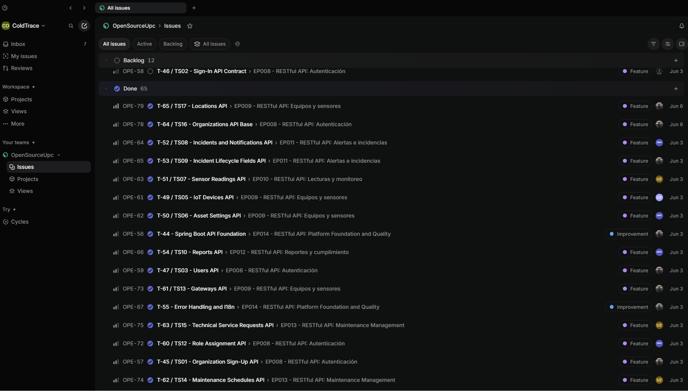
</p>

*Figura 5.2.3.3.1: Tablero de backlog de Linear App para el Sprint 3.*


#### 5.2.3.4. Development Evidence for Sprint Review

Durante el Sprint 3 se implementó la RESTful API completa de ColdTrace en el repositorio `ICEQ2026/coldtrace-platform`, siguiendo una arquitectura hexagonal con DDD. Todos los commits aplicaron Conventional Commits (`feat`, `fix`, `refactor`, `docs`, `chore`) y GitFlow con ramas `feature/TS*` para las Technical Stories desarrolladas como cambios dedicados. TS16 quedó documentada en Linear como base de organizaciones ya presente dentro del contexto de Identity & Access. Cada Technical Story incluyó su modelo de dominio, servicios de aplicación, persistencia JPA y controladores REST cuando correspondía a una implementación dedicada.

<table border="1" cellpadding="6" cellspacing="0" style="border-collapse: collapse;">
  <tr>
    <th>Repository</th>
    <th>Branch</th>
    <th>Commit Id</th>
    <th>Commit Message</th>
    <th>Commit Message Body</th>
    <th>Committed on (Date)</th>
  </tr>
  <tr>
    <td>ICEQ2026/coldtrace-platform</td>
    <td>feature/spring-boot-api-foundation</td>
    <td>9cf6a46</td>
    <td>chore: set up Spring Boot API foundation</td>
    <td>Configuración inicial del proyecto Spring Boot con dependencias base</td>
    <td>04/06/2026</td>
  </tr>
  <tr>
    <td>ICEQ2026/coldtrace-platform</td>
    <td>feature/spring-boot-api-foundation</td>
    <td>e9b0e66</td>
    <td>Merge pull request #1 from ICEQ2026/feature/spring-boot-api-foundation</td>
    <td>Fusión de la fundación Spring Boot a develop</td>
    <td>04/06/2026</td>
  </tr>
  <tr>
    <td>ICEQ2026/coldtrace-platform</td>
    <td>feature/TS01-organization-sign-up-api</td>
    <td>200a07c</td>
    <td>feat: add organization sign-up API</td>
    <td>Implementación del registro de organizaciones con validación de email y tax ID</td>
    <td>05/06/2026</td>
  </tr>
  <tr>
    <td>ICEQ2026/coldtrace-platform</td>
    <td>feature/TS01-organization-sign-up-api</td>
    <td>0a9784f</td>
    <td>Merge pull request #2 from ICEQ2026/feature/TS01-organization-sign-up-api</td>
    <td>Fusión de TS01 a develop</td>
    <td>05/06/2026</td>
  </tr>
  <tr>
    <td>ICEQ2026/coldtrace-platform</td>
    <td>feature/TS17-locations-api</td>
    <td>41ff39c</td>
    <td>feat(TS17): implement locations api</td>
    <td>Implementación de API de ubicaciones físicas</td>
    <td>06/06/2026</td>
  </tr>
  <tr>
    <td>ICEQ2026/coldtrace-platform</td>
    <td>feature/TS17-locations-api</td>
    <td>11f9c06</td>
    <td>Merge pull request #4 from ICEQ2026/feature/TS17-locations-api</td>
    <td>Fusión de TS17 Locations API a develop</td>
    <td>06/06/2026</td>
  </tr>
  <tr>
    <td>ICEQ2026/coldtrace-platform</td>
    <td>feature/TS13-gateways-api</td>
    <td>04a7202</td>
    <td>feat(TS13): implement gateways api</td>
    <td>Implementación de API de gateways de red IoT</td>
    <td>06/06/2026</td>
  </tr>
  <tr>
    <td>ICEQ2026/coldtrace-platform</td>
    <td>feature/TS13-gateways-api</td>
    <td>453be73</td>
    <td>Merge pull request #5 from ICEQ2026/feature/TS13-gateways-api</td>
    <td>Fusión de TS13 Gateways API a develop</td>
    <td>06/06/2026</td>
  </tr>
  <tr>
    <td>ICEQ2026/coldtrace-platform</td>
    <td>feature/TS04-assets-api</td>
    <td>543c599</td>
    <td>feat(TS04): expose organization assets api</td>
    <td>Exposición de API REST de activos con CRUD completo</td>
    <td>09/06/2026</td>
  </tr>
  <tr>
    <td>ICEQ2026/coldtrace-platform</td>
    <td>feature/TS12-role-assignment-api</td>
    <td>d7a2bc1</td>
    <td>merge(TS12): integrate role assignment api</td>
    <td>Integración de API de asignación de roles a usuarios</td>
    <td>09/06/2026</td>
  </tr>
  <tr>
    <td>ICEQ2026/coldtrace-platform</td>
    <td>feature/TS06-asset-settings-api</td>
    <td>1b38cb3</td>
    <td>feat(TS06): expose asset settings endpoints</td>
    <td>Exposición de endpoints de configuración de rangos de seguridad por activo</td>
    <td>10/06/2026</td>
  </tr>
  <tr>
    <td>ICEQ2026/coldtrace-platform</td>
    <td>feature/TS05-iot-devices-api</td>
    <td>309c3ed</td>
    <td>feat(TS05): implement iot devices api</td>
    <td>Implementación de API de dispositivos IoT</td>
    <td>10/06/2026</td>
  </tr>
  <tr>
    <td>ICEQ2026/coldtrace-platform</td>
    <td>feature/TS07-sensor-readings-api</td>
    <td>8ac46d7</td>
    <td>feat(TS07): expose sensor readings api</td>
    <td>Exposición de API de lecturas de sensores con temperatura y humedad</td>
    <td>10/06/2026</td>
  </tr>
  <tr>
    <td>ICEQ2026/coldtrace-platform</td>
    <td>feature/TS10-reports-api</td>
    <td>0c4df72</td>
    <td>feat(TS10): expose reports api</td>
    <td>Exposición de API de reportes operativos y de cumplimiento</td>
    <td>10/06/2026</td>
  </tr>
  <tr>
    <td>ICEQ2026/coldtrace-platform</td>
    <td>feature/TS15-technical-service-requests-api</td>
    <td>8470dab</td>
    <td>feat(TS15): expose technical service requests rest api</td>
    <td>Exposición de API de solicitudes de servicio técnico</td>
    <td>11/06/2026</td>
  </tr>
  <tr>
    <td>ICEQ2026/coldtrace-platform</td>
    <td>feature/TS14-maintenance-schedules-api</td>
    <td>27416f9</td>
    <td>feat(maintenance): expose schedule rest api</td>
    <td>Exposición de API de programación de mantenimiento preventivo</td>
    <td>11/06/2026</td>
  </tr>
  <tr>
    <td>ICEQ2026/coldtrace-platform</td>
    <td>feature/TS09-incident-lifecycle-fields-api</td>
    <td>51275e0</td>
    <td>feat(TS09): expose incident lifecycle actions</td>
    <td>Exposición de acciones del ciclo de vida de incidencias</td>
    <td>12/06/2026</td>
  </tr>
  <tr>
    <td>ICEQ2026/coldtrace-platform</td>
    <td>feature/TS03-users-api</td>
    <td>6208dcc</td>
    <td>feat(TS03): validate organization existence on user list, add Jakarta validation to create user request</td>
    <td>Implementación de API de usuarios con validaciones Jakarta</td>
    <td>12/06/2026</td>
  </tr>
  <tr>
    <td>ICEQ2026/coldtrace-platform</td>
    <td>feature/TS08-incidents-notifications-api</td>
    <td>6b2826c</td>
    <td>merge(TS08): validate incident references</td>
    <td>Validación de referencias en incidencias antes de creación</td>
    <td>12/06/2026</td>
  </tr>
  <tr>
    <td>ICEQ2026/coldtrace-platform</td>
    <td>feature/error-handling-i18n</td>
    <td>5547a08</td>
    <td>merge: integrate error handling i18n</td>
    <td>Internacionalización de errores de validación con mensajes en español e inglés</td>
    <td>12/06/2026</td>
  </tr>
  <tr>
    <td>ICEQ2026/coldtrace-platform</td>
    <td>feature/cloud-run-deployment</td>
    <td>c297e97</td>
    <td>build: add Cloud Run deployment configuration</td>
    <td>Configuración de Dockerfile y despliegue en Google Cloud Run</td>
    <td>12/06/2026</td>
  </tr>
  <tr>
    <td>ICEQ2026/coldtrace-platform</td>
    <td>feature/backend-smoke-validation-fixes</td>
    <td>c4b974a</td>
    <td>fix: harden backend smoke flows</td>
    <td>Validación de flujos completos de la API</td>
    <td>12/06/2026</td>
  </tr>
  <tr>
    <td>ICEQ2026/coldtrace-platform</td>
    <td>main</td>
    <td>21fa35f</td>
    <td>Merge pull request #16 from ICEQ2026/release/1.0.0</td>
    <td>Release v1.0.0 de la RESTful API de ColdTrace</td>
    <td>12/06/2026</td>
  </tr>
  <tr>
    <td>ICEQ2026/coldtrace-platform</td>
    <td>main</td>
    <td>942840a</td>
    <td>Merge pull request #18 from ICEQ2026/release/1.0.1</td>
    <td>Release v1.0.1 con correcciones de validación y documentación README</td>
    <td>12/06/2026</td>
  </tr>
</table>

#### 5.2.3.5. Execution Evidence for Sprint Review

Al término del Sprint 3, la RESTful API de ColdTrace fue desplegada exitosamente en Google Cloud Run, accesible públicamente con documentación OpenAPI habilitada mediante Swagger UI. La API expone 51 operaciones REST organizadas en 6 bounded contexts, todas documentadas con anotaciones Swagger y validación Jakarta.

**Arquitectura de la API implementada:**

La API sigue una arquitectura hexagonal (puertos y adaptadores) donde cada bounded context está aislado en su propio paquete con capas de dominio (agregados, value objects, repositorios), aplicación (servicios de comandos y consultas), infraestructura (persistencia JPA) e interfaces (controladores REST con assemblers DTO). El proyecto utiliza Spring Boot 4.0.6 con Java 26, MySQL como base de datos y SpringDoc OpenAPI 3.0 para documentación.

**Bounded contexts implementados:**

| Bounded Context | Technical Stories | Operaciones REST | Paquete base |
|---|---|---|---|
| Identity & Access | TS01, TS03, TS12 | 7 operaciones | `identityaccess` |
| Asset Management | TS04, TS05, TS06, TS13, TS17 | 20 operaciones | `assetmanagement` |
| Monitoring | TS07 | 4 operaciones | `monitoring` |
| Alerts | TS08, TS09 | 9 operaciones | `alerts` |
| Reports | TS10 | 3 operaciones | `reports` |
| Maintenance | TS14, TS15 | 8 operaciones | `maintenancemanagement` |

**Recursos disponibles:**

- **API Base URL:** https://coldtrace-platform-dtbzbm7bta-uc.a.run.app (producción)
- **Swagger UI:** https://coldtrace-platform-dtbzbm7bta-uc.a.run.app/swagger-ui/index.html
- **OpenAPI Spec:** https://coldtrace-platform-dtbzbm7bta-uc.a.run.app/v3/api-docs
- **Repositorio:** https://github.com/ICEQ2026/coldtrace-platform

**Video de navegación del producto (Sprint 3):** [Ver video](https://upcedupe-my.sharepoint.com/:v:/g/personal/u202410093_upc_edu_pe/EQb3T9DE7AmQ7aOxNsIfCAIAaqlY68Kt3syw7uDil2npvk?e=hlq0YC&nav=eyJyZWZlcnJhbEluZm8iOnsicmVmZXJyYWxBcHAiOiJTdHJlYW1XZWJBcHAiLCJyZWZlcnJhbFZpZXciOiJTaGFyZURpYWxvZy1MaW5rIiwicmVmZXJyYWxBcHBQbGF0Zm9ybSI6IldlYiIsInJlZmVycmFsTW9kZSI6InZpZXcifX0%3D)

A continuación se presenta la evidencia de despliegue en Google Cloud Run, los parámetros activos del contenedor y la instancia de Cloud SQL utilizada por la API:

<p align="center">
  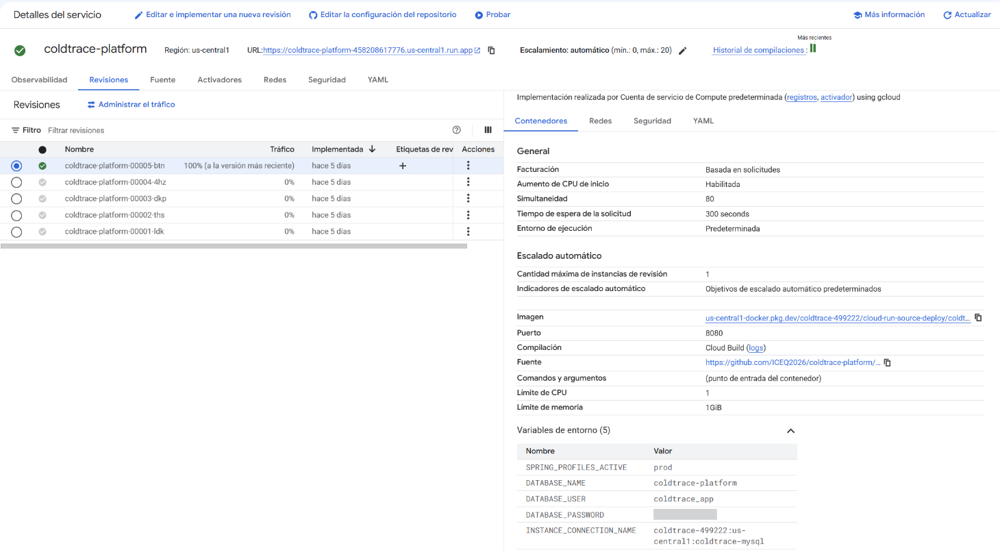
</p>

*Figura 5.2.3.5.1: Panel de Google Cloud Run con los parámetros de configuración y variables de entorno del backend de ColdTrace.*

<p align="center">
  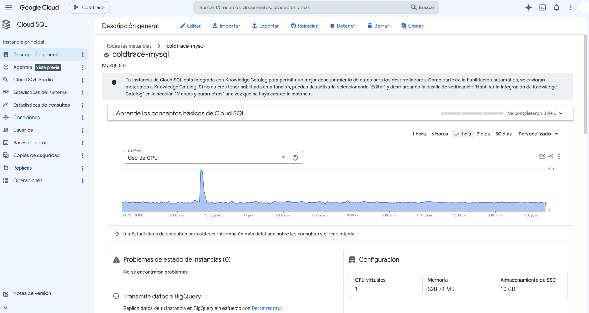
</p>

*Figura 5.2.3.5.2: Instancia de Google Cloud SQL para MySQL utilizada como base de datos de producción de la RESTful API de ColdTrace.*


#### 5.2.3.6. Services Documentation Evidence for Sprint Review

Durante el Sprint 3 se implementó y documentó la RESTful API completa de ColdTrace utilizando Spring Boot y SpringDoc OpenAPI. Cada endpoint fue anotado con `@Tag`, `@Operation` y `@ApiResponses` para generar documentación interactiva accesible desde Swagger UI. A continuación se presenta la documentación de los principales endpoints por bounded context.

**Identity & Access**

<table border="1" cellpadding="6" cellspacing="0">
  <tr>
    <th>Endpoint</th>
    <th>Method</th>
    <th>Descripción</th>
    <th>Request / Response</th>
  </tr>
  <tr>
    <td>/organization-sign-ups</td>
    <td>POST</td>
    <td>Registrar una nueva organización con su primer usuario administrador</td>
    <td>Body: legalName, commercialName, taxId, contactEmail, firstName, lastName<br>Response: 201 Created + Organization + User</td>
  </tr>
  <tr>
    <td>/organizations</td>
    <td>GET</td>
    <td>Listar todas las organizaciones registradas</td>
    <td>Response: 200 + List&lt;Organization&gt;</td>
  </tr>
  <tr>
    <td>/organizations/{organizationId}/users</td>
    <td>GET</td>
    <td>Listar usuarios de una organización</td>
    <td>Response: 200 + List&lt;User&gt;</td>
  </tr>
  <tr>
    <td>/organizations/{organizationId}/users</td>
    <td>POST</td>
    <td>Crear un nuevo usuario en la organización</td>
    <td>Body: firstName, lastName, email, roleId<br>Response: 201 Created + User</td>
  </tr>
  <tr>
    <td>/organizations/{organizationId}/users/{userId}/role</td>
    <td>PATCH</td>
    <td>Asignar un rol a un usuario existente</td>
    <td>Body: roleId<br>Response: 200 + User actualizado</td>
  </tr>
  <tr>
    <td>/roles</td>
    <td>GET</td>
    <td>Listar todos los roles del sistema</td>
    <td>Response: 200 + List&lt;Role&gt;</td>
  </tr>
</table>

**Asset Management**

<table border="1" cellpadding="6" cellspacing="0">
  <tr>
    <th>Endpoint</th>
    <th>Method</th>
    <th>Descripción</th>
    <th>Request / Response</th>
  </tr>
  <tr>
    <td>/organizations/{organizationId}/assets</td>
    <td>GET</td>
    <td>Listar activos de una organización</td>
    <td>Response: 200 + List&lt;Asset&gt;</td>
  </tr>
  <tr>
    <td>/organizations/{organizationId}/assets</td>
    <td>POST</td>
    <td>Crear un nuevo activo (cámara, transporte, almacén)</td>
    <td>Body: name, type, capacity, description, locationId<br>Response: 201 Created + Asset</td>
  </tr>
  <tr>
    <td>/organizations/{organizationId}/assets/{assetId}</td>
    <td>PUT</td>
    <td>Actualizar datos de un activo existente</td>
    <td>Body: name, type, capacity, description, locationId, status<br>Response: 200 + Asset actualizado</td>
  </tr>
  <tr>
    <td>/organizations/{organizationId}/locations</td>
    <td>GET</td>
    <td>Listar ubicaciones registradas</td>
    <td>Response: 200 + List&lt;Location&gt;</td>
  </tr>
  <tr>
    <td>/organizations/{organizationId}/gateways</td>
    <td>GET</td>
    <td>Listar gateways IoT registrados</td>
    <td>Response: 200 + List&lt;Gateway&gt;</td>
  </tr>
  <tr>
    <td>/organizations/{organizationId}/iot-devices</td>
    <td>GET</td>
    <td>Listar dispositivos IoT (sensores)</td>
    <td>Response: 200 + List&lt;IoTDevice&gt;</td>
  </tr>
  <tr>
    <td>/organizations/{organizationId}/asset-settings</td>
    <td>GET</td>
    <td>Obtener configuración por defecto de activos</td>
    <td>Response: 200 + AssetSettings</td>
  </tr>
  <tr>
    <td>/organizations/{organizationId}/assets/{assetId}/settings</td>
    <td>PUT</td>
    <td>Actualizar configuración específica de un activo</td>
    <td>Body: temperature/humidity ranges, IoT params<br>Response: 200 + AssetSettings actualizado</td>
  </tr>
</table>

**Monitoring**

<table border="1" cellpadding="6" cellspacing="0">
  <tr>
    <th>Endpoint</th>
    <th>Method</th>
    <th>Descripción</th>
    <th>Request / Response</th>
  </tr>
  <tr>
    <td>/organizations/{organizationId}/sensor-readings</td>
    <td>GET</td>
    <td>Obtener lecturas de sensores con filtros (activo, fecha, dispositivo)</td>
    <td>Query: assetId, iotDeviceId, from, to<br>Response: 200 + List&lt;SensorReading&gt;</td>
  </tr>
  <tr>
    <td>/organizations/{organizationId}/sensor-readings</td>
    <td>POST</td>
    <td>Registrar una nueva lectura de sensor</td>
    <td>Body: assetId, iotDeviceId, temperature, humidity, batteryLevel, signalStrength<br>Response: 201 Created + SensorReading</td>
  </tr>
  <tr>
    <td>/organizations/{organizationId}/sensor-readings/demo-generations</td>
    <td>POST</td>
    <td>Generar lecturas de demostración para pruebas</td>
    <td>Body: assetId, count<br>Response: 201 + List&lt;SensorReading&gt;</td>
  </tr>
</table>

**Alerts**

<table border="1" cellpadding="6" cellspacing="0">
  <tr>
    <th>Endpoint</th>
    <th>Method</th>
    <th>Descripción</th>
    <th>Request / Response</th>
  </tr>
  <tr>
    <td>/organizations/{organizationId}/incidents</td>
    <td>GET</td>
    <td>Listar incidencias de una organización</td>
    <td>Response: 200 + List&lt;Incident&gt;</td>
  </tr>
  <tr>
    <td>/organizations/{organizationId}/incidents</td>
    <td>POST</td>
    <td>Crear una incidencia térmica</td>
    <td>Body: assetId, deviceId, readingId, type, severity<br>Response: 201 Created + Incident</td>
  </tr>
  <tr>
    <td>/organizations/{organizationId}/incidents/{incidentId}/acknowledgements</td>
    <td>POST</td>
    <td>Reconocer una incidencia</td>
    <td>Response: 200 + Incident actualizado</td>
  </tr>
  <tr>
    <td>/organizations/{organizationId}/incidents/{incidentId}/escalation</td>
    <td>PATCH</td>
    <td>Escalar una incidencia no atendida</td>
    <td>Body: escalationReason<br>Response: 200 + Incident actualizado</td>
  </tr>
  <tr>
    <td>/organizations/{organizationId}/incidents/{incidentId}/corrective-action</td>
    <td>PATCH</td>
    <td>Registrar acción correctiva</td>
    <td>Body: correctiveAction<br>Response: 200 + Incident actualizado</td>
  </tr>
  <tr>
    <td>/organizations/{organizationId}/incidents/{incidentId}/resolutions</td>
    <td>POST</td>
    <td>Resolver y cerrar una incidencia</td>
    <td>Body: resolutionNotes<br>Response: 200 + Incident cerrado</td>
  </tr>
  <tr>
    <td>/organizations/{organizationId}/notifications</td>
    <td>GET</td>
    <td>Listar notificaciones de una organización</td>
    <td>Response: 200 + List&lt;Notification&gt;</td>
  </tr>
</table>

**Reports**

<table border="1" cellpadding="6" cellspacing="0">
  <tr>
    <th>Endpoint</th>
    <th>Method</th>
    <th>Descripción</th>
    <th>Request / Response</th>
  </tr>
  <tr>
    <td>/organizations/{organizationId}/reports</td>
    <td>GET</td>
    <td>Listar reportes generados en la organización</td>
    <td>Response: 200 + List&lt;Report&gt;</td>
  </tr>
  <tr>
    <td>/organizations/{organizationId}/reports</td>
    <td>POST</td>
    <td>Generar un nuevo reporte (daily, monthly, compliance, audit)</td>
    <td>Body: type, title, periodStart, periodEnd<br>Response: 201 Created + Report</td>
  </tr>
</table>

**Maintenance**

<table border="1" cellpadding="6" cellspacing="0">
  <tr>
    <th>Endpoint</th>
    <th>Method</th>
    <th>Descripción</th>
    <th>Request / Response</th>
  </tr>
  <tr>
    <td>/organizations/{organizationId}/maintenance-schedules</td>
    <td>GET</td>
    <td>Listar programaciones de mantenimiento</td>
    <td>Response: 200 + List&lt;MaintenanceSchedule&gt;</td>
  </tr>
  <tr>
    <td>/organizations/{organizationId}/maintenance-schedules</td>
    <td>POST</td>
    <td>Crear una programación de mantenimiento</td>
    <td>Body: assetId, scheduledDate, frequencyDays, responsibleUserId<br>Response: 201 + MaintenanceSchedule</td>
  </tr>
  <tr>
    <td>/organizations/{organizationId}/technical-service-requests</td>
    <td>GET</td>
    <td>Listar solicitudes de servicio técnico</td>
    <td>Response: 200 + List&lt;TechnicalServiceRequest&gt;</td>
  </tr>
  <tr>
    <td>/organizations/{organizationId}/technical-service-requests</td>
    <td>POST</td>
    <td>Crear una solicitud de servicio técnico</td>
    <td>Body: assetId, incidentId, issueDescription, priority<br>Response: 201 + TechnicalServiceRequest</td>
  </tr>
</table>

**OpenAPI Documentation Interactive:**

La especificación OpenAPI completa está disponible en Swagger UI, permitiendo probar cada endpoint directamente desde el navegador. La documentación incluye descripciones detalladas de cada operación, schemas de request/response y códigos de respuesta HTTP esperados (200, 201, 400, 404, 409, 500).

A continuación se muestra la documentación interactiva de la API disponible en Swagger UI:

<p align="center">
  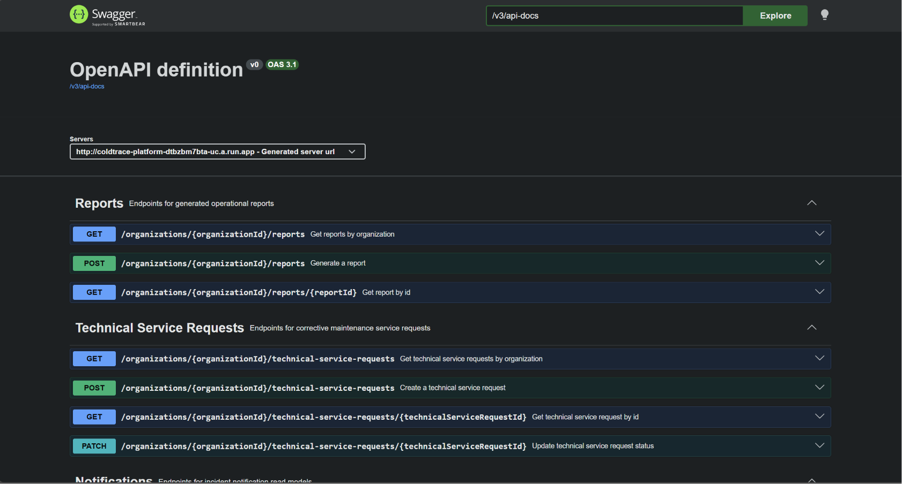
</p>

*Figura 5.2.3.6.1: Documentación interactiva de Swagger UI con los endpoints RESTful expuestos.*


#### 5.2.3.7. Software Deployment Evidence for Sprint Review

Durante el Sprint 3 se configuró el despliegue de la RESTful API de ColdTrace en Google Cloud Run, utilizando Docker para la contenerización de la aplicación Spring Boot y Cloud Build como mecanismo de despliegue continuo desde el repositorio.

**Pasos realizados para el despliegue:**

1. Se creó un Dockerfile multi-stage para compilar y empaquetar la aplicación Spring Boot en una imagen Linux optimizada.

2. Se configuró el archivo `application-prod.properties` para resolver la conexión a Google Cloud SQL (MySQL) mediante variables de entorno de producción.

3. Se desplegó manualmente la primera versión en Cloud Run desde la consola de Google Cloud, configurando variables de entorno para la conexión a la base de datos y el perfil activo de Spring.

4. Se configuró Cloud Build para ejecutar el build y despliegue automático ante cada push a la rama `main`, utilizando la integración de Cloud Run con el repositorio de GitHub.

5. Se verificó el correcto funcionamiento del health check de Cloud Run y la accesibilidad pública de la API, incluyendo Swagger UI y los endpoints REST.

**URLs de despliegue:**

- **API URL:** https://coldtrace-platform-dtbzbm7bta-uc.a.run.app
- **Swagger UI:** https://coldtrace-platform-dtbzbm7bta-uc.a.run.app/swagger-ui/index.html
- **OpenAPI Spec:** https://coldtrace-platform-dtbzbm7bta-uc.a.run.app/v3/api-docs
- **Repositorio backend:** https://github.com/ICEQ2026/coldtrace-platform
- **Repositorio frontend (Vercel):** https://coldtrace-frontend-liard.vercel.app
- **Landing Page (GitHub Pages):** https://iceq2026.github.io/landingpage-coldtrace

A continuación se documenta el procedimiento realizado en la consola de Google Cloud para aprovisionar la base de datos administrada y publicar la RESTful API.

**Creación de la instancia Cloud SQL para MySQL**

Se aprovisionó una instancia administrada de Cloud SQL seleccionando MySQL 8.4 como motor de base de datos, asignándole el identificador `coldtrace-mysql` en la región `us-central1`. Esta instancia actúa como el almacenamiento persistente al que se conecta el backend desplegado en Cloud Run.

<p align="center">
  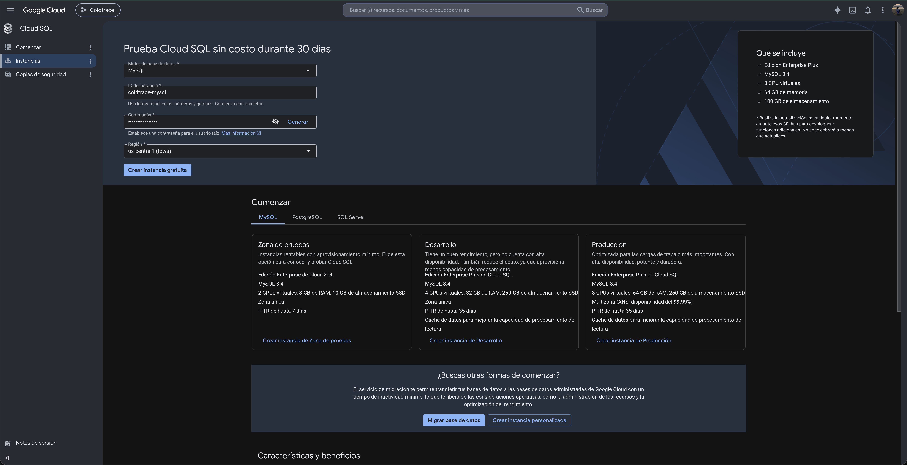
</p>

*Figura 5.2.3.7.1: Creación de la instancia Cloud SQL para MySQL asociada al backend de ColdTrace.*

**Verificación de la instancia `coldtrace-mysql` disponible**

Se confirmó que la instancia `coldtrace-mysql` quedó creada correctamente en la región configurada (`us-central1`, MySQL 8.4) y disponible para recibir bases de datos, usuarios y conexiones desde el servicio de aplicación.

<p align="center">
  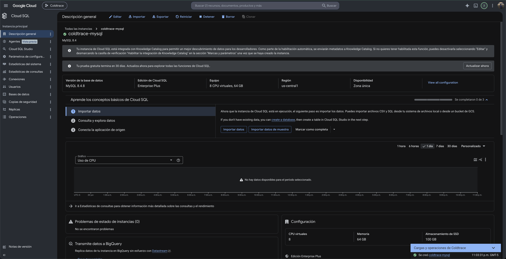
</p>

*Figura 5.2.3.7.2: Instancia Cloud SQL `coldtrace-mysql` creada en Google Cloud y disponible para configuración.*

**Creación de la base de datos `coldtrace_platform`**

Dentro de la instancia Cloud SQL se registró el esquema `coldtrace_platform`, que actúa como base de datos principal donde el backend Spring Boot persiste la información de organizaciones, activos, sensores, reportes y monitoreo. El esquema se creó con codificación `utf8mb4` para dar soporte consistente a la internacionalización de contenidos.

<p align="center">
  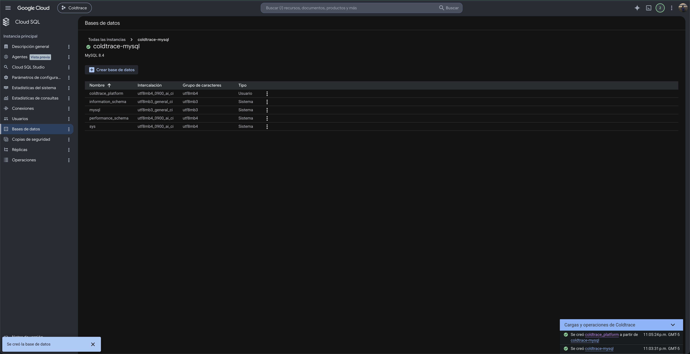
</p>

*Figura 5.2.3.7.3: Base de datos `coldtrace_platform` registrada en la instancia Cloud SQL.*

**Configuración del usuario de base de datos**

Se creó un usuario de aplicación dedicado (`coldtrace_user`) para que el servicio Cloud Run acceda a MySQL sin utilizar la cuenta administrativa `root` durante la operación del backend. Esta separación reduce la superficie de riesgo y mantiene las credenciales operativas aisladas de las credenciales de administración.

<p align="center">
  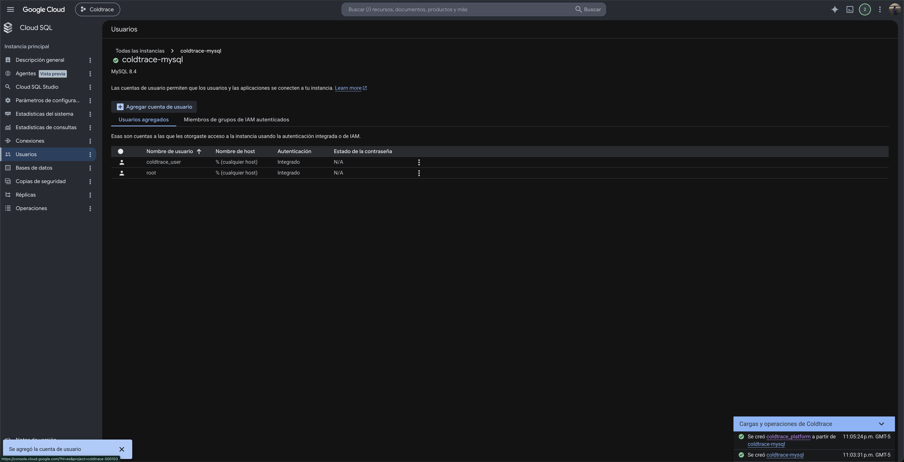
</p>

*Figura 5.2.3.7.4: Usuario de base de datos `coldtrace_user` configurado para la conexión del backend.*

**Configuración del servicio Cloud Run**

Se creó el servicio Cloud Run `coldtrace-platform` conectado al repositorio del backend en GitHub, utilizando la rama principal como fuente de despliegue continuo mediante Cloud Build. Se seleccionó la compilación a partir del `Dockerfile` del repositorio y se configuró el puerto de contenedor `8080`, requerido por Cloud Run para enrutar el tráfico HTTP hacia la aplicación Spring Boot.

<p align="center">
  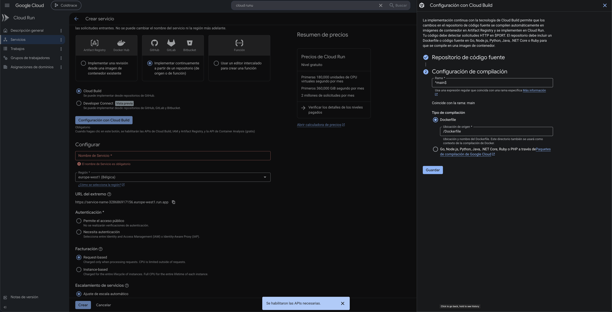
</p>

*Figura 5.2.3.7.5: Configuración de Cloud Run con el repositorio del backend, la rama principal y la compilación mediante Dockerfile.*

**Configuración de variables de entorno en Cloud Run**

Se registraron las variables de entorno de producción para separar la configuración del código fuente, evitando exponer host, usuario, contraseña o nombre del esquema en el repositorio. Entre ellas se incluyen la conexión a la instancia Cloud SQL (`DATABASE_URL`, `DATABASE_USER`, `DATABASE_PASSWORD`, `DATABASE_SCHEMA`), el perfil activo de Spring Boot (`SPRING_PROFILES_ACTIVE=prod`) y los orígenes permitidos para CORS que habilitan la integración con la Frontend Web Application. Estas variables son resueltas en tiempo de ejecución por `application-prod.properties`, manteniéndose fuera del control de versiones.

<p align="center">
  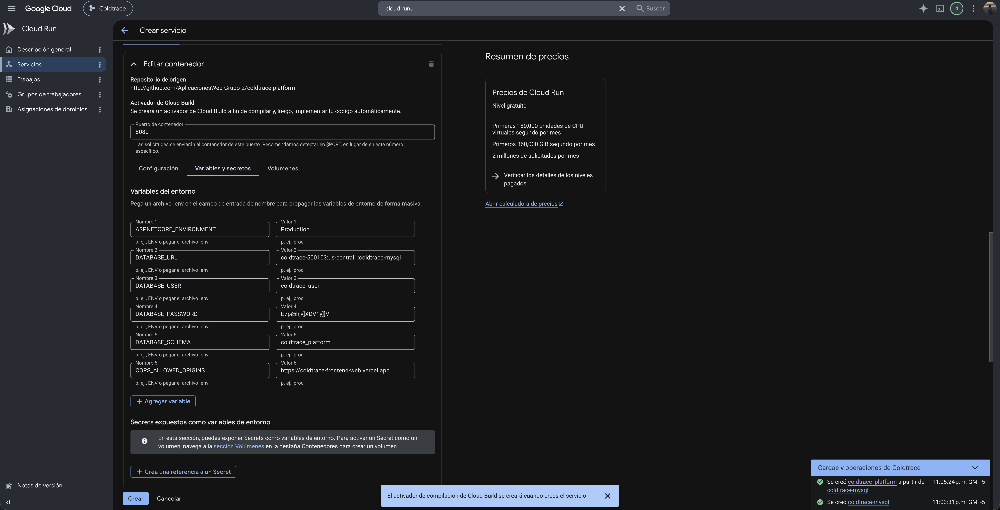
</p>

*Figura 5.2.3.7.6: Variables de entorno del servicio Cloud Run para conectar el backend con Cloud SQL y el frontend.*

**Despliegue continuo y estado del servicio**

Una vez configurados la base de datos, el usuario, el servicio y sus variables de entorno, Cloud Build ejecutó el build y despliegue automático ante cada push a la rama principal, publicando una revisión activa del servicio en Cloud Run con su panel de métricas para monitorear solicitudes, latencia y uso de recursos.

<p align="center">
  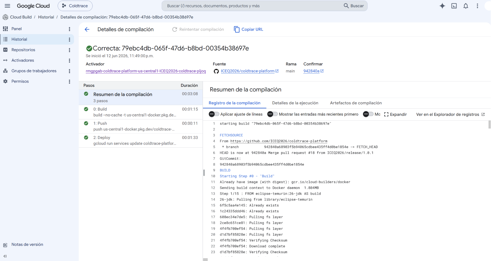
</p>

*Figura 5.2.3.7.7: Pipeline de despliegue continuo ejecutado en Google Cloud Build para compilar y desplegar la API en Cloud Run.*

<p align="center">
  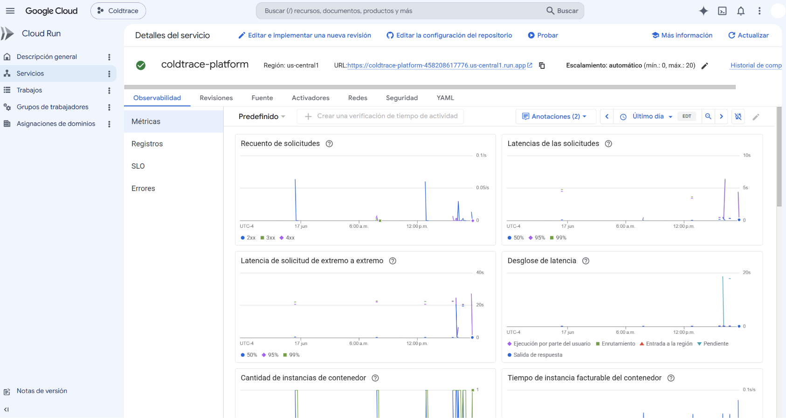
</p>

*Figura 5.2.3.7.8: Estado y métricas del servicio de ColdTrace desplegado en Google Cloud Run.*


#### 5.2.3.8. Team Collaboration Insights during Sprint

Durante el Sprint 3, el equipo trabajó de forma colaborativa en el repositorio `ICEQ2026/coldtrace-platform`, implementando 15 Technical Stories más tareas transversales de arquitectura, documentación y despliegue. Las Technical Stories desarrolladas como cambios dedicados fueron trabajadas en ramas `feature/TS*` independientes y fusionadas mediante Pull Requests revisados por al menos un integrante del equipo.

**Distribución del trabajo:**

Mauricio Pajés lideró la implementación de la fundación del proyecto Spring Boot, los Technical Stories de Organization Sign-Up (TS01), Users API (TS03), Incident Lifecycle Fields API (TS09), Gateways API (TS13), Locations API (TS17) y Organizations API Base (TS16), además de las tareas transversales de arquitectura hexagonal (v2), internacionalización de errores (OPE-67), despliegue en Cloud Run y validación de flujos. David Morales implementó los Technical Stories de Assets API (TS04), Asset Settings API (TS06), Incidents & Notifications API (TS08), Reports API (TS10) y Role Assignment API (TS12). Leonardo Cabrera desarrolló Sensor Readings API (TS07), Maintenance Schedules API (TS14) y Technical Service Requests API (TS15). Jorge Videla implementó IoT Devices API (TS05). Frezzia Espinoza documentó el Sprint Backlog 3 y revisó los endpoints REST.

A continuación se presenta el resumen de participación por integrante basado en el historial de commits del repositorio:

<table border="1" cellpadding="6" cellspacing="0">
  <tr>
    <th>Integrante</th>
    <th>GitHub Username</th>
    <th>Commits (Sprint 3)</th>
    <th>Technical Stories / Tareas trabajados</th>
  </tr>
  <tr>
    <td>Pajés León, Mauricio Luis</td>
    <td>mauricio-pajes</td>
    <td>~34</td>
    <td>Spring Boot Foundation, TS01 Org Sign-Up, TS03 Users API, TS09 Incident Lifecycle, TS13 Gateways, TS16 Org Base, TS17 Locations, Error Handling I18n, Architecture v2, OpenAPI, Cloud Run, Smoke Validation</td>
  </tr>
  <tr>
    <td>Morales Venegas, David Joel</td>
    <td>David-std2</td>
    <td>~28</td>
    <td>TS04 Assets, TS06 Asset Settings, TS08 Incidents & Notifications, TS10 Reports, TS12 Role Assignment, Architecture v2, refactors</td>
  </tr>
  <tr>
    <td>Cabrera Novoa, Leonardo Moisés</td>
    <td>u202415820</td>
    <td>~10</td>
    <td>TS07 Sensor Readings, TS14 Maintenance Schedules, TS15 Technical Service Requests</td>
  </tr>
  <tr>
    <td>Videla Ventura, Jorge Joseph</td>
    <td>JorgeVidVen</td>
    <td>~2</td>
    <td>TS05 IoT Devices API</td>
  </tr>
  <tr>
    <td>Espinoza Paredes, Frezzia</td>
    <td>fflushh</td>
    <td>~2</td>
    <td>Colaboración en revisión de endpoints y documentación del Sprint Backlog 3</td>
  </tr>
</table>

<p align="center">
  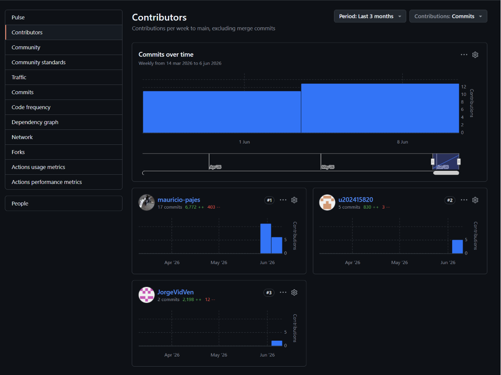
</p>

*Figura 5.2.3.8.1: Gráfico de contribuciones por integrante – repositorio coldtrace-platform.*

<p align="center">
  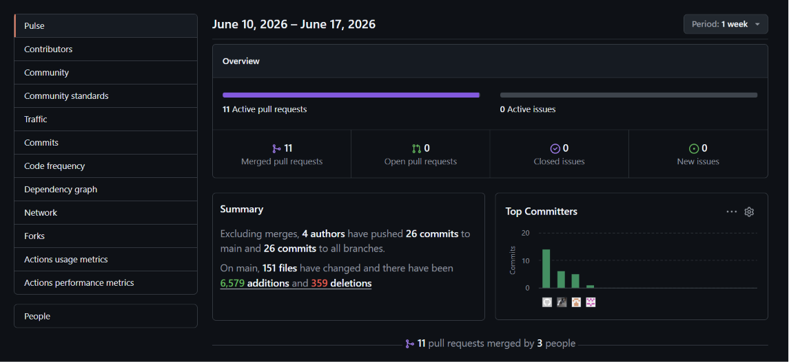
</p>

*Figura 5.2.3.8.2: Captura de la sección Pulse de GitHub mostrando los commits activos del Sprint 3.*


El equipo utilizó Pull Requests como mecanismo de integración, alcanzando un total de 18 PRs mergeados durante el sprint. El uso de Conventional Commits permitió mantener un historial organizado con tipos como `feat`, `fix`, `refactor`, `style`, `docs`, `chore` y `build`. La implementación de la arquitectura hexagonal (v2) unificó todos los bounded contexts bajo el mismo patrón de puertos y adaptadores, mejorando la mantenibilidad y testabilidad del código.

Con la finalización del Sprint 3, el equipo cuenta con una RESTful API completa y desplegada en producción (Cloud Run), una Frontend Web Application desplegada en Vercel y una Landing Page desplegada en GitHub Pages, formando el ecosistema completo de ColdTrace.

**Resumen de evidencias colaborativas por actividad**

| Actividad colaborativa | Evidencia documentada | Repositorio o herramienta |
|---|---|---|
| Development | Implementación de Technical Stories en ramas `feature/TS*`, commits convencionales y Pull Requests revisados antes de la integración. | `ICEQ2026/coldtrace-platform`, `ICEQ2026/coldtrace-frontend`, GitHub |
| Execution | Validación de la RESTful API desplegada, Swagger UI público, frontend en Vercel y landing page en GitHub Pages. | Google Cloud Run, Cloud Build, Vercel, GitHub Pages |
| Documentation | Actualización del Sprint Backlog 3, documentación de endpoints REST, evidencias de despliegue y sincronización del informe unificado. Frezzia Espinoza participó en la documentación del Sprint Backlog 3 y revisión de endpoints. | Linear App, `ICEQ2026/informe-del-proyecto`, Swagger UI |
| Deployment | Despliegue continuo del backend mediante Cloud Build hacia Cloud Run, con conexión a Cloud SQL y verificación del servicio público. | Google Cloud Build, Google Cloud Run, Cloud SQL |
| Agile tracking | Seguimiento evolutivo de estados To Do, In Progress, To Review y Done para tickets OPE del Sprint 3. | Linear App |

---

### 5.2.4. Sprint 4

#### 5.2.4.1. Sprint Planning 4

El Sprint 4 tuvo como objetivo principal ampliar ColdTrace con capacidades avanzadas de autenticación, asistencia basada en inteligencia artificial y monetización SaaS. A partir de la RESTful API consolidada en el Sprint 3, el equipo priorizó la evolución de tres frentes técnicos: Identity & Access, AI Assistance y SaaS Plans & Billing.

El trabajo fue planificado y verificado en Linear App mediante tres proyectos específicos: **ColdTrace Sprint 4 - Identity and Access**, **ColdTrace Sprint 4 - AI Assistance** y **ColdTrace Sprint 4 - SaaS Plans and Billing**. Esta división permitió separar las tareas de seguridad, inteligencia artificial y pagos, manteniendo trazabilidad entre épicas, user stories y technical stories.

La orientación del Sprint 4 fue transformar ColdTrace de una plataforma operativa funcional a una solución más cercana a un producto SaaS listo para evaluación comercial. Para ello, el sprint se enfocó en tres preguntas de producto: cómo acceden los usuarios de forma segura, cómo reciben apoyo inteligente para resolver eventos críticos de cadena de frío y cómo se diferencian las capacidades del sistema según planes de suscripción.

Desde Linear, el sprint se estructuró en torno a hitos concretos. En Identity & Access se cerraron los hitos **JWT security baseline**, **Social sign-in integration** e **IAM follow-ups**. En AI Assistance, el hito **Backend AI APIs** quedó completado y dejó pendiente la experiencia frontend. En SaaS Plans & Billing se avanzó en catálogo, entitlements y flujos Stripe, mientras que las superficies frontend de pricing y administración de billing permanecen pendientes para un siguiente cierre visual.

<table border="1" cellpadding="6" cellspacing="0">
  <tr>
    <th>Sprint #</th>
    <td>Sprint 4</td>
  </tr>
  <tr>
    <th colspan="2">Sprint Planning Background</th>
  </tr>
  <tr>
    <th>Date</th>
    <td>2026-06-23</td>
  </tr>
  <tr>
    <th>Time</th>
    <td>08:00 PM</td>
  </tr>
  <tr>
    <th>Location</th>
    <td>Reunión virtual vía Google Meet</td>
  </tr>
  <tr>
    <th>Prepared By</th>
    <td>Pajés León, Mauricio Luis</td>
  </tr>
  <tr>
    <th>Attendees (to planning meeting)</th>
    <td>Morales Venegas, David Joel / Espinoza Paredes, Frezzia / Cabrera Novoa, Leonardo Moisés / Videla Ventura, Jorge Joseph / Pajés León, Mauricio Luis</td>
  </tr>
  <tr>
    <th>Sprint 3 Review Summary</th>
    <td>En el Sprint 3 se completó la RESTful API base de ColdTrace con Spring Boot, arquitectura hexagonal y documentación Swagger UI. La API quedó organizada por bounded contexts, desplegada en Google Cloud Run y validada mediante endpoints de Identity & Access, Asset Management, Monitoring, Alerts, Reports y Maintenance. Este resultado dejó una plataforma backend estable para construir capacidades transversales en el Sprint 4.</td>
  </tr>
  <tr>
    <th>Sprint 3 Retrospective Summary</th>
    <td>El equipo identificó que la API ya cubría los flujos operativos principales, pero todavía faltaban capacidades de producto necesarias para una solución SaaS: autenticación segura con sesiones reales, integración con proveedores externos, asistencia inteligente para decisiones operativas y reglas comerciales por plan. Para el Sprint 4 se acordó priorizar esas capacidades sin reescribir los módulos base.</td>
  </tr>
  <tr>
    <th colspan="2">Sprint Goal & User Stories</th>
  </tr>
  <tr>
    <th>Sprint 4 Goal</th>
    <td>Our focus is on extending ColdTrace with secure identity, AI-assisted operational guidance, and SaaS monetization capabilities. We believe it delivers a stronger product platform by adding JWT/OAuth authentication, AI support for incident/report/dashboard interpretation, and backend-enforced subscription plans. This will be confirmed when Linear shows the backend technical stories completed, Swagger UI documents the new service groups, and frontend stories are clearly separated as pending product-experience work.</td>
  </tr>
  <tr>
    <th>Sprint 4 Velocity</th>
    <td>82 Story Points completed across Done tickets verified in Linear.</td>
  </tr>
  <tr>
    <th>Sum of Story Points</th>
    <td>151 Story Points tracked in Sprint 4 scope: 82 completed and 69 pending in frontend/product stories.</td>
  </tr>
  <tr>
    <th>Herramienta de seguimiento</th>
    <td>Linear App</td>
  </tr>
  <tr>
    <th>Repositorios involucrados</th>
    <td>`ICEQ2026/coldtrace-platform`, `ICEQ2026/coldtrace-frontend`, `ICEQ2026/landingpage-coldtrace`</td>
  </tr>
  <tr>
    <th>Alcance completado verificado</th>
    <td>Implementación principalmente backend de autenticación JWT/OAuth, asistencia IA con Spring AI y servicios SaaS/Billing con Stripe.</td>
  </tr>
  <tr>
    <th>Alcance pendiente</th>
    <td>Historias frontend y de experiencia visual asociadas a AI Assistance, Billing, pricing y algunos flujos de producto permanecen registradas como pendientes en Linear.</td>
  </tr>
</table>

El enfoque del Sprint 4 no consistió en reemplazar los módulos existentes, sino en agregar capacidades transversales sobre la plataforma ya desplegada. La autenticación refuerza el acceso seguro al sistema, la asistencia IA apoya la toma de decisiones operativas frente a incidencias de cadena de frío, y el módulo de planes SaaS permite orientar el producto hacia un modelo comercial escalable.

La planificación también distinguió entre **capacidad técnica completada** y **experiencia de usuario pendiente**. Esto es importante porque varios tickets backend aparecen en estado `Done`, pero sus user stories frontend vinculadas siguen en `Todo`. Por ello, el sprint se presenta como un avance fuerte de plataforma y contratos, no como un cierre total de todas las pantallas del producto.

La planificación del sprint tomó como punto de partida los resultados del Sprint 3: una API Spring Boot desplegada, documentada con Swagger UI y organizada por bounded contexts. Sobre esa base, el equipo decidió no abrir nuevos módulos operativos principales, sino reforzar capacidades que atraviesan toda la plataforma: seguridad de sesión, automatización inteligente y control comercial por plan. Esto permitió que las tareas del Sprint 4 se registraran como incrementos sobre servicios existentes y no como una reescritura de la solución.

El avance verificado en Linear muestra una entrega técnica importante en backend y una separación clara de trabajo pendiente en frontend. La siguiente tabla resume el estado por proyecto al momento de documentar el sprint:

| Proyecto Linear | Épica principal | Avance completado | Pendiente visible en Linear |
|---|---|---|---|
| ColdTrace Sprint 4 - Identity and Access | EP002 / EP008 | 7 tickets cerrados relacionados con JWT, rutas protegidas, recuperación de contraseña, OAuth/OIDC y sesión frontend con JWT. | Las épicas de seguimiento permanecen abiertas para consolidación final de IAM. |
| ColdTrace Sprint 4 - AI Assistance | EP013 | 7 technical stories backend cerradas: Spring AI, planes de resolución, aprobación, rechazo, historial, resumen de reportes e interpretación de dashboard. | 8 historias frontend o de experiencia de usuario continúan en Todo. |
| ColdTrace Sprint 4 - SaaS Plans and Billing | EP014 | 6 technical stories backend cerradas: catálogo, suscripciones, entitlements, Stripe Checkout, webhooks, Customer Portal y validación de límites. | 8 historias frontend o de experiencia comercial continúan en Todo. |

De esta manera, el Sprint 4 se documenta como una entrega de infraestructura funcional avanzada. El criterio usado para la revisión fue no considerar una épica como totalmente finalizada mientras sus historias visuales o de experiencia permanezcan abiertas en Linear.

| Hito Linear | Proyecto | Orientación | Progreso registrado |
|---|---|---|---|
| JWT security baseline | Identity and Access | Inicio de sesión con JWT, protección de rutas y endurecimiento CORS. | 100% |
| Social sign-in integration | Identity and Access | Autenticación Google/Apple con sesión backend controlada por ColdTrace. | 100% |
| IAM follow-ups | Identity and Access | Recuperación de contraseña y ajustes posteriores a la línea base de seguridad. | 100% |
| Backend AI APIs | AI Assistance | Spring AI, ciclo de planes IA, resumen de reportes e interpretación de dashboard. | 100% |
| Frontend AI experiences | AI Assistance | Panel de guía IA e interpretación del dashboard desde la interfaz. | 0% |
| Plan catalog and entitlements | SaaS Plans and Billing | Catálogo de planes, suscripción de organización y cálculo de permisos. | 50% |
| Stripe billing flows | SaaS Plans and Billing | Checkout, webhooks y Customer Portal. | 60% |
| Billing frontend surfaces | SaaS Plans and Billing | Comparación de planes, upgrades y administración de billing en frontend. | 0% |

#### 5.2.4.2. Aspect Leaders and Collaborators

Durante el Sprint 4, la coordinación se organizó por dominio funcional. Linear evidencia a Mauricio Pajés como responsable principal de las tareas backend completadas en autenticación, inteligencia artificial y billing. Las historias frontend y de producto se mantuvieron registradas para integración visual y validación posterior.

El liderazgo por aspecto se definió a partir de la naturaleza de las dependencias. Identity & Access habilitó la seguridad necesaria para consumir los servicios protegidos; AI Assistance dependió de esa seguridad y de los datos operativos existentes; y Billing necesitó validar límites desde backend para que las reglas comerciales no dependan únicamente de controles visuales del frontend.

<table border="1" cellpadding="6" cellspacing="0">
  <tr>
    <th>Aspecto</th>
    <th>Responsable principal</th>
    <th>Colaboración</th>
    <th>Resultado documentado</th>
  </tr>
  <tr>
    <td>Identity & Access</td>
    <td>Mauricio Pajés</td>
    <td>Equipo ColdTrace</td>
    <td>JWT, rutas protegidas, endurecimiento CORS, recuperación de contraseña y autenticación OAuth/OIDC con Google y Apple.</td>
  </tr>
  <tr>
    <td>AI Assistance</td>
    <td>Mauricio Pajés</td>
    <td>Equipo ColdTrace</td>
    <td>Fundación con Spring AI, generación de planes de resolución, aprobación/rechazo humano, trazabilidad, historial, resumen inteligente de reportes e interpretación del dashboard.</td>
  </tr>
  <tr>
    <td>SaaS Plans & Billing</td>
    <td>Mauricio Pajés</td>
    <td>Equipo ColdTrace</td>
    <td>Catálogo de planes, suscripciones por organización, entitlements, Stripe Checkout, webhooks, Customer Portal y validación de límites.</td>
  </tr>
  <tr>
    <td>Frontend y experiencia de usuario</td>
    <td>Equipo ColdTrace</td>
    <td>Equipo ColdTrace</td>
    <td>Historias de interfaz registradas para AI Assistance, Billing, pricing y autenticación social; parte del alcance permanece pendiente según Linear.</td>
  </tr>
</table>

#### 5.2.4.3. Sprint Backlog 4

El Sprint Backlog 4 fue gestionado en Linear App. A diferencia del Sprint 3, enfocado en completar la RESTful API base, este sprint se orientó a capacidades avanzadas y transversales. La tabla siguiente resume los tickets verificados por proyecto y estado.

El backlog se organizó con una lógica de dependencias por capas. Primero se cerraron tickets de seguridad e infraestructura, luego servicios inteligentes y finalmente capacidades comerciales. En cada bloque, las Technical Stories definieron contratos backend reales y las User Stories representaron la experiencia que consume esos contratos desde frontend o landing page.

Al igual que en el Sprint 3, Linear App fue utilizado para mantener trazabilidad entre épicas, technical stories, user stories, estimaciones y estados. Para Sprint 4, la lectura del backlog se dividió en dos niveles: tickets completados que sirven como evidencia de implementación y tickets pendientes que delimitan el alcance visual que no debe darse por cerrado.

<table border="1" cellpadding="6" cellspacing="0" style="border-collapse: collapse; text-align: center;">
  <tr>
    <th>Sprint #</th>
    <td colspan="5">Sprint 4</td>
  </tr>
  <tr>
    <th>Proyecto Linear</th>
    <th>Épica / Bloque</th>
    <th>Tickets Done</th>
    <th>Story Points Done</th>
    <th>Tickets pendientes</th>
    <th>Story Points pendientes</th>
  </tr>
  <tr>
    <td>Identity and Access</td>
    <td>EP002 / EP008</td>
    <td>7</td>
    <td>29</td>
    <td>2 épicas de seguimiento abiertas</td>
    <td>No estimado en Linear</td>
  </tr>
  <tr>
    <td>AI Assistance</td>
    <td>EP013</td>
    <td>7 technical stories backend</td>
    <td>27</td>
    <td>8 user stories frontend/product</td>
    <td>37</td>
  </tr>
  <tr>
    <td>SaaS Plans and Billing</td>
    <td>EP014</td>
    <td>6 technical stories backend</td>
    <td>26</td>
    <td>8 user stories frontend/product</td>
    <td>32</td>
  </tr>
  <tr>
    <th colspan="2">Total tracked scope</th>
    <th>20 tickets Done</th>
    <th>82</th>
    <th>16 user stories pendientes + épicas abiertas</th>
    <th>69</th>
  </tr>
</table>

<p align="center">
  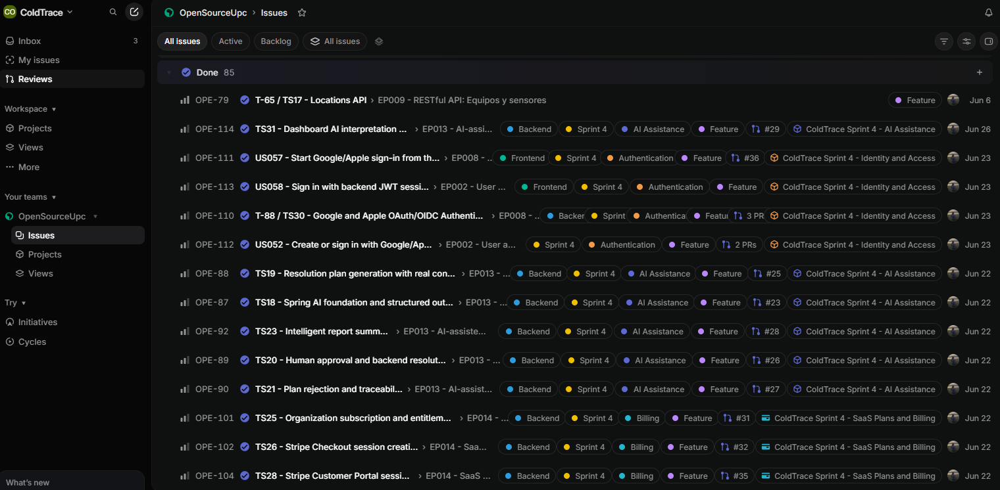
</p>

*Figura 5.2.4.3.1: Tablero de Linear App con el seguimiento de tickets del Sprint 4.*

<table border="1" cellpadding="6" cellspacing="0">
  <tr>
    <th>Proyecto Linear</th>
    <th>ID</th>
    <th>Tipo</th>
    <th>Nombre</th>
    <th>Estado</th>
    <th>Resultado</th>
  </tr>
  <tr>
    <td>Identity and Access</td>
    <td>OPE-58</td>
    <td>Technical Story</td>
    <td>TS02 - Authentication API with JWT</td>
    <td>Done</td>
    <td>API de autenticación con emisión y validación de tokens JWT.</td>
  </tr>
  <tr>
    <td>Identity and Access</td>
    <td>OPE-70</td>
    <td>Technical Story</td>
    <td>T-58 - JWT, Protected Routes and CORS Hardening</td>
    <td>Done</td>
    <td>Rutas protegidas y configuración CORS reforzada para consumo seguro desde frontend.</td>
  </tr>
  <tr>
    <td>Identity and Access</td>
    <td>OPE-71</td>
    <td>Technical Story</td>
    <td>T-59 / TS11 - Password Reset Request API</td>
    <td>Done</td>
    <td>API para solicitud de recuperación de contraseña.</td>
  </tr>
  <tr>
    <td>Identity and Access</td>
    <td>OPE-110</td>
    <td>Technical Story</td>
    <td>TS30 - Google and Apple OAuth/OIDC Authentication API</td>
    <td>Done</td>
    <td>Integración backend para autenticación social con Google y Apple.</td>
  </tr>
  <tr>
    <td>Identity and Access</td>
    <td>OPE-111</td>
    <td>User Story</td>
    <td>US057 - Start Google/Apple sign-in from the UI</td>
    <td>Done</td>
    <td>Inicio del flujo de autenticación social desde la interfaz.</td>
  </tr>
  <tr>
    <td>Identity and Access</td>
    <td>OPE-112</td>
    <td>User Story</td>
    <td>US052 - Create or sign in with Google/Apple</td>
    <td>Done</td>
    <td>Creación o inicio de sesión mediante proveedores OAuth/OIDC.</td>
  </tr>
  <tr>
    <td>Identity and Access</td>
    <td>OPE-113</td>
    <td>User Story</td>
    <td>US058 - Sign in with backend JWT session</td>
    <td>Done</td>
    <td>Integración del inicio de sesión frontend con sesión JWT emitida por backend.</td>
  </tr>
  <tr>
    <td>AI Assistance</td>
    <td>OPE-87</td>
    <td>Technical Story</td>
    <td>TS18 - Spring AI foundation and structured output</td>
    <td>Done</td>
    <td>Base técnica de Spring AI y respuestas estructuradas para casos de uso inteligentes.</td>
  </tr>
  <tr>
    <td>AI Assistance</td>
    <td>OPE-88</td>
    <td>Technical Story</td>
    <td>TS19 - Resolution plan generation with real context</td>
    <td>Done</td>
    <td>Generación de planes de resolución para incidentes usando contexto real de ColdTrace.</td>
  </tr>
  <tr>
    <td>AI Assistance</td>
    <td>OPE-89</td>
    <td>Technical Story</td>
    <td>TS20 - Human approval and backend resolution</td>
    <td>Done</td>
    <td>Flujo de aprobación humana antes de aplicar una resolución asistida.</td>
  </tr>
  <tr>
    <td>AI Assistance</td>
    <td>OPE-90</td>
    <td>Technical Story</td>
    <td>TS21 - Plan rejection and traceability</td>
    <td>Done</td>
    <td>Rechazo de planes IA con trazabilidad de la decisión.</td>
  </tr>
  <tr>
    <td>AI Assistance</td>
    <td>OPE-91</td>
    <td>Technical Story</td>
    <td>TS22 - AI plan persistence and history</td>
    <td>Done</td>
    <td>Persistencia e historial de planes generados por IA.</td>
  </tr>
  <tr>
    <td>AI Assistance</td>
    <td>OPE-92</td>
    <td>Technical Story</td>
    <td>TS23 - Intelligent report summary</td>
    <td>Done</td>
    <td>Resumen inteligente de reportes de cumplimiento.</td>
  </tr>
  <tr>
    <td>AI Assistance</td>
    <td>OPE-114</td>
    <td>Technical Story</td>
    <td>TS31 - Dashboard AI interpretation API</td>
    <td>Done</td>
    <td>Interpretación automática del dashboard operacional mediante IA.</td>
  </tr>
  <tr>
    <td>SaaS Plans and Billing</td>
    <td>OPE-100</td>
    <td>Technical Story</td>
    <td>TS24 - Backend plan and pricing catalog</td>
    <td>Done</td>
    <td>Catálogo backend de planes, precios y características disponibles.</td>
  </tr>
  <tr>
    <td>SaaS Plans and Billing</td>
    <td>OPE-101</td>
    <td>Technical Story</td>
    <td>TS25 - Organization subscription and entitlements</td>
    <td>Done</td>
    <td>Modelo de suscripción por organización y permisos asociados al plan.</td>
  </tr>
  <tr>
    <td>SaaS Plans and Billing</td>
    <td>OPE-102</td>
    <td>Technical Story</td>
    <td>TS26 - Stripe Checkout session creation</td>
    <td>Done</td>
    <td>Creación de sesiones de pago con Stripe Checkout.</td>
  </tr>
  <tr>
    <td>SaaS Plans and Billing</td>
    <td>OPE-103</td>
    <td>Technical Story</td>
    <td>TS27 - Stripe webhooks and subscription sync</td>
    <td>Done</td>
    <td>Sincronización de estados de suscripción mediante webhooks de Stripe.</td>
  </tr>
  <tr>
    <td>SaaS Plans and Billing</td>
    <td>OPE-104</td>
    <td>Technical Story</td>
    <td>TS28 - Stripe Customer Portal sessions</td>
    <td>Done</td>
    <td>Sesiones del portal de cliente para gestión de suscripción.</td>
  </tr>
  <tr>
    <td>SaaS Plans and Billing</td>
    <td>OPE-105</td>
    <td>Technical Story</td>
    <td>TS29 - Backend plan-limit validation</td>
    <td>Done</td>
    <td>Validación backend de límites según plan contratado.</td>
  </tr>
</table>

Los tickets frontend y de experiencia asociados a AI Assistance, Billing, pricing y pantallas de suscripción se mantienen como alcance pendiente o en progreso dentro de Linear. Por ello, la documentación de este sprint diferencia entre las capacidades backend completadas y las interfaces que requieren integración visual posterior.

Además del backlog completado, Linear mantiene abiertas historias de usuario que representan la integración visual y la experiencia final del producto. Estas tareas no se consideran evidencia de entrega cerrada, pero sí forman parte del contexto del Sprint 4 porque explican cómo se consumen las APIs ya implementadas.

<table border="1" cellpadding="6" cellspacing="0">
  <tr>
    <th>Proyecto Linear</th>
    <th>ID</th>
    <th>Tipo</th>
    <th>Nombre</th>
    <th>Estado</th>
    <th>Relación con el Sprint 4</th>
  </tr>
  <tr>
    <td>AI Assistance</td>
    <td>OPE-80</td>
    <td>Epic</td>
    <td>EP013 - AI-assisted incident resolution</td>
    <td>In Progress</td>
    <td>Épica que agrupa asistencia IA para incidentes, reportes y dashboard.</td>
  </tr>
  <tr>
    <td>AI Assistance</td>
    <td>OPE-82</td>
    <td>User Story</td>
    <td>US040 - Generate an AI-assisted plan for an incident</td>
    <td>Todo</td>
    <td>Consumo frontend de la generación de planes IA para incidencias.</td>
  </tr>
  <tr>
    <td>AI Assistance</td>
    <td>OPE-83</td>
    <td>User Story</td>
    <td>US041 - Approve an AI plan and close the incident</td>
    <td>Todo</td>
    <td>Interfaz para aprobar un plan IA y cerrar la incidencia desde el flujo operativo.</td>
  </tr>
  <tr>
    <td>AI Assistance</td>
    <td>OPE-84</td>
    <td>User Story</td>
    <td>US042 - Reject an AI plan with a reason</td>
    <td>Todo</td>
    <td>Interfaz para rechazar recomendaciones IA con motivo auditable.</td>
  </tr>
  <tr>
    <td>AI Assistance</td>
    <td>OPE-85</td>
    <td>User Story</td>
    <td>US043 - Review AI plan history</td>
    <td>Todo</td>
    <td>Consulta visual del historial de planes generados, aprobados o rechazados.</td>
  </tr>
  <tr>
    <td>AI Assistance</td>
    <td>OPE-86</td>
    <td>User Story</td>
    <td>US044 - Generate an intelligent compliance summary</td>
    <td>Todo</td>
    <td>Experiencia frontend para solicitar y mostrar resúmenes inteligentes de reportes.</td>
  </tr>
  <tr>
    <td>AI Assistance</td>
    <td>OPE-93</td>
    <td>User Story</td>
    <td>US053 - Use AI Guidance panel in incidents</td>
    <td>Todo</td>
    <td>Panel de guía IA dentro del módulo de incidencias.</td>
  </tr>
  <tr>
    <td>AI Assistance</td>
    <td>OPE-108 / OPE-109</td>
    <td>User Story</td>
    <td>US051 / US056 - Dashboard AI interpretation</td>
    <td>Todo</td>
    <td>Apertura e integración del asistente IA para interpretar el dashboard operacional.</td>
  </tr>
  <tr>
    <td>SaaS Plans and Billing</td>
    <td>OPE-81</td>
    <td>Epic</td>
    <td>EP014 - SaaS plans, pricing, and subscriptions</td>
    <td>In Progress</td>
    <td>Épica que agrupa planes, precios, suscripciones, Stripe y límites por plan.</td>
  </tr>
  <tr>
    <td>SaaS Plans and Billing</td>
    <td>OPE-94 / OPE-107</td>
    <td>User Story</td>
    <td>US045 / US055 - Compare plans from the landing page</td>
    <td>Todo</td>
    <td>Comparación de planes en landing page usando el catálogo backend.</td>
  </tr>
  <tr>
    <td>SaaS Plans and Billing</td>
    <td>OPE-95 / OPE-96</td>
    <td>User Story</td>
    <td>US046 / US047 - Select plan and view usage</td>
    <td>Todo</td>
    <td>Selección de plan, visualización de plan actual y uso de límites.</td>
  </tr>
  <tr>
    <td>SaaS Plans and Billing</td>
    <td>OPE-97 / OPE-98</td>
    <td>User Story</td>
    <td>US048 / US049 - Stripe Checkout and Customer Portal</td>
    <td>Todo</td>
    <td>Flujos frontend para upgrade mediante Checkout y gestión de billing en Customer Portal.</td>
  </tr>
  <tr>
    <td>SaaS Plans and Billing</td>
    <td>OPE-99 / OPE-106</td>
    <td>User Story</td>
    <td>US050 / US054 - Plan guards and billing management</td>
    <td>Todo</td>
    <td>Bloqueo visual de funcionalidades no incluidas y administración de upgrades dentro de la app.</td>
  </tr>
</table>

Esta lectura del backlog evita sobreestimar el alcance del sprint. Los tickets `Done` representan capacidades listas a nivel de servicio o integración validada; los tickets `Todo` representan la capa de experiencia que debe cerrar el flujo de usuario en una iteración posterior.

En términos de valor de producto, esta separación deja tres resultados claros. Primero, ColdTrace ya puede documentar una línea base de seguridad moderna con JWT y OAuth/OIDC. Segundo, cuenta con contratos backend para asistencia IA aplicada a incidentes, reportes y dashboard. Tercero, dispone de una base de monetización SaaS con planes, suscripciones, Stripe y validación de límites, aunque todavía requiere completar las pantallas que harán visible esa monetización para el usuario final.

#### 5.2.4.4. Development Evidence for Sprint Review

Durante el Sprint 4 se extendió la RESTful API de ColdTrace sobre la arquitectura Spring Boot ya desarrollada en Sprint 3. El trabajo se concentró en nuevos casos de uso transversales que complementan los bounded contexts existentes.

Siguiendo la estructura de evidencia usada en el Sprint 3, la documentación del desarrollo se organizó por repositorio, rama funcional y bloque de tickets. Cada Technical Story fue implementada en una rama feature independiente y fusionada mediante Pull Request a `develop`. La evidencia se sustenta en los commits registrados en el repositorio `ICEQ2026/coldtrace-platform`, Linear App, Swagger UI y las capturas funcionales incluidas en esta sección.

<table border="1" cellpadding="6" cellspacing="0" style="border-collapse: collapse;">
  <tr>
    <th>Repository</th>
    <th>Branch / Scope</th>
    <th>Linear tickets</th>
    <th>Commit SHA</th>
    <th>Development evidence</th>
    <th>Status</th>
  </tr>
  <tr>
    <td>ICEQ2026/coldtrace-platform</td>
    <td>Identity & Access / JWT security baseline</td>
    <td>OPE-58, OPE-70, OPE-71</td>
    <td>`8238b66` / `5e5a734` / `fa99126`</td>
    <td>Servicios backend de login, emisión JWT, protección de rutas, CORS y recuperación de contraseña.</td>
    <td>Done</td>
  </tr>
  <tr>
    <td>ICEQ2026/coldtrace-platform / ICEQ2026/coldtrace-frontend</td>
    <td>Social sign-in integration</td>
    <td>OPE-110, OPE-111, OPE-112, OPE-113</td>
    <td>`e11bda7`</td>
    <td>Flujo Google/Apple OAuth/OIDC, entrada desde UI y sesión JWT backend.</td>
    <td>Done</td>
  </tr>
  <tr>
    <td>ICEQ2026/coldtrace-platform</td>
    <td>Backend AI APIs</td>
    <td>OPE-87, OPE-88, OPE-89, OPE-90, OPE-91, OPE-92, OPE-114</td>
    <td>`5e08c52` / `30b013c` / `8470bfd` / `1365a88` / `a40cad4` / `b6e05aa` / `926484d`</td>
    <td>Spring AI foundation, generación/aprobación/rechazo de planes, historial, resumen inteligente e interpretación de dashboard.</td>
    <td>Done</td>
  </tr>
  <tr>
    <td>ICEQ2026/coldtrace-platform</td>
    <td>Plans and Billing backend</td>
    <td>OPE-100, OPE-101, OPE-102, OPE-103, OPE-104, OPE-105</td>
    <td>`875e582` / `048e5fb` / `fe30047` / `68eaaba` / `b9df799` / `e5e662c`</td>
    <td>Catálogo de planes, suscripciones, entitlements, Stripe Checkout, webhooks, Customer Portal y validación de límites.</td>
    <td>Done</td>
  </tr>
  <tr>
    <td>ICEQ2026/coldtrace-frontend / ICEQ2026/landingpage-coldtrace</td>
    <td>Frontend AI and Billing experiences</td>
    <td>OPE-82 a OPE-86, OPE-93, OPE-108, OPE-109, OPE-94 a OPE-99, OPE-106, OPE-107</td>
    <td>—</td>
    <td>Integración visual de AI Guidance, dashboard interpretation, pricing, checkout y billing management.</td>
    <td>Todo</td>
  </tr>
</table>

**Identity & Access.** Se reforzó la capa de autenticación mediante JWT, rutas protegidas y configuración CORS. Además, se agregó soporte para autenticación OAuth/OIDC con Google y Apple, permitiendo que el usuario pueda crear una cuenta o iniciar sesión con proveedores externos y recibir una sesión gestionada por el backend de ColdTrace.

El trabajo de autenticación se organizó alrededor de una línea base de seguridad. `OPE-58` implementó la autenticación con emisión de JWT; `OPE-70` protegió rutas y ajustó CORS para el consumo desde la aplicación frontend; `OPE-71` agregó recuperación de contraseña; y `OPE-110`, `OPE-111`, `OPE-112` y `OPE-113` completaron el flujo de autenticación social y sesión JWT desde la interfaz. Esta secuencia permite que ColdTrace mantenga propiedad backend sobre usuarios, organizaciones, roles y sesiones, incluso cuando el usuario inicia sesión mediante Google o Apple.

La decisión técnica más relevante en este bloque fue mantener al backend como dueño de la sesión. Los proveedores externos funcionan como mecanismo de identidad, pero ColdTrace conserva el control sobre organización, rol, permisos y token JWT. Esto evita que el frontend implemente reglas de acceso propias y mantiene la arquitectura alineada con el modelo de IAM del proyecto.

<p align="center">
  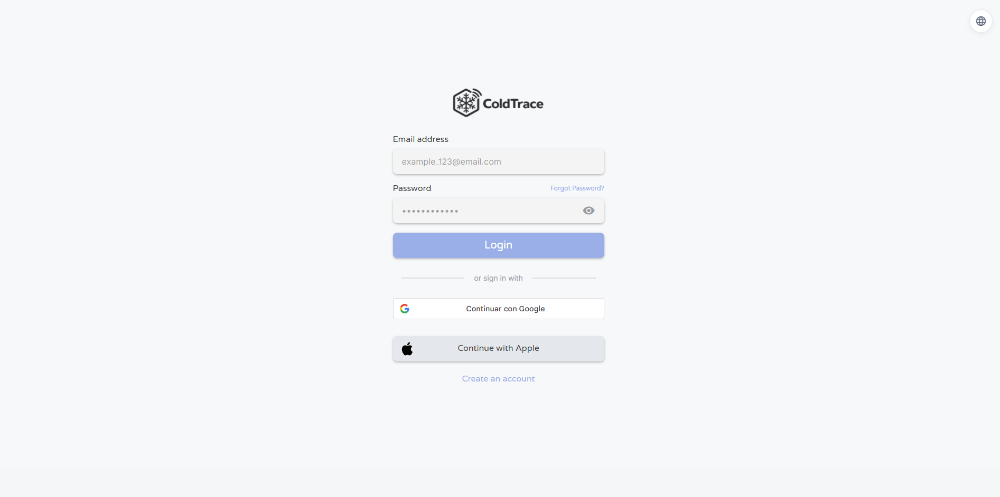
</p>

*Figura 5.2.4.4.1: Interfaz de inicio de sesión con proveedores Google y Apple.*

**AI Assistance.** Se incorporó una base técnica con Spring AI para generar respuestas estructuradas. Sobre esta base se implementaron planes de resolución de incidentes con contexto real, flujos de aprobación o rechazo humano, persistencia del historial de planes, resúmenes inteligentes de reportes e interpretación del dashboard operacional. Estas capacidades buscan apoyar al usuario en la toma de decisiones ante desviaciones de temperatura, cumplimiento sanitario y análisis de estado operativo.

La implementación de AI Assistance siguió un enfoque backend-first. `OPE-87` estableció configuración por variables de entorno y salida estructurada; `OPE-88` generó planes a partir de contexto real de incidencias; `OPE-89` permitió convertir un plan aprobado en una resolución backend; `OPE-90` registró rechazos con trazabilidad; `OPE-91` persistió historial de planes; `OPE-92` produjo resúmenes inteligentes de reportes; y `OPE-114` expuso interpretación IA del dashboard. En todos los casos, la IA se trató como asistencia y no como autoridad automática: el usuario conserva la aprobación final en decisiones operativas.

Esta orientación responde directamente al dominio de cadena de frío: las recomendaciones de IA no se generan como texto genérico, sino a partir de incidentes, reportes, métricas del dashboard y señales operativas persistidas en ColdTrace. El objetivo es reducir el tiempo de análisis del responsable de operaciones sin eliminar la revisión humana sobre decisiones que pueden afectar cumplimiento sanitario, pérdida de mercadería o cierre de incidencias.

<p align="center">
  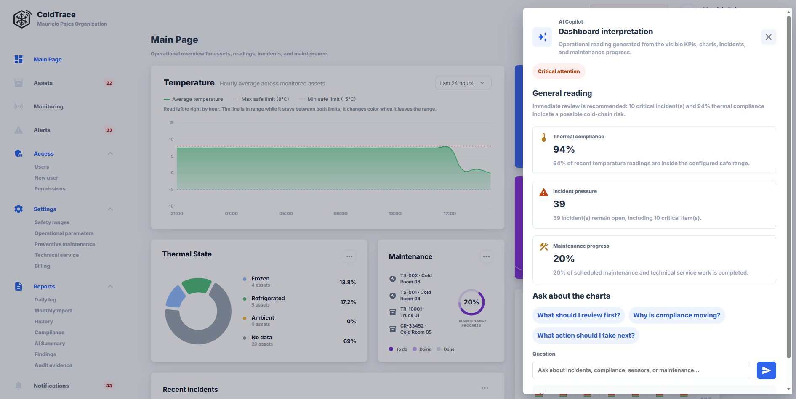
</p>

*Figura 5.2.4.4.2: Interfaz frontend del asistente IA para apoyo operativo.*

**SaaS Plans & Billing.** Se implementó el soporte backend para monetización SaaS: catálogo de planes y precios, suscripciones por organización, entitlements, creación de sesiones de pago con Stripe Checkout, sincronización mediante webhooks, acceso al Stripe Customer Portal y validación de límites según plan. Esto permite proyectar ColdTrace como una plataforma comercial con planes diferenciados.

El trabajo de Billing se separó en dos bloques: catálogo/entitlements y flujos Stripe. `OPE-100` expuso el catálogo backend de planes; `OPE-101` modeló la suscripción activa por organización y sus permisos; `OPE-102` creó sesiones de Stripe Checkout; `OPE-103` sincronizó eventos de suscripción mediante webhooks firmados; `OPE-104` habilitó sesiones de Customer Portal; y `OPE-105` validó límites de plan desde servicios backend. Con esto, las reglas comerciales dejan de depender únicamente de controles visuales y pasan a estar protegidas por la API.

El propósito de este bloque fue preparar a ColdTrace para diferenciar planes comerciales sin duplicar lógica entre landing page, frontend y backend. Linear muestra que el backend ya define el catálogo y aplica límites, mientras que las historias pendientes se concentran en mostrar comparación de planes, uso actual, upgrades y administración de suscripción desde la interfaz.

<p align="center">
  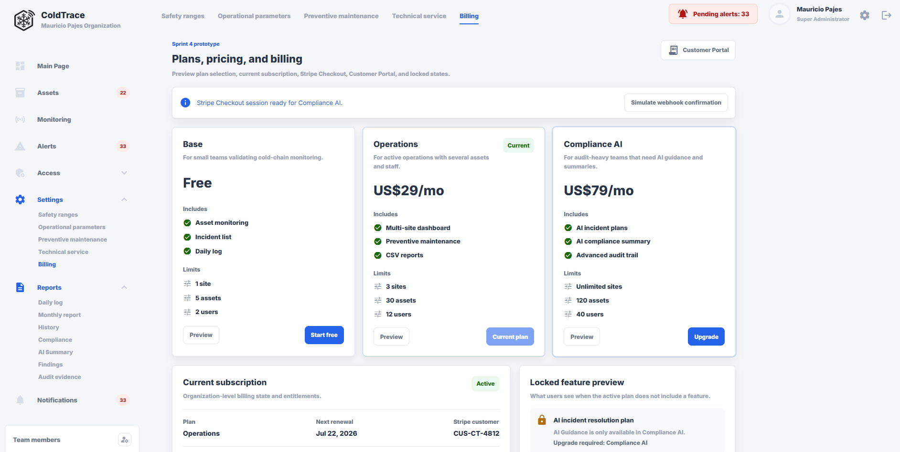
</p>

*Figura 5.2.4.4.3: Interfaz frontend de planes SaaS y billing.*

El desarrollo mantuvo el criterio de separar la lógica de aplicación de los controladores REST, siguiendo la estructura de servicios, persistencia y documentación OpenAPI consolidada en el Sprint 3.

#### 5.2.4.5. Execution Evidence for Sprint Review

La ejecución del Sprint 4 se valida a partir de los flujos funcionales registrados en Linear como completados. El resultado permite demostrar que ColdTrace no solo conserva las funcionalidades operativas previas, sino que incorpora mecanismos de acceso seguro, asistencia inteligente y control comercial por plan.

<table border="1" cellpadding="6" cellspacing="0">
  <tr>
    <th>Flujo validado</th>
    <th>Resultado esperado</th>
    <th>Estado según Linear</th>
  </tr>
  <tr>
    <td>Inicio de sesión con credenciales</td>
    <td>El backend valida las credenciales y emite una sesión JWT para consumir rutas protegidas.</td>
    <td>Done</td>
  </tr>
  <tr>
    <td>Inicio de sesión social</td>
    <td>El usuario puede iniciar el flujo con Google o Apple y recibir una sesión backend compatible con ColdTrace.</td>
    <td>Done</td>
  </tr>
  <tr>
    <td>Generación de plan IA para incidencias</td>
    <td>La API genera un plan de resolución usando información contextual del incidente y del entorno operativo.</td>
    <td>Done</td>
  </tr>
  <tr>
    <td>Aprobación o rechazo de plan IA</td>
    <td>El usuario conserva control humano sobre la recomendación, dejando trazabilidad de la decisión.</td>
    <td>Done</td>
  </tr>
  <tr>
    <td>Resumen inteligente de reportes</td>
    <td>La API genera una síntesis comprensible del reporte de cumplimiento.</td>
    <td>Done</td>
  </tr>
  <tr>
    <td>Interpretación IA del dashboard</td>
    <td>El sistema interpreta el estado operacional y comunica hallazgos relevantes para la toma de decisiones.</td>
    <td>Done</td>
  </tr>
  <tr>
    <td>Checkout y suscripción SaaS</td>
    <td>La organización puede iniciar un checkout, sincronizar su suscripción y aplicar límites según el plan.</td>
    <td>Done</td>
  </tr>
</table>

Las capturas de interfaz y evidencias visuales de los flujos frontend deben complementarse cuando las historias de UI registradas en Linear pasen de estado pendiente a completado. En esta versión del informe, la evidencia principal corresponde al avance técnico y funcional del backend.

Para la revisión del sprint, los flujos se agruparon en tres recorridos demostrables. El primero corresponde a seguridad: el usuario inicia sesión, obtiene token JWT y accede a rutas protegidas sin exponer credenciales ni estado sensible al cliente. El segundo corresponde a asistencia IA: un incidente o reporte existente se usa como fuente factual y el backend devuelve una recomendación estructurada que puede ser aprobada, rechazada o consultada luego en historial. El tercero corresponde a monetización: la organización consulta planes, inicia checkout externo en Stripe y el backend sincroniza el estado de suscripción para aplicar límites.

Estos recorridos muestran que Sprint 4 no solo agrega pantallas, sino reglas de negocio transversales. La autenticación protege la plataforma, AI Assistance reduce tiempo de análisis operativo y Billing prepara el producto para segmentar capacidades por plan.

La revisión de ejecución también evidencia una transición importante en el producto: ColdTrace deja de ser solo una herramienta de monitoreo y gestión operativa para incorporar capacidades de plataforma. A partir de este sprint, el producto empieza a cubrir seguridad de acceso, asistencia para decisiones complejas y preparación comercial para planes diferenciados.

#### 5.2.4.6. Services Documentation Evidence for Sprint Review

Los servicios del Sprint 4 mantienen el enfoque de documentación REST mediante OpenAPI/Swagger UI utilizado en Sprint 3. Las operaciones se agrupan por dominio funcional para facilitar su revisión.

<p align="center">
  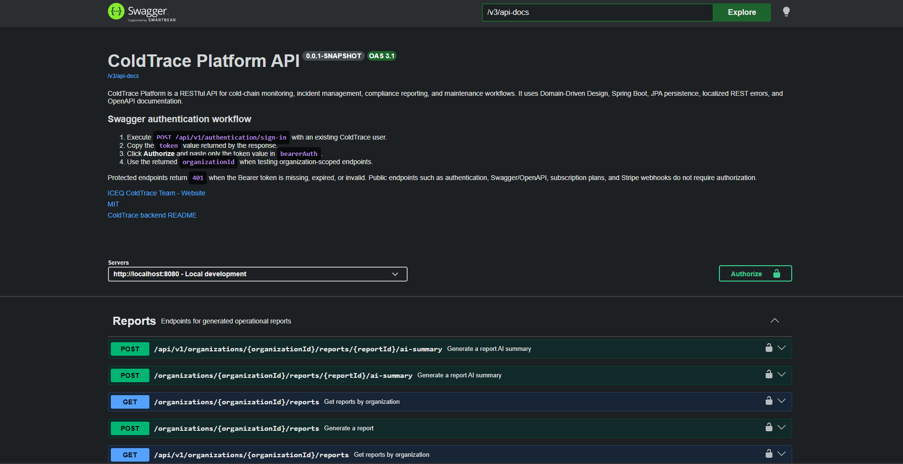
</p>

*Figura 5.2.4.6.1: Vista general de Swagger UI con grupos de endpoints del Sprint 4.*

<table border="1" cellpadding="6" cellspacing="0">
  <tr>
    <th>Grupo de servicios</th>
    <th>Operaciones documentadas</th>
    <th>Propósito</th>
  </tr>
  <tr>
    <td>Authentication</td>
    <td>Login, emisión de JWT, validación de sesión, recuperación de contraseña y protección de rutas.</td>
    <td>Asegurar que solo usuarios autenticados puedan acceder a recursos operativos de ColdTrace.</td>
  </tr>
  <tr>
    <td>OAuth/OIDC</td>
    <td>Inicio de flujo con Google/Apple, callback de proveedor y creación o vinculación de cuenta.</td>
    <td>Permitir autenticación social manteniendo una sesión compatible con el backend de ColdTrace.</td>
  </tr>
  <tr>
    <td>AI Assistance</td>
    <td>Generación de planes, aprobación, rechazo, historial, resumen de reportes e interpretación de dashboard.</td>
    <td>Apoyar decisiones operativas mediante asistencia IA con trazabilidad humana.</td>
  </tr>
  <tr>
    <td>Plans and Billing</td>
    <td>Listado de planes, suscripción de organización, Checkout, webhooks, Customer Portal y validación de límites.</td>
    <td>Gestionar monetización SaaS y restricciones por plan contratado.</td>
  </tr>
</table>

Los endpoints específicos implementados durante el Sprint 4 se listan a continuación, organizados por dominio funcional:

| Grupo | Método | Endpoint | Propósito |
|-------|--------|----------|-----------|
| Authentication | POST | `/api/v1/authentication/sign-in` | Inicio de sesión con credenciales y emisión de JWT |
| Authentication | POST | `/api/v1/authentication/social/{provider}/token-exchange` | Validación de identidad Google/Apple y emisión de sesión ColdTrace |
| Authentication | POST | `/api/v1/authentication/social/{provider}/profile-preview` | Previsualización de perfil externo para completar onboarding |
| Authentication | POST | `/api/v1/authentication/social/{provider}/organization-sign-up` | Registro de organización desde una identidad social validada |
| IAM | GET | `/api/v1/roles` | Consulta de roles disponibles para el frontend |
| IAM | GET | `/api/v1/organizations` | Consulta de organizaciones disponibles para el usuario autenticado |
| IAM | DELETE | `/api/v1/organizations/{organizationId}/users/{userId}` | Eliminación controlada de usuarios internos por organización |
| AI Assistance | POST | `/api/v1/organizations/{organizationId}/incidents/{incidentId}/ai-resolution-plans` | Generar plan de resolución de incidente con contexto real |
| AI Assistance | POST | `/api/v1/organizations/{organizationId}/incidents/{incidentId}/ai-resolution-plans/{planId}/approvals` | Aprobar plan generado y ejecutar resolución con control humano |
| AI Assistance | POST | `/api/v1/organizations/{organizationId}/incidents/{incidentId}/ai-resolution-plans/{planId}/rejections` | Rechazar plan con trazabilidad sin alterar la incidencia |
| AI Assistance | GET | `/api/v1/organizations/{organizationId}/incidents/{incidentId}/ai-resolution-plans` | Consultar historial de planes por incidencia |
| AI Assistance | POST | `/api/v1/organizations/{organizationId}/reports/{reportId}/ai-summaries` | Generar resumen inteligente de reporte |
| AI Assistance | POST | `/api/v1/organizations/{organizationId}/dashboard/ai-interpretation` | Interpretación IA del dashboard operacional |
| Plans & Billing | GET | `/api/v1/subscription-plans` | Listar catálogo público de planes |
| Plans & Billing | GET | `/api/v1/organizations/{organizationId}/subscription` | Consultar suscripción, límites y funcionalidades de una organización |
| Plans & Billing | POST | `/api/v1/organizations/{organizationId}/billing/checkout-sessions` | Crear sesión de Stripe Checkout |
| Plans & Billing | POST | `/api/v1/organizations/{organizationId}/billing/customer-portal-sessions` | Crear sesión de Stripe Customer Portal |
| Plans & Billing | POST | `/api/v1/billing/stripe/webhooks` | Procesar webhooks firmados de Stripe |
| Asset Management | DELETE | `/api/v1/organizations/{organizationId}/assets/{assetId}` | Eliminación controlada de activos cuando no existen dependencias bloqueantes |
| Asset Management | DELETE | `/api/v1/organizations/{organizationId}/gateways/{gatewayId}` | Eliminación controlada de gateways asociados a la organización |
| Asset Management | DELETE | `/api/v1/organizations/{organizationId}/iot-devices/{iotDeviceId}` | Eliminación controlada de dispositivos IoT |
| Asset Management | DELETE | `/api/v1/organizations/{organizationId}/locations/{locationId}` | Eliminación controlada de ubicaciones |

La documentación de servicios refleja los contratos finales disponibles en Swagger UI, incluyendo códigos de respuesta, validaciones y errores de negocio. Para Sprint 4, los grupos más sensibles son los endpoints protegidos por JWT, las operaciones OAuth/OIDC, los webhooks de Stripe, las respuestas estructuradas de IA y las operaciones `DELETE` que pueden devolver `409 Conflict` cuando existen dependencias de negocio.

Como parte del cierre de integración, todos los controladores REST quedaron normalizados bajo el prefijo `/api/v1`. Esto evita rutas duplicadas en Swagger UI, reduce ambigüedad para el frontend desplegado en Vercel y mantiene consistencia con el versionamiento de la RESTful API. El frontend fue ajustado para consumir los mismos paths versionados usados por el backend en Cloud Run.

La documentación de estos servicios es especialmente relevante porque las historias frontend pendientes dependen de contratos estables. Los endpoints de autenticación deben devolver sesiones coherentes para rutas protegidas, los endpoints IA deben exponer respuestas estructuradas y auditables, y los endpoints de billing deben manejar redirecciones, eventos externos de Stripe y validaciones de plan sin exponer secretos al cliente.

<p align="center">
  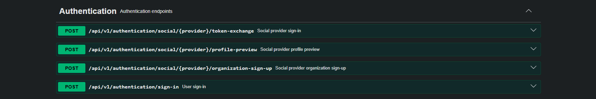
</p>

*Figura 5.2.4.6.2: Endpoints de autenticación y OAuth/OIDC documentados en Swagger UI.*

<p align="center">
  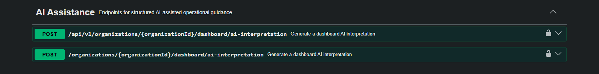
</p>

*Figura 5.2.4.6.3: Endpoints de AI Assistance documentados en Swagger UI.*

<p align="center">
  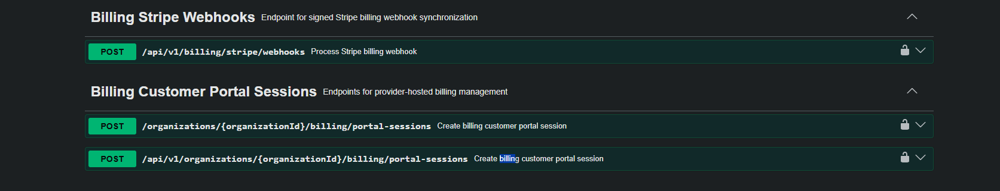
</p>

*Figura 5.2.4.6.4: Endpoints de billing, checkout, Customer Portal y webhooks documentados en Swagger UI.*

#### 5.2.4.7. Software Deployment Evidence for Sprint Review

Sprint 4 se apoya en la infraestructura de despliegue implementada en Sprint 3 para la RESTful API de ColdTrace. La aplicación backend continúa orientada a ejecución en **Google Cloud Run**, con contenedorización Docker y configuración por variables de entorno.

| Componente | Detalle |
|---|---|
| Plataforma cloud | Google Cloud Run (serverless container) |
| URL de producción | `https://coldtrace-platform-dtbzbm7bta-uc.a.run.app` |
| Stack backend | Java 26, Spring Boot 4.0.6, Spring AI, Spring Security OAuth2 |
| Base de datos | MySQL 8.0 en Cloud SQL (Private IP) |
| Autenticación | JWT + OAuth2 (Google, Apple) |
| Pasarela de pagos | Stripe Checkout, Webhooks, Customer Portal |
| Contenedorización | Docker multi-stage (JAR distroless) |
| CI/CD | Cloud Build + Artifact Registry + Cloud Run deploy |

Para habilitar las capacidades agregadas en Sprint 4, el despliegue requiere variables y secretos adicionales:

| Categoría | Configuración requerida | Uso |
|---|---|---|
| JWT | Secreto de firma, expiración de token y configuración de rutas protegidas. | Emitir y validar sesiones seguras. |
| OAuth/OIDC | Client ID, Client Secret, redirect URIs y configuración de proveedores Google/Apple. | Completar autenticación social. |
| AI Assistance | API key del proveedor de IA y configuración de Spring AI. | Generar planes, resúmenes e interpretaciones inteligentes. |
| Stripe Billing | Stripe Secret Key, Price IDs, webhook secret y URLs de retorno. | Crear checkout, sincronizar suscripciones y abrir Customer Portal. |

Como evidencia de la configuración real de los proveedores externos utilizados en el
Sprint 4, se documentan las consolas de administración de cada servicio integrado.

**Google — OAuth 2.0 / OpenID Connect**

Se configuró un OAuth Client de tipo Web Application en Google Cloud, registrando los
Authorized JavaScript origins y los Authorized redirect URIs correspondientes a los
entornos local y desplegado del frontend de ColdTrace.

<p align="center">
  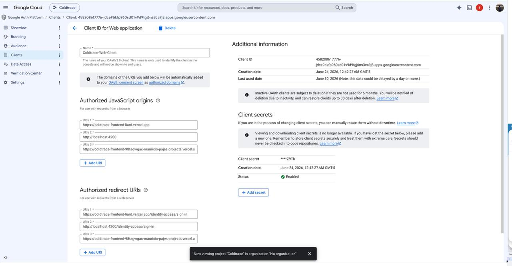
</p>

*Figura 5.2.4.7.1: OAuth Client Web configurado en Google Cloud con origins y redirect URIs de ColdTrace.*

**Apple — Sign in with Apple**

Se registró el Identifier `com.coldtrace.web` en Apple Developer para habilitar el flujo
de Sign in with Apple como proveedor de identidad externo.

<p align="center">
  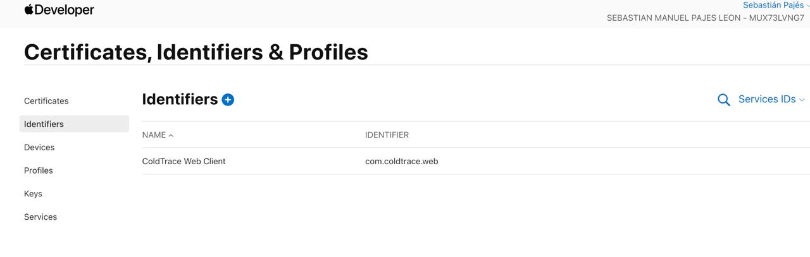
</p>

*Figura 5.2.4.7.2: Identifier de Sign in with Apple registrado en Apple Developer.*

**OpenAI — AI Assistance**

Se generó una API key de producción (`coldtrace-platform-prod`) en la consola de OpenAI,
consumida por Spring AI en el entorno desplegado para las capacidades de asistencia
inteligente. La clave se enmascara y se gestiona mediante variables de entorno del
servicio, sin registrarse en el repositorio.

<p align="center">
  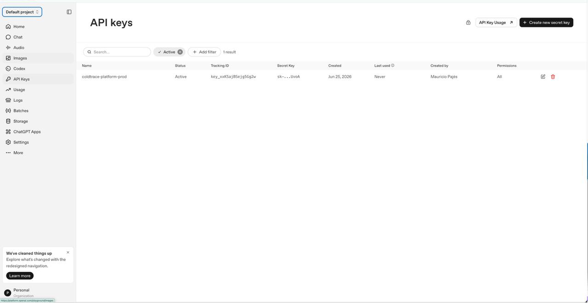
</p>

*Figura 5.2.4.7.3: API key de producción configurada en OpenAI para AI Assistance.*

**Stripe — Subscription & Billing**

Se configuró el catálogo de productos y planes de suscripción en el entorno de prueba de
Stripe, incluyendo los planes ColdTrace Operations y ColdTrace Compliance AI con su
precio mensual recurrente en PEN.

<p align="center">
  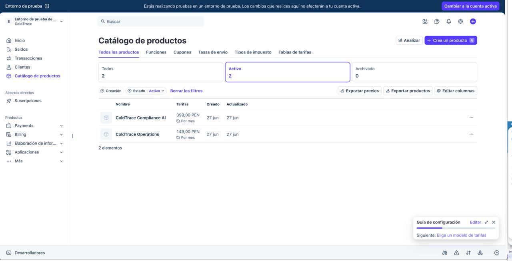
</p>

*Figura 5.2.4.7.4: Catálogo de planes de suscripción configurado en Stripe.*

<p align="center">
  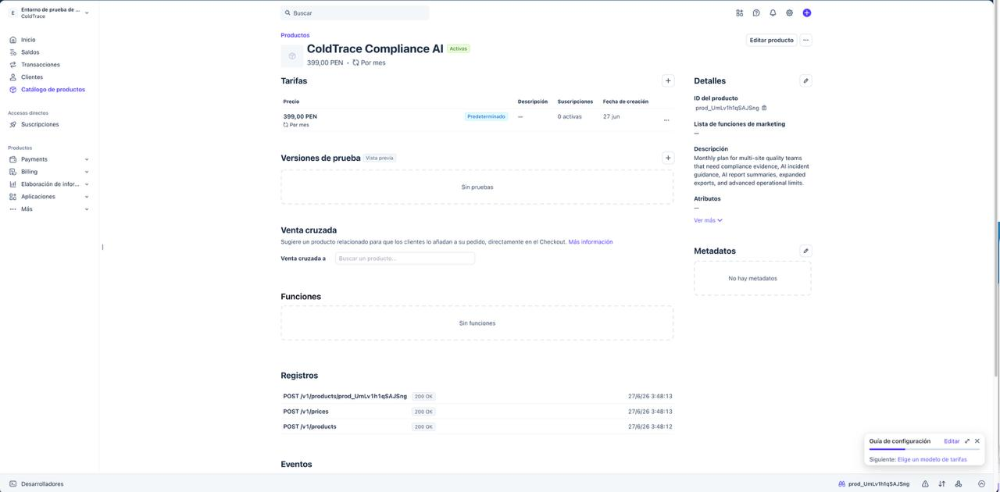
</p>

*Figura 5.2.4.7.5: Configuración del plan Compliance AI y su tarifa recurrente en Stripe.*

El despliegue del Sprint 4 se realizó sobre la misma revisión de Cloud Run utilizada en Sprint 3, incorporando las nuevas capacidades mediante actualización continua (re-deploy) desde la rama `develop` del repositorio `ICEQ2026/coldtrace-platform`. No se requirió una nueva URL ni un nuevo servicio; la extensión funcional se entregó como una evolución del servicio backend existente.

Las configuraciones de Sprint 4 incrementan la sensibilidad del entorno de despliegue porque incluyen secretos de autenticación, proveedores externos y webhooks. Por ello, la documentación del sprint considera como buena práctica mantener estos valores fuera del repositorio, cargarlos mediante variables de entorno del servicio desplegado y validar los callbacks con URLs controladas por el equipo. Este criterio mantiene consistencia con el despliegue en Cloud Run usado en Sprint 3.

#### 5.2.4.8. Team Collaboration Insights during Sprint

La colaboración del Sprint 4 se organizó mediante Linear App, separando el trabajo en tres proyectos funcionales. Esta estructura permitió controlar mejor el avance de capacidades con dependencias externas, como proveedores OAuth/OIDC, servicios de IA y Stripe.

<table border="1" cellpadding="6" cellspacing="0">
  <tr>
    <th>Proyecto Linear</th>
    <th>Estado del proyecto</th>
    <th>Avance principal</th>
    <th>Riesgo o pendiente</th>
  </tr>
  <tr>
    <td>ColdTrace Sprint 4 - Identity and Access</td>
    <td>In Progress</td>
    <td>JWT, rutas protegidas, CORS, recuperación de contraseña y OAuth/OIDC completados.</td>
    <td>Validación visual completa del flujo en frontend y documentación final de evidencias.</td>
  </tr>
  <tr>
    <td>ColdTrace Sprint 4 - AI Assistance</td>
    <td>In Progress</td>
    <td>Servicios backend de asistencia IA completados para incidentes, reportes y dashboard.</td>
    <td>Integración final de pantallas y componentes frontend asociados a las historias de usuario pendientes.</td>
  </tr>
  <tr>
    <td>ColdTrace Sprint 4 - SaaS Plans and Billing</td>
    <td>In Progress</td>
    <td>Technical Stories backend completadas para catálogo, suscripciones, Stripe y límites por plan.</td>
    <td>Construcción o cierre de pantallas de pricing, checkout y gestión de suscripción en frontend.</td>
  </tr>
</table>

El principal aprendizaje del Sprint 4 fue la necesidad de separar con claridad la evidencia técnica backend de la evidencia visual frontend. Linear muestra un avance importante en servicios y lógica de plataforma, pero también evidencia que varias historias de experiencia de usuario deben completarse antes de presentar el Sprint 4 como una entrega totalmente cerrada desde la perspectiva del producto final.

En términos de colaboración, Linear permitió visualizar dependencias entre technical stories y user stories. Las tareas backend cerradas desbloquean las historias frontend, porque definen contratos reales para consumir desde la aplicación web y la landing page. La revisión del tablero también permitió identificar que los proyectos de AI Assistance y Billing no deben reportarse como completados a nivel de producto mientras sus historias de experiencia permanezcan en Todo, aunque sus servicios principales ya estén disponibles.

La distribución del trabajo evidencia un patrón de avance por capas: primero se cerraron servicios críticos de backend, luego se dejaron preparadas las interfaces para consumir esos contratos. Para el siguiente ciclo, la prioridad natural será cerrar las historias frontend de AI Guidance, dashboard interpretation, pricing, checkout y administración de suscripción, usando como base los endpoints ya implementados.

**Resumen de evidencias colaborativas por actividad**

| Actividad colaborativa | Evidencia documentada | Repositorio o herramienta |
|---|---|---|
| Development | Implementación de tickets backend para JWT/OAuth, Spring AI y Billing; separación explícita de tickets frontend pendientes. | Linear App, `ICEQ2026/coldtrace-platform`, `ICEQ2026/coldtrace-frontend` |
| Execution | Validación funcional mediante flujos de login social, panel IA, billing frontend y endpoints documentados en Swagger UI. | Frontend Web Application, Swagger UI |
| Documentation | Actualización del Sprint Backlog 4, documentación de hitos Linear, evidencias visuales y alcance pendiente. | `ICEQ2026/informe-del-proyecto`, Linear App |
| Deployment | Uso de la infraestructura previa de Cloud Run, con nuevas variables para JWT, OAuth/OIDC, proveedor IA y Stripe. | Google Cloud Run, configuración por variables de entorno |
| Agile tracking | Seguimiento de estados Done, In Progress y Todo por proyecto, milestone y ticket OPE del Sprint 4. | Linear App |

<p align="center">
  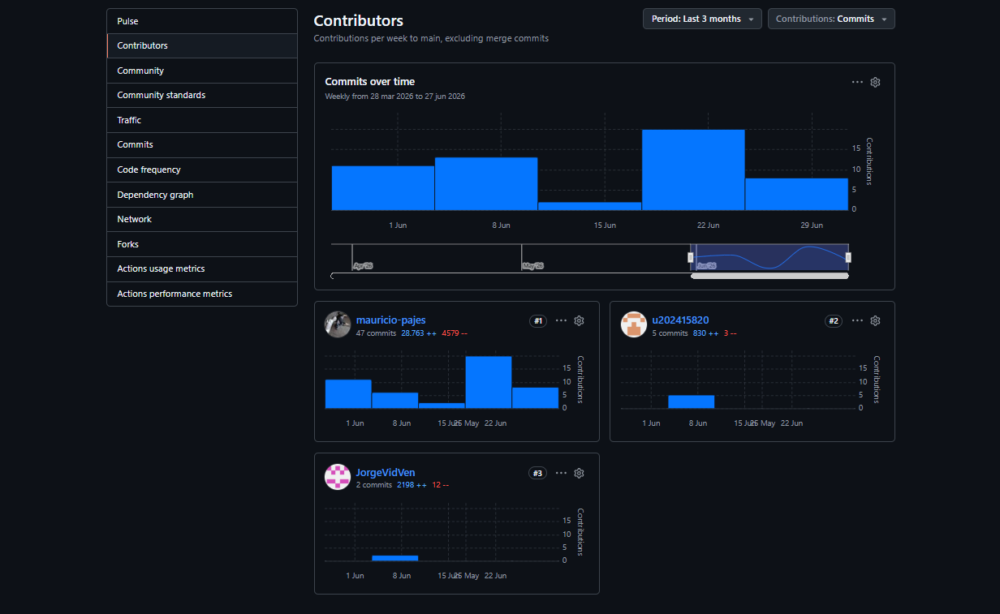
</p>

*Figura 5.2.4.8.1: Contribuciones del equipo en GitHub durante el Sprint 4.*

<p align="center">
  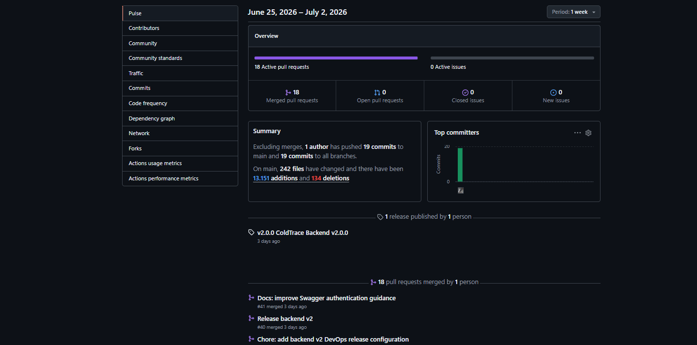
</p>

*Figura 5.2.4.8.2: Actividad del repositorio en GitHub Pulse para Sprint 4.*

---

## 5.3. Validation Interviews

### 5.3.1. Diseño de Entrevistas

Para la validación de la solución implementada, se diseñaron entrevistas dirigidas a representantes de los segmentos objetivo identificados en las fases iniciales del proyecto. El objetivo fue evaluar la percepción de los usuarios sobre la funcionalidad, usabilidad y pertinencia de la RESTful API de ColdTrace y su integración con la Frontend Web Application.

Se definieron dos perfiles de entrevistados:

- **Dueño o encargado de negocio:** Interesado en la reducción de merma, el cumplimiento sanitario y la generación de reportes operativos.
- **Responsable de operaciones o calidad:** Enfocado en el monitoreo en tiempo real, la gestión de alertas e incidencias y la configuración de parámetros operativos.

Las entrevistas se estructuraron en torno a los siguientes ejes de validación:

1. **Registro y gestión de organizaciones y usuarios:** Validar que el flujo de sign-up y administración de usuarios sea claro y funcional.
2. **Gestión de activos e infraestructura IoT:** Evaluar la facilidad para registrar activos, vincular sensores y configurar gateways.
3. **Monitoreo y alertas:** Verificar que la visualización de lecturas de sensores y la gestión de incidencias térmicas responda a las necesidades operativas.
4. **Reportes y cumplimiento:** Confirmar que la generación de reportes operativos y de cumplimiento sea útil para la toma de decisiones.
5. **Mantenimiento y servicio técnico:** Evaluar la utilidad de la programación de mantenimiento preventivo y la gestión de solicitudes de servicio técnico.

### 5.3.2. Registro de Entrevistas

A continuación se presentan los resultados de las entrevistas realizadas, incluyendo el perfil del entrevistado, los hallazgos principales y las recomendaciones derivadas.

| Entrevistado | Perfil | Hallazgos principales | Recomendaciones |
|---|---|---|---|
| Entrevistado 1 | Dueño de minimarket con cadena de frío propia | La gestión de activos y el monitoreo en tiempo real son las funcionalidades más valoradas. Se identificó la necesidad de alertas más tempranas. | Incorporar un dashboard resumen con indicadores críticos visibles sin necesidad de navegación. |
| Entrevistado 2 | Jefa de calidad en empresa de distribución de alimentos | La generación de reportes de cumplimiento y la trazabilidad de incidencias fueron destacadas como esenciales para auditorías sanitarias. | Permitir la exportación de reportes en formatos adicionales (PDF, Excel). |
| Entrevistado 3 | Encargado de operaciones en almacén refrigerado | La configuración de rangos de seguridad y la programación de mantenimiento preventivo fueron consideradas herramientas útiles para la operación diaria. | Desarrollar vistas móviles para consulta rápida de estado de activos. |
| Entrevistado 4 | Administradora de restaurante con cámaras frigoríficas | La facilidad de uso de la plataforma y la claridad de las alertas fueron bien recibidas. Sugirió incluir notificaciones por WhatsApp. | Integrar canales de notificación adicionales (WhatsApp, SMS). |

<br>

**Registro de Entrevistas de Validación**

<table style="width:100%; border-collapse:collapse;">
  <tbody>
    <tr>
      <td colspan="4" align="center"><strong>Entrevista de Validación N.° 1</strong></td>
    </tr>
    <tr>
      <td colspan="4" align="center">
        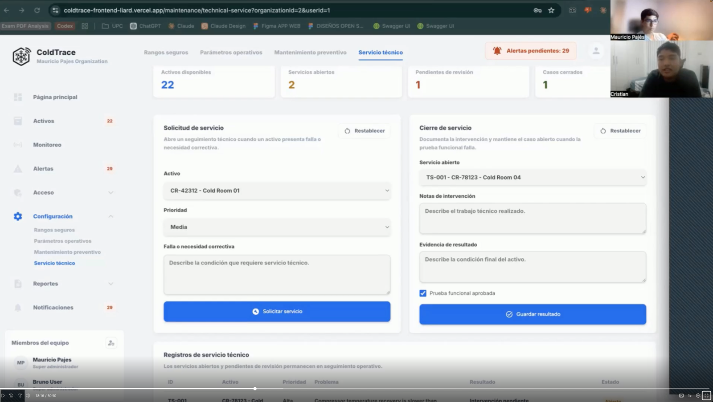
      </td>
    </tr>
    <tr>
      <td colspan="2" align="center"><strong>Información del entrevistado</strong></td>
      <td colspan="2" align="center"><strong>Contexto tecnológico</strong></td>
    </tr>
    <tr>
      <td><strong>Nombre completo</strong></td>
      <td>Entrevistado 1</td>
      <td><strong>Dispositivo de mayor frecuencia</strong></td>
      <td>Smartphone (Android) y Laptop (Windows)</td>
    </tr>
    <tr>
      <td><strong>Edad</strong></td>
      <td>45 años</td>
      <td><strong>Sistema operativo/browser</strong></td>
      <td>Windows / Google Chrome</td>
    </tr>
    <tr>
      <td><strong>Definición profesional / cargo</strong></td>
      <td>Dueño de Minimarket "Mendoza & Hijos"</td>
      <td><strong>Canales digitales de comunicación</strong></td>
      <td>WhatsApp y llamadas telefónicas</td>
    </tr>
    <tr>
      <td><strong>Residencia / ubicación</strong></td>
      <td>Santiago de Surco, Lima</td>
      <td><strong>Software especializado utilizado</strong></td>
      <td>Microsoft Excel y Apps bancarias</td>
    </tr>
    <tr>
      <td colspan="2"><strong>Timing:</strong> 00:00 – 15:29 (Duración: 15:29)</td>
<td colspan="2"><strong>URL de grabación:</strong> <a href="https://upcedupe-my.sharepoint.com/:v:/g/personal/u202415820_upc_edu_pe/IQCue8U2wEwWQYCSPjlOcDalAbyikaIiXAIyY3yIUsQvowA?nav=eyJyZWZlcnJhbEluZm8iOnsicmVmZXJyYWxBcHAiOiJPbmVEcml2ZUZvckJ1c2luZXNzIiwicmVmZXJyYWxBcHBQbGF0Zm9ybSI6IldlYiIsInJlZmVycmFsTW9kZSI6InZpZXciLCJyZWZlcnJhbFZpZXciOiJNeUZpbGVzTGlua0NvcHkifX0&e=wAuYWj&t=0s">Ver video (inicia 00:00)</a></td>
    </tr>
    <tr>
      <td colspan="4">
        <strong>Resumen de la entrevista</strong><br><br>
        El entrevistado evaluó la interfaz web de ColdTrace y destacó la facilidad de navegación y la claridad de la información de los activos de refrigeración. Mencionó que la gestión de activos en tiempo real les permitiría reaccionar ante fallas operativas de sus congeladoras. Recomendó incorporar una vista de dashboard tipo resumen rápido (resumen ejecutivo) que permita ver la salud de todos los activos sin tener que entrar al detalle de cada uno.
      </td>
    </tr>
  </tbody>
</table>

<table style="width:100%; border-collapse:collapse;">
  <tbody>
    <tr>
      <td colspan="4" align="center"><strong>Entrevista de Validación N.° 2</strong></td>
    </tr>
    <tr>
      <td colspan="4" align="center">
        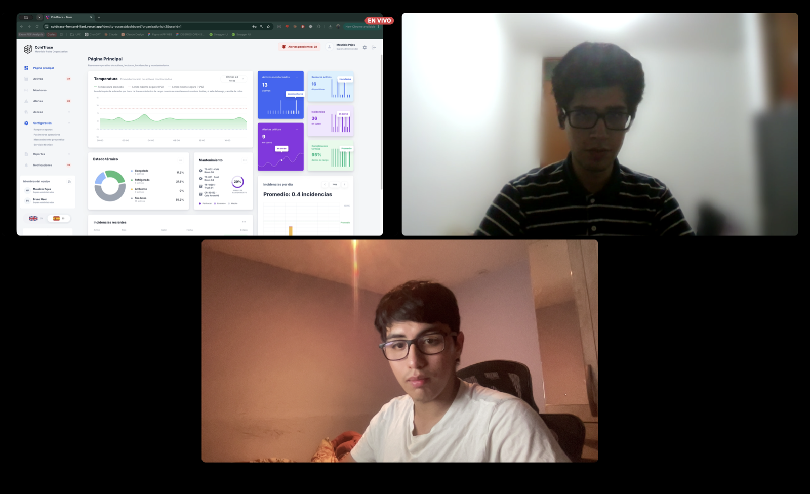
      </td>
    </tr>
    <tr>
      <td colspan="2" align="center"><strong>Información del entrevistado</strong></td>
      <td colspan="2" align="center"><strong>Contexto tecnológico</strong></td>
    </tr>
    <tr>
      <td><strong>Nombre completo</strong></td>
      <td>Entrevistado 2</td>
      <td><strong>Dispositivo de mayor frecuencia</strong></td>
      <td>Laptop Corporativa y Tablet Android</td>
    </tr>
    <tr>
      <td><strong>Edad</strong></td>
      <td>34 años</td>
      <td><strong>Sistema operativo/browser</strong></td>
      <td>Windows / Google Chrome</td>
    </tr>
    <tr>
      <td><strong>Definición profesional / cargo</strong></td>
      <td>Jefa de Calidad Alimentaria en "Logística del Frío S.A."</td>
      <td><strong>Canales digitales de comunicación</strong></td>
      <td>Microsoft Teams y correo corporativo</td>
    </tr>
    <tr>
      <td><strong>Residencia / ubicación</strong></td>
      <td>Callao</td>
      <td><strong>Software especializado utilizado</strong></td>
      <td>Microsoft Excel, Power BI</td>
    </tr>
    <tr>
      <td colspan="2"><strong>Timing:</strong> 15:29 – 32:19 (Duración: 16:50)</td>
<td colspan="2"><strong>URL de grabación:</strong> <a href="https://upcedupe-my.sharepoint.com/:v:/g/personal/u202415820_upc_edu_pe/IQCue8U2wEwWQYCSPjlOcDalAbyikaIiXAIyY3yIUsQvowA?nav=eyJyZWZlcnJhbEluZm8iOnsicmVmZXJyYWxBcHAiOiJPbmVEcml2ZUZvckJ1c2luZXNzIiwicmVmZXJyYWxBcHBQbGF0Zm9ybSI6IldlYiIsInJlZmVycmFsTW9kZSI6InZpZXciLCJyZWZlcnJhbFZpZXciOiJNeUZpbGVzTGlua0NvcHkifX0&e=wAuYWj&t=929s">Ver video (inicia 15:29)</a></td>
    </tr>
    <tr>
      <td colspan="4">
        <strong>Resumen de la entrevista</strong><br><br>
        La entrevistada se enfocó en el módulo de reportes y cumplimiento de ColdTrace. Valoró la bitácora diaria y el reporte de cumplimiento sanitario, ya que facilita enormemente la consolidación de evidencia para las auditorías de DIGESA. Recomendó que las exportaciones no solo estén disponibles como datos tabulares, sino que se habilite la exportación en formatos amigables como PDF y Excel con plantillas de presentación.
      </td>
    </tr>
  </tbody>
</table>

<table style="width:100%; border-collapse:collapse;">
  <tbody>
    <tr>
      <td colspan="4" align="center"><strong>Entrevista de Validación N.° 3</strong></td>
    </tr>
    <tr>
      <td colspan="4" align="center">
        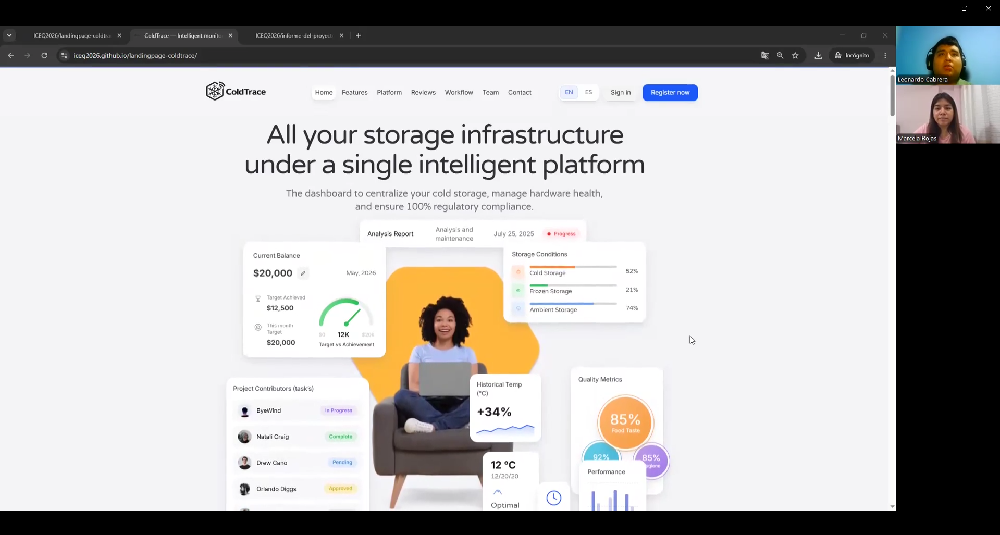
      </td>
    </tr>
    <tr>
      <td colspan="2" align="center"><strong>Información del entrevistado</strong></td>
      <td colspan="2" align="center"><strong>Contexto tecnológico</strong></td>
    </tr>
    <tr>
      <td><strong>Nombre completo</strong></td>
      <td>Marcela Rojas Cárdenas</td>
      <td><strong>Dispositivo de mayor frecuencia</strong></td>
      <td>Laptop (Windows) y Smartphone (Android)</td>
    </tr>
    <tr>
      <td><strong>Edad</strong></td>
      <td>30 años</td>
      <td><strong>Sistema operativo/browser</strong></td>
      <td>Windows / Google Chrome</td>
    </tr>
    <tr>
      <td><strong>Definición profesional / cargo</strong></td>
      <td>Jefa de Operaciones y Control de Calidad en "FríoAndino Distribución S.A.C."</td>
      <td><strong>Canales digitales de comunicación</strong></td>
      <td>Correo corporativo y WhatsApp</td>
    </tr>
    <tr>
      <td><strong>Residencia / ubicación</strong></td>
      <td>Ate, Lima</td>
      <td><strong>Software especializado utilizado</strong></td>
      <td>Microsoft Excel y sistema de gestión de almacén</td>
    </tr>
    <tr>
      <td colspan="2"><strong>Timing:</strong> 32:19 – 46:10 </td>
      <td colspan="2"><strong>URL de grabación:</strong> <a href="https://upcedupe-my.sharepoint.com/:v:/g/personal/u202415820_upc_edu_pe/IQCue8U2wEwWQYCSPjlOcDalAbyikaIiXAIyY3yIUsQvowA?nav=eyJyZWZlcnJhbEluZm8iOnsicmVmZXJyYWxBcHAiOiJPbmVEcml2ZUZvckJ1c2luZXNzIiwicmVmZXJyYWxBcHBQbGF0Zm9ybSI6IldlYiIsInJlZmVycmFsTW9kZSI6InZpZXciLCJyZWZlcnJhbFZpZXciOiJNeUZpbGVzTGlua0NvcHkifX0&e=wAuYWj&t=1939s">Ver video (inicia 32:19)</a></td>
    </tr>
    <tr>
      <td colspan="4">
        <strong>Resumen de la entrevista</strong><br><br>
        Marcela validó ColdTrace desde la perspectiva de una operación con múltiples cámaras frigoríficas y necesidades de auditoría sanitaria. Al inicio planteó sus tres principales dolores: no enterarse a tiempo de una falla de refrigeración, la pérdida de producto por reacción tardía y la dificultad para armar el historial de temperaturas ante auditorías de DIGESA. Sobre la Landing Page, indicó que la propuesta de valor se comprende de inmediato y que, por el tamaño de su operación, optaría por un plan superior con reportes avanzados. En la Frontend Web Application destacó el dashboard operacional y el monitoreo en tiempo real de temperatura y humedad como la funcionalidad que resuelve su falta de visibilidad actual, valorando el historial de lecturas como insumo directo para auditorías. En el módulo de alertas apreció la trazabilidad de detección y reconocimiento de incidencias, sugiriendo como mejora la notificación por WhatsApp o SMS. En reportes de cumplimiento, identificó la bitácora diaria exportable como la solución a su necesidad de trazabilidad, recomendando habilitar exportación en PDF y Excel. Concluyó que adoptaría la herramienta y la recomendaría a colegas del sector.
      </td>
    </tr>
  </tbody>
</table>

<table style="width:100%; border-collapse:collapse;">
  <tbody>
    <tr>
      <td colspan="4" align="center"><strong>Entrevista de Validación N.° 4</strong></td>
    </tr>
    <tr>
      <td colspan="2" align="center"><strong>Información del entrevistado</strong></td>
      <td colspan="2" align="center"><strong>Contexto tecnológico</strong></td>
    </tr>
    <tr>
      <td><strong>Nombre completo</strong></td>
      <td>Entrevistado 4</td>
      <td><strong>Dispositivo de mayor frecuencia</strong></td>
      <td>iPhone (iOS) y iPad</td>
    </tr>
    <tr>
      <td><strong>Edad</strong></td>
      <td>31 años</td>
      <td><strong>Sistema operativo/browser</strong></td>
      <td>iOS / Safari</td>
    </tr>
    <tr>
      <td><strong>Definición profesional / cargo</strong></td>
      <td>Administradora de Restaurante "El Buen Gusto"</td>
      <td><strong>Canales digitales de comunicación</strong></td>
      <td>WhatsApp y iMessage</td>
    </tr>
    <tr>
      <td><strong>Residencia / ubicación</strong></td>
      <td>Miraflores, Lima</td>
      <td><strong>Software especializado utilizado</strong></td>
      <td>Sistema POS de comandas y Microsoft Excel</td>
    </tr>
    <tr>
      <td colspan="2"><strong>Duración:</strong> 46:10 - 62:23 </td>
      <td colspan="2"><strong>URL de grabación:</strong> <a href="https://upcedupe-my.sharepoint.com/:v:/g/personal/u202410093_upc_edu_pe/IQBJYgNJwvtfRqy0uHqXB3isAZZnAZqgRG9g19PW-b6JXlk?nav=eyJyZWZlcnJhbEluZm8iOnsicmVmZXJyYWxBcHAiOiJTdHJlYW1XZWJBcHAiLCJyZWZlcnJhbFZpZXciOiJTaGFyZURpYWxvZy1MaW5rIiwicmVmZXJyYWxBcHBQbGF0Zm9ybSI6IldlYiIsInJlZmVycmFsTW9kZSI6InZpZXcifX0%3D&amp;e=qZMIiB">Ver video</a></td>
    </tr>
    <tr>
      <td colspan="4">
        <strong>Resumen de la entrevista</strong><br><br>
        Ana evaluó la facilidad de uso del dashboard de monitoreo de temperatura y el módulo de alertas. Destacó que el flujo de reconocimiento de incidencias es claro e intuitivo para el personal del restaurante. Como recomendación de mejora, sugirió agregar canales de notificación adicionales como alertas directas por WhatsApp o SMS para avisar al administrador de guardia cuando el restaurante esté cerrado.
      </td>
    </tr>
  </tbody>
</table>


### 5.3.3. Evaluaciones según heurísticas

Esta sección contiene el proceso de evaluación de las sesiones de validación basado en heurísticas, considerando heurísticas de usabilidad, arquitectura de información e inclusive design de la experiencia propuesta.

#### UX Heuristics & Principles Evaluation
**Usability – Inclusive Design – Information Architecture**

* **CARRERA:** Ingeniería de Software
* **CURSO:** Desarrollo de Aplicaciones Open Source
* **SECCIÓN:** 1ASI0729
* **PROFESORES:** Mori Paiva, Hugo Allan
* **AUDITOR:** Grupo 3 (ICEQ)
* **CLIENTE(S):** Entrevistado 1, Entrevistado 2, Entrevistado 3, Entrevistado 4

---

**SITE o APP A EVALUAR:** ColdTrace

**TAREAS A EVALUAR:**
El alcance de esta evaluación incluye la revisión de la usabilidad de las siguientes tareas:
1. Registro de una organización y usuario administrador.
2. Configuración de un activo de refrigeración (congeladora/cámara).
3. Vinculación de un sensor de temperatura/humedad a un activo.
4. Visualización de telemetría en tiempo real en el dashboard operacional.
5. Visualización del historial de alertas y cambio de estado de una alerta a "Reconocida".
6. Generación y exportación de reportes de cumplimiento diario de la cadena de frío.
7. Registro de orden de trabajo o mantenimiento preventivo.

No están incluidas en esta versión de la evaluación las siguientes tareas:
1. Configuración de alertas en tiempo real vía WhatsApp o SMS (notificaciones externas).
2. Integración directa con sensores físicos (hardware IoT directo).
3. Exportación de reportes en formatos PDF y Excel personalizados.
4. Configuración avanzada de perfiles de usuario corporativos multi-sede.

---

**ESCALA DE SEVERIDAD:**
Los errores serán puntuados tomando en cuenta la siguiente escala de severidad:

| Nivel | Descripción |
|---|---|
| 1 | Problema superficial: puede ser fácilmente superado por el usuario o ocurre con muy poca frecuencia. No necesita ser arreglado a no ser que exista disponibilidad de tiempo. |
| 2 | Problema menor: puede ocurrir un poco más frecuentemente o es un poco más difícil de superar para el usuario. Se le debería asignar una prioridad baja resolverlo de cara al siguiente release. |
| 3 | Problema mayor: ocurre frecuentemente o los usuarios no son capaces de resolverlos. Es importante que sean corregidos y se les debe asignar una prioridad alta. |
| 4 | Problema muy grave: un error de gran impacto que impide al usuario continuar con el uso de la herramienta. Es imperativo que sea corregido antes del lanzamiento. |

---

**TABLA RESUMEN:**

| # | Problema | Escala de severidad | Heurística/Principio violada(o) |
|---|---|---|---|
| 1 | Falta de un dashboard ejecutivo/resumen que muestre el estado consolidado de todos los activos en una sola vista. | 2 | Usability: Reconocimiento antes que recuerdo / Estética y diseño minimalista |
| 2 | La exportación de reportes de cumplimiento de la cadena de frío solo está disponible en formato web de datos tabulares, sin opciones portables. | 2 | Usability: Flexibilidad y eficiencia de uso / Information Architecture: Is it usable? |
| 3 | Las alertas críticas de temperatura fuera de rango solo se notifican en la plataforma web, limitando la reacción oportuna. | 3 | Usability: Ayudar a los usuarios a reconocer, diagnosticar y recuperarse de los errores |
| 4 | Layout del dashboard y tablas no optimizado para pantallas de smartphones (resolución móvil pequeña). | 2 | Inclusive Design: Proporciona experiencias comparables |

---

**DESCRIPCIÓN DE PROBLEMAS:**

**PROBLEMA #1: Falta de un dashboard ejecutivo/resumen consolidado**
* **Severidad:** 2
* **Heurística violada:** Usabilidad - Reconocimiento antes que recuerdo / Estética y diseño minimalista
* **Problema:** Actualmente, para conocer la salud general de todos los activos, el usuario debe desplazarse individualmente por cada uno de ellos o verlos en una lista detallada. No existe un gráfico o widget superior que resuma de forma agregada el estado de la cadena de frío (ej. cuántos activos están en estado normal, advertencia o crítico), lo cual incrementa la carga cognitiva y el tiempo de respuesta del usuario.
* **Recomendación:** Incorporar en la parte superior del dashboard una sección de resumen visual (tipo KPI cards) que muestre el conteo de activos en cada estado (Saludable, Alerta, Crítico) para una rápida evaluación del estado del negocio.

**PROBLEMA #2: Ausencia de formatos portables de exportación para auditorías**
* **Severidad:** 2
* **Heurística violada:** Usabilidad - Flexibilidad y eficiencia de uso
* **Problema:** En el módulo de reportes, los datos de cumplimiento se visualizan únicamente en tablas HTML dinámicas. Ante una inspección de calidad o auditoría sanitaria, el usuario no tiene una forma directa de exportar estos reportes a formatos físicos o estándares de oficina como PDF y Excel sin depender de capturas de pantalla o impresión web del navegador.
* **Recomendación:** Añadir botones de descarga en la parte superior de cada reporte que generen documentos PDF formateados y hojas de cálculo de Excel con la data limpia y lista para archivo.

**PROBLEMA #3: Alertas de temperatura limitada a la interfaz web**
* **Severidad:** 3
* **Heurística violada:** Usabilidad - Ayudar a los usuarios a reconocer, diagnosticar y recuperarse de los errores
* **Problema:** Si ocurre una ruptura en la cadena de frío fuera del horario de oficina, el administrador no se enterará a menos que tenga el navegador abierto con la sesión iniciada en ColdTrace. Al no existir notificaciones push externas, se incrementa significativamente el riesgo de pérdida de mercadería.
* **Recomendación:** Integrar un servicio de notificaciones SMS o WhatsApp (utilizando APIs como Twilio) para enviar mensajes críticos automáticos cuando un sensor registre temperaturas críticas por más de un intervalo de tiempo especificado.

**PROBLEMA #4: Dificultad de visualización y control en pantallas móviles pequeñas**
* **Severidad:** 2
* **Heurística violada:** Inclusive Design - Proporciona experiencias comparables
* **Problema:** Al acceder a la Frontend Web Application desde un smartphone, las tablas del dashboard operacional y los gráficos de temperatura sufren desbordamiento horizontal u obligan al usuario a hacer zoom, dificultando que el operador en campo monitoree la cadena de frío cómodamente.
* **Recomendación:** Implementar layouts adaptables que conviertan las filas de las tablas en tarjetas verticales independientes (cards layout) cuando se detecte un ancho de pantalla móvil, y hacer los gráficos responsivos al ancho del dispositivo.

---

## 5.4. Video About-the-Product

El video About-the-Product de ColdTrace presenta una demostración navegada de la plataforma, mostrando la Landing Page, la Frontend Web Application desplegada en Vercel y la RESTful API documentada con Swagger UI. El video recorre las principales funcionalidades implementadas durante los Sprint 1, 2 y 3, incluyendo:

- Landing Page informativa con propuesta de valor y formulario de contacto.
- Frontend Web Application con autenticación, gestión de activos, monitoreo operacional, alertas e incidencias, reportes de cumplimiento y configuración operativa.
- RESTful API backend con endpoints documentados en Swagger UI, mostrando los bounded contexts de Identity & Access, Asset Management, Monitoring, Alerts, Reports y Maintenance Management.

<table style="width:100%; border-collapse:collapse;">
  <tbody>
    <tr>
      <td align="center">
        <a href="https://youtu.be/jl93ck2hKho">
          
        </a>
      </td>
    </tr>
    <tr>
      <td align="center"><strong>Video About-the-Product (AV2):</strong> <a href="https://youtu.be/jl93ck2hKho">https://youtu.be/jl93ck2hKho</a></td>
    </tr>
  </tbody>
</table>

**Video de navegación del producto (Sprint 3):** [Ver video](https://upcedupe-my.sharepoint.com/:v:/g/personal/u202410093_upc_edu_pe/EQb3T9DE7AmQ7aOxNsIfCAIAaqlY68Kt3syw7uDil2npvk?e=hlq0YC&nav=eyJyZWZlcnJhbEluZm8iOnsicmVmZXJyYWxBcHAiOiJTdHJlYW1XZWJBcHAiLCJyZWZlcnJhbFZpZXciOiJTaGFyZURpYWxvZy1MaW5rIiwicmVmZXJyYWxBcHBQbGF0Zm9ybSI6IldlYiIsInJlZmVycmFsTW9kZSI6InZpZXcifX0%3D)

# Capítulo VI: Conclusions
## 6.1. Conclusiones y recomendaciones

### Conclusiones

1. **Monitoreo continuo de cadena de frío:** ColdTrace demuestra que es posible centralizar la supervisión de temperatura y humedad en activos refrigerados mediante una plataforma web accesible desde cualquier navegador, eliminando la dependencia de controles manuales y registros dispersos. La implementación del dashboard operacional con telemetría en tiempo real (US039) y la RESTful API backend con endpoints de sensor readings validaron la capacidad de la plataforma para ofrecer visibilidad continua del estado de los activos monitoreados.

2. **Arquitectura escalable basada en DDD:** La adopción de una arquitectura hexagonal con Domain-Driven Design y bounded contexts permitió aislar correctamente los dominios de negocio (Identity & Access, Asset Management, Monitoring, Alerts, Reports, Maintenance), facilitando el desarrollo paralelo y la mantenibilidad del código. Cada bounded context cuenta con sus propias capas de dominio, aplicación, infraestructura e interfaces REST, implementadas con Spring Boot.

3. **Colaboración efectiva del equipo:** El uso de GitFlow con ramas feature, Conventional Commits y Pull Requests revisados permitió una integración ordenada y continua del trabajo de los 5 integrantes del equipo. La gestión del backlog mediante Linear App con tickets OPE y la organización del trabajo por Technical Stories aseguró que cada miembro tuviera responsabilidades claras y que el avance fuera medible en cada sprint.

4. **RESTful API completa y desplegada:** La implementación de la RESTful API resultó en operaciones REST documentadas con OpenAPI/Swagger UI, cubriendo registro de organizaciones, autenticación JWT, gestión de usuarios y roles, administración de activos e IoT, monitoreo de sensores, alertas e incidencias, reportes operativos, mantenimiento, asistencia IA y monetización SaaS. El contrato final quedó versionado bajo `/api/v1` y desplegado exitosamente en Google Cloud Run.

5. **Plataforma desplegada en tres frentes:** ColdTrace cuenta con una Landing Page informativa en GitHub Pages, una Frontend Web Application funcional en Vercel y una RESTful API con documentación OpenAPI en Google Cloud Run. Esta arquitectura de tres capas permite una experiencia de usuario completa, desde la captación de visitantes hasta la operación diaria de monitoreo de cadena de frío.

6. **Evolución del producto hacia IA y monetización SaaS:** Los requerimientos de Sprint 4 amplían la propuesta de ColdTrace más allá del monitoreo y la trazabilidad base. La asistencia inteligente para resolución de incidencias aporta valor operacional siempre que mantenga aprobación humana, mientras que los planes de suscripción permiten convertir el modelo de negocio en una experiencia concreta de pricing, límites y upgrades.

### Recomendaciones

1. **Fortalecer autorización y auditoría:** Como siguiente paso, se recomienda profundizar las reglas de autorización por rol y registrar auditoría detallada para operaciones sensibles como aprobación de planes IA, cambios de suscripción y eliminación de recursos operativos.

2. **Integrar sensores IoT reales:** La plataforma está diseñada para recibir lecturas de sensores IoT físicos. Se recomienda implementar un gateway de ingesta de datos que permita conectar dispositivos reales (Raspberry Pi, ESP32, etc.) para validar la solución en un entorno operativo real.

3. **Pruebas automatizadas:** Se sugiere incrementar la cobertura de pruebas unitarias y de integración tanto en el frontend (Vitest) como en el backend (JUnit), así como implementar pruebas end-to-end con Cypress o Playwright para validar los flujos completos de la aplicación.

4. **Consolidar pruebas frontend-backend:** Como parte del trabajo futuro, se recomienda ampliar pruebas end-to-end sobre los endpoints reales desplegados en Cloud Run, especialmente login, navegación protegida, billing, asistencia IA y operaciones CRUD versionadas bajo `/api/v1`.

5. **Monitoreo y observabilidad:** Para la versión productiva, se recomienda implementar herramientas de monitoreo (Cloud Monitoring, Sentry) y logging estructurado que permitan detectar y diagnosticar incidentes operativos en la plataforma de forma proactiva.

6. **Implementar IA con control humano:** Se recomienda desarrollar la asistencia inteligente como una herramienta de guía y no como automatización autónoma. Todo plan generado por IA debe ser revisado, editado y aprobado por un operador antes de cerrar una incidencia o modificar datos persistidos.

7. **Validar pagos y planes en modo de prueba:** Para la monetización SaaS, se recomienda iniciar con un catálogo local de planes y una integración de Stripe en modo test, usando Checkout y Customer Portal para evitar almacenar datos de tarjeta en ColdTrace. La validación debe enfocarse en límites por plan, sincronización de estado de suscripción y claridad de la experiencia de upgrade.

## 6.2. Video About-the-Team

<table style="width:100%; border-collapse:collapse;">
  <tbody>
    <tr>
      <td align="center">
        <a href="https://www.youtube.com/watch?v=pStMmrVWDzo">
          
        </a>
      </td>
    </tr>
    <tr>
      <td align="center"><strong>Video About-the-Team:</strong> <a href="https://www.youtube.com/watch?v=pStMmrVWDzo">https://www.youtube.com/watch?v=pStMmrVWDzo</a></td>
    </tr>
  </tbody>
</table>

---

### URLs del Proyecto ColdTrace

| Componente | URL |
|---|---|
| Landing Page (GitHub Pages) | https://iceq2026.github.io/landingpage-coldtrace/ |
| Frontend Web App (Vercel) | https://coldtrace-frontend-liard.vercel.app |
| Backend API (Cloud Run) | https://coldtrace-platform-dtbzbm7bta-uc.a.run.app |
| Swagger UI / OpenAPI Docs | https://coldtrace-platform-dtbzbm7bta-uc.a.run.app/swagger-ui/index.html |
| Repositorio Landing Page | https://github.com/ICEQ2026/landingpage-coldtrace |
| Repositorio Frontend | https://github.com/ICEQ2026/coldtrace-frontend |
| Repositorio Backend | https://github.com/ICEQ2026/coldtrace-platform |
| Repositorio Informe | https://github.com/ICEQ2026/informe-del-proyecto |
| Organización GitHub | https://github.com/ICEQ2026 |

# Bibliografía

Agraria.pe. (2019, junio 26). *Perú pierde más del 33% de los alimentos que produce por mal uso de la cadena de frío*. Agraria. https://www.agraria.pe/noticias/peru-pierde-mas-del-33-de-los-alimentos-que-produce-por-mal--19324

Apple Developer. (s. f.-a). *Authenticating users with Sign in with Apple*. Apple Developer Documentation. https://developer.apple.com/documentation/signinwithapple/authenticating-users-with-sign-in-with-apple

Apple Developer. (s. f.-b). *Verifying a user*. Apple Developer Documentation. https://developer.apple.com/documentation/signinwithapple/verifying-a-user

FAO. (2021). *Más de 12 millones de toneladas de alimentos se pierden a lo largo de la cadena productiva en el Perú*. Organización de las Naciones Unidas para la Alimentación y la Agricultura. https://www.fao.org/peru/noticias/detail-events/en/c/1712376/

Gestión. (2025, septiembre 21). *Mercado de almacenes en frío en Perú crecerá a US$ 510 millones en 2025: ¿qué lo impulsa?* Gestión. https://gestion.pe/economia/empresas/mercado-de-almacenes-en-frio-en-peru-crecera-a-us-510-millones-en-2025-que-lo-impulsa-noticia/

Google Developers. (s. f.-a). *OpenID Connect: Sign in with Google*. Google Identity. https://developers.google.com/identity/openid-connect/openid-connect

Google Developers. (s. f.-b). *Using OAuth 2.0 for Web Server Applications*. Google Identity. https://developers.google.com/identity/protocols/oauth2/web-server

Ollama. (s. f.). *gemma3*. Ollama Model Library. https://ollama.com/library/gemma3

OpenAI. (s. f.-a). *Models*. OpenAI API Documentation. https://developers.openai.com/api/docs/models

OpenAI. (s. f.-b). *Pricing*. OpenAI API Documentation. https://developers.openai.com/api/docs/pricing

Spring AI. (s. f.-a). *Chat Client API*. Spring AI Reference. https://docs.spring.io/spring-ai/reference/api/chatclient.html

Spring AI. (s. f.-b). *Ollama Chat*. Spring AI Reference. https://docs.spring.io/spring-ai/reference/api/chat/ollama-chat.html

Spring AI. (s. f.-c). *OpenAI Chat*. Spring AI Reference. https://docs.spring.io/spring-ai/reference/api/chat/openai-chat.html

Stripe. (s. f.-a). *Checkout Sessions*. Stripe API Reference. https://docs.stripe.com/api/checkout/sessions

Stripe. (s. f.-b). *Customer Portal Session*. Stripe API Reference. https://docs.stripe.com/api/customer_portal/sessions

Stripe. (s. f.-c). *Receive Stripe events in your webhook endpoint*. Stripe Documentation. https://docs.stripe.com/webhooks
