<div align="center">
<br>

<br><br>

# UNIVERSIDAD PERUANA DE CIENCIAS APLICADAS

<br>

### Facultad de Ingeniería
### Carrera de Ingeniería de Software

<br>

**Ciclo Académico 2026-10**

<br>

**Código:** 1ASI0729 &nbsp; | &nbsp; **Curso:** Desarrollo de Aplicaciones Open Source &nbsp; | &nbsp; **NRC:** 10177

<br>

**Docente:** Mori Paiva, Hugo Allan

<br>

# Informe de Trabajo Final

<br>

### **Nombre de la Startup:**
**ICEQ (Ice Quality Monitoring)**

<br>

### **Nombre del Producto:**
**ColdTrace**

<br>

### Relación de integrantes

<table align="center" style="margin: 0 auto; font-size: 15px;">
<thead>
    <tr>
      <th align="center">Código</th>
      <th align="center">Apellidos y Nombres</th>
    </tr>
  </thead>
  <tbody>
    <tr>
      <td align="center">U202415820</td>
      <td align="left">Cabrera Novoa, Leonardo Moisés</td>
    </tr>
    <tr>
      <td align="center">U200815121</td>
      <td align="left">Espinoza Paredes, Frezzia</td>
    </tr>
    <tr>
      <td align="center">U20231B504</td>
      <td align="left">Morales Venegas, David Joel</td>
    </tr>
    <tr>
      <td align="center">U202410093</td>
      <td align="left">Pajés León, Mauricio Luis</td>
    </tr>
    <tr>
      <td align="center">U202220648</td>
      <td align="left">Videla Ventura, Jorge Joseph</td>
    </tr>
  </tbody>
</table>

<br><br>

**Lima, abril de 2026**
</div>

# Registro de versiones del informe
| Versión | Fecha | Autores | Descripción              |
| :--- | :--- | :--- |:-------------------------|
| 1.0.0 | 08/04/26 | Mauricio Pajés León | Estructuración inicial del repositorio del informe y organización base de archivos del proyecto. |
| 1.1.0 | 19/04/26 | David Joel Morales Venegas | Incorporación del front matter: portada, tabla de contenido, registro de versiones, student outcomes y collaboration insights. |
| 1.2.0 | 20/04/26 | Jorge Joseph Videl Ventura | Desarrollo del contexto del producto: startup profile, problemática, segmentos objetivo, análisis competitivo, entrevistas y needfinding. |
| 1.3.0 | 21/04/26 | Mauricio Pajés León | Definición de requisitos funcionales del sistema: épicas, user stories, impact mapping y product backlog, además de ajustes funcionales de la landing page. |
| 1.4.0 | 22/04/26 | David Joel Morales Venegas, Leonardo Moisés Cabrera Novoa | Documentación de lineamientos de estilo, arquitectura de información, wireframes, wireflows, mockups, user flows y prototipado de la solución. |
| 1.5.0 | 23/04/26 | Frezzia Espinoza Paredes, Mauricio Pajés León, Jorge Joseph Videl Ventura | Consolidación de arquitectura y diseño técnico: event storming, diagramas C4, diagramas de componentes, diagramas de clases, diseño de base de datos y cierre final del informe. |


# Project Report Collaboration Insights

**Project Report URL:** https://github.com/ICEQ2026/informe-del-proyecto

El presente apartado tiene como finalidad evidenciar el trabajo colaborativo realizado durante el desarrollo del informe. Para ello, se pone a disposición el repositorio oficial del proyecto, alojado en una organización pública de GitHub:

🔗 https://github.com/ICEQ2026

A partir de este repositorio, se analiza la participación de los integrantes del equipo mediante indicadores como número de commits, frecuencia de contribuciones y actividad general registrada en la plataforma.

En el contexto de la entrega correspondiente a la TB1, TP1, TB2 y TF1, se presenta un análisis de colaboración que permite visualizar el nivel de aporte individual de cada miembro del equipo, sustentado en los registros de GitHub. Este análisis busca demostrar la distribución del trabajo, la constancia en el desarrollo del informe y el cumplimiento de las actividades asignadas.

## TB1

Durante el desarrollo de la entrega TB1, el equipo organizó la elaboración del informe mediante la asignación de responsabilidades por secciones, lo que permitió un trabajo colaborativo y paralelo entre los integrantes. Cada miembro contribuyó en función de su área asignada, abarcando aspectos de experiencia de usuario, análisis de negocio y arquitectura del sistema.

El proceso de desarrollo del informe se realizó de manera incremental, integrando progresivamente los contenidos conforme se avanzaba en el proyecto. Esto se refleja en el Registro de Versiones del Informe, donde se evidencia la evolución del documento desde la estructura inicial hasta la incorporación de elementos como Lean UX, análisis competitivo, user stories, arquitectura de software, wireframes y flujos de interacción.

Asimismo, todos los integrantes participaron activamente en la elaboración del informe, realizando aportes continuos que permitieron consolidar una documentación coherente y alineada entre sus distintas secciones. Esta colaboración se evidencia en los analíticos de contribución y commits, los cuales reflejan la participación distribuida del equipo.

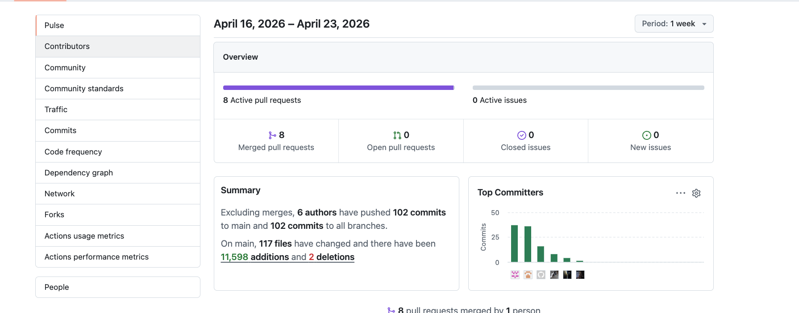

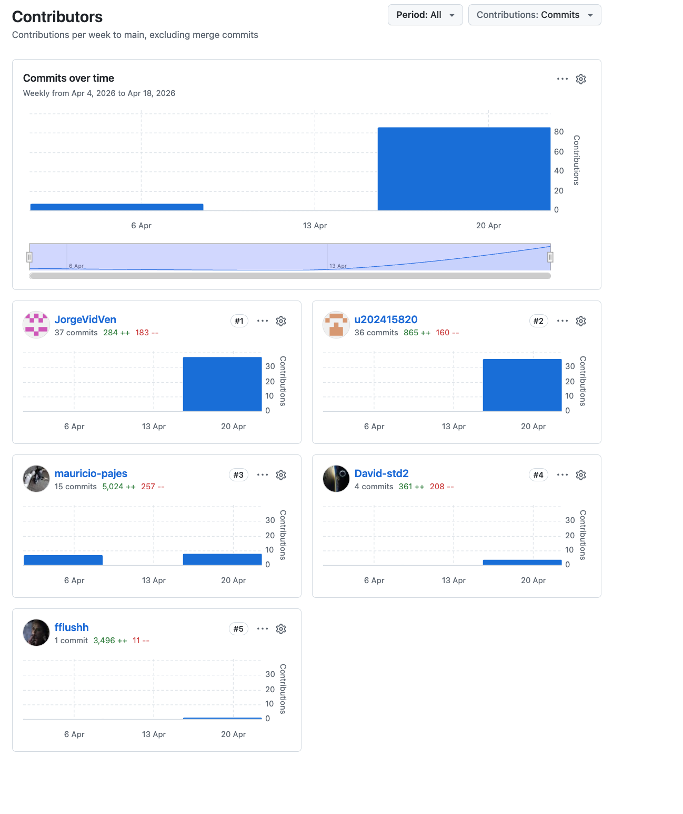

## TP1
[pending content]

## TB2
[pending content]

## TF1
[pending content]

# Contenido
## Tabla de contenidos
- [Carátula](#carátula)
- [Registro de Versiones del Informe](#registro-de-versiones-del-informe)
- [Project Report Collaboration Insights](#project-report-collaboration-insights)
- [Contenido](#contenido)
- [Student Outcome](#student-outcome)

## Capítulo I: Introducción
- [1.1. Startup Profile](#11-startup-profile)
    - [1.1.1. Descripción de la Startup](#111-descripción-de-la-startup)
    - [1.1.2. Perfiles de integrantes del equipo](#112-perfiles-de-integrantes-del-equipo)
- [1.2. Solution Profile](#12-solution-profile)
    - [1.2.1. Antecedentes y problemática](#121-antecedentes-y-problemática)
    - [1.2.2 Lean UX Process.](#122-lean-ux-process)
        - [1.2.2.1. Lean UX Problem Statements.](#1221-lean-ux-problem-statements)
        - [1.2.2.2. Lean UX Assumptions.](#1222-lean-ux-assumptions)
        - [1.2.2.3. Lean UX Hypothesis Statements.](#1223-lean-ux-hypothesis-statements)
        - [1.2.2.4. Lean UX Canvas.](#1224-lean-ux-canvas)
- [1.3. Segmentos objetivo.](#13-segmentos-objetivo)

## Capítulo II: Requirements Elicitation & Analysis
- [2.1. Competidores.](#21-competidores)
    - [2.1.1. Análisis competitivo.](#211-análisis-competitivo)
    - [2.1.2. Estrategias y tácticas frente a competidores.](#212-estrategias-y-tácticas-frente-a-competidores)
- [2.2. Entrevistas.](#22-entrevistas)
    - [2.2.1. Diseño de entrevistas.](#221-diseño-de-entrevistas)
    - [2.2.2. Registro de entrevistas.](#222-registro-de-entrevistas)
    - [2.2.3. Análisis de entrevistas.](#223-análisis-de-entrevistas)
- [2.3. Needfinding.](#23-needfinding)
    - [2.3.1. User Personas.](#231-user-personas)
    - [2.3.2. User Task Matrix.](#232-user-task-matrix)
    - [2.3.3. User Journey Mapping.](#233-user-journey-mapping)
    - [2.3.4. Empathy Mapping.](#234-empathy-mapping)
- [2.4. Big Picture EventStorming.](#24-big-picture-eventstorming)
- [2.5. Ubiquitous Language.](#25-ubiquitous-language)

## Capítulo III: Requirements Specification
- [3.1. User Stories.](#31-user-stories)
- [3.2. Impact Mapping.](#32-impact-mapping)
- [3.3. Product Backlog.](#33-product-backlog)

## Capítulo IV: Product Design
- [4.1. Style Guidelines.](#41-style-guidelines)
    - [4.1.1. General Style Guidelines.](#411-general-style-guidelines)
    - [4.1.2. Web Style Guidelines.](#412-web-style-guidelines)
- [4.2. Information Architecture.](#42-information-architecture)
    - [4.2.1. Organization Systems.](#421-organization-systems)
    - [4.2.2. Labeling Systems.](#422-labeling-systems)
    - [4.2.3. SEO Tags and Meta Tags](#423-seo-tags-and-meta-tags)
    - [4.2.4. Searching Systems.](#424-searching-systems)
    - [4.2.5. Navigation Systems.](#425-navigation-systems)
- [4.3. Landing Page UI Design.](#43-landing-page-ui-design)
    - [4.3.1. Landing Page Wireframe.](#431-landing-page-wireframe)
    - [4.3.2. Landing Page Mock-up.](#432-landing-page-mock-up)
- [4.4. Web Applications UX/UI Design.](#44-web-applications-uxui-design)
    - [4.4.1. Web Applications Wireframes.](#441-web-applications-wireframes)
    - [4.4.2. Web Applications Wireflow Diagrams.](#442-web-applications-wireflow-diagrams)
    - [4.4.2. Web Applications Mock-ups.](#442-web-applications-mock-ups)
    - [4.4.3. Web Applications User Flow Diagrams.](#443-web-applications-user-flow-diagrams)
- [4.5. Web Applications Prototyping.](#45-web-applications-prototyping)
- [4.6. Domain-Driven Software Architecture.](#46-domain-driven-software-architecture)
    - [4.6.1. Design-Level EventStorming.](#461-design-level-eventstorming)
    - [4.6.2. Software Architecture Context Diagram.](#462-software-architecture-context-diagram)
    - [4.6.3. Software Architecture Container Diagrams.](#463-software-architecture-container-diagrams)
    - [4.6.4. Software Architecture Components Diagrams.](#464-software-architecture-components-diagrams)
- [4.7. Software Object-Oriented Design.](#47-software-object-oriented-design)
    - [4.7.1. Class Diagrams.](#471-class-diagrams)
- [4.8. Database Design.](#48-database-design)
    - [4.8.1. Database Diagrams.](#481-database-diagrams)

## Capítulo V: Product Implementation, Validation & Deployment
- [5.1. Software Configuration Management.](#51-software-configuration-management)
    - [5.1.1. Software Development Environment Configuration.](#511-software-development-environment-configuration)
    - [5.1.2. Source Code Management.](#512-source-code-management)
    - [5.1.3. Source Code Style Guide & Conventions.](#513-source-code-style-guide--conventions)
    - [5.1.4. Software Deployment Configuration.](#514-software-deployment-configuration)
- [5.2. Landing Page, Services & Applications Implementation.](#52-landing-page-services--applications-implementation)
    - [5.2.X. Sprint n](#52x-sprint-n)
        - [5.2.X.1. Sprint Planning n.](#52x1-sprint-planning-n)
        - [5.2.X.2. Aspect Leaders and Collaborators.](#52x2-aspect-leaders-and-collaborators)
        - [5.2.X.3. Sprint Backlog n.](#52x3-sprint-backlog-n)
        - [5.2.X.4. Development Evidence for Sprint Review.](#52x4-development-evidence-for-sprint-review)
        - [5.2.X.5. Execution Evidence for Sprint Review.](#52x5-execution-evidence-for-sprint-review)
        - [5.2.X.6. Services Documentation Evidence for Sprint Review.](#52x6-services-documentation-evidence-for-sprint-review)
        - [5.2.X.7. Software Deployment Evidence for Sprint Review.](#52x7-software-deployment-evidence-for-sprint-review)
        - [5.2.X.8. Team Collaboration Insights during Sprint.](#52x8-team-collaboration-insights-during-sprint)
- [5.3. Validation Interviews.](#53-validation-interviews)
    - [5.3.1. Diseño de Entrevistas.](#531-diseño-de-entrevistas)
    - [5.3.2. Registro de Entrevistas.](#532-registro-de-entrevistas)
    - [5.3.3. Evaluaciones según heurísticas.](#533-evaluaciones-según-heurísticas)
- [5.4. Video About-the-Product.](#54-video-about-the-product)

## Conclusiones
- [Conclusiones y recomendaciones.](#conclusiones-y-recomendaciones)
- [Video About-the-Team.](#video-about-the-team)

## Bibliografía
- [Bibliografía.](#bibliografía)

# Student Outcome

El curso contribuye al cumplimiento del Student Outcome ABET:

**ABET – EAC - Student Outcome 3**  
**Criterio:** Capacidad de comunicarse efectivamente con un rango de audiencias.

En el siguiente cuadro se describen las acciones realizadas y las conclusiones del equipo, que permiten sustentar el logro del ABET – EAC - Student Outcome 3.

---

## Tabla de Student Outcome

<table border="1" style="width:100%; border-collapse: collapse;">
  <tr>
    <th style="width:25%;">Criterio específico</th>
    <th style="width:45%;">Acciones realizadas</th>
    <th style="width:30%;">Conclusiones</th>
  </tr>
  <tr>
    <td>
      Comunica oralmente con efectividad a diferentes rangos de audiencia
    </td>
    <td>
      <strong>Videl Ventura, Jorge Joseph</strong><br>
      <em>AV1 / TB1 / AV2</em><br>
      Explicó el contexto de la startup, la problemática, los segmentos objetivo, el análisis competitivo, las entrevistas, el needfinding y el Big Picture Event Storming del proyecto.<br><br>
      <strong>Pajés León, Mauricio Luis</strong><br>
      <em>AV1 / TB1 / AV2</em><br>
      Sustentó los requisitos funcionales del producto, incluyendo épicas, user stories, impact mapping y product backlog, además de la landing page del producto.<br><br>
      <strong>Espinoza Paredes, Frezzia</strong><br>
      <em>AV1 / TB1 / AV2</em><br>
      Explicó los diagramas de arquitectura de software, los diagramas de clases, el diseño de base de datos y participó también en la sustentación de la landing page.<br><br>
      <strong>Morales Venegas, David Joel</strong><br>
      <em>AV1 / TB1 / AV2</em><br>
      Sustentó los lineamientos de estilo, la arquitectura de información, los wireframes, los wireflows y el diseño inicial de interfaces del sistema.<br><br>
      <strong>Cabrera Novoa, Leonardo Moisés</strong><br>
      <em>AV1 / TB1 / AV2</em><br>
      Explicó los mockups finales de la aplicación, el prototipado, la configuración del entorno de desarrollo y los aspectos de implementación del sistema.
    </td>
    <td>
      <strong>AV1 / TB1 / AV2:</strong><br>
      El equipo logró comunicar de manera clara y estructurada los componentes principales del proyecto, adaptando la explicación según el tipo de contenido presentado, ya sea de negocio, UX o técnico. Se evidenció coherencia en la exposición y dominio progresivo del alcance del producto.
    </td>
  </tr>
  <tr>
    <td>
      Comunica por escrito con efectividad a diferentes rangos de audiencia
    </td>
    <td>
      <strong>Videl Ventura, Jorge Joseph</strong><br>
      <em>AV1 / TB1 / AV2</em><br>
      Redactó el contexto de la startup, la problemática, los segmentos objetivo, el análisis competitivo, las entrevistas, el needfinding y la documentación asociada al Event Storming del proyecto.<br><br>
      <strong>Pajés León, Mauricio Luis</strong><br>
      <em>AV1 / TB1 / AV2</em><br>
      Elaboró la documentación de requisitos funcionales del producto, incluyendo épicas, user stories, impact mapping y product backlog, y participó en la documentación y desarrollo de la landing page.<br><br>
      <strong>Espinoza Paredes, Frezzia</strong><br>
      <em>AV1 / TB1 / AV2</em><br>
      Redactó la documentación de arquitectura de software, diagramas de clases y diseño de base de datos, y participó también en la documentación de la landing page.<br><br>
      <strong>Morales Venegas, David Joel</strong><br>
      <em>AV1 / TB1 / AV2</em><br>
      Documentó los lineamientos de estilo, la arquitectura de información, los wireframes, los wireflows y el diseño inicial de interfaces del sistema.<br><br>
      <strong>Cabrera Novoa, Leonardo Moisés</strong><br>
      <em>AV1 / TB1 / AV2</em><br>
      Redactó el contenido relacionado con mockups finales, prototipado, configuración del entorno de desarrollo e implementación del sistema.
    </td>
    <td>
      <strong>AV1 / TB1 / AV2:</strong><br>
      El equipo desarrolló documentación escrita clara, organizada y consistente, cubriendo aspectos de negocio, experiencia de usuario y arquitectura técnica. La redacción mantuvo coherencia entre secciones y permitió sustentar adecuadamente la propuesta del proyecto.
    </td>
  </tr>
</table>


# Capítulo I: Introducción

## 1.1 Startup Profile

### 1.1.1 Descripción de la Startup

ICEQ (Ice Quality Monitoring) es una startup tecnológica enfocada en mejorar el control de la cadena de frío dentro del sector alimentario. Su propuesta principal es **ColdTrace**, una plataforma web de monitoreo inteligente que centraliza la supervisión de temperatura y humedad en cámaras frigoríficas, almacenes y unidades de transporte refrigerado.

La solución integra sensores IoT con una aplicación web accesible desde navegador, lo que permite a supermercados, restaurantes, operadores logísticos y centros de distribución visualizar el estado de sus activos en tiempo real, recibir alertas ante desviaciones críticas y consultar reportes históricos para auditoría y trazabilidad. A diferencia de esquemas manuales o aislados, ColdTrace se plantea como una solución digital escalable, apoyada en tecnologías open source, que busca reducir pérdidas, elevar la capacidad de respuesta operativa y reforzar el cumplimiento sanitario.

**Misión:** Brindar a las empresas del sector alimentario una plataforma confiable y accesible para vigilar la cadena de frío en tiempo real, anticiparse a fallas de refrigeración y tomar decisiones mejor informadas basadas en datos.

**Visión:** Consolidarnos como una referencia regional en monitoreo digital de cadena de frío, impulsando operaciones alimentarias más seguras, eficientes y sostenibles mediante soluciones web modernas y abiertas a integración.

### 1.1.2 Perfiles de integrantes del equipo

| Foto de perfil | Nombre Completo                          | Carrera                 | Habilidades |
|:--------------:|:------------------------------------------|:------------------------|:------------|
|     | **Cabrera Novoa, Leonardo Moisés**        | Ingeniería de Software  | **(U202415820)**<br>Estudiante de 5to ciclo con experiencia en C++ y recientemente en C#.<br> Me enfoco en el desarrollo colaborativo, aportando compromiso y adaptabilidad para lograr los objetivos de cada sprint.  |
|     | **Espinoza Paredes, Frezzia**             | Ingeniería de Software  | **(U200815121)**<br>Estudiante de Ingeniería de Software de la Universidad Peruana de Ciencias Aplicadas (UPC).<br>Tengo habilidades en prototipado, user experience, HTML, CSS, JavaScript, Python y C++. |
| [pendiente]    | **Morales Venegas, David Joel**           | Ingeniería de Software  | **(U20231B504)**<br>Estudiante de Ingeniería de Software con formación intermedia en el desarrollo de aplicaciones web.<br>Me adapto al trabajo técnico del equipo, priorizando código funcional, entendible y alineado a los requerimientos del proyecto, con disposición para mejorar y corregir en función de pruebas y resultados. |
|     | **Pajés León, Mauricio Luis**             | Ingeniería de Software  | **(U202410093)**<br>Soy estudiante de Ingeniería de Software en la UPC, con experiencia en C++ y Python, y conocimientos en diseño y patrones de software, bases de datos SQL como PostgreSQL y NoSQL como MongoDB, así como en desarrollo backend con Java mediante Spring Boot y con Node.js.<br>Además, destaco por mis habilidades de comunicación y trabajo en equipo, lo que me permite colaborar de forma efectiva en entornos productivos y colaborativos. |
|  | **Videla Ventura, Jorge Joseph** | Ingeniería de Software | **(U202220648)**<br>Estudiante de Ingeniería de Software en la UPC (4.º ciclo), con experiencia en C++ y Python.<br>Responsable, comprometido y orientado al trabajo en equipo. |

## 1.2 Solution Profile

ICEQ aborda una problemática crítica del sector alimentario peruano: la pérdida de productos perecibles por fallas en la cadena de frío y la escasa trazabilidad de las condiciones de almacenamiento. Distintas fuentes señalan que en el Perú se pierden millones de toneladas de alimentos cada año y que una porción importante de estas mermas está vinculada a deficiencias en refrigeración, transporte y control operativo.

En ese contexto, **ColdTrace** se propone como una plataforma web de monitoreo inteligente que conecta sensores IoT instalados en puntos críticos de almacenamiento y traslado para entregar visibilidad continua, alertas oportunas y evidencia histórica de las condiciones de temperatura y humedad.

Con ColdTrace, los usuarios pueden:

- Registrar instalaciones, cámaras o unidades de transporte y configurar rangos seguros por tipo de producto.
- Supervisar en tiempo real la temperatura y humedad de sus activos refrigerados.
- Recibir alertas automáticas por correo electrónico o mensajería cuando exista una desviación relevante.
- Consultar históricos de medición para trazabilidad, control interno y auditorías.
- Generar reportes de incidencias que respalden la toma de decisiones y el cumplimiento normativo.

El modelo de negocio propuesto es de suscripción mensual, complementado con integraciones de hardware IoT y una arquitectura escalable que facilite adopción progresiva en empresas de distintos tamaños.

### 1.2.1 Antecedentes y problemática

**Antecedentes**

De acuerdo con la FAO (2021), en el Perú se desperdician más de 12 millones de toneladas de alimentos a lo largo de la cadena productiva. A ello se suma que, según Agraria.pe (2019), más del 33% de los alimentos producidos en el país se pierde por deficiencias en la cadena de frío. Aunque el mercado vinculado a almacenamiento refrigerado continúa creciendo, muchas organizaciones todavía dependen de controles manuales, registros dispersos o procesos reactivos que no ofrecen monitoreo continuo ni alertas tempranas.

Frente a esta realidad, ICEQ plantea ColdTrace como una plataforma que permita supervisar en tiempo real cámaras frigoríficas, almacenes y transporte refrigerado, reduciendo mermas, reforzando la inocuidad alimentaria y mejorando la capacidad de respuesta ante incidentes.

**Técnica "The 5W's y 2H's" aplicada al problema:**

| The 5W's y 2H's | Pregunta | Descripción |
|:----------------|:---------|:------------|
| **What** | ¿Cuál es el problema? | La falta de monitoreo continuo de temperatura y humedad en almacenes, cámaras frigoríficas y unidades de transporte ocasiona que los incidentes de refrigeración se detecten demasiado tarde, generando merma de productos, riesgos sanitarios y poca trazabilidad operativa. |
| **When** | ¿Cuándo sucede? | Se presenta de manera constante durante la operación diaria, con mayor impacto en temporadas de alta demanda, días de calor intenso o traslados prolongados de productos perecibles. El cliente utilizará ColdTrace de forma continua durante toda la jornada operativa. |
| **Where** | ¿Dónde ocurre? | El cliente puede estar en la oficina, en un almacén, en un centro de distribución o en tránsito. El problema surge en cámaras frigoríficas, almacenes, centros de distribución, cocinas industriales y unidades de transporte refrigerado. |
| **Who** | ¿Quiénes involucrados? | Jefes de calidad, administradores, operadores logísticos, encargados de almacén, transportistas de productos perecibles y responsables de cumplimiento sanitario. Indirectamente también afecta a los consumidores. |
| **Why** | ¿Por qué sucede? | La causa principal es la dependencia de controles manuales o sistemas aislados, junto con la ausencia de alertas tempranas y de una plataforma centralizada que permita seguimiento en tiempo real e historial de incidentes. |
| **How** | ¿Cómo afecta? | Provoca pérdidas por merma de productos perecibles, reprocesos operativos, riesgo de sanciones por incumplimiento y deterioro de la confianza en la operación logística y de almacenamiento. |
| **How Much** | ¿Cuánto impacta? | Pérdida de más de 12 millones de toneladas de alimentos (FAO, 2021) y más del 33% de los alimentos producidos perdidos por deficiencias en la cadena de frío (Agraria.pe, 2019). |

---

### 1.2.2 Lean UX Process

#### 1.2.2.1 Lean UX Problem Statements

En el sector alimentario peruano, muchas empresas aún supervisan la cadena de frío mediante registros manuales o herramientas desconectadas entre sí. Esto ocasiona que incidentes de temperatura y humedad sean detectados demasiado tarde, cuando la pérdida del producto o el riesgo sanitario ya es significativo. Aunque existe necesidad de control y trazabilidad, no todas las organizaciones cuentan con una plataforma sencilla, accesible y centralizada que reúna monitoreo en tiempo real, alertas y evidencia histórica en un mismo entorno.

A partir de ello, la pregunta de negocio es la siguiente:

> **¿Cómo podemos ofrecer a las empresas del sector alimentario una plataforma web de monitoreo en tiempo real que reduzca pérdidas por fallas de refrigeración y fortalezca el control sanitario de sus operaciones?**

#### 1.2.2.2 Lean UX Assumptions

**Business Assumptions**

1. Existe una demanda real por herramientas digitales que permitan reducir mermas y mejorar el control de la cadena de frío.
2. Las empresas están dispuestas a pagar una suscripción si la solución demuestra ahorro operativo, trazabilidad y capacidad de reacción.
3. Es viable integrar la plataforma con dispositivos IoT y con procesos ya existentes en almacenes, transporte y puntos de control.

**Business Outcomes**

1. Generar ingresos recurrentes mediante un modelo SaaS escalonado según instalaciones, sensores o usuarios.
2. Posicionar a ColdTrace como una solución confiable para el monitoreo de cadena de frío en el mercado peruano.
3. Validar la propuesta de valor a través de una disminución medible de incidentes y pérdidas en clientes piloto.

**User Benefits**

1. Acceso a información en tiempo real desde cualquier dispositivo con navegador.
2. Respuesta más rápida frente a desvíos de temperatura o humedad gracias a alertas automáticas.
3. Mayor trazabilidad para auditorías, control interno y cumplimiento normativo.

#### 1.2.2.3 Lean UX Hypothesis Statements

**Hypothesis 1:** Creemos que, si ColdTrace ofrece monitoreo en tiempo real mediante sensores IoT, al menos el 70% de los clientes piloto reportará una reducción visible en pérdidas por fallas de refrigeración durante sus primeros meses de uso.

**Hypothesis 2:** Creemos que, si la plataforma incorpora alertas automáticas y configurables, el tiempo de respuesta ante incidencias disminuirá de manera significativa frente a los controles manuales tradicionales.

**Hypothesis 3:** Creemos que, si el sistema genera históricos y reportes descargables, las empresas podrán sustentar mejor su trazabilidad y sus procesos de auditoría sanitaria.

**Hypothesis 4:** Creemos que, si el modelo de suscripción es accesible y escalable, la retención de clientes durante la etapa inicial será suficientemente alta como para validar la viabilidad comercial del producto.

#### 1.2.2.4 Lean UX Canvas

<table>
  <tr>
    <td valign="top">
      <strong>Business problem</strong><br><br>
      Las empresas del sector alimentario todavía dependen de controles manuales o herramientas desconectadas para vigilar la temperatura de cámaras frigoríficas, almacenes y unidades de transporte.<br><br>
      Esto ocasiona que los incidentes de refrigeración sean detectados tarde, provocando pérdidas de producto, riesgos sanitarios y poca capacidad para sustentar trazabilidad frente a auditorías.<br><br>
      En el Perú, esta situación se relaciona con el mal manejo de la cadena de frío y con los altos niveles de desperdicio de alimentos reportados por la FAO (2021) y Agraria.pe (2019).
    </td>
    <td rowspan="2" valign="top">
      <strong>Solution ideas</strong><br><br>
      - Dashboard web centralizado con sensores IoT de temperatura y humedad<br><br>
      - Alertas automáticas por correo y mensajería ante desviaciones del rango seguro<br><br>
      - Historial descargable de condiciones de almacenamiento para control y auditorías<br><br>
      - Reportes de incidencias para apoyar decisiones operativas y seguimiento<br><br>
      - Modelo SaaS por suscripción mensual, sin inversión inicial elevada en infraestructura
    </td>
    <td valign="top">
      <strong>Business Outcomes</strong><br><br>
      - Ingresos recurrentes por una suscripción escalonada según sensores y usuarios.<br><br>
      - Tasa de retención mensual alta durante los primeros meses de uso.<br><br>
      - Posicionar a ColdTrace como una plataforma confiable para monitoreo de cadena de frío en Perú.<br><br>
      - Reducir mermas en clientes piloto y convertir ese resultado en evidencia de valor.
    </td>
  </tr>
  <tr>
    <td valign="top">
      <strong>Users and customers</strong><br><br>
      - Jefes de calidad<br>
      - Operadores logísticos<br>
      - Gerentes de supermercados<br>
      - Administradores de restaurantes<br>
      - Transportistas de productos perecibles<br>
      - Empresas del sector alimentario de distintos tamaños
    </td>
    <td valign="top">
      <strong>User benefits</strong><br><br>
      - Visibilidad en tiempo real desde cualquier dispositivo con navegador<br>
      - Respuesta más rápida ante fallas antes de que ocurran pérdidas mayores<br>
      - Trazabilidad completa para auditorías de DIGESA y MINSA<br>
      - Menor exposición a sanciones y daño reputacional por incumplimiento operativo
    </td>
  </tr>
  <tr>
    <td valign="top">
      <strong>Hypotheses</strong><br><br>
      - Si ofrecemos monitoreo IoT en tiempo real, una parte importante de los clientes piloto reducirá pérdidas dentro de los primeros meses.<br><br>
      - Si implementamos alertas automáticas, el tiempo de respuesta frente a incidentes bajará frente al control manual.<br><br>
      - Si brindamos historial descargable y trazabilidad completa, las empresas podrán sustentar mejor sus auditorías.<br><br>
      - Si el modelo SaaS es accesible y escalable, lograremos una retención mensual sólida en la etapa inicial.
    </td>
    <td valign="top">
      <strong>What's the most important thing we need to learn first?</strong><br><br>
      ¿Los operadores del sector alimentario están realmente dispuestos a pagar por una solución SaaS de monitoreo, y cuánto valor le asignan frente a otros problemas operativos más urgentes?
    </td>
    <td valign="top">
      <strong>What's the least amount of work we need to do to learn the next most important thing?</strong><br><br>
      Realizar entrevistas con responsables de calidad y logística, y mostrar un prototipo de baja fidelidad del dashboard para validar el modelo de precios por suscripción, la utilidad de las alertas y la disposición de pago.
    </td>
  </tr>
</table>

---

## 1.3 Segmentos Objetivos

En función de la problemática identificada y del tipo de solución que propone ColdTrace, se reconocen dos segmentos objetivo principales. El primero está compuesto por pequeños negocios alimentarios que necesitan controlar mejor su refrigeración diaria. El segundo está conformado por responsables de operaciones, calidad o logística dentro de negocios y empresas que manejan productos perecibles y requieren trazabilidad, monitoreo continuo y reacción oportuna ante incidentes.

| Segmento objetivo | Características demográficas | Información estadística de sustento |
|:------------------|:-----------------------------|:------------------------------------|
| **Minimarkets o puestos de mercado** | **Edad:** adultos de 25 años a más.<br>**Cargo:** dueños, administradores o encargados de minimarkets, carnicerías, pescaderías, verdulerías y otros comercios minoristas con productos perecibles y sistemas de refrigeración.<br>**Ubicación:** zonas urbanas o comerciales con alta rotación de productos frescos.<br>**Interés:** reducir merma, asegurar la inocuidad de los alimentos, evitar observaciones de DIGESA o MINSA y contar con una solución simple para monitorear refrigeración. | Según Agraria.pe (2019), en el Perú se pierde más del 33% de los alimentos producidos por deficiencias en la cadena de frío. Para pequeños comercios alimentarios, una falla de refrigeración puede traducirse en pérdida inmediata de mercadería y en menor rentabilidad del negocio. |
| **Responsables de operaciones y control de calidad** | **Edad:** adultos de 21 años a más.<br>**Cargo:** jefes de operaciones, responsables de calidad, supervisores logísticos, encargados de almacén e ingenieros industriales en empresas que manipulan productos refrigerados.<br>**Ubicación:** centros de distribución, almacenes, supermercados, cámaras frigoríficas y operadores logísticos en zonas urbanas.<br>**Interés:** centralizar el monitoreo de la cadena de frío, responder con rapidez ante incidencias, mejorar trazabilidad, facilitar auditorías y tomar decisiones operativas con base en datos históricos. | Según la FAO (2021), en el Perú se desperdician más de 12 millones de toneladas de alimentos a lo largo de la cadena productiva. Esto refuerza la necesidad de que las áreas de operaciones, calidad y logística cuenten con herramientas de monitoreo continuo para prevenir pérdidas y elevar el control sobre la cadena de frío. |


# Capítulo II: Requirements Elicitation & Analysis

## 2.1 Competidores

Este análisis permite identificar cómo se posiciona ColdTrace frente a plataformas enterprise, soluciones modulares de sensores y propuestas especializadas en transporte refrigerado. A partir de ello, se define una ventaja competitiva basada en simplicidad, adaptación local y menor barrera de entrada.

### 2.1.1 Análisis Competitivo

<table style="text-align: center; width: 100%;">
  <tbody>
    <tr>
      <td colspan="6"><strong>Competitive Analysis Landscape</strong></td>
    </tr>
    <tr>
      <td colspan="2"><strong>¿Por qué llevar a cabo este análisis?</strong></td>
      <td colspan="4">Este análisis permite identificar cómo se posiciona ColdTrace frente a plataformas enterprise, soluciones modulares de sensores y propuestas especializadas en transporte refrigerado. A partir de ello, se puede definir una ventaja competitiva basada en simplicidad, adaptación local y menor barrera de entrada.</td>
    </tr>
    <tr>
      <td colspan="2"><strong>Logotipos</strong></td>
      <td><strong>ColdTrace (ICEQ)</strong></td>
      <td></td>
      <td></td>
      <td></td>
    </tr>
    <tr>
      <td colspan="2"><strong>Software</strong></td>
      <td><strong>ColdTrace (ICEQ)</strong></td>
      <td><strong>SmartSense by Digi</strong></td>
      <td><strong>Monnit</strong></td>
      <td><strong>Cooltrax</strong></td>
    </tr>
    <tr>
      <td rowspan="2"><strong>Perfil</strong></td>
      <td>Overview</td>
      <td>Startup peruana orientada al monitoreo web de temperatura y humedad para la cadena de frío alimentaria en negocios pequeños y medianos.</td>
      <td>Plataforma enterprise de food safety y temperature monitoring con sensores, workflows y compliance para restaurantes, grocery, schools y hospitality.</td>
      <td>Plataforma de remote monitoring con 80+ sensores IoT, software iMonnit y soluciones de food service monitoring.</td>
      <td>Plataforma industrial IoT para visibilidad y control de cadena de frío en transporte, warehouses, cold rooms y pallets.</td>
    </tr>
    <tr>
      <td>Ventaja competitiva, ¿Qué valor ofrece a los clientes?</td>
      <td>Adaptación al contexto peruano, menor complejidad de adopción y foco en usuarios que hoy siguen trabajando con controles manuales.</td>
      <td>Escala enterprise, automatización de cumplimiento, analytics avanzados y workflows guiados para operaciones multisede.</td>
      <td>Costo accesible, despliegue rápido, catálogo amplio de sensores y flexibilidad cloud / on-premises.</td>
      <td>Monitoreo a nivel de producto, ubicación y temperatura con fuerte foco en control de flotas y distribución refrigerada.</td>
    </tr>
    <tr>
      <td rowspan="2"><strong>Perfil de Marketing</strong></td>
      <td>Mercado objetivo</td>
      <td>Minimarkets, puestos de mercado, carnicerías, pescaderías, restaurantes, almacenes y operadores medianos en Perú.</td>
      <td>Large restaurants, grocery chains, convenience stores, schools, hospitality y food manufacturing.</td>
      <td>Food service, producción, restaurantes y negocios que necesitan monitoreo remoto sin gran infraestructura.</td>
      <td>Enterprise fleets, grocery store fleets, food & beverage fleets, warehouses y cold storage operations.</td>
    </tr>
    <tr>
      <td>Estrategias de marketing</td>
      <td>Venta consultiva local, posicionamiento por reducción de merma, cumplimiento sanitario y facilidad de uso con onboarding simple.</td>
      <td>Demos personalizadas, customer stories, mensaje de ROI y compliance, acompañamiento por customer success.</td>
      <td>Combinación de venta directa, demo, catálogo amplio, mensaje de bajo costo y facilidad de instalación.</td>
      <td>Venta consultiva B2B, technology consultation, casos de éxito y foco en ahorro operativo, visibilidad y control.</td>
    </tr>
    <tr>
      <td rowspan="3"><strong>Perfil de Producto</strong></td>
      <td>Productos & Servicios</td>
      <td>Dashboard web, integración con sensores IoT, alertas, historial, reportes, trazabilidad y monitoreo continuo.</td>
      <td>Sensores, gateways celulares, cloud dashboard, alertas automáticas, digital workflows, reporting y APIs.</td>
      <td>Wireless sensors, gateways, iMonnit cloud/app, alertas, HACCP logging y opciones cloud u on-premises.</td>
      <td>Fresh InTransit, Fresh InStorage, sensores inalámbricos, door sensors, reefer integration y dashboard de inteligencia operativa.</td>
    </tr>
    <tr>
      <td>Precios & Costos</td>
      <td>Suscripción mensual escalable y más accesible que suites enterprise, orientada a pymes y operaciones medianas según la cantidad de equipos monitoreados.</td>
      <td>Cotización personalizada bajo modelo per-asset pricing all-inclusive; no publica tarifa estándar.</td>
      <td>iMonnit Basic gratis; iMonnit Premiere desde US$45/año hasta 6 sensores y US$325/año hasta 100 sensores.</td>
      <td>Cotización personalizada y contacto comercial; no muestra precios públicos en el sitio oficial.</td>
    </tr>
    <tr>
      <td>Canales de distribución (Web y/o Móvil)</td>
      <td>Web responsive con alertas remotas e integración con sensores IoT.</td>
      <td>Web y mobile apps, además de APIs e integraciones con plataformas empresariales.</td>
      <td>Web, app móvil, ecommerce y venta directa de sensores y software.</td>
      <td>Plataforma web con alertas remotas e implementación consultiva para operaciones de cadena de frío.</td>
    </tr>
    <tr>
      <td rowspan="4"><strong>Análisis SWOT</strong></td>
      <td>Fortalezas</td>
      <td>
        <ul style="text-align: left; margin: 0; padding-left: 18px;">
          <li>Enfoque local y contextual.</li>
          <li>Simplicidad de adopción.</li>
          <li>Personalización para pymes.</li>
          <li>Menor barrera de entrada.</li>
        </ul>
      </td>
      <td>
        <ul style="text-align: left; margin: 0; padding-left: 18px;">
          <li>Marca consolidada.</li>
          <li>Fuerte capacidad de compliance.</li>
          <li>Despliegue multisede.</li>
          <li>Analítica avanzada.</li>
        </ul>
      </td>
      <td>
        <ul style="text-align: left; margin: 0; padding-left: 18px;">
          <li>Bajo costo de entrada.</li>
          <li>Instalación rápida.</li>
          <li>Amplitud de sensores.</li>
          <li>Flexibilidad tecnológica.</li>
        </ul>
      </td>
      <td>
        <ul style="text-align: left; margin: 0; padding-left: 18px;">
          <li>Alta especialización en transporte frío.</li>
          <li>Monitoreo product-level.</li>
          <li>Control de operaciones logísticas.</li>
          <li>Visibilidad de flota.</li>
        </ul>
      </td>
    </tr>
    <tr>
      <td>Debilidades</td>
      <td>
        <ul style="text-align: left; margin: 0; padding-left: 18px;">
          <li>Startup en etapa temprana.</li>
          <li>Menor reconocimiento de marca.</li>
          <li>Menos integraciones maduras.</li>
          <li>Depende de adopción del usuario.</li>
        </ul>
      </td>
      <td>
        <ul style="text-align: left; margin: 0; padding-left: 18px;">
          <li>Mayor complejidad de uso.</li>
          <li>Costo elevado para pymes.</li>
          <li>Difícil de adoptar en negocios pequeños.</li>
          <li>Requiere más soporte técnico.</li>
        </ul>
      </td>
      <td>
        <ul style="text-align: left; margin: 0; padding-left: 18px;">
          <li>Menor especialización vertical.</li>
          <li>No tan enfocado en inocuidad alimentaria.</li>
          <li>Interfaz más genérica.</li>
          <li>Menor profundidad en trazabilidad.</li>
        </ul>
      </td>
      <td>
        <ul style="text-align: left; margin: 0; padding-left: 18px;">
          <li>Orientado a flotas, no a negocios fijos.</li>
          <li>Poco accesible para operaciones pequeñas.</li>
          <li>Sin precio público.</li>
          <li>Complejidad de implementación.</li>
        </ul>
      </td>
    </tr>
    <tr>
      <td>Oportunidades</td>
      <td>
        <ul style="text-align: left; margin: 0; padding-left: 18px;">
          <li>Digitalización de negocios alimentarios en Perú.</li>
          <li>Presión por inocuidad y reducción de merma.</li>
          <li>Mercado con poca solución local.</li>
          <li>Crecimiento del sector refrigerado.</li>
        </ul>
      </td>
      <td>
        <ul style="text-align: left; margin: 0; padding-left: 18px;">
          <li>Expandirse en más verticales y geografías.</li>
          <li>Mayor exigencia de trazabilidad.</li>
          <li>Demanda de automatización.</li>
          <li>Captar mid-market en LatAm.</li>
        </ul>
      </td>
      <td>
        <ul style="text-align: left; margin: 0; padding-left: 18px;">
          <li>Captar SMBs con monitoreo asequible.</li>
          <li>Expandir en negocios sin infraestructura.</li>
          <li>Mayor adopción IoT en sector alimentos.</li>
          <li>Necesidad de flexibilidad cloud.</li>
        </ul>
      </td>
      <td>
        <ul style="text-align: left; margin: 0; padding-left: 18px;">
          <li>Crecimiento de logística refrigerada.</li>
          <li>Trazabilidad en tránsito.</li>
          <li>Control warehouse en expansión.</li>
          <li>Demanda de visibilidad operativa.</li>
        </ul>
      </td>
    </tr>
    <tr>
      <td>Amenazas</td>
      <td>
        <ul style="text-align: left; margin: 0; padding-left: 18px;">
          <li>Competidores globales con más recursos.</li>
          <li>Resistencia al cambio en negocios tradicionales.</li>
          <li>Dependencia del hardware IoT.</li>
          <li>Dificultad para demostrar valor temprano.</li>
        </ul>
      </td>
      <td>
        <ul style="text-align: left; margin: 0; padding-left: 18px;">
          <li>Soluciones más económicas o locales.</li>
          <li>Competencia en el segmento mid-market.</li>
          <li>Preferencia por herramientas ligeras.</li>
          <li>Riesgo de pérdida de usuarios nuevos.</li>
        </ul>
      </td>
      <td>
        <ul style="text-align: left; margin: 0; padding-left: 18px;">
          <li>Plataformas verticales más especializadas.</li>
          <li>Workflows más profundos en nichos.</li>
          <li>Competencia por precio en SMBs.</li>
          <li>Mayor presión por automatización.</li>
        </ul>
      </td>
      <td>
        <ul style="text-align: left; margin: 0; padding-left: 18px;">
          <li>Suites telemáticas con funciones similares.</li>
          <li>IoT industrial con visibilidad equivalente.</li>
          <li>Competencia por escala.</li>
          <li>Plataformas ya posicionadas en logística.</li>
        </ul>
      </td>
    </tr>
  </tbody>
</table>

### 2.1.2 Estrategias y tácticas frente a competidores

A partir de la identificación de fortalezas y debilidades competitivas, ICEQ aplicará el siguiente conjunto de estrategias y tácticas para posicionar ColdTrace como la solución de referencia para el segmento alimentario peruano.

#### Diferenciación operativa integral frente a SmartSense
A diferencia de SmartSense, orientado a operaciones enterprise de gran escala, ColdTrace se enfocará en integrar monitoreo en tiempo real, alertas, historial y trazabilidad en una propuesta más accesible para negocios alimentarios pequeños y medianos.

- **Onboarding simplificado:** Diseñar un proceso de activación rápido que no requiera soporte técnico especializado, reduciendo la barrera de entrada para minimarkets, carnicerías y restaurantes.
- **Precio accesible:** Ofrecer un modelo de suscripción mensual ajustado al contexto de las pymes peruanas, sin inversión inicial elevada en infraestructura o licencias.

#### Competitividad en accesibilidad y despliegue frente a Monnit
Frente a Monnit, más modular y generalista, ColdTrace buscará ofrecer una experiencia más enfocada en la cadena de frío alimentaria y con menor complejidad de configuración para el usuario final.

- **Especialización vertical:** Posicionar ColdTrace como una solución diseñada específicamente para el sector alimentario peruano, no una herramienta IoT genérica.
- **Interfaz orientada al negocio:** Traducir los datos de sensores en información accionable para responsables de calidad y dueños de negocio, no solo para perfiles técnicos.

#### Enfoque territorial y contextual
Aprovechar la falta de soluciones específicamente adaptadas al mercado peruano, priorizando negocios y operaciones que todavía dependen de controles manuales.

- **Pilotos locales:** Lanzar pilotos con minimarkets, carnicerías, pescaderías, restaurantes y pequeños almacenes para validar el producto en operaciones reales.
- **Alianzas estratégicas:** Establecer alianzas con proveedores de sensores, servicios técnicos de refrigeración o actores logísticos para fortalecer la implementación local.

#### Cumplimiento simplificado frente a Cooltrax
Frente a soluciones más orientadas a flotas, ColdTrace destacará por traducir el monitoreo y las alertas en una experiencia más simple para responsables de negocio, calidad y operaciones.

- **Datos para auditorías:** Utilizar los históricos de temperatura, alertas e incidencias como insumo para auditorías de DIGESA y MINSA, generando un diferencial claro.
- **Campañas digitales:** Impulsar demostraciones prácticas dirigidas a responsables de operaciones, destacando reducción de merma, cumplimiento sanitario y facilidad de uso.

---

## 2.2 Entrevistas

En esta sección se aborda la investigación tomando como base la recolección de información mediante entrevistas a representantes del segmento objetivo. Las entrevistas fueron registradas en video como evidencia del proceso de obtención de requisitos.

### 2.2.1 Diseño de entrevistas

Para el diseño de entrevistas se plantearon preguntas semiestructuradas orientadas a comprender cómo los potenciales usuarios monitorean actualmente sus equipos de refrigeración, qué problemas enfrentan ante fallas de temperatura y qué expectativas tendrían frente a una solución como ColdTrace.

**Segmento 1: Dueños o encargados de pequeños negocios con productos perecibles**

1. ¿Qué tipo de productos refrigerados o congelados maneja actualmente en su negocio?
2. ¿Cómo controlan hoy la temperatura de sus refrigeradoras, congeladoras o cámaras de frío?
3. ¿Con qué frecuencia ocurren problemas como variaciones de temperatura, fallas de equipos o pérdida de productos?
4. ¿Qué consecuencias genera para su negocio una falla en la cadena de frío?
5. Cuando ocurre un problema de refrigeración, ¿qué acciones suele tomar usted o su personal?
6. ¿Qué tan útil le resultaría recibir alertas en tiempo real desde su celular o computadora cuando la temperatura sale del rango seguro?
7. ¿Qué dificultades cree que tendría su negocio para implementar una solución digital de monitoreo como ColdTrace?
8. ¿Qué expectativas tendría de una plataforma que le ayude a monitorear temperatura, registrar incidencias y contar con historial para control o auditoría?

**Segmento 2: Responsables de operaciones, calidad o logística en negocios con cadena de frío**

1. ¿Cuáles son los principales problemas que enfrentan al supervisar equipos, ambientes o unidades que dependen de cadena de frío?
2. ¿Cómo registran y verifican actualmente la temperatura y las condiciones de almacenamiento o transporte?
3. ¿Qué tan confiable considera el proceso actual de monitoreo y control que manejan en su organización?
4. ¿En qué puntos del proceso suelen presentarse más riesgos de pérdida, incumplimiento o fallas operativas?
5. ¿Qué tan útil sería para su operación contar con una plataforma que centralice alertas, historial de temperatura e incidencias en un solo lugar?
6. ¿De qué manera una herramienta como ColdTrace podría ayudar a mejorar la toma de decisiones, las auditorías o la trazabilidad de su operación?
7. ¿Qué condiciones o características debería tener una solución de monitoreo para que su organización decida adoptarla o evaluarla seriamente?
8. ¿Qué beneficios esperaría obtener su organización al implementar un sistema digital de monitoreo de temperatura y control de cadena de frío?

### 2.2.2 Registro de entrevistas

**Segmento 1: Dueños o encargados de pequeños negocios con productos perecibles**

<table style="width:100%; border-collapse:collapse;">
  <tbody>
    <tr>
      <td colspan="4" align="center"><strong>Entrevista N.° 1</strong></td>
    </tr>
    <tr>
      <td colspan="4" align="center">
        
      </td>
    </tr>
    <tr>
      <td colspan="2" align="center"><strong>Información del entrevistado</strong></td>
      <td colspan="2" align="center"><strong>Contexto tecnológico</strong></td>
    </tr>
    <tr>
      <td><strong>Nombre completo</strong></td>
      <td>Sara Lopez</td>
      <td><strong>Dispositivo de mayor frecuencia</strong></td>
      <td>Smartphone (Android)</td>
    </tr>
    <tr>
      <td><strong>Edad</strong></td>
      <td>53 años</td>
      <td><strong>Sistema operativo/browser</strong></td>
      <td>Android / Google Chrome</td>
    </tr>
    <tr>
      <td><strong>Definición profesional / cargo</strong></td>
      <td>Microempresaria / encargada de negocio con productos perecibles</td>
      <td><strong>Canales digitales de comunicación</strong></td>
      <td>WhatsApp y llamadas telefónicas</td>
    </tr>
    <tr>
      <td><strong>Residencia / ubicación</strong></td>
      <td>San Martín de Porres, Lima</td>
      <td><strong>Software especializado utilizado</strong></td>
      <td>Microsoft Excel y aplicaciones de mensajería</td>
    </tr>
    <tr>
      <td colspan="2"><strong>Duración:</strong> 05:30</td>
      <td colspan="2"><strong>URL de grabación:</strong> <a href="https://upcedupe-my.sharepoint.com/:v:/g/personal/u202410093_upc_edu_pe/IQBJYgNJwvtfRqy0uHqXB3isAZZnAZqgRG9g19PW-b6JXlk?nav=eyJyZWZlcnJhbEluZm8iOnsicmVmZXJyYWxBcHAiOiJTdHJlYW1XZWJBcHAiLCJyZWZlcnJhbFZpZXciOiJTaGFyZURpYWxvZy1MaW5rIiwicmVmZXJyYWxBcHBQbGF0Zm9ybSI6IldlYiIsInJlZmVycmFsTW9kZSI6InZpZXcifX0%3D&amp;e=qZMIiB">Ver video</a></td>
    </tr>
    <tr>
      <td colspan="4">
        <strong>Resumen de la entrevista</strong><br><br>
        La entrevistada es una microempresaria que gestiona un negocio de productos perecibles que dependen del correcto funcionamiento de equipos de refrigeración. Actualmente, el control de temperatura se realiza de forma manual y basada en la experiencia, sin registros ni monitoreo constante, lo que evidencia una falta de herramientas tecnológicas. Los problemas no son diarios, pero ocurren ante fallas técnicas o cortes de energía, y suelen detectarse tarde, cuando los productos ya han sido afectados.<br><br>
        Estas situaciones generan pérdidas económicas y riesgos para la salud de los clientes, por lo que la entrevistada actúa de manera reactiva, descartando productos dañados y recurriendo a técnicos. Asimismo, valora soluciones simples e intuitivas que le permitan recibir alertas en tiempo real, tener información clara y organizada, identificar patrones de fallas y contar con respaldo para auditorías, lo que refleja la necesidad de un sistema de monitoreo eficiente.
      </td>
    </tr>
  </tbody>
</table>

<table style="width:100%; border-collapse:collapse;">
  <tbody>
    <tr>
      <td colspan="4" align="center"><strong>Entrevista N.° 2</strong></td>
    </tr>
    <tr>
      <td colspan="4" align="center">
        
      </td>
    </tr>
    <tr>
      <td colspan="2" align="center"><strong>Información del entrevistado</strong></td>
      <td colspan="2" align="center"><strong>Contexto tecnológico</strong></td>
    </tr>
    <tr>
      <td><strong>Nombre completo</strong></td>
      <td>Sebastián Vásquez</td>
      <td><strong>Dispositivo de mayor frecuencia</strong></td>
      <td>Smartphone (Android)</td>
    </tr>
    <tr>
      <td><strong>Edad</strong></td>
      <td>27 años</td>
      <td><strong>Sistema operativo/browser</strong></td>
      <td>Android / Google Chrome</td>
    </tr>
    <tr>
      <td><strong>Definición profesional / cargo</strong></td>
      <td>Administrador de local comercial / Emprendedor</td>
      <td><strong>Canales digitales de comunicación</strong></td>
      <td>WhatsApp Business y Facebook Messenger</td>
    </tr>
    <tr>
      <td><strong>Residencia / ubicación</strong></td>
      <td>Surquillo, Lima</td>
      <td><strong>Software especializado utilizado</strong></td>
      <td>Microsoft Excel y Apps de banca móvil</td>
    </tr>
    <tr>
      <td colspan="2"><strong>Duración:</strong> 6:45</td>
      <td colspan="2"><strong>URL de grabación:</strong> <a href="https://upcedupe-my.sharepoint.com/:v:/g/personal/u202410093_upc_edu_pe/IQBJYgNJwvtfRqy0uHqXB3isAZZnAZqgRG9g19PW-b6JXlk?nav=eyJyZWZlcnJhbEluZm8iOnsicmVmZXJyYWxBcHAiOiJTdHJlYW1XZWJBcHAiLCJyZWZlcnJhbFZpZXciOiJTaGFyZURpYWxvZy1MaW5rIiwicmVmZXJyYWxBcHBQbGF0Zm9ybSI6IldlYiIsInJlZmVycmFsTW9kZSI6InZpZXcifX0%3D&amp;e=qZMIiB">Ver video</a></td>
    </tr>
    <tr>
      <td colspan="4">
        <strong>Resumen de la entrevista</strong><br><br>
        Sebastian gestiona un negocio con productos críticos como embutidos, lácteos y helados, cuya rentabilidad depende de una cadena de frío ininterrumpida. Actualmente, el monitoreo se realiza de forma manual y empírica ("al tanteo"), verificando la firmeza de los productos o la escarcha en los equipos, lo que genera una detección tardía de fallas, especialmente durante el verano.<br><br>
        El entrevistado describe una respuesta reactiva ante emergencias, trasladando mercadería a equipos no aptos. Valora la propuesta de ColdTrace principalmente por la tranquilidad que le brindaría recibir alertas en tiempo real en su celular, permitiéndole actuar antes de perder su inversión mensual. Identifica como principales barreras el costo de los sensores para un negocio pequeño y la complejidad de la configuración técnica, pero destaca que contar con un historial digital le facilitaría el cumplimiento de auditorías municipales.
      </td>
    </tr>
  </tbody>
</table>

<table style="width:100%; border-collapse:collapse;">
  <tbody>
    <tr>
      <td colspan="4" align="center"><strong>Entrevista N.° 3</strong></td>
    </tr>
    <tr>
      <td colspan="4" align="center">
        
      </td>
    </tr>
    <tr>
      <td colspan="2" align="center"><strong>Información del entrevistado</strong></td>
      <td colspan="2" align="center"><strong>Contexto tecnológico</strong></td>
    </tr>
    <tr>
      <td><strong>Nombre completo</strong></td>
      <td>Jean Pool Coaguila</td>
      <td><strong>Dispositivo de mayor frecuencia</strong></td>
      <td>Smartphone (Android)</td>
    </tr>
    <tr>
      <td><strong>Edad</strong></td>
      <td>29 años</td>
      <td><strong>Sistema operativo/browser</strong></td>
      <td>Android / Google Chrome</td>
    </tr>
    <tr>
      <td><strong>Definición profesional / cargo</strong></td>
      <td>Encargado de minimarket familiar</td>
      <td><strong>Canales digitales de comunicación</strong></td>
      <td>WhatsApp y llamadas telefónicas</td>
    </tr>
    <tr>
      <td><strong>Residencia / ubicación</strong></td>
      <td>Lima Norte</td>
      <td><strong>Software especializado utilizado</strong></td>
      <td>Microsoft Excel y aplicaciones de mensajería</td>
    </tr>
    <tr>
      <td colspan="2"><strong>Duración:</strong> 03:51</td>
      <td colspan="2"><strong>URL de grabación:</strong> <a href="https://upcedupe-my.sharepoint.com/:v:/g/personal/u202410093_upc_edu_pe/IQBJYgNJwvtfRqy0uHqXB3isAZZnAZqgRG9g19PW-b6JXlk?nav=eyJyZWZlcnJhbEluZm8iOnsicmVmZXJyYWxBcHAiOiJTdHJlYW1XZWJBcHAiLCJyZWZlcnJhbFZpZXciOiJTaGFyZURpYWxvZy1MaW5rIiwicmVmZXJyYWxBcHBQbGF0Zm9ybSI6IldlYiIsInJlZmVycmFsTW9kZSI6InZpZXcifX0%3D&amp;e=qZMIiB">Ver video</a></td>
    </tr>
    <tr>
      <td colspan="4">
        <strong>Resumen de la entrevista</strong><br><br>
        Jean Pool administra un minimarket familiar que comercializa lácteos, embutidos, bebidas frías y productos congelados. El control de la temperatura en sus equipos se realiza de forma manual, revisando los indicadores de las refrigeradoras o inspeccionando visualmente el estado de los productos, sin contar con alertas automáticas ni historial digital de mediciones. Las fallas suelen originarse por cortes de luz, puertas mal cerradas o problemas técnicos en los equipos, y normalmente se detectan cuando la mercadería ya está en riesgo.<br><br>
        El entrevistado señala que estas incidencias generan pérdidas económicas y desorden operativo, ya que debe mover productos entre equipos o recurrir a soporte técnico de forma reactiva. Valora especialmente la posibilidad de recibir alertas en tiempo real y consultar un historial simple desde el celular, aunque advierte que el costo y la facilidad de uso serán factores decisivos para adoptar una solución como ColdTrace en un negocio pequeño.
      </td>
    </tr>
  </tbody>
</table>

**Segmento 2: Responsables de operaciones, calidad o logística en negocios con cadena de frío**

<table style="width:100%; border-collapse:collapse;">
  <tbody>
    <tr>
      <td colspan="4" align="center"><strong>Entrevista N.° 4</strong></td>
    </tr>
    <tr>
      <td colspan="4" align="center">
        
      </td>
    </tr>
    <tr>
      <td colspan="2" align="center"><strong>Información del entrevistado</strong></td>
      <td colspan="2" align="center"><strong>Contexto tecnológico</strong></td>
    </tr>
    <tr>
      <td><strong>Nombre completo</strong></td>
      <td>Rodrigo Vasquez</td>
      <td><strong>Dispositivo de mayor frecuencia</strong></td>
      <td>Laptop corporativa y smartphone</td>
    </tr>
    <tr>
      <td><strong>Edad</strong></td>
      <td>30 años</td>
      <td><strong>Sistema operativo/browser</strong></td>
      <td>Windows / Google Chrome</td>
    </tr>
    <tr>
      <td><strong>Definición profesional / cargo</strong></td>
      <td>Supervisor de operaciones</td>
      <td><strong>Canales digitales de comunicación</strong></td>
      <td>Correo corporativo y WhatsApp</td>
    </tr>
    <tr>
      <td><strong>Residencia / ubicación</strong></td>
      <td>Lima Metropolitana</td>
      <td><strong>Software especializado utilizado</strong></td>
      <td>Microsoft Excel y Google Sheets</td>
    </tr>
    <tr>
      <td colspan="2"><strong>Duración:</strong> 06:43</td>
      <td colspan="2"><strong>URL de grabación:</strong> <a href="https://upcedupe-my.sharepoint.com/:v:/g/personal/u202410093_upc_edu_pe/IQBJYgNJwvtfRqy0uHqXB3isAZZnAZqgRG9g19PW-b6JXlk?nav=eyJyZWZlcnJhbEluZm8iOnsicmVmZXJyYWxBcHAiOiJTdHJlYW1XZWJBcHAiLCJyZWZlcnJhbFZpZXciOiJTaGFyZURpYWxvZy1MaW5rIiwicmVmZXJyYWxBcHBQbGF0Zm9ybSI6IldlYiIsInJlZmVycmFsTW9kZSI6InZpZXcifX0%3D&amp;e=qZMIiB">Ver video</a></td>
    </tr>
    <tr>
      <td colspan="4">
        <strong>Resumen de la entrevista</strong><br><br>
        Rodrigo supervisa operaciones de almacenamiento y despacho de productos perecibles en un entorno donde la cadena de frío es crítica. Actualmente, la verificación de temperaturas se realiza mediante controles manuales y registros periódicos que luego se consolidan en archivos internos, lo que reduce la visibilidad inmediata del estado de cada equipo o ambiente monitoreado. Señala que una parte importante del riesgo operativo surge cuando la información llega tarde o no se concentra en un solo punto de consulta.<br><br>
        Desde su perspectiva, una plataforma como ColdTrace sería útil si centraliza alertas, historial de temperatura e incidencias en un solo lugar, permitiendo reaccionar más rápido y revisar los eventos con mayor orden. También considera clave que la solución sea clara de usar y no agregue fricción a la operación diaria, ya que el valor principal está en reducir pérdidas y mejorar el control frente a auditorías o revisiones internas.
      </td>
    </tr>
  </tbody>
</table>

<table style="width:100%; border-collapse:collapse;">
  <tbody>
    <tr>
      <td colspan="4" align="center"><strong>Entrevista N.° 5</strong></td>
    </tr>
    <tr>
      <td colspan="4" align="center">
        
      </td>
    </tr>
    <tr>
      <td colspan="2" align="center"><strong>Información del entrevistado</strong></td>
      <td colspan="2" align="center"><strong>Contexto tecnológico</strong></td>
    </tr>
    <tr>
      <td><strong>Nombre completo</strong></td>
      <td>Kamil Diaz</td>
      <td><strong>Dispositivo de mayor frecuencia</strong></td>
      <td>Laptop corporativa</td>
    </tr>
    <tr>
      <td><strong>Edad</strong></td>
      <td>27 años</td>
      <td><strong>Sistema operativo/browser</strong></td>
      <td>Windows / Microsoft Edge</td>
    </tr>
    <tr>
      <td><strong>Definición profesional / cargo</strong></td>
      <td>Analista de control de calidad</td>
      <td><strong>Canales digitales de comunicación</strong></td>
      <td>Correo corporativo y Microsoft Teams</td>
    </tr>
    <tr>
      <td><strong>Residencia / ubicación</strong></td>
      <td>Lima Metropolitana</td>
      <td><strong>Software especializado utilizado</strong></td>
      <td>Microsoft Excel y Power BI</td>
    </tr>
    <tr>
      <td colspan="2"><strong>Duración:</strong> 03:59</td>
      <td colspan="2"><strong>URL de grabación:</strong> <a href="https://upcedupe-my.sharepoint.com/:v:/g/personal/u202410093_upc_edu_pe/IQBJYgNJwvtfRqy0uHqXB3isAZZnAZqgRG9g19PW-b6JXlk?nav=eyJyZWZlcnJhbEluZm8iOnsicmVmZXJyYWxBcHAiOiJTdHJlYW1XZWJBcHAiLCJyZWZlcnJhbFZpZXciOiJTaGFyZURpYWxvZy1MaW5rIiwicmVmZXJyYWxBcHBQbGF0Zm9ybSI6IldlYiIsInJlZmVycmFsTW9kZSI6InZpZXcifX0%3D&amp;e=qZMIiB">Ver video</a></td>
    </tr>
    <tr>
      <td colspan="4">
        <strong>Resumen de la entrevista</strong><br><br>
        Kamil participa en el control de calidad de una operación con productos perecibles y trabaja de forma constante con registros térmicos, incidencias y revisiones internas. Explica que la principal dificultad del proceso actual es la dispersión de la información, ya que los registros se mantienen en distintos formatos y eso complica detectar de forma rápida desviaciones o consolidar evidencia cuando se requiere una revisión formal.<br><br>
        Considera que ColdTrace aportaría valor si centraliza alertas, historial de temperatura e incidencias en una sola plataforma, con información clara y exportable para auditorías y seguimiento interno. Destaca que la solución debe ser confiable, fácil de revisar y útil para generar evidencia estructurada sin incrementar la carga administrativa del equipo.
      </td>
    </tr>
  </tbody>
</table>

<table style="width:100%; border-collapse:collapse;">
  <tbody>
    <tr>
      <td colspan="4" align="center"><strong>Entrevista N.° 6</strong></td>
    </tr>
    <tr>
      <td colspan="4" align="center">
        
      </td>
    </tr>
    <tr>
      <td colspan="2" align="center"><strong>Información del entrevistado</strong></td>
      <td colspan="2" align="center"><strong>Contexto tecnológico</strong></td>
    </tr>
    <tr>
      <td><strong>Nombre completo</strong></td>
      <td>Zayd Ayasata</td>
      <td><strong>Dispositivo de mayor frecuencia</strong></td>
      <td>Laptop corporativa y smartphone</td>
    </tr>
    <tr>
      <td><strong>Edad</strong></td>
      <td>31 años</td>
      <td><strong>Sistema operativo/browser</strong></td>
      <td>Windows / Google Chrome</td>
    </tr>
    <tr>
      <td><strong>Definición profesional / cargo</strong></td>
      <td>Coordinador logístico</td>
      <td><strong>Canales digitales de comunicación</strong></td>
      <td>WhatsApp, correo corporativo y llamadas</td>
    </tr>
    <tr>
      <td><strong>Residencia / ubicación</strong></td>
      <td>Callao</td>
      <td><strong>Software especializado utilizado</strong></td>
      <td>Microsoft Excel y sistema interno de inventario</td>
    </tr>
    <tr>
      <td colspan="2"><strong>Duración:</strong> 03:25</td>
      <td colspan="2"><strong>URL de grabación:</strong> <a href="https://upcedupe-my.sharepoint.com/:v:/g/personal/u202410093_upc_edu_pe/IQBJYgNJwvtfRqy0uHqXB3isAZZnAZqgRG9g19PW-b6JXlk?nav=eyJyZWZlcnJhbEluZm8iOnsicmVmZXJyYWxBcHAiOiJTdHJlYW1XZWJBcHAiLCJyZWZlcnJhbFZpZXciOiJTaGFyZURpYWxvZy1MaW5rIiwicmVmZXJyYWxBcHBQbGF0Zm9ybSI6IldlYiIsInJlZmVycmFsTW9kZSI6InZpZXcifX0%3D&amp;e=qZMIiB">Ver video</a></td>
    </tr>
    <tr>
      <td colspan="4">
        <strong>Resumen de la entrevista</strong><br><br>
        Zayd coordina actividades logísticas vinculadas a productos perecibles y debe supervisar distintos puntos donde la cadena de frío puede verse afectada. Señala que actualmente la información se registra en formatos dispersos y que el control depende de verificaciones periódicas, lo cual dificulta detectar problemas de forma oportuna y revisar con claridad qué ocurrió en cada momento de la operación.<br><br>
        Para él, una solución como ColdTrace sería valiosa si permite centralizar alertas, historial de eventos y registros de temperatura, facilitando el seguimiento operativo y la documentación frente a incidencias. También considera importante que la herramienta se integre con rapidez al flujo de trabajo actual y reduzca la dependencia de controles manuales para mejorar la visibilidad del proceso.
      </td>
    </tr>
  </tbody>
</table>

### 2.2.3 Análisis de entrevistas

#### Análisis por segmento objetivo

**Segmento 1: Dueños o encargados de pequeños negocios con productos perecibles**

##### 1. Descripción general del segmento

Este segmento agrupa a dueños, administradores y encargados de pequeños negocios con productos perecibles que dependen de equipos de refrigeración y no cuentan con herramientas digitales de monitoreo. A partir de las entrevistas registradas, se identificaron patrones comunes en sus características objetivas y subjetivas, los cuales sirven como base para la construcción del arquetipo correspondiente.

**Segmento 2: Responsables de operaciones, calidad o logística en negocios con cadena de frío**

Este segmento agrupa a jefes de calidad, supervisores logísticos, responsables de operaciones e ingenieros que gestionan cadenas de frío en entornos de mayor escala, como almacenes, centros de distribución, supermercados o empresas de transporte refrigerado. A partir de las entrevistas registradas, se identificaron patrones comunes vinculados a la necesidad de trazabilidad, control centralizado y evidencia para auditorías, los cuales sirven como base para la construcción del arquetipo correspondiente.

##### 2. Características objetivas del segmento

**Segmento 1: Dueños o encargados de pequeños negocios con productos perecibles**

| Característica | Sustento estadístico | Evidencia en entrevistas | Relación con el arquetipo |
|:---|:---|:---|:---|
| **Control manual de temperatura sin registros** | Agraria.pe (2019) evidencia que en el canal minorista aún persisten prácticas manuales de control de calidad y conservación, especialmente en negocios pequeños con baja digitalización. | **Entrevistas 1, 2 y 3:** Sara Lopez, Sebastián Vásquez y Jean Pool Coaguila describen controles manuales basados en revisión visual, experiencia o verificación puntual del equipo, sin registro continuo automatizado. | Define el comportamiento actual del usuario y justifica la necesidad de una plataforma que automatice el monitoreo y genere historial sin intervención manual. |
| **Detección tardía de fallas de refrigeración** | FAO (2021) advierte que la interrupción de la cadena de frío y la detección tardía de desviaciones térmicas incrementan significativamente el riesgo de pérdida de alimentos perecibles. | **Entrevistas 1, 2 y 3:** Los entrevistados coinciden en que los problemas suelen detectarse cuando los productos ya fueron afectados o cuando el daño es visible, no de forma preventiva. | Establece el principal gap operativo del segmento y valida la necesidad de alertas en tiempo real como funcionalidad central de ColdTrace. |
| **Impacto económico directo ante fallas** | FAO (2021) asocia las deficiencias en conservación y monitoreo con pérdidas relevantes de alimentos y afectación económica en la cadena de valor. | **Entrevistas 1, 2 y 3:** Los entrevistados mencionan descarte de mercadería, traslado reactivo de productos y gastos no planificados por soporte técnico ante fallas de refrigeración. | Aporta la motivación de compra del arquetipo: adoptarán la solución si demuestra prevenir pérdidas económicas y reducir urgencias. |

**Segmento 2: Responsables de operaciones, calidad o logística en negocios con cadena de frío**

| Característica | Sustento estadístico | Evidencia en entrevistas | Relación con el arquetipo |
|:---|:---|:---|:---|
| **Supervisión de múltiples activos sin centralización** | FAO (2021) resalta que las operaciones con cadena de frío involucran múltiples puntos de control, por lo que la falta de monitoreo unificado reduce la capacidad de respuesta ante desvíos. | **Entrevistas 4, 5 y 6:** Los entrevistados gestionan varios equipos, áreas o sedes sin una plataforma unificada, lo que genera revisiones dispersas y tiempo operativo perdido. | Define la necesidad central del arquetipo: un dashboard centralizado que permita visualizar el estado de todos los activos en un solo lugar. |
| **Registro manual o en hojas de cálculo** | Agraria.pe (2019) y la realidad operativa del sector muestran que muchas organizaciones aún dependen de registros manuales o planillas para control térmico y evidencias de calidad. | **Entrevistas 4, 5 y 6:** El registro de temperaturas se realiza en formatos físicos o archivos Excel sin actualización automática ni alertas integradas. | Establece la línea base tecnológica del segmento y justifica la necesidad de un sistema con registro automático y trazabilidad continua. |
| **Dependencia de revisiones periódicas, no continuas** | FAO (2021) recomienda monitoreo continuo en operaciones con productos perecibles debido a que los controles por rondas dejan ventanas de riesgo sin supervisión efectiva. | **Entrevistas 4, 5 y 6:** El monitoreo se realiza en rondas de inspección programadas, no en tiempo real, lo que deja ventanas de riesgo sin cobertura. | Valida la necesidad de monitoreo continuo con alertas automáticas como diferencial clave frente al proceso actual del segmento. |

##### 3. Características subjetivas del segmento

**Segmento 1: Dueños o encargados de pequeños negocios con productos perecibles**

| Característica | Sustento estadístico | Evidencia en entrevistas | Relación con el arquetipo |
|:---|:---|:---|:---|
| **Valoración de simplicidad e intuitividad** | La baja madurez digital observada en pequeños negocios alimentarios hace que la facilidad de uso sea un criterio decisivo de adopción para nuevas herramientas de monitoreo. | **Entrevistas 1, 2 y 3:** Los entrevistados valoran soluciones simples, intuitivas y con información clara, priorizando rapidez de uso sobre complejidad técnica. | Define el requisito de usabilidad del arquetipo: la plataforma debe poder adoptarse sin capacitación técnica y sin procesos complejos. |
| **Necesidad de respaldo para auditorías** | DIGESA y MINSA exigen evidencia verificable de conservación adecuada y control sanitario, lo que vuelve valioso contar con registros históricos ordenados. | **Entrevistas 1, 2 y 3:** Los entrevistados mencionan la utilidad de contar con historial para control, inspecciones o auditorías sanitarias. | Establece un caso de uso clave del arquetipo más allá del monitoreo operativo: la trazabilidad como evidencia ante inspecciones de DIGESA o MINSA. |

**Segmento 2: Responsables de operaciones, calidad o logística en negocios con cadena de frío**

| Característica | Sustento estadístico | Evidencia en entrevistas | Relación con el arquetipo |
|:---|:---|:---|:---|
| **Alta preocupación por el cumplimiento normativo** | DIGESA, MINSA y las prácticas de auditoría del sector requieren evidencia estructurada sobre conservación y control térmico, lo que convierte el cumplimiento en un driver operativo real. | **Entrevistas 4, 5 y 6:** Los entrevistados mencionan la presión por cumplir con estándares sanitarios y demostrar trazabilidad ante auditorías de DIGESA, MINSA u otros organismos. | Define una motivación clave del arquetipo: adoptarán ColdTrace si la plataforma les permite generar reportes y evidencia de cumplimiento de forma rápida y estructurada. |
| **Frustración por la falta de visibilidad en tiempo real** | FAO (2021) sostiene que la ausencia de monitoreo continuo dificulta la intervención temprana y eleva el riesgo operativo en la cadena de frío. | **Entrevistas 4, 5 y 6:** Los responsables expresan incomodidad por no saber el estado de sus activos refrigerados fuera de los momentos de inspección manual. | Establece el principal dolor del arquetipo: la ansiedad operativa ante la incertidumbre y la incapacidad de reaccionar a tiempo ante desviaciones. |
| **Necesidad de tomar decisiones basadas en datos históricos** | La disponibilidad de registros históricos es clave para auditoría, análisis de incidentes y seguimiento de desempeño operativo en sistemas de cadena de frío. | **Entrevistas 4, 5 y 6:** Los entrevistados valoran poder revisar el historial de condiciones para identificar patrones, justificar decisiones operativas y sustentar incidencias ante proveedores o clientes. | Aporta al caso de uso de reportes e historial de ColdTrace, validando que la trazabilidad no es solo un requisito normativo sino también una herramienta de gestión activa. |

##### 4. Hallazgos principales

**Segmento 1: Dueños o encargados de pequeños negocios con productos perecibles**

- **Monitoreo reactivo como norma (100% de coincidencia preliminar):** El segmento opera sin sistemas de detección preventiva, respondiendo ante fallas solo cuando el daño al producto ya es visible o cuando el personal lo nota de forma casual.
- **Necesidad de alertas tempranas:** La principal expectativa de este segmento frente a ColdTrace es recibir notificaciones en tiempo real que les permitan actuar antes de perder mercadería.
- **Baja tolerancia a la complejidad:** La adopción de la solución dependerá directamente de que la interfaz sea tan simple o más rápida de usar que sus procesos actuales.

**Segmento 2: Responsables de operaciones, calidad o logística en negocios con cadena de frío**

- **Fragmentación del monitoreo como principal punto de fricción (100% de coincidencia preliminar):** El segmento no cuenta con una vista centralizada de sus activos refrigerados, lo que genera ineficiencia operativa, riesgo de incumplimiento y mayor carga de trabajo manual.
- **Cumplimiento normativo como driver de adopción:** La capacidad de generar reportes descargables y evidencia histórica para auditorías es percibida como el beneficio de mayor valor por este segmento, por encima incluso del ahorro de tiempo.
- **Condicionamiento de adopción por facilidad de integración:** Los responsables evaluarán ColdTrace en función de qué tan rápido y sin fricción puede integrarse a sus procesos actuales sin requerir cambios estructurales en su operación.

##### 5. Conclusión del segmento

**Segmento 1: Dueños o encargados de pequeños negocios con productos perecibles**

Con base en las entrevistas registradas, este segmento se caracteriza por operar con controles manuales y procesos reactivos que generan pérdidas económicas evitables. Las evidencias obtenidas permiten establecer que el éxito de ColdTrace en este perfil depende de ofrecer alertas automáticas, una interfaz intuitiva y un historial claro de condiciones, sin requerir conocimientos técnicos ni procesos de configuración complejos.

**Segmento 2: Responsables de operaciones, calidad o logística en negocios con cadena de frío**

Con base en las entrevistas registradas, este segmento se caracteriza por gestionar operaciones de mayor escala con herramientas insuficientes para la visibilidad continua y la trazabilidad estructurada. Las evidencias obtenidas permiten establecer que el éxito de ColdTrace en este perfil depende de ofrecer un dashboard centralizado, alertas automáticas configurables y reportes descargables que reduzcan la carga operativa y respalden el cumplimiento normativo ante auditorías.

---

## 2.3 Needfinding

A partir del análisis de las entrevistas y la recolección de información sobre las dinámicas del sector alimentario, se identificaron dos perfiles principales dentro del segmento objetivo que interactuarán con la solución ColdTrace. Aunque ambos dependen del correcto funcionamiento de la cadena de frío, representan dos polos operativos distintos: el dueño de negocio que busca rentabilidad y la profesional de calidad que persigue el cumplimiento normativo.

### 2.3.1 User Personas

La creación de User Personas permite humanizar los datos recopilados durante la investigación de campo, transformando estadísticas y notas de entrevistas en perfiles representativos con objetivos, habilidades y frustraciones específicas.

**Segmento 1: Dueños o encargados de pequeños negocios con productos perecibles**

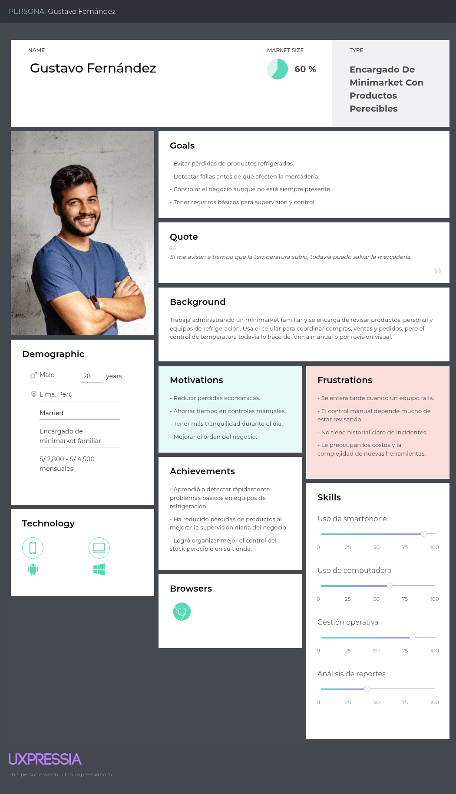

**Segmento 2: Responsables de operaciones, calidad o logística en negocios con cadena de frío**


### 2.3.2 User Task Matrix

El User Task Matrix presenta las tareas clave que realizan los User Persona para cumplir sus objetivos en el día a día, independientemente de si usan ColdTrace o no. Se evalúa la frecuencia y la importancia de cada tarea para identificar dónde la plataforma debe aportar el mayor valor.

**Persona 1: Gustavo Fernández — Segmento 1**

| Tarea | Frecuencia | Importancia |
|:------|:----------:|:-----------:|
| Verificar que la temperatura esté dentro del rango seguro | Alta | Alta |
| Recibir alertas ante una falla de refrigeración | Media | Alta |
| Revisar el historial de temperatura del día o turno anterior | Media | Media |
| Configurar el rango seguro según el tipo de producto almacenado | Baja | Alta |
| Generar un reporte básico para una inspección sanitaria | Baja | Alta |
| Consultar desde el celular el estado de la refrigeradora cuando no está en el local | Media | Media |

**Persona 2: Sofía Ramírez — Segmento 2**

| Tarea | Frecuencia | Importancia |
|:------|:----------:|:-----------:|
| Monitorear en tiempo real múltiples equipos, ambientes o unidades con cadena de frío | Alta | Alta |
| Recibir y revisar alertas automáticas ante desviaciones de temperatura | Media | Alta |
| Generar reportes de trazabilidad para auditorías, control interno o seguimiento operativo | Media | Alta |
| Revisar el historial de incidencias por equipo, área o sede | Alta | Alta |
| Configurar rangos de temperatura y humedad según el tipo de producto o ambiente | Baja | Alta |
| Consultar un dashboard consolidado para tomar decisiones operativas | Media | Alta |

**Análisis del Task Matrix:** Se observa una complementariedad entre ambos perfiles. Para Gustavo, las tareas de mayor peso son el monitoreo básico y las alertas en tiempo real desde dispositivo móvil. Para Sofía, las prioridades son la visibilidad centralizada, los reportes de trazabilidad y el historial de incidencias. Esto confirma que ColdTrace debe priorizar una interfaz móvil simple para el primer segmento y un dashboard de control más completo para el segundo, conectando ambas experiencias en una misma plataforma.

### 2.3.3 User Journey Mapping

El User Journey Mapping representa el flujo de pasos, necesidades y emociones que experimenta un usuario para alcanzar un objetivo específico. Se presentan versiones As-Is que ilustran la situación actual de los usuarios antes de la implementación de ColdTrace, identificando los puntos de fricción y las ineficiencias de los procesos manuales predominantes.

**User Journey Map: Gustavo Fernández (As-Is)**

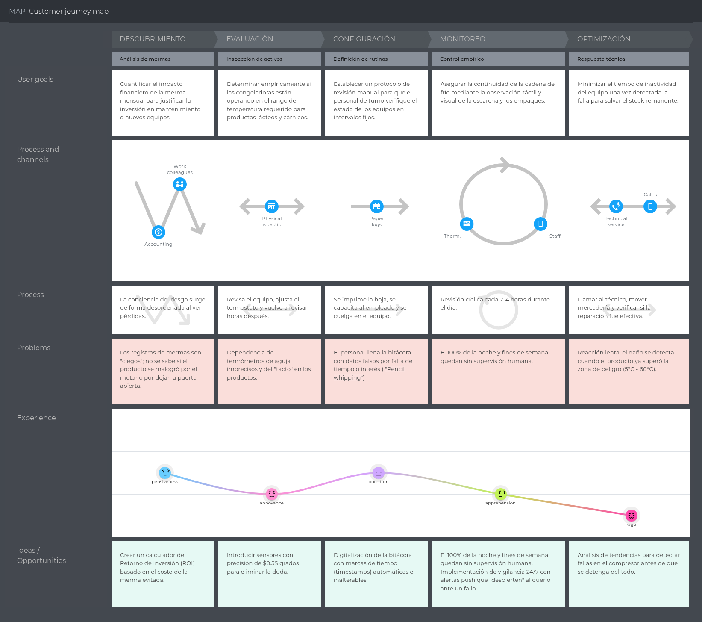

**User Journey Map: Sofía Ramírez (As-Is)**

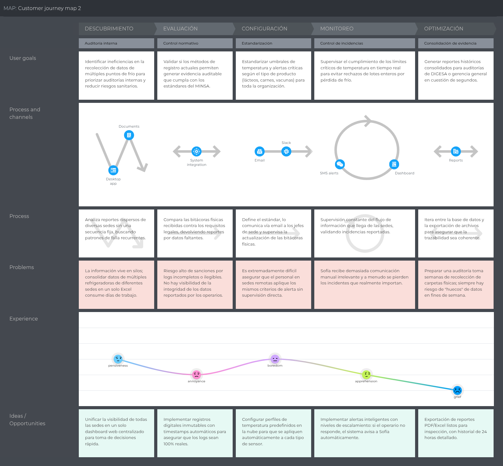

### 2.3.4 Empathy Mapping

El Empathy Map permite profundizar en el mundo interno y sensorial del usuario, capturando lo que ven, oyen, dicen, hacen, piensan y sienten durante su jornada laboral. Esta herramienta es fundamental para identificar las motivaciones profundas que impulsan el comportamiento humano y validar los puntos de dolor y las ganancias esperadas.

**Empathy Map: Gustavo Fernández**


**Empathy Map: Sofía Ramírez**


---

## 2.4 Big Picture Event Storming

Para diseñar un sistema robusto, primero es necesario entender el negocio como un todo, dejando de lado los tecnicismos para enfocarnos en la lógica pura del dominio. El Big Picture EventStorming es una técnica colaborativa que permite visualizar todos los eventos significativos que ocurren en la cadena de frío alimentaria. Al organizar estos eventos de manera cronológica, se logra identificar los flujos críticos del negocio y los puntos exactos donde la información suele perderse o donde la falta de monitoreo genera pérdidas.

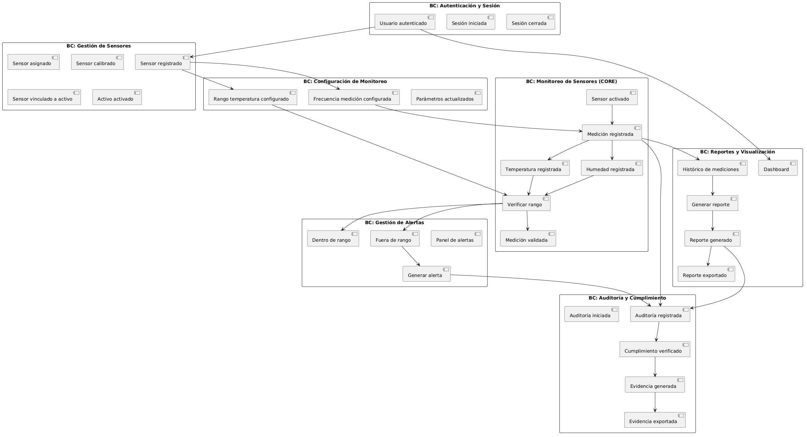

---

## 2.5 Ubiquitous Language

| Término | Definición |
|:--------|:-----------|
| **Activo** | Cámara frigorífica, almacén refrigerado o unidad de transporte registrada y monitoreada en la plataforma. |
| **Sensor** | Dispositivo IoT instalado en un activo que mide temperatura y/o humedad de manera continua y envía los datos a ColdTrace. |
| **Medición** | Dato registrado por el sensor en un momento específico, incluyendo valor, unidad, fecha y hora. |
| **Rango seguro** | Límites de temperatura y humedad definidos por el usuario según el tipo de producto almacenado en cada activo. |
| **Desviación** | Lectura registrada fuera del rango seguro configurado, que puede indicar una falla o riesgo en la cadena de frío. |
| **Alerta** | Notificación automática generada por el sistema cuando se detecta una desviación, enviada por correo o mensajería al responsable. |
| **Incidencia** | Evento documentado que agrupa una o más desviaciones con su contexto, causa, acción tomada y resolución. |
| **Historial** | Registro cronológico de mediciones, alertas e incidencias asociadas a un activo o instalación, consultable desde la plataforma. |
| **Reporte** | Documento generado por el sistema con datos históricos de temperatura, humedad e incidencias para trazabilidad o auditoría. |
| **Auditoría** | Proceso de verificación de condiciones de almacenamiento o transporte, respaldado por el historial y los reportes de ColdTrace. |
| **Dashboard** | Panel centralizado que muestra en tiempo real el estado de todos los activos monitoreados, alertas activas e indicadores clave. |
| **Trazabilidad** | Capacidad de reconstruir y documentar las condiciones de temperatura y humedad a lo largo del tiempo para un activo o lote de productos. |

**Expected benefits of the ubiquitous language:**

- Facilitates communication: Bridges the gap between developers, field engineers, and financial administrators.
- Improves technical alignment: Ensures that database tables and UI labels match the business reality.
- Avoids ambiguities: Clearly distinguishes between an internal "Requisition" and an external "Purchase Order," preventing procurement errors.
- Ensures consistency: Guarantees that documentation, mobile interfaces, and project reports use the same professional terminology.


# Chapter III: Requirements Specification

## 3.1 User Stories
<table style="width: 100%; table-layout: fixed;">
  <colgroup>
    <col style="width: 14%;">
    <col style="width: 24%;">
    <col style="width: 62%;">
  </colgroup>
  <tr>
    <td><strong>Código</strong></td>
    <td><strong>Título</strong></td>
    <td><strong>Epic</strong></td>
  </tr>
  <tr>
    <td>EP001</td>
    <td>Landing page y captación de visitantes</td>
    <td>Como visitante de ColdTrace, <strong>Quiero</strong> recorrer la landing page y comprender la propuesta de valor del producto, <strong>Para</strong> evaluar si la solución es relevante para mi negocio antes de registrarme o contactarme.</td>
  </tr>
  <tr>
    <td>EP002</td>
    <td>Gestión de usuarios y acceso</td>
    <td>Como usuario o administrador de la plataforma, <strong>Quiero</strong> registrar cuentas, autenticar accesos y gestionar permisos dentro del sistema, <strong>Para</strong> asegurar que cada persona utilice ColdTrace de acuerdo con su rol y pueda ingresar de forma segura a la operación.</td>
  </tr>
  <tr>
    <td>EP003</td>
    <td>Gestión de equipos y sensores</td>
    <td>Como responsable de la operación, <strong>Quiero</strong> registrar cámaras frigoríficas, unidades de transporte, sensores y gateways dentro del sistema, <strong>Para</strong> mantener organizada la infraestructura de monitoreo y asociar correctamente cada activo con su ubicación y estado.</td>
  </tr>
  <tr>
    <td>EP004</td>
    <td>Monitoreo de temperatura y humedad</td>
    <td>Como usuario de la plataforma, <strong>Quiero</strong> visualizar en tiempo real la temperatura, humedad y estado de mis equipos o ambientes monitoreados, <strong>Para</strong> detectar variaciones oportunamente y reducir el riesgo de pérdida de productos perecibles.</td>
  </tr>
  <tr>
    <td>EP005</td>
    <td>Alertas e incidencias</td>
    <td>Como encargado de negocio o responsable de operaciones, <strong>Quiero</strong> recibir alertas automáticas y registrar incidencias cuando ocurra una desviación térmica o un evento crítico, <strong>Para</strong> actuar rápidamente y minimizar el impacto operativo o económico.</td>
  </tr>
  <tr>
    <td>EP006</td>
    <td>Reportes, historial de eventos y cumplimiento</td>
    <td>Como responsable de operaciones y control de calidad, <strong>Quiero</strong> consultar historiales de lecturas, alertas e incidencias, exportar reportes y reunir evidencia operativa, <strong>Para</strong> facilitar auditorías, demostrar cumplimiento y mejorar la toma de decisiones basadas en datos.</td>
  </tr>
  <tr>
    <td>EP007</td>
    <td>Configuración operativa y mantenimiento</td>
    <td>Como usuario administrativo de la plataforma, <strong>Quiero</strong> configurar rangos de seguridad, gestionar parámetros operativos y dar seguimiento a necesidades de mantenimiento, <strong>Para</strong> asegurar el funcionamiento continuo del sistema y adaptar ColdTrace al contexto real de cada operación.</td>
  </tr>
  <tr>
    <td>EP008</td>
    <td>RESTful API - Autenticación</td>
    <td>Como developer, <strong>Quiero</strong> contar con endpoints de autenticación y acceso, <strong>Para</strong> permitir que el frontend gestione el registro, inicio de sesión y validación de usuarios dentro de ColdTrace.</td>
  </tr>
  <tr>
    <td>EP009</td>
    <td>RESTful API - Equipos y sensores</td>
    <td>Como developer, <strong>Quiero</strong> exponer endpoints para registrar y administrar equipos monitoreados y sensores, <strong>Para</strong> permitir que el frontend configure la infraestructura de monitoreo de la operación.</td>
  </tr>
  <tr>
    <td>EP010</td>
    <td>RESTful API - Lecturas y monitoreo</td>
    <td>Como developer, <strong>Quiero</strong> disponer de endpoints para registrar y consultar lecturas de monitoreo, <strong>Para</strong> soportar la visualización histórica y el seguimiento térmico en la plataforma.</td>
  </tr>
  <tr>
    <td>EP011</td>
    <td>RESTful API - Alertas e incidencias</td>
    <td>Como developer, <strong>Quiero</strong> implementar endpoints para consultar alertas y gestionar incidencias, <strong>Para</strong> permitir que el frontend responda a eventos críticos dentro de la operación.</td>
  </tr>
  <tr>
    <td>EP012</td>
    <td>RESTful API - Reportes y cumplimiento</td>
    <td>Como developer, <strong>Quiero</strong> ofrecer endpoints para generar bitácoras y reportes de cumplimiento, <strong>Para</strong> facilitar la consulta, descarga y uso documental de la información operativa.</td>
  </tr>
</table>

Luego de definir las épicas principales del sistema, se desarrollan las historias de usuario correspondientes a cada una de ellas. A continuación, se presentan las user stories del proyecto, organizadas según las épicas definidas para ColdTrace.

<table style="width: 100%; table-layout: fixed;">
  <colgroup>
    <col style="width: 12%;">
    <col style="width: 18%;">
    <col style="width: 25%;">
    <col style="width: 33%;">
    <col style="width: 12%;">
  </colgroup>
  <tr>
    <td><strong>ID de Historia de Usuario</strong></td>
    <td><strong>Título de User Story</strong></td>
    <td><strong>Descripción</strong></td>
    <td><strong>Criterios de Aceptación con Escenarios</strong></td>
    <td><strong>ID de Épica</strong></td>
  </tr>
  <tr>
    <td>US001</td>
    <td>Ver propuesta de valor en la landing page</td>
    <td>
      <strong>Como</strong> visitante,<br>
      <strong>Quiero</strong> ver en la página principal qué problema resuelve ColdTrace y cómo lo soluciona,<br>
      <strong>Para</strong> evaluar si es relevante para mi negocio antes de registrarme.
    </td>
    <td>
      <strong>Escenario 1: Carga exitosa de la propuesta de valor.</strong><br>
      <strong>Given</strong> el visitante accede a la landing page de ColdTrace.<br>
      <strong>When</strong> la página carga correctamente.<br>
      <strong>Then</strong> el sistema muestra el problema, la solución y los beneficios clave del producto en la sección principal.
    </td>
    <td>EP001</td>
  </tr>
  <tr>
    <td>US002</td>
    <td>Ver sección de funcionalidades</td>
    <td>
      <strong>Como</strong> visitante,<br>
      <strong>Quiero</strong> ver una sección con las funcionalidades del producto,<br>
      <strong>Para</strong> entender qué incluye ColdTrace antes de tomar una decisión de registro o contacto.
    </td>
    <td>
      <strong>Escenario 1: Sección visible al hacer scroll.</strong><br>
      <strong>Given</strong> el visitante está en la landing page.<br>
      <strong>When</strong> hace scroll hacia la sección de funcionalidades.<br>
      <strong>Then</strong> el sistema muestra bloques con cada funcionalidad principal y su descripción breve.
    </td>
    <td>EP001</td>
  </tr>
  <tr>
    <td>US003</td>
    <td>Ver sección de plataforma y funcionamiento</td>
    <td>
      <strong>Como</strong> visitante,<br>
      <strong>Quiero</strong> ver cómo se presenta la plataforma y cómo funciona ColdTrace,<br>
      <strong>Para</strong> comprender de manera general cómo opera la solución antes de continuar.
    </td>
    <td>
      <strong>Escenario 1: Visualización de la sección del producto.</strong><br>
      <strong>Given</strong> el visitante navega por la landing page.<br>
      <strong>When</strong> llega a la sección de plataforma y funcionamiento.<br>
      <strong>Then</strong> el sistema muestra una explicación general del funcionamiento de ColdTrace y una vista representativa de la plataforma.
    </td>
    <td>EP001</td>
  </tr>
  <tr>
    <td>US004</td>
    <td>Acceder a la sección de contacto o registro</td>
    <td>
      <strong>Como</strong> visitante,<br>
      <strong>Quiero</strong> acceder fácilmente a la sección de contacto o registro desde la landing page,<br>
      <strong>Para</strong> continuar con el proceso de interés en la solución.
    </td>
    <td>
      <strong>Escenario 1: Acceso exitoso a la sección de contacto o registro.</strong><br>
      <strong>Given</strong> el visitante se encuentra navegando en la landing page.<br>
      <strong>When</strong> selecciona la opción de contacto, registro o llamada a la acción correspondiente.<br>
      <strong>Then</strong> el sistema lo dirige correctamente a la sección o flujo asociado.
    </td>
    <td>EP001</td>
  </tr>
  <tr>
    <td>US005</td>
    <td>Navegar con menú fijo</td>
    <td>
      <strong>Como</strong> visitante,<br>
      <strong>Quiero</strong> que el menú de navegación permanezca visible al hacer scroll,<br>
      <strong>Para</strong> poder acceder a cualquier sección de la landing en cualquier momento sin tener que volver al inicio.
    </td>
    <td>
      <strong>Escenario 1: Menú fijo durante el scroll.</strong><br>
      <strong>Given</strong> el visitante hace scroll hacia abajo en la landing page.<br>
      <strong>When</strong> el menú llega al borde superior de la pantalla.<br>
      <strong>Then</strong> el sistema mantiene el menú fijo y visible durante todo el desplazamiento de la página.
    </td>
    <td>EP001</td>
  </tr>
  <tr>
    <td>US006</td>
    <td>Ver landing page en dispositivo móvil</td>
    <td>
      <strong>Como</strong> visitante que accede desde un celular,<br>
      <strong>Quiero</strong> que la landing page se adapte correctamente a mi pantalla,<br>
      <strong>Para</strong> poder navegar y leer el contenido sin problemas.
    </td>
    <td>
      <strong>Escenario 1: Visualización correcta en móvil.</strong><br>
      <strong>Given</strong> el visitante accede a la landing page desde un dispositivo móvil.<br>
      <strong>When</strong> la página carga.<br>
      <strong>Then</strong> el sistema muestra el contenido adaptado a la resolución del dispositivo sin elementos cortados ni superpuestos.
    </td>
    <td>EP001</td>
  </tr>
  <tr>
    <td>US007</td>
    <td>Crear cuenta de usuario</td>
    <td>
      <strong>Como</strong> usuario nuevo de la plataforma,<br>
      <strong>Quiero</strong> registrar una cuenta con mis datos básicos de acceso,<br>
      <strong>Para</strong> poder ingresar a ColdTrace y utilizar las funcionalidades disponibles según mi rol.
    </td>
    <td>
      <strong>Happy Path:</strong><br>
      <strong>Given</strong> el usuario completa correctamente el formulario de registro.<br>
      <strong>When</strong> envía sus datos para crear la cuenta.<br>
      <strong>Then</strong> el sistema registra la cuenta y muestra una confirmación de creación exitosa.<br><br>
      <strong>Unhappy Path:</strong><br>
      <strong>Given</strong> el usuario intenta registrarse con un correo ya existente.<br>
      <strong>When</strong> envía el formulario de registro.<br>
      <strong>Then</strong> el sistema muestra un mensaje indicando que el correo ya se encuentra registrado.<br><br>
      <strong>Unhappy Path:</strong><br>
      <strong>Given</strong> el usuario deja campos obligatorios vacíos o ingresa datos inválidos.<br>
      <strong>When</strong> intenta completar el registro.<br>
      <strong>Then</strong> el sistema valida la información y solicita corregir los campos antes de continuar.
    </td>
    <td>EP002</td>
  </tr>
  <tr>
    <td>US008</td>
    <td>Verificar identidad por correo</td>
    <td>
      <strong>Como</strong> usuario registrado,<br>
      <strong>Quiero</strong> recibir un correo de verificación y confirmar mi identidad,<br>
      <strong>Para</strong> activar mi cuenta y asegurar que solo usuarios válidos accedan a la plataforma.
    </td>
    <td>
      <strong>Happy Path:</strong><br>
      <strong>Given</strong> el usuario ya creó su cuenta y recibió el correo de verificación.<br>
      <strong>When</strong> selecciona el enlace de confirmación enviado por el sistema.<br>
      <strong>Then</strong> la cuenta queda verificada y habilitada para iniciar sesión.<br><br>
      <strong>Unhappy Path:</strong><br>
      <strong>Given</strong> el enlace de verificación ha expirado o no es válido.<br>
      <strong>When</strong> el usuario intenta confirmar su cuenta.<br>
      <strong>Then</strong> el sistema informa que el enlace no puede utilizarse y ofrece reenviar una nueva verificación.<br><br>
      <strong>Unhappy Path:</strong><br>
      <strong>Given</strong> el usuario no ha completado la verificación de identidad.<br>
      <strong>When</strong> intenta acceder a funciones restringidas de la plataforma.<br>
      <strong>Then</strong> el sistema le indica que primero debe validar su cuenta.
    </td>
    <td>EP002</td>
  </tr>
  <tr>
    <td>US009</td>
    <td>Iniciar sesión</td>
    <td>
      <strong>Como</strong> usuario registrado,<br>
      <strong>Quiero</strong> iniciar sesión con mis credenciales,<br>
      <strong>Para</strong> acceder a mi cuenta y utilizar las funciones de monitoreo y gestión disponibles en ColdTrace.
    </td>
    <td>
      <strong>Happy Path:</strong><br>
      <strong>Given</strong> el usuario tiene una cuenta verificada y credenciales válidas.<br>
      <strong>When</strong> ingresa su correo y contraseña y selecciona la opción de iniciar sesión.<br>
      <strong>Then</strong> el sistema autentica al usuario y le permite acceder a la plataforma.<br><br>
      <strong>Unhappy Path:</strong><br>
      <strong>Given</strong> el usuario ingresa una contraseña incorrecta o un correo no reconocido.<br>
      <strong>When</strong> intenta iniciar sesión.<br>
      <strong>Then</strong> el sistema rechaza el acceso y muestra un mensaje de credenciales inválidas.<br><br>
      <strong>Unhappy Path:</strong><br>
      <strong>Given</strong> el acceso del usuario ha sido revocado.<br>
      <strong>When</strong> intenta ingresar a la plataforma.<br>
      <strong>Then</strong> el sistema bloquea el acceso e informa que la cuenta no tiene permisos vigentes.
    </td>
    <td>EP002</td>
  </tr>
  <tr>
    <td>US010</td>
    <td>Recuperar contraseña</td>
    <td>
      <strong>Como</strong> usuario de la plataforma,<br>
      <strong>Quiero</strong> restablecer mi contraseña cuando no pueda acceder a mi cuenta,<br>
      <strong>Para</strong> recuperar el ingreso al sistema de manera segura y sin depender de soporte manual.
    </td>
    <td>
      <strong>Happy Path:</strong><br>
      <strong>Given</strong> el usuario olvidó su contraseña pero recuerda su correo registrado.<br>
      <strong>When</strong> solicita el restablecimiento de contraseña.<br>
      <strong>Then</strong> el sistema envía un enlace seguro para crear una nueva contraseña.<br><br>
      <strong>Happy Path:</strong><br>
      <strong>Given</strong> el usuario accede correctamente al enlace recibido.<br>
      <strong>When</strong> registra una nueva contraseña válida.<br>
      <strong>Then</strong> el sistema actualiza la contraseña y confirma el cambio exitoso.<br><br>
      <strong>Unhappy Path:</strong><br>
      <strong>Given</strong> el usuario ingresa un correo no asociado a ninguna cuenta.<br>
      <strong>When</strong> solicita recuperar la contraseña.<br>
      <strong>Then</strong> el sistema informa que no existe una cuenta vinculada a ese correo.<br><br>
      <strong>Unhappy Path:</strong><br>
      <strong>Given</strong> el enlace de recuperación ha expirado.<br>
      <strong>When</strong> el usuario intenta usarlo.<br>
      <strong>Then</strong> el sistema solicita generar un nuevo proceso de recuperación.
    </td>
    <td>EP002</td>
  </tr>
  <tr>
    <td>US011</td>
    <td>Asignar roles y permisos</td>
    <td>
      <strong>Como</strong> administrador de la organización,<br>
      <strong>Quiero</strong> asignar roles y permisos a los usuarios del sistema,<br>
      <strong>Para</strong> controlar qué acciones puede realizar cada persona dentro de ColdTrace según su responsabilidad operativa.
    </td>
    <td>
      <strong>Happy Path:</strong><br>
      <strong>Given</strong> el administrador visualiza la lista de usuarios registrados de su organización.<br>
      <strong>When</strong> asigna un rol válido a un usuario.<br>
      <strong>Then</strong> el sistema actualiza sus permisos y habilita el acceso correspondiente.<br><br>
      <strong>Happy Path:</strong><br>
      <strong>Given</strong> un usuario ya tiene un rol activo.<br>
      <strong>When</strong> el administrador modifica sus permisos según un nuevo nivel de responsabilidad.<br>
      <strong>Then</strong> el sistema actualiza el acceso sin afectar la integridad de la cuenta.<br><br>
      <strong>Unhappy Path:</strong><br>
      <strong>Given</strong> el administrador intenta asignar un rol no permitido o incompleto.<br>
      <strong>When</strong> guarda la configuración de permisos.<br>
      <strong>Then</strong> el sistema rechaza la operación y solicita seleccionar un rol válido.<br><br>
      <strong>Unhappy Path:</strong><br>
      <strong>Given</strong> un usuario sin privilegios administrativos intenta modificar permisos.<br>
      <strong>When</strong> accede a esa funcionalidad.<br>
      <strong>Then</strong> el sistema restringe la acción y muestra un mensaje de acceso denegado.
    </td>
    <td>EP002</td>
  </tr>
  <tr>
    <td>US012</td>
    <td>Registrar cámara frigorífica</td>
    <td>
      <strong>Como</strong> responsable de la operación,<br>
      <strong>Quiero</strong> registrar una cámara frigorífica en la plataforma con sus datos principales,<br>
      <strong>Para</strong> monitorear su funcionamiento y asociarla correctamente a la operación de la organización.
    </td>
    <td>
      <strong>Happy Path:</strong><br>
      <strong>Given</strong> el usuario cuenta con permisos para gestionar activos.<br>
      <strong>When</strong> registra una cámara frigorífica con datos válidos como nombre, capacidad, ubicación y descripción.<br>
      <strong>Then</strong> el sistema guarda el activo y lo muestra dentro del inventario de equipos registrados.<br><br>
      <strong>Unhappy Path:</strong><br>
      <strong>Given</strong> el usuario omite campos obligatorios o ingresa información inconsistente.<br>
      <strong>When</strong> intenta guardar la cámara frigorífica.<br>
      <strong>Then</strong> el sistema rechaza el registro y solicita completar o corregir los datos requeridos.<br><br>
      <strong>Unhappy Path:</strong><br>
      <strong>Given</strong> ya existe un equipo registrado con el mismo identificador interno.<br>
      <strong>When</strong> el usuario intenta crear un nuevo registro duplicado.<br>
      <strong>Then</strong> el sistema informa que el activo ya existe y evita la duplicidad.
    </td>
    <td>EP003</td>
  </tr>
  <tr>
    <td>US013</td>
    <td>Registrar unidad de transporte</td>
    <td>
      <strong>Como</strong> responsable logístico,<br>
      <strong>Quiero</strong> registrar una unidad de transporte refrigerado dentro de ColdTrace,<br>
      <strong>Para</strong> monitorear sus condiciones térmicas y conservar un historial de mediciones e incidencias durante su operación.
    </td>
    <td>
      <strong>Happy Path:</strong><br>
      <strong>Given</strong> el usuario tiene acceso al módulo de activos.<br>
      <strong>When</strong> registra una unidad de transporte con sus datos de identificación y operación.<br>
      <strong>Then</strong> el sistema crea el registro y lo deja disponible para asociar sensores y monitoreo.<br><br>
      <strong>Unhappy Path:</strong><br>
      <strong>Given</strong> la información de la unidad está incompleta o no cumple las validaciones mínimas.<br>
      <strong>When</strong> el usuario intenta guardar el registro.<br>
      <strong>Then</strong> el sistema muestra errores y no permite completar la operación.<br><br>
      <strong>Unhappy Path:</strong><br>
      <strong>Given</strong> el usuario no tiene permisos para registrar activos logísticos.<br>
      <strong>When</strong> intenta crear la unidad de transporte.<br>
      <strong>Then</strong> el sistema restringe la acción y muestra un mensaje de acceso denegado.
    </td>
    <td>EP003</td>
  </tr>
  <tr>
    <td>US014</td>
    <td>Vincular sensor IoT a un activo</td>
    <td>
      <strong>Como</strong> responsable de la configuración del sistema,<br>
      <strong>Quiero</strong> vincular un sensor IoT a una cámara frigorífica o unidad de transporte,<br>
      <strong>Para</strong> comenzar a capturar datos de temperatura y humedad del activo correcto.
    </td>
    <td>
      <strong>Happy Path:</strong><br>
      <strong>Given</strong> existe un activo previamente registrado y un sensor disponible para configuración.<br>
      <strong>When</strong> el usuario selecciona ambos elementos y confirma la vinculación.<br>
      <strong>Then</strong> el sistema asocia el sensor al activo y habilita su uso para monitoreo.<br><br>
      <strong>Unhappy Path:</strong><br>
      <strong>Given</strong> el sensor ya se encuentra vinculado a otro activo.<br>
      <strong>When</strong> el usuario intenta asociarlo nuevamente.<br>
      <strong>Then</strong> el sistema informa el conflicto y no permite duplicar la vinculación.<br><br>
      <strong>Unhappy Path:</strong><br>
      <strong>Given</strong> el activo seleccionado no existe o fue desactivado.<br>
      <strong>When</strong> el usuario intenta completar la asociación.<br>
      <strong>Then</strong> el sistema impide la operación y solicita elegir un activo válido.
    </td>
    <td>EP003</td>
  </tr>
  <tr>
    <td>US015</td>
    <td>Emparejar gateway de red</td>
    <td>
      <strong>Como</strong> usuario administrativo de la plataforma,<br>
      <strong>Quiero</strong> emparejar un gateway de red con los sensores de mi operación,<br>
      <strong>Para</strong> asegurar la transmisión de datos desde los activos hacia el sistema.
    </td>
    <td>
      <strong>Happy Path:</strong><br>
      <strong>Given</strong> el gateway se encuentra disponible y el sensor está listo para configuración.<br>
      <strong>When</strong> el usuario realiza el proceso de emparejamiento correctamente.<br>
      <strong>Then</strong> el sistema confirma la conexión entre gateway y sensor.<br><br>
      <strong>Unhappy Path:</strong><br>
      <strong>Given</strong> el gateway no responde o presenta fallas de conectividad.<br>
      <strong>When</strong> el usuario intenta completar el emparejamiento.<br>
      <strong>Then</strong> el sistema informa el error y deja el sensor sin conexión activa.<br><br>
      <strong>Unhappy Path:</strong><br>
      <strong>Given</strong> el gateway ya fue asignado a una configuración incompatible.<br>
      <strong>When</strong> el usuario intenta reutilizarlo sin realizar ajustes previos.<br>
      <strong>Then</strong> el sistema advierte la incompatibilidad y solicita revisar la configuración.
    </td>
    <td>EP003</td>
  </tr>
  <tr>
    <td>US016</td>
    <td>Verificar calibración del sensor</td>
    <td>
      <strong>Como</strong> responsable de calidad u operación,<br>
      <strong>Quiero</strong> verificar el estado de calibración de los sensores instalados,<br>
      <strong>Para</strong> asegurar que las lecturas registradas sean confiables y útiles para control y cumplimiento.
    </td>
    <td>
      <strong>Happy Path:</strong><br>
      <strong>Given</strong> el sensor cuenta con información de calibración vigente.<br>
      <strong>When</strong> el usuario consulta el estado del sensor.<br>
      <strong>Then</strong> el sistema muestra que la calibración es válida y permite continuar con su uso normal.<br><br>
      <strong>Unhappy Path:</strong><br>
      <strong>Given</strong> el certificado de calibración está vencido.<br>
      <strong>When</strong> el usuario revisa el estado del sensor.<br>
      <strong>Then</strong> el sistema alerta que el sensor requiere mantenimiento o recalibración.<br><br>
      <strong>Unhappy Path:</strong><br>
      <strong>Given</strong> no existe información registrada sobre la calibración del sensor.<br>
      <strong>When</strong> el usuario intenta validarlo dentro del sistema.<br>
      <strong>Then</strong> la plataforma indica que el estado del sensor no puede considerarse conforme.
    </td>
    <td>EP003</td>
  </tr>
  <tr>
    <td>US017</td>
    <td>Actualizar ubicación y estado del activo</td>
    <td>
      <strong>Como</strong> responsable de la operación,<br>
      <strong>Quiero</strong> actualizar la ubicación física y el estado operativo de un activo registrado,<br>
      <strong>Para</strong> mantener información precisa sobre su disponibilidad, condición y contexto de uso.
    </td>
    <td>
      <strong>Happy Path:</strong><br>
      <strong>Given</strong> el activo ya se encuentra registrado en la plataforma.<br>
      <strong>When</strong> el usuario modifica su ubicación o cambia su estado operativo a activo, inactivo o en mantenimiento.<br>
      <strong>Then</strong> el sistema guarda la actualización y refleja el cambio en el inventario de activos.<br><br>
      <strong>Unhappy Path:</strong><br>
      <strong>Given</strong> el usuario intenta asignar una ubicación inexistente o inválida.<br>
      <strong>When</strong> guarda la modificación del activo.<br>
      <strong>Then</strong> el sistema rechaza la operación y solicita una ubicación válida.<br><br>
      <strong>Unhappy Path:</strong><br>
      <strong>Given</strong> el activo tiene una incidencia abierta que restringe su cambio de estado.<br>
      <strong>When</strong> el usuario intenta modificarlo manualmente.<br>
      <strong>Then</strong> el sistema advierte la restricción y evita una actualización inconsistente.
    </td>
    <td>EP003</td>
  </tr>
  <tr>
    <td>US018</td>
    <td>Visualizar temperatura en tiempo real</td>
    <td>
      <strong>Como</strong> usuario de la plataforma,<br>
      <strong>Quiero</strong> visualizar en tiempo real la temperatura de mis equipos o ambientes monitoreados,<br>
      <strong>Para</strong> detectar rápidamente cualquier variación que pueda comprometer la conservación de los productos.
    </td>
    <td>
      <strong>Happy Path:</strong><br>
      <strong>Given</strong> el activo cuenta con un sensor correctamente vinculado y con transmisión activa.<br>
      <strong>When</strong> el usuario accede al panel de monitoreo.<br>
      <strong>Then</strong> el sistema muestra la temperatura actual del activo en tiempo real.<br><br>
      <strong>Unhappy Path:</strong><br>
      <strong>Given</strong> no existe una lectura reciente disponible para el activo seleccionado.<br>
      <strong>When</strong> el usuario intenta visualizar la temperatura.<br>
      <strong>Then</strong> el sistema informa que no hay datos actualizados en ese momento.<br><br>
      <strong>Unhappy Path:</strong><br>
      <strong>Given</strong> el activo no tiene sensores configurados.<br>
      <strong>When</strong> el usuario accede al monitoreo del equipo.<br>
      <strong>Then</strong> la plataforma indica que el activo aún no puede ser monitoreado.
    </td>
    <td>EP004</td>
  </tr>
  <tr>
    <td>US019</td>
    <td>Visualizar humedad en tiempo real</td>
    <td>
      <strong>Como</strong> usuario de la plataforma,<br>
      <strong>Quiero</strong> visualizar en tiempo real los valores de humedad de mis ambientes o equipos monitoreados,<br>
      <strong>Para</strong> complementar el control de conservación y evaluar mejor las condiciones del activo.
    </td>
    <td>
      <strong>Happy Path:</strong><br>
      <strong>Given</strong> el sensor del activo transmite datos de humedad de forma correcta.<br>
      <strong>When</strong> el usuario consulta el detalle del monitoreo.<br>
      <strong>Then</strong> el sistema presenta el valor actual de humedad junto con el resto de variables monitoreadas.<br><br>
      <strong>Unhappy Path:</strong><br>
      <strong>Given</strong> el sensor no soporta medición de humedad.<br>
      <strong>When</strong> el usuario intenta consultar dicha variable.<br>
      <strong>Then</strong> el sistema informa que esa lectura no se encuentra disponible.<br><br>
      <strong>Unhappy Path:</strong><br>
      <strong>Given</strong> la lectura de humedad no pudo ser capturada correctamente.<br>
      <strong>When</strong> el usuario revisa el panel de monitoreo.<br>
      <strong>Then</strong> el sistema muestra el estado de dato no disponible o inconsistente.
    </td>
    <td>EP004</td>
  </tr>
  <tr>
    <td>US020</td>
    <td>Consultar historial de lecturas</td>
    <td>
      <strong>Como</strong> encargado de negocio o responsable de operaciones,<br>
      <strong>Quiero</strong> consultar el historial de lecturas de temperatura y humedad de un activo,<br>
      <strong>Para</strong> revisar su comportamiento en el tiempo y analizar incidencias pasadas.
    </td>
    <td>
      <strong>Happy Path:</strong><br>
      <strong>Given</strong> el activo tiene lecturas almacenadas en el sistema.<br>
      <strong>When</strong> el usuario selecciona un rango de fechas para la consulta.<br>
      <strong>Then</strong> el sistema muestra el historial registrado dentro del periodo solicitado.<br><br>
      <strong>Unhappy Path:</strong><br>
      <strong>Given</strong> el activo no tiene información histórica disponible en el rango consultado.<br>
      <strong>When</strong> el usuario ejecuta la búsqueda.<br>
      <strong>Then</strong> el sistema informa que no existen registros para ese periodo.<br><br>
      <strong>Unhappy Path:</strong><br>
      <strong>Given</strong> el usuario ingresa un rango de fechas inválido.<br>
      <strong>When</strong> intenta consultar el historial.<br>
      <strong>Then</strong> la plataforma solicita corregir los criterios de búsqueda antes de procesar la consulta.
    </td>
    <td>EP004</td>
  </tr>
  <tr>
    <td>US021</td>
    <td>Detectar temperatura fuera de rango</td>
    <td>
      <strong>Como</strong> usuario de la plataforma,<br>
      <strong>Quiero</strong> que el sistema identifique automáticamente cuando la temperatura de un activo salga del rango seguro,<br>
      <strong>Para</strong> reconocer oportunamente una condición de riesgo dentro de la operación.
    </td>
    <td>
      <strong>Happy Path:</strong><br>
      <strong>Given</strong> el activo tiene configurado un rango válido de temperatura.<br>
      <strong>When</strong> el sistema recibe una lectura que supera los límites establecidos.<br>
      <strong>Then</strong> la plataforma marca la condición como fuera de rango.<br><br>
      <strong>Unhappy Path:</strong><br>
      <strong>Given</strong> el activo no tiene un rango configurado previamente.<br>
      <strong>When</strong> se recibe una nueva lectura de temperatura.<br>
      <strong>Then</strong> el sistema no puede evaluar el cumplimiento y advierte que falta configuración.<br><br>
      <strong>Unhappy Path:</strong><br>
      <strong>Given</strong> la lectura recibida presenta valores corruptos o inconsistentes.<br>
      <strong>When</strong> el sistema intenta procesarla.<br>
      <strong>Then</strong> la lectura es descartada y queda registrada como inválida.
    </td>
    <td>EP004</td>
  </tr>
  <tr>
    <td>US022</td>
    <td>Visualizar estado de conectividad</td>
    <td>
      <strong>Como</strong> responsable de monitoreo,<br>
      <strong>Quiero</strong> visualizar el estado de conectividad de los sensores y gateways,<br>
      <strong>Para</strong> identificar si un activo está enviando información de forma continua o si existe un problema de transmisión.
    </td>
    <td>
      <strong>Happy Path:</strong><br>
      <strong>Given</strong> el sensor y el gateway mantienen transmisión normal de datos.<br>
      <strong>When</strong> el usuario revisa el estado del activo dentro del sistema.<br>
      <strong>Then</strong> la plataforma muestra que la conectividad se encuentra activa y estable.<br><br>
      <strong>Unhappy Path:</strong><br>
      <strong>Given</strong> la conexión entre el sensor, gateway o red se ha interrumpido.<br>
      <strong>When</strong> el usuario accede al monitoreo del activo.<br>
      <strong>Then</strong> el sistema indica que la conectividad está perdida o inestable.<br><br>
      <strong>Unhappy Path:</strong><br>
      <strong>Given</strong> no existe información suficiente para determinar el estado de conexión.<br>
      <strong>When</strong> el usuario consulta el panel.<br>
      <strong>Then</strong> la plataforma muestra el estado como desconocido o pendiente de actualización.
    </td>
    <td>EP004</td>
  </tr>
  <tr>
    <td>US023</td>
    <td>Sincronizar datos almacenados offline</td>
    <td>
      <strong>Como</strong> usuario de la plataforma,<br>
      <strong>Quiero</strong> que los datos capturados durante una pérdida de conexión se sincronicen cuando el sistema recupere conectividad,<br>
      <strong>Para</strong> conservar el historial completo de las lecturas registradas durante ese periodo.
    </td>
    <td>
      <strong>Happy Path:</strong><br>
      <strong>Given</strong> hubo una interrupción de red y el dispositivo almacenó lecturas de forma local.<br>
      <strong>When</strong> la conectividad se restablece.<br>
      <strong>Then</strong> el sistema sincroniza los datos pendientes con la plataforma central.<br><br>
      <strong>Unhappy Path:</strong><br>
      <strong>Given</strong> la conexión vuelve de forma intermitente o inestable.<br>
      <strong>When</strong> se intenta sincronizar la información acumulada.<br>
      <strong>Then</strong> el sistema conserva los datos pendientes y reintenta la sincronización posteriormente.<br><br>
      <strong>Unhappy Path:</strong><br>
      <strong>Given</strong> parte de los datos offline presenta errores de integridad.<br>
      <strong>When</strong> el sistema procesa la sincronización.<br>
      <strong>Then</strong> la plataforma registra los paquetes inválidos y sincroniza únicamente la información válida.
    </td>
    <td>EP004</td>
  </tr>
  <tr>
    <td>US024</td>
    <td>Crear incidencia térmica</td>
    <td>
      <strong>Como</strong> usuario de la plataforma,<br>
      <strong>Quiero</strong> que el sistema cree una incidencia térmica cuando detecte una condición crítica en un activo,<br>
      <strong>Para</strong> iniciar el seguimiento formal del evento y evitar que el problema pase desapercibido.
    </td>
    <td>
      <strong>Happy Path:</strong><br>
      <strong>Given</strong> el sistema detecta una lectura fuera del rango seguro configurado.<br>
      <strong>When</strong> la condición supera los criterios establecidos para riesgo operativo.<br>
      <strong>Then</strong> la plataforma crea automáticamente una incidencia térmica asociada al activo afectado.<br><br>
      <strong>Unhappy Path:</strong><br>
      <strong>Given</strong> el activo no tiene configuración suficiente para evaluar la condición detectada.<br>
      <strong>When</strong> el sistema intenta crear la incidencia.<br>
      <strong>Then</strong> la plataforma registra el evento como inconsistente y advierte que falta configuración.<br><br>
      <strong>Unhappy Path:</strong><br>
      <strong>Given</strong> ya existe una incidencia abierta por la misma condición y el mismo activo.<br>
      <strong>When</strong> se procesa una nueva lectura equivalente.<br>
      <strong>Then</strong> el sistema evita crear una duplicidad y actualiza la incidencia ya existente.
    </td>
    <td>EP005</td>
  </tr>
  <tr>
    <td>US025</td>
    <td>Disparar notificaciones de alerta</td>
    <td>
      <strong>Como</strong> encargado de negocio o responsable de operaciones,<br>
      <strong>Quiero</strong> recibir notificaciones automáticas cuando ocurra una incidencia crítica,<br>
      <strong>Para</strong> reaccionar de manera oportuna antes de que el problema afecte los productos o la operación.
    </td>
    <td>
      <strong>Happy Path:</strong><br>
      <strong>Given</strong> existe una incidencia térmica activa clasificada como crítica.<br>
      <strong>When</strong> el sistema procesa las reglas de notificación configuradas.<br>
      <strong>Then</strong> la plataforma envía alertas al usuario por los canales definidos, como push, correo o SMS.<br><br>
      <strong>Unhappy Path:</strong><br>
      <strong>Given</strong> uno de los canales de notificación no está disponible o falla.<br>
      <strong>When</strong> el sistema intenta despachar la alerta.<br>
      <strong>Then</strong> la plataforma registra el fallo e intenta continuar con los demás canales disponibles.<br><br>
      <strong>Unhappy Path:</strong><br>
      <strong>Given</strong> el usuario no tiene configurados canales de contacto válidos.<br>
      <strong>When</strong> se dispara una alerta crítica.<br>
      <strong>Then</strong> el sistema informa que la notificación no pudo completarse correctamente.
    </td>
    <td>EP005</td>
  </tr>
  <tr>
    <td>US026</td>
    <td>Escalar alerta no atendida</td>
    <td>
      <strong>Como</strong> responsable de la operación,<br>
      <strong>Quiero</strong> que el sistema escale una alerta que no ha sido atendida en el tiempo esperado,<br>
      <strong>Para</strong> asegurar que el incidente reciba seguimiento y no quede sin respuesta.
    </td>
    <td>
      <strong>Happy Path:</strong><br>
      <strong>Given</strong> una alerta crítica permanece sin reconocimiento dentro del tiempo de espera configurado.<br>
      <strong>When</strong> se cumple el umbral de escalamiento.<br>
      <strong>Then</strong> el sistema escala la alerta hacia un nivel superior de atención o hacia más responsables.<br><br>
      <strong>Unhappy Path:</strong><br>
      <strong>Given</strong> la alerta ya fue reconocida antes de que venza el tiempo definido.<br>
      <strong>When</strong> el sistema evalúa la necesidad de escalamiento.<br>
      <strong>Then</strong> la plataforma no ejecuta la escalada.<br><br>
      <strong>Unhappy Path:</strong><br>
      <strong>Given</strong> no existe una política de escalamiento configurada para ese tipo de alerta.<br>
      <strong>When</strong> el sistema intenta aplicar la regla.<br>
      <strong>Then</strong> la plataforma registra la ausencia de configuración y mantiene el incidente en seguimiento.
    </td>
    <td>EP005</td>
  </tr>
  <tr>
    <td>US027</td>
    <td>Reconocer alerta crítica</td>
    <td>
      <strong>Como</strong> usuario responsable del monitoreo,<br>
      <strong>Quiero</strong> reconocer una alerta crítica dentro de la plataforma,<br>
      <strong>Para</strong> dejar constancia de que el incidente está siendo atendido por una persona responsable.
    </td>
    <td>
      <strong>Happy Path:</strong><br>
      <strong>Given</strong> existe una alerta activa asociada a una incidencia térmica.<br>
      <strong>When</strong> el usuario la revisa y marca la alerta como reconocida.<br>
      <strong>Then</strong> el sistema actualiza su estado y registra quién asumió la atención del caso.<br><br>
      <strong>Unhappy Path:</strong><br>
      <strong>Given</strong> la alerta ya fue reconocida por otro usuario.<br>
      <strong>When</strong> un segundo usuario intenta reconocerla nuevamente.<br>
      <strong>Then</strong> la plataforma muestra que la atención ya fue asumida y evita ambigüedad operativa.<br><br>
      <strong>Unhappy Path:</strong><br>
      <strong>Given</strong> el usuario no tiene permisos para gestionar incidencias.<br>
      <strong>When</strong> intenta reconocer la alerta.<br>
      <strong>Then</strong> el sistema rechaza la acción e informa acceso denegado.
    </td>
    <td>EP005</td>
  </tr>
  <tr>
    <td>US028</td>
    <td>Registrar acción correctiva y cerrar incidencia</td>
    <td>
      <strong>Como</strong> usuario responsable de la atención de incidencias,<br>
      <strong>Quiero</strong> registrar la acción correctiva aplicada y cerrar la incidencia cuando la condición se estabilice,<br>
      <strong>Para</strong> dejar registro de la medida aplicada, confirmar que el riesgo fue resuelto y conservar el historial del caso.
    </td>
    <td>
      <strong>Happy Path:</strong><br>
      <strong>Given</strong> existe una incidencia abierta y el usuario ya tomó una medida correctiva sobre el activo afectado.<br>
      <strong>When</strong> registra la acción ejecutada y el sistema confirma la estabilización de la temperatura.<br>
      <strong>Then</strong> la incidencia se cierra satisfactoriamente y queda almacenada en el historial.<br><br>
      <strong>Unhappy Path:</strong><br>
      <strong>Given</strong> el usuario intenta cerrar la incidencia sin registrar la acción tomada.<br>
      <strong>When</strong> confirma el cierre del caso.<br>
      <strong>Then</strong> la plataforma solicita completar la evidencia mínima antes de finalizar la incidencia.<br><br>
      <strong>Unhappy Path:</strong><br>
      <strong>Given</strong> la temperatura aún no ha regresado a un rango estable.<br>
      <strong>When</strong> el usuario intenta cerrar la incidencia manualmente.<br>
      <strong>Then</strong> el sistema advierte que el evento sigue activo y evita un cierre inconsistente.
    </td>
    <td>EP005</td>
  </tr>
  <tr>
    <td>US029</td>
    <td>Generar bitácora diaria</td>
    <td>
      <strong>Como</strong> responsable de operaciones o calidad,<br>
      <strong>Quiero</strong> generar una bitácora diaria con las lecturas registradas por los activos monitoreados,<br>
      <strong>Para</strong> contar con evidencia ordenada del control térmico realizado en la operación.
    </td>
    <td>
      <strong>Happy Path:</strong><br>
      <strong>Given</strong> existen lecturas válidas registradas durante la jornada.<br>
      <strong>When</strong> el usuario solicita la generación de la bitácora diaria.<br>
      <strong>Then</strong> el sistema consolida las lecturas del periodo y genera la bitácora correspondiente.<br><br>
      <strong>Unhappy Path:</strong><br>
      <strong>Given</strong> no existen datos suficientes para el día consultado.<br>
      <strong>When</strong> el usuario intenta generar la bitácora.<br>
      <strong>Then</strong> la plataforma informa que no es posible completar el registro diario por ausencia de datos.<br><br>
      <strong>Unhappy Path:</strong><br>
      <strong>Given</strong> algunas lecturas del periodo están incompletas o corruptas.<br>
      <strong>When</strong> se ejecuta la generación de la bitácora.<br>
      <strong>Then</strong> el sistema marca las inconsistencias y reporta observaciones sobre la integridad de la información.
    </td>
    <td>EP006</td>
  </tr>
  <tr>
    <td>US030</td>
    <td>Consultar historial de lecturas, alertas e incidencias</td>
    <td>
      <strong>Como</strong> responsable de operaciones y control de calidad,<br>
      <strong>Quiero</strong> consultar el historial de lecturas, alertas e incidencias de un activo o periodo operativo,<br>
      <strong>Para</strong> reconstruir eventos pasados y verificar cómo evolucionó una situación dentro del sistema.
    </td>
    <td>
      <strong>Happy Path:</strong><br>
      <strong>Given</strong> el sistema dispone de lecturas, alertas e incidencias asociadas al activo consultado.<br>
      <strong>When</strong> el usuario accede al historial del activo o periodo operativo.<br>
      <strong>Then</strong> la plataforma muestra de forma ordenada los eventos relevantes del activo o periodo seleccionado.<br><br>
      <strong>Unhappy Path:</strong><br>
      <strong>Given</strong> no existen eventos registrados para el criterio solicitado.<br>
      <strong>When</strong> el usuario intenta consultar el historial.<br>
      <strong>Then</strong> el sistema indica que no hay información disponible para ese caso.<br><br>
      <strong>Unhappy Path:</strong><br>
      <strong>Given</strong> el usuario no tiene permisos suficientes para acceder a esa información histórica.<br>
      <strong>When</strong> intenta visualizar el historial.<br>
      <strong>Then</strong> la plataforma restringe el acceso y muestra un mensaje de autorización insuficiente.
    </td>
    <td>EP006</td>
  </tr>
  <tr>
    <td>US031</td>
    <td>Exportar reporte de cumplimiento sanitario</td>
    <td>
      <strong>Como</strong> responsable de calidad,<br>
      <strong>Quiero</strong> exportar un reporte de cumplimiento sanitario con la información relevante de monitoreo y control,<br>
      <strong>Para</strong> utilizarlo como soporte documental en procesos internos o auditorías vinculadas al control sanitario.
    </td>
    <td>
      <strong>Happy Path:</strong><br>
      <strong>Given</strong> el usuario selecciona un periodo y un activo con información suficiente para reportar.<br>
      <strong>When</strong> solicita la exportación del reporte de cumplimiento sanitario.<br>
      <strong>Then</strong> el sistema genera el documento con los datos de monitoreo y cumplimiento correspondientes.<br><br>
      <strong>Unhappy Path:</strong><br>
      <strong>Given</strong> el rango seleccionado no contiene información mínima para construir el reporte.<br>
      <strong>When</strong> el usuario intenta exportarlo.<br>
      <strong>Then</strong> la plataforma informa que no es posible generar el reporte solicitado.<br><br>
      <strong>Unhappy Path:</strong><br>
      <strong>Given</strong> el usuario intenta exportar el reporte sin permisos de consulta o descarga.<br>
      <strong>When</strong> ejecuta la acción.<br>
      <strong>Then</strong> el sistema bloquea la operación y notifica la restricción de acceso.
    </td>
    <td>EP006</td>
  </tr>
  <tr>
    <td>US032</td>
    <td>Descargar reporte mensual</td>
    <td>
      <strong>Como</strong> usuario administrativo de la plataforma,<br>
      <strong>Quiero</strong> descargar reportes mensuales consolidados de monitoreo e incidencias,<br>
      <strong>Para</strong> evaluar el desempeño de la operación y tomar decisiones basadas en datos históricos.
    </td>
    <td>
      <strong>Happy Path:</strong><br>
      <strong>Given</strong> existe información consolidada del mes seleccionado.<br>
      <strong>When</strong> el usuario solicita la descarga del reporte mensual.<br>
      <strong>Then</strong> el sistema genera el archivo y lo deja disponible para descarga.<br><br>
      <strong>Unhappy Path:</strong><br>
      <strong>Given</strong> el periodo solicitado aún no cuenta con información consolidada suficiente.<br>
      <strong>When</strong> el usuario intenta descargar el reporte.<br>
      <strong>Then</strong> la plataforma informa que el documento todavía no puede ser generado.<br><br>
      <strong>Unhappy Path:</strong><br>
      <strong>Given</strong> ocurre un error durante el proceso de exportación del archivo.<br>
      <strong>When</strong> el sistema intenta construir el reporte.<br>
      <strong>Then</strong> la plataforma informa el fallo y solicita intentar nuevamente.
    </td>
    <td>EP006</td>
  </tr>
  <tr>
    <td>US033</td>
    <td>Detectar faltantes o incumplimientos</td>
    <td>
      <strong>Como</strong> responsable de calidad y cumplimiento,<br>
      <strong>Quiero</strong> identificar registros faltantes o posibles incumplimientos normativos dentro de la operación,<br>
      <strong>Para</strong> corregirlos oportunamente antes de una revisión o auditoría formal.
    </td>
    <td>
      <strong>Happy Path:</strong><br>
      <strong>Given</strong> el sistema evalúa los registros de monitoreo frente a las reglas de control definidas.<br>
      <strong>When</strong> detecta faltantes de temperatura, vacíos en la bitácora o inconsistencias documentales.<br>
      <strong>Then</strong> la plataforma marca la situación como observación o incumplimiento potencial.<br><br>
      <strong>Unhappy Path:</strong><br>
      <strong>Given</strong> la información del periodo es incompleta y no puede evaluarse con certeza.<br>
      <strong>When</strong> el sistema intenta verificar el cumplimiento.<br>
      <strong>Then</strong> la plataforma registra la limitación e informa que el análisis no pudo completarse totalmente.<br><br>
      <strong>Unhappy Path:</strong><br>
      <strong>Given</strong> el usuario intenta ignorar o cerrar la observación sin permisos apropiados.<br>
      <strong>When</strong> realiza la acción sobre el hallazgo.<br>
      <strong>Then</strong> el sistema restringe la modificación y conserva la evidencia registrada.
    </td>
    <td>EP006</td>
  </tr>
  <tr>
    <td>US034</td>
    <td>Preparar evidencia para auditoría</td>
    <td>
      <strong>Como</strong> responsable de auditoría interna o control de calidad,<br>
      <strong>Quiero</strong> reunir la evidencia documental de monitoreo, incidencias y acciones correctivas,<br>
      <strong>Para</strong> sustentar el cumplimiento de la operación ante revisiones internas o externas.
    </td>
    <td>
      <strong>Happy Path:</strong><br>
      <strong>Given</strong> existen registros históricos, incidencias cerradas y reportes generados en el sistema.<br>
      <strong>When</strong> el usuario solicita preparar la evidencia para auditoría.<br>
      <strong>Then</strong> la plataforma consolida la documentación relevante para su consulta o exportación.<br><br>
      <strong>Unhappy Path:</strong><br>
      <strong>Given</strong> faltan documentos clave o registros obligatorios para el periodo evaluado.<br>
      <strong>When</strong> el usuario intenta preparar la evidencia.<br>
      <strong>Then</strong> el sistema advierte qué elementos faltan y señala que la evidencia está incompleta.<br><br>
      <strong>Unhappy Path:</strong><br>
      <strong>Given</strong> el usuario selecciona un criterio de auditoría fuera del alcance de sus permisos.<br>
      <strong>When</strong> intenta consolidar la evidencia.<br>
      <strong>Then</strong> la plataforma restringe la operación y conserva la seguridad de acceso.
    </td>
    <td>EP006</td>
  </tr>
  <tr>
    <td>US035</td>
    <td>Configurar rango de seguridad</td>
    <td>
      <strong>Como</strong> usuario administrativo de la plataforma,<br>
      <strong>Quiero</strong> configurar rangos seguros de temperatura y humedad para cada activo o tipo de producto,<br>
      <strong>Para</strong> adaptar el monitoreo a las condiciones reales de conservación que requiere la operación.
    </td>
    <td>
      <strong>Happy Path:</strong><br>
      <strong>Given</strong> el activo ya se encuentra registrado y cuenta con monitoreo habilitado.<br>
      <strong>When</strong> el usuario define límites válidos de temperatura y humedad y guarda la configuración.<br>
      <strong>Then</strong> el sistema registra el rango de seguridad y lo utiliza como referencia para evaluar futuras lecturas.<br><br>
      <strong>Unhappy Path:</strong><br>
      <strong>Given</strong> el usuario ingresa valores inconsistentes o fuera de un rango permitido.<br>
      <strong>When</strong> intenta guardar la configuración.<br>
      <strong>Then</strong> la plataforma rechaza los datos y solicita corregir los parámetros ingresados.<br><br>
      <strong>Unhappy Path:</strong><br>
      <strong>Given</strong> el usuario no tiene permisos de configuración sobre ese activo.<br>
      <strong>When</strong> intenta modificar los rangos definidos.<br>
      <strong>Then</strong> el sistema bloquea la acción y muestra un mensaje de acceso restringido.
    </td>
    <td>EP007</td>
  </tr>
  <tr>
    <td>US036</td>
    <td>Actualizar parámetros operativos</td>
    <td>
      <strong>Como</strong> responsable de la operación,<br>
      <strong>Quiero</strong> actualizar parámetros operativos del monitoreo, como intervalos de lectura o criterios de evaluación,<br>
      <strong>Para</strong> ajustar el comportamiento del sistema al contexto y nivel de criticidad de cada activo.
    </td>
    <td>
      <strong>Happy Path:</strong><br>
      <strong>Given</strong> el activo dispone de una configuración operativa activa.<br>
      <strong>When</strong> el usuario modifica parámetros válidos del monitoreo y guarda los cambios.<br>
      <strong>Then</strong> la plataforma actualiza la configuración y aplica los nuevos valores en las lecturas siguientes.<br><br>
      <strong>Unhappy Path:</strong><br>
      <strong>Given</strong> el usuario define parámetros incompatibles con la configuración del sensor o gateway.<br>
      <strong>When</strong> intenta guardar los cambios.<br>
      <strong>Then</strong> el sistema rechaza la actualización y señala la incompatibilidad detectada.<br><br>
      <strong>Unhappy Path:</strong><br>
      <strong>Given</strong> se produce un error al aplicar la configuración sobre el activo.<br>
      <strong>When</strong> el usuario confirma la actualización.<br>
      <strong>Then</strong> la plataforma informa el fallo y mantiene los parámetros operativos anteriores.
    </td>
    <td>EP007</td>
  </tr>
  <tr>
    <td>US037</td>
    <td>Programar mantenimiento preventivo</td>
    <td>
      <strong>Como</strong> responsable de calidad u operación,<br>
      <strong>Quiero</strong> programar el mantenimiento preventivo de sensores o equipos de frío,<br>
      <strong>Para</strong> reducir el riesgo de fallas operativas y mantener la confiabilidad del monitoreo.
    </td>
    <td>
      <strong>Happy Path:</strong><br>
      <strong>Given</strong> el activo o sensor requiere seguimiento periódico.<br>
      <strong>When</strong> el usuario registra una programación de mantenimiento preventivo con fecha y observaciones.<br>
      <strong>Then</strong> el sistema agenda la intervención y marca el activo para seguimiento.<br><br>
      <strong>Unhappy Path:</strong><br>
      <strong>Given</strong> el usuario intenta programar mantenimiento para un activo inexistente o inactivo.<br>
      <strong>When</strong> guarda la solicitud.<br>
      <strong>Then</strong> la plataforma rechaza la operación y solicita seleccionar un activo válido.<br><br>
      <strong>Unhappy Path:</strong><br>
      <strong>Given</strong> ya existe un mantenimiento pendiente para el mismo activo en el mismo periodo.<br>
      <strong>When</strong> el usuario intenta registrar una nueva programación equivalente.<br>
      <strong>Then</strong> el sistema advierte la duplicidad y evita generar un seguimiento redundante.
    </td>
    <td>EP007</td>
  </tr>
  <tr>
    <td>US038</td>
    <td>Solicitar y cerrar servicio técnico</td>
    <td>
      <strong>Como</strong> usuario responsable del activo,<br>
      <strong>Quiero</strong> solicitar servicio técnico y cerrar la atención una vez completada la intervención,<br>
      <strong>Para</strong> conservar el registro de la intervención técnica y devolver el equipo a operación de forma controlada.
    </td>
    <td>
      <strong>Happy Path:</strong><br>
      <strong>Given</strong> el activo presenta una falla o requiere atención técnica correctiva.<br>
      <strong>When</strong> el usuario registra la solicitud de servicio técnico y posteriormente documenta la reparación realizada.<br>
      <strong>Then</strong> el sistema crea el seguimiento del servicio y permite cerrar el caso cuando la intervención ha finalizado correctamente.<br><br>
      <strong>Unhappy Path:</strong><br>
      <strong>Given</strong> el usuario intenta cerrar el servicio sin registrar la intervención técnica ni el resultado obtenido.<br>
      <strong>When</strong> confirma el cierre del caso.<br>
      <strong>Then</strong> la plataforma exige completar la evidencia mínima antes de finalizar el ticket.<br><br>
      <strong>Unhappy Path:</strong><br>
      <strong>Given</strong> la prueba de funcionamiento posterior al mantenimiento resulta fallida.<br>
      <strong>When</strong> el usuario intenta cerrar la atención técnica.<br>
      <strong>Then</strong> el sistema mantiene el servicio abierto y marca el activo como pendiente de nueva revisión.
    </td>
    <td>EP007</td>
  </tr>
  <tr>
    <td>TS01</td>
    <td>Endpoint de registro de usuario</td>
    <td>
      <strong>Como</strong> developer,<br>
      <strong>Quiero</strong> un endpoint POST para registrar usuarios,<br>
      <strong>Para</strong> que el frontend pueda crear nuevas cuentas desde el formulario de registro.
    </td>
    <td>
      <strong>Happy Path:</strong><br>
      <strong>Given</strong> el developer envía una solicitud POST con datos válidos de usuario.<br>
      <strong>When</strong> el servidor procesa la solicitud.<br>
      <strong>Then</strong> responde con status 201 y el objeto del usuario creado sin incluir la contraseña.<br><br>
      <strong>Unhappy Path:</strong><br>
      <strong>Given</strong> el developer envía una solicitud POST con un correo ya existente.<br>
      <strong>When</strong> el servidor procesa la solicitud.<br>
      <strong>Then</strong> responde con status 400 y un mensaje indicando que el correo ya está en uso.
    </td>
    <td>EP008</td>
  </tr>
  <tr>
    <td>TS02</td>
    <td>Endpoint de inicio de sesión</td>
    <td>
      <strong>Como</strong> developer,<br>
      <strong>Quiero</strong> un endpoint POST para autenticar usuarios,<br>
      <strong>Para</strong> que el frontend pueda iniciar sesión y recibir un token de acceso.
    </td>
    <td>
      <strong>Happy Path:</strong><br>
      <strong>Given</strong> el developer envía credenciales válidas.<br>
      <strong>When</strong> el servidor las valida.<br>
      <strong>Then</strong> responde con status 200 y un token junto con los datos básicos del usuario.<br><br>
      <strong>Unhappy Path:</strong><br>
      <strong>Given</strong> el developer envía credenciales inválidas.<br>
      <strong>When</strong> el servidor las valida.<br>
      <strong>Then</strong> responde con status 401 y un mensaje indicando que las credenciales son incorrectas.
    </td>
    <td>EP008</td>
  </tr>
  <tr>
    <td>TS03</td>
    <td>Endpoint para registrar equipo monitoreado</td>
    <td>
      <strong>Como</strong> developer,<br>
      <strong>Quiero</strong> un endpoint POST para registrar equipos monitoreados,<br>
      <strong>Para</strong> que el frontend pueda crear cámaras frigoríficas o unidades de operación dentro del sistema.
    </td>
    <td>
      <strong>Happy Path:</strong><br>
      <strong>Given</strong> el developer envía una solicitud POST con nombre, tipo y ubicación válidos.<br>
      <strong>When</strong> el servidor procesa la solicitud.<br>
      <strong>Then</strong> responde con status 201 y el objeto del equipo creado con su identificador generado.<br><br>
      <strong>Unhappy Path:</strong><br>
      <strong>Given</strong> el developer envía una solicitud POST sin algún campo obligatorio.<br>
      <strong>When</strong> el servidor procesa la solicitud.<br>
      <strong>Then</strong> responde con status 400 y un mensaje indicando los campos requeridos.
    </td>
    <td>EP009</td>
  </tr>
  <tr>
    <td>TS04</td>
    <td>Endpoint para registrar y vincular sensores</td>
    <td>
      <strong>Como</strong> developer,<br>
      <strong>Quiero</strong> un endpoint POST para registrar sensores y asociarlos a un equipo monitoreado,<br>
      <strong>Para</strong> que el frontend pueda configurar dispositivos de monitoreo dentro de la operación.
    </td>
    <td>
      <strong>Happy Path:</strong><br>
      <strong>Given</strong> el developer envía una solicitud POST con datos válidos del sensor y un equipo existente.<br>
      <strong>When</strong> el servidor procesa la solicitud.<br>
      <strong>Then</strong> responde con status 201 y confirma la asociación del sensor al equipo.<br><br>
      <strong>Unhappy Path:</strong><br>
      <strong>Given</strong> el developer envía una solicitud con un equipo inexistente.<br>
      <strong>When</strong> el servidor procesa la solicitud.<br>
      <strong>Then</strong> responde con status 404 y un mensaje indicando que el equipo no fue encontrado.
    </td>
    <td>EP009</td>
  </tr>
  <tr>
    <td>TS05</td>
    <td>Endpoint para registrar lecturas de sensor</td>
    <td>
      <strong>Como</strong> developer,<br>
      <strong>Quiero</strong> un endpoint POST para registrar lecturas de temperatura y humedad enviadas por los sensores,<br>
      <strong>Para</strong> que el sistema pueda almacenarlas y procesarlas para monitoreo y alertas.
    </td>
    <td>
      <strong>Happy Path:</strong><br>
      <strong>Given</strong> el developer envía una solicitud POST con sensor, temperatura y humedad válidos.<br>
      <strong>When</strong> el servidor procesa la solicitud.<br>
      <strong>Then</strong> responde con status 201 y el objeto de la lectura creada con su timestamp.<br><br>
      <strong>Unhappy Path:</strong><br>
      <strong>Given</strong> el developer envía una solicitud POST con un sensor inexistente.<br>
      <strong>When</strong> el servidor procesa la solicitud.<br>
      <strong>Then</strong> responde con status 404 y un mensaje indicando que el sensor no fue encontrado.
    </td>
    <td>EP010</td>
  </tr>
  <tr>
    <td>TS06</td>
    <td>Endpoint para obtener historial de lecturas</td>
    <td>
      <strong>Como</strong> developer,<br>
      <strong>Quiero</strong> un endpoint GET para obtener el historial de lecturas por equipo y rango de fechas,<br>
      <strong>Para</strong> que el frontend pueda mostrar gráficos y datos históricos al usuario.
    </td>
    <td>
      <strong>Happy Path:</strong><br>
      <strong>Given</strong> el developer envía una solicitud GET con un equipo válido y fechas correctas.<br>
      <strong>When</strong> el servidor procesa la solicitud.<br>
      <strong>Then</strong> responde con status 200 y un arreglo con las lecturas ordenadas por fecha.<br><br>
      <strong>Unhappy Path:</strong><br>
      <strong>Given</strong> el developer envía una solicitud GET con parámetros de fecha inconsistentes.<br>
      <strong>When</strong> el servidor valida los parámetros.<br>
      <strong>Then</strong> responde con status 400 y un mensaje indicando el error en la consulta.
    </td>
    <td>EP010</td>
  </tr>
  <tr>
    <td>TS07</td>
    <td>Endpoint para obtener alertas activas</td>
    <td>
      <strong>Como</strong> developer,<br>
      <strong>Quiero</strong> un endpoint GET para obtener las alertas activas de una organización,<br>
      <strong>Para</strong> que el frontend pueda mostrarlas dentro del panel de monitoreo.
    </td>
    <td>
      <strong>Happy Path:</strong><br>
      <strong>Given</strong> el developer envía una solicitud GET con una organización válida.<br>
      <strong>When</strong> el servidor procesa la solicitud.<br>
      <strong>Then</strong> responde con status 200 y un arreglo con las alertas activas registradas.<br><br>
      <strong>Unhappy Path:</strong><br>
      <strong>Given</strong> el developer envía una solicitud GET para una organización sin alertas activas.<br>
      <strong>When</strong> el servidor procesa la solicitud.<br>
      <strong>Then</strong> responde con status 200 y un arreglo vacío.
    </td>
    <td>EP011</td>
  </tr>
  <tr>
    <td>TS08</td>
    <td>Endpoint para reconocer y cerrar incidencias</td>
    <td>
      <strong>Como</strong> developer,<br>
      <strong>Quiero</strong> un endpoint PUT para actualizar el estado de una incidencia y registrar su atención,<br>
      <strong>Para</strong> que el frontend pueda reconocer alertas, documentar acciones correctivas y cerrar casos.
    </td>
    <td>
      <strong>Happy Path:</strong><br>
      <strong>Given</strong> el developer envía una solicitud PUT con un identificador de incidencia válido y un estado permitido.<br>
      <strong>When</strong> el servidor procesa la solicitud.<br>
      <strong>Then</strong> responde con status 200 y la incidencia actualizada con su nuevo estado.<br><br>
      <strong>Unhappy Path:</strong><br>
      <strong>Given</strong> el developer envía una solicitud PUT con una incidencia inexistente.<br>
      <strong>When</strong> el servidor procesa la solicitud.<br>
      <strong>Then</strong> responde con status 404 y un mensaje indicando que la incidencia no fue encontrada.
    </td>
    <td>EP011</td>
  </tr>
  <tr>
    <td>TS09</td>
    <td>Endpoint para generar bitácora diaria</td>
    <td>
      <strong>Como</strong> developer,<br>
      <strong>Quiero</strong> un endpoint GET para generar la bitácora diaria de monitoreo,<br>
      <strong>Para</strong> que el frontend pueda consultar y descargar el consolidado operativo del día.
    </td>
    <td>
      <strong>Happy Path:</strong><br>
      <strong>Given</strong> el developer envía una solicitud GET con una fecha válida y datos disponibles.<br>
      <strong>When</strong> el servidor procesa la solicitud.<br>
      <strong>Then</strong> responde con status 200 y la bitácora generada para el periodo consultado.<br><br>
      <strong>Unhappy Path:</strong><br>
      <strong>Given</strong> el developer envía una solicitud para un periodo sin información consolidada.<br>
      <strong>When</strong> el servidor procesa la solicitud.<br>
      <strong>Then</strong> responde con status 404 o 400 indicando que no se pudo generar la bitácora.
    </td>
    <td>EP012</td>
  </tr>
  <tr>
    <td>TS10</td>
    <td>Endpoint para exportar reporte de cumplimiento sanitario</td>
    <td>
      <strong>Como</strong> developer,<br>
      <strong>Quiero</strong> un endpoint GET para exportar reportes de cumplimiento sanitario,<br>
      <strong>Para</strong> que el frontend pueda solicitar evidencia documental lista para descarga o auditoría.
    </td>
    <td>
      <strong>Happy Path:</strong><br>
      <strong>Given</strong> el developer envía una solicitud GET con un periodo y criterios válidos.<br>
      <strong>When</strong> el servidor procesa la solicitud.<br>
      <strong>Then</strong> responde con status 200 y el archivo o recurso del reporte generado.<br><br>
      <strong>Unhappy Path:</strong><br>
      <strong>Given</strong> el developer envía una solicitud con parámetros inválidos o sin información suficiente.<br>
      <strong>When</strong> el servidor procesa la solicitud.<br>
      <strong>Then</strong> responde con status 400 o 404 indicando que no fue posible exportar el reporte.
    </td>
    <td>EP012</td>
  </tr>
</table>

## 3.2 Impact Mapping

El Impact Mapping es una técnica de planificación estratégica que permite alinear el desarrollo de ColdTrace con los objetivos de negocio de ICEQ. Este análisis visual permite establecer un puente claro entre las metas de la startup y la entrega de valor real a los usuarios:

**Segmento 1: Dueños o encargados de pequeños negocios con productos perecibles**

   

**Segmento 2: Responsables de operaciones, calidad o logística en negocios con cadena de frío**

   

## 3.3 Product Backlog

<table style="width: 100%; table-layout: fixed;">
  <colgroup>
    <col style="width: 8%;">
    <col style="width: 12%;">
    <col style="width: 20%;">
    <col style="width: 50%;">
    <col style="width: 10%;">
  </colgroup>
  <tr>
    <td><strong>#Order</strong></td>
    <td><strong>User Story Id</strong></td>
    <td><strong>Título</strong></td>
    <td><strong>Descripción</strong></td>
    <td><strong>Story Points</strong></td>
  </tr>
  <tr>
    <td>1</td>
    <td>US001</td>
    <td>Ver propuesta de valor en la landing page</td>
    <td><strong>Como</strong> visitante, <strong>deseo</strong> ver en la página principal qué problema resuelve ColdTrace y cómo lo soluciona <strong>para</strong> evaluar si es relevante para mi negocio antes de registrarme.</td>
    <td>2</td>
  </tr>
  <tr>
    <td>2</td>
    <td>US002</td>
    <td>Ver sección de funcionalidades</td>
    <td><strong>Como</strong> visitante, <strong>deseo</strong> ver una sección con las funcionalidades del producto <strong>para</strong> entender qué incluye ColdTrace antes de tomar una decisión de registro o contacto.</td>
    <td>2</td>
  </tr>
  <tr>
    <td>3</td>
    <td>US003</td>
    <td>Ver sección de plataforma y funcionamiento</td>
    <td><strong>Como</strong> visitante, <strong>deseo</strong> ver cómo se presenta la plataforma y cómo funciona ColdTrace <strong>para</strong> comprender de manera general cómo opera la solución antes de continuar.</td>
    <td>2</td>
  </tr>
  <tr>
    <td>4</td>
    <td>US004</td>
    <td>Acceder a la sección de contacto o registro</td>
    <td><strong>Como</strong> visitante, <strong>deseo</strong> acceder fácilmente a la sección de contacto o registro desde la landing page <strong>para</strong> continuar con el proceso de interés en la solución.</td>
    <td>2</td>
  </tr>
  <tr>
    <td>5</td>
    <td>US005</td>
    <td>Navegar con menú fijo</td>
    <td><strong>Como</strong> visitante, <strong>deseo</strong> que el menú de navegación permanezca visible al hacer scroll <strong>para</strong> poder acceder a cualquier sección de la landing en cualquier momento sin tener que volver al inicio.</td>
    <td>1</td>
  </tr>
  <tr>
    <td>6</td>
    <td>US006</td>
    <td>Ver landing page en dispositivo móvil</td>
    <td><strong>Como</strong> visitante que accede desde un celular, <strong>deseo</strong> que la landing page se adapte correctamente a mi pantalla <strong>para</strong> poder navegar y leer el contenido sin problemas.</td>
    <td>3</td>
  </tr>
  <tr>
    <td>7</td>
    <td>US007</td>
    <td>Crear cuenta de usuario</td>
    <td><strong>Como</strong> usuario nuevo de la plataforma, <strong>deseo</strong> registrar una cuenta con mis datos básicos de acceso <strong>para</strong> poder ingresar a ColdTrace y utilizar las funcionalidades disponibles según mi rol.</td>
    <td>3</td>
  </tr>
  <tr>
    <td>8</td>
    <td>US008</td>
    <td>Verificar identidad por correo</td>
    <td><strong>Como</strong> usuario registrado, <strong>deseo</strong> recibir un correo de verificación y confirmar mi identidad <strong>para</strong> activar mi cuenta y asegurar que solo usuarios válidos accedan a la plataforma.</td>
    <td>2</td>
  </tr>
  <tr>
    <td>9</td>
    <td>US009</td>
    <td>Iniciar sesión</td>
    <td><strong>Como</strong> usuario registrado, <strong>deseo</strong> iniciar sesión con mis credenciales <strong>para</strong> acceder a mi cuenta y utilizar las funciones de monitoreo y gestión disponibles en ColdTrace.</td>
    <td>2</td>
  </tr>
  <tr>
    <td>10</td>
    <td>US010</td>
    <td>Recuperar contraseña</td>
    <td><strong>Como</strong> usuario de la plataforma, <strong>deseo</strong> restablecer mi contraseña cuando no pueda acceder a mi cuenta <strong>para</strong> recuperar el ingreso al sistema de manera segura y sin depender de soporte manual.</td>
    <td>3</td>
  </tr>
  <tr>
    <td>11</td>
    <td>US011</td>
    <td>Asignar roles y permisos</td>
    <td><strong>Como</strong> administrador de la organización, <strong>deseo</strong> asignar roles y permisos a los usuarios del sistema <strong>para</strong> controlar qué acciones puede realizar cada persona dentro de ColdTrace según su responsabilidad operativa.</td>
    <td>5</td>
  </tr>
  <tr>
    <td>12</td>
    <td>US012</td>
    <td>Registrar cámara frigorífica</td>
    <td><strong>Como</strong> responsable de la operación, <strong>deseo</strong> registrar una cámara frigorífica en la plataforma con sus datos principales <strong>para</strong> monitorear su funcionamiento y asociarla correctamente a la operación de la organización.</td>
    <td>3</td>
  </tr>
  <tr>
    <td>13</td>
    <td>US014</td>
    <td>Vincular sensor IoT a un activo</td>
    <td><strong>Como</strong> responsable de la configuración del sistema, <strong>deseo</strong> vincular un sensor IoT a una cámara frigorífica o unidad de transporte <strong>para</strong> comenzar a capturar datos de temperatura y humedad del activo correcto.</td>
    <td>5</td>
  </tr>
  <tr>
    <td>14</td>
    <td>US015</td>
    <td>Emparejar gateway de red</td>
    <td><strong>Como</strong> usuario administrativo de la plataforma, <strong>deseo</strong> emparejar un gateway de red con los sensores de mi operación <strong>para</strong> asegurar la transmisión de datos desde los activos hacia el sistema.</td>
    <td>5</td>
  </tr>
  <tr>
    <td>15</td>
    <td>US035</td>
    <td>Configurar rango de seguridad</td>
    <td><strong>Como</strong> usuario administrativo de la plataforma, <strong>deseo</strong> configurar rangos seguros de temperatura y humedad para cada activo o tipo de producto <strong>para</strong> adaptar el monitoreo a las condiciones reales de conservación que requiere la operación.</td>
    <td>3</td>
  </tr>
  <tr>
    <td>16</td>
    <td>US018</td>
    <td>Visualizar temperatura en tiempo real</td>
    <td><strong>Como</strong> usuario de la plataforma, <strong>deseo</strong> visualizar en tiempo real la temperatura de mis equipos o ambientes monitoreados <strong>para</strong> detectar rápidamente cualquier variación que pueda comprometer la conservación de los productos.</td>
    <td>3</td>
  </tr>
  <tr>
    <td>17</td>
    <td>US021</td>
    <td>Detectar temperatura fuera de rango</td>
    <td><strong>Como</strong> usuario de la plataforma, <strong>deseo</strong> que el sistema identifique automáticamente cuando la temperatura de un activo salga del rango seguro <strong>para</strong> reconocer oportunamente una condición de riesgo dentro de la operación.</td>
    <td>5</td>
  </tr>
  <tr>
    <td>18</td>
    <td>US024</td>
    <td>Crear incidencia térmica</td>
    <td><strong>Como</strong> usuario de la plataforma, <strong>deseo</strong> que el sistema cree una incidencia térmica cuando detecte una condición crítica en un activo <strong>para</strong> iniciar el seguimiento formal del evento y evitar que el problema pase desapercibido.</td>
    <td>3</td>
  </tr>
  <tr>
    <td>19</td>
    <td>US025</td>
    <td>Disparar notificaciones de alerta</td>
    <td><strong>Como</strong> encargado de negocio o responsable de operaciones, <strong>deseo</strong> recibir notificaciones automáticas cuando ocurra una incidencia crítica <strong>para</strong> reaccionar de manera oportuna antes de que el problema afecte los productos o la operación.</td>
    <td>3</td>
  </tr>
  <tr>
    <td>20</td>
    <td>US027</td>
    <td>Reconocer alerta crítica</td>
    <td><strong>Como</strong> usuario responsable del monitoreo, <strong>deseo</strong> reconocer una alerta crítica dentro de la plataforma <strong>para</strong> dejar constancia de que el incidente está siendo atendido por una persona responsable.</td>
    <td>2</td>
  </tr>
  <tr>
    <td>21</td>
    <td>US028</td>
    <td>Registrar acción correctiva y cerrar incidencia</td>
    <td><strong>Como</strong> usuario responsable de la atención de incidencias, <strong>deseo</strong> registrar la acción correctiva aplicada y cerrar la incidencia cuando la condición se estabilice <strong>para</strong> dejar registro de la medida aplicada, confirmar que el riesgo fue resuelto y conservar el historial del caso.</td>
    <td>3</td>
  </tr>
  <tr>
    <td>22</td>
    <td>US020</td>
    <td>Consultar historial de lecturas</td>
    <td><strong>Como</strong> encargado de negocio o responsable de operaciones, <strong>deseo</strong> consultar el historial de lecturas de temperatura y humedad de un activo <strong>para</strong> revisar su comportamiento en el tiempo y analizar incidencias pasadas.</td>
    <td>3</td>
  </tr>
  <tr>
    <td>23</td>
    <td>US030</td>
    <td>Consultar historial de lecturas, alertas e incidencias</td>
    <td><strong>Como</strong> responsable de operaciones y control de calidad, <strong>deseo</strong> consultar el historial de lecturas, alertas e incidencias de un activo o periodo operativo <strong>para</strong> reconstruir eventos pasados y verificar cómo evolucionó una situación dentro del sistema.</td>
    <td>3</td>
  </tr>
  <tr>
    <td>24</td>
    <td>US029</td>
    <td>Generar bitácora diaria</td>
    <td><strong>Como</strong> responsable de operaciones o calidad, <strong>deseo</strong> generar una bitácora diaria con las lecturas registradas por los activos monitoreados <strong>para</strong> contar con evidencia ordenada del control térmico realizado en la operación.</td>
    <td>3</td>
  </tr>
  <tr>
    <td>25</td>
    <td>US031</td>
    <td>Exportar reporte de cumplimiento sanitario</td>
    <td><strong>Como</strong> responsable de calidad, <strong>deseo</strong> exportar un reporte de cumplimiento sanitario con la información relevante de monitoreo y control <strong>para</strong> utilizarlo como soporte documental en procesos internos o auditorías vinculadas al control sanitario.</td>
    <td>5</td>
  </tr>
  <tr>
    <td>26</td>
    <td>US034</td>
    <td>Preparar evidencia para auditoría</td>
    <td><strong>Como</strong> responsable de auditoría interna o control de calidad, <strong>deseo</strong> reunir la evidencia documental de monitoreo, incidencias y acciones correctivas <strong>para</strong> sustentar el cumplimiento de la operación ante revisiones internas o externas.</td>
    <td>5</td>
  </tr>
  <tr>
    <td>27</td>
    <td>US033</td>
    <td>Detectar faltantes o incumplimientos</td>
    <td><strong>Como</strong> responsable de calidad y cumplimiento, <strong>deseo</strong> identificar registros faltantes o posibles incumplimientos normativos dentro de la operación <strong>para</strong> corregirlos oportunamente antes de una revisión o auditoría formal.</td>
    <td>5</td>
  </tr>
  <tr>
    <td>28</td>
    <td>US017</td>
    <td>Actualizar ubicación y estado del activo</td>
    <td><strong>Como</strong> responsable de la operación, <strong>deseo</strong> actualizar la ubicación física y el estado operativo de un activo registrado <strong>para</strong> mantener información precisa sobre su disponibilidad, condición y contexto de uso.</td>
    <td>2</td>
  </tr>
  <tr>
    <td>29</td>
    <td>US016</td>
    <td>Verificar calibración del sensor</td>
    <td><strong>Como</strong> responsable de calidad u operación, <strong>deseo</strong> verificar el estado de calibración de los sensores instalados <strong>para</strong> asegurar que las lecturas registradas sean confiables y útiles para control y cumplimiento.</td>
    <td>2</td>
  </tr>
  <tr>
    <td>30</td>
    <td>US037</td>
    <td>Programar mantenimiento preventivo</td>
    <td><strong>Como</strong> responsable de calidad u operación, <strong>deseo</strong> programar el mantenimiento preventivo de sensores o equipos de frío <strong>para</strong> reducir el riesgo de fallas operativas y mantener la confiabilidad del monitoreo.</td>
    <td>3</td>
  </tr>
  <tr>
    <td>31</td>
    <td>US038</td>
    <td>Solicitar y cerrar servicio técnico</td>
    <td><strong>Como</strong> usuario responsable del activo, <strong>deseo</strong> solicitar servicio técnico y cerrar la atención una vez completada la intervención <strong>para</strong> conservar el registro de la intervención técnica y devolver el equipo a operación de forma controlada.</td>
    <td>5</td>
  </tr>
  <tr>
    <td>32</td>
    <td>US036</td>
    <td>Actualizar parámetros operativos</td>
    <td><strong>Como</strong> responsable de la operación, <strong>deseo</strong> actualizar parámetros operativos del monitoreo, como intervalos de lectura o criterios de evaluación, <strong>para</strong> ajustar el comportamiento del sistema al contexto y nivel de criticidad de cada activo.</td>
    <td>3</td>
  </tr>
  <tr>
    <td>33</td>
    <td>US019</td>
    <td>Visualizar humedad en tiempo real</td>
    <td><strong>Como</strong> usuario de la plataforma, <strong>deseo</strong> visualizar en tiempo real los valores de humedad de mis ambientes o equipos monitoreados <strong>para</strong> complementar el control de conservación y evaluar mejor las condiciones del activo.</td>
    <td>3</td>
  </tr>
  <tr>
    <td>34</td>
    <td>US022</td>
    <td>Visualizar estado de conectividad</td>
    <td><strong>Como</strong> responsable de monitoreo, <strong>deseo</strong> visualizar el estado de conectividad de los sensores y gateways <strong>para</strong> identificar si un activo está enviando información de forma continua o si existe un problema de transmisión.</td>
    <td>2</td>
  </tr>
  <tr>
    <td>35</td>
    <td>US023</td>
    <td>Sincronizar datos almacenados offline</td>
    <td><strong>Como</strong> usuario de la plataforma, <strong>deseo</strong> que los datos capturados durante una pérdida de conexión se sincronicen cuando el sistema recupere conectividad <strong>para</strong> conservar el historial completo de las lecturas registradas durante ese periodo.</td>
    <td>8</td>
  </tr>
  <tr>
    <td>36</td>
    <td>US026</td>
    <td>Escalar alerta no atendida</td>
    <td><strong>Como</strong> responsable de la operación, <strong>deseo</strong> que el sistema escale una alerta que no ha sido atendida en el tiempo esperado <strong>para</strong> asegurar que el incidente reciba seguimiento y no quede sin respuesta.</td>
    <td>5</td>
  </tr>
  <tr>
    <td>37</td>
    <td>US032</td>
    <td>Descargar reporte mensual</td>
    <td><strong>Como</strong> usuario administrativo de la plataforma, <strong>deseo</strong> descargar reportes mensuales consolidados de monitoreo e incidencias <strong>para</strong> evaluar el desempeño de la operación y tomar decisiones basadas en datos históricos.</td>
    <td>3</td>
  </tr>
  <tr>
    <td>38</td>
    <td>US013</td>
    <td>Registrar unidad de transporte</td>
    <td><strong>Como</strong> responsable logístico, <strong>deseo</strong> registrar una unidad de transporte refrigerado dentro de ColdTrace <strong>para</strong> monitorear sus condiciones térmicas y conservar un historial de mediciones e incidencias durante su operación.</td>
    <td>3</td>
  </tr>
  <tr>
    <td>39</td>
    <td>TS01</td>
    <td>Endpoint de registro de usuario</td>
    <td><strong>Como</strong> developer, <strong>deseo</strong> un endpoint POST para registrar usuarios <strong>para</strong> que el frontend pueda crear nuevas cuentas desde el formulario de registro.</td>
    <td>3</td>
  </tr>
  <tr>
    <td>40</td>
    <td>TS02</td>
    <td>Endpoint de inicio de sesión</td>
    <td><strong>Como</strong> developer, <strong>deseo</strong> un endpoint POST para autenticar usuarios <strong>para</strong> que el frontend pueda iniciar sesión y recibir un token de acceso.</td>
    <td>3</td>
  </tr>
  <tr>
    <td>41</td>
    <td>TS03</td>
    <td>Endpoint para registrar equipo monitoreado</td>
    <td><strong>Como</strong> developer, <strong>deseo</strong> un endpoint POST para registrar equipos monitoreados <strong>para</strong> que el frontend pueda crear cámaras frigoríficas o unidades de operación dentro del sistema.</td>
    <td>5</td>
  </tr>
  <tr>
    <td>42</td>
    <td>TS04</td>
    <td>Endpoint para registrar y vincular sensores</td>
    <td><strong>Como</strong> developer, <strong>deseo</strong> un endpoint POST para registrar sensores y asociarlos a un equipo monitoreado <strong>para</strong> que el frontend pueda configurar dispositivos de monitoreo dentro de la operación.</td>
    <td>5</td>
  </tr>
  <tr>
    <td>43</td>
    <td>TS05</td>
    <td>Endpoint para registrar lecturas de sensor</td>
    <td><strong>Como</strong> developer, <strong>deseo</strong> un endpoint POST para registrar lecturas de temperatura y humedad enviadas por los sensores <strong>para</strong> que el sistema pueda almacenarlas y procesarlas para monitoreo y alertas.</td>
    <td>5</td>
  </tr>
  <tr>
    <td>44</td>
    <td>TS06</td>
    <td>Endpoint para obtener historial de lecturas</td>
    <td><strong>Como</strong> developer, <strong>deseo</strong> un endpoint GET para obtener el historial de lecturas por equipo y rango de fechas <strong>para</strong> que el frontend pueda mostrar gráficos y datos históricos al usuario.</td>
    <td>3</td>
  </tr>
  <tr>
    <td>45</td>
    <td>TS07</td>
    <td>Endpoint para obtener alertas activas</td>
    <td><strong>Como</strong> developer, <strong>deseo</strong> un endpoint GET para obtener las alertas activas de una organización <strong>para</strong> que el frontend pueda mostrarlas dentro del panel de monitoreo.</td>
    <td>2</td>
  </tr>
  <tr>
    <td>46</td>
    <td>TS08</td>
    <td>Endpoint para reconocer y cerrar incidencias</td>
    <td><strong>Como</strong> developer, <strong>deseo</strong> un endpoint PUT para actualizar el estado de una incidencia y registrar su atención <strong>para</strong> que el frontend pueda reconocer alertas, documentar acciones correctivas y cerrar casos.</td>
    <td>5</td>
  </tr>
  <tr>
    <td>47</td>
    <td>TS09</td>
    <td>Endpoint para generar bitácora diaria</td>
    <td><strong>Como</strong> developer, <strong>deseo</strong> un endpoint GET para generar la bitácora diaria de monitoreo <strong>para</strong> que el frontend pueda consultar y descargar el consolidado operativo del día.</td>
    <td>3</td>
  </tr>
  <tr>
    <td>48</td>
    <td>TS10</td>
    <td>Endpoint para exportar reporte de cumplimiento sanitario</td>
    <td><strong>Como</strong> developer, <strong>deseo</strong> un endpoint GET para exportar reportes de cumplimiento sanitario <strong>para</strong> que el frontend pueda solicitar evidencia documental lista para descarga o auditoría.</td>
    <td>5</td>
  </tr>
</table>


# CAPÍTULO IV. PRODUCT UX/UI DESIGN

## 4.1. Style Guidelines.

Un Style Guideline constituye un conjunto de normas y directrices destinadas a estandarizar la redacción, el diseño y la presentación de documentos, contenidos digitales, desarrollos de software u otros productos creativos. A continuación, se detallan las especificaciones correspondientes a los parámetros adoptados en la estructura del proyecto.

### 4.1.1. General Style Guidelines.

**Brand Overview**  
ColdTrace es una plataforma digital orientada al monitoreo de temperatura y humedad en la cadena de frío alimentaria. La propuesta visual busca transmitir control, claridad y confianza, utilizando una interfaz limpia, moderna y cercana a dashboards operativos.

**Brand Name**  
El nombre "ColdTrace" combina el concepto de frío ("Cold") con seguimiento y control ("Trace"), reforzando la idea de monitoreo continuo de condiciones térmicas en activos refrigerados.

**Typography**  
La landing page utiliza dos tipografías principales para mantener una identidad visual clara y consistente:

- `Varela Round` para títulos, encabezados y elementos de alto impacto visual.
- `Inter` para texto general, botones, navegación y contenido operativo.

**Colors**

La paleta parte de una base neutra de blancos y grises suaves, combinada con un azul primario que representa tecnología, monitoreo y confianza.

| **Color**            | **Código HEX** | **Significado**                              |
|---------------------|----------------|----------------------------------------------|
| Azul primario       | `#1B59F8`      | Tecnología, confianza y acción principal      |
| Azul oscuro         | `#0F3FC4`      | Hover y refuerzo visual de acciones           |
| Verde               | `#71DD8C`      | Monitoreo estable y estados positivos         |
| Azul claro          | `#7DBBFF`      | Datos, monitoreo y visuales informativos      |
| Morado              | `#B899EB`      | Apoyo visual en badges y acentos secundarios  |
| Amarillo            | `#FFCC00`      | Advertencia o énfasis                         |
| Blanco              | `#FFFFFF`      | Limpieza y claridad visual                    |
| Gris claro          | `#F4F5F8`      | Fondo general de secciones                    |
| Texto principal     | `#191919`      | Lectura principal                             |
| Texto secundario    | `#525256`      | Texto descriptivo y apoyo visual              |

**Visual Style**  
La landing mantiene un estilo visual basado en:

- superficies claras y fondos neutros
- cards con bordes redondeados y sombras suaves
- secciones amplias con buena separación vertical
- mockups y composiciones tipo dashboard en el hero
- acentos cromáticos por bloque funcional, como verde para monitoreo, rojo para alertas, naranja para historial y azul para vista multisede

---

### 4.1.2. Web Style Guidelines.

La landing page fue construida bajo una lógica responsive, adaptándose a escritorio, tablet y móvil. La estructura visual prioriza una lectura clara del contenido, iniciando por la propuesta de valor, continuando con funcionalidades, muestra del producto, testimonios, overview y formulario final de contacto.

La implementación visual considera los siguientes lineamientos:

- barra de navegación fija con fondo translúcido y efecto blur
- botones primarios y secundarios con esquinas redondeadas
- uso de colores semánticos para reforzar monitoreo, alertas, historial y cumplimiento
- animaciones ligeras de aparición, desplazamiento y hover
- componentes visuales consistentes entre desktop y mobile
- interfaz clara para usuarios no técnicos, manteniendo una imagen tecnológica y profesional

---

## 4.2. Information Architecture.

En esta sección se describe cómo se estructura la información dentro de la plataforma ColdTrace, considerando la experiencia tanto en la Landing Page como en la Aplicación Web operativa.

El objetivo es asegurar una navegación fluida, comprensible y eficiente, maximizando la usabilidad y minimizando el esfuerzo cognitivo del usuario.

La arquitectura se apoya en principios de organización jerárquica, sistemas de etiquetado claros, mecanismos de búsqueda efectivos y patrones de navegación intuitivos, diseñados para atender a dos perfiles principales:

- Dueño o encargado de negocio
- Responsable de operaciones o calidad

---

### 4.2.1. Organization Systems.

**Tipo de organización usada:**

Se ha optado por una estructura jerárquica combinada con organización por tareas y roles, lo cual facilita que cada tipo de usuario pueda encontrar rápidamente la funcionalidad que necesita según su objetivo (monitorear, reaccionar, reportar).

---

**Organización de la Landing Page:**

*Encabezado (Header):*  
Logo, menú principal (Inicio, Solución, Cómo Funciona, Beneficios, Contacto) y botones (Iniciar Sesión / Registrarse)

*Sección Introductoria (Hero):*  
Mensaje: "Monitorea tu cadena de frío en tiempo real y evita pérdidas"  
Botón CTA: “Solicitar demo”

*Beneficios:*
- Reducción de merma
- Alertas en tiempo real
- Cumplimiento sanitario

*Cómo Funciona:*  
Sensores → Plataforma → Alertas → Decisión

*Casos de uso:*  
Minimarkets, restaurantes, almacenes, transporte refrigerado

*Pie de Página (Footer):*  
Enlaces legales, contacto, redes sociales

---

**Organización de la Aplicación Web (por rol)**

-Usuario Operativo / Dueño

*Inicio:* Vista general con estado de activos y alertas  
*Monitoreo:* Visualización en tiempo real  
*Alertas:* Incidencias activas  
*Historial:* Lecturas pasadas  
*Reportes:* Exportación de datos  
*Perfil:* Configuración básica

-Responsable de Operaciones / Calidad

*Dashboard:* Vista consolidada de múltiples activos  
*Activos:* Gestión de equipos y sensores  
*Incidencias:* Seguimiento y control  
*Reportes:* Trazabilidad y auditoría  
*Configuración:* Parámetros y rangos

---

### 4.2.2. Labeling Systems.

Los sistemas de etiquetado usados en ColdTrace tienen como objetivo lograr una interfaz clara, rápida y comprensible en contextos operativos.

**1. Etiquetas Textuales (Text Labels):**

Acción directa y clara:

- “Ver estado”
- “Configurar rango”
- “Revisar alertas”
- “Generar reporte”

**2. Etiquetas de Encabezado (Headings):**

H1: Dashboard  
H2: Alertas activas  
H3: Detalle del activo

**3. Etiquetas Icónicas (Iconic Labels):**

- Dashboard
- Temperatura
- Alertas
- Reportes
- Configuración

**4. Tooltips:**

- “Temperatura fuera de rango”
- “Sin conexión”
- “Última lectura registrada”

---

### 4.2.3. SEO Tags and Meta Tags

```html
<title>ColdTrace - Monitoreo de cadena de frío en tiempo real</title>

<meta name="description" content="Plataforma para monitorear temperatura y humedad en negocios alimentarios. Reduce pérdidas y mejora el control sanitario.">

<meta name="keywords" content="cadena de frío, monitoreo temperatura, sensores IoT, alimentos, trazabilidad, Perú">

<meta name="viewport" content="width=device-width, initial-scale=1.0">

<meta name="author" content="ColdTrace">

<meta name="copyright" content="© 2026 ColdTrace">
```
### 4.2.4. Searching Systems.

El sistema de búsqueda de ColdTrace permite localizar de manera rápida y eficiente la información operativa relevante dentro de la plataforma.

- **Búsqueda por activo:**  
  Permite localizar equipos mediante el nombre de la cámara frigorífica, sensor o unidad de transporte.

- **Filtros por estado:**  
  Clasificación de activos según su condición operativa: normal, alerta o desconectado.

- **Filtros por ubicación:**  
  Segmentación por sucursal, almacén o zona geográfica.

- **Filtros por tipo:**  
  Clasificación según el tipo de activo: cámara, sensor o unidad de transporte.

---

### 4.2.5. Navigation Systems.

La plataforma cuenta con un menú lateral (sidebar) adaptable según el dispositivo, garantizando accesibilidad tanto en escritorio como en móviles.

La navegación está orientada a acciones críticas y al flujo operativo del usuario.

**Flujo principal:**  
Registro → Configuración → Monitoreo → Alertas → Reportes

La experiencia de navegación es intuitiva, priorizando la rapidez de respuesta y la toma de decisiones ante incidencias.

---

## 4.3. Landing Page UX/UI Design

### 4.3.1. Landing Page Wireframe.

Los wireframes de la Landing Page fueron diseñados con el objetivo de definir la estructura inicial del sitio, priorizando la organización del contenido y la experiencia del usuario.
En esta etapa se establecieron las principales secciones del sitio, como el encabezado de navegación, la sección principal (hero), características del producto, beneficios, testimonios y formulario de contacto.
Asimismo, se consideró una versión responsive, adaptando la distribución de los elementos para dispositivos móviles, garantizando una navegación clara y accesible en diferentes tamaños de pantalla.

<p align="center">
  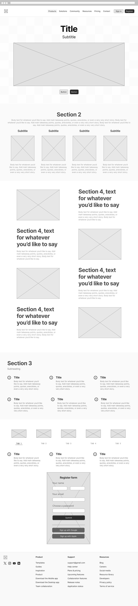
</p>

<p align="center">
  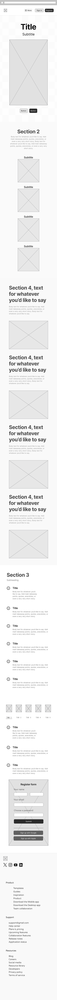
</p>

---

### 4.3.2. Landing Page Mock-up.

Los mockups de la Landing Page representan la versión visual final del diseño, incorporando colores, tipografías y estilos definidos en el sistema de diseño.
En esta etapa se aplicaron los lineamientos de branding del proyecto, incluyendo el uso de colores principales, jerarquía tipográfica y elementos visuales que refuerzan la identidad del producto.
Además, se mantuvo consistencia entre la versión desktop y mobile, asegurando una experiencia uniforme para el usuario en cualquier dispositivo.

<p align="center">
  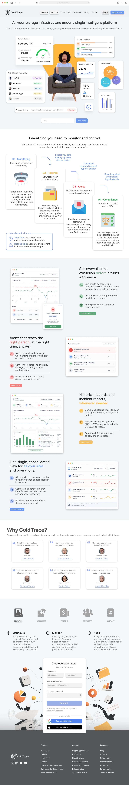
</p>

<p align="center">
  
</p>

---

## 4.4. Web Applications UX/UI Design.

### 4.4.1. Web Applications Wireframes.

Los wireframes de la aplicación web fueron diseñados para definir la estructura funcional de las principales pantallas del sistema.
En esta etapa se identificaron los elementos clave de interacción, como paneles de control, visualización de datos, navegación entre secciones y componentes necesarios para la gestión del sistema.
Estos wireframes permiten validar la distribución de información antes de la implementación visual, asegurando que las funcionalidades respondan a las necesidades del usuario.

<p align="center">
  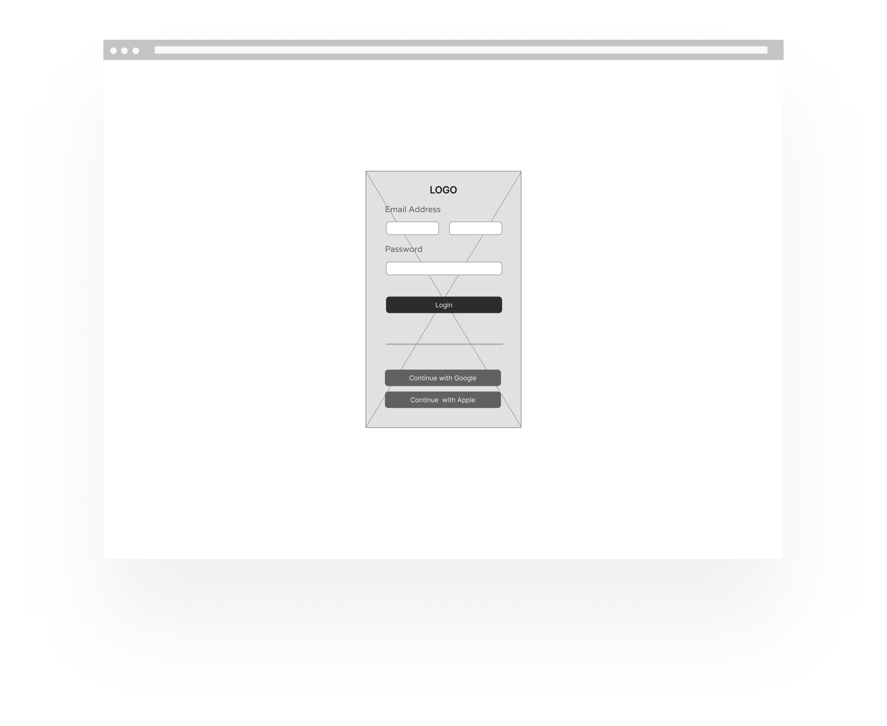
</p>

<p align="center">
  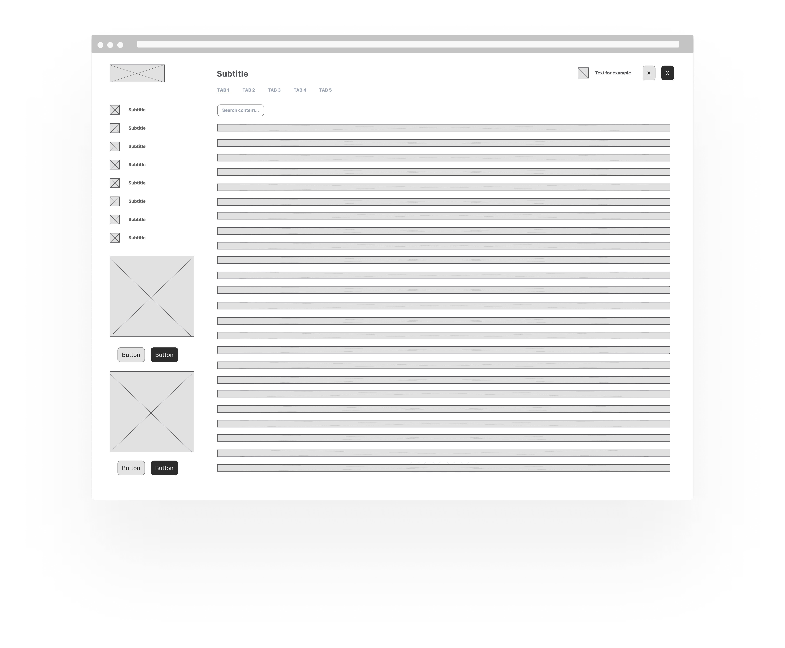
</p>

<p align="center">
  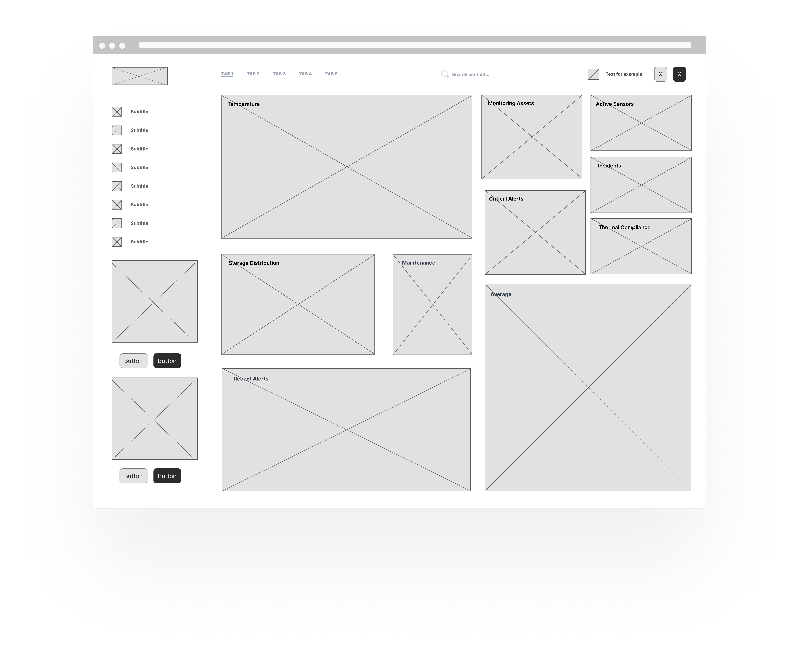
</p>

---

### 4.4.2. Web Applications Wireflow Diagrams.

Los wireflow diagrams representan el flujo de interacción del usuario dentro de la aplicación, mostrando la navegación entre pantallas y las acciones que el usuario puede realizar en cada etapa.
Estos diagramas permiten entender el recorrido del usuario (user flow), facilitando la identificación de puntos clave de interacción y mejorando la experiencia general del sistema.

<p align="center">
  
</p>

---

### 4.4.3. Web Applications Mock-ups.

Los mockups de la aplicación web muestran la representación visual final de las interfaces del sistema, incorporando estilos, colores y componentes definidos en el diseño.
En esta etapa se buscó mantener consistencia visual con la Landing Page, asegurando una identidad unificada del producto.
Asimismo, se priorizó la claridad en la presentación de información y la facilidad de uso, permitiendo que el usuario interactúe de manera intuitiva con las funcionalidades del sistema.

<p align="center">
  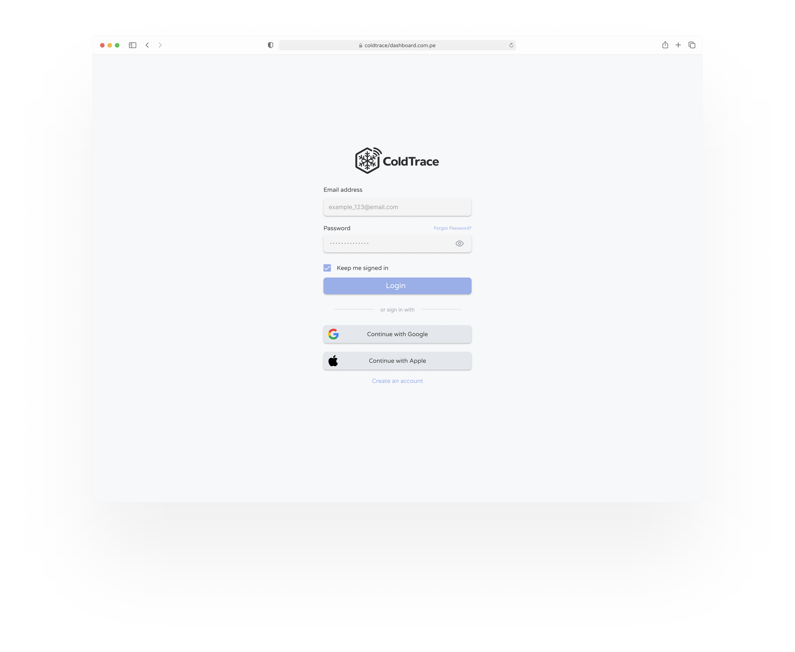
</p>

<p align="center">
  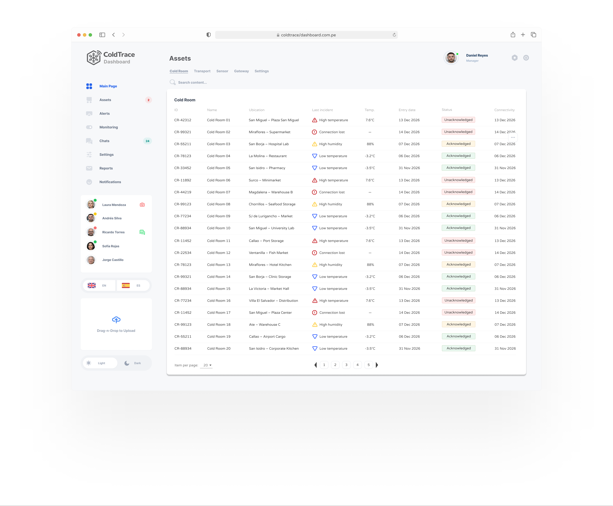
</p>

<p align="center">
  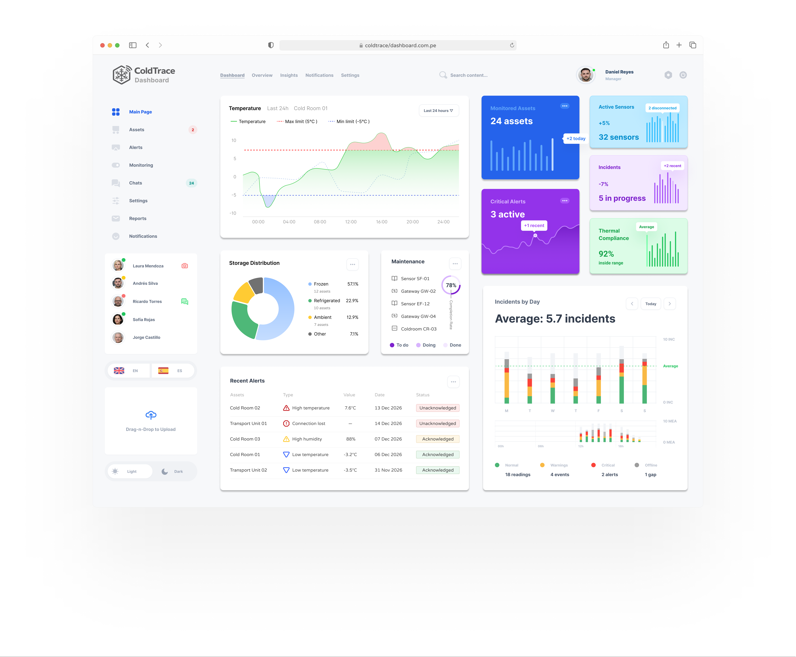
</p>
---

### 4.4.4. Web Applications User Flow Diagrams.

Los User Flow Diagrams representan el recorrido que sigue el usuario dentro de la aplicación para cumplir objetivos específicos, considerando las distintas interacciones y decisiones que se presentan en cada etapa.
Estos diagramas integran las vistas principales del sistema con los flujos de navegación, permitiendo visualizar tanto la ruta esperada (happy path) como posibles escenarios alternativos (unhappy paths). De esta manera, se facilita la comprensión del comportamiento del usuario y se asegura coherencia con los wireflows y mockups previamente definidos.

### User Flow 1 : Detectar alertas de temperatura a tiempo para evitar pérdidas.

<p align="center">
  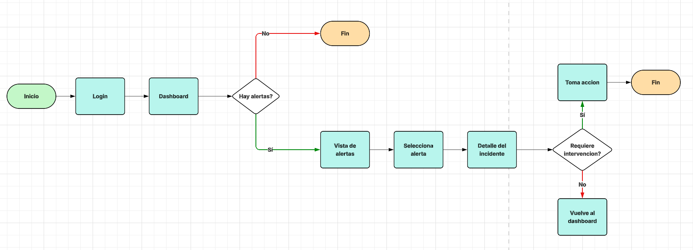
</p>

### User Flow 2 : Obtener reportes para supervisión y control.

<p align="center">
  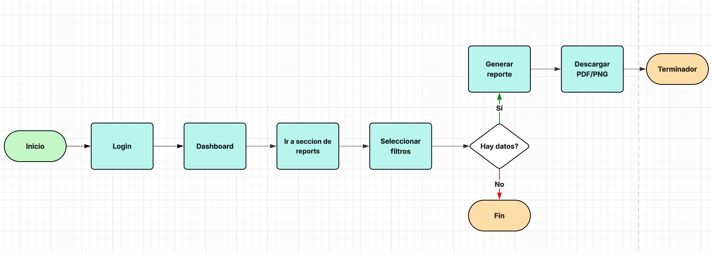
</p>

### User Flow 3 : Monitorear el estado general de los equipos en tiempo real.

<p align="center">
  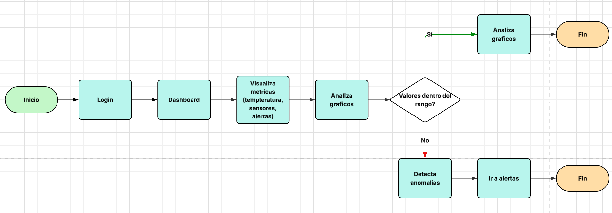
</p>

---

## 4.5. Web Applications Prototyping.

En esta sección se presenta el prototipo navegable de la aplicación web de ColdTrace, el cual permite simular la interacción del usuario con las principales vistas del sistema y validar la navegación definida previamente en los wireflows y user flows.

El prototipo integra las pantallas clave del producto, como monitoreo, alertas, reportes y gestión general de la operación, manteniendo coherencia con los lineamientos visuales y funcionales definidos en las etapas anteriores del diseño.

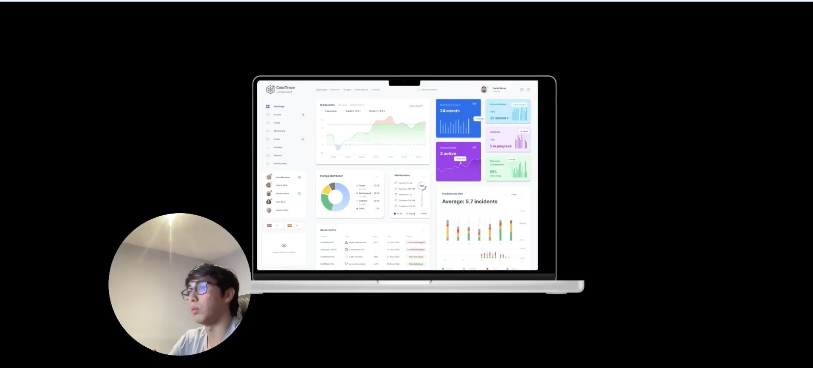

[Ver video demostrativo del prototipo de navegación – ColdTrace](https://upcedupe-my.sharepoint.com/:v:/g/personal/u202410093_upc_edu_pe/IQDF6wu_w86bRIH68kr6ehziAe9K_FC1ARRsa-i6G07RpXk?nav=eyJyZWZlcnJhbEluZm8iOnsicmVmZXJyYWxBcHAiOiJTdHJlYW1XZWJBcHAiLCJyZWZlcnJhbFZpZXciOiJTaGFyZURpYWxvZy1MaW5rIiwicmVmZXJyYWxBcHBQbGF0Zm9ybSI6IldlYiIsInJlZmVycmFsTW9kZSI6InZpZXcifX0%3D&e=FXKoP5)

---
## 4.6. Domain-Driven Software Architecture.

### 4.6.1. Design-Level Event Storming.


## 1. Bounded Context: Autenticación
### Explicación
Este contexto gestiona el acceso de los usuarios al sistema mediante el inicio y cierre de sesión. Se encarga de validar credenciales, controlar sesiones activas y generar eventos como usuario autenticado o sesión iniciada/cerrada.

### Justificación
Se separa este contexto porque la seguridad es un aspecto crítico y transversal en cualquier sistema. Al aislar la autenticación:
- Se reduce el riesgo de accesos no autorizados.
- Se facilita la implementación de mecanismos avanzados como OAuth, JWT o autenticación multifactor.
- Se evita mezclar la lógica de seguridad con la lógica de negocio principal.
- Permite escalar y mantener este módulo de forma independiente.


## 2. Bounded Context: Gestión de Sensores

### Explicación
Este contexto administra todo el ciclo de vida de los sensores: registro, configuración, activación y vinculación con activos. Además, define parámetros clave como rangos de temperatura, humedad y frecuencia de medición.

### Justificación
Se separa porque la configuración de sensores define el comportamiento del sistema. Al aislarlo:
- Se centraliza la lógica de configuración.
- Se reducen errores por parámetros mal definidos.
- Se permite modificar reglas sin afectar otros contextos.
- Facilita la reutilización en otros sistemas IoT.


## 3. Bounded Context: Monitoreo

### Explicación
Es el núcleo del sistema. Aquí se reciben las mediciones del sensor, se registran, validan y se verifica si están dentro o fuera de los rangos definidos. Finalmente, las mediciones se almacenan.

### Justificación
Se separa porque es el proceso principal del negocio. Este contexto:
- Maneja alta carga de datos en tiempo real.
- Requiere eficiencia y baja latencia.
- Permite escalar de forma independiente (por ejemplo, usando streaming).
- Evita mezclar procesamiento de datos con visualización o alertas.


## 4. Bounded Context: Alertas

### Explicación
Se encarga de generar notificaciones cuando una medición está fuera de los rangos establecidos. También gestiona la visualización de alertas en el sistema.

### Justificación
Se desacopla para permitir una respuesta rápida ante eventos críticos:
- Permite implementar distintos canales de notificación (email, SMS, etc.).
- Evita sobrecargar el contexto de monitoreo.
- Facilita la extensión del sistema sin afectar la lógica principal.


## 5. Bounded Context: Reportes

### Explicación
Gestiona la generación, visualización y exportación de reportes. Incluye dashboards, historial de mediciones y visualización en tiempo real.

### Justificación
Se separa porque el análisis de datos tiene necesidades distintas al procesamiento:
- Requiere consultas complejas y agregaciones.
- Puede optimizarse con técnicas como caching o data warehousing.
- Evita afectar el rendimiento del monitoreo en tiempo real.
- Permite escalar de forma independiente.


## 6. Bounded Context: Auditoría

### Explicación
Este contexto controla el cumplimiento del sistema mediante auditorías. Permite iniciar auditorías, registrar resultados, validar cumplimiento y generar evidencias exportables.

### Justificación
Se aísla porque la auditoría responde a necesidades de control y cumplimiento:
- Garantiza trazabilidad de las acciones del sistema.
- Permite cumplir con normativas o estándares.
- Facilita la generación de evidencia sin afectar otros procesos.
- Puede evolucionar hacia automatización completa sin impactar otros contextos.


## Problemas Identificados y Relación con Contextos

- Datos inconsistentes del sensor → Monitoreo  
- Validación insuficiente → Monitoreo  
- Configuración manual del sensor → Gestión de Sensores  
- Parámetros mal definidos → Gestión de Sensores  
- Generación de reportes lenta → Reportes  
- Proceso de auditoría manual → Auditoría  

### Justificación General
Estos problemas evidencian la necesidad de separar responsabilidades. La aplicación de Bounded Contexts permite:
- Reducir el acoplamiento entre módulos.
- Mejorar la mantenibilidad del sistema.
- Escalar componentes de forma independiente.
- Aplicar principios de Domain-Driven Design de manera efectiva.


### 4.6.2. Software Architecture Context Diagram.

El diagrama de contexto de ColdTrace muestra, de forma general, a los actores que interactúan con la plataforma y a los sistemas externos de los que depende. En esta vista se ubica a ColdTrace como sistema central y se identifican sus principales entradas y salidas.

<p align="center">
  
</p>

<p align="center">
  <em>Figura 4.6.2. Context Diagram del sistema ColdTrace siguiendo el modelo C4.</em>
</p>

> El código fuente del diagrama en PlantUML se encuentra en [`assets/chapter-04/contextdiagram/contextdiagram.puml`](report/assets/chapter-04/contextdiagram/contextdiagram.puml). Para regenerar la imagen, se puede renderizar localmente con `plantuml contextdiagram.puml` o pegando el contenido en [PlantText](https://www.planttext.com/).

### 4.6.3. Software Architecture Container Diagrams.

El diagrama de contenedores muestra cómo se divide ColdTrace en sus principales aplicaciones, servicios y bases de datos. En esta vista se identifican la landing page, la web application, el API Gateway, el IoT Gateway, los servicios por bounded context y la capa de datos asociada a cada uno.

<p align="center">
  
</p>

<p align="center">
  <em>Figura 4.6.3. Container Diagram del sistema ColdTrace.</em>
</p>

> El código fuente del diagrama en PlantUML se encuentra en [`assets/chapter-04/containerdiagram/containerdiagram.puml`](report/assets/chapter-04/containerdiagram/containerdiagram.puml). Para regenerar la imagen, se puede renderizar localmente con `plantuml containerdiagram.puml` o pegando el contenido en [PlantText](https://www.planttext.com/).

### 4.6.4. Software Architecture Components Diagrams.

En esta sección se presenta la vista de componentes de ColdTrace por bounded context. Cada diagrama muestra los componentes internos principales y sus relaciones dentro del contexto correspondiente.

- **Diagrama de componentes - Autenticación:** Muestra los componentes encargados del registro, inicio de sesión, recuperación de contraseña y gestión de roles y permisos.

<p align="center">
  
  <br>
  <em>Figura 4.6.4.1. Component Diagram del BC Autenticación.</em>
</p>

> El código fuente en PlantUML se encuentra en [`assets/chapter-04/diagramcomponents/component-autenticacion.puml`](report/assets/chapter-04/diagramcomponents/component-autenticacion.puml).

- **Diagrama de componentes - Gestión de Sensores:** Muestra los componentes encargados del registro y configuración de equipos monitoreados, sensores, gateways y rangos operativos.

<p align="center">
  
  <br>
  <em>Figura 4.6.4.2. Component Diagram del BC Gestión de Sensores.</em>
</p>

> El código fuente en PlantUML se encuentra en [`assets/chapter-04/diagramcomponents/component-sensores.puml`](report/assets/chapter-04/diagramcomponents/component-sensores.puml).

- **Diagrama de componentes - Monitoreo:** Muestra los componentes que reciben, validan y consultan las lecturas de temperatura y humedad.

<p align="center">
  
  <br>
  <em>Figura 4.6.4.3. Component Diagram del BC Monitoreo.</em>
</p>

> El código fuente en PlantUML se encuentra en [`assets/chapter-04/diagramcomponents/component-monitoreo.puml`](report/assets/chapter-04/diagramcomponents/component-monitoreo.puml).

- **Diagrama de componentes - Alertas:** Muestra los componentes encargados de generar, enrutar, escalar y cerrar alertas e incidencias.

<p align="center">
  
  <br>
  <em>Figura 4.6.4.4. Component Diagram del BC Alertas.</em>
</p>

> El código fuente en PlantUML se encuentra en [`assets/chapter-04/diagramcomponents/component-alertas.puml`](report/assets/chapter-04/diagramcomponents/component-alertas.puml).

- **Diagrama de componentes - Reportes:** Muestra los componentes responsables de generar dashboards, históricos, bitácoras y reportes exportables.

<p align="center">
  
  <br>
  <em>Figura 4.6.4.5. Component Diagram del BC Reportes.</em>
</p>

> El código fuente en PlantUML se encuentra en [`assets/chapter-04/diagramcomponents/component-reportes.puml`](report/assets/chapter-04/diagramcomponents/component-reportes.puml).

- **Diagrama de componentes - Auditoría:** Muestra los componentes responsables de iniciar auditorías, validar cumplimiento y gestionar evidencias.

<p align="center">
  
  <br>
  <em>Figura 4.6.4.6. Component Diagram del BC Auditoría.</em>
</p>

> El código fuente en PlantUML se encuentra en [`assets/chapter-04/diagramcomponents/component-auditoria.puml`](report/assets/chapter-04/diagramcomponents/component-auditoria.puml).

---

## 4.7. Software Object-Oriented Design.

### 4.7.1. Class Diagrams.

La documentación del diagrama de clases de ColdTrace se presenta en **tres etapas**. Cada una muestra el dominio con un nivel de detalle distinto.

#### Etapa 1: Diagrama de clases con enfoque DDD

En esta primera etapa se modela el dominio de ColdTrace con enfoque **DDD** y tipos Java. Aquí se identifican las entidades, clases abstractas y enumeraciones principales del sistema.

Se aplican dos patrones de diseño clásicos, visibles mediante la interfaz correspondiente en el diagrama:

- **Builder** — la interfaz `Constructor`, la clase `ActivoBuilder` y el director `ActivoDirector` encapsulan la creación de activos refrigerados compuestos (cámara frigorífica, almacén, unidad de transporte) con sus sensores y ubicación. El director mantiene una referencia al builder y expone métodos de alto nivel (`construirCamaraFrigorifica`, `construirAlmacen`, `construirUnidadTransporte`).
- **Canales de notificación (interface + implementaciones)** — la interfaz `CanalNotificacion` con las clases `CanalEmail`, `CanalPush` y `CanalWhatsApp` permite entregar alertas por el canal adecuado según la `PreferenciaNotificacion` del usuario y la severidad de la alerta.

Se incluye una única clase de repositorio (`UsuarioRepository`) siguiendo el mismo criterio que el proyecto de referencia, manteniendo el diagrama enfocado en el dominio y dejando la infraestructura de persistencia para las etapas siguientes.

Principales clases por bounded context:

- **BC Autenticación:** `Usuario`, `Sesion`, `Rol`, `Permiso`, `Organizacion`, `Suscripcion` y `PreferenciaNotificacion`. Enums: `EstadoUsuario`, `EstadoSuscripcion` [US007-US011, EP002].
- **BC Gestión de Sensores:** `Activo` (con el value object `Ubicacion` para activos móviles con latitud/longitud), `Sensor` y `Gateway` como clases independientes (un gateway sirve a múltiples sensores), `RangoTemperatura` y `RangoHumedad` separados por tipo. Enums: `TipoActivo`, `EstadoActivo`, `TipoSensor`, `EstadoSensor`, `EstadoGateway` [EP003, EP007].
- **BC Monitoreo:** `Medicion` como clase abstracta especializada en `LecturaTemperatura` y `LecturaHumedad`. Enum: `EstadoMedicion` [EP004].
- **BC Alertas:** `ReglaAlerta` (define umbral, duración y severidad; evalúa mediciones y genera alertas), `Alerta`, `Incidencia` y `Notificacion`. Enums: `TipoAlerta`, `Severidad`, `EstadoAlerta` [EP005].
- **BC Reportes:** `Reporte` como clase abstracta especializada en `ReporteHistorico`, `ReporteBitacora` y `ReporteCumplimiento`; `Dashboard` con `Widget`. Enums: `TipoReporte`, `FormatoExportacion` [EP006].
- **BC Auditoría:** `Auditoria`, `Evidencia` y `CriterioCumplimiento`. Enums: `TipoAuditoria`, `EstadoAuditoria`, `EstadoCumplimiento` para el cumplimiento normativo DIGESA / MINSA.

Aunque cada clase pertenece a un bounded context específico, el diagrama preserva las **relaciones entre clases de distintos bounded contexts** (siguiendo el estilo aplicado en el ejemplo de referencia). Las referencias cross-BC se mantienen a nivel de identificador `UUID` en los atributos, respetando la frontera de cada contexto, y se muestran como líneas de asociación en el diagrama: `Organizacion` posee `Activo`s y `Gateway`s; `Sensor` genera `Medicion`es; `ReglaAlerta` evalúa una `Medicion` y genera la `Alerta` correspondiente; `Alerta` referencia a `Activo`, `Sensor` y `Medicion`; `Incidencia` y `Alerta` referencian al `Usuario` responsable; `ReporteHistorico` consolida `Medicion`es y `ReporteBitacora` consolida `Incidencia`s; `Evidencia` respalda un `Reporte` y `Auditoria` los usa como evidencia de cumplimiento; `Auditoria`, `Dashboard` y `Reporte` referencian al `Usuario` y a la `Organizacion` correspondiente.

<p align="center">
  
  <br>
  <em>Figura 4.7.1.1. Etapa 1 - Diagrama de Clases con enfoque DDD.</em>
</p>

> El código fuente en PlantUML se encuentra en [`assets/chapter-04/classdiagram/classdiagram-etapa1-ddd.puml`](report/assets/chapter-04/classdiagram/classdiagram-etapa1-ddd.puml). Para regenerar la imagen se puede renderizar localmente con `plantuml classdiagram-etapa1-ddd.puml` o pegando el contenido en [PlantText](https://www.planttext.com/).

#### Etapa 2: Agrupar las clases en Bounded Context

En esta segunda etapa las clases se agrupan según el bounded context al que pertenecen. Esto permite visualizar mejor las fronteras del dominio.

Agrupamiento aplicado en el diagrama:

- **BC Autenticación** (azul claro): `Usuario`, `Sesion`, `Rol`, `Permiso`, `Organizacion`, `Suscripcion`, `PreferenciaNotificacion`, `UsuarioRepository`, junto con los enums `EstadoUsuario` y `EstadoSuscripcion`.
- **BC Gestión de Sensores** (rosado): `Activo`, `Ubicacion`, `Sensor`, `Gateway`, `RangoTemperatura`, `RangoHumedad`, la interfaz `Constructor` y las clases `ActivoBuilder` / `ActivoDirector`, junto con los enums `TipoActivo`, `EstadoActivo`, `TipoSensor`, `EstadoSensor` y `EstadoGateway`.
- **BC Monitoreo** (verde): la clase abstracta `Medicion`, las especializaciones `LecturaTemperatura` y `LecturaHumedad`, y el enum `EstadoMedicion`.
- **BC Alertas** (amarillo): `ReglaAlerta`, `Alerta`, `Incidencia`, `Notificacion`, la interfaz `CanalNotificacion` con sus implementaciones `CanalEmail`, `CanalPush` y `CanalWhatsApp`, y los enums `TipoAlerta`, `Severidad` y `EstadoAlerta`.
- **BC Reportes** (morado): la clase abstracta `Reporte`, las especializaciones `ReporteHistorico`, `ReporteBitacora` y `ReporteCumplimiento`, junto con `Dashboard`, `Widget` y los enums `TipoReporte` y `FormatoExportacion`.
- **BC Auditoría** (naranja): `Auditoria`, `Evidencia`, `CriterioCumplimiento` y los enums `TipoAuditoria`, `EstadoAuditoria` y `EstadoCumplimiento`.

Las relaciones **internas a cada BC** (composiciones, agregaciones, herencias y realizaciones) quedan contenidas dentro del paquete correspondiente, mientras que las **relaciones entre bounded contexts** (por ejemplo, `Organizacion` → `Activo`, `Sensor` → `Medicion`, `ReglaAlerta` → `Medicion`, `Alerta` → `Activo`/`Sensor`, `ReporteHistorico` → `Medicion`, `Evidencia` → `Reporte`, `Auditoria` → `Usuario`/`Organizacion`) aparecen cruzando las fronteras de los paquetes, dejando explícitos los puntos de integración entre contextos y los lugares donde se sostiene la coherencia del dominio.

<p align="center">
  
  <br>
  <em>Figura 4.7.1.2. Etapa 2 - Agrupar las clases en Bounded Context.</em>
</p>

> El código fuente en PlantUML se encuentra en [`assets/chapter-04/classdiagram/classdiagram-etapa2-bc.puml`](report/assets/chapter-04/classdiagram/classdiagram-etapa2-bc.puml). Para regenerar la imagen se puede renderizar localmente con `plantuml classdiagram-etapa2-bc.puml` o pegando el contenido en [PlantText](https://www.planttext.com/).

#### Etapa 3: Identificación de Value Object, Entity y Aggregate

En esta tercera etapa las clases se clasifican como **Aggregate**, **Entity** y **Value Object**. Cada bounded context se presenta por separado para facilitar su lectura.

Con esta clasificación se cumple una regla fundamental de DDD: **fuera del aggregate sólo se navega a su raíz mediante un identificador tipado (VO)**, nunca por referencia directa a entidades internas del agregado. Así, por ejemplo, `Alerta` no guarda un puntero directo a `Sensor` sino un `SensorId`, y `Auditoria` se vincula con `Reporte` a través de un `ReporteId` sostenido por cada `Evidencia`. Esta disciplina preserva la consistencia transaccional dentro de cada contexto y deja explícitas las fronteras que cruzan los microservicios definidos en la sección 4.6.

**BC Autenticación.** Aggregates → `Usuario` (gestiona sus `Sesion`es, `Rol`es y su `PreferenciaNotificacion`) y `Organizacion` (gestiona su `Suscripcion` y los `Usuario`s que la integran). Entities → `Sesion`, `Rol` y `Suscripcion`. Value Objects → `Permiso` (tupla nombre/recurso/acción inmutable) y `PreferenciaNotificacion` (conjunto de canales, horarios y severidad mínima sin identidad propia). Este BC no necesita VO de ID cross-BC porque sus aggregates (`Usuario` y `Organizacion`) son referenciados desde otros contextos, no consumidores de referencias externas.

<p align="center">
  
  <br>
  <em>Figura 4.7.1.3.1. Etapa 3 - BC Autenticación.</em>
</p>

> Código PlantUML: [`assets/chapter-04/classdiagram/classdiagram-etapa3-bc-autenticacion.puml`](report/assets/chapter-04/classdiagram/classdiagram-etapa3-bc-autenticacion.puml).

**BC Gestión de Sensores.** Aggregates → `Activo` (raíz que contiene su `Ubicacion` y sus `Sensor`es asignados) y `Gateway` (raíz que agrupa los `Sensor`es conectados por red). Entities → `Sensor`, `ActivoBuilder` y `ActivoDirector`. Value Objects → `Ubicacion` (dirección, coordenadas y marcador de movilidad, inmutable), `RangoTemperatura` y `RangoHumedad` (pares min/max sin identidad propia), más el VO de ID `OrganizacionId` que referencia al aggregate `Organizacion` del BC Autenticación.

<p align="center">
  
  <br>
  <em>Figura 4.7.1.3.2. Etapa 3 - BC Gestión de Sensores.</em>
</p>

> Código PlantUML: [`assets/chapter-04/classdiagram/classdiagram-etapa3-bc-gestion-sensores.puml`](report/assets/chapter-04/classdiagram/classdiagram-etapa3-bc-gestion-sensores.puml).

**BC Monitoreo.** Aggregate → `Medicion` (abstracto, raíz de las lecturas generadas por un `Sensor`). Entities → `LecturaTemperatura` y `LecturaHumedad` como especializaciones concretas del agregado. Value Object → `SensorId` para referenciar por ID al aggregate `Sensor` del BC Gestión de Sensores, sin acoplamiento directo a su estructura interna.

<p align="center">
  
  <br>
  <em>Figura 4.7.1.3.3. Etapa 3 - BC Monitoreo.</em>
</p>

> Código PlantUML: [`assets/chapter-04/classdiagram/classdiagram-etapa3-bc-monitoreo.puml`](report/assets/chapter-04/classdiagram/classdiagram-etapa3-bc-monitoreo.puml).

**BC Alertas.** Aggregates → `Alerta` (gestiona sus `Incidencia`s y `Notificacion`es como parte del mismo agregado transaccional) y `ReglaAlerta` (evalúa las `Medicion`es y genera `Alerta`s). Entities → `Incidencia`, `Notificacion`, `CanalEmail`, `CanalPush` y `CanalWhatsApp`. Value Objects → `SensorId`, `ActivoId`, `MedicionId` y `UsuarioId` para todas las referencias cross-BC, más la interfaz `CanalNotificacion` que abstrae el canal de entrega.

<p align="center">
  
  <br>
  <em>Figura 4.7.1.3.4. Etapa 3 - BC Alertas.</em>
</p>

> Código PlantUML: [`assets/chapter-04/classdiagram/classdiagram-etapa3-bc-alertas.puml`](report/assets/chapter-04/classdiagram/classdiagram-etapa3-bc-alertas.puml).

**BC Reportes.** Aggregates → `Reporte` (abstracto, raíz de los reportes generados en sus tres variantes concretas) y `Dashboard` (raíz que agrupa sus `Widget`s configurables). Entities → `ReporteHistorico`, `ReporteBitacora`, `ReporteCumplimiento` y `Widget`. Value Objects → `UsuarioId`, `OrganizacionId` y `MedicionId` para vincular reportes y dashboards a usuarios, organizaciones y mediciones por ID.

<p align="center">
  
  <br>
  <em>Figura 4.7.1.3.5. Etapa 3 - BC Reportes.</em>
</p>

> Código PlantUML: [`assets/chapter-04/classdiagram/classdiagram-etapa3-bc-reportes.puml`](report/assets/chapter-04/classdiagram/classdiagram-etapa3-bc-reportes.puml).

**BC Auditoría.** Aggregate → `Auditoria` (raíz que contiene sus `Evidencia`s recopiladas y sus `CriterioCumplimiento`s evaluados). Entities → `Evidencia` y `CriterioCumplimiento`. Value Objects → `UsuarioId`, `OrganizacionId` y `ReporteId` para vincular evidencias a reportes y auditorías a usuarios y organizaciones sin acoplamiento directo a los otros contextos.

<p align="center">
  
  <br>
  <em>Figura 4.7.1.3.6. Etapa 3 - BC Auditoría.</em>
</p>

> Código PlantUML: [`assets/chapter-04/classdiagram/classdiagram-etapa3-bc-auditoria.puml`](report/assets/chapter-04/classdiagram/classdiagram-etapa3-bc-auditoria.puml).

---

## 4.8. Database Design.

### 4.8.1. Database Diagrams.

Para el planteamiento de la base de datos de ColdTrace se identificaron primero las tablas principales del sistema y luego se agruparon según los bounded contexts definidos previamente. Después se establecieron las relaciones entre ellas y se añadieron tablas intermedias en los casos necesarios para manejar correctamente las relaciones y mantener el modelo en **Tercera Forma Normal (3FN)**. Todo esto da como resultado el siguiente diagrama.

<p align="center">
  
  <br>
  <em>Figura 4.8.1.1. Diagrama Entidad-Relación de ColdTrace normalizado a 3FN.</em>
</p>

> El código fuente en PlantUML se encuentra en [`assets/chapter-04/databasediagram/databasediagram.puml`](report/assets/chapter-04/databasediagram/databasediagram.puml). Para regenerar la imagen se puede renderizar localmente con `plantuml databasediagram.puml` o pegando el contenido en [PlantText](https://www.planttext.com/).


# Capítulo V: Product Implementation, Validation & Deployment

## 5.1. Software Configuration Management

### 5.1.1. Software Development Environment Configuration

En esta sección se describen las herramientas de software utilizadas por el equipo para el desarrollo colaborativo del proyecto. Estas plataformas permiten organizar el trabajo, diseñar la experiencia de usuario, modelar procesos, gestionar el código fuente y documentar el avance del producto durante su ciclo de vida. La selección de estas herramientas responde a la necesidad de mantener un entorno de trabajo colaborativo, accesible y alineado con las prácticas del curso.

### Github

Plataforma utilizada para el guardar versiones del proyecto.

[GitHub](https://github.com/)


### Uxpressia

Herramiento usada para la elabnoracion de user personas y impact mapping.

[UXPressia](https://uxpressia.com/)


### Miro

Plataforma usada para el eventstorming.

[Miro](https://miro.com/)


### Figma

La herramienta usada para desarrollo conjunto de wireframes y mockups.

[Figma](https://www.figma.com/)


### 5.1.2. Source Code Management

La gestión del código fuente del proyecto se realizó mediante la plataforma GitHub, la cual permitió organizar, controlar y dar seguimiento a los cambios realizados durante el desarrollo del informe.

Los repositorios usados fueron:

- Repositorio del proyecto: https://github.com/ICEQ2026/informe-del-proyecto
- Repositorio de la landing page: https://github.com/ICEQ2026/landingpage-coldtrace

Este repositorio contiene la estructura completa del informe, organizada por capítulos, lo que permite una gestión modular y colaborativa del contenido.

### Workflow de Control de Versiones

Para la gestión del desarrollo se utilizó un flujo de trabajo basado en ramas, donde cada integrante del equipo trabajó de manera independiente sobre una rama específica antes de integrar sus cambios a la rama principal.

Las ramas identificadas en el repositorio son:

- **main**: rama principal que contiene la versión estable del proyecto.
- **feature/**: ramas utilizadas para el desarrollo de secciones específicas del informe.

<p align="center">
  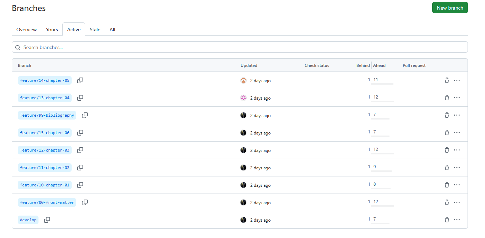
</p>

<p align="center">
  Ramas del repositorio del proyecto, evidenciando el uso de ramas feature para el desarrollo independiente de cada sección.
</p>

### Convenciones de Ramas

Se utilizó una convención de nombres basada en el contenido desarrollado, lo cual se evidencia en las siguientes ramas:

- feature/14-chapter-05  
- feature/13-chapter-04  
- feature/12-chapter-03  
- feature/15-chapter-06  
- feature/99-bibliography  

Cada rama representa un capítulo o sección del informe, permitiendo que los integrantes trabajen de forma paralela sin interferir en el trabajo de otros.

Este enfoque facilita la organización del proyecto y permite una integración más controlada de los cambios.

### Conventional Commits

Para estandarizar los mensajes de commits, se utilizó la convención de Conventional Commits, permitiendo clasificar los cambios realizados y mejorar la trazabilidad del repositorio.

<p align="center">
  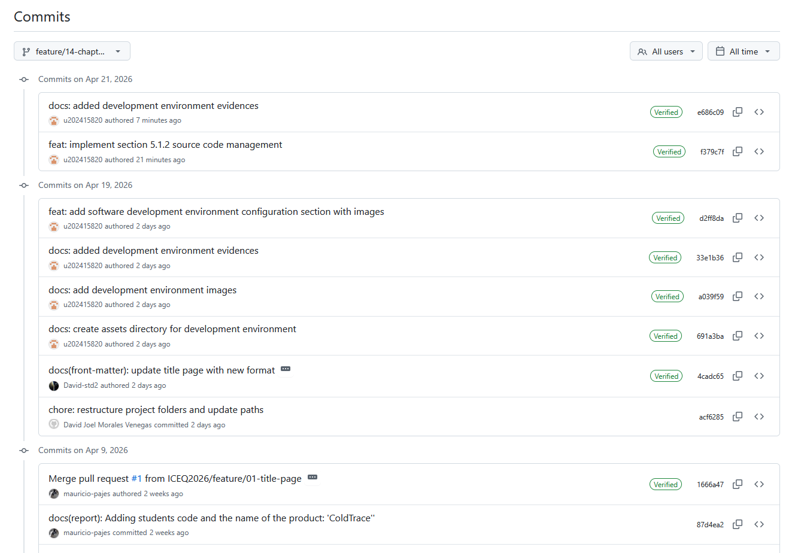
</p>

<p align="center">
  Comitts realizdos evidenciando el uso de conventional commits para clasificar los tipos de cambios.
</p>

Los tipos de commits utilizados incluyen:

- **feat**: incorporación de nuevo contenido  
- **docs**: modificaciones en la documentación  
- **fix**: corrección de errores  
- **chore**: tareas de mantenimiento  

El uso de estas convenciones facilita la comprensión del historial de cambios y mejora la colaboración entre los integrantes del equipo.

La evidencia mostrada refleja el uso de un flujo de trabajo basado en ramas feature, permitiendo una correcta organización del desarrollo y facilitando la integración de los aportes de cada integrante.

### 5.1.3. Source Code Style Guide & Conventions

Con el objetivo de garantizar la consistencia, legibilidad y mantenibilidad del proyecto, el equipo definió una guía de estilo basada en la estructura real de la Landing Page y en buenas prácticas de desarrollo web. Estas convenciones permiten que todos los integrantes trabajen de manera ordenada, facilitan la colaboración en el repositorio y mejoran la escalabilidad del producto.

Siguiendo lo solicitado por el curso, se adoptó el uso de nomenclatura en inglés para los elementos del código fuente. Además, se establecieron criterios comunes para la organización de archivos, definición de estilos, escritura de scripts y manejo de contenidos multilenguaje.

#### Naming conventions

Se utilizó nomenclatura en inglés para todos los elementos del código. Los archivos fueron nombrados según su funcionalidad, lo que facilita su comprensión y mantenimiento.

Ejemplos del proyecto:

- `navigation.js` → manejo de navegación  
- `scroll-reveal.js` → animaciones  
- `variables.css` → variables de diseño  
- `en-US.json` → traducciones en inglés  

Estas convenciones permiten identificar rápidamente el propósito de cada archivo.

#### CSS Style Guide

Para mantener la consistencia visual, se definieron variables globales en CSS que permiten reutilizar colores, tipografías y espaciados en toda la aplicación:

```css
:root {
  --color-primary: #1b59f8;
  --color-secondary-purple: #b899eb;

  --font-family-base: "Inter", "Helvetica Neue", Arial, sans-serif;

  --spacing-md: 16px;
  --spacing-xl: 48px;

  --radius-md: 8px;
}
```

El uso de variables CSS permite centralizar el diseño visual, evitando duplicidad de valores y facilitando futuras modificaciones.

#### JavaScript Conventions

Los archivos JavaScript fueron organizados por funcionalidad, promoviendo la modularidad del código. Se utilizaron funciones con nombres descriptivos en inglés y estructuras claras.

Ejemplo del proyecto:

```js
const toggleMobileMenu = () => {
  if (!moreButton || !mobileMenu) return;

  if (mobileMenu.classList.contains('is-open')) {
    closeMobileMenu();
    return;
  }

  openMobileMenu();
};
```

Este enfoque mejora la legibilidad del código y facilita su mantenimiento.

#### Internacionalización (i18n)

El proyecto incluye soporte para múltiples idiomas mediante archivos JSON ubicados en `assets/locales/`. Cada archivo contiene las traducciones utilizadas en la interfaz.

Ejemplo:

```json
{
  "hero": {
    "title": "All your storage infrastructure under a single intelligent platform",
    "ctaDemo": "Try a demo"
  }
}
```

La implementación de internacionalización permite que la aplicación sea escalable a diferentes mercados y mejora la experiencia del usuario.

### 5.1.4. Software Deployment Configuration

En esta sección se describe la configuración del despliegue de la solución, incluyendo los pasos necesarios para que, a partir del repositorio de código fuente, se logre la publicación satisfactoria de la Landing Page del proyecto.

El despliegue de la solución se realizó utilizando GitHub, aprovechando sus funcionalidades para la publicación de sitios web estáticos.

### Configuración del despliegue de la Landing Page

1. Para el despliegue de la Landing Page se creo un repositorio en la organizacion alojada en GitHub, el cual contiene todos los archivos del proyecto desarrollados en HTML, CSS y JavaScript.

<p align="center">
  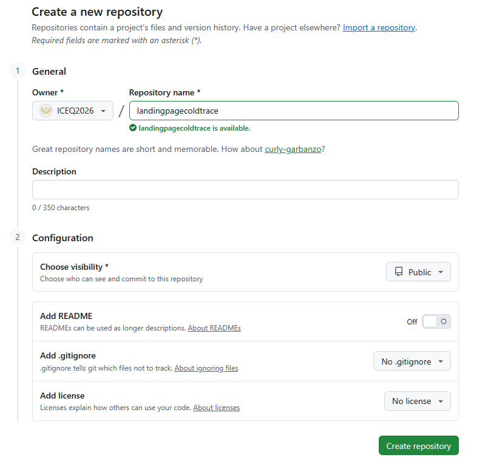
</p>

<p align="center">
  Repositorio de la Landing Page utilizado para el despliegue del proyecto.
</p>

2. Se hizo un push al repositorio al subir todo los archivos que contenian la landing page

<p align="center">
  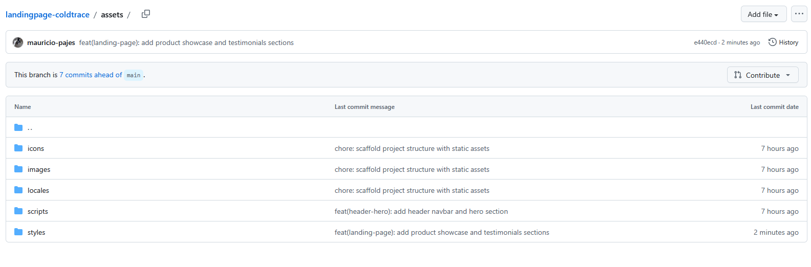
</p>

<p align="center">
  Uso de ramas para el desarrollo e integración de cambios antes del despliegue.
</p>   

3. Se creo branches para la actualización continua del repositorio, donde cada cambio realizado por el equipo eventualmente sera agregado en la rama principal.

<p align="center">
  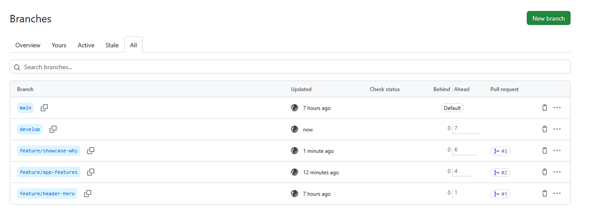
</p>

<p align="center">
  Uso de ramas para el desarrollo e integración de cambios antes del despliegue.
</p>

Una vez integrados los cambios en la rama principal (`main`), se configuró GitHub Pages para publicar automáticamente el contenido del repositorio, permitiendo que la Landing Page sea accesible mediante una URL pública.

Este proceso permite que cada actualización realizada mediante commits y pushes al repositorio se refleje automáticamente en la versión desplegada del sitio web.

### Validación del despliegue

Después del despliegue, se realizaron pruebas para asegurar el correcto funcionamiento de la Landing Page, verificando:

- la carga adecuada del sitio web;
- la navegación entre secciones;
- la correcta ejecución de scripts en JavaScript;
- la adaptación a distintos dispositivos (responsive design);
- la consistencia del contenido multilenguaje.

El uso de GitHub como plataforma de control de versiones y despliegue permite mantener una trazabilidad completa de los cambios, facilitando la colaboración del equipo y asegurando una publicación continua del proyecto.

## 5.2. Landing Page, Services & Applications Implementation

### 5.2.1. Sprint 1

#### 5.2.1.1. Sprint Planning 1

<table border="1" cellpadding="6" cellspacing="0">
  <tr>
    <th>Sprint #</th>
    <td>Sprint 1</td>
  </tr>

  <tr>
    <th colspan="2">Sprint Planning Background</th>
  </tr>

  <tr>
    <th>Date</th>
    <td>2026-04-20</td>
  </tr>

  <tr>
    <th>Time</th>
    <td>08:00 PM</td>
  </tr>

  <tr>
    <th>Location</th>
    <td>Reunión virtual vía Google Meet</td>
  </tr>

  <tr>
    <th>Prepared By</th>
    <td>Pajés León, Mauricio Luis</td>
  </tr>

  <tr>
    <th>Attendees (to planning meeting)</th>
    <td>Morales Venegas, David Joel / Espinoza Paredes, Frezzia / Cabrera Novoa, Leonardo Moisés / Videla Ventura, Jorge Joseph</td>
  </tr>

  <tr>
    <th>Sprint 1 Review Summary</th>
    <td>Como punto de partida, el equipo logró definir el alcance del producto ColdTrace, estructurar los capítulos iniciales del informe y desarrollar una primera versión funcional de la landing page con secciones clave y vistas básicas como dashboard, monitoreo y alertas. Esto permitió validar la dirección del proyecto y asegurar coherencia entre la propuesta de valor y la implementación inicial.
</td>
  </tr>

  <tr>
    <th>Sprint 1 Retrospective Summary</th>
    <td>Durante este primer sprint, el equipo identificó oportunidades de mejora relacionadas con la organización del tiempo y la coordinación entre integrantes. Si bien se lograron avances importantes en el desarrollo de la landing page, la distribución de tareas pudo ser más equilibrada. Como mejora, se propone fortalecer la comunicación, definir entregables más claros por integrante y establecer reuniones más frecuentes para hacer seguimiento al avance del proyecto.
</td>
  </tr>

  <tr>
    <th colspan="2">Sprint Goal & User Stories</th>
  </tr>

  <tr>
    <th>Sprint 1 Goal</th>
    <td>Desarrollar una primera versión funcional de la landing page de ColdTrace e implementar vistas básicas del sistema (dashboard, monitoreo y alertas) que permitan simular el flujo de monitoreo de la cadena de frío. El cumplimiento se medirá mediante la correcta visualización de la landing page y la navegación entre secciones funcionales.</td>
  </tr>

  <tr>
    <th>Sprint 1 Velocity</th>
    <td>20 Story Points</td>
  </tr>

  <tr>
    <th>Sum of Story Points</th>
    <td>20 Story Points</td>
  </tr>
</table>

#### 5.2.1.2. Aspect Leaders and Collaborators.

<table border="1" cellpadding="6" cellspacing="0">
  <tr>
    <th>Team Member (Last Name, First Name)</th>
    <th>GitHub Username</th>
    <th>Landing Page Development</th>
    <th>Dashboard & Monitoring Views</th>
    <th>Alerts Simulation</th>
    <th>Frontend Styling (CSS & UI)</th>
    <th>Repository & Version Control</th>
  </tr>

  <tr>
    <td>Cabrera Novoa, Leonardo Moisés</td>
    <td>[u202415820]</td>
    <td>C</td>
    <td>C</td>
    <td>C</td>
    <td>L</td>
    <td>L</td>
  </tr>

  <tr>
    <td>Espinoza Paredes, Frezzia</td>
    <td>[fflushh]</td>
    <td>C</td>
    <td>L</td>
    <td>L</td>
    <td>C</td>
    <td>C</td>
  </tr>

  <tr>
    <td>Morales Venegas, David Joel</td>
    <td>[David-std2]</td>
    <td>L</td>
    <td>C</td>
    <td>C</td>
    <td>C</td>
    <td>L</td>
  </tr>

  <tr>
    <td>Pajés León, Mauricio Luis</td>
    <td>[mauricio-pajes]</td>
    <td>L</td>
    <td>C</td>
    <td>L</td>
    <td>L</td>
    <td>C</td>
  </tr>

  <tr>
    <td>Videla Ventura, Jorge Joseph</td>
    <td>[JorgeVidVen]</td>
    <td>C</td>
    <td>L</td>
    <td>C</td>
    <td>C</td>
    <td>C</td>
  </tr>
</table>

### 5.2.1.3. Sprint Backlog 1.

<table border="1" cellpadding="6" cellspacing="0" style="border-collapse: collapse; text-align: center;">
  
  <tr>
    <th>Sprint #</th>
    <td colspan="7">Sprint 1</td>
  </tr>

  <tr>
    <th colspan="2">User Story</th>
    <th colspan="6">Work-Item / Task</th>
  </tr>

  <tr>
    <th>Id</th>
    <th>Title</th>
    <th>Id</th>
    <th>Title</th>
    <th>Description</th>
    <th>Estimation (Hours)</th>
    <th>Assigned To</th>
    <th>Status</th>
  </tr>

  <!-- LANDING -->
  <tr>
    <td>US001</td>
    <td>Propuesta de valor</td>
    <td>T-01</td>
    <td>Hero Section</td>
    <td>Implementar header, navbar y hero section</td>
    <td>4</td>
    <td>Mauricio Pajés</td>
    <td>Done</td>
  </tr>

  <tr>
    <td>US002</td>
    <td>Funcionalidades</td>
    <td>T-02</td>
    <td>Features Section</td>
    <td>Desarrollar sección de funcionalidades del sistema</td>
    <td>4</td>
    <td>Frezzia Espinoza</td>
    <td>Done</td>
  </tr>

  <tr>
    <td>US003</td>
    <td>Cómo funciona</td>
    <td>T-03</td>
    <td>Showcase Section</td>
    <td>Implementar secciones de producto y testimonios</td>
    <td>3</td>
    <td>Mauricio Pajés</td>
    <td>Done</td>
  </tr>

  <tr>
    <td>US004</td>
    <td>Contacto</td>
    <td>T-04</td>
    <td>Signup Section</td>
    <td>Agregar formulario de registro y pricing overview</td>
    <td>3</td>
    <td>Mauricio Pajés</td>
    <td>Done</td>
  </tr>

  <tr>
    <td>US005</td>
    <td>Navegación</td>
    <td>T-05</td>
    <td>Navbar Behavior</td>
    <td>Implementar navegación y estructura del header</td>
    <td>3</td>
    <td>Mauricio Pajés</td>
    <td>Done</td>
  </tr>

  <tr>
    <td>US006</td>
    <td>Responsive</td>
    <td>T-06</td>
    <td>Responsive UI</td>
    <td>Adaptar landing page a dispositivos móviles</td>
    <td>4</td>
    <td>Leonardo Cabrera</td>
    <td>Done</td>
  </tr>

  <!-- DASHBOARD -->
  <tr>
    <td>US018</td>
    <td>Monitoreo</td>
    <td>T-07</td>
    <td>Dashboard UI</td>
    <td>Simular dashboard con datos de temperatura</td>
    <td>5</td>
    <td>Jorge Videla</td>
    <td>Done</td>
  </tr>

  <tr>
    <td>US021</td>
    <td>Alertas</td>
    <td>T-08</td>
    <td>Alerts UI</td>
    <td>Implementar alertas visuales en la interfaz</td>
    <td>4</td>
    <td>Frezzia Espinoza</td>
    <td>Done</td>
  </tr>

  <!-- REPO -->
  <tr>
    <td>-</td>
    <td>Repositorio</td>
    <td>T-09</td>
    <td>GitHub Setup</td>
    <td>Configurar repositorio, ramas y estructura del proyecto</td>
    <td>2</td>
    <td>Leonardo Cabrera</td>
    <td>Done</td>
  </tr>

</table>

### 5.2.1.4. Development Evidence for Sprint Review.

<table border="1" cellpadding="6" cellspacing="0" style="border-collapse: collapse;">

  <tr>
    <th>Repository</th>
    <th>Branch</th>
    <th>Commit Id</th>
    <th>Commit Message</th>
    <th>Commit Message Body</th>
    <th>Committed on (Date)</th>
  </tr>

  <tr>
    <td>ICEQ2026/landingpage-coldtrace</td>
    <td>main</td>
    <td>084f1ec</td>
    <td>Initial commit</td>
    <td>Creación inicial del repositorio del proyecto</td>
    <td>21/04/2026</td>
  </tr>

  <tr>
    <td>ICEQ2026/landingpage-coldtrace</td>
    <td>feature/header-hero</td>
    <td>a388ed9</td>
    <td>feat(header-hero): add header navbar and hero section</td>
    <td>Implementación del header, navbar y sección principal de la landing</td>
    <td>22/04/2026</td>
  </tr>

  <tr>
    <td>ICEQ2026/landingpage-coldtrace</td>
    <td>feature/app-features</td>
    <td>b3ab8b8</td>
    <td>feat(landing-page): adding app features section</td>
    <td>Desarrollo de la sección de funcionalidades del producto</td>
    <td>22/04/2026</td>
  </tr>

  <tr>
    <td>ICEQ2026/landingpage-coldtrace</td>
    <td>feature/showcase-why</td>
    <td>e440ecd</td>
    <td>feat(landing-page): add product showcase and testimonials sections</td>
    <td>Implementación de secciones de presentación del producto y testimonios</td>
    <td>23/04/2026</td>
  </tr>

  <tr>
    <td>ICEQ2026/landingpage-coldtrace</td>
    <td>feature/overview-signup</td>
    <td>889c23a</td>
    <td>feat(overview-signup): add pricing overview and signup form sections</td>
    <td>Implementación de sección de precios y formulario de registro</td>
    <td>23/04/2026</td>
  </tr>

  <tr>
    <td>ICEQ2026/landingpage-coldtrace</td>
    <td>feature/footer</td>
    <td>fa060dc</td>
    <td>feat(landing-page): add site footer with brand, social links and nav columns</td>
    <td>Desarrollo del footer con enlaces y estructura de navegación</td>
    <td>23/04/2026</td>
  </tr>

  <tr>
    <td>ICEQ2026/landingpage-coldtrace</td>
    <td>docs/update-readme</td>
    <td>e18ba06</td>
    <td>docs(readme): add project overview, structure and team info</td>
    <td>Documentación del proyecto incluyendo estructura y equipo</td>
    <td>23/04/2026</td>
  </tr>

</table>


#### 5.2.1.5. Execution Evidence for Sprint Review

Durante el Sprint 1 se desarrolló una versión funcional de la landing page de ColdTrace, permitiendo visualizar la propuesta de valor del producto, así como una simulación de las principales funcionalidades del sistema, como monitoreo y alertas.

A continuación, se presentan evidencias visuales de la implementación:

**Landing Page – Sección principal**


La navegación entre secciones se realiza mediante un menú fijo (navbar), facilitando la experiencia del usuario. Asimismo, la interfaz es responsive, adaptándose a distintos dispositivos.
#### 5.2.1.6. Services Documentation Evidence for Sprint Review

Durante el Sprint 1, no se implementaron Web Services ni endpoints documentados, debido a que el alcance del sprint estuvo enfocado en el desarrollo de la landing page y la simulación de funcionalidades del sistema ColdTrace a nivel frontend.

Sin embargo, como parte del diseño del sistema, se definieron de manera conceptual los principales endpoints que serán implementados en futuros sprints para soportar funcionalidades clave como monitoreo en tiempo real, gestión de alertas y registro de usuarios.

A continuación, se presentan los endpoints identificados:

<table border="1" cellpadding="6" cellspacing="0">
  <tr>
    <th>Endpoint</th>
    <th>Method</th>
    <th>Descripción</th>
    <th>Ejemplo de respuesta</th>
  </tr>

  <tr>
    <td>/api/temperature</td>
    <td>GET</td>
    <td>Obtiene los datos de temperatura registrados por los sensores</td>
    <td>{ "sensorId": "001", "temperature": 5.6, "timestamp": "2026-04-23" }</td>
  </tr>

  <tr>
    <td>/api/alerts</td>
    <td>GET</td>
    <td>Lista las alertas generadas por el sistema</td>
    <td>{ "alert": "Temperatura fuera de rango", "value": -5.3 }</td>
  </tr>

  <tr>
    <td>/api/users</td>
    <td>POST</td>
    <td>Permite registrar nuevos usuarios en la plataforma</td>
    <td>{ "status": "User created successfully" }</td>
  </tr>

</table>

La documentación formal de estos endpoints mediante OpenAPI, así como su implementación en Web Services, será desarrollada en los siguientes sprints del proyecto.

Asimismo, se prevé la integración con una arquitectura backend que permita la gestión de datos en tiempo real y la persistencia de información generada por los sensores IoT.

#### 5.2.1.7. Software Deployment Evidence for Sprint Review

Durante el Sprint 1 se realizó el despliegue de la landing page utilizando GitHub Pages, permitiendo publicar el proyecto en un entorno accesible desde la web.

El proceso incluyó la configuración del repositorio, la integración de cambios mediante Pull Requests y la automatización del despliegue.

** Deployment en GitHub Pages**


Se evidencia el despliegue exitoso del proyecto en GitHub Pages, mostrando el estado activo del entorno y la publicación reciente de la landing page.

**URL de despliegue:**
https://iceq2026.github.io/landingpage-coldtrace/

#### 5.2.1.8. Team Collaboration Insights during Sprint

Durante el Sprint 1, el equipo trabajó de manera colaborativa utilizando GitHub como herramienta principal de control de versiones.

Se utilizaron ramas feature para desarrollar funcionalidades de forma independiente, integrando cambios mediante Pull Requests hacia la rama principal.

---

**Analíticos de colaboración en GitHub**


Se observa la actividad del repositorio, incluyendo commits realizados, pull requests y participación de los integrantes del equipo. Esto evidencia un trabajo colaborativo activo durante el Sprint.

---

El uso de Conventional Commits permitió mantener un historial organizado, diferenciando claramente entre funcionalidades (feat), documentación (docs) y configuración (chore).

Estas prácticas facilitaron la coordinación del equipo y la integración eficiente del desarrollo.


# Capítulo VI: Conclusions
## 6.1. Conclusiones y recomendaciones
[pending content]
## 6.2. Video About-the-Team
[pending content]


# Bibliografía

Agraria.pe. (2019, junio 26). *Perú pierde más del 33% de los alimentos que produce por mal uso de la cadena de frío*. Agraria. https://www.agraria.pe/noticias/peru-pierde-mas-del-33-de-los-alimentos-que-produce-por-mal--19324

FAO. (2021). *Más de 12 millones de toneladas de alimentos se pierden a lo largo de la cadena productiva en el Perú*. Organización de las Naciones Unidas para la Alimentación y la Agricultura. https://www.fao.org/peru/noticias/detail-events/en/c/1712376/

Gestión. (2025, septiembre 21). *Mercado de almacenes en frío en Perú crecerá a US$ 510 millones en 2025: ¿qué lo impulsa?* Gestión. https://gestion.pe/economia/empresas/mercado-de-almacenes-en-frio-en-peru-crecera-a-us-510-millones-en-2025-que-lo-impulsa-noticia/

