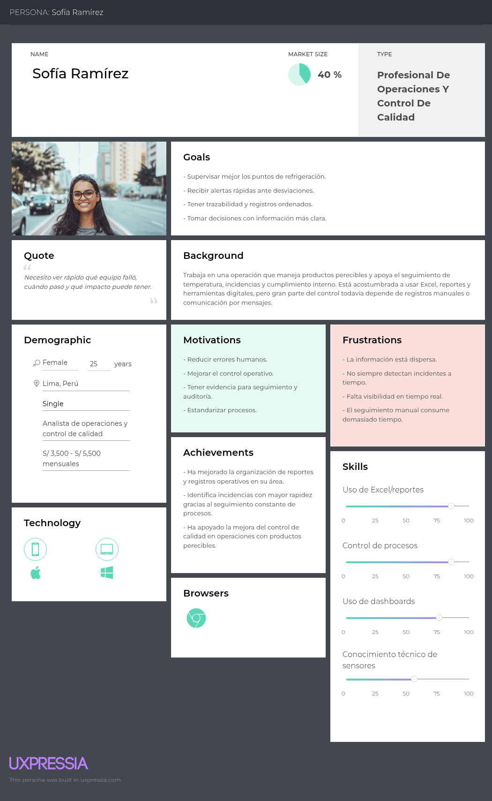
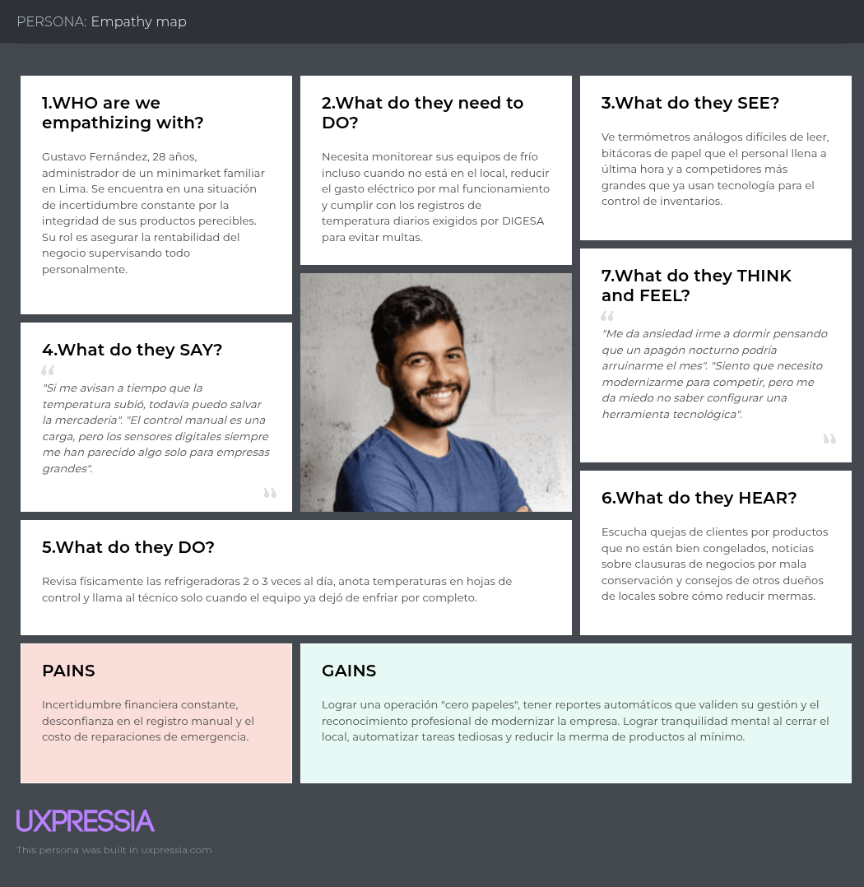
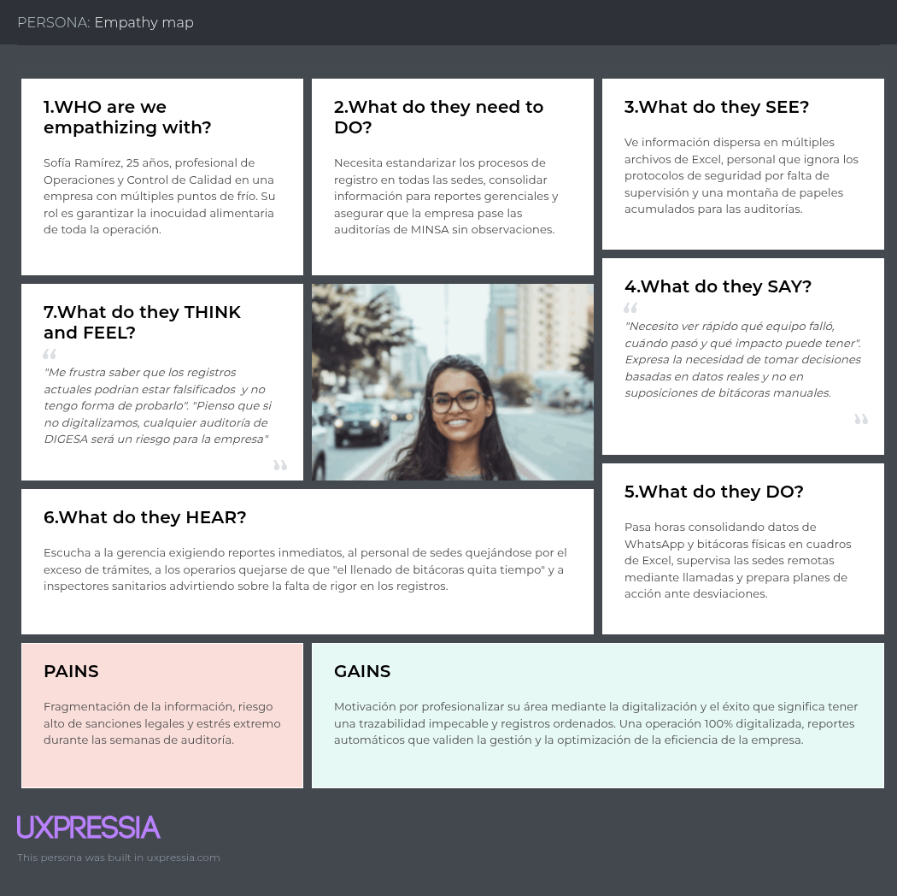

# Chapter II: Requirements Elicitation & Analysis

## 2.1 Competidores

### 2.1.1 Análisis Competitivo

<table style="width: 100%; table-layout: fixed;">
  <colgroup>
    <col style="width: 12%;">
    <col style="width: 16%;">
    <col style="width: 18%;">
    <col style="width: 18%;">
    <col style="width: 18%;">
    <col style="width: 18%;">
  </colgroup>
  <tr>
    <td colspan="6" align="left"><strong>Competitive Analysis Landscape</strong></td>
  </tr>
  <tr>
    <td colspan="2"><strong>¿Por qué llevar a cabo este análisis?</strong></td>
    <td colspan="4">Este análisis permite identificar cómo se posiciona ColdTrace frente a plataformas enterprise, soluciones modulares de sensores y propuestas especializadas en transporte refrigerado. A partir de ello, se puede definir una ventaja competitiva basada en simplicidad, adaptación local y menor barrera de entrada.</td>
  </tr>
  <tr>
    <td colspan="2"><strong>Logo</strong></td>
    <td align="center">
      <strong>ColdTrace (ICEQ)</strong>
        
      &nbsp;
    </td>
    <td align="center">
      <strong>SmartSense by Digi</strong>
        
      
    </td>
    <td align="center">
      <strong>Monnit</strong>
        
      
    </td>
    <td align="center">
      <strong>Cooltrax</strong>
        
      
    </td>
  </tr>
  <tr>
    <td rowspan="2" valign="top"><strong>Perfil</strong></td>
    <td><strong>Overview</strong></td>
    <td>Startup peruana orientada al monitoreo web de temperatura y humedad para la cadena de frío alimentaria en negocios pequeños y medianos.</td>
    <td>Plataforma enterprise de food safety y temperature monitoring con sensores, workflows y compliance para restaurantes, grocery, schools y hospitality.</td>
    <td>Plataforma de remote monitoring con 80+ sensores IoT, software iMonnit y soluciones de food service monitoring.</td>
    <td>Plataforma industrial IoT para visibilidad y control de cadena de frío en transporte, warehouses, cold rooms y pallets.</td>
  </tr>
  <tr>
    <td><strong>Ventaja Competitiva ¿Qué valor ofrece a los clientes?</strong></td>
    <td>Adaptación al contexto peruano, menor complejidad de adopción y foco en usuarios que hoy siguen trabajando con controles manuales.</td>
    <td>Escala enterprise, automatización de cumplimiento, analytics avanzados y workflows guiados para operaciones multisede.</td>
    <td>Costo accesible, despliegue rápido, catálogo amplio de sensores y flexibilidad cloud / on-premises.</td>
    <td>Monitoreo a nivel de producto, ubicación y temperatura con fuerte foco en control de flotas y distribución refrigerada.</td>
  </tr>
  <tr>
    <td rowspan="2" valign="top"><strong>Perfil de Marketing</strong></td>
    <td><strong>Mercado Objetivo</strong></td>
    <td>Minimarkets, puestos de mercado, carnicerías, pescaderías, restaurantes, almacenes y operadores medianos en Perú.</td>
    <td>Large restaurants, grocery chains, convenience stores, schools, hospitality y food manufacturing.</td>
    <td>Food service, producción, restaurantes y negocios que necesitan monitoreo remoto sin gran infraestructura.</td>
    <td>Enterprise fleets, grocery store fleets, food & beverage fleets, warehouses y cold storage operations.</td>
  </tr>
  <tr>
    <td><strong>Estrategias de Marketing</strong></td>
    <td>Venta consultiva local, posicionamiento por reducción de merma, cumplimiento sanitario y facilidad de uso con onboarding simple.</td>
    <td>Demos personalizadas, customer stories, mensaje de ROI y compliance, además de acompañamiento por customer success.</td>
    <td>Combinación de venta directa, demo, catálogo amplio, mensaje de bajo costo y facilidad de instalación.</td>
    <td>Venta consultiva B2B, technology consultation, casos de éxito y foco en ahorro operativo, visibilidad y control.</td>
  </tr>
  <tr>
    <td rowspan="3" valign="top"><strong>Perfil de Producto</strong></td>
    <td><strong>Productos & Services</strong></td>
    <td>Dashboard web, integración con sensores IoT, alertas, historial, reportes, trazabilidad y monitoreo continuo.</td>
    <td>Sensores, gateways celulares, cloud dashboard, alertas automáticas, digital workflows, reporting y APIs.</td>
    <td>Wireless sensors, gateways, iMonnit cloud/app, alertas, HACCP logging y opciones cloud u on-premises.</td>
    <td>Fresh InTransit, Fresh InStorage, sensores inalámbricos, door sensors, reefer integration y dashboard de inteligencia operativa.</td>
  </tr>
  <tr>
    <td><strong>Precios & Costos</strong></td>
    <td>Suscripción mensual proyectada y más accesible que suites enterprise; precio final aún por definir.</td>
    <td>Cotización personalizada bajo modelo per-asset pricing all-inclusive; no publica una tarifa estándar.</td>
    <td>iMonnit Basic gratis; iMonnit Premiere desde US$45/año hasta 6 sensores y US$325/año hasta 100 sensores.</td>
    <td>Cotización personalizada y contacto comercial; no muestra precios públicos en el sitio oficial.</td>
  </tr>
  <tr>
    <td><strong>Canales de distribución (Web y/o Móvil)</strong></td>
    <td>Web responsive con alertas remotas e integración con sensores IoT.</td>
    <td>Web y mobile apps, además de APIs e integraciones con plataformas empresariales.</td>
    <td>Web, app móvil, ecommerce y venta directa de sensores y software.</td>
    <td>Plataforma web con alertas remotas e implementación consultiva para operaciones de cadena de frío.</td>
  </tr>
  <tr>
    <td rowspan="4" valign="top"><strong>Análisis SWOT</strong></td>
    <td><strong>Fortalezas</strong></td>
    <td>Enfoque local, simplicidad, potencial de personalización y propuesta más cercana a pequeñas y medianas operaciones.</td>
    <td>Marca consolidada, fuerte capacidad de compliance, despliegue multisede y analítica avanzada.</td>
    <td>Bajo costo de entrada, instalación rápida, amplitud de sensores y flexibilidad tecnológica.</td>
    <td>Alta especialización en transporte frío, monitoreo product-level y control de operaciones logísticas.</td>
  </tr>
  <tr>
    <td><strong>Debilidades</strong></td>
    <td>Startup en etapa temprana, menor reconocimiento de marca y menos integraciones maduras.</td>
    <td>Mayor complejidad y probable costo de entrada para pymes o negocios pequeños.</td>
    <td>Menor especialización vertical end-to-end en cadena de frío alimentaria que algunas suites dedicadas.</td>
    <td>Más orientado a flotas y distribución que a pequeños negocios con operación fija.</td>
  </tr>
  <tr>
    <td><strong>Oportunidades</strong></td>
    <td>Digitalización de negocios alimentarios en Perú, presión por inocuidad y necesidad de reducir merma.</td>
    <td>Expandirse en más verticales y geografías donde se exija trazabilidad y automatización.</td>
    <td>Captar SMBs que buscan monitoreo asequible y flexible sin invertir en suites enterprise.</td>
    <td>Aprovechar el crecimiento de logística refrigerada, trazabilidad en tránsito y control warehouse.</td>
  </tr>
  <tr>
    <td><strong>Amenazas</strong></td>
    <td>Competidores globales, resistencia al cambio en negocios tradicionales y dependencia del hardware.</td>
    <td>Soluciones más económicas o locales que compitan mejor en el segmento mid-market.</td>
    <td>Plataformas verticales con workflows más profundos y mayor especialización en un nicho concreto.</td>
    <td>Competencia de suites telemáticas o de IoT industrial con funciones similares de visibilidad.</td>
  </tr>
</table>

### 2.1.2 Estrategia y tácticas frente a competidores

ColdTrace aplicará estrategias orientadas a aprovechar las oportunidades del mercado y a contrarrestar las fortalezas de sus competidores, mientras capitaliza sus debilidades.

**Estrategias:**

- Diferenciación operativa integral: A diferencia de SmartSense, orientado a operaciones enterprise de gran escala, ColdTrace se enfocará en integrar monitoreo en tiempo real, alertas, historial y trazabilidad en una propuesta más accesible para negocios alimentarios pequeños y medianos.
- Competitividad en accesibilidad y despliegue: Frente a Monnit, que parte de una lógica más modular basada en sensores y software generalista, ColdTrace buscará ofrecer una experiencia más enfocada en la cadena de frío alimentaria y con menor complejidad de configuración para el usuario final.
- Enfoque territorial y contextual: Aprovechar la falta de soluciones específicamente adaptadas al mercado peruano, priorizando negocios y operaciones que todavía dependen de controles manuales en mercados, minimarkets, restaurantes y almacenes locales.
- Trazabilidad y cumplimiento simplificados: Frente a soluciones más robustas o más orientadas a flotas como Cooltrax, ColdTrace buscará destacar por traducir el monitoreo y las alertas en una experiencia más simple para responsables de negocio, calidad y operaciones.

**Tácticas:**

- Lanzar pilotos con minimarkets, carnicerías, pescaderías, restaurantes y pequeños almacenes para validar el producto en operaciones que sí sufren pérdidas por fallas de refrigeración.
- Impulsar campañas digitales y demostraciones prácticas dirigidas a responsables de operaciones, calidad y dueños de negocio, destacando reducción de merma, cumplimiento sanitario y facilidad de uso.
- Establecer alianzas con proveedores de sensores, servicios técnicos de refrigeración o actores logísticos para fortalecer la implementación local y reducir la barrera de adopción.
- Utilizar los datos históricos de temperatura, alertas e incidencias como insumo para auditorías, control operativo y toma de decisiones, generando un diferencial frente a soluciones que no aterrizan esa información al contexto de pequeñas y medianas operaciones.

## 2.2 Entrevistas

### 2.2.1 Diseño de entrevistas

Para el diseño de entrevistas se plantearon preguntas semiestructuradas orientadas a comprender cómo los potenciales usuarios monitorean actualmente sus equipos de refrigeración, qué problemas enfrentan ante fallas de temperatura y qué expectativas tendrían frente a una solución como ColdTrace.

**Segmento 1: Dueños o encargados de pequeños negocios con productos perecibles**

- ¿Qué tipo de productos refrigerados o congelados maneja actualmente en su negocio?
- ¿Cómo controlan hoy la temperatura de sus refrigeradoras, congeladoras o cámaras de frío?
- ¿Con qué frecuencia ocurren problemas como variaciones de temperatura, fallas de equipos o pérdida de productos?
- ¿Qué consecuencias genera para su negocio una falla en la cadena de frío?
- Cuando ocurre un problema de refrigeración, ¿qué acciones suele tomar usted o su personal?
- ¿Qué tan útil le resultaría recibir alertas en tiempo real desde su celular o computadora cuando la temperatura sale del rango seguro?
- ¿Qué dificultades cree que tendría su negocio para implementar una solución digital de monitoreo como ColdTrace?
- ¿Qué expectativas tendría de una plataforma que le ayude a monitorear temperatura, registrar incidencias y contar con historial para control o auditoría?

**Segmento 2: Responsables de operaciones, calidad o logística en negocios con cadena de frío**

- ¿Cuáles son los principales problemas que enfrentan al supervisar equipos, ambientes o unidades que dependen de cadena de frío?
- ¿Cómo registran y verifican actualmente la temperatura y las condiciones de almacenamiento o transporte?
- ¿Qué tan confiable considera el proceso actual de monitoreo y control que manejan en su organización?
- ¿En qué puntos del proceso suelen presentarse más riesgos de pérdida, incumplimiento o fallas operativas?
- ¿Qué tan útil sería para su operación contar con una plataforma que centralice alertas, historial de temperatura e incidencias en un solo lugar?
- ¿De qué manera una herramienta como ColdTrace podría ayudar a mejorar la toma de decisiones, las auditorías o la trazabilidad de su operación?
- ¿Qué condiciones o características debería tener una solución de monitoreo para que su organización decida adoptarla o evaluarla seriamente?
- ¿Qué beneficios esperaría obtener su organización al implementar un sistema digital de monitoreo de temperatura y control de cadena de frío?

### 2.2.2 Registro de Entrevistas

**Segmento 1: Dueños o encargados de pequeños negocios con productos perecibles**

<table border="1" style="width:100%; border-collapse:collapse;">
  <colgroup>
    <col style="width:12%;">
    <col style="width:18%;">
    <col style="width:22%;">
    <col style="width:48%;">
  </colgroup>
  <tr>
    <th align="left">Entrevista</th>
    <th align="left">Datos</th>
    <th align="left">Evidencia</th>
    <th align="left">Resumen</th>
  </tr>
  <tr>
    <td valign="center" align="left"><strong>Entrevista N°1</strong></td>
    <td valign="center" align="left"><strong>Nombre:</strong> Sara Lopez <strong>Edad:</strong> 53 años <strong>Distrito:</strong> San Martín de Porres</td>
    <td valign="center" align="left"><strong>Video (Microsoft Stream):</strong> <a href="LINK_AQUI">Ver video</a> <strong>Inicio:</strong> 00:00:00 <strong>Duración:</strong> 05:30  </td>
    <td valign="center" align="left">La entrevistada es una microempresaria que gestiona un negocio de productos perecibles que dependen del correcto funcionamiento de equipos de refrigeración. Actualmente, el control de temperatura se realiza de forma manual y basada en la experiencia, sin registros ni monitoreo constante, lo que evidencia una falta de herramientas tecnológicas. Los problemas no son diarios, pero ocurren ante fallas técnicas o cortes de energía, y suelen detectarse tarde, cuando los productos ya han sido afectados.  Estas situaciones generan pérdidas económicas y riesgos para la salud de los clientes, por lo que la entrevistada actúa de manera reactiva, descartando productos dañados y recurriendo a técnicos. Asimismo, valora soluciones simples e intuitivas que le permitan recibir alertas en tiempo real, tener información clara y organizada, identificar patrones de fallas y contar con respaldo para auditorías, lo que refleja la necesidad de un sistema de monitoreo eficiente.</td>
  </tr>
  <tr>
    <td valign="center" align="left"><strong>Entrevista N°2</strong></td>
    <td valign="center" align="left"><strong>Nombre:</strong> Pendiente <strong>Edad:</strong> Pendiente <strong>Distrito:</strong> Pendiente</td>
    <td valign="center" align="left"><strong>Video (Microsoft Stream):</strong> Pendiente <strong>Inicio:</strong> Pendiente <strong>Duración:</strong> Pendiente</td>
    <td valign="center" align="left">Pendiente de completar.</td>
  </tr>
  <tr>
    <td valign="center" align="left"><strong>Entrevista N°3</strong></td>
    <td valign="center" align="left"><strong>Nombre:</strong> Pendiente <strong>Edad:</strong> Pendiente <strong>Distrito:</strong> Pendiente</td>
    <td valign="center" align="left"><strong>Video (Microsoft Stream):</strong> Pendiente <strong>Inicio:</strong> Pendiente <strong>Duración:</strong> Pendiente</td>
    <td valign="center" align="left">Pendiente de completar.</td>
  </tr>
</table>

**Segmento 2: Responsables de operaciones, calidad o logística en negocios con cadena de frío**

## 2.3 Needfinding

### 2.3.1 User Personas

La creación de User Personas nos permite humanizar los datos recopilados durante la investigación de campo, transformando estadísticas y notas de entrevistas en perfiles representativos con objetivos, habilidades y frustraciones específicas. En el contexto de ColdTrace, hemos identificado dos arquetipos críticos que interactúan con la cadena de frío de maneras distintas: el dueño de negocio que busca rentabilidad y la profesional de calidad que persigue el cumplimiento normativo. A continuación, se presentan las fichas detalladas elaboradas en la herramienta UXPressia.

**Segmento 1: Dueños o encargados de pequeños negocios con productos perecibles**

   

**Segmento 2: Responsables de operaciones, calidad o logística en negocios con cadena de frío**

   

### 2.3.2 User Task Matrix

La User Task Matrix es una herramienta que nos permite identificar las tareas clave que nuestros usuarios necesitan realizar dentro de la solución propuesta. A partir de estas tareas, podemos comprender mejor sus necesidades y expectativas, lo que ayuda a orientar el diseño de una experiencia más clara, útil y alineada con el contexto de uso de ColdTrace. Debido a que esta matriz se elaboró antes de completar las entrevistas, su contenido debe considerarse preliminar.

**User Task Matrix: Primer Segmento Objetivo**

**Segmento 1: Dueños o encargados de pequeños negocios con productos perecibles**
**Persona:** Gustavo Fernández

| Tareas | Frecuencia | Importancia |
| --- | --- | --- |
| Verificar que la temperatura de la refrigeradora o cámara esté dentro del rango seguro. | Alta | Alta |
| Recibir alertas ante una falla de refrigeración o una temperatura fuera del rango permitido. | Media | Alta |
| Revisar el historial de temperatura del día o del turno anterior. | Media | Media |
| Configurar el rango seguro de temperatura según el tipo de producto almacenado. | Baja | Alta |
| Generar un reporte básico de condiciones para mostrar ante una inspección sanitaria. | Baja | Alta |
| Consultar desde el celular el estado de la refrigeradora o cámara cuando no está en el local. | Media | Media |

**User Task Matrix: Segundo Segmento Objetivo**

**Segmento 2: Responsables de operaciones, calidad o logística en negocios con cadena de frío**
**Persona:** Sofía Ramírez

| Tareas | Frecuencia | Importancia |
| --- | --- | --- |
| Monitorear en tiempo real el estado de múltiples equipos, ambientes o unidades con cadena de frío. | Alta | Alta |
| Recibir y revisar alertas automáticas ante desviaciones de temperatura. | Media | Alta |
| Generar reportes de trazabilidad para auditorías, control interno o seguimiento operativo. | Media | Alta |
| Revisar el historial de incidencias por equipo, área o sede. | Alta | Alta |
| Configurar rangos de temperatura y humedad según el tipo de producto o ambiente. | Baja | Alta |
| Consultar un dashboard consolidado para tomar decisiones operativas. | Media | Alta |

### 2.3.3 User Journey Mapping

El User Journey Map es una representación visual del flujo de pasos, necesidades y emociones que experimenta un usuario para alcanzar un objetivo específico. Para este análisis, se han desarrollado versiones As-Is de los mapas de viaje, las cuales ilustran la situación actual de los usuarios antes de la implementación de la solución ColdTrace. Este mapeo permite diagnosticar los puntos de fricción técnica, los riesgos de inocuidad alimentaria y las ineficiencias de los procesos manuales predominantes en el mercado peruano.

**User Journey Map: Gustavo Fernández (As-Is)**

**User Journey Map: Sofía Ramírez (As-Is)**

### 2.3.4 Empathy Mapping

El Empathy Map nos permite profundizar en el mundo interno y sensorial del usuario, capturando lo que ven, oyen, dicen, hacen, piensan y sienten durante su jornada laboral. Esta herramienta es fundamental para identificar las motivaciones profundas que impulsan el comportamiento humano y para validar los "puntos de dolor" (Pains) y las "ganancias esperadas" (Gains).

**Empathy Map: Gustavo Fernández**

**Empathy Map: Sofía Ramírez**

## 2.4 Big Picture Event Storming

## 2.5 Ubiquitous Language

- **Activo:** Cámara, almacén o transporte monitoreado

