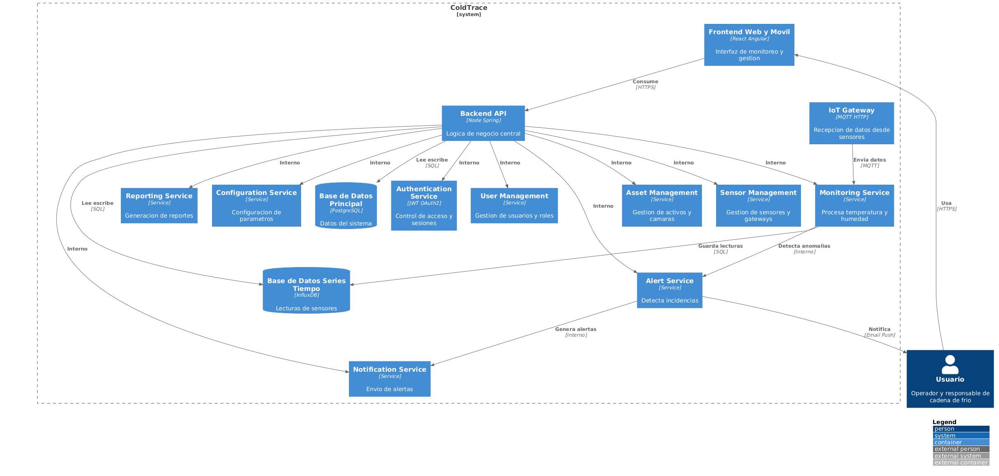
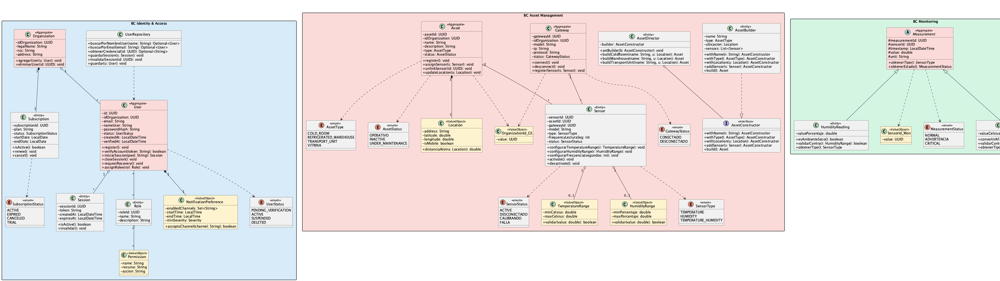

# CAPÍTULO IV. PRODUCT UX/UI DESIGN

## 4.1. Style Guidelines.

Un Style Guideline constituye un conjunto de normas y directrices destinadas a estandarizar la redacción, el diseño y la presentación de documentos, contenidos digitales, desarrollos de software u otros productos creativos. A continuación, se detallan las especificaciones correspondientes a los parámetros adoptados en la estructura del proyecto.

### 4.1.1. General Style Guidelines.

**Brand Overview**  
ColdTrace es una plataforma digital orientada al monitoreo de temperatura y humedad en la cadena de frío alimentaria. Su diseño visual busca transmitir confianza, control, precisión y simplicidad, pilares fundamentales para la gestión de productos perecibles y la toma de decisiones en tiempo real.

**Brand Name**  
El nombre "ColdTrace" combina el concepto de frío (“Cold”) con trazabilidad (“Trace”), enfatizando el seguimiento continuo de las condiciones térmicas en activos como cámaras frigoríficas, almacenes y transporte refrigerado.

**Typography**  
Para mantener una experiencia accesible y operativa, se usarán tipografías modernas y legibles como:

Headings: Montserrat Bold  
Body text: Open Sans Regular  
Buttons: Open Sans Semibold  
Links: Open Sans Italic

**Colors:**

| **Color**            | **Código HEX** | **Significado**                              |
|---------------------|----------------|----------------------------------------------|
| Azul Tecnológico    | `#1A73E8`      | Confianza, monitoreo, precisión               |
| Verde Seguro        | `#34A853`      | Estado estable, cumplimiento                  |
| Rojo Alerta         | `#EA4335`      | Riesgo, desviación térmica                    |
| Amarillo Preventivo | `#FBBC05`      | Advertencia, posible falla                    |
| Blanco              | `#FFFFFF`      | Claridad, limpieza, accesibilidad             |
| Gris Neutro         | `#E0E0E0`      | Neutralidad, información secundaria           |
| Negro               | `#212121`      | Lectura clara                                 |

---

### 4.1.2. Web Style Guidelines.

La plataforma será completamente responsive, adaptándose a móviles, tablets y escritorios. Se seguirá el patrón de lectura en Z para guiar la mirada del usuario desde el estado general del sistema, pasando por los activos monitoreados y terminando en las acciones críticas.

El diseño prioriza una experiencia clara y operativa, con:

- Alto contraste visual (especialmente para alertas)
- Uso de colores semánticos (verde, amarillo, rojo)
- Botones claros y accesibles
- Interfaces simples para usuarios no técnicos

---

## 4.2. Information Architecture.

En esta sección se describe cómo se estructura la información dentro de la plataforma ColdTrace, considerando la experiencia tanto en la Landing Page como en la Aplicación Web operativa.

El objetivo es asegurar una navegación fluida, comprensible y eficiente, maximizando la usabilidad y minimizando el esfuerzo cognitivo del usuario.

La arquitectura se apoya en principios de organización jerárquica, sistemas de etiquetado claros, mecanismos de búsqueda efectivos y patrones de navegación intuitivos, diseñados para atender a dos perfiles principales:

- Dueño o encargado de negocio
- Responsable de operaciones o calidad

---

### 4.2.1. Organization Systems.

**Tipo de organización usada:**

Se ha optado por una estructura jerárquica combinada con organización por tareas y roles, lo cual facilita que cada tipo de usuario pueda encontrar rápidamente la funcionalidad que necesita según su objetivo (monitorear, reaccionar, reportar).

---

**Organización de la Landing Page:**

*Encabezado (Header):*  
Logo, menú principal (Inicio, Solución, Cómo Funciona, Beneficios, Contacto) y botones (Iniciar Sesión / Registrarse)

*Sección Introductoria (Hero):*  
Mensaje: "Monitorea tu cadena de frío en tiempo real y evita pérdidas"  
Botón CTA: “Solicitar demo”

*Beneficios:*
- Reducción de merma
- Alertas en tiempo real
- Cumplimiento sanitario

*Cómo Funciona:*  
Sensores → Plataforma → Alertas → Decisión

*Casos de uso:*  
Minimarkets, restaurantes, almacenes, transporte refrigerado

*Pie de Página (Footer):*  
Enlaces legales, contacto, redes sociales

---

**Organización de la Aplicación Web (por rol)**

-Usuario Operativo / Dueño

*Inicio:* Vista general con estado de activos y alertas  
*Monitoreo:* Visualización en tiempo real  
*Alertas:* Incidencias activas  
*Historial:* Lecturas pasadas  
*Reportes:* Exportación de datos  
*Perfil:* Configuración básica

-Responsable de Operaciones / Calidad

*Dashboard:* Vista consolidada de múltiples activos  
*Activos:* Gestión de equipos y sensores  
*Incidencias:* Seguimiento y control  
*Reportes:* Trazabilidad y auditoría  
*Configuración:* Parámetros y rangos

---

### 4.2.2. Labeling Systems.

Los sistemas de etiquetado usados en ColdTrace tienen como objetivo lograr una interfaz clara, rápida y comprensible en contextos operativos.

**1. Etiquetas Textuales (Text Labels):**

Acción directa y clara:

- “Ver estado”
- “Configurar rango”
- “Revisar alertas”
- “Generar reporte”

**2. Etiquetas de Encabezado (Headings):**

H1: Dashboard  
H2: Alertas activas  
H3: Detalle del activo

**3. Etiquetas Icónicas (Iconic Labels):**

- Dashboard
- Temperatura
- Alertas
- Reportes
- Configuración

**4. Tooltips:**

- “Temperatura fuera de rango”
- “Sin conexión”
- “Última lectura registrada”

---

### 4.2.3. SEO Tags and Meta Tags

```html
<title>ColdTrace - Monitoreo de cadena de frío en tiempo real</title>

<meta name="description" content="Plataforma para monitorear temperatura y humedad en negocios alimentarios. Reduce pérdidas y mejora el control sanitario.">

<meta name="keywords" content="cadena de frío, monitoreo temperatura, sensores IoT, alimentos, trazabilidad, Perú">

<meta name="viewport" content="width=device-width, initial-scale=1.0">

<meta name="author" content="ColdTrace">

<meta name="copyright" content="© 2026 ColdTrace">
```
### 4.2.4. Searching Systems.

El sistema de búsqueda de ColdTrace permite localizar de manera rápida y eficiente la información operativa relevante dentro de la plataforma.

- **Búsqueda por activo:**  
  Permite localizar equipos mediante el nombre de la cámara frigorífica, sensor o unidad de transporte.

- **Filtros por estado:**  
  Clasificación de activos según su condición operativa: normal, alerta o desconectado.

- **Filtros por ubicación:**  
  Segmentación por sucursal, almacén o zona geográfica.

- **Filtros por tipo:**  
  Clasificación según el tipo de activo: cámara, sensor o unidad de transporte.

---

### 4.2.5. Navigation Systems.

La plataforma cuenta con un menú lateral (sidebar) adaptable según el dispositivo, garantizando accesibilidad tanto en escritorio como en móviles.

La navegación está orientada a acciones críticas y al flujo operativo del usuario.

**Flujo principal:**  
Registro → Configuración → Monitoreo → Alertas → Reportes

La experiencia de navegación es intuitiva, priorizando la rapidez de respuesta y la toma de decisiones ante incidencias.

---

## 4.3. Landing Page UX/UI Design

### 4.3.1. Landing Page Wireframe.

**Pendiente de completar**

---

### 4.3.2. Landing Page Mock-up.

**Pendiente de completar**

---

## 4.4. Web Applications UX/UI Design.

### 4.4.1. Web Applications Wireframes.

**Pendiente de completar**

---

### 4.4.2. Web Applications Wireflow Diagrams.

**Pendiente de completar**

---

### 4.4.3. Web Applications Mock-ups.

**Pendiente de completar**

---

### 4.4.4. Web Applications User Flow Diagrams.

**Pendiente de completar**

---

## 4.5. Web Applications Prototyping.

**Pendiente de completar**

---
## 4.6. Domain-Driven Software Architecture.

### 4.6.1. Design-Level Event Storming.


### 4.6.2. Software Architecture Context Diagram.


### 4.6.3. Software Architecture Container Diagrams.


### 4.6.4. Software Architecture Components Diagrams.


---

## 4.7. Software Object-Oriented Design.

### 4.7.1. Class Diagrams.


---

## 4.8. Database Design.

### 4.8.1. Database Diagrams.

