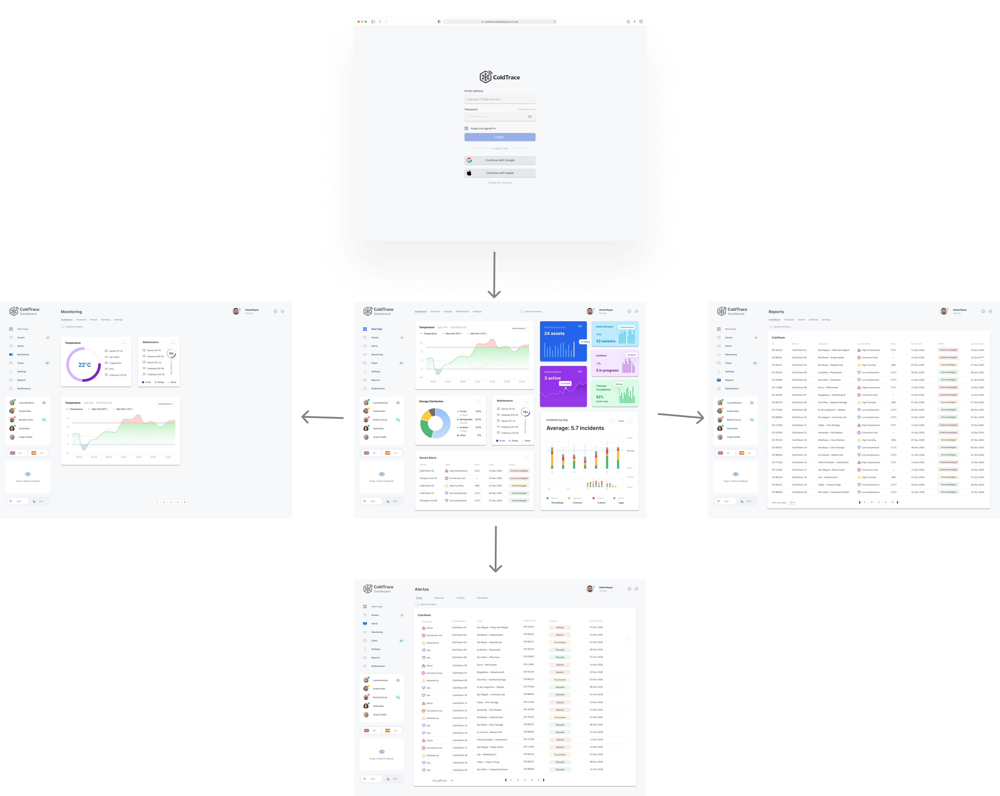

# CAPÍTULO IV. PRODUCT UX/UI DESIGN

## 4.1. Style Guidelines.

Un Style Guideline constituye un conjunto de normas y directrices destinadas a estandarizar la redacción, el diseño y la presentación de documentos, contenidos digitales, desarrollos de software u otros productos creativos. A continuación, se detallan las especificaciones correspondientes a los parámetros adoptados en la estructura del proyecto.

### 4.1.1. General Style Guidelines.

**Brand Overview**  
ColdTrace es una plataforma digital orientada al monitoreo de temperatura y humedad en la cadena de frío alimentaria. Su diseño visual busca transmitir confianza, control, precisión y simplicidad, pilares fundamentales para la gestión de productos perecibles y la toma de decisiones en tiempo real.

**Brand Name**  
El nombre "ColdTrace" combina el concepto de frío (“Cold”) con trazabilidad (“Trace”), enfatizando el seguimiento continuo de las condiciones térmicas en activos como cámaras frigoríficas, almacenes y transporte refrigerado.

**Typography**  
Para mantener una experiencia accesible y operativa, se usarán tipografías modernas y legibles como:

Headings: Montserrat Bold  
Body text: Open Sans Regular  
Buttons: Open Sans Semibold  
Links: Open Sans Italic

**Colors:**

| **Color**            | **Código HEX** | **Significado**                              |
|---------------------|----------------|----------------------------------------------|
| Azul Tecnológico    | `#1A73E8`      | Confianza, monitoreo, precisión               |
| Verde Seguro        | `#34A853`      | Estado estable, cumplimiento                  |
| Rojo Alerta         | `#EA4335`      | Riesgo, desviación térmica                    |
| Amarillo Preventivo | `#FBBC05`      | Advertencia, posible falla                    |
| Blanco              | `#FFFFFF`      | Claridad, limpieza, accesibilidad             |
| Gris Neutro         | `#E0E0E0`      | Neutralidad, información secundaria           |
| Negro               | `#212121`      | Lectura clara                                 |

---

### 4.1.2. Web Style Guidelines.

La plataforma será completamente responsive, adaptándose a móviles, tablets y escritorios. Se seguirá el patrón de lectura en Z para guiar la mirada del usuario desde el estado general del sistema, pasando por los activos monitoreados y terminando en las acciones críticas.

El diseño prioriza una experiencia clara y operativa, con:

- Alto contraste visual (especialmente para alertas)
- Uso de colores semánticos (verde, amarillo, rojo)
- Botones claros y accesibles
- Interfaces simples para usuarios no técnicos

---

## 4.2. Information Architecture.

En esta sección se describe cómo se estructura la información dentro de la plataforma ColdTrace, considerando la experiencia tanto en la Landing Page como en la Aplicación Web operativa.

El objetivo es asegurar una navegación fluida, comprensible y eficiente, maximizando la usabilidad y minimizando el esfuerzo cognitivo del usuario.

La arquitectura se apoya en principios de organización jerárquica, sistemas de etiquetado claros, mecanismos de búsqueda efectivos y patrones de navegación intuitivos, diseñados para atender a dos perfiles principales:

- Dueño o encargado de negocio
- Responsable de operaciones o calidad

---

### 4.2.1. Organization Systems.

**Tipo de organización usada:**

Se ha optado por una estructura jerárquica combinada con organización por tareas y roles, lo cual facilita que cada tipo de usuario pueda encontrar rápidamente la funcionalidad que necesita según su objetivo (monitorear, reaccionar, reportar).

---

**Organización de la Landing Page:**

*Encabezado (Header):*  
Logo, menú principal (Inicio, Solución, Cómo Funciona, Beneficios, Contacto) y botones (Iniciar Sesión / Registrarse)

*Sección Introductoria (Hero):*  
Mensaje: "Monitorea tu cadena de frío en tiempo real y evita pérdidas"  
Botón CTA: “Solicitar demo”

*Beneficios:*
- Reducción de merma
- Alertas en tiempo real
- Cumplimiento sanitario

*Cómo Funciona:*  
Sensores → Plataforma → Alertas → Decisión

*Casos de uso:*  
Minimarkets, restaurantes, almacenes, transporte refrigerado

*Pie de Página (Footer):*  
Enlaces legales, contacto, redes sociales

---

**Organización de la Aplicación Web (por rol)**

-Usuario Operativo / Dueño

*Inicio:* Vista general con estado de activos y alertas  
*Monitoreo:* Visualización en tiempo real  
*Alertas:* Incidencias activas  
*Historial:* Lecturas pasadas  
*Reportes:* Exportación de datos  
*Perfil:* Configuración básica

-Responsable de Operaciones / Calidad

*Dashboard:* Vista consolidada de múltiples activos  
*Activos:* Gestión de equipos y sensores  
*Incidencias:* Seguimiento y control  
*Reportes:* Trazabilidad y auditoría  
*Configuración:* Parámetros y rangos

---

### 4.2.2. Labeling Systems.

Los sistemas de etiquetado usados en ColdTrace tienen como objetivo lograr una interfaz clara, rápida y comprensible en contextos operativos.

**1. Etiquetas Textuales (Text Labels):**

Acción directa y clara:

- “Ver estado”
- “Configurar rango”
- “Revisar alertas”
- “Generar reporte”

**2. Etiquetas de Encabezado (Headings):**

H1: Dashboard  
H2: Alertas activas  
H3: Detalle del activo

**3. Etiquetas Icónicas (Iconic Labels):**

- Dashboard
- Temperatura
- Alertas
- Reportes
- Configuración

**4. Tooltips:**

- “Temperatura fuera de rango”
- “Sin conexión”
- “Última lectura registrada”

---

### 4.2.3. SEO Tags and Meta Tags

```html
<title>ColdTrace - Monitoreo de cadena de frío en tiempo real</title>

<meta name="description" content="Plataforma para monitorear temperatura y humedad en negocios alimentarios. Reduce pérdidas y mejora el control sanitario.">

<meta name="keywords" content="cadena de frío, monitoreo temperatura, sensores IoT, alimentos, trazabilidad, Perú">

<meta name="viewport" content="width=device-width, initial-scale=1.0">

<meta name="author" content="ColdTrace">

<meta name="copyright" content="© 2026 ColdTrace">
```
### 4.2.4. Searching Systems.

El sistema de búsqueda de ColdTrace permite localizar de manera rápida y eficiente la información operativa relevante dentro de la plataforma.

- **Búsqueda por activo:**  
  Permite localizar equipos mediante el nombre de la cámara frigorífica, sensor o unidad de transporte.

- **Filtros por estado:**  
  Clasificación de activos según su condición operativa: normal, alerta o desconectado.

- **Filtros por ubicación:**  
  Segmentación por sucursal, almacén o zona geográfica.

- **Filtros por tipo:**  
  Clasificación según el tipo de activo: cámara, sensor o unidad de transporte.

---

### 4.2.5. Navigation Systems.

La plataforma cuenta con un menú lateral (sidebar) adaptable según el dispositivo, garantizando accesibilidad tanto en escritorio como en móviles.

La navegación está orientada a acciones críticas y al flujo operativo del usuario.

**Flujo principal:**  
Registro → Configuración → Monitoreo → Alertas → Reportes

La experiencia de navegación es intuitiva, priorizando la rapidez de respuesta y la toma de decisiones ante incidencias.

---

## 4.3. Landing Page UX/UI Design

### 4.3.1. Landing Page Wireframe.

Los wireframes de la Landing Page fueron diseñados con el objetivo de definir la estructura inicial del sitio, priorizando la organización del contenido y la experiencia del usuario.
En esta etapa se establecieron las principales secciones del sitio, como el encabezado de navegación, la sección principal (hero), características del producto, beneficios, testimonios y formulario de contacto.
Asimismo, se consideró una versión responsive, adaptando la distribución de los elementos para dispositivos móviles, garantizando una navegación clara y accesible en diferentes tamaños de pantalla.

<p align="center">
  
</p>

<p align="center">
  
</p>

---

### 4.3.2. Landing Page Mock-up.

Los mockups de la Landing Page representan la versión visual final del diseño, incorporando colores, tipografías y estilos definidos en el sistema de diseño.
En esta etapa se aplicaron los lineamientos de branding del proyecto, incluyendo el uso de colores principales, jerarquía tipográfica y elementos visuales que refuerzan la identidad del producto.
Además, se mantuvo consistencia entre la versión desktop y mobile, asegurando una experiencia uniforme para el usuario en cualquier dispositivo.

<p align="center">
  
</p>

<p align="center">
  
</p>

---

## 4.4. Web Applications UX/UI Design.

### 4.4.1. Web Applications Wireframes.

Los wireframes de la aplicación web fueron diseñados para definir la estructura funcional de las principales pantallas del sistema.
En esta etapa se identificaron los elementos clave de interacción, como paneles de control, visualización de datos, navegación entre secciones y componentes necesarios para la gestión del sistema.
Estos wireframes permiten validar la distribución de información antes de la implementación visual, asegurando que las funcionalidades respondan a las necesidades del usuario.

<p align="center">
  
</p>

<p align="center">
  
</p>

<p align="center">
  
</p>

---

### 4.4.2. Web Applications Wireflow Diagrams.

Los wireflow diagrams representan el flujo de interacción del usuario dentro de la aplicación, mostrando la navegación entre pantallas y las acciones que el usuario puede realizar en cada etapa.
Estos diagramas permiten entender el recorrido del usuario (user flow), facilitando la identificación de puntos clave de interacción y mejorando la experiencia general del sistema.

<p align="center">
  
</p>

---

### 4.4.3. Web Applications Mock-ups.

Los mockups de la aplicación web muestran la representación visual final de las interfaces del sistema, incorporando estilos, colores y componentes definidos en el diseño.
En esta etapa se buscó mantener consistencia visual con la Landing Page, asegurando una identidad unificada del producto.
Asimismo, se priorizó la claridad en la presentación de información y la facilidad de uso, permitiendo que el usuario interactúe de manera intuitiva con las funcionalidades del sistema.

<p align="center">
  
</p>

<p align="center">
  
</p>

<p align="center">
  
</p>

---

### 4.4.4. Web Applications User Flow Diagrams.

Los User Flow Diagrams representan el recorrido que sigue el usuario dentro de la aplicación para cumplir objetivos específicos, considerando las distintas interacciones y decisiones que se presentan en cada etapa.
Estos diagramas integran las vistas principales del sistema con los flujos de navegación, permitiendo visualizar tanto la ruta esperada (happy path) como posibles escenarios alternativos (unhappy paths). De esta manera, se facilita la comprensión del comportamiento del usuario y se asegura coherencia con los wireflows y mockups previamente definidos.

### User Flow 1 : Detectar alertas de temperatura a tiempo para evitar pérdidas.

<p align="center">
  
</p>

### User Flow 2 : Obtener reportes para supervisión y control.

<p align="center">
  
</p>

### User Flow 3 : Monitorear el estado general de los equipos en tiempo real.

<p align="center">
  
</p>

---

## 4.5. Web Applications Prototyping.

[Ver Prototipo de la Aplicación (Video)](https://upcedupe-my.sharepoint.com/personal/u202410093_upc_edu_pe/_layouts/15/stream.aspx?id=%2Fpersonal%2Fu202410093%5Fupc%5Fedu%5Fpe%2FDocuments%2FApplication%20Prototyping%2Ewebm&nav=eyJyZWZlcnJhbEluZm8iOnsicmVmZXJyYWxBcHAiOiJTdHJlYW1XZWJBcHAiLCJyZWZlcnJhbFZpZXciOiJTaGFyZURpYWxvZy1MaW5rIiwicmVmZXJyYWxBcHBQbGF0Zm9ybSI6IldlYiIsInJlZmVycmFsTW9kZSI6InZpZXcifX0&ga=1&referrer=StreamWebApp%2EWeb&referrerScenario=AddressBarCopied%2Eview%2E2fbd59b3%2Dc21c%2D4852%2Db443%2D3a377f870464)

<p align="center">

</p>

---
## 4.6. Domain-Driven Software Architecture.

### 4.6.1. Design-Level Event Storming.


## 1. Bounded Context: Autenticación
### Explicación
Este contexto gestiona el acceso de los usuarios al sistema mediante el inicio y cierre de sesión. Se encarga de validar credenciales, controlar sesiones activas y generar eventos como usuario autenticado o sesión iniciada/cerrada.

### Justificación
Se separa este contexto porque la seguridad es un aspecto crítico y transversal en cualquier sistema. Al aislar la autenticación:
- Se reduce el riesgo de accesos no autorizados.
- Se facilita la implementación de mecanismos avanzados como OAuth, JWT o autenticación multifactor.
- Se evita mezclar la lógica de seguridad con la lógica de negocio principal.
- Permite escalar y mantener este módulo de forma independiente.


## 2. Bounded Context: Gestión de Sensores

### Explicación
Este contexto administra todo el ciclo de vida de los sensores: registro, configuración, activación y vinculación con activos. Además, define parámetros clave como rangos de temperatura, humedad y frecuencia de medición.

### Justificación
Se separa porque la configuración de sensores define el comportamiento del sistema. Al aislarlo:
- Se centraliza la lógica de configuración.
- Se reducen errores por parámetros mal definidos.
- Se permite modificar reglas sin afectar otros contextos.
- Facilita la reutilización en otros sistemas IoT.


## 3. Bounded Context: Monitoreo

### Explicación
Es el núcleo del sistema. Aquí se reciben las mediciones del sensor, se registran, validan y se verifica si están dentro o fuera de los rangos definidos. Finalmente, las mediciones se almacenan.

### Justificación
Se separa porque es el proceso principal del negocio. Este contexto:
- Maneja alta carga de datos en tiempo real.
- Requiere eficiencia y baja latencia.
- Permite escalar de forma independiente (por ejemplo, usando streaming).
- Evita mezclar procesamiento de datos con visualización o alertas.


## 4. Bounded Context: Alertas

### Explicación
Se encarga de generar notificaciones cuando una medición está fuera de los rangos establecidos. También gestiona la visualización de alertas en el sistema.

### Justificación
Se desacopla para permitir una respuesta rápida ante eventos críticos:
- Permite implementar distintos canales de notificación (email, SMS, etc.).
- Evita sobrecargar el contexto de monitoreo.
- Facilita la extensión del sistema sin afectar la lógica principal.


## 5. Bounded Context: Reportes

### Explicación
Gestiona la generación, visualización y exportación de reportes. Incluye dashboards, historial de mediciones y visualización en tiempo real.

### Justificación
Se separa porque el análisis de datos tiene necesidades distintas al procesamiento:
- Requiere consultas complejas y agregaciones.
- Puede optimizarse con técnicas como caching o data warehousing.
- Evita afectar el rendimiento del monitoreo en tiempo real.
- Permite escalar de forma independiente.


## 6. Bounded Context: Auditoría

### Explicación
Este contexto controla el cumplimiento del sistema mediante auditorías. Permite iniciar auditorías, registrar resultados, validar cumplimiento y generar evidencias exportables.

### Justificación
Se aísla porque la auditoría responde a necesidades de control y cumplimiento:
- Garantiza trazabilidad de las acciones del sistema.
- Permite cumplir con normativas o estándares.
- Facilita la generación de evidencia sin afectar otros procesos.
- Puede evolucionar hacia automatización completa sin impactar otros contextos.


## Problemas Identificados y Relación con Contextos

- Datos inconsistentes del sensor → Monitoreo  
- Validación insuficiente → Monitoreo  
- Configuración manual del sensor → Gestión de Sensores  
- Parámetros mal definidos → Gestión de Sensores  
- Generación de reportes lenta → Reportes  
- Proceso de auditoría manual → Auditoría  

### Justificación General
Estos problemas evidencian la necesidad de separar responsabilidades. La aplicación de Bounded Contexts permite:
- Reducir el acoplamiento entre módulos.
- Mejorar la mantenibilidad del sistema.
- Escalar componentes de forma independiente.
- Aplicar principios de Domain-Driven Design de manera efectiva.


### 4.6.2. Software Architecture Context Diagram.


### 4.6.3. Software Architecture Container Diagrams.


### 4.6.4. Software Architecture Components Diagrams.


---

## 4.7. Software Object-Oriented Design.

### 4.7.1. Class Diagrams.


---

## 4.8. Database Design.

### 4.8.1. Database Diagrams.

