# CAPÍTULO IV. PRODUCT UX/UI DESIGN

## 4.1. Style Guidelines.

Un Style Guideline constituye un conjunto de normas y directrices destinadas a estandarizar la redacción, el diseño y la presentación de documentos, contenidos digitales, desarrollos de software u otros productos creativos. A continuación, se detallan las especificaciones correspondientes a los parámetros adoptados en la estructura del proyecto.

### 4.1.1. General Style Guidelines.

**Brand Overview**  
ColdTrace es una plataforma digital orientada al monitoreo de temperatura y humedad en la cadena de frío alimentaria. Su diseño visual busca transmitir confianza, control, precisión y simplicidad, pilares fundamentales para la gestión de productos perecibles y la toma de decisiones en tiempo real.

**Brand Name**  
El nombre "ColdTrace" combina el concepto de frío (“Cold”) con trazabilidad (“Trace”), enfatizando el seguimiento continuo de las condiciones térmicas en activos como cámaras frigoríficas, almacenes y transporte refrigerado.

**Typography**  
Para mantener una experiencia accesible y operativa, se usarán tipografías modernas y legibles como:

Headings: Montserrat Bold  
Body text: Open Sans Regular  
Buttons: Open Sans Semibold  
Links: Open Sans Italic

**Colors:**

| **Color**            | **Código HEX** | **Significado**                              |
|---------------------|----------------|----------------------------------------------|
| Azul Tecnológico    | `#1A73E8`      | Confianza, monitoreo, precisión               |
| Verde Seguro        | `#34A853`      | Estado estable, cumplimiento                  |
| Rojo Alerta         | `#EA4335`      | Riesgo, desviación térmica                    |
| Amarillo Preventivo | `#FBBC05`      | Advertencia, posible falla                    |
| Blanco              | `#FFFFFF`      | Claridad, limpieza, accesibilidad             |
| Gris Neutro         | `#E0E0E0`      | Neutralidad, información secundaria           |
| Negro               | `#212121`      | Lectura clara                                 |

---

### 4.1.2. Web Style Guidelines.

La plataforma será completamente responsive, adaptándose a móviles, tablets y escritorios. Se seguirá el patrón de lectura en Z para guiar la mirada del usuario desde el estado general del sistema, pasando por los activos monitoreados y terminando en las acciones críticas.

El diseño prioriza una experiencia clara y operativa, con:

- Alto contraste visual (especialmente para alertas)
- Uso de colores semánticos (verde, amarillo, rojo)
- Botones claros y accesibles
- Interfaces simples para usuarios no técnicos

---

## 4.2. Information Architecture.

En esta sección se describe cómo se estructura la información dentro de la plataforma ColdTrace, considerando la experiencia tanto en la Landing Page como en la Aplicación Web operativa.

El objetivo es asegurar una navegación fluida, comprensible y eficiente, maximizando la usabilidad y minimizando el esfuerzo cognitivo del usuario.

La arquitectura se apoya en principios de organización jerárquica, sistemas de etiquetado claros, mecanismos de búsqueda efectivos y patrones de navegación intuitivos, diseñados para atender a dos perfiles principales:

- Dueño o encargado de negocio
- Responsable de operaciones o calidad

---

### 4.2.1. Organization Systems.

**Tipo de organización usada:**

Se ha optado por una estructura jerárquica combinada con organización por tareas y roles, lo cual facilita que cada tipo de usuario pueda encontrar rápidamente la funcionalidad que necesita según su objetivo (monitorear, reaccionar, reportar).

---

**Organización de la Landing Page:**

*Encabezado (Header):*  
Logo, menú principal (Inicio, Solución, Cómo Funciona, Beneficios, Contacto) y botones (Iniciar Sesión / Registrarse)

*Sección Introductoria (Hero):*  
Mensaje: "Monitorea tu cadena de frío en tiempo real y evita pérdidas"  
Botón CTA: “Solicitar demo”

*Beneficios:*
- Reducción de merma
- Alertas en tiempo real
- Cumplimiento sanitario

*Cómo Funciona:*  
Sensores → Plataforma → Alertas → Decisión

*Casos de uso:*  
Minimarkets, restaurantes, almacenes, transporte refrigerado

*Pie de Página (Footer):*  
Enlaces legales, contacto, redes sociales

---

**Organización de la Aplicación Web (por rol)**

-Usuario Operativo / Dueño

*Inicio:* Vista general con estado de activos y alertas  
*Monitoreo:* Visualización en tiempo real  
*Alertas:* Incidencias activas  
*Historial:* Lecturas pasadas  
*Reportes:* Exportación de datos  
*Perfil:* Configuración básica

-Responsable de Operaciones / Calidad

*Dashboard:* Vista consolidada de múltiples activos  
*Activos:* Gestión de equipos y sensores  
*Incidencias:* Seguimiento y control  
*Reportes:* Trazabilidad y auditoría  
*Configuración:* Parámetros y rangos

---

### 4.2.2. Labeling Systems.

Los sistemas de etiquetado usados en ColdTrace tienen como objetivo lograr una interfaz clara, rápida y comprensible en contextos operativos.

**1. Etiquetas Textuales (Text Labels):**

Acción directa y clara:

- “Ver estado”
- “Configurar rango”
- “Revisar alertas”
- “Generar reporte”

**2. Etiquetas de Encabezado (Headings):**

H1: Dashboard  
H2: Alertas activas  
H3: Detalle del activo

**3. Etiquetas Icónicas (Iconic Labels):**

- Dashboard
- Temperatura
- Alertas
- Reportes
- Configuración

**4. Tooltips:**

- “Temperatura fuera de rango”
- “Sin conexión”
- “Última lectura registrada”

---

### 4.2.3. SEO Tags and Meta Tags

```html
<title>ColdTrace - Monitoreo de cadena de frío en tiempo real</title>

<meta name="description" content="Plataforma para monitorear temperatura y humedad en negocios alimentarios. Reduce pérdidas y mejora el control sanitario.">

<meta name="keywords" content="cadena de frío, monitoreo temperatura, sensores IoT, alimentos, trazabilidad, Perú">

<meta name="viewport" content="width=device-width, initial-scale=1.0">

<meta name="author" content="ColdTrace">

<meta name="copyright" content="© 2026 ColdTrace">
```
### 4.2.4. Searching Systems.

El sistema de búsqueda de ColdTrace permite localizar de manera rápida y eficiente la información operativa relevante dentro de la plataforma.

- **Búsqueda por activo:**  
  Permite localizar equipos mediante el nombre de la cámara frigorífica, sensor o unidad de transporte.

- **Filtros por estado:**  
  Clasificación de activos según su condición operativa: normal, alerta o desconectado.

- **Filtros por ubicación:**  
  Segmentación por sucursal, almacén o zona geográfica.

- **Filtros por tipo:**  
  Clasificación según el tipo de activo: cámara, sensor o unidad de transporte.

---

### 4.2.5. Navigation Systems.

La plataforma cuenta con un menú lateral (sidebar) adaptable según el dispositivo, garantizando accesibilidad tanto en escritorio como en móviles.

La navegación está orientada a acciones críticas y al flujo operativo del usuario.

**Flujo principal:**  
Registro → Configuración → Monitoreo → Alertas → Reportes

La experiencia de navegación es intuitiva, priorizando la rapidez de respuesta y la toma de decisiones ante incidencias.

---

## 4.3. Landing Page UX/UI Design

### 4.3.1. Landing Page Wireframe.

Los wireframes de la Landing Page fueron diseñados con el objetivo de definir la estructura inicial del sitio, priorizando la organización del contenido y la experiencia del usuario.
En esta etapa se establecieron las principales secciones del sitio, como el encabezado de navegación, la sección principal (hero), características del producto, beneficios, testimonios y formulario de contacto.
Asimismo, se consideró una versión responsive, adaptando la distribución de los elementos para dispositivos móviles, garantizando una navegación clara y accesible en diferentes tamaños de pantalla.

<p align="center">
  
</p>

<p align="center">
  
</p>

---

### 4.3.2. Landing Page Mock-up.

Los mockups de la Landing Page representan la versión visual final del diseño, incorporando colores, tipografías y estilos definidos en el sistema de diseño.
En esta etapa se aplicaron los lineamientos de branding del proyecto, incluyendo el uso de colores principales, jerarquía tipográfica y elementos visuales que refuerzan la identidad del producto.
Además, se mantuvo consistencia entre la versión desktop y mobile, asegurando una experiencia uniforme para el usuario en cualquier dispositivo.

<p align="center">
  
</p>

<p align="center">
  
</p>

---

## 4.4. Web Applications UX/UI Design.

### 4.4.1. Web Applications Wireframes.

Los wireframes de la aplicación web fueron diseñados para definir la estructura funcional de las principales pantallas del sistema.
En esta etapa se identificaron los elementos clave de interacción, como paneles de control, visualización de datos, navegación entre secciones y componentes necesarios para la gestión del sistema.
Estos wireframes permiten validar la distribución de información antes de la implementación visual, asegurando que las funcionalidades respondan a las necesidades del usuario.

<p align="center">
  
</p>

<p align="center">
  
</p>

<p align="center">
  
</p>

---

### 4.4.2. Web Applications Wireflow Diagrams.

Los wireflow diagrams representan el flujo de interacción del usuario dentro de la aplicación, mostrando la navegación entre pantallas y las acciones que el usuario puede realizar en cada etapa.
Estos diagramas permiten entender el recorrido del usuario (user flow), facilitando la identificación de puntos clave de interacción y mejorando la experiencia general del sistema.

<p align="center">
  
</p>

---

### 4.4.3. Web Applications Mock-ups.

Los mockups de la aplicación web muestran la representación visual final de las interfaces del sistema, incorporando estilos, colores y componentes definidos en el diseño.
En esta etapa se buscó mantener consistencia visual con la Landing Page, asegurando una identidad unificada del producto.
Asimismo, se priorizó la claridad en la presentación de información y la facilidad de uso, permitiendo que el usuario interactúe de manera intuitiva con las funcionalidades del sistema.

<p align="center">
  
</p>

<p align="center">
  
</p>

<p align="center">
  
</p>
---

### 4.4.4. Web Applications User Flow Diagrams.

Los User Flow Diagrams representan el recorrido que sigue el usuario dentro de la aplicación para cumplir objetivos específicos, considerando las distintas interacciones y decisiones que se presentan en cada etapa.
Estos diagramas integran las vistas principales del sistema con los flujos de navegación, permitiendo visualizar tanto la ruta esperada (happy path) como posibles escenarios alternativos (unhappy paths). De esta manera, se facilita la comprensión del comportamiento del usuario y se asegura coherencia con los wireflows y mockups previamente definidos.

### User Flow 1 : Detectar alertas de temperatura a tiempo para evitar pérdidas.

<p align="center">
  
</p>

### User Flow 2 : Obtener reportes para supervisión y control.

<p align="center">
  
</p>

### User Flow 3 : Monitorear el estado general de los equipos en tiempo real.

<p align="center">
  
</p>

---

## 4.5. Web Applications Prototyping.

**Pendiente de completar**

---
## 4.6. Domain-Driven Software Architecture.

### 4.6.1. Design-Level Event Storming.
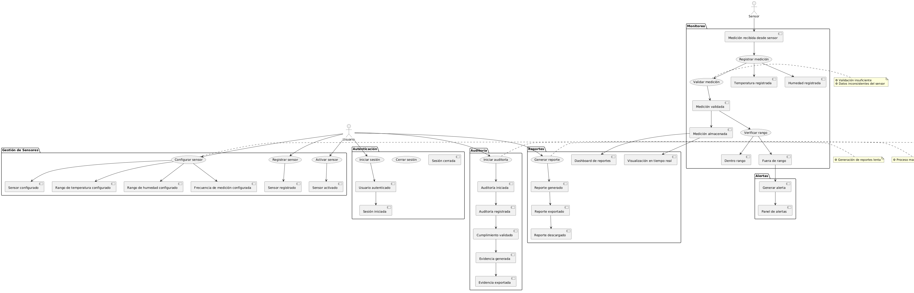

## 1. Bounded Context: Autenticación
### Explicación
Este contexto gestiona el acceso de los usuarios al sistema mediante el inicio y cierre de sesión. Se encarga de validar credenciales, controlar sesiones activas y generar eventos como usuario autenticado o sesión iniciada/cerrada.

### Justificación
Se separa este contexto porque la seguridad es un aspecto crítico y transversal en cualquier sistema. Al aislar la autenticación:
- Se reduce el riesgo de accesos no autorizados.
- Se facilita la implementación de mecanismos avanzados como OAuth, JWT o autenticación multifactor.
- Se evita mezclar la lógica de seguridad con la lógica de negocio principal.
- Permite escalar y mantener este módulo de forma independiente.


## 2. Bounded Context: Gestión de Sensores

### Explicación
Este contexto administra todo el ciclo de vida de los sensores: registro, configuración, activación y vinculación con activos. Además, define parámetros clave como rangos de temperatura, humedad y frecuencia de medición.

### Justificación
Se separa porque la configuración de sensores define el comportamiento del sistema. Al aislarlo:
- Se centraliza la lógica de configuración.
- Se reducen errores por parámetros mal definidos.
- Se permite modificar reglas sin afectar otros contextos.
- Facilita la reutilización en otros sistemas IoT.


## 3. Bounded Context: Monitoreo

### Explicación
Es el núcleo del sistema. Aquí se reciben las mediciones del sensor, se registran, validan y se verifica si están dentro o fuera de los rangos definidos. Finalmente, las mediciones se almacenan.

### Justificación
Se separa porque es el proceso principal del negocio. Este contexto:
- Maneja alta carga de datos en tiempo real.
- Requiere eficiencia y baja latencia.
- Permite escalar de forma independiente (por ejemplo, usando streaming).
- Evita mezclar procesamiento de datos con visualización o alertas.


## 4. Bounded Context: Alertas

### Explicación
Se encarga de generar notificaciones cuando una medición está fuera de los rangos establecidos. También gestiona la visualización de alertas en el sistema.

### Justificación
Se desacopla para permitir una respuesta rápida ante eventos críticos:
- Permite implementar distintos canales de notificación (email, SMS, etc.).
- Evita sobrecargar el contexto de monitoreo.
- Facilita la extensión del sistema sin afectar la lógica principal.


## 5. Bounded Context: Reportes

### Explicación
Gestiona la generación, visualización y exportación de reportes. Incluye dashboards, historial de mediciones y visualización en tiempo real.

### Justificación
Se separa porque el análisis de datos tiene necesidades distintas al procesamiento:
- Requiere consultas complejas y agregaciones.
- Puede optimizarse con técnicas como caching o data warehousing.
- Evita afectar el rendimiento del monitoreo en tiempo real.
- Permite escalar de forma independiente.


## 6. Bounded Context: Auditoría

### Explicación
Este contexto controla el cumplimiento del sistema mediante auditorías. Permite iniciar auditorías, registrar resultados, validar cumplimiento y generar evidencias exportables.

### Justificación
Se aísla porque la auditoría responde a necesidades de control y cumplimiento:
- Garantiza trazabilidad de las acciones del sistema.
- Permite cumplir con normativas o estándares.
- Facilita la generación de evidencia sin afectar otros procesos.
- Puede evolucionar hacia automatización completa sin impactar otros contextos.


## Problemas Identificados y Relación con Contextos

- Datos inconsistentes del sensor → Monitoreo  
- Validación insuficiente → Monitoreo  
- Configuración manual del sensor → Gestión de Sensores  
- Parámetros mal definidos → Gestión de Sensores  
- Generación de reportes lenta → Reportes  
- Proceso de auditoría manual → Auditoría  

### Justificación General
Estos problemas evidencian la necesidad de separar responsabilidades. La aplicación de Bounded Contexts permite:
- Reducir el acoplamiento entre módulos.
- Mejorar la mantenibilidad del sistema.
- Escalar componentes de forma independiente.
- Aplicar principios de Domain-Driven Design de manera efectiva.


### 4.6.2. Software Architecture Context Diagram.

El diagrama de contexto de ColdTrace muestra, de forma general, a los actores que interactúan con la plataforma y a los sistemas externos de los que depende. En esta vista se ubica a ColdTrace como sistema central y se identifican sus principales entradas y salidas.

<p align="center">
  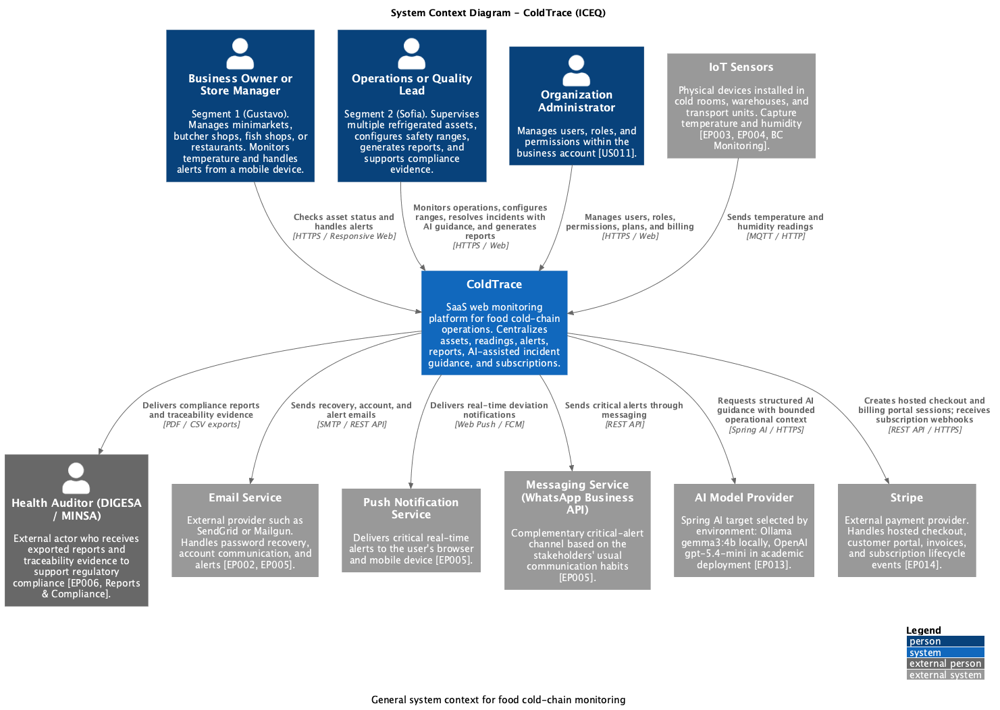
</p>

<p align="center">
  <em>Figura 4.6.2. Context Diagram del sistema ColdTrace siguiendo el modelo C4.</em>
</p>

> El código fuente del diagrama en PlantUML se encuentra en [`assets/chapter-04/contextdiagram/contextdiagram.puml`](assets/chapter-04/contextdiagram/contextdiagram.puml). Para regenerar la imagen, se puede renderizar localmente con `plantuml contextdiagram.puml` o pegando el contenido en [PlantText](https://www.planttext.com/).

### 4.6.3. Software Architecture Container Diagrams.

El diagrama de contenedores muestra cómo se divide ColdTrace en sus principales aplicaciones, servicios y bases de datos. En esta vista se identifican la landing page, la web application, el API Gateway, el IoT Gateway, los servicios por bounded context y la capa de datos asociada a cada uno.

<p align="center">
  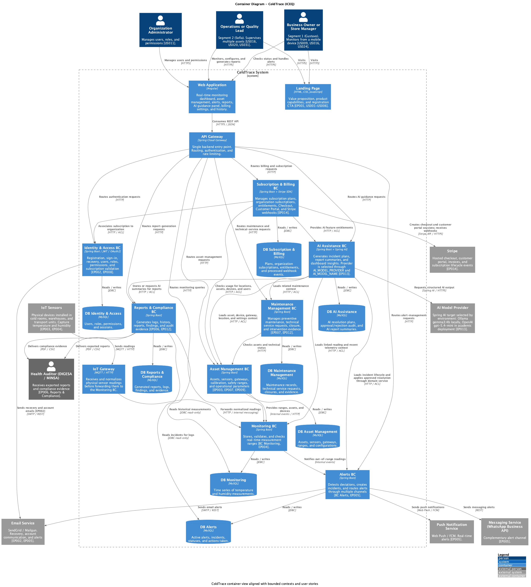
</p>

<p align="center">
  <em>Figura 4.6.3. Container Diagram del sistema ColdTrace.</em>
</p>

> El código fuente del diagrama en PlantUML se encuentra en [`assets/chapter-04/containerdiagram/containerdiagram.puml`](assets/chapter-04/containerdiagram/containerdiagram.puml). Para regenerar la imagen, se puede renderizar localmente con `plantuml containerdiagram.puml` o pegando el contenido en [PlantText](https://www.planttext.com/).

### 4.6.4. Software Architecture Components Diagrams.

En esta sección se presenta la vista de componentes de ColdTrace por bounded context. Cada diagrama muestra los componentes internos principales y sus relaciones dentro del contexto correspondiente.

- **Diagrama de componentes - Autenticación:** Muestra los componentes encargados del registro, inicio de sesión, recuperación de contraseña y gestión de roles y permisos.

<p align="center">
  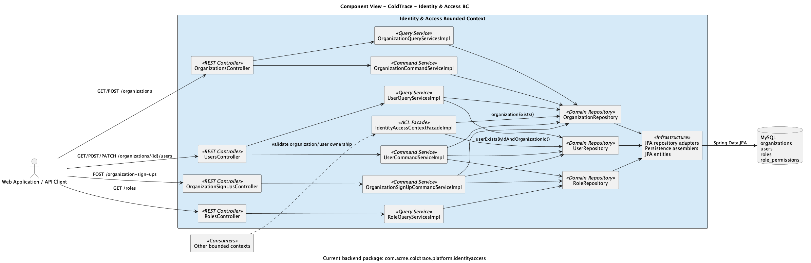
  <br>
  <em>Figura 4.6.4.1. Component Diagram del BC Autenticación.</em>
</p>

> El código fuente en PlantUML se encuentra en [`assets/chapter-04/diagramcomponents/component-autenticacion.puml`](assets/chapter-04/diagramcomponents/component-autenticacion.puml).

- **Diagrama de componentes - Gestión de Sensores:** Muestra los componentes encargados del registro y configuración de equipos monitoreados, sensores, gateways y rangos operativos.

<p align="center">
  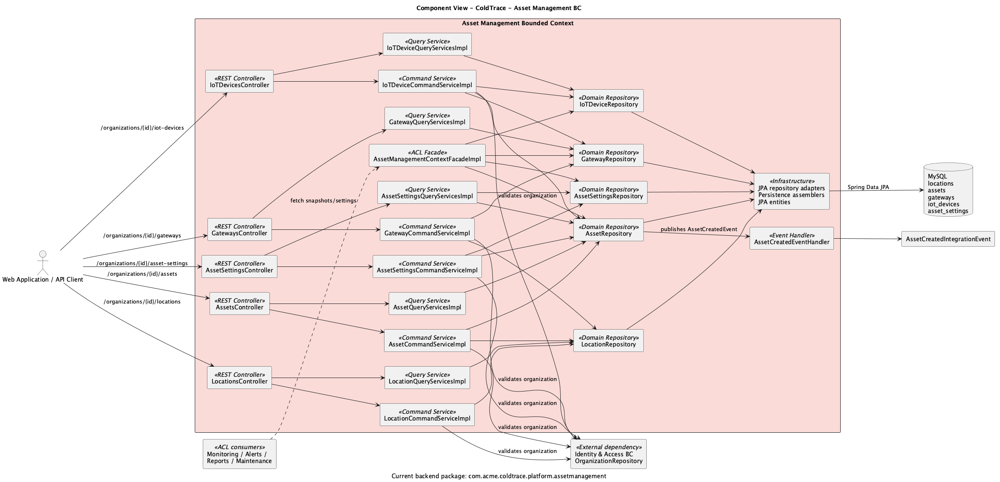
  <br>
  <em>Figura 4.6.4.2. Component Diagram del BC Gestión de Sensores.</em>
</p>

> El código fuente en PlantUML se encuentra en [`assets/chapter-04/diagramcomponents/component-sensores.puml`](assets/chapter-04/diagramcomponents/component-sensores.puml).

- **Diagrama de componentes - Monitoreo:** Muestra los componentes que reciben, validan y consultan las lecturas de temperatura y humedad.

<p align="center">
  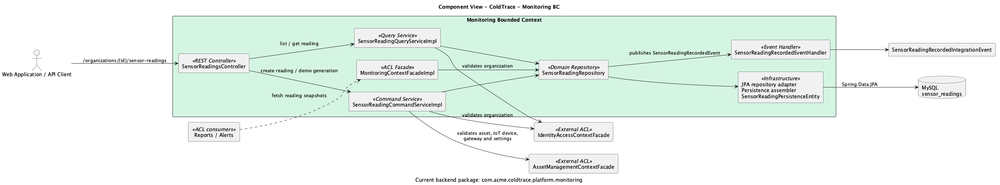
  <br>
  <em>Figura 4.6.4.3. Component Diagram del BC Monitoreo.</em>
</p>

> El código fuente en PlantUML se encuentra en [`assets/chapter-04/diagramcomponents/component-monitoreo.puml`](assets/chapter-04/diagramcomponents/component-monitoreo.puml).

- **Diagrama de componentes - Alertas:** Muestra los componentes encargados de generar, enrutar, escalar y cerrar alertas e incidencias.

<p align="center">
  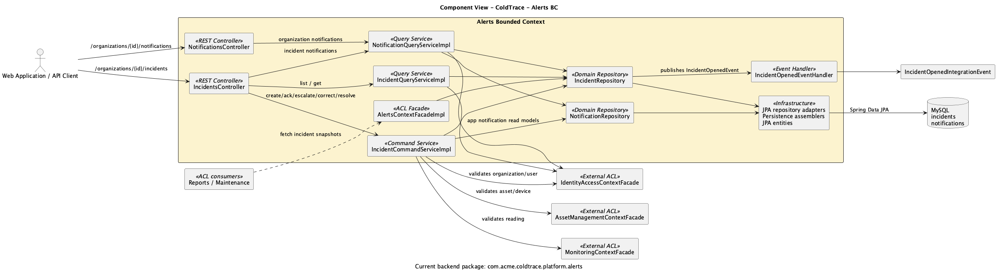
  <br>
  <em>Figura 4.6.4.4. Component Diagram del BC Alertas.</em>
</p>

> El código fuente en PlantUML se encuentra en [`assets/chapter-04/diagramcomponents/component-alertas.puml`](assets/chapter-04/diagramcomponents/component-alertas.puml).

- **Diagrama de componentes - Reportes:** Muestra los componentes responsables de generar dashboards, históricos, bitácoras y reportes exportables.

<p align="center">
  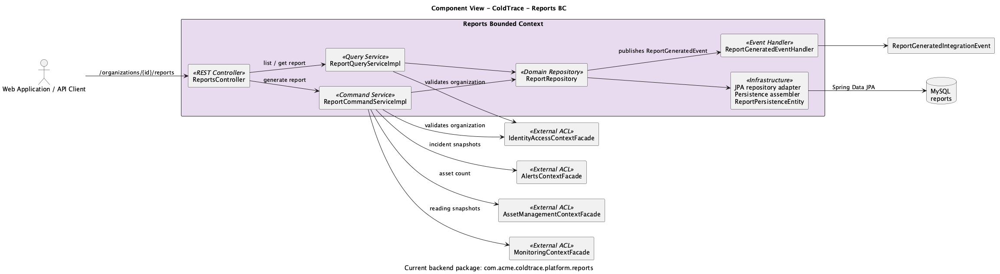
  <br>
  <em>Figura 4.6.4.5. Component Diagram del BC Reportes.</em>
</p>

> El código fuente en PlantUML se encuentra en [`assets/chapter-04/diagramcomponents/component-reportes.puml`](assets/chapter-04/diagramcomponents/component-reportes.puml).

- **Diagrama de componentes - Auditoría:** Muestra los componentes responsables de iniciar auditorías, validar cumplimiento y gestionar evidencias.

<p align="center">
  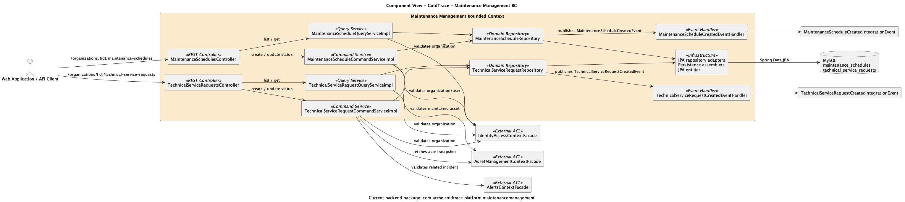
  <br>
  <em>Figura 4.6.4.6. Component Diagram del BC Auditoría.</em>
</p>

> El código fuente en PlantUML se encuentra en [`assets/chapter-04/diagramcomponents/component-auditoria.puml`](assets/chapter-04/diagramcomponents/component-auditoria.puml).

---

## 4.7. Software Object-Oriented Design.

### 4.7.1. Class Diagrams.

La documentación del diagrama de clases de ColdTrace se presenta en **tres etapas**. Cada una muestra el dominio con un nivel de detalle distinto.

#### Etapa 1: Diagrama de clases con enfoque DDD

En esta primera etapa se modela el dominio de ColdTrace con enfoque **DDD** y tipos Java. Aquí se identifican las entidades, clases abstractas y enumeraciones principales del sistema.

Se aplican dos patrones de diseño clásicos, visibles mediante la interfaz correspondiente en el diagrama:

- **Builder** — la interfaz `Constructor`, la clase `ActivoBuilder` y el director `ActivoDirector` encapsulan la creación de activos refrigerados compuestos (cámara frigorífica, almacén, unidad de transporte) con sus sensores y ubicación. El director mantiene una referencia al builder y expone métodos de alto nivel (`construirCamaraFrigorifica`, `construirAlmacen`, `construirUnidadTransporte`).
- **Canales de notificación (interface + implementaciones)** — la interfaz `CanalNotificacion` con las clases `CanalEmail`, `CanalPush` y `CanalWhatsApp` permite entregar alertas por el canal adecuado según la `PreferenciaNotificacion` del usuario y la severidad de la alerta.

Se incluye una única clase de repositorio (`UsuarioRepository`) siguiendo el mismo criterio que el proyecto de referencia, manteniendo el diagrama enfocado en el dominio y dejando la infraestructura de persistencia para las etapas siguientes.

Principales clases por bounded context:

- **BC Autenticación:** `Usuario`, `Sesion`, `Rol`, `Permiso`, `Organizacion`, `Suscripcion` y `PreferenciaNotificacion`. Enums: `EstadoUsuario`, `EstadoSuscripcion` [US007-US011, EP002].
- **BC Gestión de Sensores:** `Activo` (con el value object `Ubicacion` para activos móviles con latitud/longitud), `Sensor` y `Gateway` como clases independientes (un gateway sirve a múltiples sensores), `RangoTemperatura` y `RangoHumedad` separados por tipo. Enums: `TipoActivo`, `EstadoActivo`, `TipoSensor`, `EstadoSensor`, `EstadoGateway` [EP003, EP007].
- **BC Monitoreo:** `Medicion` como clase abstracta especializada en `LecturaTemperatura` y `LecturaHumedad`. Enum: `EstadoMedicion` [EP004].
- **BC Alertas:** `ReglaAlerta` (define umbral, duración y severidad; evalúa mediciones y genera alertas), `Alerta`, `Incidencia` y `Notificacion`. Enums: `TipoAlerta`, `Severidad`, `EstadoAlerta` [EP005].
- **BC Reportes:** `Reporte` como clase abstracta especializada en `ReporteHistorico`, `ReporteBitacora` y `ReporteCumplimiento`; `Dashboard` con `Widget`. Enums: `TipoReporte`, `FormatoExportacion` [EP006].
- **BC Auditoría:** `Auditoria`, `Evidencia` y `CriterioCumplimiento`. Enums: `TipoAuditoria`, `EstadoAuditoria`, `EstadoCumplimiento` para el cumplimiento normativo DIGESA / MINSA.

Aunque cada clase pertenece a un bounded context específico, el diagrama preserva las **relaciones entre clases de distintos bounded contexts** (siguiendo el estilo aplicado en el ejemplo de referencia). Las referencias cross-BC se mantienen a nivel de identificador `UUID` en los atributos, respetando la frontera de cada contexto, y se muestran como líneas de asociación en el diagrama: `Organizacion` posee `Activo`s y `Gateway`s; `Sensor` genera `Medicion`es; `ReglaAlerta` evalúa una `Medicion` y genera la `Alerta` correspondiente; `Alerta` referencia a `Activo`, `Sensor` y `Medicion`; `Incidencia` y `Alerta` referencian al `Usuario` responsable; `ReporteHistorico` consolida `Medicion`es y `ReporteBitacora` consolida `Incidencia`s; `Evidencia` respalda un `Reporte` y `Auditoria` los usa como evidencia de cumplimiento; `Auditoria`, `Dashboard` y `Reporte` referencian al `Usuario` y a la `Organizacion` correspondiente.

<p align="center">
  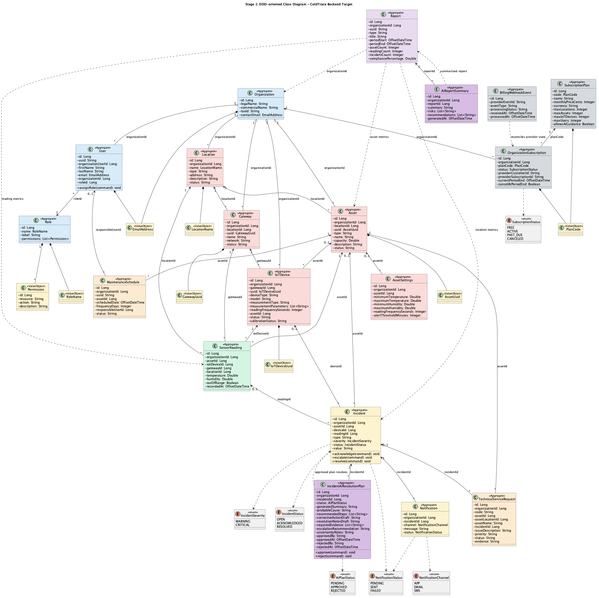
  <br>
  <em>Figura 4.7.1.1. Etapa 1 - Diagrama de Clases con enfoque DDD.</em>
</p>

> El código fuente en PlantUML se encuentra en [`assets/chapter-04/classdiagram/classdiagram-etapa1-ddd.puml`](assets/chapter-04/classdiagram/classdiagram-etapa1-ddd.puml). Para regenerar la imagen se puede renderizar localmente con `plantuml classdiagram-etapa1-ddd.puml` o pegando el contenido en [PlantText](https://www.planttext.com/).

#### Etapa 2: Agrupar las clases en Bounded Context

En esta segunda etapa las clases se agrupan según el bounded context al que pertenecen. Esto permite visualizar mejor las fronteras del dominio.

Agrupamiento aplicado en el diagrama:

- **BC Autenticación** (azul claro): `Usuario`, `Sesion`, `Rol`, `Permiso`, `Organizacion`, `Suscripcion`, `PreferenciaNotificacion`, `UsuarioRepository`, junto con los enums `EstadoUsuario` y `EstadoSuscripcion`.
- **BC Gestión de Sensores** (rosado): `Activo`, `Ubicacion`, `Sensor`, `Gateway`, `RangoTemperatura`, `RangoHumedad`, la interfaz `Constructor` y las clases `ActivoBuilder` / `ActivoDirector`, junto con los enums `TipoActivo`, `EstadoActivo`, `TipoSensor`, `EstadoSensor` y `EstadoGateway`.
- **BC Monitoreo** (verde): la clase abstracta `Medicion`, las especializaciones `LecturaTemperatura` y `LecturaHumedad`, y el enum `EstadoMedicion`.
- **BC Alertas** (amarillo): `ReglaAlerta`, `Alerta`, `Incidencia`, `Notificacion`, la interfaz `CanalNotificacion` con sus implementaciones `CanalEmail`, `CanalPush` y `CanalWhatsApp`, y los enums `TipoAlerta`, `Severidad` y `EstadoAlerta`.
- **BC Reportes** (morado): la clase abstracta `Reporte`, las especializaciones `ReporteHistorico`, `ReporteBitacora` y `ReporteCumplimiento`, junto con `Dashboard`, `Widget` y los enums `TipoReporte` y `FormatoExportacion`.
- **BC Auditoría** (naranja): `Auditoria`, `Evidencia`, `CriterioCumplimiento` y los enums `TipoAuditoria`, `EstadoAuditoria` y `EstadoCumplimiento`.

Las relaciones **internas a cada BC** (composiciones, agregaciones, herencias y realizaciones) quedan contenidas dentro del paquete correspondiente, mientras que las **relaciones entre bounded contexts** (por ejemplo, `Organizacion` → `Activo`, `Sensor` → `Medicion`, `ReglaAlerta` → `Medicion`, `Alerta` → `Activo`/`Sensor`, `ReporteHistorico` → `Medicion`, `Evidencia` → `Reporte`, `Auditoria` → `Usuario`/`Organizacion`) aparecen cruzando las fronteras de los paquetes, dejando explícitos los puntos de integración entre contextos y los lugares donde se sostiene la coherencia del dominio.

<p align="center">
  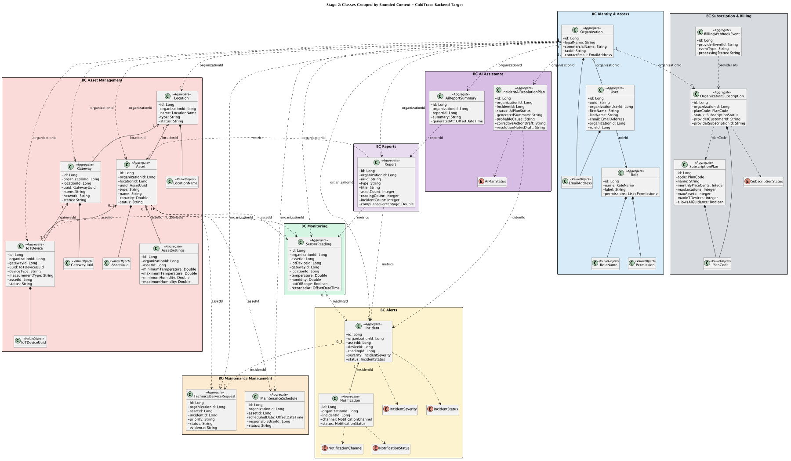
  <br>
  <em>Figura 4.7.1.2. Etapa 2 - Agrupar las clases en Bounded Context.</em>
</p>

> El código fuente en PlantUML se encuentra en [`assets/chapter-04/classdiagram/classdiagram-etapa2-bc.puml`](assets/chapter-04/classdiagram/classdiagram-etapa2-bc.puml). Para regenerar la imagen se puede renderizar localmente con `plantuml classdiagram-etapa2-bc.puml` o pegando el contenido en [PlantText](https://www.planttext.com/).

#### Etapa 3: Identificación de Value Object, Entity y Aggregate

En esta tercera etapa las clases se clasifican como **Aggregate**, **Entity** y **Value Object**. Cada bounded context se presenta por separado para facilitar su lectura.

Con esta clasificación se cumple una regla fundamental de DDD: **fuera del aggregate sólo se navega a su raíz mediante un identificador tipado (VO)**, nunca por referencia directa a entidades internas del agregado. Así, por ejemplo, `Alerta` no guarda un puntero directo a `Sensor` sino un `SensorId`, y `Auditoria` se vincula con `Reporte` a través de un `ReporteId` sostenido por cada `Evidencia`. Esta disciplina preserva la consistencia transaccional dentro de cada contexto y deja explícitas las fronteras que cruzan los microservicios definidos en la sección 4.6.

**BC Autenticación.** Aggregates → `Usuario` (gestiona sus `Sesion`es, `Rol`es y su `PreferenciaNotificacion`) y `Organizacion` (gestiona su `Suscripcion` y los `Usuario`s que la integran). Entities → `Sesion`, `Rol` y `Suscripcion`. Value Objects → `Permiso` (tupla nombre/recurso/acción inmutable) y `PreferenciaNotificacion` (conjunto de canales, horarios y severidad mínima sin identidad propia). Este BC no necesita VO de ID cross-BC porque sus aggregates (`Usuario` y `Organizacion`) son referenciados desde otros contextos, no consumidores de referencias externas.

<p align="center">
  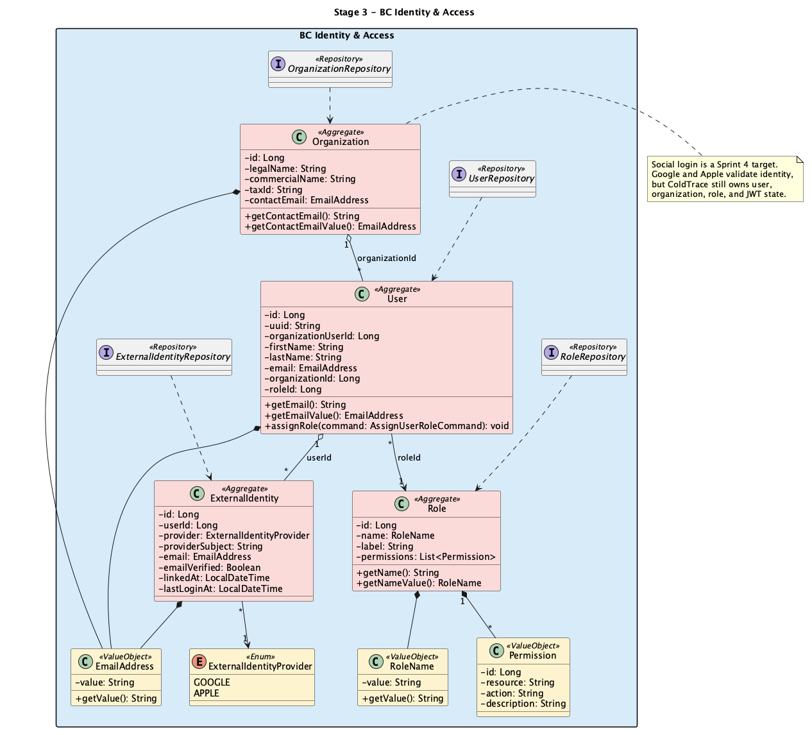
  <br>
  <em>Figura 4.7.1.3.1. Etapa 3 - BC Autenticación.</em>
</p>

> Código PlantUML: [`assets/chapter-04/classdiagram/classdiagram-etapa3-bc-autenticacion.puml`](assets/chapter-04/classdiagram/classdiagram-etapa3-bc-autenticacion.puml).

**BC Gestión de Sensores.** Aggregates → `Activo` (raíz que contiene su `Ubicacion` y sus `Sensor`es asignados) y `Gateway` (raíz que agrupa los `Sensor`es conectados por red). Entities → `Sensor`, `ActivoBuilder` y `ActivoDirector`. Value Objects → `Ubicacion` (dirección, coordenadas y marcador de movilidad, inmutable), `RangoTemperatura` y `RangoHumedad` (pares min/max sin identidad propia), más el VO de ID `OrganizacionId` que referencia al aggregate `Organizacion` del BC Autenticación.

<p align="center">
  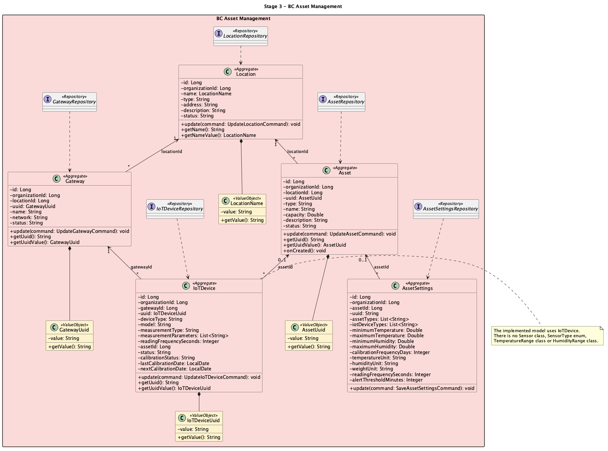
  <br>
  <em>Figura 4.7.1.3.2. Etapa 3 - BC Gestión de Sensores.</em>
</p>

> Código PlantUML: [`assets/chapter-04/classdiagram/classdiagram-etapa3-bc-gestion-sensores.puml`](assets/chapter-04/classdiagram/classdiagram-etapa3-bc-gestion-sensores.puml).

**BC Monitoreo.** Aggregate → `Medicion` (abstracto, raíz de las lecturas generadas por un `Sensor`). Entities → `LecturaTemperatura` y `LecturaHumedad` como especializaciones concretas del agregado. Value Object → `SensorId` para referenciar por ID al aggregate `Sensor` del BC Gestión de Sensores, sin acoplamiento directo a su estructura interna.

<p align="center">
  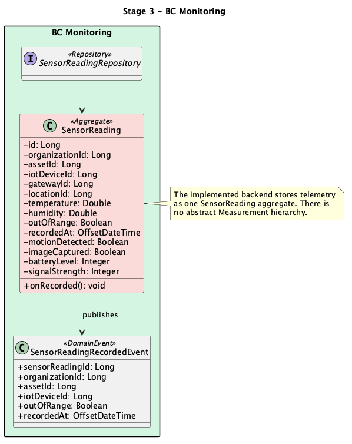
  <br>
  <em>Figura 4.7.1.3.3. Etapa 3 - BC Monitoreo.</em>
</p>

> Código PlantUML: [`assets/chapter-04/classdiagram/classdiagram-etapa3-bc-monitoreo.puml`](assets/chapter-04/classdiagram/classdiagram-etapa3-bc-monitoreo.puml).

**BC Alertas.** Aggregates → `Alerta` (gestiona sus `Incidencia`s y `Notificacion`es como parte del mismo agregado transaccional) y `ReglaAlerta` (evalúa las `Medicion`es y genera `Alerta`s). Entities → `Incidencia`, `Notificacion`, `CanalEmail`, `CanalPush` y `CanalWhatsApp`. Value Objects → `SensorId`, `ActivoId`, `MedicionId` y `UsuarioId` para todas las referencias cross-BC, más la interfaz `CanalNotificacion` que abstrae el canal de entrega.

<p align="center">
  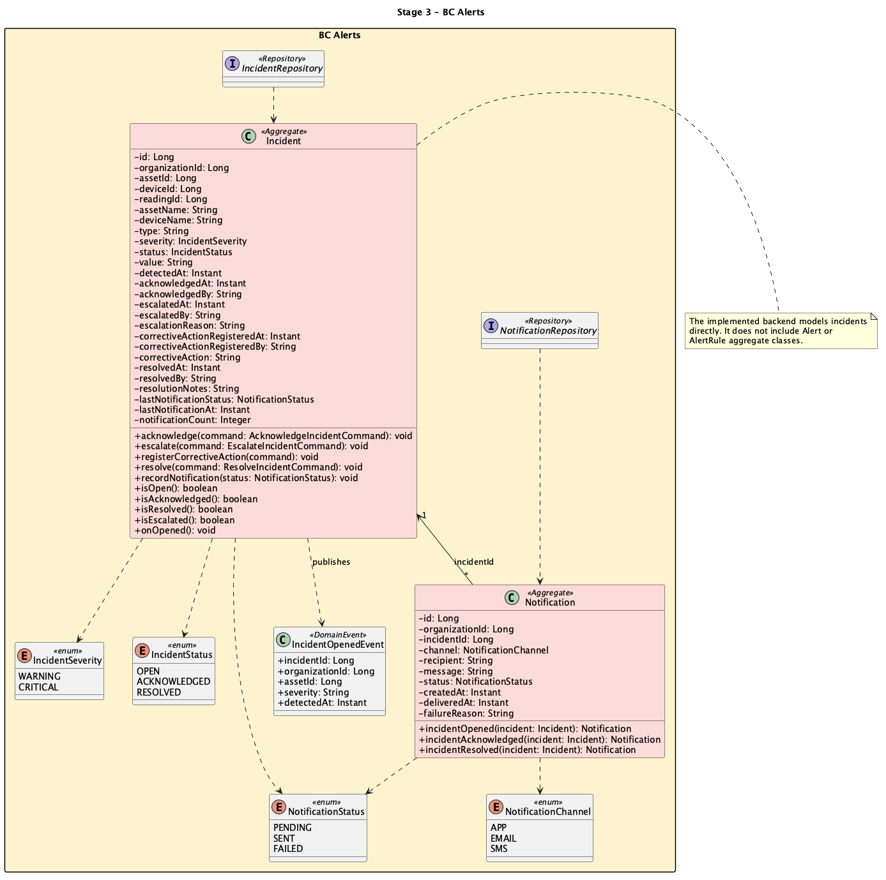
  <br>
  <em>Figura 4.7.1.3.4. Etapa 3 - BC Alertas.</em>
</p>

> Código PlantUML: [`assets/chapter-04/classdiagram/classdiagram-etapa3-bc-alertas.puml`](assets/chapter-04/classdiagram/classdiagram-etapa3-bc-alertas.puml).

**BC Reportes.** Aggregates → `Reporte` (abstracto, raíz de los reportes generados en sus tres variantes concretas) y `Dashboard` (raíz que agrupa sus `Widget`s configurables). Entities → `ReporteHistorico`, `ReporteBitacora`, `ReporteCumplimiento` y `Widget`. Value Objects → `UsuarioId`, `OrganizacionId` y `MedicionId` para vincular reportes y dashboards a usuarios, organizaciones y mediciones por ID.

<p align="center">
  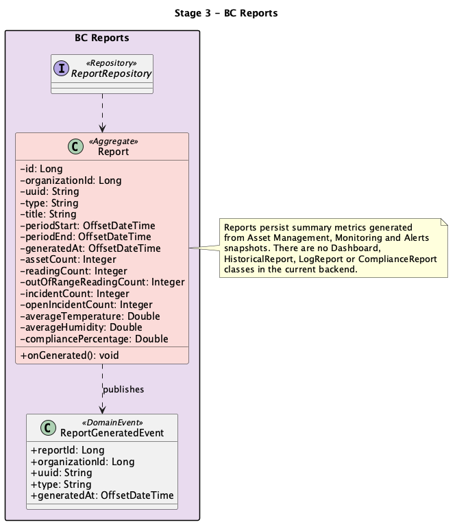
  <br>
  <em>Figura 4.7.1.3.5. Etapa 3 - BC Reportes.</em>
</p>

> Código PlantUML: [`assets/chapter-04/classdiagram/classdiagram-etapa3-bc-reportes.puml`](assets/chapter-04/classdiagram/classdiagram-etapa3-bc-reportes.puml).

**BC Auditoría.** Aggregate → `Auditoria` (raíz que contiene sus `Evidencia`s recopiladas y sus `CriterioCumplimiento`s evaluados). Entities → `Evidencia` y `CriterioCumplimiento`. Value Objects → `UsuarioId`, `OrganizacionId` y `ReporteId` para vincular evidencias a reportes y auditorías a usuarios y organizaciones sin acoplamiento directo a los otros contextos.

<p align="center">
  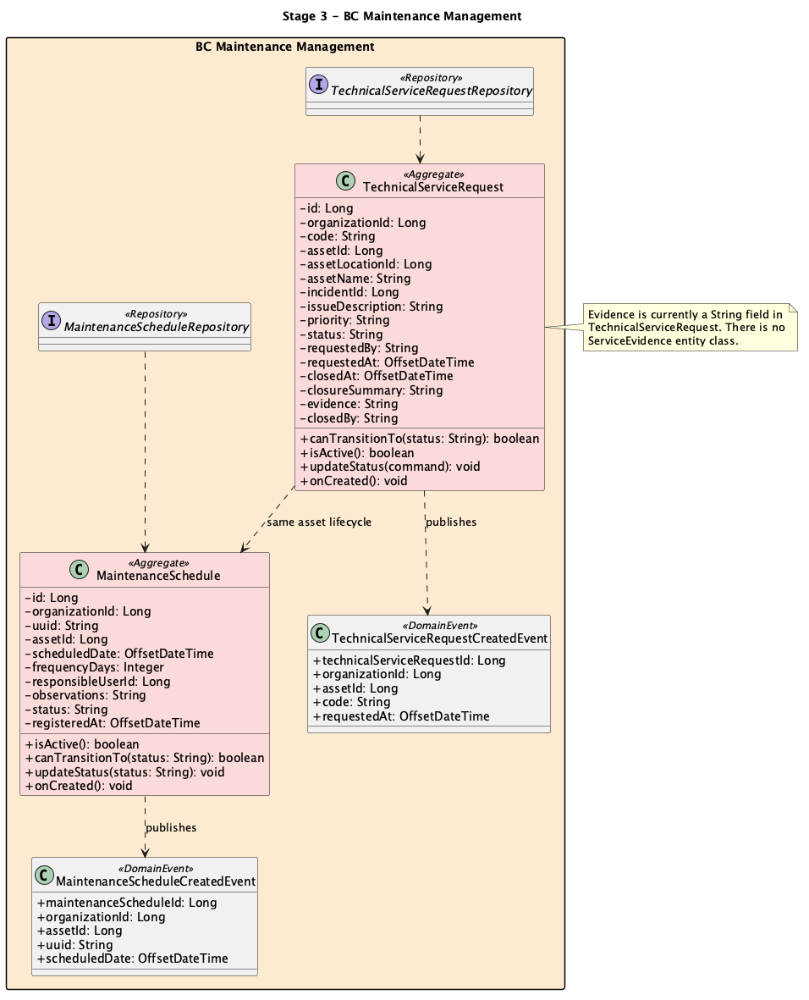
  <br>
  <em>Figura 4.7.1.3.6. Etapa 3 - BC Auditoría.</em>
</p>

> Código PlantUML: [`assets/chapter-04/classdiagram/classdiagram-etapa3-bc-auditoria.puml`](assets/chapter-04/classdiagram/classdiagram-etapa3-bc-auditoria.puml).

---

## 4.8. Database Design.

### 4.8.1. Database Diagrams.

Para el planteamiento de la base de datos de ColdTrace se identificaron primero las tablas principales del sistema y luego se agruparon según los bounded contexts definidos previamente. Después se establecieron las relaciones entre ellas y se añadieron tablas intermedias en los casos necesarios para manejar correctamente las relaciones y mantener el modelo en **Tercera Forma Normal (3FN)**. Todo esto da como resultado el siguiente diagrama.

<p align="center">
  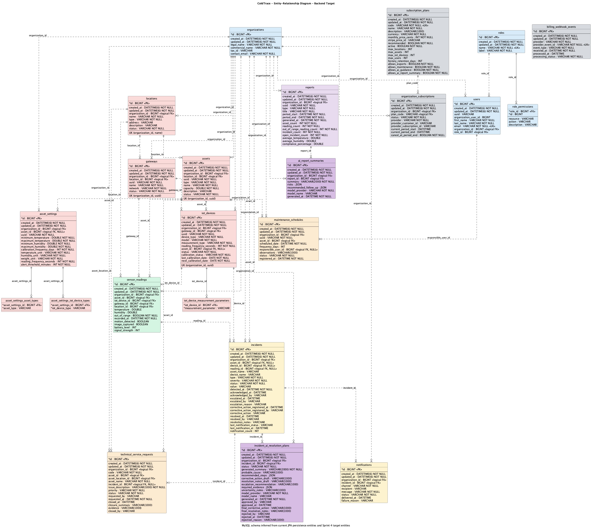
  <br>
  <em>Figura 4.8.1.1. Diagrama Entidad-Relación de ColdTrace normalizado a 3FN.</em>
</p>

> El código fuente en PlantUML se encuentra en [`assets/chapter-04/databasediagram/databasediagram.puml`](assets/chapter-04/databasediagram/databasediagram.puml). Para regenerar la imagen se puede renderizar localmente con `plantuml databasediagram.puml` o pegando el contenido en [PlantText](https://www.planttext.com/).
