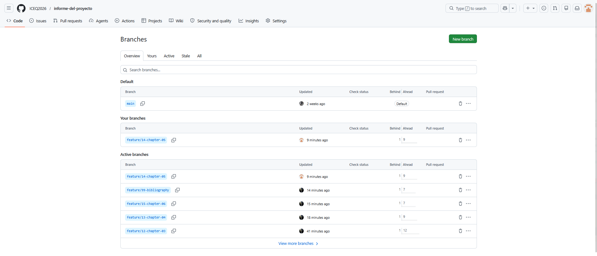
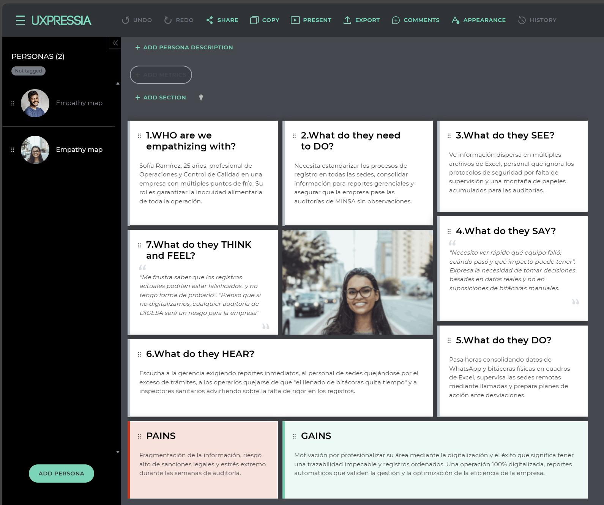
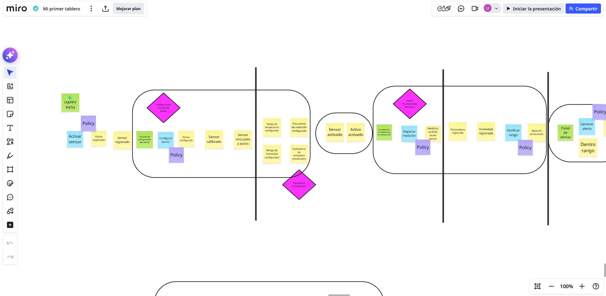
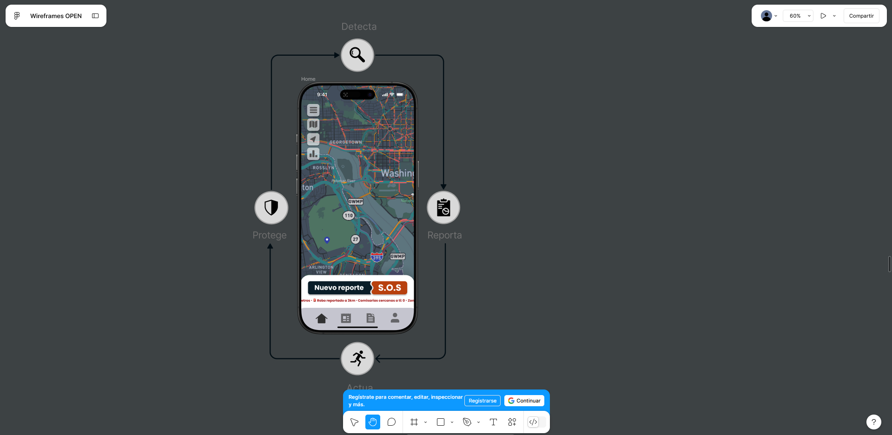

# Capítulo V: Product Implementation, Validation & Deployment

## 5.1. Software Configuration Management

### 5.1.1. Software Development Environment Configuration

En esta sección se describen las herramientas de software utilizadas por el equipo para el desarrollo colaborativo del proyecto. Estas plataformas permiten organizar el trabajo, diseñar la experiencia de usuario, modelar procesos, gestionar el código fuente y documentar el avance del producto durante su ciclo de vida. La selección de estas herramientas responde a la necesidad de mantener un entorno de trabajo colaborativo, accesible y alineado con las prácticas del curso.

### Github

Plataforma utilizada para el guardar versiones del proyecto.

[GitHub](https://github.com/)




### Uxpressia

Herramiento usada para la elabnoracion de user personas y impact mapping.

[UXPressia](https://uxpressia.com/)



### Miro

Plataforma usada para el eventstorming.

[Miro](https://miro.com/)




### Figma

La herramienta usada para desarrollo conjunto de wireframes y mockups.

[Figma](https://www.figma.com/)




### 5.1.2. Source Code Management

La gestión del código fuente del proyecto se realizó mediante la plataforma GitHub, la cual permitió organizar, controlar y dar seguimiento a los cambios realizados durante el desarrollo del informe.

Los repositorios usados fueron:

- Repositorio del proyecto: https://github.com/ICEQ2026/informe-del-proyecto  

Este repositorio contiene la estructura completa del informe, organizada por capítulos, lo que permite una gestión modular y colaborativa del contenido.

### Workflow de Control de Versiones

Para la gestión del desarrollo se utilizó un flujo de trabajo basado en ramas, donde cada integrante del equipo trabajó de manera independiente sobre una rama específica antes de integrar sus cambios a la rama principal.

Las ramas identificadas en el repositorio son:

- **main**: rama principal que contiene la versión estable del proyecto.
- **feature/**: ramas utilizadas para el desarrollo de secciones específicas del informe.

<p align="center">
  
</p>

<p align="center">
  Ramas del repositorio del proyecto, evidenciando el uso de ramas feature para el desarrollo independiente de cada sección.
</p>

### Convenciones de Ramas

Se utilizó una convención de nombres basada en el contenido desarrollado, lo cual se evidencia en las siguientes ramas:

- feature/14-chapter-05  
- feature/13-chapter-04  
- feature/12-chapter-03  
- feature/15-chapter-06  
- feature/99-bibliography  

Cada rama representa un capítulo o sección del informe, permitiendo que los integrantes trabajen de forma paralela sin interferir en el trabajo de otros.

Este enfoque facilita la organización del proyecto y permite una integración más controlada de los cambios.

### Conventional Commits

Para estandarizar los mensajes de commits, se utilizó la convención de Conventional Commits, permitiendo clasificar los cambios realizados y mejorar la trazabilidad del repositorio.

<p align="center">
  
</p>

<p align="center">
  Comitts realizdos evidenciando el uso de conventional commits para clasificar los tipos de cambios.
</p>

Los tipos de commits utilizados incluyen:

- **feat**: incorporación de nuevo contenido  
- **docs**: modificaciones en la documentación  
- **fix**: corrección de errores  
- **chore**: tareas de mantenimiento  

El uso de estas convenciones facilita la comprensión del historial de cambios y mejora la colaboración entre los integrantes del equipo.

La evidencia mostrada refleja el uso de un flujo de trabajo basado en ramas feature, permitiendo una correcta organización del desarrollo y facilitando la integración de los aportes de cada integrante.

### 5.1.3. Source Code Style Guide & Conventions

Con el objetivo de garantizar la consistencia, legibilidad y mantenibilidad del proyecto, el equipo definió una guía de estilo basada en la estructura real de la Landing Page y en buenas prácticas de desarrollo web. Estas convenciones permiten que todos los integrantes trabajen de manera ordenada, facilitan la colaboración en el repositorio y mejoran la escalabilidad del producto.

Siguiendo lo solicitado por el curso, se adoptó el uso de nomenclatura en inglés para los elementos del código fuente. Además, se establecieron criterios comunes para la organización de archivos, definición de estilos, escritura de scripts y manejo de contenidos multilenguaje.

#### Naming conventions

Se utilizó nomenclatura en inglés para todos los elementos del código. Los archivos fueron nombrados según su funcionalidad, lo que facilita su comprensión y mantenimiento.

Ejemplos del proyecto:

- `navigation.js` → manejo de navegación  
- `scroll-reveal.js` → animaciones  
- `variables.css` → variables de diseño  
- `en-US.json` → traducciones en inglés  

Estas convenciones permiten identificar rápidamente el propósito de cada archivo.

#### CSS Style Guide

Para mantener la consistencia visual, se definieron variables globales en CSS que permiten reutilizar colores, tipografías y espaciados en toda la aplicación:

```css
:root {
  --color-primary: #1b59f8;
  --color-secondary-purple: #b899eb;

  --font-family-base: "Inter", "Helvetica Neue", Arial, sans-serif;

  --spacing-md: 16px;
  --spacing-xl: 48px;

  --radius-md: 8px;
}
```

El uso de variables CSS permite centralizar el diseño visual, evitando duplicidad de valores y facilitando futuras modificaciones.

#### JavaScript Conventions

Los archivos JavaScript fueron organizados por funcionalidad, promoviendo la modularidad del código. Se utilizaron funciones con nombres descriptivos en inglés y estructuras claras.

Ejemplo del proyecto:

```js
const toggleMobileMenu = () => {
  if (!moreButton || !mobileMenu) return;

  if (mobileMenu.classList.contains('is-open')) {
    closeMobileMenu();
    return;
  }

  openMobileMenu();
};
```

Este enfoque mejora la legibilidad del código y facilita su mantenimiento.

#### Internacionalización (i18n)

El proyecto incluye soporte para múltiples idiomas mediante archivos JSON ubicados en `assets/locales/`. Cada archivo contiene las traducciones utilizadas en la interfaz.

Ejemplo:

```json
{
  "hero": {
    "title": "All your storage infrastructure under a single intelligent platform",
    "ctaDemo": "Try a demo"
  }
}
```

La implementación de internacionalización permite que la aplicación sea escalable a diferentes mercados y mejora la experiencia del usuario.

### 5.1.4. Software Deployment Configuration

[pending content]

## 5.2. Landing Page, Services & Applications Implementation

### 5.2.1. Sprint 1

#### 5.2.1.1. Sprint Planning 1

<table border="1" cellpadding="6" cellspacing="0">
  <tr>
    <th>Sprint #</th>
    <td>Sprint n</td>
  </tr>

  <tr>
    <th colspan="2">Sprint Planning Background</th>
  </tr>

  <tr>
    <th>Date</th>
    <td>YYYY-MM-DD</td>
  </tr>

  <tr>
    <th>Time</th>
    <td>HH:MM AM/PM</td>
  </tr>

  <tr>
    <th>Location</th>
    <td>(Descripción de la ubicación de la reunión, física o virtual)</td>
  </tr>

  <tr>
    <th>Prepared By</th>
    <td>Jiménez Rosas, Arturo Eduardo</td>
  </tr>

  <tr>
    <th>Attendees (to planning meeting)</th>
    <td>Jiménez Rosas, Arturo Eduardo / Rodríguez Peña, Jorge Andrés / ...</td>
  </tr>

  <tr>
    <th>Sprint n − 1 Review Summary</th>
    <td>(Resumen del Sprint anterior, en términos de resultados alcanzados a nivel de productos de software, opiniones de miembros y feedback de product owner.)</td>
  </tr>

  <tr>
    <th>Sprint n − 1 Retrospective Summary</th>
    <td>(Resumen del Sprint anterior, en términos de opiniones de miembros del equipo sobre aciertos u oportunidades de mejora en su forma de trabajo)</td>
  </tr>

  <tr>
    <th colspan="2">Sprint Goal & User Stories</th>
  </tr>

  <tr>
    <th>Sprint n Goal</th>
    <td>(Definir el Goal del Sprint n y la métrica de cumplimiento.)</td>
  </tr>

  <tr>
    <th>Sprint n Velocity</th>
    <td>(Definir el Velocity establecido para el Sprint n, es decir cuántos Story Points puede aceptar el equipo para este Sprint n.)</td>
  </tr>

  <tr>
    <th>Sum of Story Points</th>
    <td>(Colocar la suma de los Story Points para los User Stories que se están incluyendo en este Sprint n.)</td>
  </tr>
</table>

#### 5.2.1.2. Aspect Leaders and Collaborators.

<table border="1" cellpadding="6" cellspacing="0">
  <tr>
    <th>Team Member (Last Name, First Name)</th>
    <th>GitHub Username</th>
    <th>Aspect Name 1<br>Leader (L) / Collaborator (C)</th>
    <th>Aspect Name 2<br>Leader (L) / Collaborator (C)</th>
    <th>...</th>
    <th>Aspect Name n<br>Leader (L) / Collaborator (C)</th>
  </tr>

  <tr>
    <td>Jiménez Rosas, Arturo Eduardo</td>
    <td>ajimenezrosas</td>
    <td>L</td>
    <td>C</td>
    <td>...</td>
    <td></td>
  </tr>

  <tr>
    <td>Rodríguez Peña, Jorge Andrés</td>
    <td>Japr91</td>
    <td>C</td>
    <td>C</td>
    <td>...</td>
    <td>L</td>
  </tr>
</table>

### 5.2.1.3. Sprint Backlog 1.

<table border="1" cellpadding="6" cellspacing="0" style="border-collapse: collapse; text-align: center;">
  
  <!-- Sprint -->
  <tr>
    <th>Sprint #</th>
    <td colspan="7">Sprint n</td>
  </tr>

  <!-- Encabezados principales -->
  <tr>
    <th colspan="2">User Story</th>
    <th colspan="6">Work-Item / Task</th>
  </tr>

  <!-- Subencabezados -->
  <tr>
    <th>Id</th>
    <th>Title</th>
    <th>Id</th>
    <th>Title</th>
    <th>Description</th>
    <th>Estimation (Hours)</th>
    <th>Assigned To</th>
    <th>Status (To-do / In-Process / To-Review / Done)</th>
  </tr>

  <!-- Filas de ejemplo -->
  <tr>
    <td>US-01</td>
    <td>Lorem Ipsum</td>
    <td>T-01</td>
    <td>Diseñar UI</td>
    <td>Crear interfaz de login</td>
    <td>4</td>
    <td>Arturo</td>
    <td>To-do</td>
  </tr>

  <tr>
    <td>US-01</td>
    <td>Lorem Ipsum</td>
    <td>T-02</td>
    <td>Validación backend</td>
    <td>Implementar autenticación</td>
    <td>6</td>
    <td>Jorge</td>
    <td>In-Process</td>
  </tr>

  <tr>
    <td>US-02</td>
    <td>Lorem Ipsum</td>
    <td>T-03</td>
    <td>Formulario registro</td>
    <td>Crear formulario</td>
    <td>5</td>
    <td>Arturo</td>
    <td>Done</td>
  </tr>

</table>

### 5.2.1.4. Development Evidence for Sprint Review.

<table border="1" cellpadding="6" cellspacing="0" style="border-collapse: collapse;">
  <tr>
    <th>Repository</th>
    <th>Branch</th>
    <th>Commit Id</th>
    <th>Commit Message</th>
    <th>Commit Message Body</th>
    <th>Committed on (Date)</th>
  </tr>
  <tr>
    <td>user/repositoryname</td>
    <td>feature/loremipsum</td>
    <td>14ca4e3</td>
    <td>feat: consectetur adipiscing elit</td>
    <td>Curabitur quis placerat nulla. Fusce malesuada faucibus quam, ut condimentum velit rutrum ut.</td>
    <td>04/09/2021</td>
  </tr>
</table>

### 5.2.1.5. Execution Evidence for Sprint Review.

[pending content]
  
### 5.2.1.5. Execution Evidence for Sprint Review.

[pending content]

### 5.2.1.6. Services Documentation Evidence for Sprint Review.

[pending content]

### 5.2.1.7. Software Deployment Evidence for Sprint Review.

[pending content]

### 5.2.1.8. Team Collaboration Insights during Sprint

[pending content]


## 5.3. Sprint Planning n
[pending content]
### Aspect Leaders and Collaborators
[pending content]
### Sprint Backlog n
[pending content]
### Development Evidence for Sprint Review
[pending content]
### Execution Evidence for Sprint Review
[pending content]
### Services Documentation Evidence for Sprint Review
[pending content]
### Software Deployment Evidence for Sprint Review
[pending content]
### Team Collaboration Insights during Sprint
[pending content]
### Validation Interviews
#### 5.3.1. Diseño de Entrevistas
[pending content]
#### 5.3.2. Registro de Entrevistas
[pending content]
#### 5.3.3. Evaluaciones según heurísticas
[pending content]
## 5.4. Video About-the-Product
[pending content]
