# Capítulo V: Product Implementation, Validation & Deployment

## 5.1. Software Configuration Management

### 5.1.1. Software Development Environment Configuration

En esta sección se describen las herramientas de software utilizadas por el equipo para el desarrollo colaborativo del proyecto. Estas plataformas permiten organizar el trabajo, diseñar la experiencia de usuario, modelar procesos, gestionar el código fuente y documentar el avance del producto durante su ciclo de vida. La selección de estas herramientas responde a la necesidad de mantener un entorno de trabajo colaborativo, accesible y alineado con las prácticas del curso.

### Github

Plataforma utilizada para el guardar versiones del proyecto.

[GitHub](https://github.com/)


### Uxpressia

Herramiento usada para la elabnoracion de user personas y impact mapping.

[UXPressia](https://uxpressia.com/)


### Miro

Plataforma usada para el eventstorming.

[Miro](https://miro.com/)


### Figma

La herramienta usada para desarrollo conjunto de wireframes y mockups.

[Figma](https://www.figma.com/)


### 5.1.2. Source Code Management

La gestión del código fuente del proyecto se realizó mediante la plataforma GitHub, la cual permitió organizar, controlar y dar seguimiento a los cambios realizados durante el desarrollo del informe.

Los repositorios usados fueron:

- Repositorio del proyecto: https://github.com/ICEQ2026/informe-del-proyecto
- Repositorio de la landing page: https://github.com/ICEQ2026/landingpage-coldtrace

Este repositorio contiene la estructura completa del informe, organizada por capítulos, lo que permite una gestión modular y colaborativa del contenido.

### Workflow de Control de Versiones

Para la gestión del desarrollo se utilizó un flujo de trabajo basado en ramas, donde cada integrante del equipo trabajó de manera independiente sobre una rama específica antes de integrar sus cambios a la rama principal.

Las ramas identificadas en el repositorio son:

- **main**: rama principal que contiene la versión estable del proyecto.
- **feature/**: ramas utilizadas para el desarrollo de secciones específicas del informe.

<p align="center">
  
</p>

<p align="center">
  Ramas del repositorio del proyecto, evidenciando el uso de ramas feature para el desarrollo independiente de cada sección.
</p>

### Convenciones de Ramas

Se utilizó una convención de nombres basada en el contenido desarrollado, lo cual se evidencia en las siguientes ramas:

- feature/14-chapter-05  
- feature/13-chapter-04  
- feature/12-chapter-03  
- feature/15-chapter-06  
- feature/99-bibliography  

Cada rama representa un capítulo o sección del informe, permitiendo que los integrantes trabajen de forma paralela sin interferir en el trabajo de otros.

Este enfoque facilita la organización del proyecto y permite una integración más controlada de los cambios.

### Conventional Commits

Para estandarizar los mensajes de commits, se utilizó la convención de Conventional Commits, permitiendo clasificar los cambios realizados y mejorar la trazabilidad del repositorio.

<p align="center">
  
</p>

<p align="center">
  Comitts realizdos evidenciando el uso de conventional commits para clasificar los tipos de cambios.
</p>

Los tipos de commits utilizados incluyen:

- **feat**: incorporación de nuevo contenido  
- **docs**: modificaciones en la documentación  
- **fix**: corrección de errores  
- **chore**: tareas de mantenimiento  

El uso de estas convenciones facilita la comprensión del historial de cambios y mejora la colaboración entre los integrantes del equipo.

La evidencia mostrada refleja el uso de un flujo de trabajo basado en ramas feature, permitiendo una correcta organización del desarrollo y facilitando la integración de los aportes de cada integrante.

### 5.1.3. Source Code Style Guide & Conventions

Con el objetivo de garantizar la consistencia, legibilidad y mantenibilidad del proyecto, el equipo definió una guía de estilo basada en la estructura real de la Landing Page y en buenas prácticas de desarrollo web. Estas convenciones permiten que todos los integrantes trabajen de manera ordenada, facilitan la colaboración en el repositorio y mejoran la escalabilidad del producto.

Siguiendo lo solicitado por el curso, se adoptó el uso de nomenclatura en inglés para los elementos del código fuente. Además, se establecieron criterios comunes para la organización de archivos, definición de estilos, escritura de scripts y manejo de contenidos multilenguaje.

#### Naming conventions

Se utilizó nomenclatura en inglés para todos los elementos del código. Los archivos fueron nombrados según su funcionalidad, lo que facilita su comprensión y mantenimiento.

Ejemplos del proyecto:

- `navigation.js` → manejo de navegación  
- `scroll-reveal.js` → animaciones  
- `variables.css` → variables de diseño  
- `en-US.json` → traducciones en inglés  

Estas convenciones permiten identificar rápidamente el propósito de cada archivo.

#### CSS Style Guide

Para mantener la consistencia visual, se definieron variables globales en CSS que permiten reutilizar colores, tipografías y espaciados en toda la aplicación:

```css
:root {
  --color-primary: #1b59f8;
  --color-secondary-purple: #b899eb;

  --font-family-base: "Inter", "Helvetica Neue", Arial, sans-serif;

  --spacing-md: 16px;
  --spacing-xl: 48px;

  --radius-md: 8px;
}
```

El uso de variables CSS permite centralizar el diseño visual, evitando duplicidad de valores y facilitando futuras modificaciones.

#### JavaScript Conventions

Los archivos JavaScript fueron organizados por funcionalidad, promoviendo la modularidad del código. Se utilizaron funciones con nombres descriptivos en inglés y estructuras claras.

Ejemplo del proyecto:

```js
const toggleMobileMenu = () => {
  if (!moreButton || !mobileMenu) return;

  if (mobileMenu.classList.contains('is-open')) {
    closeMobileMenu();
    return;
  }

  openMobileMenu();
};
```

Este enfoque mejora la legibilidad del código y facilita su mantenimiento.

#### Internacionalización (i18n)

El proyecto incluye soporte para múltiples idiomas mediante archivos JSON ubicados en `assets/locales/`. Cada archivo contiene las traducciones utilizadas en la interfaz.

Ejemplo:

```json
{
  "hero": {
    "title": "All your storage infrastructure under a single intelligent platform",
    "ctaDemo": "Try a demo"
  }
}
```

La implementación de internacionalización permite que la aplicación sea escalable a diferentes mercados y mejora la experiencia del usuario.

### 5.1.4. Software Deployment Configuration

En esta sección se describe la configuración del despliegue de la solución, incluyendo los pasos necesarios para que, a partir del repositorio de código fuente, se logre la publicación satisfactoria de la Landing Page del proyecto.

El despliegue de la solución se realizó utilizando GitHub, aprovechando sus funcionalidades para la publicación de sitios web estáticos.

### Configuración del despliegue de la Landing Page

1. Para el despliegue de la Landing Page se creo un repositorio en la organizacion alojada en GitHub, el cual contiene todos los archivos del proyecto desarrollados en HTML, CSS y JavaScript.

<p align="center">
  
</p>

<p align="center">
  Repositorio de la Landing Page utilizado para el despliegue del proyecto.
</p>

2. Se hizo un push al repositorio al subir todo los archivos que contenian la landing page

<p align="center">
  
</p>

<p align="center">
  Uso de ramas para el desarrollo e integración de cambios antes del despliegue.
</p>   

3. Se creo branches para la actualización continua del repositorio, donde cada cambio realizado por el equipo eventualmente sera agregado en la rama principal.

<p align="center">
  
</p>

<p align="center">
  Uso de ramas para el desarrollo e integración de cambios antes del despliegue.
</p>

Una vez integrados los cambios en la rama principal (`main`), se configuró GitHub Pages para publicar automáticamente el contenido del repositorio, permitiendo que la Landing Page sea accesible mediante una URL pública.

Este proceso permite que cada actualización realizada mediante commits y pushes al repositorio se refleje automáticamente en la versión desplegada del sitio web.

### Validación del despliegue

Después del despliegue, se realizaron pruebas para asegurar el correcto funcionamiento de la Landing Page, verificando:

- la carga adecuada del sitio web;
- la navegación entre secciones;
- la correcta ejecución de scripts en JavaScript;
- la adaptación a distintos dispositivos (responsive design);
- la consistencia del contenido multilenguaje.

El uso de GitHub como plataforma de control de versiones y despliegue permite mantener una trazabilidad completa de los cambios, facilitando la colaboración del equipo y asegurando una publicación continua del proyecto.

## 5.2. Landing Page, Services & Applications Implementation

### 5.2.1. Sprint 1

#### 5.2.1.1. Sprint Planning 1

<table border="1" cellpadding="6" cellspacing="0">
  <tr>
    <th>Sprint #</th>
    <td>Sprint 1</td>
  </tr>

  <tr>
    <th colspan="2">Sprint Planning Background</th>
  </tr>

  <tr>
    <th>Date</th>
    <td>2026-04-20</td>
  </tr>

  <tr>
    <th>Time</th>
    <td>08:00 PM</td>
  </tr>

  <tr>
    <th>Location</th>
    <td>Reunión virtual vía Google Meet</td>
  </tr>

  <tr>
    <th>Prepared By</th>
    <td>Pajés León, Mauricio Luis</td>
  </tr>

  <tr>
    <th>Attendees (to planning meeting)</th>
    <td>Morales Venegas, David Joel / Espinoza Paredes, Frezzia / Cabrera Novoa, Leonardo Moisés / Videla Ventura, Jorge Joseph</td>
  </tr>

  <tr>
    <th>Sprint 1 Review Summary</th>
    <td>Como punto de partida, el equipo logró definir el alcance del producto ColdTrace, estructurar los capítulos iniciales del informe y desarrollar una primera versión funcional de la landing page con secciones clave y vistas básicas como dashboard, monitoreo y alertas. Esto permitió validar la dirección del proyecto y asegurar coherencia entre la propuesta de valor y la implementación inicial.
</td>
  </tr>

  <tr>
    <th>Sprint 1 Retrospective Summary</th>
    <td>Durante este primer sprint, el equipo identificó oportunidades de mejora relacionadas con la organización del tiempo y la coordinación entre integrantes. Si bien se lograron avances importantes en el desarrollo de la landing page, la distribución de tareas pudo ser más equilibrada. Como mejora, se propone fortalecer la comunicación, definir entregables más claros por integrante y establecer reuniones más frecuentes para hacer seguimiento al avance del proyecto.
</td>
  </tr>

  <tr>
    <th colspan="2">Sprint Goal & User Stories</th>
  </tr>

  <tr>
    <th>Sprint 1 Goal</th>
    <td>Desarrollar una primera versión funcional de la landing page de ColdTrace e implementar vistas básicas del sistema (dashboard, monitoreo y alertas) que permitan simular el flujo de monitoreo de la cadena de frío. El cumplimiento se medirá mediante la correcta visualización de la landing page y la navegación entre secciones funcionales.</td>
  </tr>

  <tr>
    <th>Sprint 1 Velocity</th>
    <td>20 Story Points</td>
  </tr>

  <tr>
    <th>Sum of Story Points</th>
    <td>20 Story Points</td>
  </tr>
</table>

#### 5.2.1.2. Aspect Leaders and Collaborators.

<table border="1" cellpadding="6" cellspacing="0">
  <tr>
    <th>Team Member (Last Name, First Name)</th>
    <th>GitHub Username</th>
    <th>Landing Page Development</th>
    <th>Dashboard & Monitoring Views</th>
    <th>Alerts Simulation</th>
    <th>Frontend Styling (CSS & UI)</th>
    <th>Repository & Version Control</th>
  </tr>

  <tr>
    <td>Cabrera Novoa, Leonardo Moisés</td>
    <td>[u202415820]</td>
    <td>C</td>
    <td>C</td>
    <td>C</td>
    <td>L</td>
    <td>L</td>
  </tr>

  <tr>
    <td>Espinoza Paredes, Frezzia</td>
    <td>[fflushh]</td>
    <td>C</td>
    <td>L</td>
    <td>L</td>
    <td>C</td>
    <td>C</td>
  </tr>

  <tr>
    <td>Morales Venegas, David Joel</td>
    <td>[David-std2]</td>
    <td>L</td>
    <td>C</td>
    <td>C</td>
    <td>C</td>
    <td>L</td>
  </tr>

  <tr>
    <td>Pajés León, Mauricio Luis</td>
    <td>[mauricio-pajes]</td>
    <td>L</td>
    <td>C</td>
    <td>L</td>
    <td>L</td>
    <td>C</td>
  </tr>

  <tr>
    <td>Videla Ventura, Jorge Joseph</td>
    <td>[JorgeVidVen]</td>
    <td>C</td>
    <td>L</td>
    <td>C</td>
    <td>C</td>
    <td>C</td>
  </tr>
</table>

### 5.2.1.3. Sprint Backlog 1.

<table border="1" cellpadding="6" cellspacing="0" style="border-collapse: collapse; text-align: center;">
  
  <tr>
    <th>Sprint #</th>
    <td colspan="7">Sprint 1</td>
  </tr>

  <tr>
    <th colspan="2">User Story</th>
    <th colspan="6">Work-Item / Task</th>
  </tr>

  <tr>
    <th>Id</th>
    <th>Title</th>
    <th>Id</th>
    <th>Title</th>
    <th>Description</th>
    <th>Estimation (Hours)</th>
    <th>Assigned To</th>
    <th>Status</th>
  </tr>

  <!-- LANDING -->
  <tr>
    <td>US001</td>
    <td>Propuesta de valor</td>
    <td>T-01</td>
    <td>Hero Section</td>
    <td>Implementar header, navbar y hero section</td>
    <td>4</td>
    <td>Mauricio Pajés</td>
    <td>Done</td>
  </tr>

  <tr>
    <td>US002</td>
    <td>Funcionalidades</td>
    <td>T-02</td>
    <td>Features Section</td>
    <td>Desarrollar sección de funcionalidades del sistema</td>
    <td>4</td>
    <td>Frezzia Espinoza</td>
    <td>Done</td>
  </tr>

  <tr>
    <td>US003</td>
    <td>Cómo funciona</td>
    <td>T-03</td>
    <td>Showcase Section</td>
    <td>Implementar secciones de producto y testimonios</td>
    <td>3</td>
    <td>Mauricio Pajés</td>
    <td>Done</td>
  </tr>

  <tr>
    <td>US004</td>
    <td>Contacto</td>
    <td>T-04</td>
    <td>Signup Section</td>
    <td>Agregar formulario de registro y pricing overview</td>
    <td>3</td>
    <td>Mauricio Pajés</td>
    <td>Done</td>
  </tr>

  <tr>
    <td>US005</td>
    <td>Navegación</td>
    <td>T-05</td>
    <td>Navbar Behavior</td>
    <td>Implementar navegación y estructura del header</td>
    <td>3</td>
    <td>Mauricio Pajés</td>
    <td>Done</td>
  </tr>

  <tr>
    <td>US006</td>
    <td>Responsive</td>
    <td>T-06</td>
    <td>Responsive UI</td>
    <td>Adaptar landing page a dispositivos móviles</td>
    <td>4</td>
    <td>Leonardo Cabrera</td>
    <td>Done</td>
  </tr>

  <!-- DASHBOARD -->
  <tr>
    <td>US018</td>
    <td>Monitoreo</td>
    <td>T-07</td>
    <td>Dashboard UI</td>
    <td>Simular dashboard con datos de temperatura</td>
    <td>5</td>
    <td>Jorge Videla</td>
    <td>Done</td>
  </tr>

  <tr>
    <td>US021</td>
    <td>Alertas</td>
    <td>T-08</td>
    <td>Alerts UI</td>
    <td>Implementar alertas visuales en la interfaz</td>
    <td>4</td>
    <td>Frezzia Espinoza</td>
    <td>Done</td>
  </tr>

  <!-- REPO -->
  <tr>
    <td>-</td>
    <td>Repositorio</td>
    <td>T-09</td>
    <td>GitHub Setup</td>
    <td>Configurar repositorio, ramas y estructura del proyecto</td>
    <td>2</td>
    <td>Leonardo Cabrera</td>
    <td>Done</td>
  </tr>

</table>

### 5.2.1.4. Development Evidence for Sprint Review.

<table border="1" cellpadding="6" cellspacing="0" style="border-collapse: collapse;">

  <tr>
    <th>Repository</th>
    <th>Branch</th>
    <th>Commit Id</th>
    <th>Commit Message</th>
    <th>Commit Message Body</th>
    <th>Committed on (Date)</th>
  </tr>

  <tr>
    <td>ICEQ2026/landingpage-coldtrace</td>
    <td>main</td>
    <td>084f1ec</td>
    <td>Initial commit</td>
    <td>Creación inicial del repositorio del proyecto</td>
    <td>21/04/2026</td>
  </tr>

  <tr>
    <td>ICEQ2026/landingpage-coldtrace</td>
    <td>feature/header-hero</td>
    <td>a388ed9</td>
    <td>feat(header-hero): add header navbar and hero section</td>
    <td>Implementación del header, navbar y sección principal de la landing</td>
    <td>22/04/2026</td>
  </tr>

  <tr>
    <td>ICEQ2026/landingpage-coldtrace</td>
    <td>feature/app-features</td>
    <td>b3ab8b8</td>
    <td>feat(landing-page): adding app features section</td>
    <td>Desarrollo de la sección de funcionalidades del producto</td>
    <td>22/04/2026</td>
  </tr>

  <tr>
    <td>ICEQ2026/landingpage-coldtrace</td>
    <td>feature/showcase-why</td>
    <td>e440ecd</td>
    <td>feat(landing-page): add product showcase and testimonials sections</td>
    <td>Implementación de secciones de presentación del producto y testimonios</td>
    <td>23/04/2026</td>
  </tr>

  <tr>
    <td>ICEQ2026/landingpage-coldtrace</td>
    <td>feature/overview-signup</td>
    <td>889c23a</td>
    <td>feat(overview-signup): add pricing overview and signup form sections</td>
    <td>Implementación de sección de precios y formulario de registro</td>
    <td>23/04/2026</td>
  </tr>

  <tr>
    <td>ICEQ2026/landingpage-coldtrace</td>
    <td>feature/footer</td>
    <td>fa060dc</td>
    <td>feat(landing-page): add site footer with brand, social links and nav columns</td>
    <td>Desarrollo del footer con enlaces y estructura de navegación</td>
    <td>23/04/2026</td>
  </tr>

  <tr>
    <td>ICEQ2026/landingpage-coldtrace</td>
    <td>docs/update-readme</td>
    <td>e18ba06</td>
    <td>docs(readme): add project overview, structure and team info</td>
    <td>Documentación del proyecto incluyendo estructura y equipo</td>
    <td>23/04/2026</td>
  </tr>

</table>


#### 5.2.1.5. Execution Evidence for Sprint Review

Durante el Sprint 1 se desarrolló una versión funcional de la landing page de ColdTrace, permitiendo visualizar la propuesta de valor del producto, así como una simulación de las principales funcionalidades del sistema, como monitoreo y alertas.

A continuación, se presentan evidencias visuales de la implementación:

**Landing Page – Sección principal**

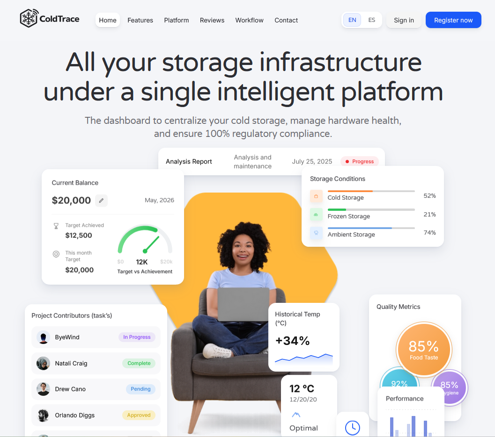

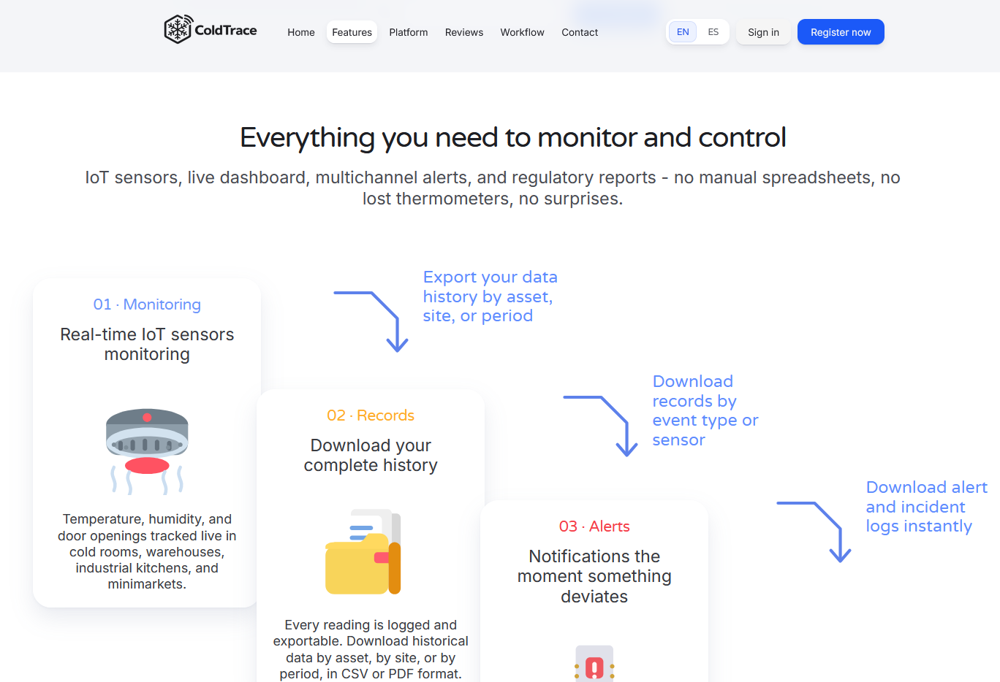

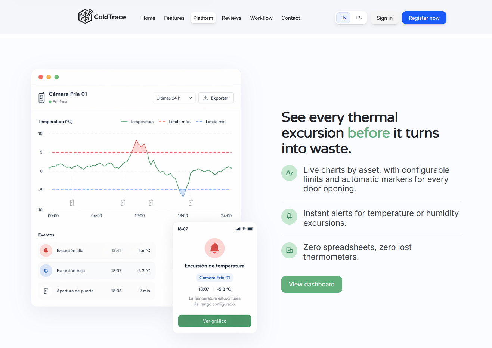

La navegación entre secciones se realiza mediante un menú fijo (navbar), facilitando la experiencia del usuario. Asimismo, la interfaz es responsive, adaptándose a distintos dispositivos.
#### 5.2.1.6. Services Documentation Evidence for Sprint Review

Durante el Sprint 1, no se implementaron Web Services ni endpoints documentados, debido a que el alcance del sprint estuvo enfocado en el desarrollo de la landing page y la simulación de funcionalidades del sistema ColdTrace a nivel frontend.

Sin embargo, como parte del diseño del sistema, se definieron de manera conceptual los principales endpoints que serán implementados en futuros sprints para soportar funcionalidades clave como monitoreo en tiempo real, gestión de alertas y registro de usuarios.

A continuación, se presentan los endpoints identificados:

<table border="1" cellpadding="6" cellspacing="0">
  <tr>
    <th>Endpoint</th>
    <th>Method</th>
    <th>Descripción</th>
    <th>Ejemplo de respuesta</th>
  </tr>

  <tr>
    <td>/api/temperature</td>
    <td>GET</td>
    <td>Obtiene los datos de temperatura registrados por los sensores</td>
    <td>{ "sensorId": "001", "temperature": 5.6, "timestamp": "2026-04-23" }</td>
  </tr>

  <tr>
    <td>/api/alerts</td>
    <td>GET</td>
    <td>Lista las alertas generadas por el sistema</td>
    <td>{ "alert": "Temperatura fuera de rango", "value": -5.3 }</td>
  </tr>

  <tr>
    <td>/api/users</td>
    <td>POST</td>
    <td>Permite registrar nuevos usuarios en la plataforma</td>
    <td>{ "status": "User created successfully" }</td>
  </tr>

</table>

La documentación formal de estos endpoints mediante OpenAPI, así como su implementación en Web Services, será desarrollada en los siguientes sprints del proyecto.

Asimismo, se prevé la integración con una arquitectura backend que permita la gestión de datos en tiempo real y la persistencia de información generada por los sensores IoT.

#### 5.2.1.7. Software Deployment Evidence for Sprint Review

Durante el Sprint 1 se realizó el despliegue de la landing page utilizando GitHub Pages, permitiendo publicar el proyecto en un entorno accesible desde la web.

El proceso incluyó la configuración del repositorio, la integración de cambios mediante Pull Requests y la automatización del despliegue.

** Deployment en GitHub Pages**

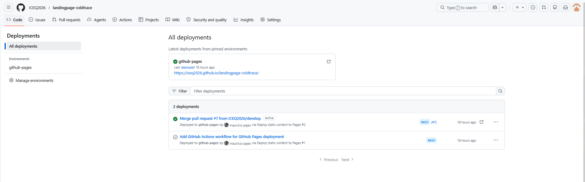

Se evidencia el despliegue exitoso del proyecto en GitHub Pages, mostrando el estado activo del entorno y la publicación reciente de la landing page.

**URL de despliegue:**
https://iceq2026.github.io/landingpage-coldtrace/

#### 5.2.1.8. Team Collaboration Insights during Sprint

Durante el Sprint 1, el equipo trabajó de manera colaborativa utilizando GitHub como herramienta principal de control de versiones.

Se utilizaron ramas feature para desarrollar funcionalidades de forma independiente, integrando cambios mediante Pull Requests hacia la rama principal.

---

**Analíticos de colaboración en GitHub**

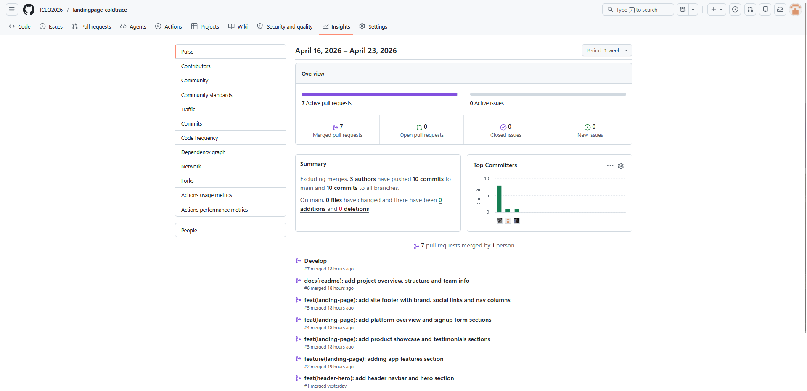

Se observa la actividad del repositorio, incluyendo commits realizados, pull requests y participación de los integrantes del equipo. Esto evidencia un trabajo colaborativo activo durante el Sprint.

---

El uso de Conventional Commits permitió mantener un historial organizado, diferenciando claramente entre funcionalidades (feat), documentación (docs) y configuración (chore).

Estas prácticas facilitaron la coordinación del equipo y la integración eficiente del desarrollo.

### 5.2.2. Sprint 2

#### 5.2.2.1. Sprint Planning 2

El Sprint 2 tuvo como objetivo principal desplegar la primera versión funcional de la Frontend Web Application de ColdTrace, cubriendo los bounded contexts de Identity & Access Management, Asset Management, Monitoring y Reports. A continuación se presenta el resumen del Sprint Planning Meeting realizado al inicio de este sprint.

<table border="1" cellpadding="6" cellspacing="0">
  <tr>
    <th>Sprint #</th>
    <td>Sprint 2</td>
  </tr>
  <tr>
    <th colspan="2">Sprint Planning Background</th>
  </tr>
  <tr>
    <th>Date</th>
    <td>2026-05-07</td>
  </tr>
  <tr>
    <th>Time</th>
    <td>08:00 PM</td>
  </tr>
  <tr>
    <th>Location</th>
    <td>Reunión virtual vía Google Meet</td>
  </tr>
  <tr>
    <th>Prepared By</th>
    <td>Pajés León, Mauricio Luis</td>
  </tr>
  <tr>
    <th>Attendees (to planning meeting)</th>
    <td>Morales Venegas, David Joel / Espinoza Paredes, Frezzia / Cabrera Novoa, Leonardo Moisés / Videla Ventura, Jorge Joseph / Pajés León, Mauricio Luis</td>
  </tr>
  <tr>
    <th>Sprint 1 Review Summary</th>
    <td>En el Sprint 1 se completó una primera versión funcional de la landing page de ColdTrace desplegada en GitHub Pages, con secciones de hero, features, showcase, pricing y footer. Se implementaron además las vistas básicas de dashboard, monitoreo y alertas como prueba de concepto del sistema. El equipo logró cumplir con el Sprint Goal y asegurar la coherencia visual entre la landing y la aplicación web. El despliegue fue exitoso y la landing page quedó accesible públicamente.</td>
  </tr>
  <tr>
    <th>Sprint 1 Retrospective Summary</th>
    <td>El equipo identificó que la distribución de tareas en el Sprint 1 fue desigual y que la comunicación entre integrantes podría mejorar. Como acción de mejora para el Sprint 2 se acordó dividir el trabajo por épicas y bounded contexts, asignar un responsable por aspecto funcional, e incorporar a todos los integrantes en la implementación del frontend distribuida según las épicas del product backlog.</td>
  </tr>
  <tr>
    <th colspan="2">Sprint Goal & User Stories</th>
  </tr>
  <tr>
    <th>Sprint 2 Goal</th>
    <td>Our focus is on delivering a fully navigable and deployed Frontend Web Application for ColdTrace operators and administrators. We believe it delivers a usable digital experience to cold chain operations managers and quality control staff, enabling them to manage assets, monitor temperature conditions, and consult operational reports. This will be confirmed when the application is accessible via its public Vercel URL and users can navigate across Identity & Access, Asset Management, Monitoring, and Reports modules without errors.</td>
  </tr>
  <tr>
    <th>Sprint 2 Velocity</th>
    <td>40 Story Points</td>
  </tr>
  <tr>
    <th>Sum of Story Points</th>
    <td>40 Story Points</td>
  </tr>
</table>

#### 5.2.2.2. Aspect Leaders and Collaborators

Durante el Sprint 2, el equipo organizó el trabajo en torno a los principales aspectos funcionales de la Frontend Web Application de ColdTrace. Cada aspecto corresponde a una épica del product backlog o a un conjunto de features dentro de un bounded context. Se designó un líder (L) por aspecto para asegurar la coherencia técnica y la toma de decisiones dentro de cada módulo, y se asignaron colaboradores (C) entre los demás integrantes del equipo.

Los aspectos principales del Sprint 2 fueron los siguientes:

- **Authentication & User Access (EP002):** Vistas de creación de cuenta, inicio de sesión, recuperación de contraseña y gestión de roles y permisos.
- **Asset Registration & Configuration (EP003):** Registro de cámaras frigoríficas, unidades de transporte, vinculación de sensores, emparejamiento de gateways, calibración y configuración avanzada de activos.
- **Operational Monitoring Dashboard (EP004):** Dashboard operacional con telemetría en tiempo real, KPIs y estado de activos monitoreados (US039).
- **Alerts & Incidents UI (EP005):** Estructura de navegación y vistas base para el módulo de alertas e incidencias.
- **Reports & Compliance (EP006):** Vistas de bitácora diaria, historial de eventos operacionales, exportación de reportes sanitarios, descarga mensual, hallazgos de cumplimiento y evidencia de auditoría (US029–US034).
- **Operative Configuration & Maintenance (EP007):** Configuración de rangos de seguridad, parámetros operativos del monitoreo y flujos de mantenimiento preventivo (US035–US038).
- **Deployment & Infrastructure:** Configuración del pipeline CI/CD en Vercel, servidor JSON hospedado y configuración del entorno de producción.

<table border="1" cellpadding="6" cellspacing="0">
  <tr>
    <th>Team Member (Last Name, First Name)</th>
    <th>GitHub Username</th>
    <th>Authentication &amp; User Access (EP002)</th>
    <th>Asset Registration &amp; Configuration (EP003)</th>
    <th>Operational Monitoring Dashboard (EP004)</th>
    <th>Alerts &amp; Incidents UI (EP005)</th>
    <th>Reports &amp; Compliance (EP006)</th>
    <th>Operative Configuration (EP007)</th>
    <th>Deployment &amp; Infrastructure</th>
  </tr>
  <tr>
    <td>Cabrera Novoa, Leonardo Moisés</td>
    <td>u202415820</td>
    <td>C</td>
    <td>C</td>
    <td>C</td>
    <td>C</td>
    <td>L</td>
    <td>C</td>
    <td>C</td>
  </tr>
  <tr>
    <td>Espinoza Paredes, Frezzia</td>
    <td>fflushh</td>
    <td>C</td>
    <td>C</td>
    <td>C</td>
    <td>C</td>
    <td>C</td>
    <td>L</td>
    <td>C</td>
  </tr>
  <tr>
    <td>Morales Venegas, David Joel</td>
    <td>David-std2</td>
    <td>C</td>
    <td>C</td>
    <td>L</td>
    <td>C</td>
    <td>C</td>
    <td>C</td>
    <td>C</td>
  </tr>
  <tr>
    <td>Pajés León, Mauricio Luis</td>
    <td>mauricio-pajes</td>
    <td>L</td>
    <td>L</td>
    <td>C</td>
    <td>C</td>
    <td>C</td>
    <td>C</td>
    <td>L</td>
  </tr>
  <tr>
    <td>Videla Ventura, Jorge Joseph</td>
    <td>JorgeVidVen</td>
    <td>C</td>
    <td>C</td>
    <td>C</td>
    <td>L</td>
    <td>C</td>
    <td>C</td>
    <td>C</td>
  </tr>
</table>

#### 5.2.2.3. Sprint Backlog 2

El objetivo principal del Sprint 2 fue implementar y desplegar la primera versión completa de la Frontend Web Application de ColdTrace, habilitando los flujos de autenticación, gestión de activos, monitoreo operacional y consulta de reportes de cumplimiento. El equipo gestionó el Sprint Backlog mediante Linear App, organizando las tareas por épica y bounded context.

A continuación se presenta una captura del backlog gestionado en Linear App:

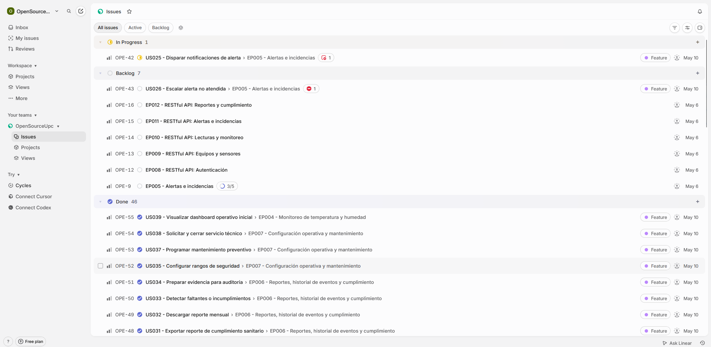
*Figura 5.2.2.3.1: Sprint Backlog del Sprint 2 en Linear App (46 issues Done, 1 In Progress, 7 Backlog).*

A continuación se presenta la tabla de control de estado del sprint.

<table border="1" cellpadding="6" cellspacing="0" style="border-collapse: collapse; text-align: center;">
  <tr>
    <th>Sprint #</th>
    <td colspan="7">Sprint 2</td>
  </tr>
  <tr>
    <th colspan="2">User Story</th>
    <th colspan="6">Work-Item / Task</th>
  </tr>
  <tr>
    <th>Id</th>
    <th>Title</th>
    <th>Id</th>
    <th>Title</th>
    <th>Description</th>
    <th>Estimation (Hours)</th>
    <th>Assigned To</th>
    <th>Status</th>
  </tr>

  <!-- EP002 - IDENTITY & ACCESS -->
  <tr>
    <td>US007</td>
    <td>Crear cuenta</td>
    <td>T-10</td>
    <td>Create Account UI</td>
    <td>Implementar formulario de creación de cuenta de usuario</td>
    <td>4</td>
    <td>Pajés León, Mauricio</td>
    <td>Done</td>
  </tr>
  <tr>
    <td>US008</td>
    <td>Iniciar sesión</td>
    <td>T-11</td>
    <td>Sign-In UI</td>
    <td>Implementar vista de inicio de sesión con validación de credenciales</td>
    <td>3</td>
    <td>Pajés León, Mauricio</td>
    <td>Done</td>
  </tr>
  <tr>
    <td>US009</td>
    <td>Recuperar contraseña</td>
    <td>T-12</td>
    <td>Password Recovery UI</td>
    <td>Implementar flujo de recuperación de contraseña por email</td>
    <td>3</td>
    <td>Pajés León, Mauricio</td>
    <td>Done</td>
  </tr>
  <tr>
    <td>US010</td>
    <td>Gestionar roles y permisos</td>
    <td>T-13</td>
    <td>Roles &amp; Permissions UI</td>
    <td>Implementar vista de administración de roles y permisos de usuario</td>
    <td>5</td>
    <td>Pajés León, Mauricio</td>
    <td>Done</td>
  </tr>

  <!-- EP003 - ASSET MANAGEMENT -->
  <tr>
    <td>US012</td>
    <td>Registrar cámara frigorífica</td>
    <td>T-14</td>
    <td>Cold Room Registration UI</td>
    <td>Implementar formulario de registro y listado de cámaras frigoríficas</td>
    <td>5</td>
    <td>Pajés León, Mauricio</td>
    <td>Done</td>
  </tr>
  <tr>
    <td>US013</td>
    <td>Registrar unidad de transporte</td>
    <td>T-15</td>
    <td>Transport Unit UI</td>
    <td>Implementar registro de unidades de transporte refrigerado</td>
    <td>4</td>
    <td>Pajés León, Mauricio</td>
    <td>Done</td>
  </tr>
  <tr>
    <td>US014</td>
    <td>Vincular sensor a activo</td>
    <td>T-16</td>
    <td>Sensor Linking UI</td>
    <td>Implementar flujo de vinculación de sensores IoT a activos registrados</td>
    <td>4</td>
    <td>Pajés León, Mauricio</td>
    <td>Done</td>
  </tr>
  <tr>
    <td>US015</td>
    <td>Emparejar gateway</td>
    <td>T-17</td>
    <td>Gateway Pairing UI</td>
    <td>Implementar emparejamiento de gateway con la plataforma</td>
    <td>4</td>
    <td>Pajés León, Mauricio</td>
    <td>Done</td>
  </tr>
  <tr>
    <td>US016</td>
    <td>Calibrar sensor</td>
    <td>T-18</td>
    <td>Sensor Calibration UI</td>
    <td>Implementar revisión y registro de calibración de sensores</td>
    <td>3</td>
    <td>Pajés León, Mauricio</td>
    <td>Done</td>
  </tr>
  <tr>
    <td>US017</td>
    <td>Actualizar activo</td>
    <td>T-19</td>
    <td>Asset Update UI</td>
    <td>Implementar flujo de actualización de datos y estado de activos</td>
    <td>4</td>
    <td>Pajés León, Mauricio</td>
    <td>Done</td>
  </tr>
  <tr>
    <td>US035</td>
    <td>Configurar parámetros de activo</td>
    <td>T-20</td>
    <td>Asset Settings &amp; IoT Params UI</td>
    <td>Implementar pantalla de configuración avanzada de activos y parámetros IoT</td>
    <td>5</td>
    <td>Pajés León, Mauricio</td>
    <td>Done</td>
  </tr>

  <!-- EP004 - MONITORING (David) -->
  <tr>
    <td>US018</td>
    <td>Visualizar temperatura en tiempo real</td>
    <td>T-21</td>
    <td>Real-Time Temperature View</td>
    <td>Implementar vista de monitoreo de temperatura en tiempo real por activo</td>
    <td>5</td>
    <td>Morales Venegas, David</td>
    <td>Done</td>
  </tr>
  <tr>
    <td>US019</td>
    <td>Visualizar humedad en tiempo real</td>
    <td>T-22</td>
    <td>Real-Time Humidity View</td>
    <td>Implementar vista de monitoreo de humedad en tiempo real por activo</td>
    <td>5</td>
    <td>Morales Venegas, David</td>
    <td>Done</td>
  </tr>
  <tr>
    <td>US020</td>
    <td>Consultar historial de lecturas</td>
    <td>T-23</td>
    <td>Readings History View</td>
    <td>Implementar vista de historial de lecturas de temperatura y humedad</td>
    <td>5</td>
    <td>Morales Venegas, David</td>
    <td>Done</td>
  </tr>
  <tr>
    <td>US021</td>
    <td>Detectar temperatura fuera de rango</td>
    <td>T-24</td>
    <td>Out-of-Range Detection View</td>
    <td>Implementar indicadores visuales de detección de temperatura fuera de rango seguro</td>
    <td>5</td>
    <td>Morales Venegas, David</td>
    <td>Done</td>
  </tr>
  <tr>
    <td>US022</td>
    <td>Visualizar estado de conectividad</td>
    <td>T-25</td>
    <td>Connectivity Status View</td>
    <td>Implementar vista del estado de conectividad de sensores y gateways</td>
    <td>4</td>
    <td>Morales Venegas, David</td>
    <td>Done</td>
  </tr>
  <tr>
    <td>US023</td>
    <td>Sincronizar datos almacenados offline</td>
    <td>T-26</td>
    <td>Offline Sync View</td>
    <td>Implementar vista de sincronización de datos almacenados sin conexión</td>
    <td>5</td>
    <td>Morales Venegas, David</td>
    <td>Done</td>
  </tr>
  <tr>
    <td>US039</td>
    <td>Visualizar dashboard operativo inicial</td>
    <td>T-27</td>
    <td>Operational Dashboard UI</td>
    <td>Implementar dashboard operacional con telemetría en vivo, KPIs y estado de activos monitoreados</td>
    <td>8</td>
    <td>Morales Venegas, David / Pajés León, Mauricio</td>
    <td>Done</td>
  </tr>

  <!-- EP005 - ALERTS (Jorge) -->
  <tr>
    <td>US024</td>
    <td>Crear incidencia térmica</td>
    <td>T-28</td>
    <td>Thermal Incident Creation UI</td>
    <td>Implementar vista de creación de incidencia térmica al detectar desviación</td>
    <td>4</td>
    <td>Videla Ventura, Jorge</td>
    <td>Done</td>
  </tr>
  <tr>
    <td>US025</td>
    <td>Disparar notificaciones de alerta</td>
    <td>T-29</td>
    <td>Alert Notification UI</td>
    <td>Implementar vista de notificaciones de alerta automáticas</td>
    <td>4</td>
    <td>Videla Ventura, Jorge</td>
    <td>In-Process</td>
  </tr>
  <tr>
    <td>US026</td>
    <td>Escalar alerta no atendida</td>
    <td>T-30</td>
    <td>Alert Escalation UI</td>
    <td>Implementar vista de escalamiento de alertas no atendidas</td>
    <td>4</td>
    <td>Videla Ventura, Jorge</td>
    <td>To-do</td>
  </tr>
  <tr>
    <td>US027</td>
    <td>Reconocer alerta crítica</td>
    <td>T-31</td>
    <td>Critical Alert Acknowledgement UI</td>
    <td>Implementar vista de reconocimiento de alertas críticas</td>
    <td>4</td>
    <td>Videla Ventura, Jorge</td>
    <td>Done</td>
  </tr>
  <tr>
    <td>US028</td>
    <td>Registrar acción correctiva y cerrar incidencia</td>
    <td>T-32</td>
    <td>Corrective Action UI</td>
    <td>Implementar vista de registro de acción correctiva y cierre de incidencia</td>
    <td>4</td>
    <td>Videla Ventura, Jorge</td>
    <td>Done</td>
  </tr>

  <!-- EP006 - REPORTS (Leonardo) -->
  <tr>
    <td>US029</td>
    <td>Generar bitácora diaria</td>
    <td>T-33</td>
    <td>Daily Log View</td>
    <td>Implementar vista de bitácora diaria de lecturas y eventos del sistema</td>
    <td>4</td>
    <td>Cabrera Novoa, Leonardo</td>
    <td>Done</td>
  </tr>
  <tr>
    <td>US030</td>
    <td>Consultar historial de eventos</td>
    <td>T-34</td>
    <td>Operational History View</td>
    <td>Implementar vista de historial de eventos operacionales</td>
    <td>4</td>
    <td>Cabrera Novoa, Leonardo</td>
    <td>Done</td>
  </tr>
  <tr>
    <td>US031</td>
    <td>Exportar reporte sanitario</td>
    <td>T-35</td>
    <td>Sanitary Compliance Export</td>
    <td>Implementar vista de exportación de reporte de cumplimiento sanitario</td>
    <td>4</td>
    <td>Cabrera Novoa, Leonardo</td>
    <td>Done</td>
  </tr>
  <tr>
    <td>US032</td>
    <td>Descargar reporte mensual</td>
    <td>T-36</td>
    <td>Monthly Report Download</td>
    <td>Implementar descarga de reporte mensual consolidado</td>
    <td>4</td>
    <td>Cabrera Novoa, Leonardo</td>
    <td>Done</td>
  </tr>
  <tr>
    <td>US033</td>
    <td>Detectar faltantes o incumplimientos</td>
    <td>T-37</td>
    <td>Compliance Findings View</td>
    <td>Implementar vista de hallazgos y faltantes de cumplimiento normativo</td>
    <td>4</td>
    <td>Cabrera Novoa, Leonardo</td>
    <td>Done</td>
  </tr>
  <tr>
    <td>US034</td>
    <td>Preparar evidencia para auditoría</td>
    <td>T-38</td>
    <td>Audit Evidence View</td>
    <td>Implementar vista de evidencia de auditoría con registros descargables</td>
    <td>4</td>
    <td>Cabrera Novoa, Leonardo</td>
    <td>Done</td>
  </tr>

  <!-- EP007 - OPERATIVE CONFIG -->
  <tr>
    <td>US035</td>
    <td>Configurar rangos de seguridad</td>
    <td>T-39</td>
    <td>Safety Range Settings UI</td>
    <td>Implementar vista de configuración de rangos seguros de temperatura y humedad por activo</td>
    <td>4</td>
    <td>Espinoza Paredes, Frezzia</td>
    <td>Done</td>
  </tr>
  <tr>
    <td>US036</td>
    <td>Actualizar parámetros operativos</td>
    <td>T-40</td>
    <td>Operational Parameters UI</td>
    <td>Implementar vista de actualización de parámetros operativos del monitoreo</td>
    <td>4</td>
    <td>Espinoza Paredes, Frezzia</td>
    <td>Done</td>
  </tr>
  <tr>
    <td>US037</td>
    <td>Programar mantenimiento preventivo</td>
    <td>T-41</td>
    <td>Preventive Maintenance UI</td>
    <td>Implementar vista de programación y seguimiento de mantenimiento preventivo</td>
    <td>4</td>
    <td>Espinoza Paredes, Frezzia</td>
    <td>Done</td>
  </tr>
  <tr>
    <td>US038</td>
    <td>Solicitar y cerrar servicio técnico</td>
    <td>T-42</td>
    <td>Technical Service UI</td>
    <td>Implementar vista de solicitud y cierre de servicio técnico</td>
    <td>4</td>
    <td>Espinoza Paredes, Frezzia</td>
    <td>Done</td>
  </tr>

  <!-- DEPLOYMENT -->
  <tr>
    <td>-</td>
    <td>Despliegue continuo</td>
    <td>T-43</td>
    <td>Vercel CI/CD &amp; JSON Server Setup</td>
    <td>Configurar despliegue automático en Vercel con preview por branch y servidor JSON hospedado</td>
    <td>3</td>
    <td>Pajés León, Mauricio</td>
    <td>Done</td>
  </tr>
</table>

#### 5.2.2.4. Development Evidence for Sprint Review

Durante el Sprint 2 se realizó la implementación completa de la Frontend Web Application de ColdTrace utilizando Angular Framework, aplicando la arquitectura de bounded contexts definida en el diseño de la solución. Todos los commits se realizaron en el repositorio `ICEQ2026/coldtrace-frontend` aplicando Conventional Commits y GitFlow con ramas `feature/` por cada User Story.

<table border="1" cellpadding="6" cellspacing="0" style="border-collapse: collapse;">
  <tr>
    <th>Repository</th>
    <th>Branch</th>
    <th>Commit Id</th>
    <th>Commit Message</th>
    <th>Commit Message Body</th>
    <th>Committed on (Date)</th>
  </tr>
  <tr>
    <td>ICEQ2026/coldtrace-frontend</td>
    <td>feature/create-account-ui</td>
    <td>0e1dc25</td>
    <td>feat(identity-access): add create account UI</td>
    <td>Implementación del formulario de creación de cuenta de usuario</td>
    <td>07/05/2026</td>
  </tr>
  <tr>
    <td>ICEQ2026/coldtrace-frontend</td>
    <td>feature/sign-in-up</td>
    <td>7805078</td>
    <td>feat(identity-access): add sign-in UI</td>
    <td>Implementación de la vista de inicio de sesión</td>
    <td>08/05/2026</td>
  </tr>
  <tr>
    <td>ICEQ2026/coldtrace-frontend</td>
    <td>feature/password-recovery-ui</td>
    <td>600c8bb</td>
    <td>feat(identity-access): add password recovery UI</td>
    <td>Implementación del flujo de recuperación de contraseña</td>
    <td>08/05/2026</td>
  </tr>
  <tr>
    <td>ICEQ2026/coldtrace-frontend</td>
    <td>feature/roles-permissions-ui</td>
    <td>ac9cf25</td>
    <td>feat(identity-access): add roles permissions ui</td>
    <td>Implementación de vista de administración de roles y permisos</td>
    <td>09/05/2026</td>
  </tr>
  <tr>
    <td>ICEQ2026/coldtrace-frontend</td>
    <td>feature/cold-room-ui</td>
    <td>6b973b6</td>
    <td>feat(asset-management): add cold room registration</td>
    <td>Implementación del registro de cámaras frigoríficas</td>
    <td>09/05/2026</td>
  </tr>
  <tr>
    <td>ICEQ2026/coldtrace-frontend</td>
    <td>feature/transport-unit-ui</td>
    <td>8271aac</td>
    <td>feat(asset-management): add transport unit registration</td>
    <td>Implementación del registro de unidades de transporte refrigerado</td>
    <td>09/05/2026</td>
  </tr>
  <tr>
    <td>ICEQ2026/coldtrace-frontend</td>
    <td>feature/sensor-linking-ui</td>
    <td>7e3c90b</td>
    <td>feat(asset-management): add sensor asset linking</td>
    <td>Implementación del flujo de vinculación de sensores a activos</td>
    <td>09/05/2026</td>
  </tr>
  <tr>
    <td>ICEQ2026/coldtrace-frontend</td>
    <td>feature/gateway-pairing-ui</td>
    <td>56b97d3</td>
    <td>feat(asset-management): add gateway pairing</td>
    <td>Implementación del emparejamiento de gateway</td>
    <td>09/05/2026</td>
  </tr>
  <tr>
    <td>ICEQ2026/coldtrace-frontend</td>
    <td>feature/sensor-calibration-ui</td>
    <td>7fa8b62</td>
    <td>feat(asset-management): add sensor calibration review</td>
    <td>Implementación de la revisión y registro de calibración de sensores</td>
    <td>09/05/2026</td>
  </tr>
  <tr>
    <td>ICEQ2026/coldtrace-frontend</td>
    <td>feature/asset-update-ui</td>
    <td>7c3afb8</td>
    <td>feat(asset-management): add asset update flow</td>
    <td>Implementación del flujo de actualización de activos</td>
    <td>09/05/2026</td>
  </tr>
  <tr>
    <td>ICEQ2026/coldtrace-frontend</td>
    <td>feature/asset-settings-ui</td>
    <td>789ea56</td>
    <td>feat(asset-management): add asset settings UI</td>
    <td>Implementación de pantalla de configuración avanzada de activos</td>
    <td>09/05/2026</td>
  </tr>
  <tr>
    <td>ICEQ2026/coldtrace-frontend</td>
    <td>feature/iot-device-parameters</td>
    <td>c33ad7e</td>
    <td>feat(asset-management): support iot device parameters</td>
    <td>Adición de soporte para parámetros de dispositivos IoT</td>
    <td>11/05/2026</td>
  </tr>
  <tr>
    <td>ICEQ2026/coldtrace-frontend</td>
    <td>feature/US039-operational-dashboard</td>
    <td>e51c9da</td>
    <td>feat(monitoring): add data-driven operational dashboard and refactor visual components</td>
    <td>Implementación del dashboard con datos reales y refactorización de componentes visuales</td>
    <td>11/05/2026</td>
  </tr>
  <tr>
    <td>ICEQ2026/coldtrace-frontend</td>
    <td>feature/US039-operational-dashboard</td>
    <td>b5198ae</td>
    <td>feat(monitoring): operational dashboard with live telemetry (US039)</td>
    <td>Implementación del dashboard operacional con telemetría en vivo</td>
    <td>11/05/2026</td>
  </tr>
  <tr>
    <td>ICEQ2026/coldtrace-frontend</td>
    <td>develop</td>
    <td>57c2200</td>
    <td>feat: implement asset monitoring dashboard</td>
    <td>Implementación del dashboard de monitoreo de activos</td>
    <td>12/05/2026</td>
  </tr>
  <tr>
    <td>ICEQ2026/coldtrace-frontend</td>
    <td>develop</td>
    <td>5d84982</td>
    <td>chore: sync db.json</td>
    <td>Sincronización de base de datos JSON del servidor provisional</td>
    <td>12/05/2026</td>
  </tr>
  <tr>
    <td>ICEQ2026/coldtrace-frontend</td>
    <td>develop</td>
    <td>dd74863</td>
    <td>feat(shared): implement accordion toggle for access menu in sidebar</td>
    <td>Implementación del toggle tipo accordion para el menú de acceso en la barra lateral</td>
    <td>12/05/2026</td>
  </tr>
  <tr>
    <td>ICEQ2026/coldtrace-frontend</td>
    <td>feature/US029-daily-log</td>
    <td>e531330</td>
    <td>feat(reports): add reports bounded context with daily log</td>
    <td>Creación del bounded context de reportes con la vista de bitácora diaria</td>
    <td>12/05/2026</td>
  </tr>
  <tr>
    <td>ICEQ2026/coldtrace-frontend</td>
    <td>feature/US030-history-events</td>
    <td>83ed5a3</td>
    <td>feat(reports): add US030 operational history events view</td>
    <td>Implementación de la vista de historial de eventos operacionales</td>
    <td>12/05/2026</td>
  </tr>
  <tr>
    <td>ICEQ2026/coldtrace-frontend</td>
    <td>feature/US031-sanitary-compliance-export</td>
    <td>3222041</td>
    <td>feat(reports): add US031 sanitary compliance export view</td>
    <td>Implementación de la vista de exportación de reporte sanitario</td>
    <td>12/05/2026</td>
  </tr>
  <tr>
    <td>ICEQ2026/coldtrace-frontend</td>
    <td>feature/US032-monthly-report-download</td>
    <td>3cfaef3</td>
    <td>feat(reports): add US032 monthly report download view</td>
    <td>Implementación de la descarga de reporte mensual consolidado</td>
    <td>12/05/2026</td>
  </tr>
  <tr>
    <td>ICEQ2026/coldtrace-frontend</td>
    <td>feature/US033-compliance-findings</td>
    <td>f546d40</td>
    <td>feat(reports): add US033 compliance findings view</td>
    <td>Implementación de la vista de hallazgos de cumplimiento normativo</td>
    <td>12/05/2026</td>
  </tr>
  <tr>
    <td>ICEQ2026/coldtrace-frontend</td>
    <td>feature/US034-audit-evidence</td>
    <td>eeed5c6</td>
    <td>feat(reports): add US034 audit evidence view</td>
    <td>Implementación de la vista de evidencia de auditoría</td>
    <td>12/05/2026</td>
  </tr>
  <tr>
    <td>ICEQ2026/coldtrace-frontend</td>
    <td>feature/US027-recognize-critical-alert</td>
    <td>859ae1d</td>
    <td>feat: implement recognize critical alert feature including domain, infrastructure, application and presentation layers</td>
    <td>Implementación completa del feature de reconocimiento de alerta crítica con capas de dominio, infraestructura, aplicación y presentación</td>
    <td>12/05/2026</td>
  </tr>
  <tr>
    <td>ICEQ2026/coldtrace-frontend</td>
    <td>feature/US035-safety-range-settings</td>
    <td>—</td>
    <td>feat(asset-management): add safety range settings UI</td>
    <td>Implementación de la vista de configuración de rangos seguros de temperatura y humedad</td>
    <td>12/05/2026</td>
  </tr>
  <tr>
    <td>ICEQ2026/coldtrace-frontend</td>
    <td>feature/US036-operational-parameters</td>
    <td>—</td>
    <td>feat(asset-management): add operational parameters UI</td>
    <td>Implementación de la vista de actualización de parámetros operativos del monitoreo</td>
    <td>12/05/2026</td>
  </tr>
  <tr>
    <td>ICEQ2026/coldtrace-frontend</td>
    <td>feature/US037-preventive-maintenance</td>
    <td>—</td>
    <td>feat(asset-management): add preventive maintenance UI</td>
    <td>Implementación de la vista de programación de mantenimiento preventivo</td>
    <td>12/05/2026</td>
  </tr>
  <tr>
    <td>ICEQ2026/coldtrace-frontend</td>
    <td>feature/US038-technical-service</td>
    <td>—</td>
    <td>feat(asset-management): add technical service request UI</td>
    <td>Implementación de la vista de solicitud y cierre de servicio técnico</td>
    <td>12/05/2026</td>
  </tr>
  <tr>
    <td>ICEQ2026/coldtrace-frontend</td>
    <td>develop</td>
    <td>069b6cf</td>
    <td>chore(deploy): configure hosted json server</td>
    <td>Configuración del servidor JSON hospedado para soporte de datos en el despliegue</td>
    <td>12/05/2026</td>
  </tr>
  <tr>
    <td>ICEQ2026/coldtrace-frontend</td>
    <td>develop</td>
    <td>b5dfe86</td>
    <td>docs: document frontend implementation</td>
    <td>Documentación de la implementación del frontend en el README del repositorio</td>
    <td>12/05/2026</td>
  </tr>
</table>

#### 5.2.2.5. Execution Evidence for Sprint Review

Al término del Sprint 2, se desplegó la primera versión funcional de la Frontend Web Application de ColdTrace en Vercel, accesible públicamente. La aplicación permite navegar a través de los módulos de autenticación, gestión de activos, monitoreo operacional y reportes de cumplimiento. A continuación se presentan las principales vistas implementadas durante el sprint.

**Identity & Access – Autenticación y gestión de usuarios**

La plataforma cuenta con vistas de creación de cuenta, inicio de sesión y recuperación de contraseña, así como una pantalla de administración de roles y permisos para usuarios con perfil administrador.

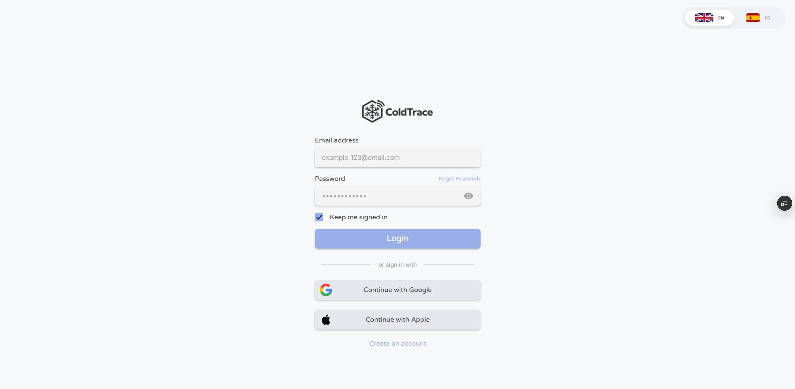
*Figura 5.2.2.5.1: Vista de Inicio de Sesión (Sign-In).*

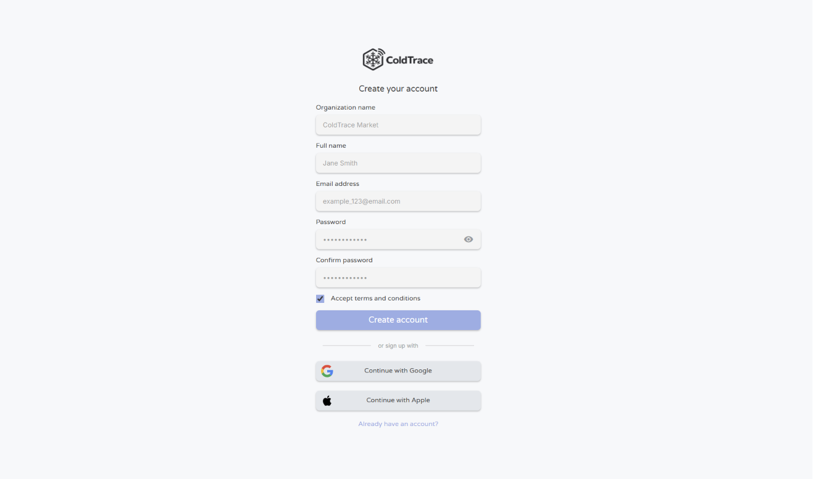
*Figura 5.2.2.5.2: Vista de Registro de Cuenta (Sign-Up).*

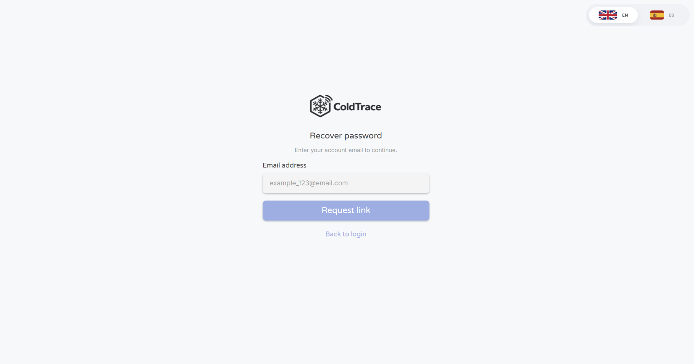
*Figura 5.2.2.5.3: Vista de Recuperación de Contraseña.*

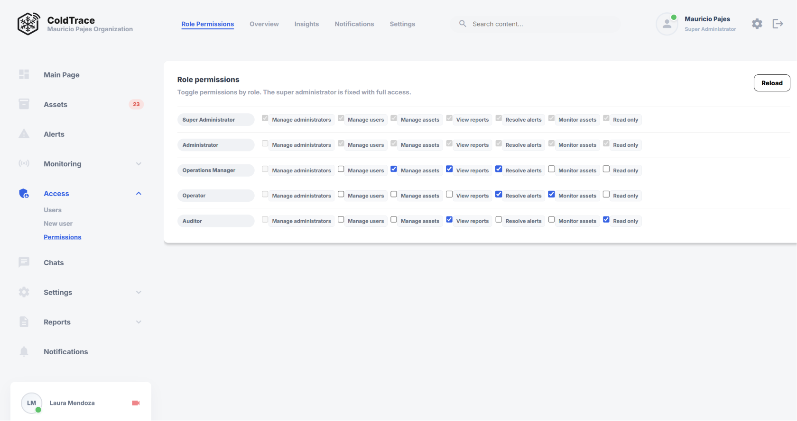
*Figura 5.2.2.5.4: Administración de Roles y Permisos.*

**Asset Management – Gestión de activos e infraestructura IoT**

Se implementó el módulo completo de gestión de activos, incluyendo el registro de cámaras frigoríficas, unidades de transporte, vinculación de sensores IoT, emparejamiento de gateways, calibración y configuración avanzada de parámetros de dispositivos.

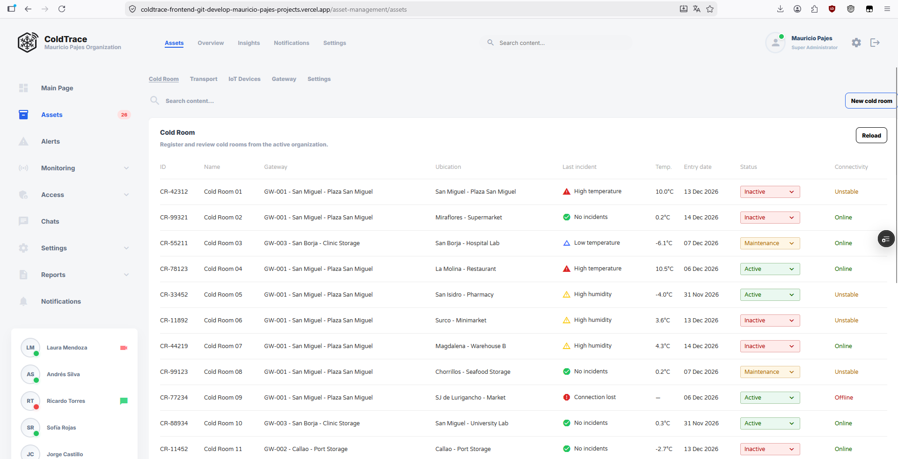
*Figura 5.2.2.5.5: Listado y Gestión de Cámaras Frigoríficas.*

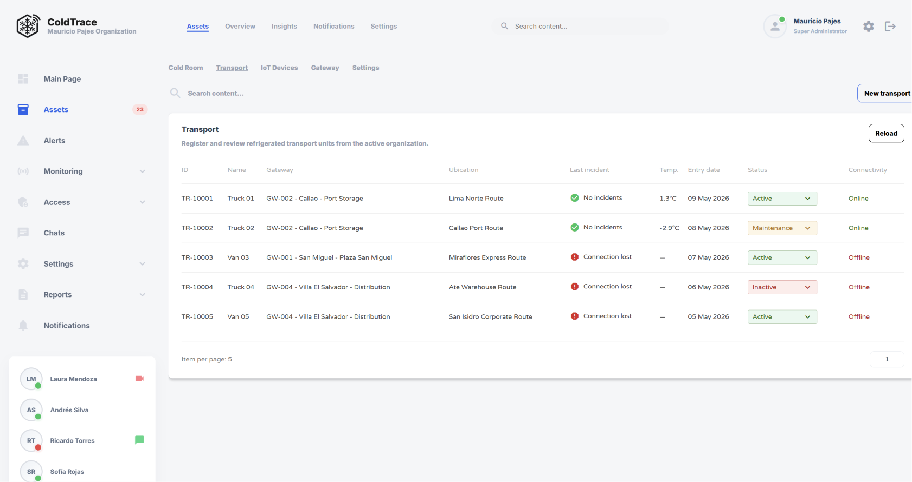
*Figura 5.2.2.5.6: Registro de Unidades de Transporte.*

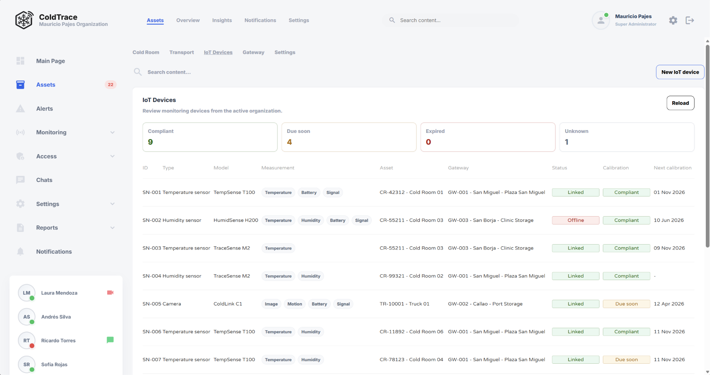
*Figura 5.2.2.5.7: Vinculación de Sensores y Gateways IoT.*

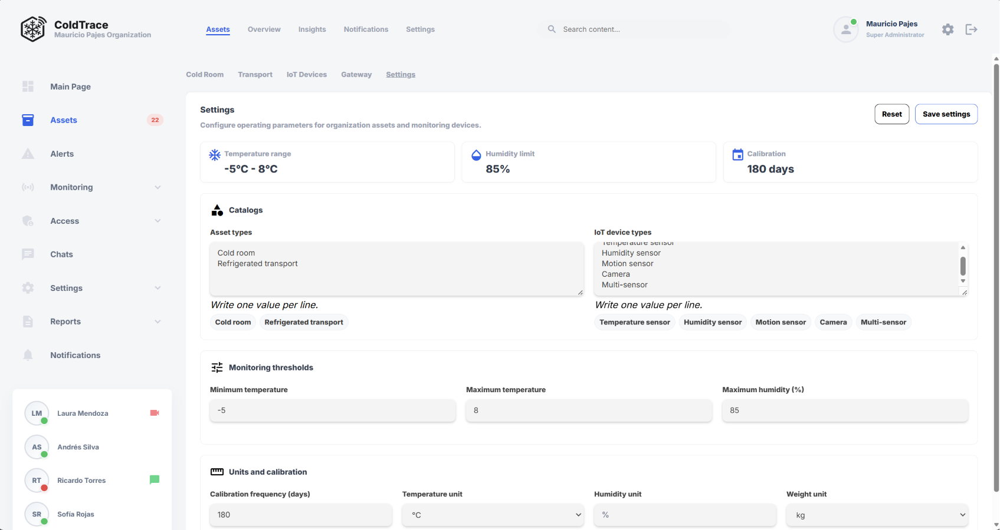
*Figura 5.2.2.5.8: Configuración Avanzada y Parámetros Operativos.*

**Monitoring – Dashboard operacional (US039)**

El dashboard operacional muestra en tiempo real el estado de los activos monitoreados, KPIs de temperatura, alertas activas y telemetría de sensores. Los datos se consumen desde el servidor JSON configurado como backend provisional.

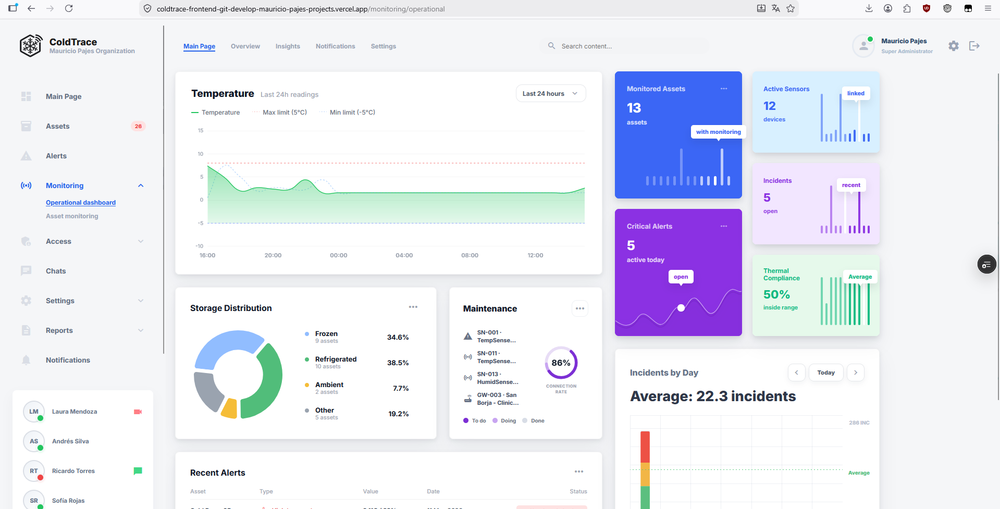
*Figura 5.2.2.5.9: Dashboard Operacional con Telemetría en Tiempo Real.*

**Reports – Reportes y cumplimiento normativo (US029–US034)**

El módulo de reportes incluye seis vistas: bitácora diaria, historial de eventos operacionales, exportación de reportes sanitarios, descarga de reportes mensuales, hallazgos de cumplimiento y evidencia de auditoría.

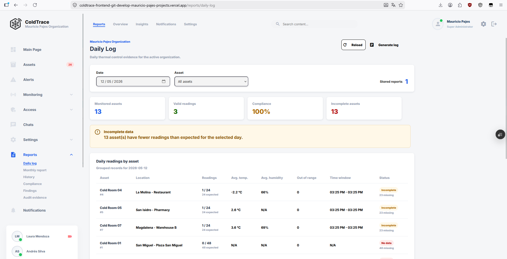
*Figura 5.2.2.5.10: Bitácora Diaria de Operaciones.*

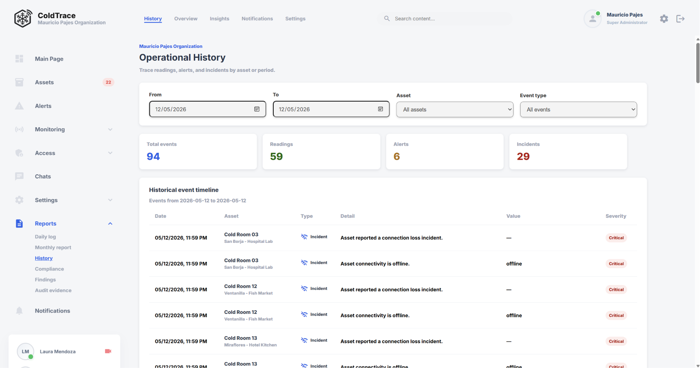
*Figura 5.2.2.5.11: Historial de Eventos Operacionales.*

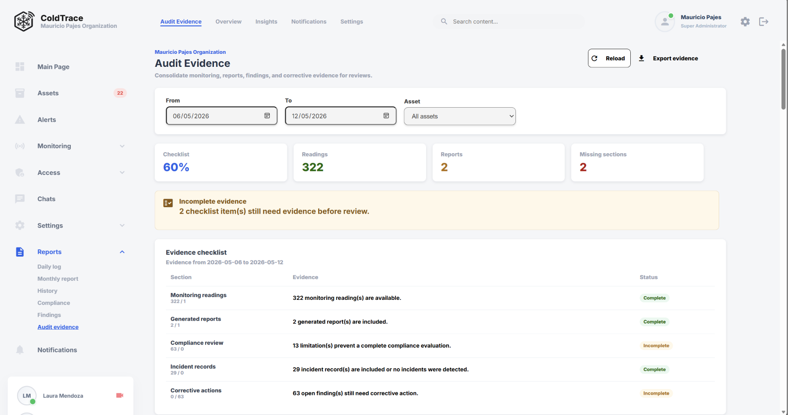
*Figura 5.2.2.5.12: Hallazgos de Cumplimiento y Evidencia de Auditoría.*

> **Video de navegación del producto:** [upc-pre-202610-1asi0729-10177-coldtrace-productnav-sprint-2] — *[URL pendiente de subir a Microsoft Stream]*

#### 5.2.2.6. Services Documentation Evidence for Sprint Review

Durante el Sprint 2 no se desplegaron Web Services propios (RESTful API), dado que el alcance del sprint estuvo centrado en la implementación del frontend. Para soportar el funcionamiento de la aplicación en producción, el equipo configuró un servidor JSON hospedado (`json-server`) que actúa como API provisional, permitiendo que el frontend consuma datos estructurados mediante endpoints REST simulados.

A continuación se documentan los principales endpoints del servidor JSON que el frontend consume durante este sprint:

<table border="1" cellpadding="6" cellspacing="0">
  <tr>
    <th>Endpoint</th>
    <th>Verb HTTP</th>
    <th>Descripción</th>
    <th>Ejemplo de Response</th>
  </tr>
  <tr>
    <td>/assets</td>
    <td>GET</td>
    <td>Retorna la lista de activos registrados (cámaras frigoríficas, unidades de transporte)</td>
    <td>{ "id": "1", "name": "Cámara 01", "type": "cold_room", "status": "active" }</td>
  </tr>
  <tr>
    <td>/assets/:id</td>
    <td>GET</td>
    <td>Retorna el detalle de un activo específico por ID</td>
    <td>{ "id": "1", "name": "Cámara 01", "temperature": 4.2, "humidity": 78 }</td>
  </tr>
  <tr>
    <td>/assets</td>
    <td>POST</td>
    <td>Registra un nuevo activo en la plataforma</td>
    <td>{ "id": "5", "name": "Unidad Truck-03", "type": "transport_unit" }</td>
  </tr>
  <tr>
    <td>/gateways</td>
    <td>GET</td>
    <td>Retorna la lista de gateways IoT registrados y su estado de conectividad</td>
    <td>{ "id": "g1", "name": "Gateway A", "status": "connected" }</td>
  </tr>
  <tr>
    <td>/iot-devices</td>
    <td>GET</td>
    <td>Retorna la lista de sensores IoT vinculados a activos</td>
    <td>{ "id": "s1", "assetId": "1", "type": "temperature", "lastReading": 4.2 }</td>
  </tr>
  <tr>
    <td>/telemetry</td>
    <td>GET</td>
    <td>Retorna lecturas de telemetría para el dashboard operacional</td>
    <td>{ "assetId": "1", "temperature": 4.1, "humidity": 79, "timestamp": "2026-05-12T20:00:00Z" }</td>
  </tr>
  <tr>
    <td>/reports/daily-log</td>
    <td>GET</td>
    <td>Retorna entradas de la bitácora diaria de operaciones</td>
    <td>{ "date": "2026-05-12", "asset": "Cámara 01", "event": "Lectura normal", "value": 4.2 }</td>
  </tr>
  <tr>
    <td>/reports/compliance</td>
    <td>GET</td>
    <td>Retorna el reporte de cumplimiento sanitario del periodo</td>
    <td>{ "period": "2026-05", "status": "compliant", "findings": 0 }</td>
  </tr>
  <tr>
    <td>/users</td>
    <td>GET</td>
    <td>Retorna la lista de usuarios registrados en la plataforma</td>
    <td>{ "id": "u1", "name": "Admin", "role": "administrator" }</td>
  </tr>
  <tr>
    <td>/roles</td>
    <td>GET</td>
    <td>Retorna los roles definidos en el sistema y sus permisos asociados</td>
    <td>{ "id": "r1", "name": "operator", "permissions": ["read:assets", "read:reports"] }</td>
  </tr>
</table>

La implementación formal del RESTful API con Spring Boot será abordada en el Sprint 3, donde se desarrollarán y documentarán los endpoints reales mediante OpenAPI/Swagger.

#### 5.2.2.7. Software Deployment Evidence for Sprint Review

Durante el Sprint 2 se configuró el despliegue continuo de la Frontend Web Application de ColdTrace mediante Vercel, integrando el repositorio `ICEQ2026/coldtrace-frontend` con un pipeline de CI/CD automático. Cada push a una rama `feature/` genera un Preview Deployment, mientras que los merges a `develop` actualizan el entorno de desarrollo. Al cierre del sprint el repositorio acumuló 135 deployments exitosos.

**Pasos realizados para el despliegue:**

1. Se conectó el repositorio `ICEQ2026/coldtrace-frontend` al proyecto en Vercel desde el dashboard de la plataforma.

2. Se configuró el proyecto Angular para que Vercel detecte automáticamente el framework y ejecute `ng build` como comando de construcción, apuntando a `dist/coldtrace-frontend/browser` como directorio de salida.

3. Se habilitó la integración con GitHub Actions para que cada Pull Request exponga el URL del Preview Deployment como status check en el repositorio, facilitando la revisión visual de cada feature antes de su merge.

4. Se configuró un servidor JSON hospedado como backend provisional, desplegado también en Vercel, para que el frontend consuma datos estructurados desde producción.

5. Se verificó el correcto funcionamiento del build en producción, incluyendo el enrutamiento de Angular con `redirects` configurados en `vercel.json`.

**URL de despliegue del frontend:**
https://coldtrace-frontend-liard.vercel.app

A continuación se presenta la evidencia del despliegue en Vercel:

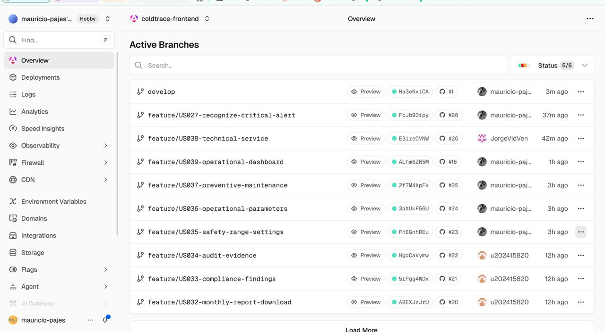
*Figura 5.2.2.7.1: Branches activos con sus Preview Deployments en Vercel, mostrando los PRs #16–#28 y los contributors por branch.*

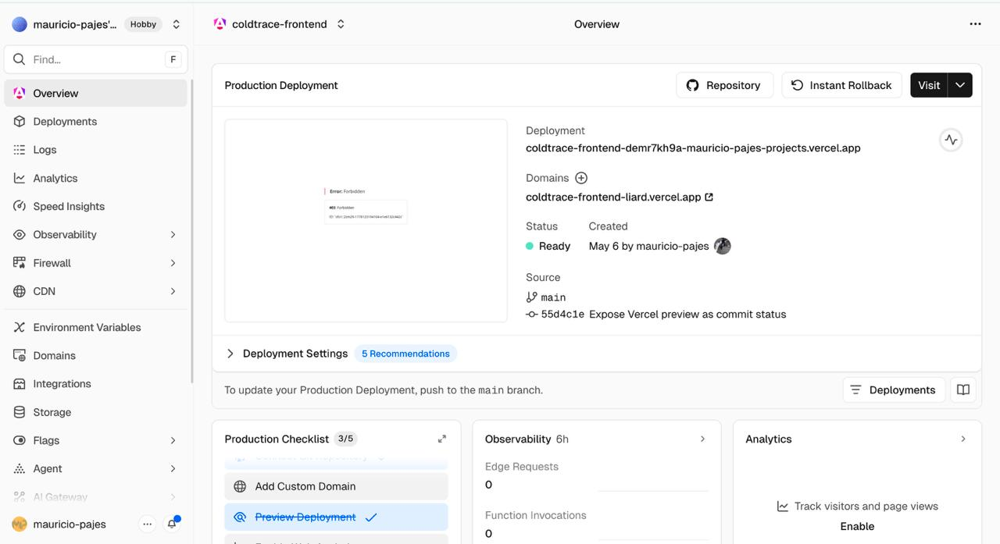
*Figura 5.2.2.7.2: Production Deployment overview en Vercel — Status Ready, dominio coldtrace-frontend-liard.vercel.app.*

#### 5.2.2.8. Team Collaboration Insights during Sprint

Durante el Sprint 2, el equipo trabajó de forma colaborativa en el repositorio `ICEQ2026/coldtrace-frontend`, aplicando GitFlow con ramas `feature/` por cada User Story y fusionando los cambios hacia `develop` mediante Pull Requests revisados. La distribución del trabajo refleja la organización por épicas acordada en el Sprint Planning: Mauricio Pajés lideró la implementación de EP002 (Identity & Access) y EP003 (Asset Management), David Morales encabezó el desarrollo del dashboard operacional de EP004, y Leonardo Cabrera implementó la totalidad del bounded context de reportes EP006 (US029–US034).

A continuación se presenta el resumen de participación por integrante basado en el historial de commits del repositorio:

<table border="1" cellpadding="6" cellspacing="0">
  <tr>
    <th>Integrante</th>
    <th>GitHub Username</th>
    <th>Commits (Sprint 2)</th>
    <th>Épicas / Bounded Contexts trabajados</th>
  </tr>
  <tr>
    <td>Pajés León, Mauricio Luis</td>
    <td>mauricio-pajes</td>
    <td>~33</td>
    <td>EP002 Identity &amp; Access, EP003 Asset Management, EP004 Monitoring, Deployment</td>
  </tr>
  <tr>
    <td>Cabrera Novoa, Leonardo Moisés</td>
    <td>u202415820</td>
    <td>~19</td>
    <td>EP006 Reports &amp; Compliance (US029–US034)</td>
  </tr>
  <tr>
    <td>Morales Venegas, David Joel</td>
    <td>David-std2</td>
    <td>~5</td>
    <td>EP004 Operational Monitoring Dashboard (US039, monitoring dashboard, sidebar)</td>
  </tr>
  <tr>
    <td>Espinoza Paredes, Frezzia</td>
    <td>fflushh</td>
    <td>4</td>
    <td>EP007 Operative Configuration &amp; Maintenance (US035–US038)</td>
  </tr>
  <tr>
    <td>Videla Ventura, Jorge Joseph</td>
    <td>JorgeVidVen</td>
    <td>1</td>
    <td>EP005 Alerts &amp; Incidents (US027 – recognize critical alert)</td>
  </tr>
</table>

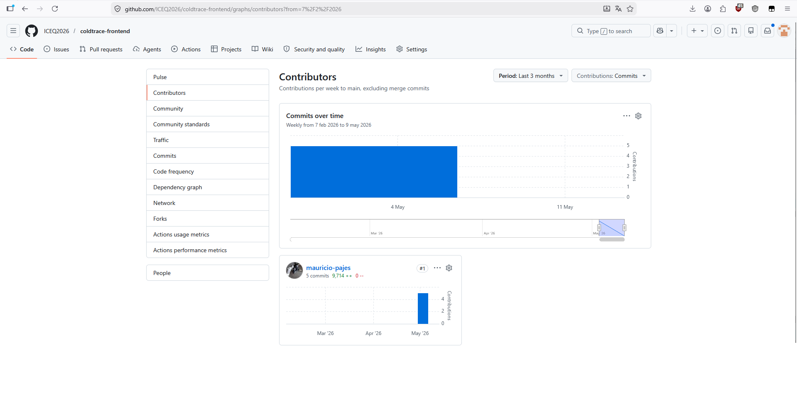
*Figura 5.2.2.8.1: Gráfico de contribuciones por integrante – repositorio coldtrace-frontend (contributors to main branch).*

El equipo utilizó Pull Requests como mecanismo de integración, alcanzando un total de 22 PRs mergeados durante el sprint. El uso de Conventional Commits permitió mantener un historial organizado, diferenciando claramente entre funcionalidades nuevas (`feat`), correcciones (`fix`), configuración (`chore`) y documentación (`docs`).
